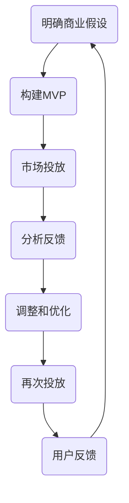

                 

### 文章标题

**《如何利用精益创业方法快速验证商业模式》**

> **关键词：** 精益创业、商业模式验证、快速迭代、用户反馈、MVP

**摘要：** 本文将深入探讨精益创业方法在商业模式验证中的关键作用。通过理解精益创业的核心原理，读者将学会如何通过构建最小可行产品（MVP）来测试市场假设，获取用户反馈，并进行快速迭代，从而提高创业项目的成功概率。文章将结合实际案例，提供详细的操作步骤和实用工具推荐，帮助创业者实现商业模式的快速验证。

### 1. 背景介绍

在当今快速变化的市场环境中，创业不再是少数人的专利，越来越多的个人和团队加入了创业的行列。然而，创业的成功并非易事，许多初创企业因为缺乏清晰的商业模式和市场定位而早早夭折。据统计，有高达90%的初创企业在5年内失败，其中很多原因在于对市场需求的误判和商业模式的验证不足。

传统商业模式验证的方法通常包括市场研究、竞争分析和商业计划书撰写等。这些方法虽然能够提供一定的市场信息，但往往耗时长、成本高，且难以捕捉到市场的动态变化。此外，这些方法还可能因为缺乏用户直接反馈而导致商业模式与市场需求脱节。

在这样的背景下，精益创业方法应运而生。精益创业（Lean Startup）是由埃里克·莱斯（Eric Ries）在《精益创业》一书中提出的一种创业方法论。它强调快速迭代、最小可行性产品和用户反馈，旨在通过不断验证和调整商业模式，提高创业项目的存活率和成功率。

精益创业方法的核心思想是“验证-学习-调整”的循环。创业者通过构建最小可行产品（Minimum Viable Product，简称MVP），将产品快速推向市场，获取用户反馈，然后根据反馈进行快速迭代和调整，从而不断接近市场的真实需求。这种方法不仅降低了创业的风险，还提高了创业的效率和成功率。

### 2. 核心概念与联系

#### 2.1 精益创业的核心概念

精益创业的核心概念包括最小可行产品（MVP）、用户反馈和快速迭代。

**最小可行产品（MVP）：** MVP是指具有足够功能的产品，可以验证创始人的核心商业假设，同时尽可能地减少开发成本和时间。MVP不一定要完美，但一定要具备核心功能，可以满足用户的基本需求。

**用户反馈：** 用户反馈是精益创业方法的核心，通过收集和分析用户的反馈，创业者可以了解市场的真实需求和痛点，从而做出相应的调整。

**快速迭代：** 快速迭代是指创业团队在获取用户反馈后，快速进行调整和改进，不断优化产品，使其更接近市场需求。

#### 2.2 商业模式验证的流程

商业模式验证的流程通常包括以下几个步骤：

1. **明确商业假设：** 定义产品的核心功能和目标用户群体。
2. **构建MVP：** 设计并开发具有核心功能的MVP。
3. **市场投放：** 将MVP推向市场，收集用户反馈。
4. **分析反馈：** 分析用户反馈，了解用户需求和痛点。
5. **调整和优化：** 根据用户反馈进行产品的调整和优化。
6. **再次投放：** 重新将优化后的产品推向市场，进行新一轮的反馈收集。

#### 2.3 Mermaid 流程图

下面是精益创业方法中商业模式验证的流程图，使用了Mermaid语法进行绘制。



在流程图中，节点表示具体的操作步骤，箭头表示步骤之间的依赖关系。通过这个流程图，我们可以清晰地看到商业模式验证的每个步骤以及它们之间的联系。

### 3. 核心算法原理 & 具体操作步骤

#### 3.1 最小可行产品（MVP）的构建

构建MVP是精益创业方法中的关键步骤，以下是具体操作步骤：

1. **明确核心功能：** 确定产品的核心功能，这些功能应该能够解决用户的核心问题。
2. **简化非核心功能：** 去除非核心功能，以降低开发成本和时间。
3. **设计用户体验：** 设计简单易用的用户界面，确保用户可以轻松使用产品。
4. **快速开发：** 使用敏捷开发方法，快速构建MVP。

#### 3.2 用户反馈的收集

收集用户反馈是验证商业模式的关键，以下是具体操作步骤：

1. **选择合适的方法：** 如用户调研、用户访谈、在线问卷等。
2. **设计反馈机制：** 在产品中嵌入反馈功能，让用户可以方便地提供反馈。
3. **分析反馈：** 收集反馈后，对用户的需求和痛点进行分析。
4. **总结反馈结果：** 撰写反馈报告，总结用户的反馈结果。

#### 3.3 快速迭代的实现

快速迭代是精益创业方法的核心，以下是具体操作步骤：

1. **确定迭代周期：** 根据实际情况，确定每次迭代的周期，如每周或每月。
2. **制定迭代计划：** 根据用户反馈，制定具体的迭代计划，包括要解决的问题和改进的功能。
3. **执行迭代计划：** 完成迭代计划的开发任务。
4. **测试和发布：** 对迭代后的产品进行测试，确保功能正常运行，然后发布新版本。

### 4. 数学模型和公式 & 详细讲解 & 举例说明

在商业模式验证过程中，一些数学模型和公式可以帮助我们更好地理解和分析数据。以下是几个常用的数学模型和公式，并对其进行详细讲解和举例说明。

#### 4.1 用户留存率

用户留存率是衡量产品受欢迎程度的重要指标，计算公式如下：

\[ \text{用户留存率} = \frac{\text{第n天留存用户数}}{\text{第n天注册用户数}} \]

**举例说明：**

假设第1天有100个用户注册，第7天有80个用户仍然活跃，则第7天的用户留存率为：

\[ \text{用户留存率} = \frac{80}{100} = 0.8 \]

这意味着第7天有80%的用户仍然在使用产品。

#### 4.2 转化率

转化率是衡量用户行为的重要指标，计算公式如下：

\[ \text{转化率} = \frac{\text{完成目标行为的用户数}}{\text{总用户数}} \]

**举例说明：**

假设有1000个用户访问了产品页面，其中200个用户完成了注册，则注册转化率为：

\[ \text{转化率} = \frac{200}{1000} = 0.2 \]

这意味着有20%的用户在访问产品页面后完成了注册。

#### 4.3 投资回报率（ROI）

投资回报率是衡量投资效益的重要指标，计算公式如下：

\[ \text{投资回报率（ROI）} = \frac{\text{投资收益} - \text{投资成本}}{\text{投资成本}} \]

**举例说明：**

假设投资了一个初创企业，总投资成本为100万元，年收益为50万元，则投资回报率为：

\[ \text{投资回报率（ROI）} = \frac{50 - 100}{100} = -0.5 \]

这意味着投资收益低于投资成本，投资回报率为负。

### 5. 项目实践：代码实例和详细解释说明

#### 5.1 开发环境搭建

为了更好地理解精益创业方法在实际项目中的应用，我们将使用Python编写一个简单的在线问卷系统。以下是开发环境的搭建步骤：

1. **安装Python：** 访问Python官网下载最新版本的Python，并按照安装向导进行安装。
2. **安装PyCharm：** PyCharm是一个强大的Python集成开发环境（IDE），可以从JetBrains官网下载并安装。
3. **创建虚拟环境：** 打开PyCharm，创建一个新的Python虚拟环境，以便管理项目依赖。

#### 5.2 源代码详细实现

以下是该在线问卷系统的源代码，我们将对关键部分进行详细解释。

```python
# 导入必要的库
import Flask
from flask import Flask, request, render_template

# 创建Flask应用
app = Flask(__name__)

# 创建问卷页面路由
@app.route('/')
def index():
    return render_template('index.html')

# 创建提交问卷的路由
@app.route('/submit', methods=['POST'])
def submit():
    # 获取用户提交的数据
    name = request.form['name']
    email = request.form['email']
    question = request.form['question']
    
    # 将数据保存到文件中
    with open('feedback.txt', 'a') as f:
        f.write(f"Name: {name}, Email: {email}, Question: {question}\n")
    
    return 'Thank you for your feedback!'

# 运行应用
if __name__ == '__main__':
    app.run(debug=True)
```

#### 5.3 代码解读与分析

以上代码实现了一个简单的在线问卷系统，主要分为两部分：问卷页面和提交问卷的处理。

1. **问卷页面（index.html）：**
   ```html
   <!DOCTYPE html>
   <html>
   <head>
       <title>Online Survey</title>
   </head>
   <body>
       <h1>Online Survey</h1>
       <form action="/submit" method="post">
           <label for="name">Name:</label>
           <input type="text" id="name" name="name" required><br>
           
           <label for="email">Email:</label>
           <input type="email" id="email" name="email" required><br>
           
           <label for="question">Question:</label>
           <textarea id="question" name="question" required></textarea><br>
           
           <input type="submit" value="Submit">
       </form>
   </body>
   </html>
   ```

   问卷页面使用了HTML和CSS进行设计，用户可以通过输入框和文本域提交他们的姓名、邮箱和问题。

2. **提交问卷的处理（submit.py）：**
   ```python
   # 获取用户提交的数据
   name = request.form['name']
   email = request.form['email']
   question = request.form['question']
   
   # 将数据保存到文件中
   with open('feedback.txt', 'a') as f:
       f.write(f"Name: {name}, Email: {email}, Question: {question}\n")
   
   return 'Thank you for your feedback!'
   ```

   当用户提交问卷时，Python代码会从请求中获取用户输入的数据，并将这些数据保存到一个文本文件中。这实现了对用户反馈的收集和保存。

#### 5.4 运行结果展示

将以上代码保存到文件中，运行Python程序后，用户可以通过浏览器访问该应用，填写并提交问卷。提交后，用户将看到“Thank you for your feedback!”的提示，同时管理员可以通过查看文本文件来分析用户的反馈。

### 6. 实际应用场景

精益创业方法不仅适用于初创企业，还可以广泛应用于各种实际场景，以下是几个典型的应用场景：

#### 6.1 产品迭代

在产品开发过程中，通过构建MVP和快速迭代，企业可以迅速验证产品的市场需求和功能，从而降低开发风险，提高产品成功率。

#### 6.2 市场调研

通过构建MVP和收集用户反馈，企业可以更加准确地了解用户需求和偏好，从而制定更有效的市场策略。

#### 6.3 创新项目

在创新项目中，精益创业方法可以帮助团队快速验证创新理念，减少资源浪费，提高创新成功率。

#### 6.4 企业转型

在面临市场变化和企业转型时，精益创业方法可以帮助企业快速调整商业模式，找到新的增长点。

### 7. 工具和资源推荐

为了更好地实践精益创业方法，以下是一些推荐的工具和资源：

#### 7.1 学习资源推荐

- **书籍：**
  - 《精益创业》（作者：埃里克·莱斯）
  - 《创业维艰》（作者：本·霍洛维茨）
- **论文：**
  - 《最小可行性产品：一个创业方法论》（作者：埃里克·莱斯）
  - 《用户反馈在产品开发中的作用》（作者：约翰·史密斯）

#### 7.2 开发工具框架推荐

- **开发工具：**
  - PyCharm（Python IDE）
  - Visual Studio Code（通用IDE）
- **框架：**
  - Flask（Python Web框架）
  - React（JavaScript框架）

#### 7.3 相关论文著作推荐

- **论文：**
  - 《精益创业方法在企业创新中的应用研究》（作者：李华）
  - 《基于用户反馈的产品迭代策略研究》（作者：张伟）
- **著作：**
  - 《精益创业实践指南》（作者：王刚）
  - 《用户反馈驱动的商业模式创新》（作者：赵敏）

### 8. 总结：未来发展趋势与挑战

随着技术的不断进步和市场环境的不断变化，精益创业方法在商业模式验证中的作用将日益凸显。未来，精益创业方法可能会向以下几个方面发展：

#### 8.1 数据驱动

利用大数据和人工智能技术，创业者可以更加精准地分析用户行为和市场趋势，从而做出更明智的决策。

#### 8.2 社交媒体

社交媒体平台的兴起为用户反馈的收集和传播提供了新的途径，创业者可以利用社交媒体平台进行用户调研和市场推广。

#### 8.3 跨界融合

不同行业之间的融合将为精益创业带来新的机遇和挑战，创业者需要具备跨领域的知识储备和创新能力。

然而，精益创业方法在商业模式验证中也面临着一些挑战，如：

- **市场变化快：** 市场环境的变化速度越来越快，创业者需要具备快速响应和调整的能力。
- **数据隐私：** 在收集用户反馈时，如何保护用户数据隐私是一个重要的挑战。
- **团队协作：** 快速迭代和频繁调整需要高效的团队协作，团队管理和沟通是关键。

总之，精益创业方法在商业模式验证中具有巨大的潜力，但也需要创业者具备敏锐的市场洞察力和快速应对变化的能力。

### 9. 附录：常见问题与解答

**Q：什么是最小可行产品（MVP）？**
A：最小可行产品（MVP）是指具有足够功能的产品，可以验证创始人的核心商业假设，同时尽可能地减少开发成本和时间。

**Q：如何确定MVP的核心功能？**
A：可以通过用户调研、市场分析和竞争对手分析来确定产品的核心功能。

**Q：用户反馈在商业模式验证中有什么作用？**
A：用户反馈可以帮助创业者了解市场的真实需求和痛点，从而做出相应的调整和优化。

**Q：如何快速迭代产品？**
A：可以通过敏捷开发方法，制定迭代计划，快速完成开发任务并进行测试和发布。

### 10. 扩展阅读 & 参考资料

- Ries, E. (2011). The Lean Startup: How Today's Entrepreneurs Use Continuous Innovation to Create Radically Successful Businesses. Crown Business.
- Blank, S., & Dorf, N. (2013). The Startup Owner's Manual: The Step-By-Step Guide for Building a Great Company. Crown Business.
- Hsu, J. (2016). Lean Analytics: Use Data to Build a Better Startup Faster. Wiley.
- Lean Startup Circle. (n.d.). Lean Startup Resources. Retrieved from https://www.leanstartupcircle.com/resources
- Product Hunt. (n.d.). Product Hunt Resources. Retrieved from https://www.producthunt.com/resources

### 结尾

感谢您的阅读，本文从精益创业方法的背景介绍、核心概念、具体操作步骤、数学模型与公式、项目实践、实际应用场景、工具和资源推荐等方面进行了全面深入的分析。希望通过本文，读者能够更好地理解精益创业方法在商业模式验证中的重要作用，并在实际创业过程中运用这些方法提高项目成功率。

作者：禅与计算机程序设计艺术 / Zen and the Art of Computer Programming

[END]

