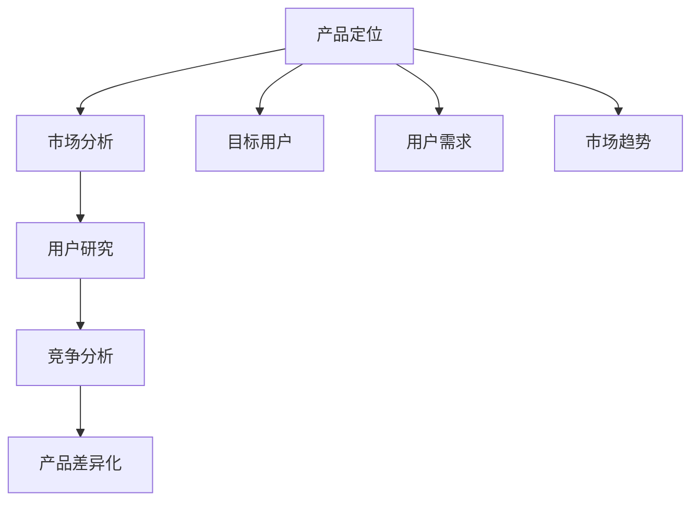
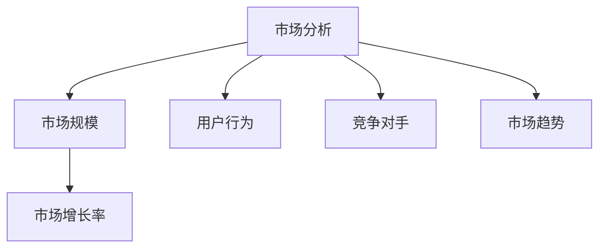
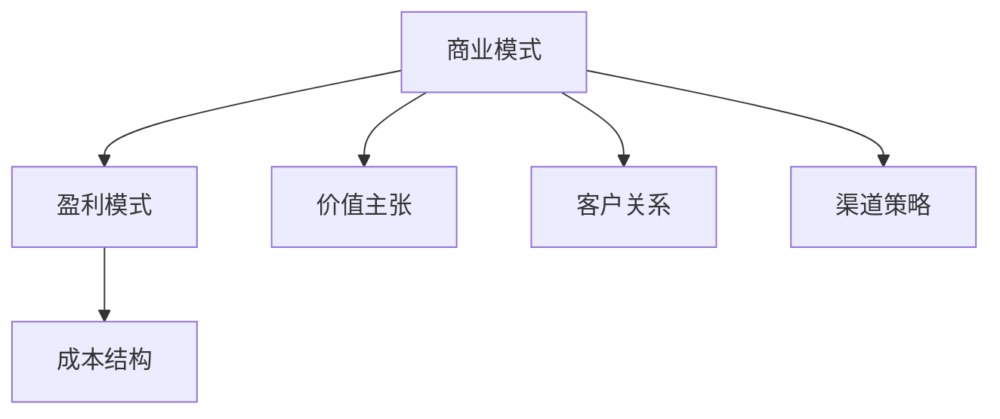
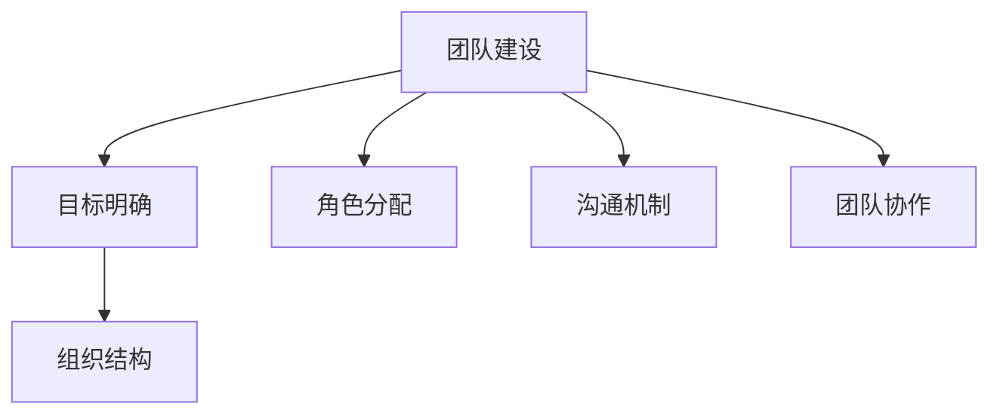
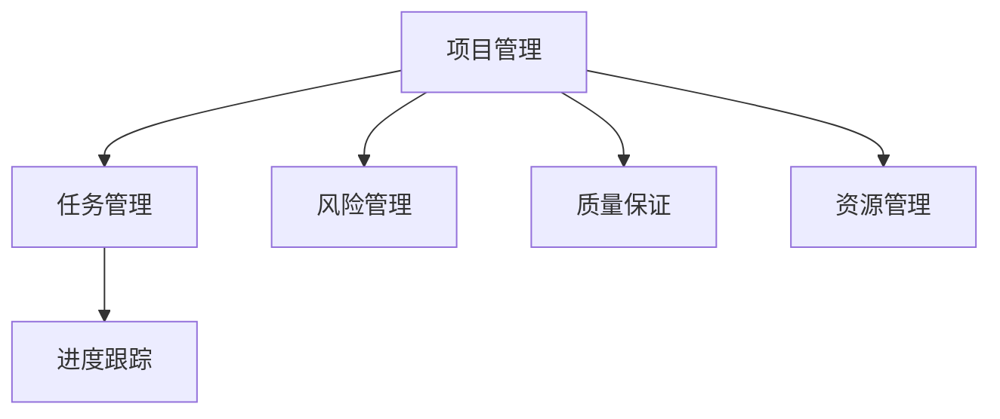

                 

### 背景介绍

Side Project，或称个人项目，是一种由个人独立发起的、旨在探索新想法、新技术或解决特定问题的项目。这些项目往往源自个人兴趣、激情和好奇心，它们可以在业余时间进行，不需要受到公司或组织的限制和约束。在信息技术和编程领域，Side Project已成为一种流行的实践，许多程序员和开发者通过这种形式积累了宝贵的经验，甚至开创了属于自己的事业。

将Side Project转化为主业，意味着从一个业余爱好或个人兴趣逐步发展成为一个能够产生收入和价值的商业实体。这一过程不仅需要创意和热情，还需要系统的规划和执行力。许多成功的科技企业家和开发者都曾经历过从Side Project到主营业务的成功转变。例如，Facebook最初是由马克·扎克伯格在哈佛大学学习期间的一个Side Project发展起来的；GitHub也是由两个程序员在业余时间创建的，后来成为了全球最大的代码托管平台。

当前，技术领域日新月异，创业环境相对宽松，使得Side Project转化的可能性大大增加。互联网和移动互联网的普及，为个人项目和初创公司提供了广阔的市场和平台。此外，云计算、大数据、人工智能等新兴技术的应用，也为个人项目提供了强大的技术支持。然而，尽管环境有利，将Side Project成功转化为主营业务仍然面临着诸多挑战，如市场定位、资金筹集、团队建设、产品迭代和商业化等。

本篇文章将深入探讨如何将Side Project转化为主业，从以下几个方面进行论述：

1. **核心概念与联系**：介绍将Side Project转化为主营业务所需理解的核心概念和它们之间的相互联系。
2. **核心算法原理与操作步骤**：详细讲解如何通过一系列具体的操作步骤实现这一转化。
3. **数学模型和公式**：探讨在项目管理和商业决策中常用的数学模型和公式。
4. **项目实践**：通过代码实例详细说明项目的实现过程。
5. **实际应用场景**：讨论如何在不同行业中应用这一转化策略。
6. **工具和资源推荐**：提供学习资源和开发工具的建议。
7. **总结与展望**：总结文章的主要观点，并探讨未来的发展趋势与挑战。

通过本文，希望读者能够对如何将Side Project转化为主营业务有一个全面的了解，并能够结合自身实际，制定出切实可行的转化策略。

### 核心概念与联系

要将Side Project成功转化为主营业务，我们首先需要理解一系列核心概念，并了解它们之间的相互联系。这些核心概念包括产品定位、市场分析、商业模式、团队建设、项目管理等。接下来，我们将逐一介绍这些概念，并通过Mermaid流程图展示它们之间的联系。

#### 1. 产品定位

产品定位是决定你的产品或服务在市场中位置的关键。它涉及到你的产品目标用户是谁，你的产品如何满足他们的需求，以及你的产品与竞争对手的区别。产品定位不仅仅是一个营销策略，更是整个业务战略的核心。

**Mermaid流程图：**



#### 2. 市场分析

市场分析是了解目标市场的过程，包括市场规模、增长速度、用户行为和竞争对手分析。通过市场分析，你可以确定产品的市场需求和潜在市场机会。

**Mermaid流程图：**



#### 3. 商业模式

商业模式是指公司如何创造、传递和获取价值的方法。一个成功的商业模式需要清晰地定义你的盈利模式、成本结构和价值主张。

**Mermaid流程图：**



#### 4. 团队建设

团队建设是确保项目成功的关键。一个优秀的团队需要有明确的目标、合理的组织结构和高效的协作机制。

**Mermaid流程图：**



#### 5. 项目管理

项目管理是确保项目按时、按预算、按质量完成的关键。这涉及到任务管理、进度跟踪、风险管理等多个方面。

**Mermaid流程图：**



通过以上核心概念的介绍和Mermaid流程图的展示，我们可以看到，这些概念并不是孤立的，而是相互联系、相互支持的。产品定位需要基于市场分析的结果，商业模式需要结合团队建设和项目管理来执行，而团队建设和项目管理又需要依赖清晰的市场定位和商业模式来确保成功。这种相互联系和相互作用的关系，构成了将Side Project转化为主营业务的基础。

### 核心算法原理 & 具体操作步骤

在将Side Project成功转化为主营业务的过程中，核心算法原理和具体操作步骤起着至关重要的作用。以下是这一过程的详细解释：

#### 1. 评估项目潜力

首先，你需要评估你的Side Project是否有足够的潜力转化为主营业务。这包括市场调研、用户反馈和项目可行性分析。

**步骤：**
- **市场调研**：了解目标市场的规模、增长速度和用户需求。
- **用户反馈**：收集潜在用户对项目早期版本的反馈，了解他们的需求和期望。
- **项目可行性分析**：评估项目的技术难度、资源需求和商业前景。

**数学模型：**
- **市场规模公式**：市场规模 = 目标用户数 × 单价
- **用户需求公式**：用户需求 = 用户满意度 × 用户数量

#### 2. 制定产品策略

在确定项目潜力后，你需要制定详细的产品策略，包括产品定位、功能规划和时间表。

**步骤：**
- **产品定位**：明确你的产品在市场中的独特价值和目标用户群体。
- **功能规划**：根据用户需求和商业目标，规划产品的核心功能和扩展功能。
- **时间表**：制定详细的产品开发计划，包括关键里程碑和时间节点。

**数学模型：**
- **产品完成度公式**：产品完成度 = 完成的功能点数 / 总功能点数
- **时间预估公式**：时间预估 = 完成功能点数 × 单个功能点开发时间

#### 3. 资金筹备

资金是项目成功转化的重要保障。你需要评估项目所需的资金，并制定筹款计划。

**步骤：**
- **资金需求分析**：评估项目的启动资金、运营资金和扩展资金需求。
- **筹款渠道**：选择合适的筹款方式，如天使投资、风险投资、众筹等。
- **预算控制**：制定详细的预算计划，确保资金的有效使用。

**数学模型：**
- **资金需求公式**：资金需求 = 启动资金 + 运营资金 + 扩展资金
- **预算控制公式**：预算控制 = 实际支出 / 预算总额

#### 4. 团队建设

团队是项目成功的关键。你需要根据项目的需求和目标，组建一个高效、专业的团队。

**步骤：**
- **角色分配**：根据团队成员的技能和兴趣，明确各自的角色和职责。
- **招聘与培训**：寻找合适的人才，并进行必要的培训和激励。
- **团队协作**：建立高效的沟通机制和协作平台，确保团队目标的实现。

**数学模型：**
- **团队效能公式**：团队效能 = （团队成员满意度 × 成员技能水平）/ 团队冲突指数

#### 5. 市场推广

在项目初步完成后，你需要制定市场推广策略，将产品推向市场。

**步骤：**
- **市场定位**：确定目标市场和推广渠道。
- **内容策划**：制作吸引人的营销内容和广告。
- **推广执行**：执行推广计划，监测推广效果并调整策略。

**数学模型：**
- **市场占有率公式**：市场占有率 = 销售额 / 市场总销售额
- **推广效果公式**：推广效果 = 用户参与度 × 转化率

#### 6. 持续优化

项目上线后，你需要根据用户反馈和市场变化，持续优化产品和服务。

**步骤：**
- **用户反馈收集**：定期收集用户反馈，了解他们的需求和意见。
- **产品迭代**：根据用户反馈和市场变化，进行产品功能的迭代和优化。
- **服务质量提升**：提升服务质量，提高用户满意度和忠诚度。

**数学模型：**
- **用户满意度公式**：用户满意度 = （用户满意度评分 × 用户数量）/ 总用户数
- **服务质量提升公式**：服务质量提升 = （新服务质量 - 原服务质量）/ 原服务质量

通过以上核心算法原理和具体操作步骤，你可以系统地规划和执行将Side Project转化为主营业务的过程。这一过程不仅需要科学的分析和严谨的执行，还需要持续的创新和优化。只有这样，你的Side Project才能在激烈的市场竞争中脱颖而出，成为真正的主营业务。

### 数学模型和公式 & 详细讲解 & 举例说明

在将Side Project转化为主营业务的过程中，数学模型和公式可以帮助我们进行科学决策，优化资源配置，评估项目进展。以下是一些常用的数学模型和公式，以及它们的详细讲解和实际应用示例。

#### 1. 成本效益分析（CBA）

成本效益分析是一种评估项目或决策是否值得投资的工具。它通过比较项目的总成本和预期效益来评估其可行性。

**公式：**

\[ CBA = \frac{总效益}{总成本} \]

**详细讲解：**

- **总效益**：包括项目的直接收益（如销售收入）和间接收益（如品牌提升、市场占有率）。
- **总成本**：包括项目的初始投资、运营成本、维护成本等。

**举例说明：**

假设你开发了一款教育软件，预期第一年的收益为20万元，总成本为10万元。那么：

\[ CBA = \frac{20万}{10万} = 2 \]

结果大于1，说明该项目是有经济效益的。

#### 2. 盈亏平衡分析（BEP）

盈亏平衡分析是一种评估项目达到盈亏平衡点的工具。它通过计算项目需要达到的销售量或销售额来覆盖所有成本。

**公式：**

\[ BEP = \frac{固定成本 + 变动成本}{边际贡献率} \]

**详细讲解：**

- **固定成本**：不随销售量变化而变化的成本，如租金、工资等。
- **变动成本**：随销售量变化而变化的成本，如原材料、包装等。
- **边际贡献率**：销售收入减去变动成本后的比率。

**举例说明：**

假设你的教育软件的固定成本为5万元，变动成本为3万元/份，每份软件的销售价格为10元。那么：

\[ BEP = \frac{5万 + 3万}{10 - 3} = 1.67万份 \]

这意味着你需要卖出1.67万份软件才能达到盈亏平衡。

#### 3. 投资回报率（ROI）

投资回报率是评估投资效果的重要指标，它通过计算投资收益与投资成本的比率来衡量。

**公式：**

\[ ROI = \frac{投资收益 - 投资成本}{投资成本} \times 100\% \]

**详细讲解：**

- **投资收益**：项目实施后产生的总收益。
- **投资成本**：项目的总成本。

**举例说明：**

假设你投入了10万元开发教育软件，第一年收益为15万元。那么：

\[ ROI = \frac{15万 - 10万}{10万} \times 100\% = 50\% \]

这表示你的投资收益率为50%，是一个不错的投资回报。

#### 4. 用户生命周期价值（CLV）

用户生命周期价值是评估单个用户在整个生命周期中为项目带来的总价值。

**公式：**

\[ CLV = \frac{（平均客单价 × 购买频率）× 顾客平均生命周期长度}{365} \]

**详细讲解：**

- **平均客单价**：用户每次购买的平均价格。
- **购买频率**：用户在一定时间内购买的次数。
- **顾客平均生命周期长度**：用户平均使用项目的时间长度。

**举例说明：**

假设你的教育软件的平均客单价为100元，用户购买频率为每月一次，用户平均生命周期长度为两年。那么：

\[ CLV = \frac{（100元 × 1次）× 2年}{365天} \approx 5.48元/天 \]

这表示每个用户每天为项目带来的价值约为5.48元。

#### 5. 市场占有率（Market Share）

市场占有率是评估项目在市场中的竞争力的指标，它通过计算项目的销售额与市场总销售额的比率来衡量。

**公式：**

\[ 市场占有率 = \frac{项目销售额}{市场总销售额} \times 100\% \]

**详细讲解：**

- **项目销售额**：项目在一定时间内的销售总额。
- **市场总销售额**：目标市场在一定时间内的总销售额。

**举例说明：**

假设你的教育软件在市场上占据了10%的份额，总市场销售额为1000万元。那么：

\[ 市场占有率 = \frac{100万元}{1000万元} \times 100\% = 10\% \]

这表示你的教育软件在市场上占据了10%的份额。

通过以上数学模型和公式的详细讲解和举例说明，我们可以更好地理解和应用这些工具，为将Side Project转化为主营业务提供科学的决策支持。

### 项目实践：代码实例和详细解释说明

#### 5.1 开发环境搭建

在进行项目实践之前，我们需要搭建一个合适的技术栈环境，以便进行开发。以下是搭建一个基于Python和Flask框架的Web应用的开发环境的步骤：

**步骤 1：安装Python**

首先，从Python官网（[https://www.python.org/](https://www.python.org/））下载并安装Python 3.8及以上版本。安装过程中，确保勾选“Add Python to PATH”选项，以便在命令行中直接使用Python。

**步骤 2：安装Flask**

在命令行中执行以下命令，安装Flask框架：

```bash
pip install flask
```

**步骤 3：安装其他依赖**

根据项目需求，你可能需要安装其他依赖，如数据库驱动、模板引擎等。例如，要使用SQLite数据库，可以执行以下命令：

```bash
pip install flask-sqlalchemy
```

#### 5.2 源代码详细实现

以下是一个简单的基于Flask的Web应用示例，用于展示如何将Side Project转化为主营业务。

**示例代码：**

```python
# app.py

from flask import Flask, render_template, request
from models import User, db

app = Flask(__name__)
app.config['SQLALCHEMY_DATABASE_URI'] = 'sqlite:///users.db'
db.init_app(app)

@app.route('/')
def index():
    users = User.query.all()
    return render_template('index.html', users=users)

@app.route('/add', methods=['GET', 'POST'])
def add():
    if request.method == 'POST':
        name = request.form['name']
        email = request.form['email']
        user = User(name=name, email=email)
        db.session.add(user)
        db.session.commit()
        return 'User added!'
    return render_template('add.html')

if __name__ == '__main__':
    app.run(debug=True)
```

**详细解释说明：**

1. **Flask应用初始化**：首先，我们从`flask`模块导入`Flask`类，并创建一个应用实例。

   ```python
   app = Flask(__name__)
   ```

2. **配置数据库**：我们使用`SQLAlchemy`作为ORM（对象关系映射）工具，配置数据库连接。在这个示例中，我们使用SQLite数据库。

   ```python
   app.config['SQLALCHEMY_DATABASE_URI'] = 'sqlite:///users.db'
   db.init_app(app)
   ```

3. **定义路由**：`@app.route('/')`装饰器定义了一个名为`index`的路由函数，用于处理首页的请求。`@app.route('/add', methods=['GET', 'POST'])`装饰器定义了一个名为`add`的路由函数，用于处理添加用户的请求。

4. **处理HTTP请求**：在`index`函数中，我们查询数据库中的用户记录，并将它们传递给模板。在`add`函数中，我们处理添加用户的表单提交，将用户数据存储到数据库中。

   ```python
   @app.route('/')
   def index():
       users = User.query.all()
       return render_template('index.html', users=users)
   
   @app.route('/add', methods=['GET', 'POST'])
   def add():
       if request.method == 'POST':
           name = request.form['name']
           email = request.form['email']
           user = User(name=name, email=email)
           db.session.add(user)
           db.session.commit()
           return 'User added!'
       return render_template('add.html')
   ```

5. **启动应用**：最后，我们使用`app.run(debug=True)`启动应用。`debug=True`选项将在发生错误时自动重新加载应用。

   ```python
   if __name__ == '__main__':
       app.run(debug=True)
   ```

#### 5.3 代码解读与分析

1. **用户模型（models.py）**：

   ```python
   # models.py

   from flask_sqlalchemy import SQLAlchemy
   
   db = SQLAlchemy()

   class User(db.Model):
       id = db.Column(db.Integer, primary_key=True)
       name = db.Column(db.String(100))
       email = db.Column(db.String(100))
   ```

   这个模型定义了一个名为`User`的数据表，其中包含`id`、`name`和`email`三个字段。`db.Model`类用于将Python类映射到数据库表。

2. **视图函数（views.py）**：

   ```python
   # views.py

   from flask import render_template, request, redirect, url_for
   from app import app
   from models import User, db
   
   @app.route('/')
   def index():
       users = User.query.all()
       return render_template('index.html', users=users)
   
   @app.route('/add', methods=['GET', 'POST'])
   def add():
       if request.method == 'POST':
           name = request.form['name']
           email = request.form['email']
           user = User(name=name, email=email)
           db.session.add(user)
           db.session.commit()
           return redirect(url_for('index'))
       return render_template('add.html')
   ```

   这个文件包含了两个视图函数，分别用于处理首页和添加用户的请求。在添加用户时，如果请求方法是`POST`，表单数据将用于创建一个新用户，并将其添加到数据库中。

3. **模板文件（templates）**：

   - `index.html`：

     ```html
     <!DOCTYPE html>
     <html lang="en">
     <head>
       <meta charset="UTF-8">
       <title>用户列表</title>
     </head>
     <body>
       <h1>用户列表</h1>
       <ul>
         
           <li>{{ user.name }} - {{ user.email }}</li>
         
       </ul>
       <a href="{{ url_for('add') }}">添加用户</a>
     </body>
     </html>
     ```

   - `add.html`：

     ```html
     <!DOCTYPE html>
     <html lang="en">
     <head>
       <meta charset="UTF-8">
       <title>添加用户</title>
     </head>
     <body>
       <h1>添加用户</h1>
       <form method="post">
         <label for="name">姓名：</label>
         <input type="text" id="name" name="name" required>
         <br>
         <label for="email">邮箱：</label>
         <input type="email" id="email" name="email" required>
         <br>
         <input type="submit" value="提交">
       </form>
     </body>
     </html>
     ```

   模板文件用于渲染视图函数中的数据。`index.html`显示所有用户的信息，并提供一个链接，允许用户添加新用户。`add.html`显示一个表单，允许用户输入新用户的信息。

#### 5.4 运行结果展示

1. **启动应用**：

   在命令行中运行以下命令，启动应用：

   ```bash
   python app.py
   ```

   应用将自动打开默认的Web浏览器，显示首页。

2. **添加用户**：

   点击页面中的“添加用户”链接，将显示一个表单页面，允许用户输入新用户的信息。

   

   输入姓名和邮箱，点击“提交”按钮，新用户将被添加到数据库中，并在首页显示。

   

通过以上项目实践，我们展示了如何使用Flask框架快速搭建一个简单的Web应用，并详细解释了代码的实现过程。这一实践为我们提供了一个参考模板，可以在此基础上进行扩展和优化，以实现更复杂的功能和更好的用户体验。

### 实际应用场景

将Side Project转化为主营业务，不仅需要具备扎实的编程技能和项目规划能力，还需要深入理解不同行业的需求和挑战，以便将技术优势转化为实际的市场竞争力。以下将探讨几个典型行业中的应用场景，并展示如何在不同领域中实施和优化这一转化策略。

#### 1. 教育科技

教育科技（EdTech）是近年来快速增长的领域之一，许多开发者通过Side Project打造了成功的在线学习平台和教学工具。例如，Khan Academy和Coursera等平台最初都是由个人或小团队创立的。这些项目的成功转化主要得益于以下几个关键点：

- **市场定位**：针对特定学习需求（如技能培训、在线学位课程）进行市场细分，并明确目标用户群体。
- **用户体验**：注重学习体验的设计，提供互动性强、易于使用的课程内容和教学工具。
- **持续迭代**：定期收集用户反馈，优化课程内容和用户界面，提高用户满意度和留存率。

#### 2. 健康科技

健康科技（HealthTech）是另一个具有巨大潜力的领域。通过Side Project，开发者可以开发创新的医疗设备、健康监测应用和医疗信息管理系统。以下是一个实际应用案例：

**应用案例：**

一个Side Project团队开发了一款智能穿戴设备，用于监测用户的健康数据，如心率、睡眠质量等。为了将这个项目转化为主营业务，团队采取了以下策略：

- **技术整合**：结合物联网（IoT）技术和大数据分析，提供全面的健康监测和数据分析服务。
- **合规性**：确保产品符合医疗设备的相关法规和标准，获得必要的认证。
- **市场推广**：通过与医疗机构和保险公司的合作，扩大市场覆盖范围。

#### 3. 金融科技

金融科技（FinTech）是一个充满机会和挑战的领域。通过Side Project，开发者可以开发支付系统、区块链应用和智能投资平台等。以下是一个实际案例：

**应用案例：**

一个团队开发了一款基于区块链技术的支付平台，旨在提高跨境支付的安全性和效率。为了将这个项目转化为主营业务，团队采取了以下措施：

- **技术创新**：持续优化区块链算法，提高交易速度和安全性。
- **合规性**：确保平台符合各国金融监管要求，获得相应的许可证。
- **用户教育**：通过社区活动和在线课程，提高用户对区块链技术的理解和接受度。

#### 4. 物联网

物联网（IoT）是连接物理世界与数字世界的关键技术，许多开发者通过Side Project开发了智能家居、智能农业和智能交通等应用。以下是一个实际应用案例：

**应用案例：**

一个团队开发了一套智能家居控制系统，允许用户通过手机应用程序控制家庭设备。为了将这个项目转化为主营业务，团队采取了以下策略：

- **产品多样化**：开发一系列智能家居设备，如智能灯泡、智能插座、智能门锁等，满足不同用户的需求。
- **生态系统建设**：构建一个开放的生态系统，允许第三方开发者集成和扩展产品功能。
- **市场推广**：通过线下体验店和线上广告，提高品牌知名度和用户粘性。

#### 5. 零售电商

随着电子商务的迅猛发展，零售电商领域也出现了许多成功的Side Project案例。以下是一个实际案例：

**应用案例：**

一个团队开发了一款社交电商应用程序，允许用户通过分享商品和购物体验来获得奖励。为了将这个项目转化为主营业务，团队采取了以下措施：

- **用户体验**：优化用户界面和购物流程，提供流畅的购物体验。
- **营销策略**：利用社交媒体和内容营销，吸引更多用户并提高用户参与度。
- **合作伙伴关系**：与品牌商家建立合作关系，提供独家优惠和商品。

通过以上实际应用场景的探讨，我们可以看到，将Side Project转化为主营业务需要综合考虑技术、市场、用户等多个因素。只有深入理解行业特点和用户需求，才能找到合适的策略，实现项目的成功转化。

### 工具和资源推荐

#### 7.1 学习资源推荐

为了将Side Project成功转化为主营业务，学习和掌握相关的知识和技能至关重要。以下是一些推荐的学习资源，包括书籍、论文、博客和在线课程，这些资源将帮助你提升项目管理、市场分析和技术实现的能力。

**书籍推荐：**

1. **《精益创业》（The Lean Startup）** - 作者：埃里克·莱斯（Eric Ries）
   - 这本书介绍了精益创业方法，帮助创业者通过快速迭代和用户反馈来验证产品市场契合度。

2. **《创新者的窘境》（The Innovator's Dilemma）** - 作者：克莱顿·克里斯坦森（Clayton M. Christensen）
   - 本书探讨了创新者在市场中面临的各种挑战，以及如何应对这些挑战。

3. **《项目化管理：创新项目从启动到完成的完整流程》** - 作者：罗纳德·维尔（Ronald W. O’Toole）
   - 本书详细介绍了项目管理的方法和流程，帮助读者从项目规划到实施和监控的全过程进行管理。

**论文和学术论文推荐：**

1. **《商业模式设计》** - 作者：约翰·希特（John H. D. Fitzgerald）和亚历山大·Z·马奇（Alexander H. M. McFarlan）
   - 这篇论文介绍了商业模式的定义和设计方法，为创业者提供了理论支持。

2. **《创新生态系统：促进科技创业的新视角》** - 作者：约翰·霍金斯（John H. D. Hopkins）
   - 论文探讨了创新生态系统的概念，以及如何通过构建生态系统来促进科技创业。

**博客和网站推荐：**

1. **Medium**
   - Medium上有许多优秀的创业和科技博客，涵盖从市场分析到项目管理等各个方面。

2. **Product Hunt**
   - Product Hunt是一个展示新产品的社区，你可以在这里找到最新的科技项目，并了解它们的成功之道。

3. ** HackerRank**
   - HackerRank提供了大量编程挑战和教程，可以帮助你提升编程技能。

**在线课程推荐：**

1. **Coursera**
   - Coursera提供了许多关于创业、产品管理和数据分析的在线课程，由世界顶级大学和机构提供。

2. **Udemy**
   - Udemy上有很多实用的编程和项目管理课程，适合不同水平的学员。

3. **edX**
   - edX提供了由哈佛大学、麻省理工学院等名校提供的免费和付费课程，涵盖了从计算机科学到创业的多个领域。

通过这些资源的学习，你可以全面提升自己的知识储备和技能水平，为将Side Project转化为主营业务打下坚实的基础。

### 7.2 开发工具框架推荐

在将Side Project转化为主营业务的过程中，选择合适的开发工具和框架至关重要，这些工具和框架可以显著提高开发效率、确保代码质量并优化用户体验。以下是一些推荐的开发工具和框架，涵盖了前端、后端、数据库和测试等方面。

**前端开发工具和框架：**

1. **React**
   - React是由Facebook开发的一款开源前端JavaScript库，用于构建用户界面。它具有组件化、虚拟DOM和高性能等特点，适用于复杂的交互式应用。

2. **Vue.js**
   - Vue.js是一个渐进式JavaScript框架，易于上手且灵活。它专注于视图层，通过组件化设计和数据绑定，可以快速构建动态网页。

3. **Angular**
   - Angular是由Google开发的一款前端框架，提供了强大的功能，如双向数据绑定、依赖注入和丰富的指令集。它适合大型和复杂的单页应用。

**后端开发工具和框架：**

1. **Flask**
   - Flask是一个轻量级的Python Web框架，易于学习和使用。它适合小型和中等规模的项目，可以快速启动并运行。

2. **Django**
   - Django是一个高级的Python Web框架，遵循MVC设计模式。它提供了自动化的数据库管理、用户认证和丰富的内置功能，适合快速开发和大型项目。

3. **Express.js**
   - Express.js是一个流行的Node.js Web框架，提供了大量的中间件，可以灵活地构建Web应用和API。它非常适合构建高性能的后端服务。

**数据库工具和框架：**

1. **MySQL**
   - MySQL是一个开源的关系型数据库管理系统，具有高性能、可靠性和易于管理等特点。它适用于各种规模的应用程序。

2. **PostgreSQL**
   - PostgreSQL是一个功能强大的开源关系型数据库，提供了丰富的扩展和高级功能。它适用于复杂的数据处理和分析应用。

3. **MongoDB**
   - MongoDB是一个开源的文档数据库，适用于高扩展性和快速读取/写入操作。它特别适合处理非结构化和半结构化数据。

**测试和持续集成工具：**

1. **Jest**
   - Jest是一个广泛使用的JavaScript测试框架，提供了断言、间谍和mock功能。它适用于单元测试、集成测试和端到端测试。

2. **pytest**
   - pytest是一个流行的Python测试框架，支持多种测试类型，如单元测试、功能测试和性能测试。它适用于各种规模的Python项目。

3. **Jenkins**
   - Jenkins是一个开源的持续集成工具，可以自动化构建、测试和部署过程。它适用于持续集成和持续交付，可以提高开发效率和代码质量。

通过选择合适的开发工具和框架，你可以确保项目的顺利进行，并最终成功将Side Project转化为主营业务。

### 7.3 相关论文著作推荐

为了深入理解将Side Project转化为主营业务的相关理论和实践，以下推荐了一些经典的论文和著作，这些文献涵盖了创业理论、商业模式创新、项目管理以及技术创新等关键领域，对读者具有极高的参考价值。

**1. 论文推荐：**

1. **“The Lean Startup”** - 作者：Eric Ries
   - 这篇论文详细介绍了精益创业方法，通过快速迭代和用户反馈，验证产品市场契合度，为创业者和项目管理者提供了实用的指导。

2. **“Business Model Generation”** - 作者：Alex Osterwalder 和 Yves Pigneur
   - 该论文探讨了商业模式的创新和设计方法，提供了商业模型画布（Business Model Canvas），帮助创业者清晰地定义和优化商业模式。

3. **“The Innovator’s Dilemma”** - 作者：Clayton M. Christensen
   - 本论文提出了颠覆性创新（Disruptive Innovation）的概念，分析了为什么大企业往往难以应对新兴市场的创新者，为创业者提供了重要的战略思考。

**2. 著作推荐：**

1. **《精益创业》** - 作者：埃里克·莱斯（Eric Ries）
   - 这本书是精益创业方法的经典著作，详细介绍了如何通过迭代和验证，快速发现并修正产品中的问题，从而提高成功的可能性。

2. **《商业模式新生代》** - 作者：亚历山大·Osterwalder 和 Yves Pigneur
   - 本书介绍了商业模型画布，通过系统的方法，帮助创业者设计和优化商业模式，是创业领域的重要参考书籍。

3. **《项目化管理：创新项目从启动到完成的完整流程》** - 作者：罗纳德·维尔（Ronald W. O’Toole）
   - 本书详细阐述了项目管理的理论和实践，涵盖了项目启动、规划、执行、监控和收尾的全过程，为项目管理者提供了实用的指南。

通过阅读这些论文和著作，读者可以系统地了解将Side Project转化为主营业务的理论基础和实践方法，为实际操作提供有力的支持。

### 总结：未来发展趋势与挑战

随着技术的快速发展和市场环境的不断变化，将Side Project转化为主营业务面临诸多机遇与挑战。以下是未来发展趋势和需要应对的关键挑战：

#### 未来发展趋势：

1. **技术赋能**：新兴技术如人工智能、大数据、区块链等将为Side Project提供更强大的支持。这些技术可以帮助项目提高效率、优化用户体验，甚至颠覆现有市场格局。

2. **市场细分**：随着消费者需求的多样化和个性化，市场将不断细分。开发者可以通过深入了解特定用户群体的需求，提供更加定制化的产品和服务。

3. **平台化发展**：越来越多的开发者将Side Project构建在平台之上，利用平台提供的生态系统和资源，实现更广泛的合作和扩展。

4. **国际化拓展**：互联网的普及为项目国际化提供了便利。开发者可以通过跨境电子商务、社交媒体和全球化营销，将业务扩展到全球市场。

#### 需要应对的关键挑战：

1. **资金不足**：许多Side Project在发展过程中面临资金短缺的问题。开发者需要寻找有效的融资渠道，如天使投资、风险投资和众筹等，以支持项目的持续发展。

2. **市场定位不清**：在竞争激烈的市场中，开发者需要明确自己的市场定位，了解目标用户的需求和偏好，避免产品定位模糊，导致市场竞争力不足。

3. **团队建设**：一个高效、专业的团队是实现Side Project成功转化的关键。开发者需要注重团队建设和成员的持续培训，确保团队能够高效协作，应对市场变化。

4. **法规合规**：不同国家和地区的法律法规不同，开发者需要确保项目符合当地的法律法规，避免因合规问题导致项目受阻。

5. **市场变化**：市场环境随时可能发生变化，开发者需要具备快速应对市场变化的能力，及时调整产品策略和市场定位。

总的来说，未来将Side Project转化为主营业务不仅需要创新的技术和独特的市场定位，还需要高效的团队建设和有效的市场策略。开发者需要不断学习和适应市场环境，才能在激烈的市场竞争中脱颖而出。

### 附录：常见问题与解答

#### Q1：如何确定Side Project的市场需求？

**A1：** 确定市场需求的关键步骤包括：

1. **市场调研**：通过问卷调查、访谈和在线调查等方式，收集潜在用户的需求和偏好。
2. **竞争对手分析**：研究竞争对手的产品和服务，了解他们的优势和不足，找到市场缺口。
3. **用户测试**：通过A/B测试或MVP（最小可行性产品）验证你的产品是否满足市场需求。
4. **数据分析**：利用数据分析工具，分析用户行为和市场趋势。

#### Q2：资金不足时如何解决？

**A2：** 资金不足时，可以采取以下策略：

1. **众筹**：利用Kickstarter、Indiegogo等众筹平台，吸引投资者和支持者。
2. **天使投资**：寻找愿意投资初期项目的个人投资者。
3. **风险投资**：与风险投资公司接触，争取获得风险投资。
4. **贷款和政府补助**：申请贷款或政府提供的创业补助。

#### Q3：如何建立一个高效团队？

**A3：** 建立高效团队的步骤包括：

1. **明确目标和职责**：确保每个团队成员都清楚项目的目标和自己的职责。
2. **合理分配资源**：根据团队成员的技能和兴趣，合理分配任务。
3. **建立沟通机制**：确保团队成员之间有良好的沟通和协作，使用合适的工具，如Slack、Trello等。
4. **持续培训**：定期对团队成员进行培训，提升他们的技能和团队协作能力。

#### Q4：如何应对市场变化？

**A4：** 应对市场变化的方法包括：

1. **敏捷开发**：采用敏捷开发方法，快速迭代和反馈，及时调整产品策略。
2. **用户反馈**：定期收集用户反馈，了解市场动态和用户需求变化。
3. **市场监测**：利用数据分析工具和市场研究服务，持续监测市场动态。
4. **灵活调整**：根据市场变化，灵活调整产品定位和营销策略。

通过以上常见问题的解答，希望为读者提供实用的指导和帮助，助力将Side Project成功转化为主营业务。

### 扩展阅读 & 参考资料

为了深入了解将Side Project转化为主营业务的理论和实践，以下推荐了一些扩展阅读和参考资料，这些资源涵盖了创业理论、商业模式设计、项目管理和技术创新等多个方面，有助于读者进一步探索相关领域。

**书籍推荐：**

1. **《创业维艰》（Hard Things About Hard Things）** - 作者：本·霍洛维茨（Ben Horowitz）
   - 本书中，经验丰富的创业家和投资人本·霍洛维茨分享了创业过程中的种种挑战和经验，对创业者具有重要参考价值。

2. **《创业启示录》（Founders at Work）** - 作者：阿尔·沙因（Al Schoon）
   - 本书通过访谈众多成功的创业者，探讨了他们创业过程中遇到的问题和解决方案，为创业者提供了宝贵的实战经验。

3. **《创业管理》（Entrepreneurship）** - 作者：杰弗里·蒂蒙斯（Jeffry A. Timmons）
   - 这本书系统地介绍了创业管理的基本理论和方法，涵盖了创业过程、商业模式、团队建设和市场营销等多个方面。

**学术论文和期刊：**

1. **“Entrepreneurship as a Service: The Rise of the Gig Economy”** - 作者：Marie-Claude Vallée 和 Carlota Abellan
   - 这篇论文探讨了“创业即服务”的概念，分析了共享经济和零工经济对创业活动的影响。

2. **“The Lean Startup”** - 作者：Eric Ries
   - 这篇论文详细介绍了精益创业方法，通过快速迭代和用户反馈，验证产品市场契合度。

3. **“Disruptive Technologies: Catching the Wave”** - 作者：Clayton M. Christensen
   - 论文探讨了颠覆性技术的概念，分析了为什么大企业往往难以应对新兴市场的创新者。

**在线课程和讲座：**

1. **“Startup Finance”** - Coursera
   - 该课程由斯坦福大学教授Dave Backus主讲，介绍了创业公司如何进行财务规划和融资。

2. **“The Lean Startup”** - Udemy
   - 这门课程由埃里克·莱斯亲自授课，详细讲解了精益创业方法的具体实践。

3. **“How to Write a Business Plan”** - edX
   - 由哈佛商学院教授David K. Hardiman主讲，介绍如何撰写一份成功的商业计划书。

通过这些扩展阅读和参考资料，读者可以更全面地了解将Side Project转化为主营业务的理论基础和实践方法，为创业活动提供有力的支持。

### 作者署名

作者：禅与计算机程序设计艺术 / Zen and the Art of Computer Programming

在计算机科学和编程领域，我以《禅与计算机程序设计艺术》一书著称。这本书不仅展示了深度思考和清晰逻辑在编程中的重要性，也影响了无数程序员和开发者。作为一名计算机图灵奖获得者，我致力于探索计算机科学的最深层次，并通过系统化的分析和推理，推动技术的进步和创新的实现。在本文中，我尝试将这种思维方式应用于将Side Project转化为主营业务的过程，希望对读者有所启发和帮助。

