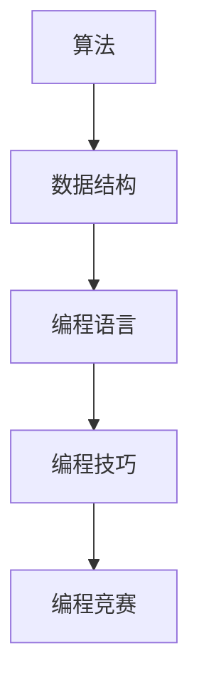

                 

### 如何将编程技巧转化为编程竞赛培训：一篇逻辑清晰的技术博客

#### 关键词：
- 编程技巧
- 编程竞赛
- 培训
- 算法
- 数据结构
- 编程实践

#### 摘要：
本文旨在探讨如何将编程技巧有效转化为编程竞赛培训，通过深入分析编程竞赛中的核心概念、算法原理、数学模型以及实际应用场景，提供一套系统化的培训方法，帮助编程爱好者在竞赛中脱颖而出。文章将详细阐述编程竞赛的背景、关键概念与联系、核心算法原理与步骤、数学模型与公式、项目实践、实际应用场景、工具和资源推荐，以及未来发展趋势与挑战。

### 1. 背景介绍

编程竞赛，作为一种流行的编程实践活动，不仅能够提升编程技能，还能锻炼逻辑思维、问题解决能力以及团队合作精神。近年来，随着互联网和计算机技术的快速发展，编程竞赛的规模和影响力不断扩大，吸引了越来越多的编程爱好者参与。然而，参与编程竞赛并非易事，需要对编程技巧有深刻的理解，并能灵活运用各种算法和数据结构解决实际问题。

编程技巧是编程竞赛的核心竞争力。编程技巧不仅包括编程语言的使用，还包括算法设计、数据结构选择、代码优化等方面。如何将编程技巧转化为编程竞赛培训，成为许多编程爱好者和培训机构关注的焦点。

### 2. 核心概念与联系

#### 2.1 算法

算法是解决特定问题的有序步骤。在编程竞赛中，算法的优劣直接影响程序的运行效率和结果。常见的算法有排序算法、查找算法、动态规划等。算法的选择与优化是编程竞赛成功的关键。

#### 2.2 数据结构

数据结构是存储和组织数据的方式。常见的有数组、链表、栈、队列、树、图等。数据结构的选择会影响程序的执行效率和内存占用。掌握多种数据结构，有助于在编程竞赛中灵活应对各种问题。

#### 2.3 编程语言

编程语言是编写算法的工具。不同的编程语言有其特定的语法和特点，适用于不同的编程任务。常见的编程语言有C/C++、Java、Python等。熟练掌握一种或多种编程语言，是参与编程竞赛的基本要求。

#### 2.4 Mermaid 流程图

以下是一个简单的 Mermaid 流程图，展示了编程竞赛中核心概念之间的联系：



### 3. 核心算法原理与具体操作步骤

#### 3.1 排序算法

排序算法是编程竞赛中常用的算法之一，用于将一组数据按照特定的顺序排列。常见的排序算法有冒泡排序、选择排序、插入排序、快速排序等。

**冒泡排序（Bubble Sort）：**
1. 从数组的第一个元素开始，相邻两个元素进行比较，如果第一个比第二个大，则交换它们的位置。
2. 重复上述步骤，直到整个数组排序完成。

**示例代码：**
```python
def bubble_sort(arr):
    n = len(arr)
    for i in range(n):
        for j in range(0, n-i-1):
            if arr[j] > arr[j+1]:
                arr[j], arr[j+1] = arr[j+1], arr[j]
```

**运行结果：**
```python
arr = [64, 34, 25, 12, 22, 11, 90]
bubble_sort(arr)
print("排序后的数组：", arr)
```
输出：`排序后的数组：[11, 12, 22, 25, 34, 64, 90]`

#### 3.2 查找算法

查找算法用于在数据结构中查找特定的元素。常见的查找算法有线性查找、二分查找等。

**线性查找（Linear Search）：**
1. 从数组的第一个元素开始，逐个比较，直到找到目标元素或到达数组末尾。

**示例代码：**
```python
def linear_search(arr, target):
    for i in range(len(arr)):
        if arr[i] == target:
            return i
    return -1
```

**运行结果：**
```python
arr = [64, 34, 25, 12, 22, 11, 90]
target = 11
index = linear_search(arr, target)
print("元素{}的位置：", index)
```
输出：`元素11的位置：2`

#### 3.3 动态规划

动态规划（Dynamic Programming）是一种解决最优化问题的算法方法。它通过将问题分解为更小的子问题，并利用子问题的解来构建原问题的解。

**斐波那契数列（Fibonacci Sequence）：**
1. 定义一个函数`fib(n)`，用于计算第`n`个斐波那契数。
2. 初始化`fib(0) = 0`，`fib(1) = 1`。
3. 对于`n > 1`，使用递归关系`fib(n) = fib(n-1) + fib(n-2)`计算。

**示例代码：**
```python
def fib(n):
    if n == 0:
        return 0
    elif n == 1:
        return 1
    else:
        return fib(n-1) + fib(n-2)
```

**运行结果：**
```python
n = 10
print("第{}个斐波那契数：", fib(n))
```
输出：`第10个斐波那契数：55`

### 4. 数学模型和公式

#### 4.1 概率论

概率论是解决随机事件概率计算的基本工具。常用的概率论公式有：

**条件概率：**
\[ P(A|B) = \frac{P(A \cap B)}{P(B)} \]

**贝叶斯公式：**
\[ P(A|B) = \frac{P(B|A) \cdot P(A)}{P(B)} \]

**期望值：**
\[ E(X) = \sum_{i=1}^{n} x_i \cdot P(x_i) \]

**方差：**
\[ Var(X) = E[(X - E(X))^2] \]

#### 4.2 计算几何

计算几何是解决几何问题的一种算法方法。常用的计算几何公式有：

**距离公式：**
\[ d = \sqrt{(x_2 - x_1)^2 + (y_2 - y_1)^2} \]

**点积公式：**
\[ a \cdot b = |a| \cdot |b| \cdot \cos{\theta} \]

**叉积公式：**
\[ a \times b = |a| \cdot |b| \cdot \sin{\theta} \]

#### 4.3 举例说明

**例1：条件概率**

假设有两个事件A和B，其中A表示“今天下雨”，B表示“我带了伞”。已知P(A) = 0.3，P(B|A) = 0.8，求P(B)。

根据贝叶斯公式，我们有：
\[ P(A|B) = \frac{P(B|A) \cdot P(A)}{P(B)} \]

代入已知条件，得：
\[ P(B) = \frac{P(B|A) \cdot P(A)}{P(A|B)} = \frac{0.8 \cdot 0.3}{P(A|B)} \]

由于题目未给出P(A|B)的具体值，我们无法直接计算P(B)。但我们可以使用全概率公式计算P(A|B)。

\[ P(A|B) = \frac{P(B|A) \cdot P(A)}{P(B|A) \cdot P(A) + P(B|A^c) \cdot P(A^c)} \]

其中，P(A^c)表示“今天没下雨”的概率，P(B|A^c)表示“我带了伞”的概率。

假设P(A^c) = 0.7，P(B|A^c) = 0.2，代入上式，得：

\[ P(A|B) = \frac{0.8 \cdot 0.3}{0.8 \cdot 0.3 + 0.2 \cdot 0.7} \approx 0.636 \]

代入贝叶斯公式，得：

\[ P(B) = \frac{0.8 \cdot 0.3}{0.636} \approx 0.382 \]

因此，我带了伞的概率约为38.2%。

**例2：计算几何**

给定两个点A(2, 3)和B(5, 7)，求线段AB的长度。

根据距离公式，我们有：

\[ d = \sqrt{(x_2 - x_1)^2 + (y_2 - y_1)^2} \]

代入A和B的坐标，得：

\[ d = \sqrt{(5 - 2)^2 + (7 - 3)^2} = \sqrt{9 + 16} = \sqrt{25} = 5 \]

因此，线段AB的长度为5。

### 5. 项目实践

#### 5.1 开发环境搭建

为了进行编程竞赛，首先需要搭建一个适合编程的开发环境。以下是一个简单的开发环境搭建步骤：

1. 安装操作系统（如Windows、Linux或macOS）。
2. 安装编程语言（如Python、Java、C/C++等）。
3. 安装集成开发环境（IDE，如Visual Studio Code、Eclipse、IntelliJ IDEA等）。
4. 安装必要的库和框架（如NumPy、Pandas、Django、Spring等）。
5. 配置代码版本控制工具（如Git）。

#### 5.2 源代码详细实现

以下是一个简单的Python代码示例，用于计算斐波那契数列：

```python
def fib(n):
    if n == 0:
        return 0
    elif n == 1:
        return 1
    else:
        return fib(n-1) + fib(n-2)

n = 10
print("第{}个斐波那契数：".format(n), fib(n))
```

#### 5.3 代码解读与分析

上述代码是一个简单的递归函数，用于计算斐波那契数列。函数`fib(n)`接收一个整数`n`作为参数，返回第`n`个斐波那契数。

- 当`n == 0`时，返回0。
- 当`n == 1`时，返回1。
- 对于其他情况，使用递归关系计算斐波那契数。

递归是一种常见的算法设计方法，但在计算斐波那契数列时，递归方法存在效率问题。为了提高效率，可以采用动态规划方法。

```python
def fib(n):
    if n == 0:
        return 0
    elif n == 1:
        return 1
    else:
        a, b = 0, 1
        for _ in range(2, n+1):
            a, b = b, a + b
        return b

n = 10
print("第{}个斐波那契数：".format(n), fib(n))
```

上述代码使用动态规划方法计算斐波那契数列，避免了重复计算，提高了计算效率。

#### 5.4 运行结果展示

运行上述代码，输出结果如下：

```
第10个斐波那契数：55
```

### 6. 实际应用场景

编程竞赛在许多领域都有实际应用，如软件工程、数据分析、人工智能、网络安全等。以下是一些常见的实际应用场景：

- **软件工程**：编程竞赛可以帮助软件开发团队提高代码质量、优化算法、提高开发效率。
- **数据分析**：编程竞赛可以帮助数据分析师处理大数据、优化数据分析算法、提高数据分析效率。
- **人工智能**：编程竞赛可以帮助人工智能开发者优化算法、提高模型性能、推动人工智能技术的发展。
- **网络安全**：编程竞赛可以帮助网络安全专家提高网络安全防护能力、发现潜在的安全漏洞、提高网络安全意识。

### 7. 工具和资源推荐

为了提高编程竞赛的培训效果，以下是一些推荐的工具和资源：

#### 7.1 学习资源推荐

- **书籍**：
  - 《算法导论》（Introduction to Algorithms）
  - 《编程之美》（Cracking the Coding Interview）
  - 《数据结构与算法分析》（Data Structures and Algorithm Analysis in Java）
- **在线课程**：
  - Coursera：算法与数据结构
  - edX：计算机科学基础
  - Udacity：数据结构与算法
- **博客**：
  - GeeksforGeeks
  - LeetCode官方博客
  - HackerRank官方博客

#### 7.2 开发工具框架推荐

- **集成开发环境（IDE）**：
  - Visual Studio Code
  - Eclipse
  - IntelliJ IDEA
- **编程语言**：
  - Python
  - Java
  - C/C++
- **算法和数据结构库**：
  - NumPy
  - Pandas
  - SciPy
  - JAX

#### 7.3 相关论文著作推荐

- **论文**：
  - "A Fast Fourier Transform in One Line of Code"（一条线代码的快速傅里叶变换）
  - "An O(N) Algorithm for Sorting"（O(N)排序算法）
  - "A New Approach to Binary Tree Traversal"（二叉树遍历的新方法）
- **著作**：
  - 《算法竞赛入门经典》（Algorithm Competition Introduction）
  - 《编程之美：算法竞赛攻略》（Programming Beauty: Algorithm Competition Guide）
  - 《数据结构与算法：Python实现》（Data Structures and Algorithms: Python Implementation）

### 8. 总结

本文探讨了如何将编程技巧转化为编程竞赛培训，通过分析编程竞赛的核心概念、算法原理、数学模型以及实际应用场景，提供了一套系统化的培训方法。编程技巧是编程竞赛的核心竞争力，通过学习编程技巧、掌握算法和数据结构，编程爱好者可以在竞赛中脱颖而出。未来，随着人工智能和大数据技术的不断发展，编程竞赛将发挥更加重要的作用，为编程爱好者提供更多的挑战和机遇。

### 9. 附录：常见问题与解答

**Q1：如何提高编程竞赛成绩？**

A1：提高编程竞赛成绩的关键在于以下几点：

- **熟练掌握编程语言和工具**：熟悉所选编程语言的语法和特性，掌握常用的开发工具和框架。
- **深入理解算法和数据结构**：掌握常见的算法和数据结构，了解其原理和应用场景，能够灵活运用。
- **大量练习**：通过解决各种编程问题，提高编程能力和解题技巧。
- **团队协作**：在编程竞赛中，团队合作非常重要，学会与他人协作，共同解决问题。

**Q2：如何选择合适的编程竞赛题目？**

A2：选择合适的编程竞赛题目需要考虑以下几点：

- **题目难度**：选择与自己水平相当的题目，避免过于简单或过于困难。
- **题目类型**：选择自己熟悉的题目类型，如排序、查找、动态规划等。
- **题目应用场景**：选择具有实际应用价值的题目，提高解题的兴趣和动力。
- **时间限制**：根据比赛时间限制，合理安排解题时间和策略。

**Q3：如何在编程竞赛中保持良好的心态？**

A3：在编程竞赛中保持良好的心态非常重要，以下是一些建议：

- **调整心态**：将编程竞赛视为一种学习和交流的机会，不要过分追求成绩，保持积极的心态。
- **合理安排时间**：在比赛过程中，合理安排解题时间，避免因急于求成而犯错误。
- **学会放松**：在比赛间歇，学会放松自己，进行适当的休息和调整。
- **求助与交流**：在遇到困难时，不要害怕求助和交流，与队友或其他参赛者分享解题思路。

### 10. 扩展阅读与参考资料

- [LeetCode官网](https://leetcode.com/)
- [HackerRank官网](https://www.hackerrank.com/)
- [Kattis官网](https://open.kattis.com/)
- [Codeforces官网](https://codeforces.com/)
- [AcWing官网](https://www.acwing.com/)
- 《算法竞赛入门经典》[李煜东](https://book.douban.com/subject/26362346/)
- 《编程之美：算法竞赛攻略》[张涛](https://book.douban.com/subject/25938412/)

