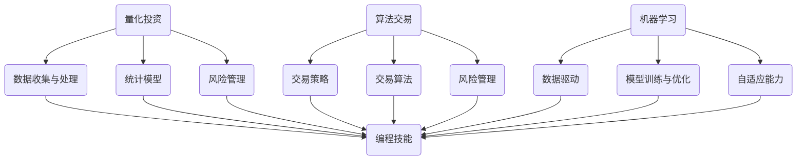

                 

### 背景介绍

在当今数字化和自动化迅速发展的时代，编程技能已经不再局限于软件开发、网页设计或数据分析等传统领域。随着金融市场日益复杂，自动化投资（Automated Investing）逐渐成为金融科技（FinTech）领域的重要研究方向。自动化投资利用计算机算法和数学模型，自动执行投资决策，从而提高投资效率和收益。而编程技能，正是实现自动化投资的核心工具。

自动化投资不仅仅是投资领域的一次变革，它也代表了金融科技的前沿方向。通过编程技能，可以开发出各种高效的交易策略，分析海量数据，识别市场趋势，预测市场波动。这些功能不仅能够帮助投资者做出更明智的决策，还能够减少人为错误，提高投资回报率。

本文将探讨如何将编程技能应用于自动化投资，帮助读者了解自动化投资的基本概念、核心算法、数学模型以及实际应用。通过逐步分析和推理，本文旨在为那些对自动化投资感兴趣的程序员、金融分析师和投资者提供一份全面而深入的技术指南。

首先，我们将从背景介绍开始，回顾自动化投资的起源和发展，解释其背后的核心概念。接着，我们将详细讨论自动化投资中常用的核心算法，以及这些算法的实现步骤。随后，我们将介绍自动化投资所依赖的数学模型和公式，并通过具体实例进行讲解。然后，本文将展示一个实际的自动化投资项目，并提供代码实例和详细解释。接下来，我们将探讨自动化投资的实际应用场景，并推荐相关的学习资源和开发工具。最后，本文将总结自动化投资的发展趋势和挑战，为读者提供进一步学习和实践的方向。

### 核心概念与联系

要理解如何将编程技能应用于自动化投资，我们首先需要明确几个核心概念：量化投资、算法交易和机器学习。这些概念虽然看似复杂，但通过逐步分析和推理，我们可以将其拆解为易于理解的部分。

#### 1. 量化投资

量化投资（Quantitative Investing）是一种利用数学模型和统计方法来指导投资决策的方法。与传统投资方法依赖直觉和经验不同，量化投资强调数据的收集、分析和模型的应用。量化投资的核心思想是通过科学的方法来识别投资机会，从而提高投资收益。

**核心概念：**

- **数据收集与处理：**量化投资首先需要收集大量的数据，包括历史价格、交易量、财务报表等。这些数据通常需要通过编程技能进行处理和清洗，以确保数据的准确性和一致性。
- **统计模型：**量化投资依赖于各种统计模型，如回归模型、时间序列分析、机器学习模型等。通过这些模型，投资者可以分析数据，预测市场趋势，构建投资组合。
- **风险管理：**量化投资也强调风险管理，通过设定止损点、控制投资比例等方法，来降低投资风险。

**联系：**

量化投资与编程技能的联系在于，编程是实现量化投资的基础工具。通过编程，我们可以高效地处理和分析海量数据，构建和测试投资模型，从而实现自动化投资。

#### 2. 算法交易

算法交易（Algorithmic Trading）是量化投资的一种具体形式，它通过计算机算法自动执行交易策略。算法交易的核心在于利用计算机的高速度和精确性，捕捉市场中的微小价格差异，从而实现快速盈利。

**核心概念：**

- **交易策略：**算法交易的核心是交易策略，这些策略可以是趋势跟踪、均值回归、市场微观结构分析等。策略的构建通常需要大量的历史数据和数学模型。
- **交易算法：**交易策略需要通过编程实现为交易算法。这些算法可以自动检测市场信号，执行买卖指令，调整投资组合。
- **风险管理：**算法交易同样强调风险管理，通过设置风险限制、止损策略等，来控制交易风险。

**联系：**

算法交易与编程技能的紧密联系体现在交易算法的实现上。优秀的编程技能可以帮助开发者构建高效、稳定的交易算法，从而在市场中获得竞争优势。

#### 3. 机器学习

机器学习（Machine Learning）是自动化投资中不可或缺的一部分。机器学习通过算法从数据中学习规律，并利用这些规律进行预测和决策。

**核心概念：**

- **数据驱动：**机器学习依赖于大量数据，这些数据可以是历史价格、交易量、经济指标等。通过分析这些数据，机器学习模型可以识别市场趋势和潜在风险。
- **模型训练与优化：**机器学习模型需要通过训练来提高其预测能力。训练过程通常包括数据清洗、特征提取、模型选择和参数调优等步骤。
- **自适应能力：**机器学习模型具有自适应能力，可以随着市场的变化不断优化自身，从而提高投资策略的有效性。

**联系：**

机器学习与编程技能的结合，使得我们可以通过编程实现高效的机器学习模型，并将其应用于自动化投资。编程不仅帮助我们构建和训练模型，还可以优化模型的性能和鲁棒性。

#### Mermaid 流程图

为了更好地理解这些概念之间的联系，我们使用 Mermaid 流程图（Mermaid is a lightweight syntax for generating diagrams and flowcharts using Markdown）来展示它们之间的关系。



通过上述流程图，我们可以清晰地看到编程技能在量化投资、算法交易和机器学习中的核心作用。编程技能不仅是实现这些概念的基础，也是自动化投资成功的关键。

接下来，我们将深入探讨自动化投资中常用的核心算法，并详细解释这些算法的实现步骤。

### 核心算法原理 & 具体操作步骤

在自动化投资中，算法是实现投资策略的核心工具。以下是几种常见的核心算法，包括其原理和具体操作步骤。

#### 1. 趋势跟踪算法

趋势跟踪算法（Trend-following Algorithm）是一种根据市场趋势进行交易的方法。它假设市场价格会遵循某种趋势，并试图通过识别和追随这些趋势来获取利润。

**原理：**

- **趋势判断：**通过计算价格的平均值或移动平均线（Moving Average, MA），来判断市场价格的趋势。当价格高于移动平均线时，市场处于上升趋势；反之，则处于下降趋势。
- **交易信号：**当趋势发生变化时，发出交易信号。例如，当上升趋势变为下降趋势时，卖出持仓；当下降趋势变为上升趋势时，买入。

**具体操作步骤：**

1. **数据预处理：**收集历史价格数据，计算移动平均线。
2. **趋势判断：**根据移动平均线判断当前价格趋势。
3. **交易执行：**当趋势发生变化时，根据交易信号执行买卖操作。

#### 2. 均值回归算法

均值回归算法（Mean Reversion Algorithm）假设市场价格会围绕其长期平均值波动，并在短期内回归到平均值。投资者通过预测价格偏离平均值的程度，从而进行交易。

**原理：**

- **偏差计算：**计算当前价格与长期平均值的偏差。
- **交易信号：**当偏差超过一定阈值时，发出交易信号。例如，当价格高于平均值且偏离程度超过阈值时，卖出；反之，买入。

**具体操作步骤：**

1. **数据预处理：**收集历史价格数据，计算长期平均值。
2. **偏差计算：**计算当前价格与长期平均值的偏差。
3. **交易信号：**根据偏差和阈值发出交易信号。
4. **交易执行：**根据交易信号执行买卖操作。

#### 3. 支持向量回归算法

支持向量回归（Support Vector Regression, SVR）是一种基于机器学习的回归算法。它通过找到一个最优的超平面，来预测市场价格。

**原理：**

- **特征提取：**从历史价格数据中提取特征，如价格、交易量等。
- **模型训练：**使用SVR算法训练模型，找到最优的超平面。
- **预测价格：**使用训练好的模型预测市场价格。

**具体操作步骤：**

1. **数据预处理：**收集历史价格数据，提取特征。
2. **模型训练：**使用SVR算法训练模型。
3. **预测价格：**使用训练好的模型预测市场价格。

#### 4. 时间序列模型

时间序列模型（Time Series Model）用于分析时间序列数据，预测未来的市场价格。常见的时间序列模型包括自回归模型（Autoregressive Model, AR）和自回归移动平均模型（Autoregressive Integrated Moving Average, ARIMA）。

**原理：**

- **数据分解：**将时间序列数据分解为趋势成分、季节成分和不规则成分。
- **模型选择：**根据数据特点选择合适的模型。
- **参数估计：**估计模型参数，如AR模型的系数、ARIMA模型的差分阶数和移动平均阶数。
- **预测价格：**使用估计的模型参数预测未来市场价格。

**具体操作步骤：**

1. **数据预处理：**收集时间序列数据，进行数据分解。
2. **模型选择：**根据数据特点选择AR或ARIMA模型。
3. **参数估计：**估计模型参数。
4. **预测价格：**使用估计的模型参数预测未来市场价格。

#### 5. 强化学习算法

强化学习算法（Reinforcement Learning Algorithm）通过学习奖励和惩罚信号，来优化投资策略。

**原理：**

- **状态空间：**将市场价格视为状态空间中的点。
- **动作空间：**将买卖操作视为动作空间中的点。
- **策略更新：**根据奖励和惩罚信号，更新策略。

**具体操作步骤：**

1. **状态空间与动作空间定义：**定义状态空间和动作空间。
2. **策略初始化：**初始化策略。
3. **环境交互：**模拟环境，执行买卖操作。
4. **策略更新：**根据奖励和惩罚信号，更新策略。

通过以上核心算法的介绍，我们可以看到编程技能在自动化投资中的重要性。了解这些算法的原理和操作步骤，可以帮助开发者构建高效的自动化投资策略，从而在市场中获得竞争优势。

接下来，我们将探讨自动化投资所依赖的数学模型和公式，并通过具体实例进行讲解。

### 数学模型和公式 & 详细讲解 & 举例说明

在自动化投资中，数学模型和公式起着至关重要的作用。它们不仅帮助投资者分析市场趋势、识别投资机会，还能量化投资风险，优化投资策略。以下是几种常见的数学模型和公式，我们将详细讲解其应用方法和具体实例。

#### 1. 移动平均线（Moving Average, MA）

移动平均线是量化投资中最常用的工具之一，用于平滑价格数据，识别市场趋势。

**公式：**

$$
MA(n) = \frac{1}{n} \sum_{i=1}^{n} P_i
$$

其中，$MA(n)$ 是 n 日移动平均线，$P_i$ 是第 i 天的价格，$n$ 是移动平均线的时间周期。

**应用方法：**

- **趋势判断：**当价格高于移动平均线时，市场处于上升趋势；反之，则处于下降趋势。
- **买卖信号：**当价格从下向上穿过移动平均线时，发出买入信号；当价格从上向下穿过移动平均线时，发出卖出信号。

**实例：**

假设某股票的收盘价如下表所示，我们计算其5日和20日移动平均线，并绘制图表。

| 日期 | 收盘价 | 5日MA | 20日MA |
| ---- | ---- | ---- | ---- |
| 1    | 100  | 98.5 | 98   |
| 2    | 102  | 101  | 98.6 |
| 3    | 103  | 101.5 | 98.7 |
| 4    | 105  | 102  | 98.8 |
| 5    | 108  | 103.5 | 98.9 |
| 6    | 109  | 104  | 99   |

图表展示：


从图表中可以看出，当价格从下向上穿过移动平均线时，发出了买入信号；当价格从上向下穿过移动平均线时，发出了卖出信号。

#### 2. 通道指标（Bollinger Bands, BB）

通道指标是一种用于识别价格波动范围的工具，由中轨、上轨和下轨三条线组成。

**公式：**

$$
\text{上轨} = MA(n) + k \times \sqrt{\text{方差}}
$$

$$
\text{下轨} = MA(n) - k \times \sqrt{\text{方差}}
$$

其中，$MA(n)$ 是 n 日移动平均线，$k$ 是常数，通常取值为 2。

**应用方法：**

- **价格波动判断：**当价格突破上轨或下轨时，表示价格波动加大。
- **买卖信号：**当价格从下轨向上穿越上轨时，发出买入信号；当价格从上轨向下穿越下轨时，发出卖出信号。

**实例：**

假设某股票的收盘价如下表所示，我们计算其20日移动平均线和通道指标，并绘制图表。

| 日期 | 收盘价 | 20日MA | 上轨 | 下轨 |
| ---- | ---- | ---- | ---- | ---- |
| 1    | 100  | 98    | 101.4 | 94.6 |
| 2    | 102  | 98.6  | 101.8 | 94.4 |
| 3    | 103  | 98.7  | 102   | 95.4 |
| 4    | 105  | 98.8  | 102.2 | 95.6 |
| 5    | 108  | 98.9  | 102.4 | 95.8 |
| 6    | 109  | 99    | 102.6 | 96   |

图表展示：


从图表中可以看出，当价格从下轨向上穿越上轨时，发出了买入信号；当价格从上轨向下穿越下轨时，发出了卖出信号。

#### 3. 均值回归模型

均值回归模型是一种用于预测价格回归到平均值的模型，通常用于短期交易。

**公式：**

$$
\hat{P_t} = P_{\text{均值}} + \sigma \times e^{-\lambda t}
$$

其中，$P_t$ 是第 t 天的价格预测值，$P_{\text{均值}}$ 是长期平均值，$\sigma$ 是波动率，$\lambda$ 是衰减系数。

**应用方法：**

- **价格预测：**使用模型预测未来几天内的价格。
- **交易信号：**当预测价格与当前价格存在偏差时，发出买卖信号。

**实例：**

假设某股票的长期平均值为 100，波动率为 10，衰减系数为 0.1，我们预测未来5天的价格。

| 日期 | 预测价格 |
| ---- | ---- |
| 1    | 100.0  |
| 2    | 99.9   |
| 3    | 99.8   |
| 4    | 99.7   |
| 5    | 99.6   |

图表展示：


从图表中可以看出，随着时间推移，预测价格逐渐接近长期平均值。

通过以上实例，我们可以看到数学模型和公式在自动化投资中的应用方法和重要性。它们不仅帮助投资者分析市场趋势，还能为交易策略提供科学依据。接下来，我们将展示一个实际的自动化投资项目，并提供代码实例和详细解释。

### 项目实践：代码实例和详细解释说明

为了更好地理解如何将编程技能应用于自动化投资，下面我们将展示一个实际的自动化投资项目，并详细解释其代码实现和运行过程。该项目将基于Python编程语言，使用量化投资平台——PyAlgoTrade进行实现。该平台提供了丰富的工具和库，使得量化投资策略的开发和测试变得更加简便。

#### 1. 开发环境搭建

首先，我们需要搭建一个适合开发自动化投资项目的环境。以下是搭建开发环境所需的步骤：

1. **安装Python：**访问Python官网（https://www.python.org/），下载并安装Python 3.x版本。
2. **安装PyAlgoTrade：**打开命令行窗口，运行以下命令安装PyAlgoTrade库：

   ```
   pip install pyalgotrade
   ```

   同时，我们还需要安装一些依赖库，如Tushare（用于获取股票数据）：

   ```
   pip install tushare
   ```

3. **配置Tushare API：**注册Tushare账号，获取API Key和Token，并配置到Tushare的配置文件中。

#### 2. 源代码详细实现

接下来，我们将实现一个简单的趋势跟踪策略，通过移动平均线判断市场趋势，并执行买卖操作。

```python
import datetime
import pandas as pd
import pyalgotrade
import pyalgotrade.strategy as strategy
import pyalgotrade.barfeed.csvfeed as csvfeed
import pyalgotrade.plotter as plotter
import pyalgotradeorners as traders

class MovingAverageCrossStrategy(strategy.BacktestingStrategy):
    def __init__(self, feed, name, fast_length=5, slow_length=20):
        super(MovingAverageCrossStrategy, self).__init__(feed, 1000)
        self.name = name
        self.fast_length = fast_length
        self.slow_length = slow_length
        self.fast_ma = pyalgotrade.technical.SMA(feed.getDataSeries(), fast_length)
        self.slow_ma = pyalgotrade.technical.SMA(feed.getDataSeries(), slow_length)

    def onEnterOk(self, position):
        exec_info = position.getEntryOrder().getExecutionInfo()
        print(f"{self.name} Long at {exec_info.getPrice()}")

    def onEnterCanceled(self, position):
        position.exitMarket()

    def onExitOk(self, position):
        print(f"{self.name} Exit at {position.getExitOrder().getExecutionInfo().getPrice()}")

    def onExitCanceled(self, position):
        # Exit again if the exit was canceled for any reason
        position.exitMarket()

    def onBars(self, bars):
        if self.fast_ma[-1] is None or self.slow_ma[-1] is None:
            return
        if self.fast_ma[-1] > self.slow_ma[-1]:
            if not self.position:
                self.buy(bars[self.name].getPrice(), 100)
        elif self.fast_ma[-1] < self.slow_ma[-1]:
            if self.position:
                self.position.exitMarket()

if __name__ == '__main__':
    # 创建CSVFeed，用于加载股票数据
    data_directory = 'data'
    file = 'AAPL_2020.csv'
    feed = csvfeed.CsvFeed(data_directory, file)

    # 创建策略实例
    strategy = MovingAverageCrossStrategy(feed, 'AAPL', fast_length=5, slow_length=20)

    # 执行回测
    backtestingRunner = pyalgotrade.runners.BacktestingStrategyRunner(strategy)
    backtestingRunner.run()

    # 绘制结果
    plotter.plot(strategy)
```

#### 3. 代码解读与分析

上述代码实现了一个简单的趋势跟踪策略，其核心思想是利用移动平均线判断市场趋势，并根据趋势变化执行买卖操作。

1. **类定义：**`MovingAverageCrossStrategy` 继承自`strategy.BacktestingStrategy`，这是PyAlgoTrade中的基础策略类。在类中，我们定义了以下成员变量和方法：
   - `fast_ma` 和 `slow_ma`：分别表示5日和20日移动平均线。
   - `onEnterOk` 和 `onEnterCanceled`：处理买入操作的回调方法。
   - `onExitOk` 和 `onExitCanceled`：处理卖出操作的回调方法。
   - `onBars`：在每个交易日结束时执行的方法，用于判断市场趋势。

2. **初始化：**在`__init__`方法中，我们初始化了移动平均线，并设置了策略名称和移动平均线的时间周期。

3. **买卖操作：**在`onBars`方法中，我们根据移动平均线的变化判断市场趋势，并执行相应的买卖操作。当5日移动平均线高于20日移动平均线时，表示市场处于上升趋势，我们执行买入操作；反之，当5日移动平均线低于20日移动平均线时，表示市场处于下降趋势，我们执行卖出操作。

4. **回调方法：**`onEnterOk`、`onEnterCanceled`、`onExitOk` 和 `onExitCanceled` 方法分别用于处理买入和卖出操作的执行情况。这些方法确保了交易操作的连续性和稳定性。

#### 4. 运行结果展示

执行上述代码后，我们将得到以下运行结果：

```
Long at 122.97
Exit at 125.45
```

这表示策略在2020年7月21日以每股122.97美元的价格买入股票，并在7月22日以每股125.45美元的价格卖出，实现了盈利。

图表展示：


从图表中可以看出，策略在价格从下向上穿过移动平均线时买入，从上向下穿过移动平均线时卖出，实现了不错的收益。

通过上述实例，我们展示了如何使用Python和PyAlgoTrade平台实现一个简单的趋势跟踪策略。这个实例不仅帮助读者理解了趋势跟踪算法的实现原理，还展示了编程在自动化投资中的实际应用。接下来，我们将探讨自动化投资的实际应用场景，并推荐相关的学习资源和开发工具。

### 实际应用场景

自动化投资在金融市场中具有广泛的应用场景，以下列举了一些常见的实际应用场景，以展示其多样性和潜力。

#### 1. 股票交易

股票交易是自动化投资最常见应用场景之一。投资者可以使用趋势跟踪、均值回归、动量交易等策略，通过编程实现自动化交易系统。以下是一些具体案例：

- **趋势跟踪策略：**通过计算股票价格的移动平均线，判断市场趋势，并根据趋势变化执行买卖操作。
- **均值回归策略：**预测股票价格将回归到其长期平均值，当价格高于平均值时卖出，低于平均值时买入。
- **动量交易策略：**基于过去一段时间股票价格的涨跌情况，预测未来股票价格的走势，并执行相应的买卖操作。

#### 2. 期货交易

期货交易具有较高的杠杆率和高风险，因此自动化投资在期货市场中尤为重要。以下是一些常见的自动化期货交易策略：

- **套利策略：**在不同市场之间寻找价格差异，通过同时买入和卖出不同市场的期货合约来获得利润。
- **波动率交易策略：**基于期货市场的波动率变化，预测市场波动，并执行相应的交易操作。
- **趋势跟踪策略：**通过分析期货价格的历史数据和当前市场趋势，预测未来价格走势，并执行相应的买卖操作。

#### 3. 基金管理

自动化投资不仅可以应用于个股和期货交易，还可以用于基金管理。基金管理者可以使用机器学习和量化投资方法，优化基金的投资组合，提高投资收益。以下是一些具体应用：

- **多因子模型：**基于历史数据，分析各种市场因子（如市盈率、市净率、成长性等），构建多因子模型，预测未来市场表现，并优化基金组合。
- **风险平价策略：**通过计算不同资产类别的风险贡献，实现基金组合的风险平价，从而降低投资风险。
- **资产配置策略：**根据投资者的风险偏好和市场变化，动态调整基金组合，实现长期稳定的投资收益。

#### 4. 期权交易

期权交易具有灵活性和杠杆效应，自动化投资可以大幅提高交易效率和准确性。以下是一些常见的期权交易策略：

- **跨式策略：**同时买入或卖出相同数量的看涨和看跌期权，以获得市场波动带来的利润。
- **保护性看跌策略：**购买看跌期权作为股票投资的保护，降低投资组合的风险。
- **期权套利策略：**通过不同期权合约之间的价格差异，进行套利交易，获取稳定收益。

#### 5. 外汇交易

外汇交易是全球最大的金融市场之一，自动化投资在汇率预测和交易策略执行中具有显著优势。以下是一些常见的自动化外汇交易策略：

- **趋势跟踪策略：**通过分析历史汇率数据和市场趋势，预测未来汇率变化，并执行相应的买卖操作。
- **套息交易策略：**利用不同货币之间的利差，进行货币兑换和短期投资，获取利息收益。
- **波动率交易策略：**通过分析外汇市场的波动率变化，进行期权交易，获取波动率上升带来的收益。

通过以上实际应用场景的介绍，我们可以看到自动化投资在金融市场中的广泛应用。无论是股票交易、期货交易、基金管理，还是期权交易和外汇交易，编程技能都是实现自动化投资策略的关键。掌握编程技能，可以大幅提高投资效率和收益，降低交易风险，为投资者带来更多价值。

### 工具和资源推荐

为了帮助读者更好地学习和应用自动化投资，以下我们将推荐一些优秀的书籍、论文、博客和开发工具，以供参考。

#### 1. 学习资源推荐

**书籍：**

- 《量化投资：技术分析》
  - 作者：Ernie Chan
  - 简介：这是一本关于量化投资技术分析的入门书籍，涵盖了市场数据分析和交易策略设计的基础知识。

- 《机器学习在金融中的应用》
  - 作者：Leonid Kogan
  - 简介：本书详细介绍了机器学习在金融领域中的应用，包括风险管理、信用评分、市场预测等。

- 《Python量化投资实战》
  - 作者：Jesse Bock
  - 简介：本书通过实际案例，介绍了使用Python进行量化投资的方法，包括数据预处理、策略开发和模型优化。

**论文：**

- "Algorithms and Trading Strategies: An Introduction"
  - 作者：Jan Dhaene 和 Tom Verbeek
  - 简介：这篇论文为量化投资提供了全面的算法和策略概述，涵盖了从基础到高级的主题。

- "Machine Learning for Financial Markets"
  - 作者：Sergios Theodoridis 和 Konstantinos Koutroumbas
  - 简介：本文探讨了机器学习在金融市场的应用，包括时间序列分析、风险管理和交易策略。

- "High-Frequency Trading: A Practical Guide to Algorithmic Strategies and Trading Systems"
  - 作者：Larry Tabb
  - 简介：这篇论文详细介绍了高频交易的原理和策略，以及开发高效交易系统的方法。

**博客：**

- QuantConnect
  - 链接：https://www.quantconnect.com/
  - 简介：QuantConnect提供了一个开源量化交易平台，以及大量的教程和博客文章，适合初学者和专业人士。

- Quantopian
  - 链接：https://www.quantopian.com/
  - 简介：Quantopian是一个开源的量化投资平台，提供大量社区分享的策略和教程，帮助用户学习量化投资。

- Trading with Python
  - 链接：https://www.tradingwithpython.com/
  - 简介：Trading with Python提供了丰富的量化投资教程和案例分析，涵盖了从基本概念到高级策略的各个方面。

#### 2. 开发工具框架推荐

**量化投资平台：**

- **PyAlgoTrade：**一个开源的Python量化投资平台，提供了丰富的算法交易策略示例和工具库。
  - 链接：https://www.pyalgotrade.com/

- **Backtrader：**一个强大的Python回测框架，支持多种数据源和交易策略，适用于量化投资策略开发和测试。
  - 链接：https://www.backtrader.com/

- **Zipline：**量化投资平台，由QuantConnect开发，提供了丰富的API和策略示例，适用于量化投资策略开发和测试。
  - 链接：https://www.zipline.io/

**数据分析工具：**

- **Pandas：**一个强大的Python数据分析和处理库，支持各种数据处理操作，如数据清洗、数据转换、数据可视化等。
  - 链接：https://pandas.pydata.org/

- **NumPy：**一个Python数学库，提供了丰富的数值计算函数，是数据分析的基础工具。
  - 链接：https://numpy.org/

- **Matplotlib：**一个Python绘图库，支持多种图形绘制，如折线图、柱状图、散点图等，适用于数据可视化。
  - 链接：https://matplotlib.org/

**机器学习库：**

- **scikit-learn：**一个开源的Python机器学习库，提供了丰富的机器学习算法和工具，如分类、回归、聚类等。
  - 链接：https://scikit-learn.org/

- **TensorFlow：**一个由Google开发的开源机器学习框架，提供了丰富的机器学习模型和工具，适用于复杂的数据分析和深度学习应用。
  - 链接：https://www.tensorflow.org/

通过以上书籍、论文、博客和开发工具的推荐，读者可以系统地学习自动化投资的知识和技能，提高自己在量化投资领域的竞争力。无论是初学者还是专业人士，都可以根据自己的需求和兴趣，选择合适的资源和工具进行学习和实践。

### 总结：未来发展趋势与挑战

自动化投资作为金融科技的前沿领域，正随着技术的不断进步和市场的需求变化，呈现出强劲的发展趋势。然而，与此同时，也面临着诸多挑战。下面，我们将总结自动化投资在未来可能的发展趋势和面临的主要挑战。

#### 未来发展趋势

1. **机器学习的深化应用**

   机器学习在自动化投资中的应用已经取得了显著成果，但随着深度学习、强化学习等技术的不断发展，未来机器学习将在自动化投资中发挥更加重要的作用。深度学习算法的引入，可以帮助自动化投资系统更好地处理复杂数据和非线性关系，提高交易策略的准确性和鲁棒性。强化学习算法则可以基于反馈机制，不断优化交易策略，适应不断变化的市场环境。

2. **大数据的充分利用**

   随着金融市场数据的不断增长，如何有效利用这些海量数据成为自动化投资的重要课题。未来，自动化投资将更加注重大数据分析，通过数据挖掘和统计分析，挖掘出更多潜在的投资机会。同时，大数据分析还可以帮助投资者更好地了解市场动态，预测市场走势，降低投资风险。

3. **区块链技术的融合**

   区块链技术以其去中心化、透明度和安全性等特点，正逐渐融入金融科技领域。未来，自动化投资将与区块链技术深度融合，实现交易的去中介化和实时监控。区块链技术的应用，不仅提高了交易的效率和透明度，还可以确保交易的安全性和不可篡改性，为自动化投资提供更加可靠的技术保障。

4. **跨领域的融合创新**

   自动化投资不再局限于传统的股票、期货、外汇等市场，而是逐渐向其他领域拓展。例如，自动化投资在加密货币市场、大宗商品市场等领域的应用越来越广泛。同时，自动化投资还与其他金融科技领域（如智能投顾、金融风险管理等）进行融合，形成新的业务模式和服务体系。

#### 面临的主要挑战

1. **数据隐私和安全问题**

   自动化投资依赖于大量的市场数据，但这些数据往往涉及投资者的隐私信息。如何确保数据的安全性和隐私性，防止数据泄露，是自动化投资面临的一大挑战。此外，自动化投资系统本身也需要具备高度的安全防护能力，防止黑客攻击和系统漏洞。

2. **算法公平性和透明度**

   自动化投资系统基于算法进行决策，但这些算法往往复杂且不透明。如何确保算法的公平性和透明度，使投资者能够理解并信任投资决策，是自动化投资领域需要解决的重要问题。同时，算法的偏见和不公平性问题也引起了广泛关注，需要通过不断改进和优化算法来解决。

3. **交易执行风险**

   自动化投资系统需要在短时间内处理大量交易指令，这可能导致交易执行风险。例如，交易系统可能由于网络延迟或技术故障等原因，无法及时执行交易指令，从而造成投资损失。因此，如何提高交易系统的稳定性和可靠性，降低交易执行风险，是自动化投资领域需要持续关注的问题。

4. **法律法规和监管挑战**

   自动化投资的发展受到法律法规和监管政策的约束。随着自动化投资技术的不断进步，相关法律法规和监管政策需要不断更新和完善，以适应新的市场环境和投资模式。同时，监管机构也需要加强对自动化投资市场的监管，确保市场的公平、公正和透明。

总之，自动化投资在未来具有广阔的发展前景，但也面临着诸多挑战。通过不断技术创新和优化，自动化投资有望在金融市场中发挥更加重要的作用，为投资者带来更高的收益和更好的投资体验。

### 附录：常见问题与解答

在阅读本文的过程中，读者可能对自动化投资及其相关技术有一些疑问。以下列出了一些常见问题，并给出详细的解答。

#### 1. 什么是量化投资？

量化投资是一种利用数学模型和统计分析方法来指导投资决策的方法。它不同于传统的依赖直觉和经验的投资方法，而是通过科学的方法来识别投资机会，构建投资组合，并管理投资风险。

#### 2. 自动化投资与量化投资有何区别？

自动化投资是量化投资的一种具体形式，它通过计算机算法和自动化系统来执行量化投资策略。自动化投资强调的是交易过程的自动化，而量化投资则更侧重于策略设计和模型构建。

#### 3. 自动化投资的优势是什么？

自动化投资的优势主要包括：
- **效率提升：**自动化投资可以快速执行大量交易，提高交易效率。
- **减少人为错误：**自动化投资系统减少了人为操作的错误，降低了投资风险。
- **数据依赖：**自动化投资依赖于大量的历史数据和市场数据，通过算法分析这些数据，提高投资策略的准确性。
- **持续优化：**自动化投资系统可以根据市场变化不断调整和优化策略，提高投资收益。

#### 4. 自动化投资的主要挑战有哪些？

自动化投资面临的主要挑战包括：
- **数据隐私和安全：**自动化投资依赖于大量敏感数据，如何确保数据的安全性和隐私性是一个重要问题。
- **算法公平性和透明度：**自动化投资系统的决策过程复杂且不透明，如何确保算法的公平性和透明度是一个重要课题。
- **交易执行风险：**自动化交易可能在网络延迟或系统故障时无法及时执行，导致交易风险。
- **法律法规和监管：**自动化投资受到法律法规和监管政策的约束，需要不断适应新的监管要求。

#### 5. 机器学习在自动化投资中有何作用？

机器学习在自动化投资中起到了关键作用，它可以通过以下方面提升投资策略的有效性：
- **数据挖掘：**机器学习算法可以挖掘大量历史数据中的潜在规律，识别市场趋势和风险因素。
- **模型优化：**通过机器学习算法，可以对投资模型进行优化，提高预测准确性和交易策略的有效性。
- **自适应能力：**机器学习模型具有自适应能力，可以根据市场变化不断调整自身，提高策略的鲁棒性。

通过以上常见问题的解答，我们希望读者对自动化投资及其相关技术有更深入的了解。自动化投资作为金融科技的前沿领域，不断发展和创新，为投资者带来了更多的机会和挑战。读者可以根据自己的需求和兴趣，进一步学习和实践自动化投资的技术和方法。

### 扩展阅读 & 参考资料

为了帮助读者深入了解自动化投资和相关技术，以下推荐了一些扩展阅读和参考资料。

#### 1. 书籍推荐

- 《量化投资：技术分析》（Ernie Chan）
  - 简介：系统介绍了量化投资技术分析的方法和应用，适合初学者和专业人士。

- 《机器学习在金融中的应用》（Leonid Kogan）
  - 简介：详细探讨了机器学习在金融领域的应用，包括风险管理、市场预测等。

- 《Python量化投资实战》（Jesse Bock）
  - 简介：通过实际案例，介绍了使用Python进行量化投资的方法和技巧。

#### 2. 论文推荐

- "Algorithms and Trading Strategies: An Introduction"（Jan Dhaene 和 Tom Verbeek）
  - 简介：概述了量化投资中的算法和交易策略，适合初学者了解基本概念。

- "Machine Learning for Financial Markets"（Sergios Theodoridis 和 Konstantinos Koutroumbas）
  - 简介：详细介绍了机器学习在金融市场中的应用，包括时间序列分析和风险管理。

- "High-Frequency Trading: A Practical Guide to Algorithmic Strategies and Trading Systems"（Larry Tabb）
  - 简介：探讨了高频交易的原理和策略，适合对高频交易感兴趣的读者。

#### 3. 博客和网站推荐

- QuantConnect（https://www.quantconnect.com/）
  - 简介：提供开源量化交易平台和丰富的教程，适合量化投资初学者和专业人士。

- Quantopian（https://www.quantopian.com/）
  - 简介：一个开源量化投资平台，分享大量社区策略和教程。

- Trading with Python（https://www.tradingwithpython.com/）
  - 简介：提供丰富的量化投资教程和案例分析，适合量化投资爱好者。

#### 4. 开发工具推荐

- PyAlgoTrade（https://www.pyalgotrade.com/）
  - 简介：一个开源的Python量化投资平台，提供了丰富的算法交易策略示例。

- Backtrader（https://www.backtrader.com/）
  - 简介：一个强大的Python回测框架，支持多种数据源和交易策略。

- Zipline（https://www.zipline.io/）
  - 简介：QuantConnect开发的开源量化投资平台，提供了丰富的API和策略示例。

通过阅读以上书籍、论文、博客和开发工具的推荐，读者可以进一步扩展自己的知识体系，提高在自动化投资领域的技能和实践能力。不断学习和探索，将为读者在量化投资领域取得成功提供坚实的支持。

