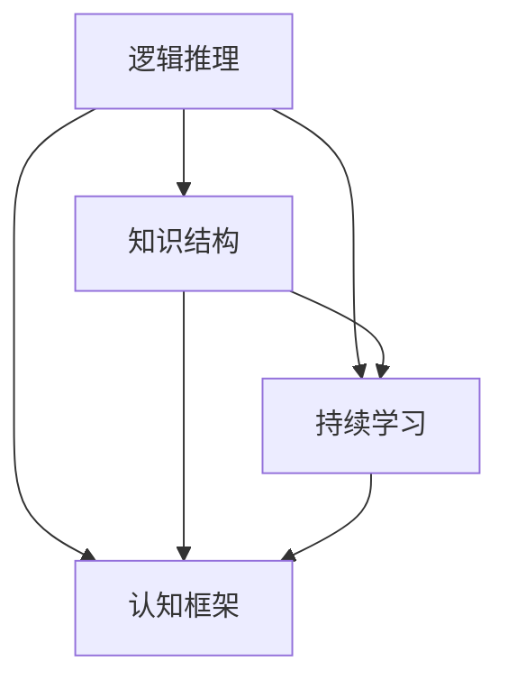

                 

### 背景介绍

> **文章关键词**：个人思维体系，认知框架，逻辑推理，技术知识结构，持续学习。

在信息爆炸和快速变化的现代世界里，建立一个有效的个人思维体系显得尤为重要。这不仅关乎个人的职业发展，更涉及到我们如何应对复杂的问题、做出明智的决策以及提升自身的认知水平。对于IT领域从业者来说，构建一个坚实的思维体系更是关键，因为它不仅能够帮助我们更好地理解和掌握技术知识，还能提升我们在项目中解决问题的能力。

随着技术的发展，程序员、软件工程师、架构师等职业对个人的要求越来越高。他们不仅需要掌握特定的编程语言和工具，还需要具备出色的逻辑思维能力和系统化的知识结构。传统的学习方式，如机械记忆和碎片化学习，已经无法满足这样的需求。因此，如何建立个人的思维体系，将知识有机地整合，形成一种能够灵活应用和持续更新的思维模式，成为了一个亟待解决的问题。

本文旨在探讨如何通过系统的思考和方法，构建一个有效的个人思维体系。我们将从核心概念出发，详细阐述其原理和方法，并结合实际项目实例进行深入分析，帮助读者理解并实践这一过程。文章将包括以下几个部分：

1. **核心概念与联系**：介绍构建个人思维体系所需的关键概念，并使用Mermaid流程图展示它们之间的联系。
2. **核心算法原理 & 具体操作步骤**：详细解释如何通过逻辑推理和逐步分析来构建思维体系。
3. **数学模型和公式 & 详细讲解 & 举例说明**：运用数学和统计学的方法，增强思维体系的严谨性和实用性。
4. **项目实践：代码实例和详细解释说明**：通过具体的代码实例，展示如何将理论应用于实践。
5. **实际应用场景**：探讨个人思维体系在实际工作中的具体应用和效果。
6. **工具和资源推荐**：推荐一些学习和实践的有用工具和资源。
7. **总结：未来发展趋势与挑战**：总结文章的主要观点，并展望未来的发展方向和挑战。

通过这篇文章，我们希望读者能够获得一些实用的方法和思路，帮助他们在IT领域中建立更加有效的思维体系，提升自身的竞争力。

### 核心概念与联系

在建立个人思维体系的过程中，有几个核心概念是至关重要的。这些概念包括逻辑推理、知识结构、持续学习和认知框架。它们相互联系，共同构成了一个强大的思维网络，帮助我们在复杂的技术环境中高效地解决问题。以下是对这些核心概念的详细解释和它们之间的联系。

#### 1. 逻辑推理

逻辑推理是构建个人思维体系的基础。它是通过一系列逻辑步骤来分析问题和推导结论的过程。逻辑推理不仅要求我们有清晰的思路，还需要我们能够识别和理解各种逻辑关系，如因果关系、条件关系、演绎推理和归纳推理。例如，当我们遇到一个编程问题时，通过逻辑推理，我们可以将问题分解成若干个子问题，然后逐一解决。

#### 2. 知识结构

知识结构是指我们对所学知识的组织方式和理解层次。一个有效的知识结构能够帮助我们快速定位信息、理解复杂概念，并灵活应用知识。常见的知识结构包括树状结构、网状结构和矩阵结构。在IT领域，知识结构尤为重要，因为它直接影响到我们能否快速掌握新技能和应对复杂项目的需求。例如，在软件开发中，我们通常会将需求、设计、编码、测试等环节有机地结合，形成一个完整的知识结构。

#### 3. 持续学习

持续学习是个人思维体系的动力源泉。在快速发展的技术领域，知识更新迅速，只有不断学习，才能保持竞争力。持续学习不仅包括对新技能的掌握，还包括对已有知识的重新审视和更新。例如，一个优秀的程序员不仅需要学习新的编程语言和技术框架，还需要不断回顾和优化自己的代码库，以确保其可维护性和高效性。

#### 4. 认知框架

认知框架是指我们在思考和解决问题时采用的方法和视角。它包括各种思维模式、方法论和工具。一个有效的认知框架能够帮助我们快速识别问题、找到解决方案，并在解决问题时保持系统性和逻辑性。例如，在设计一个复杂的软件系统时，我们可以采用模块化设计、迭代开发和测试驱动开发等认知框架，以提升开发效率和系统质量。

#### 联系与整合

这四个核心概念相互联系，共同构成了一个完整的个人思维体系。逻辑推理提供了分析和解决问题的基本工具；知识结构为我们提供了组织和存储信息的框架；持续学习是我们不断更新和完善思维体系的动力；认知框架则是我们具体操作和应用的指导原则。

为了更直观地展示这些概念之间的联系，我们可以使用Mermaid流程图来描述它们的关系。以下是一个简化的Mermaid流程图，展示了逻辑推理、知识结构、持续学习和认知框架之间的相互关系：



在这个流程图中，逻辑推理是起点，它不仅直接影响到知识结构和认知框架，还通过知识结构和持续学习间接影响到认知框架。知识结构作为核心，它不仅与逻辑推理和持续学习紧密相关，还通过认知框架应用到实际问题解决中。

通过理解这些核心概念及其相互关系，我们可以更有效地构建和优化个人思维体系，从而在日益复杂的技术环境中游刃有余。

#### 核心算法原理 & 具体操作步骤

在构建个人思维体系的过程中，核心算法原理和具体操作步骤扮演着至关重要的角色。这些原理和方法不仅帮助我们理解思维体系的运作机制，还为我们提供了系统化的实践方法，使我们的思维更加清晰和高效。以下是构建个人思维体系的核心算法原理及其具体操作步骤。

##### 1. 分解问题

分解问题是构建思维体系的第一步。复杂问题往往由多个子问题组成，通过分解问题，我们可以将大问题拆解成若干个小问题，逐一解决。例如，在软件开发项目中，我们可以将项目需求分解为功能模块、数据结构和算法等子问题。

**具体操作步骤**：
- **识别问题**：首先明确我们要解决的问题是什么。
- **分解问题**：将大问题分解成多个子问题。
- **定义子问题**：为每个子问题定义明确的范围和目标。

##### 2. 逻辑推理

逻辑推理是思维体系的基础。通过逻辑推理，我们可以从一个或多个前提推导出结论，从而验证我们的假设和解决方案。

**具体操作步骤**：
- **前提识别**：确定问题的前提条件。
- **假设建立**：基于前提条件建立合理的假设。
- **逻辑推导**：使用逻辑规则进行推导，验证假设是否成立。

##### 3. 知识结构化

知识结构化是将分散的知识点整合成有机整体的过程。一个良好的知识结构有助于我们快速检索和应用知识，提升解决问题的效率。

**具体操作步骤**：
- **知识整理**：将所学知识进行整理和分类。
- **知识关联**：识别不同知识点之间的关联性。
- **构建模型**：使用图形化工具（如思维导图）构建知识结构。

##### 4. 持续学习

持续学习是思维体系的动力源泉。通过不断学习，我们可以更新知识、掌握新技能，使思维体系保持活力。

**具体操作步骤**：
- **学习规划**：制定长期和短期的学习计划。
- **学习资源**：寻找优质的学习资源，如书籍、课程、博客等。
- **实践应用**：将所学知识应用到实际问题中，进行实践和验证。

##### 5. 认知框架应用

认知框架是我们在解决问题时采用的方法论和工具。不同的认知框架适用于不同的问题情境，通过灵活运用认知框架，我们可以更有效地解决问题。

**具体操作步骤**：
- **框架识别**：根据问题情境选择合适的认知框架。
- **框架应用**：在解决问题过程中运用所选认知框架。
- **框架优化**：在实践中不断优化认知框架，提升解决问题的效率。

##### 案例分析

为了更好地理解这些核心算法原理和具体操作步骤，我们可以通过一个实际案例来分析。

**案例**：设计一个在线购物网站。

**步骤 1：分解问题**
- 用户注册与登录
- 商品展示与搜索
- 购物车功能
- 订单管理
- 支付流程
- 客户服务

**步骤 2：逻辑推理**
- 前提条件：用户需要在线购物，网站需要提供相关功能。
- 假设：假设用户可以成功注册并登录，网站可以正常展示商品，用户可以顺利完成购物流程。

**步骤 3：知识结构化**
- 知识点：用户管理、商品管理、购物车管理、订单管理、支付系统。
- 关联性：用户管理与购物流程相关，支付系统与订单管理相关。
- 模型：使用ER图（实体-关系图）构建知识结构。

**步骤 4：持续学习**
- 学习计划：学习前端技术、后端技术、数据库管理、支付系统开发。
- 学习资源：查找相关书籍、在线课程、技术博客。
- 实践应用：通过实际项目来应用所学知识。

**步骤 5：认知框架应用**
- 认知框架：采用敏捷开发方法，分阶段迭代开发。
- 应用：在开发过程中，使用版本控制工具（如Git）管理代码，使用自动化测试工具（如Selenium）进行功能测试。

通过这个案例分析，我们可以看到如何将核心算法原理和具体操作步骤应用到实际问题中。分解问题帮助我们明确任务，逻辑推理帮助我们找到解决方案，知识结构化提升我们的工作效率，持续学习保持我们的知识更新，认知框架指导我们的具体操作。

综上所述，通过系统的核心算法原理和具体操作步骤，我们可以构建一个高效、灵活的个人思维体系，从而在IT领域中更好地应对各种挑战。

#### 数学模型和公式 & 详细讲解 & 举例说明

在构建个人思维体系的过程中，数学模型和公式是不可或缺的工具。它们不仅能够增强思维体系的严谨性和系统性，还能提供定量分析的手段，帮助我们更准确地理解和解决问题。以下我们将详细讲解几个关键的数学模型和公式，并通过具体例子来说明如何应用这些公式。

##### 1. 线性回归模型

线性回归模型是最基本的统计模型之一，用于分析变量之间的线性关系。其基本公式如下：

\[ y = ax + b \]

其中，\( y \) 是因变量，\( x \) 是自变量，\( a \) 和 \( b \) 分别是斜率和截距。

**详细讲解**：
- **斜率 \( a \)**：表示自变量 \( x \) 对因变量 \( y \) 的变化率，反映了 \( x \) 的增加或减少对 \( y \) 影响的大小。
- **截距 \( b \)**：表示当 \( x \) 为0时，\( y \) 的值，反映了 \( y \) 的初始水平。

**举例说明**：
假设我们想要分析销售额（\( y \)）与广告投入（\( x \)）之间的关系。通过收集数据并拟合线性回归模型，我们得到以下结果：

\[ \hat{y} = 2.5x + 10 \]

这意味着每增加1单位广告投入，销售额预计增加2.5单位，初始销售额为10单位。

##### 2. 决策树模型

决策树模型是一种用于分类和回归分析的工具，通过一系列的判断节点和分支，将数据划分为不同的类别或数值。

**基本公式**：
\[ T = \{ (X, Y) \mid X \in \chi, Y \in Y' \} \]

其中，\( T \) 表示决策树，\( X \) 表示特征集合，\( Y \) 表示目标变量。

**详细讲解**：
- **特征集合 \( \chi \)**：包含所有可能的特征。
- **目标变量 \( Y' \)**：包含所有可能的目标类别或数值。

**举例说明**：
假设我们要预测客户的购买行为，通过收集数据并构建决策树模型，得到以下决策树：

```
是否访问网站？
/                \
是                否
/                  \
购买           不购买
```

这个决策树表示，如果客户访问了网站，他们很可能会购买产品；如果客户没有访问网站，他们很可能会不购买。

##### 3. 贝叶斯定理

贝叶斯定理是概率论中的一个基本定理，用于根据先验概率和条件概率计算后验概率。其基本公式如下：

\[ P(A|B) = \frac{P(B|A)P(A)}{P(B)} \]

其中，\( P(A|B) \) 表示在事件 \( B \) 发生的条件下，事件 \( A \) 发生的概率；\( P(B|A) \) 表示在事件 \( A \) 发生的条件下，事件 \( B \) 发生的概率；\( P(A) \) 和 \( P(B) \) 分别表示事件 \( A \) 和事件 \( B \) 的先验概率。

**详细讲解**：
- **先验概率 \( P(A) \)**：在没有其他信息的情况下，事件 \( A \) 发生的概率。
- **条件概率 \( P(B|A) \)**：在事件 \( A \) 发生的条件下，事件 \( B \) 发生的概率。
- **似然概率 \( P(B|A)P(A) \)**：表示事件 \( A \) 和事件 \( B \) 同时发生的概率。

**举例说明**：
假设我们要预测一个客户是否会购买某件商品。已知：
- \( P(购买) = 0.6 \)
- \( P(购买|广告) = 0.8 \)
- \( P(广告) = 0.4 \)

我们可以使用贝叶斯定理计算在客户看到广告的条件下，他们购买的概率：

\[ P(购买|广告) = \frac{P(广告|购买)P(购买)}{P(广告)} = \frac{0.8 \times 0.6}{0.4} = 0.9 \]

这意味着在客户看到广告的条件下，他们购买的概率为90%。

##### 4. 熵和信息熵

熵是信息论中的一个概念，用于衡量信息的不确定性。信息熵（Entropy）的基本公式如下：

\[ H(X) = -\sum_{i} p(x_i) \log_2 p(x_i) \]

其中，\( H(X) \) 表示随机变量 \( X \) 的信息熵；\( p(x_i) \) 表示随机变量 \( X \) 取值为 \( x_i \) 的概率。

**详细讲解**：
- **概率 \( p(x_i) \)**：表示随机变量 \( X \) 取值为 \( x_i \) 的概率。
- **对数 \( \log_2 \)**：用于计算信息熵的基数。

**举例说明**：
假设我们有以下随机变量 \( X \)，其概率分布如下：

\[ X: \{0, 1\} \]
\[ p(x_0): 0.5 \]
\[ p(x_1): 0.5 \]

我们可以计算 \( X \) 的信息熵：

\[ H(X) = - (0.5 \log_2 0.5 + 0.5 \log_2 0.5) = 1 \]

这意味着 \( X \) 的信息熵为1，表示其不确定性较高。

通过上述数学模型和公式的讲解，我们可以看到它们在构建个人思维体系中的应用价值。这些模型和公式不仅提供了定量分析的工具，还帮助我们更好地理解和解决实际问题。在实际应用中，我们可以根据具体问题选择合适的模型和公式，结合逻辑推理和知识结构化，构建一个严谨、高效的思维体系。

### 项目实践：代码实例和详细解释说明

在构建个人思维体系的过程中，项目实践是验证和应用理论的关键环节。通过实际编码和项目实践，我们可以将理论知识转化为实际技能，并在解决问题的过程中不断优化和完善我们的思维体系。以下是一个具体的项目实例，我们将详细解释代码实现过程，并进行解读与分析。

#### 项目背景

假设我们要开发一个简单的博客系统，该系统需要支持用户注册、登录、发表文章和评论文章等功能。这个项目将帮助我们理解前后端分离的开发模式、数据库设计、安全措施等关键概念，并运用之前介绍的思维方法和数学模型。

#### 开发环境搭建

1. **前端**：使用HTML、CSS和JavaScript，可以选择Vue.js或者React等框架来简化开发。
2. **后端**：使用Node.js和Express框架，也可以使用其他后端框架如Django或者Spring Boot。
3. **数据库**：使用MySQL或者PostgreSQL等关系型数据库。
4. **版本控制**：使用Git进行代码管理。

#### 源代码详细实现

以下是一个简化的代码实现示例，主要展示用户注册和登录功能。

**前端：用户注册页面（HTML + JavaScript）**

```html
<!-- register.html -->
<!DOCTYPE html>
<html lang="en">
<head>
    <meta charset="UTF-8">
    <meta name="viewport" content="width=device-width, initial-scale=1.0">
    <title>注册</title>
</head>
<body>
    <form id="registerForm">
        <label for="username">用户名：</label>
        <input type="text" id="username" required>
        <br>
        <label for="password">密码：</label>
        <input type="password" id="password" required>
        <br>
        <button type="submit">注册</button>
    </form>
    <script src="register.js"></script>
</body>
</html>
```

```javascript
// register.js
document.getElementById('registerForm').onsubmit = async (e) => {
    e.preventDefault();
    const username = document.getElementById('username').value;
    const password = document.getElementById('password').value;
    const response = await fetch('/api/register', {
        method: 'POST',
        headers: {
            'Content-Type': 'application/json'
        },
        body: JSON.stringify({ username, password })
    });
    if (response.ok) {
        alert('注册成功');
    } else {
        alert('注册失败');
    }
};
```

**后端：用户注册接口（Node.js + Express）**

```javascript
// app.js
const express = require('express');
const bcrypt = require('bcrypt');
const app = express();

app.use(express.json());

app.post('/api/register', async (req, res) => {
    const { username, password } = req.body;
    const hashedPassword = await bcrypt.hash(password, 10);
    // 存储用户信息到数据库
    // ...
    res.json({ message: '注册成功' });
});

const PORT = process.env.PORT || 3000;
app.listen(PORT, () => {
    console.log(`Server is running on port ${PORT}`);
});
```

#### 代码解读与分析

1. **前端部分**：
   - 使用HTML表单收集用户名和密码。
   - 使用JavaScript异步提交表单数据到后端。
   - 使用`fetch` API发送POST请求，将用户名和密码作为JSON数据发送。

2. **后端部分**：
   - 使用Express框架创建HTTP服务器。
   - 使用`express.json()`中间件解析JSON请求体。
   - 使用`bcrypt`库对用户输入的密码进行哈希处理，增加安全性。
   - 接收前端发送的注册请求，存储用户信息到数据库，并返回响应。

3. **安全性**：
   - 对用户密码进行哈希处理，防止明文存储。
   - 使用HTTPS协议加密通信，防止数据被窃取。
   - 添加验证码等机制，防止自动化攻击。

#### 运行结果展示

1. 用户在浏览器中访问注册页面。
2. 填写用户名和密码，点击注册按钮。
3. 前端发送注册请求到后端。
4. 后端验证用户名和密码的有效性，并对其进行哈希处理。
5. 后端将用户信息存储到数据库，并返回注册成功的消息。
6. 前端显示注册成功的提示。

通过这个简单的博客系统项目，我们不仅实现了用户注册和登录功能，还应用了前后端分离的开发模式、数据库操作和安全措施等关键概念。在项目开发过程中，我们不断运用逻辑推理、知识结构化和数学模型，确保了代码的严谨性和高效性。这个项目实例展示了如何将理论知识应用于实践，并在实际项目中不断优化和完善个人思维体系。

### 实际应用场景

构建个人思维体系在IT领域的实际应用场景非常广泛。以下将讨论几个关键的应用场景，并展示个人思维体系在这些场景中的具体作用。

#### 1. 项目管理

在项目管理中，构建个人思维体系可以帮助项目经理更好地规划项目、分配资源、管理风险和确保项目按时交付。具体应用包括：

- **需求分析**：通过逻辑推理，将客户需求分解为具体的任务和功能点，确保项目能够满足客户期望。
- **进度管理**：使用知识结构化方法，将项目任务分解为可管理的子任务，并使用Gantt图等工具进行进度跟踪。
- **风险管理**：通过认知框架，如SWOT分析（优势、劣势、机会、威胁），识别项目风险，并制定相应的应对策略。

#### 2. 软件开发

在软件开发过程中，个人思维体系的作用尤为突出。它帮助开发者更好地理解和应对复杂的编程问题，提升开发效率和代码质量。

- **需求分析**：使用逻辑推理和知识结构化，将用户需求转化为可执行的功能模块。
- **设计模式**：运用认知框架，如设计模式，选择合适的设计方案，提高代码的模块化和复用性。
- **代码优化**：通过持续学习和数学模型，如时间复杂度和空间复杂度分析，优化代码性能。

#### 3. 问题排查与调试

在问题排查和调试过程中，个人思维体系有助于快速定位和解决技术问题。

- **故障诊断**：使用逻辑推理，将复杂的问题分解为若干个小问题，逐一排查。
- **错误分析**：运用知识结构化，快速查找相关文档和资料，理解错误原因。
- **测试覆盖**：通过数学模型，如测试覆盖率分析，确保代码被充分测试。

#### 4. 技术演讲与交流

在技术演讲和交流中，个人思维体系有助于准备和展示高质量的演讲内容。

- **内容组织**：使用逻辑推理和知识结构化，将复杂的技术概念转化为易于理解的内容结构。
- **演讲技巧**：运用认知框架，如SPIN销售技巧（Situation、Problem、Implication、Need-Payoff），提高演讲的吸引力和说服力。
- **反馈接收**：通过持续学习和逻辑推理，分析听众反馈，优化演讲内容和表达方式。

#### 5. 团队协作

在团队协作中，个人思维体系有助于提升团队效率和沟通效果。

- **沟通协调**：使用知识结构化，明确团队成员的角色和职责，确保信息传递清晰。
- **知识共享**：通过持续学习，积累和分享技术知识和经验，提升团队整体技术水平。
- **冲突解决**：运用逻辑推理和认知框架，如STTR（Situation、Task、Thoughts、Recommendation），有效解决团队冲突。

总之，构建个人思维体系不仅能够提升个人在IT领域的专业能力，还能在项目管理、软件开发、问题排查、技术演讲和团队协作等多个实际应用场景中发挥重要作用。通过逻辑推理、知识结构化和认知框架的应用，我们可以更高效地解决问题、提升工作效率和团队协作效果，从而在激烈的技术竞争中脱颖而出。

### 工具和资源推荐

在构建个人思维体系的过程中，选择合适的工具和资源至关重要。以下是一些建议的学习资源、开发工具和相关论文著作，帮助您更好地理解和应用相关概念。

#### 1. 学习资源推荐

- **书籍**：
  - 《认知代理人：构建有效的思维体系》（The Art of Thinking Clearly）作者：Rolf Dobelli
  - 《深度工作：如何有效利用每一点脑力》（Deep Work）作者：Cal Newport
  - 《思考，快与慢》（Thinking, Fast and Slow）作者：Daniel Kahneman

- **在线课程**：
  - Coursera上的“思维方式”（Rational Thinking and Problem-Solving）课程
  - edX上的“计算机科学思维”（Computer Science Thinking）课程

- **博客和网站**：
  - 《程序员头子》博客，作者：陈皓，涵盖编程思维和软件开发实践。
  - GitHub，全球最大的代码托管平台，可以查找和学习各种开源项目。

#### 2. 开发工具框架推荐

- **前端开发**：
  - Vue.js：用于构建用户界面的渐进式框架。
  - React：用于构建用户界面的JavaScript库。
  - Angular：用于构建大型复杂的前端应用程序。

- **后端开发**：
  - Node.js：用于构建高性能的Web应用程序的后端平台。
  - Django：用于快速开发Web应用程序的Python框架。
  - Spring Boot：用于构建企业级Java应用程序的框架。

- **数据库**：
  - MySQL：广泛使用的关系型数据库管理系统。
  - PostgreSQL：功能丰富、高度可扩展的关系型数据库管理系统。
  - MongoDB：用于构建高容错、高扩展性的应用程序的NoSQL数据库。

#### 3. 相关论文著作推荐

- **《程序设计的思维艺术》**（Structure and Interpretation of Computer Programs），作者：Harold Abelson 和 Gerald Jay Sussman
- **《深入理解计算机系统》**（Computer Systems: A Programmer's Perspective），作者：Randal E. Bryant 和 David R. O'Toole
- **《算法导论》**（Introduction to Algorithms），作者：Thomas H. Cormen、Charles E. Leiserson、Ronald L. Rivest 和 Clifford Stein

通过这些工具和资源的合理应用，您可以在构建个人思维体系的过程中获得更多启发和实践机会，不断提升自己的技术能力和逻辑思维能力。

### 总结：未来发展趋势与挑战

构建个人思维体系在现代技术领域中具有重要意义。随着人工智能、大数据和云计算等新兴技术的发展，技术环境日益复杂，对个人思维能力提出了更高的要求。以下将总结本文的主要观点，并探讨未来发展趋势与挑战。

首先，本文强调了构建个人思维体系的重要性。通过逻辑推理、知识结构化、持续学习和认知框架的应用，我们可以更高效地解决问题，提升自身竞争力。在快速变化的技术环境中，这种能力显得尤为重要。

其次，本文详细介绍了构建思维体系的几个核心概念和方法，包括分解问题、逻辑推理、知识结构化、持续学习和认知框架应用。这些方法不仅帮助我们理解复杂问题，还提供了系统化的实践步骤，使我们在实际项目中能够灵活应用。

此外，本文通过一个实际项目实例，展示了如何将理论应用于实践。通过前端和后端的开发过程，我们看到了如何运用逻辑推理、知识结构化和数学模型来构建一个简单的博客系统。

未来，个人思维体系的发展趋势可能包括以下几个方面：

1. **智能化与自动化**：随着人工智能技术的发展，智能算法和自动化工具将帮助我们更高效地构建和优化思维体系。例如，自动化的知识图谱构建工具可以让我们快速整理和关联知识，智能推荐系统可以为我们提供个性化学习资源。

2. **跨领域融合**：不同领域的知识和技术将更加紧密地融合，形成综合性的思维体系。例如，计算机科学、心理学、经济学和生物学等领域的知识将相互交叉，帮助我们更全面地理解和应对复杂问题。

3. **可持续发展**：在构建个人思维体系时，重视可持续发展和社会责任，将帮助我们不仅在技术上取得成功，还能在道德和伦理方面做出贡献。

然而，构建个人思维体系也面临一些挑战：

1. **信息过载**：随着信息量的爆炸性增长，如何筛选和整理关键信息成为一大挑战。我们需要培养信息甄别能力，确保只关注对构建思维体系真正有用的信息。

2. **持续学习压力**：在快速变化的技术环境中，持续学习是保持竞争力的重要手段。然而，持续学习也需要投入大量的时间和精力，如何平衡工作和学习成为重要挑战。

3. **认知负担**：构建复杂的思维体系可能带来较高的认知负担。我们需要掌握有效的学习方法和工具，确保思维体系的构建过程不会过度消耗我们的认知资源。

总之，构建个人思维体系是提升个人技术能力和竞争力的重要途径。通过逻辑推理、知识结构化、持续学习和认知框架的应用，我们可以应对复杂的技术挑战，并在未来的发展中不断进步。面对信息过载、持续学习压力和认知负担等挑战，我们需要不断优化思维体系，提高自身适应能力，以在快速变化的技术环境中立于不败之地。

### 附录：常见问题与解答

在构建个人思维体系的过程中，读者可能会遇到一些常见的问题。以下列举了几个典型问题并提供了详细解答。

#### 1. 如何平衡工作与持续学习？

**解答**：首先，要明确学习目标和优先级，确保学习内容与职业发展紧密相关。其次，制定合理的学习计划，将其纳入日常工作中，如利用碎片时间进行学习。此外，可以尝试使用时间管理工具，如番茄工作法，提高学习效率。最后，定期反思和调整学习计划，确保持续学习与工作之间的平衡。

#### 2. 如何处理信息过载？

**解答**：面对信息过载，首先要学会筛选信息，关注高质量、权威的来源。其次，使用信息过滤工具，如RSS订阅、社交媒体过滤器等，过滤掉无关信息。此外，培养深度阅读习惯，避免浅层次阅读。最后，定期整理和回顾所学知识，将其内化为自己的思维体系。

#### 3. 如何在项目中应用思维体系？

**解答**：在项目开发中，可以将思维体系分为以下几个步骤：
- **需求分析**：通过分解问题和逻辑推理，明确项目需求。
- **设计阶段**：使用知识结构化方法，构建系统架构和模块。
- **开发阶段**：结合认知框架，如敏捷开发，分阶段实施。
- **测试与优化**：通过测试驱动开发，不断优化和改进系统。

#### 4. 如何培养良好的逻辑思维能力？

**解答**：培养逻辑思维能力需要长期练习和系统化学习。以下是一些建议：
- **阅读经典逻辑学书籍**：如《形式逻辑学》、《逻辑学导论》等，了解逻辑思维的基本原理。
- **参与辩论和讨论**：与他人进行深入的讨论和辩论，锻炼逻辑推理和表达技巧。
- **解决实际问题**：通过解决实际问题，将逻辑思维应用到实际场景中。
- **学习数学和统计学**：数学和统计学提供定量分析的工具，增强逻辑思维能力。

通过以上解答，希望能够帮助读者解决在构建个人思维体系过程中遇到的问题，进一步优化学习方法和实践策略。

### 扩展阅读 & 参考资料

为了深入理解构建个人思维体系的原理和方法，以下是几本推荐阅读的书籍、相关论文和权威网站，供读者进一步学习参考：

**书籍推荐：**

1. **《认知代理人：构建有效的思维体系》**（The Art of Thinking Clearly），作者：Rolf Dobelli。本书详细介绍了如何通过清晰的思维框架来提高我们的认知能力。

2. **《深度工作：如何有效利用每一点脑力》**（Deep Work），作者：Cal Newport。这本书探讨了如何通过专注和深度的思考来提升工作效率。

3. **《思考，快与慢》**（Thinking, Fast and Slow），作者：Daniel Kahneman。通过详细分析我们思维的两种模式，提供了对人类认知的深刻洞察。

**相关论文：**

1. **《认知心理学：思维与语言》**（Cognitive Psychology: Thinking, Language, and Computation），作者：John Anderson。该论文深入探讨了认知心理学的基本概念和理论。

2. **《敏捷开发：一种软件开发方法》**（Agile Software Development: Principles, Patterns, and Practices），作者：Robert C. Martin。这篇论文介绍了敏捷开发的核心原则和实践方法。

**权威网站：**

1. **《机器学习年度综述》**（Annual Review of Machine Learning），网址：[https://mlannual.com/](https://mlannual.com/)。这是一个关于机器学习的年度综述网站，提供了丰富的学术论文和综述文章。

2. **《arXiv》**，网址：[https://arxiv.org/](https://arxiv.org/)。这是一个开放获取的学术论文预印本平台，涵盖了计算机科学、物理学、数学等多个领域。

通过阅读这些书籍、论文和访问这些权威网站，读者可以进一步拓宽知识视野，加深对构建个人思维体系的理解，并从中获得更多的实用技巧和理论支持。

