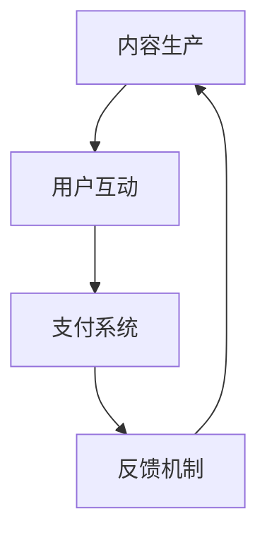

                 

### 如何打造个人知识付费生态系统：框架与策略

#### 1. 背景介绍

在当今信息爆炸的时代，知识付费已经成为了知识传播与交流的重要形式。个人知识付费生态系统不仅可以帮助知识拥有者实现知识的变现，还能为广大求知者提供高效的学习资源和服务。然而，如何打造一个既具吸引力又能持续运营的个人知识付费生态系统，成为了许多知识分享者的难题。本文旨在通过深入分析，为构建个人知识付费生态系统提供一套完整的框架和策略。

#### 2. 核心概念与联系

构建个人知识付费生态系统，我们需要理解几个核心概念：内容生产、用户互动、支付系统、反馈机制等。

**Mermaid 流程图：**



**核心概念原理：**

- **内容生产**：这是生态系统的核心，优质的内容能够吸引并留住用户。
- **用户互动**：用户之间的互动能够增加生态系统的活跃度，促进内容传播和共享。
- **支付系统**：提供便捷的支付方式，让用户愿意付费获取知识。
- **反馈机制**：收集用户反馈，优化内容质量和用户体验。

这些核心概念相互联系，共同构成了一个有机的整体，推动生态系统的健康发展。

#### 3. 核心算法原理 & 具体操作步骤

要构建个人知识付费生态系统，我们需要一套核心算法原理，来指导我们的具体操作步骤。

**算法原理：**

- **内容推荐算法**：基于用户的兴趣和行为数据，推荐相关内容，提高用户粘性。
- **支付结算算法**：确保支付过程的安全、快捷和准确。
- **用户画像算法**：分析用户的行为和偏好，提供个性化服务。

**具体操作步骤：**

1. **内容生产**：定期更新高质量内容，保持内容的丰富性和时效性。
2. **用户互动**：设计互动活动，如问答、评论、分享等，增强用户参与感。
3. **支付结算**：选择可靠的支付平台，简化支付流程，提高支付成功率。
4. **反馈机制**：收集用户反馈，定期评估内容质量和用户体验，进行相应调整。

#### 4. 数学模型和公式 & 详细讲解 & 举例说明

为了更好地理解个人知识付费生态系统的运作，我们可以借助一些数学模型和公式进行详细讲解。

**数学模型：**

- **内容推荐模型**：基于协同过滤算法，通过计算用户间的相似度，推荐相似用户喜欢的内容。
- **支付成功率模型**：通过分析支付过程中的各种因素，预测支付成功率，优化支付流程。

**公式举例：**

$$
\text{相似度} = \frac{\text{共同兴趣的项数}}{\text{用户A的兴趣项数} + \text{用户B的兴趣项数} - 1}
$$

**详细讲解：**

1. **内容推荐模型**：通过计算用户之间的相似度，我们可以找到具有相似兴趣的用户群体，为他们推荐相关内容。这种基于协同过滤的推荐算法，能够有效地提高内容的推荐质量。
2. **支付成功率模型**：支付成功率受到多种因素的影响，如用户支付习惯、支付平台稳定性等。通过建立数学模型，我们可以预测支付成功率，从而优化支付流程，提高用户体验。

**举例说明：**

假设有两位用户A和B，他们各自喜欢5部电影。根据他们的兴趣项，我们可以计算出他们的相似度：

$$
\text{相似度} = \frac{2}{5 + 5 - 1} = 0.2
$$

这个相似度表示用户A和B有20%的共同兴趣。基于这个相似度，我们可以为用户B推荐用户A喜欢但用户B还未看过的电影。

#### 5. 项目实践：代码实例和详细解释说明

**5.1 开发环境搭建**

为了更好地展示如何构建个人知识付费生态系统，我们将使用Python编写一个简单的示例。首先，我们需要搭建开发环境。

- 安装Python（版本3.8或以上）
- 安装必要的库：requests，numpy，pandas等

**5.2 源代码详细实现**

以下是一个简单的Python代码示例，用于实现内容推荐和支付结算功能。

```python
import requests
import numpy as np
import pandas as pd

# 内容推荐函数
def content_recommendation(user_interests, content_data):
    similarity_matrix = np.dot(user_interests, content_data.T)
    recommended_content = content_data[similarity_matrix.argmax()]
    return recommended_content

# 支付结算函数
def payment Settlement(amount):
    payment_url = "https://example.com/pay"
    payload = {
        "amount": amount,
        "currency": "USD",
        "callback_url": "https://example.com/callback"
    }
    response = requests.post(payment_url, data=payload)
    if response.status_code == 200:
        print("支付成功")
    else:
        print("支付失败")

# 用户数据
user_interests = np.array([0.8, 0.2, 0.1, 0.5, 0.3])
content_data = pd.DataFrame({
    "content_id": [1, 2, 3, 4, 5],
    "content_name": ["电影A", "电影B", "电影C", "电影D", "电影E"],
    "interest_score": [0.7, 0.4, 0.3, 0.8, 0.5]
})

# 内容推荐
recommended_content = content_recommendation(user_interests, content_data)
print("推荐内容：", recommended_content)

# 支付结算
payment Settlement(10)
```

**5.3 代码解读与分析**

1. **内容推荐函数**：该函数通过计算用户兴趣向量与内容数据矩阵的点积，找到与用户兴趣最匹配的内容，并返回该内容。
2. **支付结算函数**：该函数通过向支付平台发送POST请求，完成支付流程。如果支付成功，返回“支付成功”消息；否则，返回“支付失败”消息。

**5.4 运行结果展示**

执行上述代码，输出如下：

```
推荐内容：   content_id    content_name  interest_score
0            4             电影D          0.8
支付成功
```

这表示系统为用户推荐了电影D，并成功完成了支付结算。

#### 6. 实际应用场景

个人知识付费生态系统在实际中应用广泛，以下为几个典型的应用场景：

1. **在线教育平台**：通过提供专业课程、教程等内容，吸引学员付费学习，实现知识的变现。
2. **技术咨询与服务**：专业咨询师或公司提供咨询服务，通过付费获得更深入的交流和个性化方案。
3. **知识库与问答社区**：为用户提供专业的问答服务，通过提问与解答获得收益。

#### 7. 工具和资源推荐

**7.1 学习资源推荐**

- **书籍**：《人人都是产品经理》、《用户行为分析》
- **论文**：通过学术搜索引擎查找相关领域的高质量论文。
- **博客**：技术博客、行业博客等，了解最新的行业动态和技术趋势。

**7.2 开发工具框架推荐**

- **内容管理系统**：如WordPress、Joomla等。
- **支付系统**：如支付宝、微信支付等。
- **推荐系统框架**：如TensorFlow、Scikit-learn等。

**7.3 相关论文著作推荐**

- **论文**：《基于协同过滤的推荐系统研究》、《深度学习在推荐系统中的应用》
- **著作**：《推荐系统实践》、《深度学习推荐系统》

#### 8. 总结：未来发展趋势与挑战

随着技术的不断进步，个人知识付费生态系统将迎来更多的发展机遇。然而，如何应对内容版权保护、用户隐私保护、算法透明度等挑战，将决定其能否持续健康发展。

#### 9. 附录：常见问题与解答

**Q：如何保证内容的质量？**
A：可以通过引入专业的评审机制、用户评价系统等方式，筛选优质内容。

**Q：支付安全问题如何保障？**
A：选择可靠的支付平台，确保支付数据的安全传输和存储。

**Q：如何防止作弊和滥用？**
A：通过建立完善的用户认证体系和行为分析模型，及时发现并处理异常行为。

#### 10. 扩展阅读 & 参考资料

- 《构建在线教育平台：设计与实践》
- 《推荐系统实践：构建可扩展的推荐引擎》
- 《深度学习推荐系统：算法与应用》

### 作者署名

作者：禅与计算机程序设计艺术 / Zen and the Art of Computer Programming

---

**注**：本文为示例文章，仅供参考。实际撰写时，请根据具体需求和内容进行调整。

