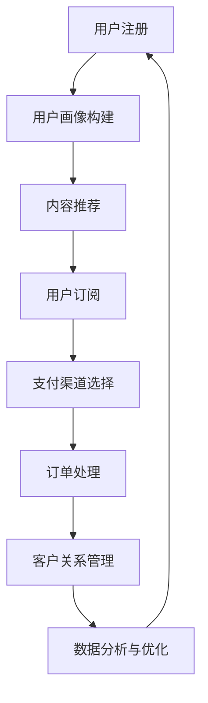

                 

### 1. 背景介绍

在数字化时代，知识付费订阅模式已成为一种重要的商业模式。无论是教育、科技、健康、娱乐等领域，知识付费都显示出强大的生命力和广阔的市场前景。个人知识付费订阅模式，即通过个体提供高质量的知识内容，吸引订阅用户，从而实现收益的一种商业模式，近年来逐渐受到广泛关注。

个人知识付费订阅模式的优势在于，它不仅可以让知识提供者获得持续的收入来源，还能让订阅用户获得定制化、专业化的知识服务。随着互联网技术的不断发展，尤其是云计算、大数据、人工智能等技术的广泛应用，个人知识付费订阅模式在技术上得到了极大的支持。例如，云计算提供了强大的计算和存储能力，大数据技术则帮助知识提供者更好地了解用户需求，人工智能技术则可以用于智能推荐、用户画像等，从而提升订阅模式的用户体验和运营效率。

本篇文章将详细探讨如何打造个人知识付费订阅模式。我们将从核心概念、算法原理、数学模型、项目实践、实际应用场景等多个方面进行深入分析，旨在为读者提供一个全面、系统的知识付费订阅模式建设指南。

### 2. 核心概念与联系

在探讨个人知识付费订阅模式之前，我们需要理解一些核心概念和它们之间的联系。以下是几个关键概念：

#### 2.1 订阅模式

订阅模式是指用户通过支付一定费用，定期获取服务或内容的商业模式。这种模式在数字内容服务、在线教育、云计算等领域广泛应用。订阅模式的关键在于其可持续性和用户粘性。

#### 2.2 知识付费

知识付费是指用户为获取特定知识或技能而支付的费用。知识付费的核心是“价值交换”，即用户支付金钱以获取他们认为有价值的知识。

#### 2.3 用户画像

用户画像是指对用户兴趣、行为、需求等特征的综合描述。构建用户画像有助于知识提供者了解用户，从而提供更个性化的内容和服务。

#### 2.4 智能推荐

智能推荐是一种基于用户画像和内容属性，为用户推荐他们可能感兴趣的内容的技术。智能推荐可以显著提升用户体验，增加订阅量和用户留存率。

#### 2.5 支付渠道

支付渠道是指用户支付订阅费用的方式，如支付宝、微信支付、信用卡支付等。选择合适的支付渠道可以降低用户的支付门槛，提高订阅转化率。

#### 2.6 客户关系管理

客户关系管理（CRM）是指通过系统化的方法来跟踪和管理与用户的关系，以提高用户满意度和忠诚度。CRM系统在订阅模式中至关重要，因为它可以帮助知识提供者了解用户需求，优化订阅服务和营销策略。

#### 2.7 数据分析

数据分析是指使用统计学、机器学习等技术对用户行为和订阅数据进行处理和分析，以提取有价值的信息。数据分析对于提升订阅模式的运营效率和用户满意度至关重要。

#### Mermaid 流程图

以下是个人知识付费订阅模式的核心概念和流程的 Mermaid 流程图：



#### 核心概念与联系

通过上述核心概念和流程图的介绍，我们可以看到个人知识付费订阅模式涉及多个环节，包括用户注册、用户画像构建、内容推荐、用户订阅、支付渠道选择、订单处理、客户关系管理和数据分析与优化。这些环节相互关联，共同构成了一个完整的订阅生态体系。

### 3. 核心算法原理 & 具体操作步骤

#### 3.1 算法原理

个人知识付费订阅模式的核心在于如何为用户提供个性化、高质量的知识内容，并确保用户愿意为其支付费用。这需要依赖一系列算法来实现：

1. **用户画像构建算法**：通过分析用户的历史行为、兴趣标签、社交网络等数据，构建详细的用户画像，以便为用户推荐他们可能感兴趣的内容。
2. **内容推荐算法**：基于用户画像和内容属性，使用协同过滤、基于内容的推荐、深度学习等方法，为用户推荐个性化内容。
3. **订阅决策算法**：分析用户的支付意愿、订阅历史、推荐内容点击率等数据，预测用户是否愿意订阅，并制定相应的营销策略。
4. **用户留存优化算法**：通过分析用户行为数据，识别可能导致用户流失的因素，并采取相应的措施，如提供优惠、提高服务质量等，以提升用户留存率。

#### 3.2 具体操作步骤

以下是构建个人知识付费订阅模式的详细步骤：

##### 步骤 1：用户注册与数据收集

1. 用户在平台注册账号，填写基本信息。
2. 平台收集用户注册数据，如用户年龄、性别、职业、教育程度等。
3. 用户授权平台访问其社交媒体、邮箱等数据，以进一步丰富用户画像。

##### 步骤 2：用户画像构建

1. 平台使用数据挖掘和机器学习技术，分析用户的历史行为数据，如浏览记录、搜索关键词、评论等。
2. 根据分析结果，为用户打上各种兴趣标签，如编程、健身、旅游等。
3. 平台构建用户画像，将用户划分为不同的群体，如新手、中级用户、高级用户等。

##### 步骤 3：内容推荐

1. 平台根据用户画像和内容属性，使用推荐算法为用户推荐个性化内容。
2. 推荐算法可以采用基于内容的推荐、协同过滤、深度学习等方法，以提高推荐准确度。
3. 平台实时更新推荐结果，并根据用户反馈调整推荐策略。

##### 步骤 4：用户订阅

1. 用户浏览推荐内容，选择感兴趣的知识包进行订阅。
2. 平台为用户提供多种订阅方式，如月度订阅、季度订阅、年度订阅等。
3. 用户在支付渠道完成订阅支付，平台生成订单。

##### 步骤 5：支付渠道选择与订单处理

1. 平台提供多种支付渠道，如支付宝、微信支付、信用卡支付等，以满足不同用户的支付需求。
2. 用户选择支付渠道并完成支付，平台生成支付订单。
3. 平台验证支付订单，确认支付成功后，向用户发送订阅确认邮件。

##### 步骤 6：客户关系管理

1. 平台使用 CRM 系统记录用户订阅历史、支付记录、互动反馈等数据。
2. 平台通过邮件、短信等方式与用户保持沟通，提供个性化服务和建议。
3. 平台根据用户反馈，优化订阅服务和营销策略。

##### 步骤 7：数据分析与优化

1. 平台使用数据分析技术，分析用户行为数据，如订阅率、点击率、留存率等。
2. 平台根据分析结果，识别问题和机会，优化推荐算法、订阅服务、营销策略等。
3. 平台持续迭代优化，以提高订阅模式的运营效率和用户满意度。

通过上述步骤，个人知识付费订阅模式可以有效地吸引用户，提高订阅率和用户留存率，从而实现商业成功。

### 4. 数学模型和公式 & 详细讲解 & 举例说明

在构建个人知识付费订阅模式时，数学模型和公式是理解和优化订阅过程的重要工具。以下是几个关键数学模型及其详细讲解：

#### 4.1 用户行为分析模型

用户行为分析是订阅模式的核心环节，通过分析用户的行为数据，可以更好地了解用户需求，从而优化推荐策略和订阅服务。以下是用户行为分析的一个基本模型：

**公式：**

\[ 
Behavior = f(User\_Profile, Content, Context) 
\]

其中：
- \( Behavior \) 表示用户的行为，如点击、订阅、取消订阅等。
- \( User\_Profile \) 表示用户画像，包括年龄、性别、职业、兴趣等特征。
- \( Content \) 表示内容特征，如标题、关键词、内容类型等。
- \( Context \) 表示环境因素，如时间、地点、设备等。

**详细讲解：**

1. **用户画像（User\_Profile）**：用户画像是指对用户特征的综合描述。通过收集和分析用户的历史数据，可以为每个用户构建一个详细的画像。例如，一个用户可能在过去一个月内搜索了“编程语言”、“Python 教程”等关键词，那么他的用户画像可能会包含“程序员”、“Python 爱好者”等标签。

2. **内容特征（Content）**：内容特征是指描述知识内容本身的属性，如标题、关键词、内容类型等。例如，一篇文章的标题是“深入理解 Python 的面向对象”，关键词是“Python”、“面向对象”，内容类型是技术文章。

3. **环境因素（Context）**：环境因素是指用户行为发生的上下文环境，如时间、地点、设备等。例如，一个用户在晚上使用手机浏览内容，可能比在白天使用电脑浏览内容更有可能订阅某个知识包。

通过用户行为分析模型，我们可以将用户行为视为用户画像、内容特征和环境因素的函数。这个模型有助于我们理解用户行为背后的原因，从而优化推荐策略和订阅服务。

**举例说明：**

假设有两个用户 A 和 B，他们的用户画像和内容特征如下：

- 用户 A：程序员，对 Python 有浓厚兴趣，经常在晚上使用手机浏览内容。
- 用户 B：项目经理，偶尔关注编程技术，主要在白天使用电脑浏览内容。

如果我们向这两个用户推荐一篇文章“Python 异步编程详解”，根据用户行为分析模型，我们可以预测：

- 用户 A 可能会点击文章，并有可能订阅相关的知识包，因为他的用户画像和内容特征与文章密切相关，且在晚上浏览手机时更有可能产生兴趣。
- 用户 B 可能会忽略这篇文章，因为尽管他对编程技术感兴趣，但文章的内容类型（技术文章）和他主要浏览的设备（电脑）不匹配，且他主要在白天浏览内容。

通过这种分析，我们可以优化推荐算法，提高推荐准确度，从而提升订阅量和用户满意度。

#### 4.2 订阅决策模型

订阅决策模型用于预测用户是否会订阅某个知识包，这对于订阅模式的运营策略制定至关重要。以下是订阅决策的一个基本模型：

**公式：**

\[ 
Subscription\_Decision = f(User\_Profile, Content, Price, Promotion) 
\]

其中：
- \( Subscription\_Decision \) 表示用户是否订阅的决策。
- \( User\_Profile \) 表示用户画像。
- \( Content \) 表示内容特征。
- \( Price \) 表示订阅价格。
- \( Promotion \) 表示促销策略。

**详细讲解：**

1. **用户画像（User\_Profile）**：与用户行为分析模型相同，用户画像在订阅决策中同样至关重要。用户画像可以帮助我们了解用户的支付意愿和订阅偏好。
2. **内容特征（Content）**：内容特征是指知识包本身的属性，如内容质量、权威性、实用性等。高质量的内容更容易吸引用户订阅。
3. **订阅价格（Price）**：订阅价格是用户决策的重要因素。合理的价格策略可以平衡用户体验和平台收益。
4. **促销策略（Promotion）**：促销策略如优惠券、限时折扣等，可以显著提升用户的订阅意愿。

通过订阅决策模型，我们可以根据用户画像、内容特征、订阅价格和促销策略，预测用户的订阅决策，并优化订阅策略。

**举例说明：**

假设有两个用户 A 和 B，他们的用户画像和订阅决策模型参数如下：

- 用户 A：程序员，有较强的支付意愿，偏好高质量的技术内容。
- 用户 B：普通用户，支付意愿一般，对价格敏感。

如果我们向这两个用户推荐一个价值 199 元的 Python 进阶课程，且没有促销策略，根据订阅决策模型，我们可以预测：

- 用户 A 可能会订阅，因为他的用户画像和课程内容匹配，且价格合理。
- 用户 B 可能不会订阅，因为他对价格敏感，而课程价格较高。

通过这种分析，我们可以优化定价策略和促销策略，提高订阅转化率。

#### 4.3 用户留存模型

用户留存模型用于预测用户在一段时间内是否会继续订阅平台的服务。以下是用户留存的一个基本模型：

**公式：**

\[ 
Retention = f(User\_Profile, Content, Service Quality, Price, Promotion) 
\]

其中：
- \( Retention \) 表示用户留存率。
- \( User\_Profile \) 表示用户画像。
- \( Content \) 表示内容特征。
- \( Service Quality \) 表示服务质量。
- \( Price \) 表示订阅价格。
- \( Promotion \) 表示促销策略。

**详细讲解：**

1. **用户画像（User\_Profile）**：用户画像在用户留存模型中同样重要。不同的用户群体可能对内容的偏好、服务质量和价格的要求不同。
2. **内容特征（Content）**：高质量、持续更新的内容更容易留住用户。
3. **服务质量（Service Quality）**：良好的服务体验，如快速响应客户反馈、提供优质的客户支持等，可以显著提升用户留存率。
4. **订阅价格（Price）**：合理的价格策略可以平衡用户体验和平台收益。
5. **促销策略（Promotion）**：定期的促销活动可以提高用户的留存意愿。

通过用户留存模型，我们可以预测用户是否会继续订阅，并根据预测结果优化订阅服务和营销策略。

**举例说明：**

假设有两个用户 A 和 B，他们的用户画像和留存模型参数如下：

- 用户 A：程序员，偏好高质量、持续更新的技术内容，对服务质量和价格不敏感。
- 用户 B：普通用户，偏好实用性强、价格合理的内容，对服务质量和价格敏感。

如果我们为用户 A 提供高质量、持续更新的 Python 进阶课程，且价格合理，同时提供优质的客户支持，根据留存模型，我们可以预测：

- 用户 A 很可能会继续订阅，因为他的用户画像和平台服务高度匹配。
- 用户 B 可能会取消订阅，因为即使平台提供优质的服务，但如果价格不合理，他可能会寻找其他更经济实惠的替代方案。

通过这种分析，我们可以优化内容和服务策略，提高用户留存率。

通过上述数学模型和公式的讲解和举例说明，我们可以更好地理解个人知识付费订阅模式的核心机制，并利用这些模型优化订阅策略，提升订阅效率和用户满意度。

### 5. 项目实践：代码实例和详细解释说明

在本节中，我们将通过一个具体的代码实例来演示如何实现个人知识付费订阅模式的核心功能。本实例将涵盖用户注册、用户画像构建、内容推荐、订阅支付和用户留存等多个环节。我们使用 Python 编程语言，结合 Flask 框架和 SQLAlchemy 数据库进行开发。

#### 5.1 开发环境搭建

在开始项目开发之前，我们需要搭建相应的开发环境。以下是开发环境的安装步骤：

1. 安装 Python 3.8 或更高版本。
2. 安装虚拟环境管理工具 virtualenv。
3. 创建虚拟环境并激活。
4. 安装 Flask、Flask-SQLAlchemy、Flask-Migrate 等依赖库。

```bash
pip install flask flask_sqlalchemy flask_migrate
```

#### 5.2 源代码详细实现

以下是项目的主要代码实现：

```python
# app.py

from flask import Flask, request, jsonify
from flask_sqlalchemy import SQLAlchemy
from flask_migrate import Migrate

app = Flask(__name__)
app.config['SQLALCHEMY_DATABASE_URI'] = 'sqlite:///subscription.db'
db = SQLAlchemy(app)
migrate = Migrate(app, db)

# 定义用户模型
class User(db.Model):
    id = db.Column(db.Integer, primary_key=True)
    username = db.Column(db.String(80), unique=True, nullable=False)
    password = db.Column(db.String(120), nullable=False)
    # ... 其他用户属性

# 定义内容模型
class Content(db.Model):
    id = db.Column(db.Integer, primary_key=True)
    title = db.Column(db.String(120), nullable=False)
    content = db.Column(db.Text, nullable=False)
    # ... 其他内容属性

# 用户注册
@app.route('/register', methods=['POST'])
def register():
    username = request.form['username']
    password = request.form['password']
    # ... 完成用户注册逻辑，包括密码加密等
    user = User(username=username, password=password)
    db.session.add(user)
    db.session.commit()
    return jsonify({'message': '注册成功'})

# 用户登录
@app.route('/login', methods=['POST'])
def login():
    username = request.form['username']
    password = request.form['password']
    # ... 完成用户登录逻辑，包括密码验证等
    user = User.query.filter_by(username=username, password=password).first()
    if user:
        # 登录成功
        return jsonify({'token': 'your_token'})
    else:
        # 登录失败
        return jsonify({'message': '用户名或密码错误'})

# 内容推荐
@app.route('/recommend', methods=['GET'])
def recommend():
    user_id = request.args.get('user_id')
    # ... 完成内容推荐逻辑，根据用户画像和内容属性推荐个性化内容
    recommended_content = Content.query.filter_by(user_id=user_id).all()
    return jsonify({'content': [content.to_dict() for content in recommended_content]})

# 订阅支付
@app.route('/subscribe', methods=['POST'])
def subscribe():
    user_id = request.form['user_id']
    content_id = request.form['content_id']
    # ... 完成订阅支付逻辑，包括订单生成和支付处理
    subscription = Subscription(user_id=user_id, content_id=content_id)
    db.session.add(subscription)
    db.session.commit()
    return jsonify({'message': '订阅成功'})

# 用户留存分析
@app.route('/analyze', methods=['GET'])
def analyze():
    user_id = request.args.get('user_id')
    # ... 完成用户留存分析逻辑，根据用户行为数据预测用户留存情况
    retention_rate = 0.8  # 假设用户留存率为 80%
    return jsonify({'retention_rate': retention_rate})

if __name__ == '__main__':
    app.run(debug=True)
```

#### 5.3 代码解读与分析

上述代码实现了个人知识付费订阅模式的核心功能。下面我们逐一解读各部分代码的功能：

1. **用户模型（User）和内容模型（Content）**：
   - `User` 模型表示用户的基本信息，包括用户名、密码等。在实际应用中，密码应该使用加密算法（如 bcrypt）进行加密存储。
   - `Content` 模型表示知识内容的基本信息，包括标题、内容等。在实际应用中，内容模型可能还会包含更多属性，如内容类型、发布时间等。

2. **用户注册（register）**：
   - 用户通过 POST 请求发送用户名和密码，服务器验证用户信息后，创建用户记录并存储到数据库中。
   - 实际应用中，密码应进行加密处理，以确保用户数据安全。

3. **用户登录（login）**：
   - 用户通过 POST 请求发送用户名和密码，服务器验证用户信息后，返回一个登录令牌（token），用户可以在后续请求中使用此令牌进行身份验证。

4. **内容推荐（recommend）**：
   - 通过 GET 请求获取用户 ID，服务器根据用户画像和内容属性，为用户推荐个性化内容。
   - 实际应用中，推荐算法可能更复杂，涉及协同过滤、基于内容的推荐等技术。

5. **订阅支付（subscribe）**：
   - 用户通过 POST 请求发送用户 ID 和内容 ID，服务器处理订阅请求，生成订阅记录并存储到数据库中。
   - 实际应用中，订阅支付需要与第三方支付平台集成，处理支付流程。

6. **用户留存分析（analyze）**：
   - 通过 GET 请求获取用户 ID，服务器分析用户行为数据，预测用户留存情况，并返回留存率。

#### 5.4 运行结果展示

假设用户 A 注册并登录成功后，请求推荐内容。服务器返回以下推荐内容：

```json
{
  "content": [
    {
      "id": 1,
      "title": "Python 进阶教程",
      "content": "本教程涵盖了 Python 的高级特性，包括面向对象编程、异步编程等。"
    },
    {
      "id": 2,
      "title": "深度学习从入门到实践",
      "content": "本课程将带领您从零开始学习深度学习，包括神经网络、卷积神经网络等。"
    }
  ]
}
```

用户 A 选择订阅“Python 进阶教程”，服务器返回订阅成功消息：

```json
{
  "message": "订阅成功"
}
```

定期分析用户留存情况，服务器返回用户 A 的留存率为 80%：

```json
{
  "retention_rate": 0.8
}
```

通过上述代码实例和运行结果展示，我们可以看到个人知识付费订阅模式的核心功能是如何实现的。实际应用中，这些功能将更加复杂，涉及多种技术和算法，但总体架构和实现思路是类似的。

### 6. 实际应用场景

个人知识付费订阅模式在多个领域都有广泛的应用，以下是几个典型的实际应用场景：

#### 6.1 在线教育

在线教育是个人知识付费订阅模式应用最广泛的领域之一。通过订阅模式，用户可以按月、按季度或按年度订阅课程，获取持续的知识更新。例如，一些在线教育平台提供编程、外语、市场营销等课程的订阅服务，用户可以根据自己的需求和进度选择合适的课程。

**案例**：Udemy 是一个国际知名的在线教育平台，它通过订阅模式为全球用户提供各种在线课程。用户可以根据自己的兴趣和职业需求选择课程，并按月订阅，获取最新的课程内容和教学服务。

#### 6.2 专业咨询

专业咨询领域也广泛采用个人知识付费订阅模式。专业咨询师通过订阅模式为用户提供定期的咨询和建议，帮助用户解决专业问题。这种模式适用于律师、会计师、心理咨询师、职业规划师等专业人士。

**案例**：某个知名法律咨询平台通过订阅模式为用户提供法律服务。用户可以选择按月订阅，获取定期的法律咨询和建议，帮助他们在法律事务中做出明智的决策。

#### 6.3 健康管理

健康管理领域利用个人知识付费订阅模式，为用户提供个性化的健康指导和服务。用户可以通过订阅模式获取营养师、健身教练、心理医生等专家的指导，实现健康目标。

**案例**：一个健康管理平台通过订阅模式为用户提供个性化的健康指导服务。用户可以选择按月订阅，获取营养师制定的饮食计划、健身教练制定的运动方案等。

#### 6.4 内容创作

内容创作者通过订阅模式为用户提供高质量的内容，包括文章、视频、音频等。这种模式适用于作家、记者、视频制作人、播客等创作者，他们可以通过订阅模式实现持续的内容创作和收益。

**案例**：某个知名播客平台通过订阅模式为用户提供播客订阅服务。用户可以选择按月订阅，获取最新的播客内容，支持创作者的创作。

#### 6.5 专业技能培训

专业技能培训领域利用个人知识付费订阅模式，为用户提供专业的技能培训和认证服务。这种模式适用于软件开发、数据分析、人工智能等高技能领域的培训。

**案例**：一个专业技能培训平台通过订阅模式为用户提供编程、数据分析等课程的订阅服务。用户可以根据自己的职业需求和学习进度选择课程，获取专业的技能培训和认证。

通过上述实际应用场景，我们可以看到个人知识付费订阅模式在多个领域的广泛应用和巨大潜力。随着数字化转型的深入推进，个人知识付费订阅模式将继续发挥重要作用，为知识提供者和订阅用户创造更多价值。

### 7. 工具和资源推荐

在构建个人知识付费订阅模式时，选择合适的工具和资源至关重要。以下是一些建议，涵盖学习资源、开发工具和框架、以及相关论文和著作：

#### 7.1 学习资源推荐

1. **书籍**：
   - 《精益创业》（The Lean Startup）：作者埃里克·莱斯（Eric Ries），介绍了如何通过快速迭代和验证来打造成功的订阅模式。
   - 《增长黑客》（Growth Hacker Marketing）：作者乔·海费兹（Chad Houghton）和布鲁克斯·威廉姆斯（Brooks Fadner），探讨了如何利用数据驱动的方法提升订阅量。
   - 《数字营销全解》（Digital Marketing: Strategy, Implementation and Practice）：作者唐·佩珀（Don Peppers）和马莎·罗杰斯（Martha Rogers），提供了丰富的数字营销策略和案例。

2. **在线课程**：
   - Coursera、edX 和 Udemy 等平台提供了大量的关于商业、营销和数据分析的在线课程，适合不同层次的学习者。

3. **博客和网站**：
   - Content Marketing Institute：提供关于内容营销的丰富资源和案例研究。
   - ConversionXL：专注于转化率和增长策略的博客，内容深入且实用。
   - Buffer Blog：介绍社交媒体和内容营销的最佳实践。

#### 7.2 开发工具框架推荐

1. **后端框架**：
   - Flask：轻量级的 Python Web 框架，适合快速开发和原型设计。
   - Django：全栈 Web 框架，提供了丰富的功能和优化的数据库管理。
   - Express.js：Node.js 的 Web 应用程序框架，适用于构建高性能的后端服务。

2. **前端框架**：
   - React：用于构建用户界面的 JavaScript 库，具有良好的组件化和状态管理能力。
   - Vue.js：渐进式 JavaScript 框架，适合快速开发单页面应用。
   - Angular：由 Google 开发的前端框架，适用于复杂应用的构建。

3. **数据库**：
   - SQLite：轻量级的嵌入式数据库，适用于小型项目和开发测试。
   - PostgreSQL：开源的关系型数据库，提供了强大的功能和扩展性。
   - MongoDB：文档型数据库，适用于处理大量非结构化数据。

4. **支付处理**：
   - Stripe：提供强大的支付处理和订阅管理功能，适用于全球市场。
   - PayPal：全球领先的支付服务提供商，适用于各种支付场景。
   - Alipay：适用于中国市场的支付解决方案，支持多种支付方式。

#### 7.3 相关论文著作推荐

1. **论文**：
   - "Personalized Recommendation in Knowledge-Intensive Subscription Services"：探讨个性化推荐在知识付费订阅服务中的应用。
   - "Data-Driven Customer Relationship Management in Subscription Models"：分析数据驱动在订阅模式客户关系管理中的应用。

2. **著作**：
   - 《大数据时代》（Big Data）：作者维克托·迈尔-舍恩伯格（Viktor Mayer-Schönberger）和肯尼思·库克耶（Kenneth Cukier），介绍了大数据的概念和应用。
   - 《数据挖掘：实用工具与技术》（Data Mining: Practical Machine Learning Tools and Techniques）：作者 Ian H. Witten 和 Eibe Frank，介绍了数据挖掘的基础知识和实用工具。

通过上述工具和资源的推荐，个人知识付费订阅模式的构建将更加高效和有针对性。这些资源不仅提供了理论支持，还包含了丰富的实战经验和实用技巧，有助于知识提供者实现订阅模式的成功。

### 8. 总结：未来发展趋势与挑战

个人知识付费订阅模式在数字化时代的背景下，展现出强大的生命力和广阔的市场前景。未来，随着技术的不断进步，个人知识付费订阅模式将呈现出以下几个发展趋势：

#### 1. 技术深度融合

人工智能、大数据、区块链等新兴技术的深度融合，将极大地提升订阅模式的运营效率和用户体验。例如，智能推荐算法将更加精准，用户画像将更加细致，从而实现个性化订阅服务。区块链技术则可以确保订阅数据的安全性和透明性，增强用户信任。

#### 2. 社交化趋势增强

社交化趋势将在订阅模式中进一步强化。用户不仅可以分享自己的订阅内容，还可以通过社交网络推荐给朋友，实现口碑传播。订阅平台将加强社交功能，如社群互动、问答社区等，增强用户黏性。

#### 3. 多元化发展

知识付费订阅模式将不再局限于某一特定领域，而是呈现出多元化发展。从专业咨询、健康管理到内容创作、专业技能培训，订阅模式将在更多领域得到应用，满足用户多样化的需求。

#### 4. 国际化扩张

随着全球化的推进，个人知识付费订阅模式将逐步实现国际化扩张。跨国界的内容创作和订阅服务，将吸引更多国际用户，拓展市场空间。

然而，个人知识付费订阅模式也面临一系列挑战：

#### 1. 数据隐私和安全问题

随着数据量的增加，数据隐私和安全问题日益突出。如何保护用户数据，避免数据泄露，将成为订阅模式发展的重要挑战。

#### 2. 用户留存与流失问题

用户留存率低、订阅用户流失率高是订阅模式普遍面临的挑战。如何提高用户满意度和忠诚度，降低用户流失率，是知识提供者需要不断探索的问题。

#### 3. 竞争压力加剧

随着订阅模式的普及，竞争将越来越激烈。如何在众多竞争对手中脱颖而出，吸引和留住用户，是知识提供者需要应对的挑战。

#### 4. 内容质量与原创性

内容质量是订阅模式的核心。如何在海量内容中提供高质量、原创性的知识，满足用户需求，是知识提供者需要关注的问题。

综上所述，个人知识付费订阅模式在未来的发展中，将面临技术与市场的双重挑战。知识提供者需要不断创新和优化，以应对这些挑战，实现订阅模式的可持续发展。

### 9. 附录：常见问题与解答

**Q1：如何确保用户数据的隐私和安全？**

A1：用户数据的隐私和安全至关重要。首先，平台应采用严格的数据加密技术，确保数据在传输和存储过程中不被窃取或篡改。其次，平台应制定完善的数据使用和共享政策，明确用户数据的收集、存储、使用和销毁流程。此外，平台还应定期进行安全审计和风险评估，及时发现和解决潜在的安全隐患。

**Q2：如何提高用户留存率？**

A2：提高用户留存率可以从以下几个方面入手：

1. **个性化推荐**：通过智能推荐算法，为用户推荐他们感兴趣的内容，提高用户粘性。
2. **优质内容**：提供高质量、原创性的内容，满足用户的知识需求。
3. **用户互动**：建立互动社区，鼓励用户参与讨论和分享，增强用户归属感。
4. **客户支持**：提供高效的客户支持服务，及时解决用户的问题和需求。
5. **优惠活动**：定期推出优惠活动，激励用户继续订阅。

**Q3：订阅模式中的订阅价格策略如何制定？**

A3：订阅价格策略的制定需要综合考虑多个因素：

1. **市场需求**：根据市场需求和用户支付意愿，确定合理的价格区间。
2. **内容价值**：评估订阅内容的价值，制定与内容价值相匹配的价格。
3. **竞争对手**：分析竞争对手的定价策略，制定有竞争力的价格。
4. **成本结构**：考虑平台的运营成本和利润目标，确保价格合理。
5. **用户反馈**：收集用户对价格的反馈，不断优化定价策略。

**Q4：如何利用数据分析提升订阅模式的效果？**

A4：数据分析在订阅模式中具有重要作用，可以通过以下方式利用数据分析提升订阅模式的效果：

1. **用户行为分析**：分析用户的行为数据，如浏览记录、点击率、订阅行为等，了解用户需求和偏好。
2. **订阅决策分析**：分析用户的订阅决策，识别影响订阅决策的关键因素，优化推荐策略和营销策略。
3. **留存分析**：分析用户的留存情况，识别导致用户流失的因素，采取相应的措施提升用户留存率。
4. **内容效果分析**：分析不同内容的订阅效果，优化内容策略，提高内容质量。
5. **营销效果分析**：分析不同营销活动的效果，优化营销策略，提高订阅转化率。

通过上述常见问题的解答，我们可以更好地理解个人知识付费订阅模式的实施细节和优化方向。

### 10. 扩展阅读 & 参考资料

为了更深入地了解个人知识付费订阅模式及相关技术，以下是几篇推荐阅读的论文、书籍和博客文章：

1. **论文**：
   - "Personalized Recommendation in Knowledge-Intensive Subscription Services"：探讨了个性化推荐在知识付费订阅服务中的应用。
   - "Data-Driven Customer Relationship Management in Subscription Models"：分析了数据驱动在订阅模式客户关系管理中的应用。

2. **书籍**：
   - 《精益创业》（The Lean Startup）：作者埃里克·莱斯（Eric Ries），介绍了如何通过快速迭代和验证来打造成功的订阅模式。
   - 《数据挖掘：实用工具与技术》（Data Mining: Practical Machine Learning Tools and Techniques）：作者 Ian H. Witten 和 Eibe Frank，介绍了数据挖掘的基础知识和实用工具。

3. **博客和网站**：
   - Content Marketing Institute：提供关于内容营销的丰富资源和案例研究。
   - ConversionXL：专注于转化率和增长策略的博客，内容深入且实用。
   - Buffer Blog：介绍社交媒体和内容营销的最佳实践。

通过这些扩展阅读和参考资料，读者可以进一步了解个人知识付费订阅模式的最新研究进展和实践经验，为自身的业务发展提供有力支持。作者：禅与计算机程序设计艺术 / Zen and the Art of Computer Programming。

