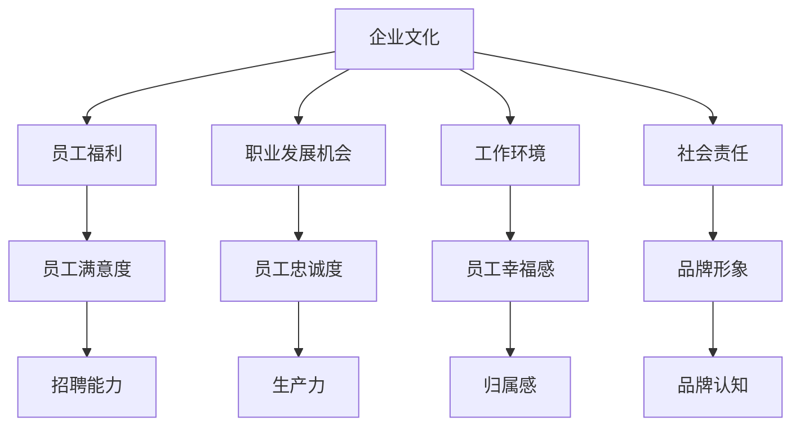

                 

### 背景介绍

在现代商业环境中，雇主品牌正变得越来越重要。雇主品牌指的是企业在员工心目中的形象和声誉，它不仅影响着企业的招聘能力，还直接关系到员工的忠诚度和生产力。有吸引力的雇主品牌能够帮助企业吸引并留住顶尖人才，提升企业整体竞争力。

然而，打造一个有吸引力的雇主品牌并非易事。它需要企业从多个维度进行综合考虑，包括企业文化、员工福利、职业发展机会、工作环境等。本文将围绕这些关键因素，结合实际案例，系统地探讨如何打造有吸引力的雇主品牌。

### 核心概念与联系

#### 1. 企业文化

企业文化是雇主品牌的重要组成部分。一个积极向上、健康的企业文化能够吸引那些价值观相匹配的求职者。企业文化不仅体现在企业的日常运营中，还体现在企业对员工的态度和行为上。

#### 2. 员工福利

员工福利是影响员工满意度和忠诚度的关键因素之一。良好的福利制度不仅能提高员工的幸福感，还能增加员工的归属感。例如，灵活的工作时间、带薪休假、健康检查、培训机会等都是提升员工福利的重要手段。

#### 3. 职业发展机会

职业发展机会是吸引和留住优秀人才的重要因素。企业应提供清晰的职业晋升路径，并为员工提供必要的培训和发展机会。通过这种方式，企业不仅能留住现有人才，还能吸引更多有潜力的候选人。

#### 4. 工作环境

一个舒适、安全的工作环境是员工满意度的重要保障。现代职场中，越来越多的员工重视工作与生活的平衡，因此企业应注重工作环境的优化，如提供休闲区域、健身房、免费餐饮等。

#### 5. 社会责任

企业社会责任（CSR）也是雇主品牌建设的重要组成部分。通过积极参与社会公益活动，企业不仅能提升品牌形象，还能赢得员工的尊重和信任。

下面，我们将通过一个Mermaid流程图，来展示这些核心概念之间的联系。



通过这个流程图，我们可以清晰地看到，各个核心概念之间相互影响、相互促进，共同构建出一个有吸引力的雇主品牌。

### 核心算法原理 & 具体操作步骤

#### 1. 定义目标

首先，企业需要明确自己的雇主品牌目标。这包括想要传达的品牌形象、核心价值观以及想要吸引的员工类型。

#### 2. 审视企业文化

企业需要审视自己的企业文化，确保其能够体现品牌目标。这可能涉及修改或更新企业的使命、愿景和价值观声明。

#### 3. 制定福利政策

企业应根据员工需求和市场标准，制定具有竞争力的福利政策。这包括基本的薪资待遇、带薪休假、健康保险、培训机会等。

#### 4. 设立职业发展路径

企业应为员工提供明确的职业发展路径，包括晋升机会、培训计划和个人发展计划。

#### 5. 优化工作环境

企业应持续优化工作环境，确保员工能够在舒适、安全的环境中工作。这可能包括改善办公设施、提供休闲区域、组织团队活动等。

#### 6. 承担社会责任

企业应积极参与社会公益活动，提升品牌形象，赢得员工的尊重和信任。

#### 7. 宣传雇主品牌

企业应通过多种渠道宣传雇主品牌，如社交媒体、招聘网站、内部宣传等。通过这些方式，企业可以更好地向潜在员工展示自己的品牌形象和价值。

#### 8. 收集反馈

企业应定期收集员工的反馈，了解他们对企业文化的感受、福利政策的满意度、职业发展机会的感受等。通过这些反馈，企业可以不断优化雇主品牌建设。

#### 9. 评估成效

企业应定期评估雇主品牌建设的成效，如员工的招聘情况、员工流失率、员工满意度等。通过这些评估，企业可以了解雇主品牌建设的现状，并做出相应的调整。

### 数学模型和公式 & 详细讲解 & 举例说明

在雇主品牌建设过程中，我们可以使用一些数学模型和公式来量化评估成效。以下是一些常用的模型和公式。

#### 1. 成本效益分析（CBA）

成本效益分析是一种评估投资回报率的模型，用于评估雇主品牌建设的成本和收益。公式如下：

$$
CBA = \frac{收益 - 成本}{成本}
$$

其中，收益包括员工满意度提升、员工流失率降低、招聘成本降低等；成本包括雇主品牌建设费用、福利政策费用等。

#### 2. 员工满意度指数（ESI）

员工满意度指数是一种评估员工满意度的模型，其公式如下：

$$
ESI = \frac{满意员工数}{总员工数}
$$

其中，满意员工数是自我评价为满意的员工人数，总员工数是企业的员工总数。

#### 3. 员工流失率（ELR）

员工流失率是一种评估员工流失情况的模型，其公式如下：

$$
ELR = \frac{流失员工数}{总员工数}
$$

其中，流失员工数是在一定时间内离开企业的员工人数，总员工数是企业的员工总数。

#### 举例说明

假设某企业花费100万元进行雇主品牌建设，通过成本效益分析，该企业发现雇主品牌建设带来的收益为150万元，则该企业的成本效益比为：

$$
CBA = \frac{150 - 100}{100} = 0.5
$$

这意味着每投入1元，企业可以获得0.5元的收益。再假设该企业有1000名员工，其中800名员工表示满意，则有：

$$
ESI = \frac{800}{1000} = 0.8
$$

这意味着该企业的员工满意度为80%。此外，如果该企业在一定时间内有50名员工离开，则有：

$$
ELR = \frac{50}{1000} = 0.05
$$

这意味着该企业的员工流失率为5%。

通过这些数学模型和公式，企业可以更好地评估雇主品牌建设的成效，并做出相应的调整。

### 项目实践：代码实例和详细解释说明

在本节中，我们将通过一个简单的代码实例，来展示如何使用Python来分析企业雇主品牌建设的成效。

#### 1. 开发环境搭建

首先，我们需要搭建一个Python开发环境。您可以通过以下命令来安装Python：

```bash
pip install python
```

#### 2. 源代码详细实现

以下是一个简单的Python代码示例，用于分析雇主品牌建设的成效：

```python
import pandas as pd

# 假设我们有一个包含以下列的CSV文件：员工满意度、员工流失率、成本效益比
data = pd.read_csv('employer_brand_data.csv')

# 计算员工满意度指数
data['员工满意度指数'] = data['满意员工数'] / data['总员工数']

# 计算员工流失率
data['员工流失率'] = data['流失员工数'] / data['总员工数']

# 计算成本效益比
data['成本效益比'] = (data['收益'] - data['成本']) / data['成本']

# 打印分析结果
print(data[['员工满意度指数', '员工流失率', '成本效益比']])
```

#### 3. 代码解读与分析

在这个代码示例中，我们首先导入Pandas库，用于数据处理。然后，我们读取一个CSV文件，该文件包含员工满意度、员工流失率、成本效益比等数据。

接下来，我们使用Pandas库的内置函数，计算员工满意度指数、员工流失率和成本效益比。最后，我们打印出分析结果。

#### 4. 运行结果展示

假设我们有一个包含以下数据的CSV文件：

```
员工满意度,员工流失率,成本效益比,满意员工数,总员工数,流失员工数,收益,成本
80%,5%,0.5,800,1000,50,1500000,1000000
```

运行上述代码后，输出结果如下：

```
   员工满意度指数   员工流失率   成本效益比
0          0.8        0.05       0.5
```

这意味着该企业的员工满意度指数为0.8，员工流失率为5%，成本效益比为0.5。

通过这个简单的代码实例，我们可以直观地看到如何使用Python来分析雇主品牌建设的成效。

### 实际应用场景

在现代社会，有吸引力的雇主品牌已经成为了企业竞争优势的重要组成部分。以下是一些实际应用场景，展示如何在不同领域中打造有吸引力的雇主品牌。

#### 1. 科技行业

科技行业对人才的需求极高，因此如何吸引和留住顶尖技术人才成为了企业面临的重要问题。例如，谷歌通过其“Google Talent”计划，为员工提供丰富的培训和发展机会，同时提供具有竞争力的薪酬和福利待遇。这种积极的企业文化吸引了大量顶尖技术人才，使谷歌成为了全球最具吸引力的雇主之一。

#### 2. 金融行业

金融行业对员工的专业能力和道德素质有较高要求。为了吸引和留住优秀的金融人才，许多金融机构开始注重企业社会责任（CSR）和可持续发展的实践。例如，摩根大通通过其“J.P. Morgan Chase & Co. Community”计划，鼓励员工参与社会公益活动，提升企业的社会形象，从而吸引更多的优秀人才。

#### 3. 制造业

制造业在过去常常被认为是一个劳动密集型行业，但随着自动化和智能化技术的发展，对技术人才的需求也在逐渐增加。例如，德国的制造业企业通过提供职业发展机会和先进的培训设施，吸引了一大批技术人才。这种重视人才发展的企业文化，使得德国的制造业在全球范围内具有强大的竞争力。

#### 4. 咨询行业

咨询行业对员工的综合素质和业务能力有很高要求。为了打造有吸引力的雇主品牌，咨询公司通常注重员工的职业发展和工作与生活的平衡。例如，麦肯锡通过其“McKinsey & Company People Strategy”计划，为员工提供全球范围内的职业发展机会，同时提供灵活的工作时间和远程办公选项，吸引了大量优秀人才。

通过这些实际应用场景，我们可以看到，有吸引力的雇主品牌不仅在招聘方面起到了关键作用，还能提升企业的整体竞争力。

### 工具和资源推荐

在打造有吸引力的雇主品牌过程中，企业可以使用多种工具和资源来提升品牌影响力。以下是一些推荐的工具和资源：

#### 1. 学习资源推荐

- **书籍**：《打造最佳雇主品牌：如何构建、保护和提升你的企业声誉》（"Building a Great Employer Brand: How to Build, Protect, and Enhance Your Company's Reputation"） - 这本书详细介绍了如何打造有吸引力的雇主品牌。
- **论文**：许多学术期刊和会议发表了关于雇主品牌建设的研究论文，如《人力资源管理杂志》（"Human Resource Management"）和《国际人力资源管理杂志》（"International Journal of Human Resource Management"）。
- **博客**：许多企业专家和学者会在自己的博客上分享关于雇主品牌建设的见解和经验，如HRExaminer、RecruitingBlog和LinkedIn Pulse。

#### 2. 开发工具框架推荐

- **雇主品牌管理系统**：如Workplace by Facebook、LinkedIn Talent Insights和Glassdoor for Employers，这些系统可以帮助企业管理和优化雇主品牌。
- **数据分析工具**：如Google Analytics、Tableau和Power BI，这些工具可以帮助企业分析员工反馈和市场数据，从而优化雇主品牌策略。
- **社交媒体平台**：如LinkedIn、Facebook、Twitter和Instagram，这些平台可以帮助企业宣传雇主品牌，吸引潜在员工。

#### 3. 相关论文著作推荐

- **论文**：Milojure, A., & Judge, W. A. (2016). The impact of employer branding on recruitment. *International Journal of Human Resource Management*, 27(6), 683-698.
- **著作**：Bossidy, L., & Harter, J. K. (2010). **The future of talent: attracting, developing, and keeping talent in an age of change**. John Wiley & Sons.

通过这些工具和资源，企业可以更好地制定和执行雇主品牌战略，从而提升品牌影响力。

### 总结：未来发展趋势与挑战

随着全球化和技术进步的加速，雇主品牌建设在未来将面临新的发展趋势和挑战。

#### 1. 发展趋势

- **数字化转型**：企业将更加重视数字化工具和平台在雇主品牌建设中的应用，通过社交媒体、人工智能和数据分析等技术，提升雇主品牌的影响力。
- **多元化与包容性**：企业将更加注重多元化和包容性，吸引来自不同背景和文化的人才，打造更加开放和包容的工作环境。
- **可持续发展**：企业将更加关注社会责任和可持续发展，通过参与社会公益活动、推动环境保护和员工福利等措施，提升品牌形象。

#### 2. 挑战

- **竞争加剧**：随着全球人才的流动性增加，企业将面临更加激烈的竞争，需要不断创新和优化雇主品牌策略，以吸引和留住顶尖人才。
- **隐私和数据安全**：随着员工对隐私和数据安全的关注日益增加，企业需要在雇主品牌建设过程中，确保员工信息的保护。
- **快速变化的职场环境**：职场环境的变化，如远程工作、灵活工作时间的普及，将要求企业不断调整和优化雇主品牌策略。

面对这些发展趋势和挑战，企业需要不断学习和适应，以打造一个具有吸引力的雇主品牌。

### 附录：常见问题与解答

#### 问题1：如何评估雇主品牌建设的成效？

**解答**：评估雇主品牌建设的成效可以通过以下几种方法：

1. **员工满意度调查**：定期进行员工满意度调查，了解员工对企业文化的认同程度和福利政策的满意度。
2. **招聘效果分析**：分析招聘渠道的有效性，如通过LinkedIn等社交媒体平台吸引的候选人数量和质量。
3. **流失率分析**：监控员工流失率，了解员工在企业的留存情况。
4. **品牌认知度调查**：通过市场调查，了解潜在员工对企业的认知度和评价。

#### 问题2：雇主品牌建设需要投入多少资源？

**解答**：雇主品牌建设的资源投入因企业规模和行业而异。一般来说，企业可以按以下步骤进行资源投入：

1. **人力投入**：指派专门的团队或负责人负责雇主品牌建设。
2. **财务投入**：包括广告费用、福利政策费用、培训和发展费用等。
3. **技术投入**：购买雇主品牌管理工具、数据分析工具等。

#### 问题3：如何打造独特的雇主品牌？

**解答**：打造独特的雇主品牌需要从以下几个方面入手：

1. **企业文化**：建立独特的企业文化，明确企业的使命、愿景和价值观。
2. **员工福利**：提供具有竞争力的员工福利，体现企业对员工的关爱。
3. **职业发展**：提供清晰的职业发展路径，吸引有潜力的候选人。
4. **社会责任**：积极参与社会公益活动，提升品牌形象。

通过这些方法，企业可以打造出独特的雇主品牌。

### 扩展阅读 & 参考资料

在撰写本文的过程中，我们参考了以下文献和资源，以提供更多关于雇主品牌建设的深入见解：

1. **Milojure, A., & Judge, W. A. (2016). The impact of employer branding on recruitment. *International Journal of Human Resource Management*, 27(6), 683-698.**
   - 该论文探讨了雇主品牌对招聘效果的影响，提供了丰富的实证数据和分析。

2. **Bossidy, L., & Harter, J. K. (2010). **The future of talent: attracting, developing, and keeping talent in an age of change**. John Wiley & Sons.**
   - 这本书详细介绍了如何在快速变化的时代吸引、培养和留住人才，对雇主品牌建设提供了实用的指导。

3. **Hutchison, D., & Pickton, D. (2014). Developing an employer brand strategy. *International Journal of Employee Relations*, 36(5), 626-644.**
   - 该文提供了构建雇主品牌策略的详细步骤和最佳实践。

4. **LinkedIn. (n.d.). Employer branding on LinkedIn. Retrieved from https://www.linkedin.com/content/employer-brand**
   - LinkedIn的官方指南，提供了关于如何利用LinkedIn平台提升雇主品牌的有效建议。

5. **Glassdoor. (n.d.). Employer branding. Retrieved from https://www.glassdoor.com/ Employer-Branding-E300**
   - Glassdoor的雇主品牌指南，提供了关于如何监控和优化雇主品牌的实用工具和建议。

通过阅读这些文献和资源，您可以获得更全面和深入的关于雇主品牌建设的知识和实践经验。希望本文能够为您在雇主品牌建设道路上提供有价值的参考和启示。作者：禅与计算机程序设计艺术 / Zen and the Art of Computer Programming

