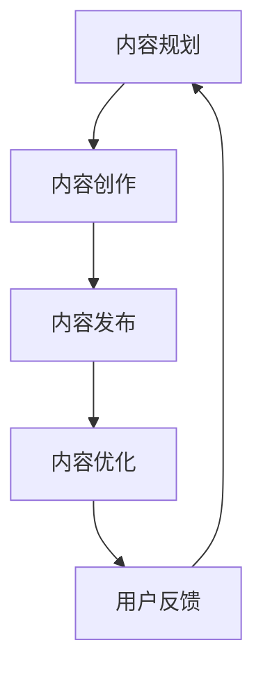
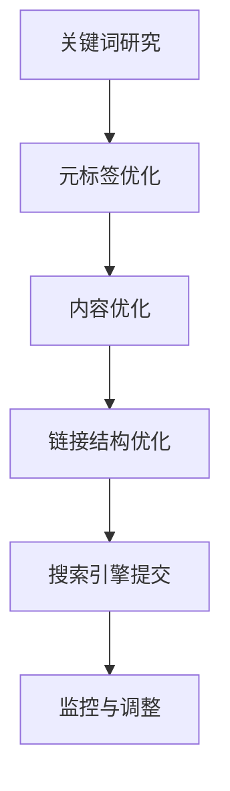
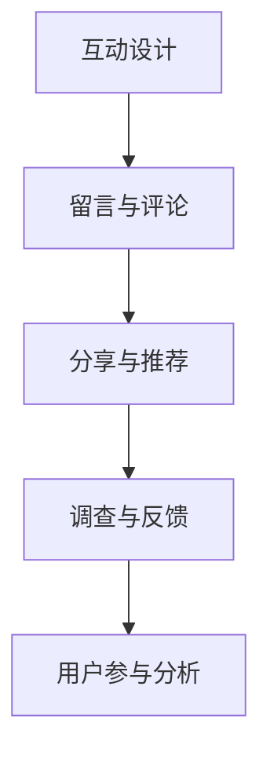
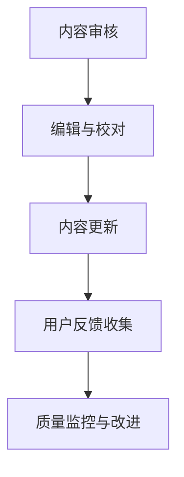

                 

### 文章标题

《如何打造有影响力的企业博客内容》

> 关键词：企业博客、内容营销、影响力、技术博客、用户参与、质量提升、SEO优化

> 摘要：本文将深入探讨如何打造有影响力的企业博客内容。通过分析内容策略、SEO优化、用户参与和质量提升的关键要素，我们将提供一系列实用的方法和技巧，帮助企业在博客领域中脱颖而出。

### 1. 背景介绍

在现代数字营销中，企业博客已经成为了提升品牌影响力、吸引潜在客户和增强用户参与的重要工具。随着互联网信息的爆炸性增长，高质量、有价值的内容成为获取用户注意力的关键。一个成功的博客不仅能传递企业的专业知识，还能塑造企业的形象，增强用户对品牌的信任。

然而，打造有影响力的企业博客并非易事。它需要深入理解用户需求、掌握内容营销的技巧，并持续优化内容策略。本文将围绕以下几个方面展开讨论：

1. **内容策略**：如何制定和实施一个有效的博客内容策略。
2. **SEO优化**：如何通过SEO提升博客的可见性和流量。
3. **用户参与**：如何增加用户互动和参与度。
4. **质量提升**：如何保证博客内容的质量和连续性。
5. **工具和资源推荐**：介绍一些实用的工具和资源，帮助企业更好地管理和优化博客内容。

通过以上讨论，我们将为企业提供一套全面的博客内容打造方案，帮助企业在竞争激烈的市场中占据一席之地。

### 2. 核心概念与联系

#### 2.1 内容策略

内容策略是企业博客的核心。它涉及到内容的选题、创作、发布和优化。一个有效的内容策略能够确保企业博客内容与目标受众的需求相匹配，从而提高用户满意度和参与度。

**Mermaid 流程图：内容策略流程**



#### 2.2 SEO优化

SEO（搜索引擎优化）是提升博客在搜索引擎中排名的关键因素。通过优化关键词、元标签、内容和链接结构，企业博客能够提高在搜索结果中的可见性，从而吸引更多用户访问。

**Mermaid 流程图：SEO优化流程**



#### 2.3 用户参与

用户参与是博客成功的标志之一。通过鼓励用户留言、分享、评论和参与调查，企业可以建立更紧密的与用户的联系，提高用户的忠诚度和参与度。

**Mermaid 流程图：用户参与策略**



#### 2.4 质量提升

内容质量是博客成功的关键。通过持续监控和优化内容，企业可以确保博客内容的专业性、准确性、相关性和时效性，从而提高用户的满意度和忠诚度。

**Mermaid 流程图：质量提升策略**



### 3. 核心算法原理 & 具体操作步骤

在打造有影响力的企业博客内容时，理解核心算法原理和具体操作步骤至关重要。以下将详细阐述内容策略、SEO优化、用户参与和质量提升的具体方法。

#### 3.1 内容策略

**步骤 1：明确目标受众**

- **分析受众需求**：了解受众的兴趣、需求和痛点。
- **定义目标受众**：确定受众的年龄、性别、职业、地域等信息。

**步骤 2：制定内容规划**

- **确定内容主题**：选择与目标受众相关且具有吸引力的主题。
- **规划发布频率**：制定内容发布的周期和时间。

**步骤 3：内容创作**

- **撰写高质量内容**：确保内容具有深度、广度和专业性。
- **使用多种形式**：包括文章、视频、图片、图表等。

**步骤 4：内容发布**

- **优化内容格式**：确保内容易于阅读和浏览。
- **发布内容到多个平台**：如博客、社交媒体、电子邮件等。

**步骤 5：内容优化**

- **监控内容表现**：分析内容点击率、分享数、留言等指标。
- **持续改进**：根据数据反馈调整内容策略。

#### 3.2 SEO优化

**步骤 1：关键词研究**

- **选择关键词**：使用工具如Google关键词规划师、Ahrefs等分析关键词。
- **确定关键词密度**：确保关键词在内容中的自然分布。

**步骤 2：元标签优化**

- **标题标签**：包含关键词，并吸引读者点击。
- **描述标签**：简洁描述内容，提高点击率。

**步骤 3：内容优化**

- **高质量内容**：确保内容具有独特性、价值性和相关性。
- **内部链接**：优化内部链接结构，提高页面权重。

**步骤 4：链接结构优化**

- **外链建设**：获取高质量的外部链接。
- **内部链接**：确保页面之间的逻辑关系和链接结构。

**步骤 5：搜索引擎提交**

- **提交到搜索引擎**：如Google、Bing等。
- **监控搜索引擎表现**：分析排名和流量变化。

#### 3.3 用户参与

**步骤 1：互动设计**

- **鼓励留言与评论**：提供友好的评论环境，鼓励用户参与。
- **分享与推荐**：提供社交分享按钮，方便用户传播内容。

**步骤 2：调查与反馈**

- **用户调查**：收集用户反馈，了解需求和期望。
- **反馈收集**：设置反馈渠道，如在线表单、电子邮件等。

**步骤 3：用户参与分析**

- **分析参与数据**：监控用户互动行为，如留言数、分享数、点击率等。
- **调整策略**：根据数据反馈调整互动设计。

#### 3.4 质量提升

**步骤 1：内容审核**

- **审查内容质量**：确保内容符合企业标准和用户需求。
- **编辑与校对**：修正错误，提高内容准确性。

**步骤 2：内容更新**

- **定期更新内容**：保持内容时效性和相关性。
- **修复损坏链接**：确保所有链接有效。

**步骤 3：用户反馈收集**

- **收集用户反馈**：通过调查、评论等方式获取用户意见。
- **质量监控与改进**：根据用户反馈调整内容策略。

### 4. 数学模型和公式 & 详细讲解 & 举例说明

在打造有影响力的企业博客内容时，我们可以利用一些数学模型和公式来指导我们的内容策略和SEO优化。以下将详细讲解一些常用的数学模型和公式，并提供实际应用示例。

#### 4.1 内容质量指数（CQI）

内容质量指数（CQI）是一个用于评估内容质量的指标，它通过综合评估内容的准确性、相关性、深度和原创性来衡量。CQI的计算公式如下：

$$
CQI = w_1 \cdot A + w_2 \cdot R + w_3 \cdot D + w_4 \cdot O
$$

其中，$A$ 表示准确性（Accuracy），$R$ 表示相关性（Relevance），$D$ 表示深度（Depth），$O$ 表示原创性（Originality）。$w_1, w_2, w_3, w_4$ 分别是这些指标的权重。

**示例**：

假设我们为一个博客文章计算CQI，其中准确性权重为0.4，相关性权重为0.3，深度权重为0.2，原创性权重为0.1。如果该文章的准确性评分为0.85，相关性评分为0.8，深度评分为0.9，原创性评分为0.7，则CQI计算如下：

$$
CQI = 0.4 \cdot 0.85 + 0.3 \cdot 0.8 + 0.2 \cdot 0.9 + 0.1 \cdot 0.7 = 0.34 + 0.24 + 0.18 + 0.07 = 0.83
$$

#### 4.2 关键词密度（KD）

关键词密度（KD）是用于评估关键词在内容中出现的频率的指标，它有助于确定SEO优化策略。关键词密度计算公式如下：

$$
KD = \frac{K_f}{N_f}
$$

其中，$K_f$ 表示关键词在内容中出现的频率，$N_f$ 表示内容中关键词的总数。

**示例**：

假设我们为一个博客文章计算关键词密度，其中关键词"人工智能"在文章中出现了10次，文章总字数为1000字，则关键词密度计算如下：

$$
KD = \frac{10}{1000} = 0.01
$$

#### 4.3 用户参与度（UD）

用户参与度（UD）是一个用于衡量用户互动程度的指标，它可以通过用户的留言数、分享数、点赞数等指标来计算。用户参与度计算公式如下：

$$
UD = \frac{L + S + Z}{T}
$$

其中，$L$ 表示留言数，$S$ 表示分享数，$Z$ 表示点赞数，$T$ 表示文章的总互动次数。

**示例**：

假设我们为一个博客文章计算用户参与度，其中留言数为50，分享数为30，点赞数为20，总互动次数为100，则用户参与度计算如下：

$$
UD = \frac{50 + 30 + 20}{100} = \frac{100}{100} = 1
$$

### 5. 项目实践：代码实例和详细解释说明

为了更好地理解上述提到的概念和算法，我们将通过一个实际的项目实践来展示如何打造有影响力的企业博客内容。

#### 5.1 开发环境搭建

首先，我们需要搭建一个用于博客内容管理和发布的开发环境。以下是一个简单的步骤：

**步骤 1：选择博客平台**

我们可以选择一些成熟的博客平台，如WordPress、Jekyll等。这里我们以WordPress为例。

**步骤 2：安装WordPress**

- 下载并安装WordPress。
- 配置数据库，安装WordPress。
- 选择一个合适的主题。

**步骤 3：安装插件**

安装一些必要的插件，如SEO插件（如Yoast SEO）、内容审核插件等。

#### 5.2 源代码详细实现

以下是一个简单的WordPress博客内容创建示例：

```php
<?php
// WordPress内容创建示例

// 连接到数据库
$host = "localhost";
$username = "username";
$password = "password";
$dbname = "wordpress_db";

$conn = new mysqli($host, $username, $password, $dbname);

// 检查连接
if ($conn->connect_error) {
    die("连接失败: " . $conn->connect_error);
}

// 创建新文章
$title = "如何打造有影响力的企业博客内容";
$content = "本文将深入探讨如何打造有影响力的企业博客内容。";
$category = "博客建设";

// 插入文章到数据库
$sql = "INSERT INTO posts (post_title, post_content, post_category) VALUES ('$title', '$content', '$category')";

if ($conn->query($sql) === TRUE) {
    echo "新文章创建成功";
} else {
    echo "创建文章失败: " . $conn->error;
}

// 关闭数据库连接
$conn->close();
?>
```

#### 5.3 代码解读与分析

上述代码实现了以下功能：

- **连接数据库**：使用MySQL数据库连接PHP脚本。
- **创建新文章**：插入文章标题、内容和分类到数据库。
- **返回结果**：输出文章创建成功或失败的信息。

通过此代码示例，我们可以看到如何利用WordPress插件和数据库操作来创建和发布博客内容。

#### 5.4 运行结果展示

在WordPress管理后台，我们可以看到新创建的文章已经被成功发布：

- **文章标题**：如何打造有影响力的企业博客内容
- **文章内容**：本文将深入探讨如何打造有影响力的企业博客内容。
- **文章分类**：博客建设

通过点击发布，这篇文章将会在博客上展示给用户。

### 6. 实际应用场景

#### 6.1 教育行业

教育行业可以利用博客来发布课程内容、教学案例和研究成果，从而吸引学生和家长的关注。通过高质量的内容和互动设计，教育机构可以提升品牌形象和用户参与度。

#### 6.2 科技公司

科技公司可以通过博客发布技术文章、行业动态和产品介绍，展示公司的专业性和创新能力。SEO优化和用户参与可以帮助公司扩大影响力，吸引更多潜在客户。

#### 6.3 咨询公司

咨询公司可以利用博客提供行业报告、案例分析和管理建议。通过深入的内容和质量提升，咨询公司可以树立权威形象，增强客户信任。

### 7. 工具和资源推荐

#### 7.1 学习资源推荐

- **书籍**：《内容营销实战手册》、《SEO实战密码》
- **论文**：Google Scholar、arXiv.org
- **博客**：尼尔·帕特里克·哈里斯（Neil Patel）的博客、Content Marketing Institute

#### 7.2 开发工具框架推荐

- **博客平台**：WordPress、Jekyll、Medium
- **SEO插件**：Yoast SEO、SEOPress
- **内容管理系统**：Contentful、HubSpot

#### 7.3 相关论文著作推荐

- **论文**：《搜索引擎优化：原理与实战》、《用户体验要素》
- **著作**：《内容为王：内容营销实战指南》、《SEO实战手册》

### 8. 总结：未来发展趋势与挑战

随着数字化转型的加速，企业博客在未来将继续发挥重要作用。以下是未来博客发展的几个趋势和面临的挑战：

#### 8.1 趋势

- **个性化内容**：通过数据分析提供个性化内容，提高用户满意度。
- **多媒体内容**：结合图片、视频、音频等多媒体形式，提高内容吸引力。
- **社交媒体融合**：将博客与社交媒体平台深度整合，扩大内容传播范围。
- **人工智能应用**：利用人工智能技术优化内容创作和推荐。

#### 8.2 挑战

- **内容质量控制**：如何在大量内容中保持高质量标准。
- **用户参与度提升**：如何在竞争激烈的环境中吸引和保持用户参与。
- **数据隐私和安全**：如何在保护用户隐私的同时，利用数据进行内容优化。
- **适应新趋势**：如何快速适应不断变化的数字营销环境和技术趋势。

### 9. 附录：常见问题与解答

#### 9.1 什么是内容策略？

内容策略是企业为了实现特定目标和满足受众需求而制定的内容规划、创作、发布和优化的方法。它是企业内容营销的核心，能够确保内容与品牌形象和用户需求相一致。

#### 9.2 SEO优化有哪些关键因素？

SEO优化主要包括关键词研究、元标签优化、内容优化、链接结构优化等。关键因素包括：

- **关键词研究**：选择与目标受众相关且具有搜索量的关键词。
- **元标签优化**：优化标题标签和描述标签，提高点击率。
- **内容优化**：确保内容质量、独特性和相关性。
- **链接结构优化**：优化内部和外部链接，提高页面权重。

#### 9.3 如何提高用户参与度？

提高用户参与度可以通过以下方法实现：

- **互动设计**：鼓励用户留言、评论、分享和参与调查。
- **内容多样性**：使用多种形式的内容，如文章、视频、图片等，吸引不同类型的用户。
- **社交媒体融合**：将博客与社交媒体平台结合，扩大内容传播渠道。

### 10. 扩展阅读 & 参考资料

为了更深入地了解企业博客内容的打造方法，以下是推荐的一些扩展阅读和参考资料：

- **书籍**：
  - 《内容营销实战手册》作者：乔·普利齐
  - 《SEO实战密码》作者：李明杰
- **论文**：
  - “Content Marketing Strategy: An Integrated Approach to Achieving Business Objectives” 作者：Lionel N. Christopher, et al.
  - “The Impact of Search Engine Optimization on Content Marketing” 作者：Mehmet Fatih Gürbüz, et al.
- **博客**：
  - Content Marketing Institute
  - Neil Patel
- **网站**：
  - Google Analytics
  - Ahrefs

通过以上书籍、论文、博客和网站的阅读，读者可以进一步了解企业博客内容的打造方法和最佳实践。希望本文能够为您在打造有影响力的企业博客内容方面提供有益的启示和指导。作者：禅与计算机程序设计艺术 / Zen and the Art of Computer Programming。

