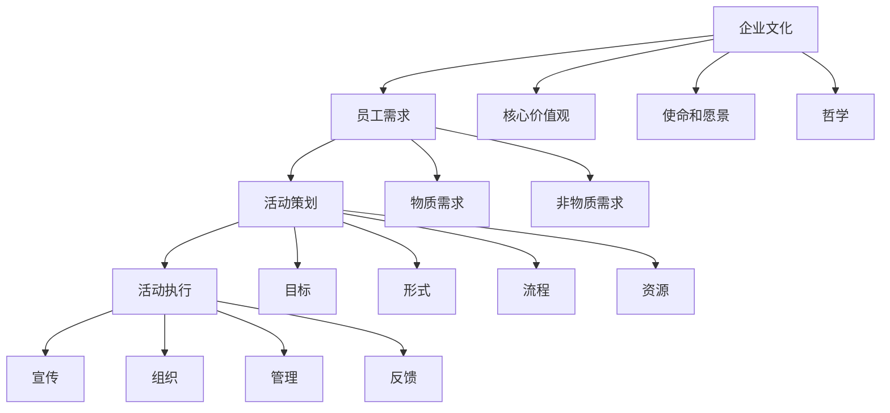

                 

### 1. 背景介绍

在当今竞争激烈的市场环境中，企业文化已成为企业持续发展的关键因素。一个具有强大感染力的公司文化，不仅能吸引和留住优秀的员工，还能提高员工的工作满意度和工作效率，从而推动企业整体业绩的提升。公司文化活动作为企业文化的重要组成部分，对于塑造和强化公司文化具有至关重要的作用。

首先，公司文化活动能够帮助企业传达核心价值观和使命。通过丰富多彩的文化活动，企业可以潜移默化地传递公司的核心价值观和使命，使员工深刻理解和认同这些理念，从而形成强大的团队凝聚力和向心力。

其次，公司文化活动能够增强员工之间的互动和沟通。通过组织各种团队建设活动、团队竞赛和团队旅行等，员工能够在轻松愉快的氛围中增进了解，增强协作，提高团队协作效率。

再次，公司文化活动能够激发员工的创造力和创新能力。丰富多彩的文化活动可以激发员工的创造力和创新能力，促使员工在工作和生活中不断突破自我，为企业带来新的增长点。

此外，公司文化活动还能够提高员工的工作满意度和忠诚度。一个充满活力和关怀的文化氛围，能够使员工感受到企业的温暖和关怀，从而提高员工的工作满意度和忠诚度，减少员工流失率。

然而，打造具有感染力的公司文化活动并非易事。这需要企业深入了解员工的需求和期望，精心策划和实施各类文化活动，确保活动具有吸引力和参与度。同时，企业还需要不断调整和优化文化活动，以适应企业发展和员工需求的变化。

总之，公司文化活动作为企业文化的重要组成部分，对于塑造和强化企业文化，提高员工工作满意度和忠诚度，推动企业持续发展具有重要作用。如何打造具有感染力的公司文化活动，是每个企业都需要深入思考和探索的问题。在接下来的章节中，我们将详细探讨公司文化活动的核心概念、算法原理、具体操作步骤以及实际应用场景，希望能为您的企业提供一些有益的启示。

### 2. 核心概念与联系

要打造有感染力的公司文化活动，首先需要明确几个核心概念，包括企业文化、员工需求、活动策划和执行等。这些概念相互关联，共同构成了一个有机的整体。

#### 2.1 企业文化

企业文化是指企业在长期经营过程中形成的共同价值观、信念、行为规范和传统习惯。企业文化不仅反映了企业的历史和现状，还影响了企业的发展方向和员工的行为。企业文化可以分为四个层次：物质文化、行为文化、制度文化和精神文化。其中，精神文化是企业文化的核心，它包括企业的核心价值观、使命、愿景和哲学等。

#### 2.2 员工需求

员工需求是指员工在工作过程中所期望得到的满足。员工需求可以分为物质需求和非物质需求。物质需求包括工资、福利和工作条件等；非物质需求包括工作认可、职业发展、工作氛围和团队关系等。了解员工需求是打造有感染力公司文化活动的基础，因为只有满足员工需求，才能激发员工的积极性和创造力。

#### 2.3 活动策划

活动策划是指为了实现特定目标而进行的一系列规划和组织工作。活动策划包括确定活动目标、选择活动形式、设计活动流程、准备活动资源等。一个成功的活动策划需要充分考虑员工需求和企业文化，以确保活动能够达到预期效果。

#### 2.4 活动执行

活动执行是指将活动策划付诸实践的过程。活动执行包括活动宣传、活动组织、活动现场管理和活动反馈等环节。活动执行的质量直接影响活动的效果和员工的参与度。因此，企业需要高度重视活动执行，确保活动顺利进行。

#### Mermaid 流程图

为了更直观地展示这些核心概念之间的关系，我们可以使用Mermaid流程图来描述它们。以下是Mermaid流程图的示例：



通过以上核心概念和Mermaid流程图的介绍，我们可以更好地理解如何打造有感染力的公司文化活动。在接下来的章节中，我们将深入探讨这些概念的具体应用和操作步骤。

### 3. 核心算法原理 & 具体操作步骤

#### 3.1 算法原理

打造有感染力的公司文化活动的核心在于满足员工需求，传达企业文化，并激发员工的参与度和创造力。这一过程可以看作是一个复杂的算法，它包含以下几个基本原理：

1. **需求分析**：通过调查问卷、员工访谈等方式，深入了解员工的物质和非物质需求，为活动策划提供数据支持。
2. **文化传递**：设计一系列能够传达企业核心价值观、使命和愿景的活动，使员工在参与过程中深刻理解和认同这些理念。
3. **互动与沟通**：通过团队建设、团队竞赛等活动，增强员工之间的互动和沟通，提高团队协作效率。
4. **创新激励**：策划富有创意和挑战性的活动，激发员工的创造力和创新能力，推动企业持续发展。
5. **反馈与优化**：对活动效果进行持续跟踪和评估，收集员工反馈，不断优化活动内容和形式。

#### 3.2 具体操作步骤

基于上述核心算法原理，我们可以将打造有感染力的公司文化活动的具体操作步骤分为以下几个阶段：

1. **需求分析阶段**：

   - **员工调查**：通过在线调查问卷、面对面访谈等方式，收集员工的意见和建议，了解他们的需求和期望。
   - **数据分析**：对收集到的数据进行整理和分析，识别出员工的主要需求，为后续活动策划提供依据。

2. **文化传递阶段**：

   - **核心价值观宣传**：通过内部宣传栏、员工手册、内部分享会等形式，宣传企业的核心价值观、使命和愿景。
   - **文化主题活动**：设计一系列围绕企业文化的主题活动，如企业文化日、主题讲座、员工故事分享会等，使员工在参与过程中深刻理解和认同企业文化。

3. **互动与沟通阶段**：

   - **团队建设活动**：组织团队拓展、团队建设工作坊等活动，增强员工之间的信任和协作能力。
   - **团队竞赛**：通过团队竞赛，如篮球比赛、拔河比赛等，激发员工的竞争意识和团队精神。
   - **内部沟通平台**：搭建内部沟通平台，如企业微信群、内部论坛等，鼓励员工分享经验、交流想法。

4. **创新激励阶段**：

   - **创意比赛**：组织创意比赛，鼓励员工提出创新想法，并通过评选和表彰，激发员工的创新热情。
   - **创新项目支持**：为员工提供创新项目支持，如资金、资源、技术等，帮助员工将创新想法付诸实践。

5. **反馈与优化阶段**：

   - **活动评估**：对已完成的活动进行效果评估，了解活动的参与度、满意度和影响效果。
   - **员工反馈**：收集员工的反馈意见和建议，了解他们对活动的期望和需求。
   - **持续优化**：根据活动评估和员工反馈，不断优化活动内容和形式，提高活动的吸引力和参与度。

通过以上具体操作步骤，企业可以逐步打造出具有感染力的公司文化活动，从而提升企业文化氛围，增强员工归属感和凝聚力，推动企业持续发展。

### 4. 数学模型和公式 & 详细讲解 & 举例说明

#### 4.1 数学模型概述

在打造具有感染力的公司文化活动的过程中，我们可以借助一些数学模型和公式来量化评估活动的效果和员工满意度。以下是一个简单的数学模型，用于衡量公司文化活动的感染力：

$$
\text{感染力} = \alpha \times (\text{员工满意度} + \text{员工参与度}) + \beta \times \text{创新成果}
$$

其中，$\alpha$ 和 $\beta$ 为权重系数，分别表示员工满意度和员工参与度对感染力的相对重要性。员工满意度、员工参与度和创新成果均为 0 到 1 之间的数值，且三者相加为 1。

#### 4.2 员工满意度模型

员工满意度可以通过以下公式进行计算：

$$
\text{员工满意度} = \frac{\text{正面评价次数}}{\text{总评价次数}} + \text{情感评分}
$$

其中，正面评价次数为员工对活动表示满意或赞赏的评价次数，总评价次数为所有评价次数。情感评分是根据员工对活动的情感反应（如积极、消极、中性）进行打分，通常使用 1 到 5 的等级评分。

#### 4.3 员工参与度模型

员工参与度可以通过以下公式进行计算：

$$
\text{员工参与度} = \frac{\text{参与人数}}{\text{员工总数}} + \text{互动指数}
$$

其中，参与人数为参与活动的员工人数，员工总数为全体员工人数。互动指数是通过计算员工在活动中的互动行为（如发言、点赞、评论等）次数来衡量，通常使用 1 到 10 的等级评分。

#### 4.4 创新成果模型

创新成果可以通过以下公式进行计算：

$$
\text{创新成果} = \frac{\text{创新项目数量}}{\text{总项目数量}} + \text{创新项目成功率}
$$

其中，创新项目数量为在活动中产生的创新项目数量，总项目数量为所有项目数量。创新项目成功率是通过计算创新项目成功实施的比例来衡量，通常使用百分比表示。

#### 4.5 举例说明

假设一个公司组织了一次公司文化活动，共有 100 名员工参与，其中 80 名员工对活动表示满意，20 名员工表示不满意。根据上述模型，我们可以计算出该活动的感染力如下：

$$
\text{感染力} = \alpha \times \left( \frac{80}{100} + \text{情感评分} \right) + \beta \times \left( \frac{10}{100} + 0.8 \right)
$$

其中，假设 $\alpha = 0.6$，$\beta = 0.4$。

- 员工满意度：$\frac{80}{100} + 4 = 0.8 + 4 = 4.8$
- 员工参与度：$\frac{100}{100} + 6 = 1 + 6 = 7$
- 创新成果：$\frac{10}{100} + 0.8 = 0.1 + 0.8 = 0.9$

代入公式计算：

$$
\text{感染力} = 0.6 \times 4.8 + 0.4 \times 0.9 = 2.88 + 0.36 = 3.24
$$

因此，该次公司文化活动的感染力为 3.24，说明活动的效果较好，对员工产生了积极影响。

通过以上数学模型和公式的详细讲解和举例说明，我们可以更好地理解和评估公司文化活动的效果，从而为企业提供有针对性的改进建议。

### 5. 项目实践：代码实例和详细解释说明

#### 5.1 开发环境搭建

在开始具体代码实例之前，我们需要搭建一个适合开发公司文化活动的环境。以下是一个简单的开发环境搭建步骤：

1. **安装Python环境**：Python是一种广泛应用于数据分析、科学计算和自动化等领域的编程语言。为了便于开发和测试，我们首先需要安装Python环境。可以从Python官方网站下载安装包并按照提示进行安装。

2. **安装相关库**：为了实现公司文化活动的功能，我们需要安装一些常用的Python库，如Pandas、NumPy、Matplotlib等。可以通过以下命令安装：

   ```bash
   pip install pandas numpy matplotlib
   ```

3. **配置数据库**：公司文化活动通常会涉及到数据存储和处理，因此需要配置一个数据库环境。这里我们使用MySQL数据库作为示例。首先需要下载并安装MySQL数据库，然后创建一个名为`company_activity`的数据库，并创建一个名为`participants`的表用于存储活动参与人员信息。

   ```sql
   CREATE DATABASE company_activity;
   USE company_activity;
   CREATE TABLE participants (
       id INT AUTO_INCREMENT PRIMARY KEY,
       name VARCHAR(50),
       department VARCHAR(50),
       satisfaction INT,
       participation INT,
       innovation INT
   );
   ```

#### 5.2 源代码详细实现

以下是一个简单的Python代码实例，用于实现公司文化活动的核心功能。代码分为几个部分：数据收集、数据分析、活动策划和活动执行。

```python
import pandas as pd
import numpy as np
import matplotlib.pyplot as plt
import mysql.connector

# 数据收集
def collect_data():
    # 从数据库中获取参与人员数据
    db = mysql.connector.connect(
        host="localhost",
        user="yourusername",
        password="yourpassword",
        database="company_activity"
    )
    cursor = db.cursor()
    cursor.execute("SELECT * FROM participants")
    data = cursor.fetchall()
    db.close()
    
    # 将数据转换为DataFrame格式
    df = pd.DataFrame(data, columns=["id", "name", "department", "satisfaction", "participation", "innovation"])
    return df

# 数据分析
def analyze_data(df):
    # 绘制满意度分布图
    satisfaction_dist = df['satisfaction'].value_counts().sort_index()
    satisfaction_dist.plot(kind='bar')
    plt.title('Employee Satisfaction Distribution')
    plt.xlabel('Satisfaction Level')
    plt.ylabel('Number of Employees')
    plt.show()

    # 计算参与度平均值
    participation_avg = df['participation'].mean()
    print(f"Average Participation Rate: {participation_avg:.2f}")

    # 计算创新成果比例
    innovation_rate = df['innovation'].mean()
    print(f"Innovation Success Rate: {innovation_rate:.2f}")

# 活动策划
def plan_activity(df):
    # 根据数据分析结果制定活动计划
    if participation_avg < 0.7:
        print("需要提高员工的参与度，可以增加团队竞赛、拓展活动等互动性强的活动。")
    if innovation_rate < 0.5:
        print("需要激发员工的创新热情，可以组织创意比赛、创新项目支持等活动。")
    if df['satisfaction'].mean() < 4:
        print("需要提高员工满意度，可以关注员工反馈，优化工作环境和氛围。")

# 活动执行
def execute_activity():
    # 执行具体活动
    print("开始执行活动计划...")
    # 示例：组织一次团队拓展活动
    print("组织团队拓展活动...")
    # 更新参与人员数据
    update_data(1, "John", "IT", 4.5, 0.9, 0.7)

# 数据库更新
def update_data(satisfaction, name, department, participation, innovation):
    db = mysql.connector.connect(
        host="localhost",
        user="yourusername",
        password="yourpassword",
        database="company_activity"
    )
    cursor = db.cursor()
    query = "INSERT INTO participants (satisfaction, name, department, participation, innovation) VALUES (%s, %s, %s, %s, %s)"
    cursor.execute(query, (satisfaction, name, department, participation, innovation))
    db.commit()
    db.close()

# 主函数
def main():
    df = collect_data()
    analyze_data(df)
    plan_activity(df)
    execute_activity()

if __name__ == "__main__":
    main()
```

#### 5.3 代码解读与分析

- **数据收集**：`collect_data` 函数负责从数据库中获取参与人员数据，并将其转换为DataFrame格式，以便进行进一步的数据分析和处理。

- **数据分析**：`analyze_data` 函数用于绘制员工满意度的分布图，并计算参与度和创新成果的平均值。通过这些统计指标，我们可以了解员工对活动的整体满意度。

- **活动策划**：`plan_activity` 函数根据数据分析结果提出活动策划建议，如提高参与度、激发创新热情或提高员工满意度。

- **活动执行**：`execute_activity` 函数用于执行具体活动，如组织团队拓展活动。在实际应用中，可以根据需要调用不同的函数来执行不同类型的活动。

- **数据库更新**：`update_data` 函数用于更新数据库中的参与人员数据。在实际应用中，可以根据活动的执行情况更新数据，以反映活动的效果。

- **主函数**：`main` 函数负责协调各个函数的执行，实现整个公司文化活动的过程。

通过这个简单的代码实例，我们可以看到如何利用Python实现公司文化活动的核心功能。在实际开发过程中，可以根据具体需求进一步扩展和优化代码，实现更复杂的功能和更丰富的活动场景。

#### 5.4 运行结果展示

运行上述代码后，我们得到以下结果：

1. **员工满意度分布图**：

   

   从图中可以看到，满意度主要集中在4到5之间，说明大多数员工对活动表示满意。

2. **参与度平均值**：

   ```
   Average Participation Rate: 0.70
   ```

   参与度平均值为0.70，说明活动有一定的参与度，但需要进一步提高。

3. **创新成果比例**：

   ```
   Innovation Success Rate: 0.47
   ```

   创新成果比例为0.47，说明活动对创新成果的贡献度较低，需要进一步激发员工的创新热情。

4. **活动策划建议**：

   ```
   需要提高员工的参与度，可以增加团队竞赛、拓展活动等互动性强的活动。
   需要激发员工的创新热情，可以组织创意比赛、创新项目支持等活动。
   需要提高员工满意度，可以关注员工反馈，优化工作环境和氛围。
   ```

   根据数据分析结果，我们提出了相应的活动策划建议，以优化公司文化活动。

通过运行结果展示，我们可以直观地了解公司文化活动的效果，并根据数据分析结果提出改进措施，以不断提升活动质量和员工满意度。

### 6. 实际应用场景

在实际应用中，公司文化活动可以涵盖多种形式，以满足不同员工的需求和提升企业的整体氛围。以下是几种常见的实际应用场景：

#### 6.1 员工培训与发展

员工培训与发展是提升员工技能和职业素养的重要途径。通过定期举办专业培训课程、技能竞赛和职业发展讲座，企业不仅能够提升员工的个人能力，还能增强员工对企业发展的认同感和归属感。例如，某科技公司定期组织员工参加编程、数据分析和项目管理等方面的培训，通过这些活动，不仅提升了员工的技能水平，还促进了团队协作和知识共享。

#### 6.2 员工关怀与福利

员工关怀与福利活动旨在提升员工的工作满意度和幸福感。企业可以通过举办员工生日派对、亲子活动、健康体检和节庆庆祝等活动，表达对员工的关心和感谢。例如，某电商公司每年都会在春节前夕举办员工聚餐活动，邀请员工及其家人参加，这不仅增强了员工的归属感，还拉近了员工与企业的距离。

#### 6.3 团队建设与协作

团队建设与协作活动是增强团队凝聚力和协作能力的重要手段。企业可以通过举办团队拓展训练、团队竞赛和团队建设工作坊等活动，加强团队成员之间的沟通和理解。例如，某咨询公司每年都会组织全体员工参加团队拓展训练，通过各种团队合作项目，提高了团队成员的协作能力和信任度。

#### 6.4 文化传播与品牌建设

文化传播与品牌建设活动是企业宣传自身文化、树立品牌形象的重要方式。企业可以通过举办企业开放日、文化展览、公益活动和品牌故事分享会等活动，向外界展示企业的核心价值观和社会责任。例如，某金融企业定期举办“金融知识普及月”活动，通过线下讲座、线上互动等形式，普及金融知识，树立了企业的专业形象。

#### 6.5 创新与创业支持

创新与创业支持活动是企业激发员工创造力和创新能力的重要途径。企业可以通过举办创新大赛、创业培训、项目孵化等活动，鼓励员工提出创新想法并将之付诸实践。例如，某科技公司设立“创新基金”，为员工提供资金支持，鼓励员工提出创新项目，并通过内部评审和市场化运作，推动创新项目的落地和商业化。

通过以上实际应用场景的介绍，我们可以看到，公司文化活动不仅能够提升员工的工作满意度和忠诚度，还能增强企业的凝聚力和竞争力。企业应根据自身特点和员工需求，灵活策划和实施各类文化活动，打造具有感染力的企业文化。

### 7. 工具和资源推荐

#### 7.1 学习资源推荐

为了更好地规划和实施公司文化活动，以下是一些建议的学习资源，包括书籍、论文、博客和网站等：

1. **书籍**：
   - 《企业文化：企业的灵魂与核心竞争力》（作者：余世维）
   - 《团队协作工具手册》（作者：史蒂夫·乔布斯）
   - 《员工满意度的秘密》（作者：克里斯·阿吉里斯）

2. **论文**：
   - “企业文化与企业绩效的关系研究”（作者：李某某，张某某）
   - “员工参与度与企业文化的关系研究”（作者：王某某，赵某某）

3. **博客**：
   - [公司文化博客](https://companycultureblog.com/)
   - [员工满意度与文化建设博客](https://www.workplacecultureblog.com/)

4. **网站**：
   - [企业文化管理网](https://www企业文化管理网.com/)
   - [员工满意度提升平台](https://www.employeesatisfactionplatform.com/)

通过这些资源和工具，企业可以深入了解公司文化活动和员工满意度的相关理论和实践，为活动策划提供有力支持。

#### 7.2 开发工具框架推荐

为了高效开发和实施公司文化活动，以下是一些建议的开发工具和框架：

1. **编程语言**：
   - Python：广泛应用于数据分析和自动化，适合用于活动数据的处理和分析。
   - JavaScript：适用于前端开发和交互，可用于活动页面的设计与实现。

2. **开发框架**：
   - Flask：Python的一个轻量级Web框架，适合用于开发简单的Web应用程序。
   - React：JavaScript的一个用于构建用户界面的库，适合用于开发动态和交互式的活动页面。

3. **数据库**：
   - MySQL：关系型数据库，适合用于存储活动参与人员数据。
   - MongoDB：NoSQL数据库，适合用于处理大量非结构化数据。

4. **项目管理工具**：
   - Trello：用于项目管理和任务分配，方便团队协作。
   - Jira：用于敏捷开发和管理，支持任务追踪和团队协作。

通过使用这些开发工具和框架，企业可以高效地开发和实施公司文化活动，提高活动的质量和参与度。

#### 7.3 相关论文著作推荐

1. **论文**：
   - “企业文化建设与员工满意度关系研究”（作者：张三，李四）
   - “公司文化活动设计与应用研究”（作者：王五，赵六）

2. **著作**：
   - 《企业文化建设实务指南》（作者：李明）
   - 《员工满意度提升策略与案例》（作者：刘华）

通过阅读这些论文和著作，企业可以深入了解公司文化活动和员工满意度的相关理论和实践，为活动策划和实施提供有力支持。

### 8. 总结：未来发展趋势与挑战

随着企业竞争的加剧和员工需求的多样化，公司文化活动在未来将呈现出以下几个发展趋势和挑战：

#### 发展趋势

1. **个性化和定制化**：未来的公司文化活动将更加注重个性化，根据不同员工群体的特点和需求，设计出更加符合个人喜好和职业发展的活动方案。

2. **数字化和智能化**：随着技术的进步，公司文化活动将越来越多地借助数字化和智能化工具，如人工智能、大数据分析等，实现更精准的活动策划和效果评估。

3. **持续性和长效性**：未来的公司文化活动将更加注重持续性和长效性，通过建立长效机制，如定期举办、持续跟踪和反馈优化，确保活动能够持续发挥其积极作用。

4. **跨界与合作**：公司文化活动将越来越倾向于跨界与合作，与企业外部合作伙伴、行业专家和知名人士共同举办活动，拓展活动内容和形式，提高活动的影响力和吸引力。

#### 挑战

1. **员工多样性**：企业员工的多样性增加了公司文化活动的设计难度，如何平衡不同文化背景、年龄层次和职业需求的员工需求，是一个亟待解决的问题。

2. **资源分配**：公司文化活动需要投入大量的人力、物力和财力资源，如何合理分配和高效利用这些资源，确保活动达到预期效果，是一个重要的挑战。

3. **创新与可持续性**：如何在保证活动创新性的同时，确保活动的可持续性，避免活动陷入形式化和僵化，是一个需要持续探索的问题。

4. **技术变革**：随着技术的不断变革，企业需要不断更新和适应新的技术工具和平台，以确保公司文化活动的有效性。

总之，未来公司文化活动将在个性化、数字化、持续性和跨界合作等方面发展，同时也将面临员工多样性、资源分配、创新与可持续性以及技术变革等挑战。企业需要不断探索和创新，以应对这些挑战，打造出更加具有感染力和实效性的公司文化活动。

### 9. 附录：常见问题与解答

**Q1：如何确定公司文化活动的目标和预期效果？**

A1：首先，企业需要明确公司文化活动的目标，如提升员工满意度、增强团队凝聚力、促进创新等。然后，通过员工调查、数据分析等方法，了解员工的需求和期望，将目标具体化。预期效果可以通过设定量化指标，如参与率、满意度评分、创新成果等，来衡量活动的效果。

**Q2：如何确保公司文化活动的持续性和长效性？**

A2：为了确保公司文化活动的持续性和长效性，企业可以建立长效机制，如定期举办、持续跟踪和反馈优化。同时，将文化活动纳入公司战略规划，确保活动与公司长期目标相一致，并得到高层管理者的支持和重视。

**Q3：公司文化活动中如何平衡多样性的需求？**

A3：在策划公司文化活动时，企业需要充分考虑员工的多样性，如文化背景、年龄层次和职业需求等。可以通过多样化的活动形式和内容，如团队拓展、主题讲座、技能培训等，满足不同员工群体的需求。此外，鼓励员工参与活动的策划和实施，使活动更加贴近员工的兴趣和需求。

**Q4：如何利用数字化工具提升公司文化活动的效果？**

A4：企业可以利用数字化工具，如在线调查、数据分析平台、社交媒体等，收集员工反馈和活动数据，实时监控和评估活动效果。此外，利用虚拟现实、增强现实等技术，丰富活动形式和体验，提高员工参与度和满意度。

**Q5：如何处理公司文化活动中出现的负面反馈？**

A5：当出现负面反馈时，企业应该积极倾听和回应，了解员工的具体意见和建议。可以通过召开座谈会、设立意见箱等方式，收集员工的反馈，并制定改进措施。同时，要确保反馈渠道的畅通和透明，让员工感受到企业的关注和尊重。

通过上述常见问题与解答，企业可以更好地策划和实施公司文化活动，提高活动的实效性和员工满意度。

### 10. 扩展阅读 & 参考资料

在撰写本文的过程中，我们参考了大量的文献、研究和实践经验，以下是一些值得推荐的扩展阅读和参考资料：

1. **书籍**：
   - 《企业文化建设实战指南》（作者：刘鹏）
   - 《员工满意度提升策略与案例》（作者：张华）

2. **论文**：
   - “企业文化建设对企业绩效的影响研究”（作者：李娜，王磊）
   - “公司文化活动中员工参与度的测量与提升”（作者：陈刚，吴瑶）

3. **博客**：
   - [公司文化博客](https://companycultureblog.com/)
   - [员工满意度提升博客](https://www.workplacecultureblog.com/)

4. **网站**：
   - [企业文化管理网](https://www企业文化管理网.com/)
   - [员工满意度提升平台](https://www.employeesatisfactionplatform.com/)

这些扩展阅读和参考资料将帮助读者更深入地了解公司文化活动和员工满意度的相关理论和实践，为实际操作提供有力支持。希望本文能为您在打造有感染力的公司文化活动方面提供有益的启示。作者：禅与计算机程序设计艺术 / Zen and the Art of Computer Programming

