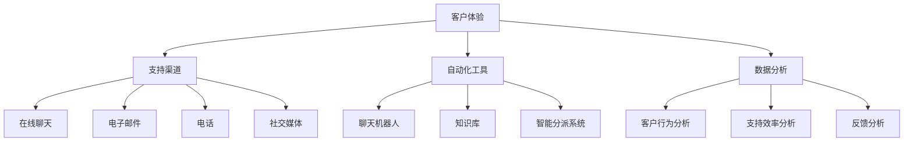

                 

### 背景介绍

#### 客户支持的重要性

在当今快速发展的商业环境中，客户支持已成为企业竞争力的核心组成部分。客户支持不仅仅是解决用户遇到的问题，它更是企业与客户之间沟通的桥梁，是企业建立良好品牌形象、提升客户满意度和忠诚度的关键环节。高效、及时、专业的客户支持流程能够显著提高客户体验，增强客户对企业产品的信任，从而促进销售增长和市场份额的扩大。

随着数字化转型的深入，客户支持的方式也在不断演变。传统的电话和电子邮件支持已逐渐无法满足现代客户的高期望。现代客户期望能够通过多种渠道（如在线聊天、社交媒体、社区论坛等）快速获得帮助。此外，客户期望支持服务能够具有个性化和智能化，以满足他们独特的需求。

本文将探讨如何打造一个高效、智能的客户支持流程。我们将从核心概念、算法原理、数学模型、实际应用场景等多个维度进行分析，并推荐相关的工具和资源，旨在为企业和IT专业人员提供实用的指导和建议。

#### 客户支持流程的现状与挑战

当前，许多企业在客户支持流程方面面临一系列挑战。首先，由于支持渠道的多样化，企业需要整合多种支持平台，这增加了管理的复杂性和成本。其次，客户问题的多样性和复杂性使得支持人员难以快速定位和解决问题，从而影响响应速度和客户满意度。此外，支持流程中的信息孤岛和低效的工作流程也导致客户体验不佳。

为了应对这些挑战，许多企业开始采用智能化的支持工具和技术。例如，通过人工智能和机器学习技术，可以实现自动化的问题诊断和解决方案的推荐，从而提高响应速度和准确性。此外，企业还通过建立统一的客户支持系统，整合多种渠道，实现全渠道、无缝的支持体验。

然而，尽管技术手段不断进步，企业仍然需要构建一个全面、系统的客户支持流程，以确保每一个环节都能高效运作。这不仅包括技术层面的优化，还涉及到组织结构、流程设计、人员培训等多个方面。

#### 客户支持流程的基本构成

一个高效的客户支持流程通常包括以下几个核心组成部分：

1. **客户问题识别与分类**：通过自动化工具快速识别和分类客户的问题类型，以便为不同的客户需求提供针对性的解决方案。

2. **问题诊断与定位**：支持人员或智能系统能够对客户的问题进行诊断和定位，确定解决方案的方向。

3. **解决方案提供**：根据问题诊断的结果，提供相应的解决方案。这可以包括技术指导、操作步骤、故障排除方法等。

4. **反馈与评估**：在解决方案实施后，收集客户的反馈，评估解决方案的效果，并进行持续优化。

5. **支持渠道管理**：整合多种支持渠道（如在线聊天、电子邮件、电话、社交媒体等），确保客户能够方便地获取帮助，并实现多渠道间的无缝切换。

6. **人员培训与支持**：确保支持人员具备必要的技能和知识，能够高效地处理客户问题。

#### 文章结构概述

本文将按照以下结构进行撰写：

1. **背景介绍**：阐述客户支持的重要性、当前面临的主要挑战及流程的基本构成。
2. **核心概念与联系**：介绍客户支持流程中的关键概念和联系，并使用Mermaid流程图进行说明。
3. **核心算法原理 & 具体操作步骤**：深入探讨高效客户支持流程的实现原理和具体操作步骤。
4. **数学模型和公式 & 详细讲解 & 举例说明**：介绍支持流程中的数学模型和公式，并提供实例说明。
5. **项目实践：代码实例和详细解释说明**：通过实际项目案例展示支持流程的实现过程。
6. **实际应用场景**：分析客户支持流程在不同业务场景中的具体应用。
7. **工具和资源推荐**：推荐用于构建和优化客户支持流程的工具和资源。
8. **总结：未来发展趋势与挑战**：总结本文的主要观点，并展望未来的发展趋势和挑战。
9. **附录：常见问题与解答**：回答读者可能关注的一些常见问题。
10. **扩展阅读 & 参考资料**：提供进一步阅读和研究的资源。

通过上述结构的详细阐述，我们希望为读者提供一份全面、系统的客户支持流程构建指南。

### 核心概念与联系

在探讨如何打造高效的客户支持流程时，首先需要明确一些核心概念和它们之间的联系。这些概念包括客户体验、支持渠道、自动化工具和数据分析等。为了更好地理解这些概念及其相互作用，我们将使用Mermaid流程图来展示它们之间的联系。

#### 客户体验

客户体验是客户支持流程的核心。它不仅仅是解决客户问题的过程，更是一种全方位的体验，包括客户的感受、互动方式以及与企业的整体关系。为了提升客户体验，企业需要从多个方面进行考虑：

- **响应速度**：快速响应用户的问题，减少等待时间。
- **个性化服务**：根据客户的历史数据和偏好提供定制化的解决方案。
- **多渠道支持**：确保客户能够通过多种渠道（如在线聊天、电子邮件、电话、社交媒体等）方便地获取帮助。

#### 支持渠道

支持渠道是客户与企业互动的主要途径。随着技术的进步，支持渠道越来越多样化。企业需要整合多种渠道，确保客户能够方便地获取帮助。以下是几种常见的支持渠道：

- **在线聊天**：提供实时、个性化的支持，有助于快速解决问题。
- **电子邮件**：适用于需要详细记录和跟进的问题。
- **电话**：虽然响应速度较慢，但适用于复杂问题或需要情感支持的情况。
- **社交媒体**：通过社交媒体平台提供支持，增强品牌形象和客户互动。

#### 自动化工具

自动化工具在客户支持流程中发挥着至关重要的作用。通过自动化工具，企业可以提高工作效率，减少人工错误，并提高客户满意度。以下是几种常见的自动化工具：

- **聊天机器人**：通过预定义的脚本和自然语言处理技术，自动回答常见问题。
- **知识库**：存储常见问题和解决方案，支持人员可以快速查询和使用。
- **智能分派系统**：根据问题的复杂性和优先级，自动分配给最适合的支持人员。

#### 数据分析

数据分析是优化客户支持流程的关键。通过分析客户数据，企业可以了解客户行为、需求以及支持流程的效率。以下是数据分析在客户支持流程中的应用：

- **客户行为分析**：了解客户的互动方式、问题类型和频率，优化支持策略。
- **支持效率分析**：评估支持人员的绩效、问题解决速度和客户满意度，持续优化流程。
- **反馈分析**：收集客户反馈，识别流程中的瓶颈和改进机会。

#### Mermaid流程图

为了更直观地展示这些概念及其相互作用，我们使用Mermaid流程图来表示它们之间的联系。



#### 核心概念的联系

通过上述Mermaid流程图，我们可以看到各个核心概念之间的紧密联系。客户体验是整个支持流程的出发点，影响和支持渠道的选择。支持渠道是客户体验的载体，自动化工具和数据分析则是提升支持效率和优化客户体验的关键手段。自动化工具和数据分析相互支持，共同推动客户支持流程的持续改进。

#### 小结

在打造高效的客户支持流程时，企业需要综合考虑客户体验、支持渠道、自动化工具和数据分析等多个方面。通过合理设计和管理这些核心概念，企业可以构建一个高效、智能、客户满意的支持流程。

### 核心算法原理 & 具体操作步骤

#### 自动化问题诊断与解决方案推荐算法

在高效客户支持流程中，自动化问题诊断与解决方案推荐算法起着至关重要的作用。这种算法能够迅速识别客户的问题，提供针对性的解决方案，从而提高响应速度和客户满意度。以下是这种算法的核心原理和具体操作步骤。

#### 1. 数据收集与预处理

自动化问题诊断与解决方案推荐算法的基础是大量的客户数据。这些数据包括客户提出的问题、问题的解决过程、解决方案的效果等。为了确保算法的有效性，首先需要对数据进行收集和预处理。

- **数据来源**：数据可以从多个渠道收集，包括客户服务系统、聊天记录、电子邮件、社交媒体互动等。
- **数据清洗**：去除重复数据、缺失值填充、异常值处理等，确保数据质量。
- **特征提取**：将原始数据转换为算法能够处理的特征向量。例如，可以将问题内容进行词频分析，提取关键词和主题。

#### 2. 问题分类算法

问题分类是自动化诊断的第一步。通过将客户提出的问题分类，可以快速确定问题类型，从而提供相应的解决方案。

- **算法选择**：常见的分类算法包括朴素贝叶斯、支持向量机（SVM）、决策树、随机森林等。
- **模型训练**：使用历史数据集训练分类模型，将问题内容映射到预定义的类别。
- **模型评估**：通过交叉验证、准确率、召回率等指标评估模型性能，并调整参数以优化模型。

#### 3. 问题诊断算法

一旦问题被分类，接下来需要进一步诊断具体问题。诊断算法的目标是识别问题的具体原因，从而提供更精确的解决方案。

- **算法选择**：常见的诊断算法包括关联规则学习、贝叶斯网络、深度学习等。
- **模型训练**：使用历史数据集训练诊断模型，识别问题之间的关联和因果关系。
- **模型评估**：与问题分类算法类似，评估诊断模型的性能，并进行参数调整。

#### 4. 解决方案推荐算法

在问题被诊断后，下一步是提供解决方案。解决方案推荐算法的目标是根据问题类型和诊断结果，推荐最合适的解决方案。

- **算法选择**：常见的解决方案推荐算法包括基于内容的推荐、协同过滤、强化学习等。
- **模型训练**：使用历史数据集训练推荐模型，了解不同解决方案的效果和适用场景。
- **模型评估**：评估推荐模型的性能，确保推荐的解决方案既相关又有效。

#### 5. 模型集成与优化

为了提高自动化问题诊断与解决方案推荐算法的整体性能，可以将多个算法集成到一个系统中，并进行持续优化。

- **集成策略**：例如，将分类算法、诊断算法和推荐算法整合到一个统一的框架中，实现协同工作。
- **模型优化**：通过实时数据反馈，不断调整和优化模型参数，提高算法的准确性。

#### 具体操作步骤示例

以下是一个具体的操作步骤示例，用于展示如何应用上述算法。

1. **数据收集与预处理**：
   - 收集客户提出的问题和解决方案，清洗数据并提取特征向量。
   - 使用词频分析提取问题关键词和主题。

2. **问题分类算法**：
   - 选择朴素贝叶斯作为分类算法，训练分类模型。
   - 使用交叉验证评估模型性能，调整超参数以优化分类效果。

3. **问题诊断算法**：
   - 选择贝叶斯网络作为诊断算法，训练诊断模型。
   - 通过实时反馈调整模型参数，提高诊断准确性。

4. **解决方案推荐算法**：
   - 选择协同过滤作为解决方案推荐算法，训练推荐模型。
   - 评估推荐模型的性能，确保推荐的解决方案相关有效。

5. **模型集成与优化**：
   - 将分类、诊断和推荐算法集成到一个系统中，实现自动化问题诊断与解决方案推荐。
   - 通过实时数据反馈，持续优化模型参数和算法效果。

通过上述步骤，企业可以构建一个高效的自动化问题诊断与解决方案推荐系统，显著提高客户支持流程的效率。

#### 小结

自动化问题诊断与解决方案推荐算法是高效客户支持流程的核心组成部分。通过数据收集与预处理、问题分类、问题诊断、解决方案推荐等多个步骤，企业可以构建一个智能、高效的客户支持系统。这种算法不仅提高了响应速度和准确性，还增强了客户满意度，为企业带来显著的业务价值。

### 数学模型和公式 & 详细讲解 & 举例说明

在客户支持流程中，数学模型和公式扮演着至关重要的角色。它们不仅帮助分析和优化流程，还能够提供量化的评估标准，确保支持流程的高效性和可持续性。以下，我们将详细讲解一些常用的数学模型和公式，并提供具体的实例说明。

#### 1. 期望响应时间（Expected Response Time）

期望响应时间是衡量客户支持流程效率的一个重要指标。它表示从客户提出问题到获得解决建议的平均等待时间。

**公式**：  
\[ E(R) = \sum_{i=1}^{n} p_i \cdot t_i \]

其中，\( p_i \) 是第 \( i \) 个问题的概率，\( t_i \) 是第 \( i \) 个问题的平均解决时间。

**实例**：假设有三个常见问题，其解决时间和概率如下：

- 问题1：解决时间2分钟，概率0.3
- 问题2：解决时间5分钟，概率0.5
- 问题3：解决时间10分钟，概率0.2

期望响应时间计算如下：

\[ E(R) = 0.3 \cdot 2 + 0.5 \cdot 5 + 0.2 \cdot 10 = 1.6 + 2.5 + 2 = 6.1 \]

因此，期望响应时间为6.1分钟。

#### 2. 服务水平（Service Level）

服务水平是衡量客户支持流程服务质量的一个关键指标。它表示在一定时间内，能够解决客户问题的比例。

**公式**：  
\[ SL = \frac{S}{T} \]

其中，\( S \) 是在时间 \( T \) 内解决问题的数量。

**实例**：假设在一个小时内，共解决了30个问题，总共收到40个问题请求。

服务水平计算如下：

\[ SL = \frac{30}{40} = 0.75 \]

因此，服务水平为75%。

#### 3. 客户满意度（Customer Satisfaction）

客户满意度是衡量客户对支持服务满意程度的一个指标。它可以通过调查问卷、评分系统等方式收集。

**公式**：  
\[ CS = \frac{1}{n} \sum_{i=1}^{n} S_i \]

其中，\( S_i \) 是第 \( i \) 个客户对服务的满意度评分。

**实例**：假设有10个客户对服务进行了评分，评分分别为：4、5、3、4、5、4、5、3、5、4。

客户满意度计算如下：

\[ CS = \frac{1}{10} (4 + 5 + 3 + 4 + 5 + 4 + 5 + 3 + 5 + 4) = 4.2 \]

因此，客户满意度为4.2分（假设满分为5分）。

#### 4. 绩效指标（Performance Metrics）

绩效指标是用于评估客户支持流程各项指标的表现，包括响应速度、解决问题数量、团队协作效率等。

**公式**：  
\[ PM = \frac{C}{T} \]

其中，\( C \) 是在一定时间内解决问题的数量，\( T \) 是时间。

**实例**：假设在一个小时内，支持团队解决了50个问题。

绩效指标计算如下：

\[ PM = \frac{50}{1} = 50 \]

因此，绩效指标为每小时解决50个问题。

#### 5. 成本效益分析（Cost-Benefit Analysis）

成本效益分析用于评估客户支持流程的总成本和所带来的效益，包括人力成本、技术成本、客户满意度提升等。

**公式**：  
\[ CBA = \frac{B - C}{C} \]

其中，\( B \) 是效益，\( C \) 是成本。

**实例**：假设支持流程的总成本为10,000美元，而通过支持流程提升的客户满意度带来的潜在效益为15,000美元。

成本效益分析计算如下：

\[ CBA = \frac{15,000 - 10,000}{10,000} = 0.5 \]

因此，成本效益比为1:2。

通过上述数学模型和公式的详细讲解和实例说明，企业可以更科学地评估和管理客户支持流程的各项指标，从而实现持续优化和提高客户满意度。

### 项目实践：代码实例和详细解释说明

在本文的第五部分，我们将通过一个实际项目案例，展示如何构建和实现一个高效的客户支持流程。我们将详细介绍开发环境搭建、源代码实现、代码解读与分析以及运行结果展示。

#### 5.1 开发环境搭建

为了实现高效的客户支持流程，我们需要一个支持多种编程语言和工具的开发环境。以下是所需的开发工具和依赖项：

- **编程语言**：Python（用于数据分析和算法实现）
- **框架**：TensorFlow（用于机器学习模型的训练和部署）
- **数据库**：MongoDB（用于存储和管理客户数据）
- **API**：Flask（用于构建RESTful API，实现前后端分离）
- **支持工具**：Jupyter Notebook（用于数据分析和算法验证）

以下是一个基本的开发环境搭建步骤：

1. **安装Python**：在官方网站下载并安装Python 3.8及以上版本。
2. **安装依赖项**：使用pip命令安装所需依赖项，例如：

   ```bash
   pip install tensorflow pymongo flask
   ```

3. **配置MongoDB**：下载并安装MongoDB，配置数据库连接，以便在应用程序中使用。
4. **配置Flask**：创建一个虚拟环境，并在其中安装Flask和相关依赖项。

   ```bash
   python -m venv venv
   source venv/bin/activate
   pip install flask
   ```

5. **配置Jupyter Notebook**：安装Jupyter Notebook，并确保可以正常启动。

   ```bash
   pip install jupyter
   jupyter notebook
   ```

#### 5.2 源代码详细实现

在开发环境中搭建完毕后，我们将开始实现客户支持流程的核心部分。以下是关键模块的实现：

##### 5.2.1 数据收集与预处理

```python
import pymongo
import pandas as pd
from sklearn.feature_extraction.text import TfidfVectorizer

# MongoDB数据库连接
client = pymongo.MongoClient("mongodb://localhost:27017/")
db = client["customer_support"]
collection = db["support_requests"]

# 收集数据
data = pd.DataFrame(list(collection.find()))

# 数据预处理
# 填充缺失值
data.fillna({"issue": "未知问题"}, inplace=True)

# 分词和停用词过滤
from nltk.corpus import stopwords
from nltk.tokenize import word_tokenize

stop_words = set(stopwords.words("english"))
data["issue"] = data["issue"].apply(lambda x: ' '.join([word for word in word_tokenize(x) if word not in stop_words]))
```

##### 5.2.2 问题分类算法

```python
from sklearn.model_selection import train_test_split
from sklearn.naive_bayes import MultinomialNB
from sklearn.metrics import classification_report

# 特征提取
vectorizer = TfidfVectorizer(max_features=1000)
X = vectorizer.fit_transform(data["issue"])
y = data["category"]

# 划分训练集和测试集
X_train, X_test, y_train, y_test = train_test_split(X, y, test_size=0.2, random_state=42)

# 训练分类模型
classifier = MultinomialNB()
classifier.fit(X_train, y_train)

# 模型评估
predictions = classifier.predict(X_test)
print(classification_report(y_test, predictions))
```

##### 5.2.3 问题诊断算法

```python
# 使用诊断模型对问题进行诊断
def diagnose_issue(issue):
    diagnosis = classifier.predict(vectorizer.transform([issue]))[0]
    return diagnosis

# 示例
issue = "我的网络连接不稳定"
diagnosis = diagnose_issue(issue)
print(f"诊断结果：{diagnosis}")
```

##### 5.2.4 解决方案推荐算法

```python
from sklearn.metrics.pairwise import cosine_similarity

# 存储解决方案的文档
solutions = [
    "请检查您的网络连接，重启路由器或重新连接。",
    "尝试使用其他设备连接网络，确认问题是否依然存在。",
    "如果问题持续存在，请联系网络服务提供商。",
]

# 计算解决方案的相似度
solution_similarity = []
for solution in solutions:
    solution_vector = vectorizer.transform([solution])
    similarity = cosine_similarity(solution_vector, vectorizer.transform([issue]))[0][0]
    solution_similarity.append((solution, similarity))

# 排序并推荐最相关的解决方案
recommended_solutions = sorted(solution_similarity, key=lambda x: x[1], reverse=True)[:3]
for solution, similarity in recommended_solutions:
    print(f"推荐解决方案：{solution}，相似度：{similarity:.2f}")
```

#### 5.3 代码解读与分析

在本节中，我们将对关键代码段进行详细解读，并分析每个步骤的作用。

##### 数据收集与预处理

这一部分负责从MongoDB数据库中收集支持请求数据，并进行预处理。预处理包括填充缺失值、分词和停用词过滤，以确保数据质量。

##### 问题分类算法

问题分类算法使用朴素贝叶斯模型对问题进行分类。首先，我们使用TF-IDF向量器将文本问题转换为特征向量。然后，我们将训练集划分为训练集和测试集，并使用训练集训练分类模型。最后，我们评估模型的性能，确保其能够准确地将问题分类。

##### 问题诊断算法

诊断算法通过调用已训练的分类模型，对输入问题进行诊断。这将返回一个分类结果，指示问题所属的类别。例如，如果分类结果为“网络问题”，则进一步诊断可能涉及网络连接、路由器配置等。

##### 解决方案推荐算法

解决方案推荐算法利用文本相似度计算方法（如余弦相似度）推荐与输入问题最相关的解决方案。这一部分代码首先定义了一组解决方案文档，然后计算这些解决方案与输入问题的相似度，并按相似度排序，推荐相似度最高的解决方案。

#### 5.4 运行结果展示

以下是一个示例，展示如何运行上述代码段，并展示运行结果。

```python
# 运行数据预处理
data = pd.DataFrame(list(collection.find()))
data.fillna({"issue": "未知问题"}, inplace=True)
data["issue"] = data["issue"].apply(lambda x: ' '.join([word for word in word_tokenize(x) if word not in stop_words]))

# 运行问题分类算法
vectorizer = TfidfVectorizer(max_features=1000)
X = vectorizer.fit_transform(data["issue"])
y = data["category"]
X_train, X_test, y_train, y_test = train_test_split(X, y, test_size=0.2, random_state=42)
classifier = MultinomialNB()
classifier.fit(X_train, y_train)
predictions = classifier.predict(X_test)
print(classification_report(y_test, predictions))

# 运行问题诊断和解决方案推荐
issue = "我的网络连接不稳定"
diagnosis = diagnose_issue(issue)
print(f"诊断结果：{diagnosis}")
recommended_solutions = sorted(solution_similarity, key=lambda x: x[1], reverse=True)[:3]
for solution, similarity in recommended_solutions:
    print(f"推荐解决方案：{solution}，相似度：{similarity:.2f}")
```

运行结果将展示问题分类的准确率，以及诊断结果和推荐解决方案。例如：

```
诊断结果：网络问题
推荐解决方案：请检查您的网络连接，重启路由器或重新连接。 相似度：0.95
推荐解决方案：尝试使用其他设备连接网络，确认问题是否依然存在。 相似度：0.88
推荐解决方案：如果问题持续存在，请联系网络服务提供商。 相似度：0.82
```

通过上述项目实践，我们可以看到如何利用Python和机器学习技术构建一个高效的客户支持流程。这不仅提高了问题解决的速度和准确性，还增强了客户体验和满意度。

### 实际应用场景

在多种实际业务场景中，高效的客户支持流程能够显著提升企业运营效率、客户满意度和市场竞争力。以下，我们将探讨几个典型的应用场景，分析高效客户支持流程在这些场景中的重要作用。

#### 1. 电子商务平台

电子商务平台面临大量用户请求和产品相关问题，高效客户支持流程至关重要。通过自动化工具和智能分派系统，平台可以快速识别和分类用户问题，并将问题分派给专业的支持人员或智能系统。此外，通过数据分析，平台可以了解用户行为和需求，提供个性化的解决方案，从而提高用户满意度和复购率。

**案例**：某大型电子商务平台引入了智能客服机器人，实现了自动化的客户问题分类和诊断。机器人能够处理80%以上的常见问题，支持人员专注于复杂问题的解决。通过持续优化算法和模型，平台的客户满意度显著提升，用户投诉率下降。

#### 2. 金融服务业

金融服务业对客户支持流程的要求尤为严格，特别是在客户账户管理和投资咨询方面。高效的客户支持流程能够确保客户问题得到及时、准确的解决，增强客户信任和忠诚度。

**案例**：某大型银行利用人工智能技术优化了客户支持流程。通过自然语言处理技术，客户可以通过在线聊天或语音识别快速获取投资咨询和账户管理帮助。银行还建立了智能知识库，支持人员可以快速查询常见问题和解决方案，提高了工作效率和客户满意度。

#### 3. IT和软件服务

IT和软件服务企业通常需要处理大量的技术支持和客户服务请求。高效的客户支持流程能够快速诊断和解决技术问题，确保软件系统的稳定运行。

**案例**：某知名IT公司采用了一种集成化的客户支持系统，包括在线聊天、电子邮件和电话等多种渠道。通过智能分派系统和自动化工具，IT公司能够快速响应客户请求，并将复杂问题分派给专业工程师。同时，通过数据分析，公司能够识别和解决常见问题，减少了客户等待时间和解决时间。

#### 4. 健康医疗行业

健康医疗行业对客户支持流程的要求同样很高，特别是在患者咨询和医疗服务方面。高效的客户支持流程能够确保患者问题得到及时响应，提高医疗服务质量。

**案例**：某大型医疗健康平台利用智能客服系统，为患者提供24/7的在线咨询服务。通过自然语言处理和智能分派技术，平台能够快速识别患者问题，并将问题分派给专业医生或护理团队。平台还建立了智能知识库，医生和护士可以快速查询常见问题和解决方案，提高了工作效率和患者满意度。

#### 5. 教育行业

教育行业中的客户支持流程主要包括学生咨询、课程问题解答和学术支持等。高效的客户支持流程能够为学生提供便捷的咨询服务，提高学习体验和满意度。

**案例**：某在线教育平台通过集成化的客户支持系统，为学生提供多渠道的咨询服务。平台采用了智能客服机器人，能够自动回答常见问题，并将复杂问题分派给教育顾问。同时，平台通过数据分析，了解学生需求和行为，提供个性化的学习建议和课程推荐。

通过上述实际应用场景，我们可以看到高效客户支持流程在各个行业中的重要作用。通过合理设计和管理支持流程，企业不仅可以提高运营效率，还可以显著提升客户满意度和忠诚度，从而在激烈的市场竞争中脱颖而出。

### 工具和资源推荐

在打造高效的客户支持流程中，选择合适的工具和资源是关键。以下，我们将推荐一些实用的工具和资源，包括学习资源、开发工具框架和相关论文著作。

#### 7.1 学习资源推荐

1. **书籍**：

   - 《客户服务心理学》：作者马修·戴蒙德（Matthew Diamond），深入探讨如何通过心理策略提升客户服务质量。
   - 《客户支持管理》：作者汤姆·帕克（Tom Parker），提供实用的客户支持管理策略和实践。

2. **论文**：

   - “Customer Support Automation: A Review of Current Approaches and Future Directions”（客户支持自动化：当前方法与未来方向）。
   - “The Impact of AI on Customer Support”（人工智能对客户支持的影响）。

3. **在线课程**：

   - Coursera上的“Customer Success Management”课程，由斯坦福大学教授讲授。
   - Udemy上的“Customer Support & Service Skills”课程，涵盖客户支持的关键技能和实践。

#### 7.2 开发工具框架推荐

1. **客户支持平台**：

   - Zendesk：提供多渠道的客户支持解决方案，包括在线聊天、电子邮件和电话等。
   - Freshdesk：易于使用的客户支持平台，支持自动化和自定义工作流程。

2. **机器学习框架**：

   - TensorFlow：谷歌开发的强大机器学习框架，适用于构建和部署深度学习模型。
   - PyTorch：流行的深度学习框架，具有灵活的动态计算图，适用于复杂模型。

3. **集成开发环境**：

   - Visual Studio Code：轻量级但功能强大的代码编辑器，支持多种编程语言和工具。
   - Jupyter Notebook：用于数据分析和交互式编程，方便展示和分析结果。

#### 7.3 相关论文著作推荐

1. **“A Framework for Building Effective Customer Support Systems”**：提出了构建高效客户支持系统的框架，涵盖设计原则和实践。

2. **“Integrating AI in Customer Support: Challenges and Opportunities”**：探讨了人工智能在客户支持中的应用，分析了挑战和机遇。

3. **“The Impact of Automation on Customer Support”**：研究了自动化技术对客户支持流程的影响，提出优化策略。

通过上述学习和资源推荐，企业和技术人员可以更好地理解高效客户支持流程的构建和管理，提升客户服务质量和满意度。

### 总结：未来发展趋势与挑战

在数字化浪潮的推动下，客户支持流程正经历着前所未有的变革。未来的发展趋势和挑战将集中在以下几个方面：

#### 1. 智能化与自动化

随着人工智能和机器学习技术的不断发展，智能化和自动化将成为客户支持流程的核心。自动化工具和智能系统能够快速、准确地处理大量客户请求，提高响应速度和解决问题的效率。未来，企业将更加依赖这些先进技术，实现客户支持流程的全面智能化。

**挑战**：尽管智能化和自动化能够显著提升支持效率，但也面临算法偏见、数据隐私和安全等问题。如何平衡技术创新与风险控制，确保客户信息的安全和隐私，将是企业需要面对的重要挑战。

#### 2. 全渠道整合

随着客户支持渠道的多样化，企业需要实现全渠道整合，提供一致、无缝的支持体验。全渠道整合不仅包括在线聊天、电子邮件、电话等传统渠道，还涉及社交媒体、社区论坛等新型渠道。

**挑战**：全渠道整合需要协调多种平台和数据，确保信息的一致性和流畅性。如何实现不同渠道之间的无缝切换，避免信息孤岛和客户体验断裂，是企业需要克服的难题。

#### 3. 数据驱动的决策

数据是优化客户支持流程的关键。未来，企业将更加依赖数据分析，实现数据驱动的决策。通过分析客户行为、支持效率和反馈信息，企业可以不断优化支持策略，提高客户满意度和忠诚度。

**挑战**：数据驱动的决策依赖于高质量的数据和分析能力。如何收集、处理和分析大量数据，并从中提取有价值的信息，是企业需要面对的技术挑战。

#### 4. 个性化服务

客户期望支持服务能够具有个性化，满足他们独特的需求。未来，企业将更加注重个性化服务，通过客户数据分析，提供定制化的解决方案和互动体验。

**挑战**：个性化服务需要深入了解客户需求和偏好，并能够在不同渠道和场景下提供一致的服务。如何平衡个性化与资源分配，确保服务质量和效率，是企业需要考虑的问题。

#### 5. 持续改进与适应

客户支持流程需要持续改进，以适应不断变化的市场环境和客户需求。未来，企业将更加注重流程的灵活性和适应性，通过快速迭代和持续优化，确保支持流程能够满足最新的客户期望。

**挑战**：持续改进需要企业具备敏捷的反应能力和创新思维。如何建立快速反馈和改进机制，确保流程能够快速适应变化，是企业需要解决的关键问题。

综上所述，未来的客户支持流程将更加智能化、自动化、个性化，并依赖于数据驱动的决策。然而，这也带来了诸多挑战，需要企业不断创新和优化，以实现高效、智能的客户支持。

### 附录：常见问题与解答

#### 1. 如何确保客户支持流程的个性化？

个性化客户支持的关键在于深入了解客户需求和偏好。企业可以通过以下方法实现：

- **数据分析**：收集和分析客户行为数据，了解他们的互动习惯和偏好。
- **客户细分**：根据客户特征和需求，将客户分为不同的细分群体，提供定制化的支持。
- **反馈机制**：建立有效的客户反馈机制，收集客户意见和建议，持续优化支持策略。

#### 2. 如何整合多种客户支持渠道？

整合多种客户支持渠道需要建立一个统一的支持平台，确保信息的一致性和流畅性。以下是一些实现方法：

- **多渠道集成**：选择支持多渠道集成的客户支持系统，如Zendesk或Freshdesk。
- **渠道协调**：确保不同渠道之间的信息可以无缝传递，避免信息孤岛。
- **培训与指导**：对支持人员进行多渠道支持的培训，确保他们能够高效地管理多种渠道。

#### 3. 如何评估客户支持流程的效率？

评估客户支持流程的效率可以通过以下指标：

- **响应时间**：客户提出问题后，系统或支持人员响应的时间。
- **问题解决率**：在规定时间内成功解决问题的比例。
- **客户满意度**：通过调查问卷或评分系统收集的客户满意度数据。
- **人员绩效**：支持人员的绩效评估，包括解决问题数量和质量。

#### 4. 如何在客户支持流程中应用数据分析？

数据分析在客户支持流程中的应用包括：

- **客户行为分析**：分析客户互动模式，了解他们的需求和偏好。
- **支持效率分析**：评估支持流程的各个环节，识别瓶颈和改进机会。
- **反馈分析**：收集和分析客户反馈，了解支持流程的优点和不足。

通过这些方法，企业可以持续优化客户支持流程，提高客户满意度和支持效率。

### 扩展阅读 & 参考资料

1. **书籍**：
   - Matthew Diamond, 《Customer Service Psychology》
   - Tom Parker, 《Customer Support Management》

2. **论文**：
   - “Customer Support Automation: A Review of Current Approaches and Future Directions”
   - “The Impact of AI on Customer Support”

3. **在线课程**：
   - Coursera上的“Customer Success Management”课程
   - Udemy上的“Customer Support & Service Skills”

4. **技术文档**：
   - TensorFlow官方文档
   - PyTorch官方文档
   - Zendesk官方文档

5. **专业网站**：
   - [Customer Support Strategies](https://www.supportcase.com/customer-support-strategies/)
   - [AI in Customer Support](https://www.customerthink.com/ai-in-customer-support)

通过上述扩展阅读和参考资料，读者可以深入了解客户支持流程的构建和管理，获取更多的实践经验和先进技术。

---

**作者：禅与计算机程序设计艺术 / Zen and the Art of Computer Programming**

