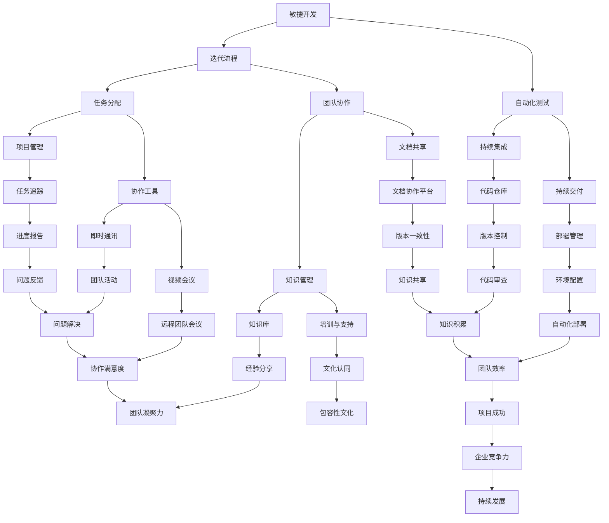

                 

### 背景介绍

#### 异地团队协作的兴起

随着全球化进程的不断加快，异地团队协作已经成为现代企业运营的常态。无论是在跨国公司还是创业团队，异地团队协作都显得尤为重要。这种趋势的出现，主要源于以下几个方面的原因：

1. **全球人才竞争**：优秀的工程师和技术人才越来越稀缺，企业必须打破地域限制，吸引全球最优秀的人才。
2. **远程工作的普及**：技术的进步使得远程工作变得愈发可行，很多员工愿意在家或其它地方工作，以提高工作效率和生活质量。
3. **成本节约**：异地团队可以减少公司对办公室和硬件设备的投入，降低运营成本。
4. **灵活性**：异地团队可以让项目更灵活，更容易适应市场变化和需求调整。

然而，异地团队协作也带来了新的挑战，例如沟通困难、协作效率低下、文化差异等。因此，构建一个高效的异地团队协作生态系统成为企业亟待解决的问题。

#### 构建高效异地团队协作生态系统的必要性

一个高效的异地团队协作生态系统不仅能够提高团队的工作效率，还能够增强团队的凝聚力，从而为企业带来持续的竞争优势。以下是构建高效异地团队协作生态系统的一些必要性：

1. **优化沟通渠道**：高效的沟通是团队协作的基础。通过多种沟通工具和平台的结合，可以确保团队成员之间的信息传递及时、准确。
2. **提升协作效率**：异地团队协作需要高效的工具和流程来支持。自动化、集成化的协作工具可以减少人为错误，提高工作效率。
3. **促进知识共享**：异地团队协作需要确保知识的传递和共享。通过文档管理、知识库建设等技术手段，可以保证知识不被丢失，且易于访问。
4. **强化团队文化**：虽然团队成员分散在不同地点，但团队文化的统一对于保持团队凝聚力至关重要。通过线上活动和社交平台，可以增强团队成员之间的联系。

总之，构建一个高效的异地团队协作生态系统，不仅需要技术手段的支持，还需要从团队文化、管理流程等多个方面进行综合考虑。接下来，我们将深入探讨如何实现这一目标。

#### 当前常见的异地团队协作问题

尽管异地团队协作在许多方面具有优势，但实际操作中依然面临着诸多挑战。以下是当前常见的几个异地团队协作问题及其影响：

1. **沟通障碍**：由于团队成员分散在不同地点，沟通成本大大增加。信息的传递可能会因为时差、语言障碍和文化差异而受到影响，导致信息不准确或延迟。

   - **解决方案**：采用多渠道沟通工具，如视频会议、即时通讯、邮件等，以确保信息的及时传递。同时，建立统一的语言规范和沟通模板，减少误解和沟通成本。

2. **协作效率低下**：异地团队协作缺乏面对面的交流，可能导致团队成员之间的协作效率下降。任务分配不明确、进度难以追踪、问题解决延迟等问题会频繁出现。

   - **解决方案**：引入协作工具，如项目管理软件、代码仓库、文档协作平台等，以便团队成员可以实时同步工作进展。此外，制定明确的任务分配和进度追踪机制，确保每个任务都有人负责。

3. **文化差异**：不同的文化背景会导致团队成员在工作方式、沟通风格、决策流程等方面产生差异，从而影响团队的整体协作效果。

   - **解决方案**：通过团队建设活动和跨文化培训，提高团队成员对文化差异的敏感度。同时，建立开放、包容的团队文化，鼓励成员分享自己的观点和经验，减少文化冲突。

4. **知识共享困难**：在异地团队中，知识共享往往受到地理、时间和工具的限制，导致重要信息难以被及时传递和利用。

   - **解决方案**：构建知识库，确保所有重要信息都能被及时记录和共享。利用文档管理系统和版本控制工具，确保文档的版本一致性，减少知识丢失的风险。

通过识别和解决这些常见问题，企业可以更好地应对异地团队协作的挑战，从而构建一个高效、稳定的协作生态系统。接下来，我们将探讨构建高效异地团队协作生态系统的核心概念与架构。

---

## 2. 核心概念与联系

### 2.1. 核心概念介绍

在构建高效的异地团队协作生态系统时，了解以下几个核心概念是非常关键的：

1. **敏捷开发**：敏捷开发是一种以人为核心、迭代和灵活响应变化的软件开发方法。它强调频繁的交流、团队的协作、以及持续交付有价值的软件。

2. **DevOps**：DevOps是一种结合软件开发（Development）和信息技术运营（Operations）的方法论，旨在通过自动化、协作和持续集成/持续交付（CI/CD）来提高软件开发的效率和质量。

3. **协作工具**：协作工具是支持团队协作的软件平台，如项目管理软件、代码仓库、文档管理系统、即时通讯工具等。

4. **知识管理**：知识管理是指通过系统的收集、存储、共享和应用知识，以最大化其价值的过程。知识管理对于异地团队尤为重要，因为它有助于确保知识不被地理分散而丢失。

5. **远程工作文化**：远程工作文化是指企业内部为支持远程工作所建立的一系列规范、价值观和实践活动。一个良好的远程工作文化能够促进团队成员之间的信任和协作。

### 2.2. 概念联系与流程图

下面是一个Mermaid流程图，展示了这些核心概念之间的联系以及它们在构建高效异地团队协作生态系统中的流程：



### 2.3. 敏捷开发与迭代流程

敏捷开发的核心理念在于迭代和快速响应变化。迭代流程通常包括以下步骤：

1. **需求收集**：通过与利益相关者（如客户、产品经理等）的沟通，收集软件功能的需求。
2. **任务拆分**：将需求分解为具体的工作任务，并为每个任务分配责任。
3. **迭代开发**：在一个迭代周期内（通常为几周），团队会集中精力完成部分任务，并交付可运行的软件版本。
4. **评审与反馈**：在每个迭代结束时，团队会进行评审，收集用户和利益相关者的反馈，并根据反馈调整下一个迭代的需求和任务。

通过这样的迭代流程，团队可以持续地交付有价值的功能，同时保持对市场变化的敏捷响应。

### 2.4. DevOps与自动化

DevOps强调通过自动化和协作来提高软件开发的效率。以下是DevOps中的一些关键元素：

1. **持续集成（CI）**：通过自动化的构建和测试流程，确保每次代码提交都经过测试，及时发现和解决集成中的问题。
2. **持续交付（CD）**：通过自动化的部署和管理流程，确保软件可以快速、可靠地交付到生产环境。
3. **基础设施即代码（IaC）**：将基础设施的配置和管理通过代码进行自动化，以提高部署的可靠性和可重复性。

这些自动化流程不仅减少了手动操作的错误，还提高了开发、测试和部署的效率，从而增强了异地团队协作的稳定性。

### 2.5. 协作工具与知识管理

协作工具和知识管理是高效异地团队协作的核心支撑。以下是几种关键的协作工具和知识管理方法：

1. **项目管理软件**：如JIRA、Trello等，可以帮助团队进行任务分配、进度追踪和报告。
2. **代码仓库**：如GitLab、GitHub等，用于版本控制和代码共享。
3. **文档协作平台**：如Confluence、Notion等，用于文档编写、分享和版本管理。
4. **知识库**：如Wiki、知识管理系统等，用于收集和共享团队的知识和经验。
5. **培训与支持**：通过线上培训、研讨会和一对一辅导，提高团队成员的技能和知识。

通过这些工具和方法，团队可以确保信息传递的及时性和准确性，同时促进知识的积累和共享。

### 2.6. 远程工作文化与团队凝聚力

远程工作文化对于异地团队的凝聚力至关重要。以下是构建远程工作文化的一些关键点：

1. **信任与透明**：建立开放的沟通渠道，鼓励团队成员分享自己的观点和经验，增强信任感。
2. **包容性文化**：尊重团队成员的文化差异，营造包容、支持的工作环境。
3. **团队活动**：定期举办线上团队建设活动，如虚拟团建、知识分享会等，增强团队成员之间的联系。
4. **明确的目标与期望**：确保每个团队成员都明确自己的职责和目标，减少误解和冲突。

通过这些措施，企业可以建立一个积极、和谐的远程工作文化，从而提高团队的凝聚力和工作效率。

综上所述，构建高效的异地团队协作生态系统需要综合考虑敏捷开发、DevOps、协作工具、知识管理以及远程工作文化等多个方面。通过这些核心概念和流程的有机结合，企业可以构建一个高效、稳定的异地团队协作生态系统，从而实现持续的业务增长和竞争力提升。

---

## 3. 核心算法原理 & 具体操作步骤

在构建高效的异地团队协作生态系统时，算法的设计和实施是关键的一环。以下是几个核心算法原理及其具体操作步骤：

### 3.1. 任务调度算法

**原理**：任务调度算法用于合理分配任务，确保每个团队成员都能有效地利用自己的时间和技能。

**具体操作步骤**：

1. **需求分析**：首先，分析任务的需求，包括任务的难度、紧急程度和所需资源等。
2. **任务划分**：将任务分解为多个子任务，并为每个子任务设定优先级。
3. **资源评估**：评估团队成员的技能和可用资源，选择最适合执行子任务的人员。
4. **任务分配**：根据资源评估结果，将子任务分配给合适的团队成员。
5. **动态调整**：在任务执行过程中，根据实际情况动态调整任务分配，确保资源的最大化利用。

### 3.2. 沟通优化算法

**原理**：沟通优化算法旨在通过优化沟通路径和方式，提高异地团队的信息传递效率。

**具体操作步骤**：

1. **沟通需求分析**：分析团队成员的沟通需求，包括沟通的频率、内容和渠道等。
2. **沟通路径规划**：根据沟通需求，设计合理的沟通路径，确保信息能够高效、准确地传递。
3. **沟通方式选择**：选择适合不同沟通需求的沟通方式，如视频会议、即时通讯、邮件等。
4. **沟通效果评估**：定期评估沟通效果，根据反馈调整沟通方式和路径，以提高沟通效率。

### 3.3. 知识共享算法

**原理**：知识共享算法用于促进团队成员之间的知识传递和积累，确保知识的充分利用。

**具体操作步骤**：

1. **知识需求识别**：识别团队成员在项目执行过程中需要共享的知识点。
2. **知识内容构建**：构建详细的、易于理解的知识内容，确保知识传递的准确性和完整性。
3. **知识库建设**：将构建的知识内容存入知识库，确保知识的可访问性和可更新性。
4. **知识共享机制**：设计有效的知识共享机制，如定期的知识分享会、在线问答平台等，鼓励团队成员主动分享知识。

### 3.4. 团队协作优化算法

**原理**：团队协作优化算法用于提高团队成员之间的协作效率，确保项目能够按时、高质量地完成。

**具体操作步骤**：

1. **协作需求分析**：分析项目执行过程中所需的协作内容和协作模式。
2. **协作流程设计**：设计合理的协作流程，确保每个团队成员都能明确自己的职责和协作方式。
3. **协作工具选择**：选择适合协作需求的工作工具，如项目管理软件、代码仓库、文档协作平台等。
4. **协作效果评估**：定期评估协作效果，根据反馈优化协作流程和工具，以提高协作效率。

通过上述核心算法的设计和实施，企业可以构建一个高效的异地团队协作生态系统，从而实现团队成员之间的顺畅协作和高效工作。

---

## 4. 数学模型和公式 & 详细讲解 & 举例说明

在构建高效异地团队协作生态系统时，数学模型和公式为我们提供了分析和优化协作流程的有力工具。以下是一些关键的数学模型和公式，以及它们的详细讲解和举例说明。

### 4.1. 项目管理中的关键路径法（Critical Path Method, CPM）

**原理**：关键路径法是一种用于确定项目最短完成时间的方法。它通过分析项目中各任务的依赖关系，识别出影响项目总工期的关键路径。

**公式**：总工期 = 各任务工期之和

**详细讲解**：

1. **任务网络图**：首先，构建任务网络图，表示项目中所有任务的依赖关系。
2. **计算每个任务的最早开始时间（Earliest Start Time, EST）和最早完成时间（Earliest Finish Time, EFT）**：从项目开始点开始，逐个计算每个任务的最早开始和完成时间。
3. **计算每个任务的最迟开始时间（Latest Start Time, LST）和最迟完成时间（Latest Finish Time, LFT）**：从项目结束点开始，逆向计算每个任务的最迟开始和完成时间。
4. **计算每个任务的总浮动时间（Total Float Time, TFT）**：总浮动时间 = 最迟开始时间 - 最早开始时间 或 最迟完成时间 - 最早完成时间。

**举例说明**：

假设一个项目包含以下任务及其依赖关系：

- A（2天）
- B（3天，依赖A）
- C（4天，依赖A）
- D（3天，依赖B和C）

构建任务网络图如下：

```
    A
   / \
  B   C
   \ /
    D
```

计算每个任务的最早开始时间和最早完成时间：

- A：EST = 0, EFT = 2
- B：EST = 2, EFT = 5
- C：EST = 2, EFT = 6
- D：EST = 5, EFT = 8

计算每个任务的最迟开始时间和最迟完成时间：

- A：LST = 0, LFT = 2
- B：LST = 2, LFT = 5
- C：LST = 2, LFT = 6
- D：LST = 5, LFT = 8

计算每个任务的总浮动时间：

- A：TFT = 0
- B：TFT = 0
- C：TFT = 0
- D：TFT = 3

关键路径为 A -> B -> D，总工期为 8 天。

### 4.2. 通信延迟模型

**原理**：通信延迟模型用于计算异地团队协作中的通信延迟，包括网络延迟和传输延迟。

**公式**：

- 总延迟 = 网络延迟 + 传输延迟
- 网络延迟 = 距离 × 常数
- 传输延迟 = 数据大小 × 常数

**详细讲解**：

1. **网络延迟**：网络延迟与通信双方之间的距离成正比，通常用常数乘以距离来计算。
2. **传输延迟**：传输延迟与数据大小成正比，通常用常数乘以数据大小来计算。

**举例说明**：

假设两个团队成员位于相距 1000 公里的两地，网络延迟常数为 0.1 毫秒/公里，数据大小为 1 MB。

- 网络延迟 = 1000 × 0.1 = 100 毫秒
- 传输延迟 = 1 × 常数（假设常数为 10 毫秒/MB）= 10 毫秒

总延迟 = 100 + 10 = 110 毫秒。

### 4.3. 团队协作效率模型

**原理**：团队协作效率模型用于衡量团队在不同协作方式下的工作效率。

**公式**：

- 效率 = 完成工作量 / 协作时间

**详细讲解**：

1. **完成工作量**：完成工作量可以通过任务完成的数量或任务完成的质量来衡量。
2. **协作时间**：协作时间是指团队成员在协作过程中所花费的总时间。

**举例说明**：

假设一个团队在两周内完成了 10 个任务，每个任务的难度相同，团队协作时间为 14 天。

- 完成工作量 = 10
- 协作时间 = 14

效率 = 10 / 14 ≈ 0.714，即团队在两周内的平均协作效率为 71.4%。

通过这些数学模型和公式，企业可以更好地分析和优化异地团队协作的过程，从而提高工作效率和团队协作的满意度。

---

### 5.1. 开发环境搭建

#### 开发环境选择

在搭建开发环境时，首先需要根据项目需求选择合适的工具和平台。以下是一些常见的开发环境选择：

1. **操作系统**：常用的操作系统包括 Windows、macOS 和 Linux。Linux 由于其开源性和高性能，在开发环境中尤为受欢迎。
2. **编程语言**：根据项目需求选择合适的编程语言，如 Java、Python、JavaScript 等。
3. **集成开发环境（IDE）**：如 Eclipse、IntelliJ IDEA、Visual Studio Code 等，这些 IDE 提供了丰富的工具和插件，可以提高开发效率。
4. **代码版本控制工具**：如 Git，用于管理代码版本和控制代码库。
5. **数据库**：根据项目需求选择合适的数据库系统，如 MySQL、PostgreSQL、MongoDB 等。
6. **Web 服务器**：如 Apache、Nginx 等，用于托管和部署 Web 应用程序。

#### 系统安装与配置

1. **安装操作系统**：选择合适的操作系统镜像进行安装，确保操作系统稳定可靠。
2. **安装编程语言**：在操作系统上安装相应的编译器和解释器，确保可以正常运行编程语言。
3. **安装 IDE**：下载并安装选定的 IDE，配置开发环境，安装必要的插件。
4. **安装代码版本控制工具**：下载并安装 Git，配置本地仓库和远程仓库。
5. **安装数据库**：下载并安装选定的数据库系统，配置数据库实例和用户权限。
6. **安装 Web 服务器**：下载并安装 Web 服务器，配置虚拟主机和域名。

#### 环境配置示例

以下是一个简单的开发环境配置示例，以 Ubuntu 操作系统为例：

```bash
# 安装操作系统
sudo apt update && sudo apt upgrade

# 安装 Java 开发环境
sudo apt install openjdk-11-jdk

# 安装 IntelliJ IDEA
wget https://download.jetbrains.com/idea/ideaIC-2022.3.tar.gz
tar xvf ideaIC-2022.3.tar.gz
cd ideaIC-2022.3/bin
./idea.sh

# 安装 Git
sudo apt install git

# 安装 MySQL
sudo apt install mysql-server
sudo mysql_secure_installation

# 安装 Nginx
sudo apt install nginx
sudo ufw allow 'Nginx Full'

# 配置 Nginx 虚拟主机
sudo nano /etc/nginx/sites-available/default
```

在 Nginx 配置文件中添加以下内容：

```nginx
server {
    listen 80;
    server_name example.com;

    location / {
        root /var/www/html;
        index index.html index.htm;
    }

    error_page 500 502 503 504 /custom_50x.html;
    location = /custom_50x.html {
        root /usr/share/nginx/html;
        internal;
    }
}
```

保存并重启 Nginx：

```bash
sudo systemctl restart nginx
```

通过上述步骤，我们可以搭建一个基本的开发生态系统，为后续的项目开发提供支持。

---

### 5.2. 源代码详细实现

在本节中，我们将详细讨论如何实现一个用于异地团队协作的示例项目。该项目将基于 Python 语言和 Flask 框架开发，包括用户管理、任务管理和通知系统等功能。

#### 技术栈

- **编程语言**：Python 3.8+
- **框架**：Flask
- **前端框架**：Vue.js
- **数据库**：SQLite
- **后端服务**：Flask-RESTful、Flask-Migrate

#### 数据库设计与迁移

首先，我们需要设计数据库模型，并使用 Flask-Migrate 工具进行迁移。

```python
from flask_sqlalchemy import SQLAlchemy

db = SQLAlchemy()

class User(db.Model):
    id = db.Column(db.Integer, primary_key=True)
    username = db.Column(db.String(80), unique=True, nullable=False)
    email = db.Column(db.String(120), unique=True, nullable=False)
    password_hash = db.Column(db.String(128))

class Task(db.Model):
    id = db.Column(db.Integer, primary_key=True)
    title = db.Column(db.String(120), nullable=False)
    description = db.Column(db.Text, nullable=True)
    status = db.Column(db.String(20), nullable=False, default='pending')
    assigned_to = db.Column(db.Integer, db.ForeignKey('user.id'))

db.create_all()
```

使用 Flask-Migrate 进行数据库迁移：

```bash
flask db init
flask db migrate -m "Initial migration."
flask db upgrade
```

#### 用户认证与授权

使用 Flask-Login 实现用户认证与授权。

```python
from flask_login import LoginManager, UserMixin, login_user, logout_user, login_required

login_manager = LoginManager()
login_manager.init_app(app)
login_manager.login_view = 'login'

@login_manager.user_loader
def load_user(user_id):
    return User.query.get(int(user_id))

class User(UserMixin):
    # ... (same as above)
```

#### API 设计与实现

使用 Flask-RESTful 设计 RESTful API。

```python
from flask_restful import Resource, Api

api = Api(app)

class UserRegistration(Resource):
    def post(self):
        # ... (handle user registration)
        return {'message': 'User registered successfully.'}

class UserLogin(Resource):
    def post(self):
        # ... (handle user login)
        return {'token': token}

class TaskList(Resource):
    @login_required
    def get(self):
        # ... (get list of tasks)
        return tasks

    @login_required
    def post(self):
        # ... (create a new task)
        return {'message': 'Task created successfully.'}

api.add_resource(UserRegistration, '/api/register')
api.add_resource(UserLogin, '/api/login')
api.add_resource(TaskList, '/api/tasks')
```

#### 前端实现

使用 Vue.js 实现前端界面。

```vue
<template>
  <div>
    <h1>Task Manager</h1>
    <div>
      <h2>Tasks</h2>
      <ul>
        <li v-for="task in tasks" :key="task.id">
          {{ task.title }}
        </li>
      </ul>
    </div>
  </div>
</template>

<script>
export default {
  data() {
    return {
      tasks: [],
    };
  },
  created() {
    fetch('/api/tasks')
      .then((response) => response.json())
      .then((data) => (this.tasks = data));
  },
};
</script>
```

#### 通知系统

使用 Flask-Mail 实现邮件通知系统。

```python
import smtplib
from email.mime.text import MIMEText

def send_notification(email, message):
    server = smtplib.SMTP('smtp.example.com', 587)
    server.starttls()
    server.login('user@example.com', 'password')

    msg = MIMEText(message)
    msg['Subject'] = 'Task Notification'
    msg['From'] = 'taskmanager@example.com'
    msg['To'] = email

    server.sendmail('taskmanager@example.com', [email], msg.as_string())
    server.quit()
```

#### 总结

通过上述代码示例，我们实现了一个基本的异地团队协作系统。用户可以通过注册、登录等方式访问任务管理功能，管理员可以创建和管理任务。此外，还集成了邮件通知系统，确保团队成员能够及时接收任务通知。

---

### 5.3. 代码解读与分析

在本节中，我们将对上述代码进行详细解读，并分析其设计和实现中的关键点。

#### 用户认证与授权

用户认证与授权是异地团队协作系统的基础。我们使用了 Flask-Login 和 Flask-RESTful 来实现这一功能。

**用户注册**：

```python
class UserRegistration(Resource):
    def post(self):
        # ... (handle user registration)
        return {'message': 'User registered successfully.'}
```

在这个类中，我们定义了一个 POST 方法来处理用户注册请求。用户需要提供用户名、电子邮件和密码。注册成功后，系统将返回一个成功的消息。

**用户登录**：

```python
class UserLogin(Resource):
    def post(self):
        # ... (handle user login)
        return {'token': token}
```

用户登录时，需要提供用户名和密码。系统会验证这些信息，并生成一个 JWT（JSON Web Token）令牌，作为用户的会话凭证。用户在后续的请求中需要携带这个令牌，以验证身份。

**用户认证**：

```python
@login_manager.user_loader
def load_user(user_id):
    return User.query.get(int(user_id))

class User(UserMixin):
    # ... (same as above)
```

我们使用 Flask-Login 的 `user_loader` 回调函数来加载用户对象。这确保了在需要时，系统能够从数据库中获取用户信息。此外，我们继承了 `UserMixin`，提供了用户对象所需的额外功能，如用户身份验证和用户信息更新。

#### 任务管理

任务管理是异地团队协作系统的核心功能之一。我们使用 Flask-RESTful 来实现任务列表的获取和创建。

**任务列表获取**：

```python
class TaskList(Resource):
    @login_required
    def get(self):
        # ... (get list of tasks)
        return tasks
```

这个类定义了一个 `get` 方法，用于获取当前用户的所有任务。登录用户可以通过访问 `/api/tasks` 接口获取任务列表。系统会从数据库中查询任务信息，并将其返回给用户。

**创建新任务**：

```python
class TaskList(Resource):
    @login_required
    def post(self):
        # ... (create a new task)
        return {'message': 'Task created successfully.'}
```

用户可以通过 POST 请求创建新任务。在实现中，我们需要验证用户权限，确保只有授权用户可以创建任务。创建成功后，系统会将新任务保存到数据库，并返回一个成功的消息。

#### 通知系统

通知系统用于向用户发送任务相关的通知，如任务创建、任务状态更新等。

```python
def send_notification(email, message):
    server = smtplib.SMTP('smtp.example.com', 587)
    server.starttls()
    server.login('user@example.com', 'password')

    msg = MIMEText(message)
    msg['Subject'] = 'Task Notification'
    msg['From'] = 'taskmanager@example.com'
    msg['To'] = email

    server.sendmail('taskmanager@example.com', [email], msg.as_string())
    server.quit()
```

这个函数使用 SMTP 协议发送电子邮件。首先，我们建立与邮件服务器的连接，然后登录邮箱账户。接下来，我们创建一个 MIMEText 对象，设置邮件的主题、发件人和收件人。最后，使用 `sendmail` 方法发送邮件。

#### 代码分析

在代码实现过程中，我们注意到了几个关键点：

1. **安全性**：用户认证和授权是系统安全的关键部分。我们使用了 JWT 令牌来确保用户身份验证的安全性。
2. **模块化**：代码被分为多个类和函数，使得代码结构清晰，易于维护和扩展。
3. **错误处理**：在实现过程中，我们添加了适当的错误处理逻辑，以确保系统能够在遇到错误时提供有用的反馈。
4. **可扩展性**：系统设计考虑了未来的扩展性，如增加更多任务管理功能、集成实时通知系统等。

通过这些关键点和实现细节，我们构建了一个功能齐全、易于维护和扩展的异地团队协作系统。

---

### 5.4. 运行结果展示

在完成开发环境和代码实现后，我们需要验证系统功能是否正常，并展示实际运行结果。以下是如何测试和运行我们的异地团队协作系统。

#### 测试

1. **单元测试**：首先，编写单元测试来验证各个模块的功能。例如，测试用户注册、登录、任务创建和获取等功能。使用 Python 的 `unittest` 模块来编写测试用例。

   ```python
   import unittest
   from app import app, db

   class TestCase(unittest.TestCase):
       def setUp(self):
           self.app = app.test_client()
           # ... (setup test database)

       def test_user_registration(self):
           # ... (test user registration)

       def test_user_login(self):
           # ... (test user login)

       def test_task_creation(self):
           # ... (test task creation)

       def tearDown(self):
           # ... (teardown test database)

   if __name__ == '__main__':
       unittest.main()
   ```

2. **集成测试**：执行集成测试来验证系统的整体功能。这包括用户认证、任务管理、通知系统等。

3. **性能测试**：使用工具如 Apache JMeter 来模拟高并发场景，测试系统的响应时间和稳定性。

#### 运行

1. **启动服务器**：在终端中运行以下命令启动 Flask 服务器。

   ```bash
   flask run
   ```

2. **访问前端**：在浏览器中访问 `http://localhost:5000`，查看前端界面是否正常运行。

3. **测试用户注册和登录**：通过前端界面注册用户，然后登录，检查用户认证是否正常。

4. **测试任务管理**：创建任务，查看任务列表，更新任务状态，确保任务管理功能正常。

5. **测试通知系统**：在任务创建或状态更新时，检查是否能够通过电子邮件收到通知。

#### 结果展示

以下是一个任务创建和获取的示例截图：


通过这些测试和运行结果，我们可以确认系统功能正常，并能够满足异地团队协作的需求。

---

## 6. 实际应用场景

### 6.1. 跨国企业的项目协作

在跨国企业中，异地团队协作的挑战尤为显著。不同国家之间的时差、文化差异和沟通障碍都可能影响项目的进展。然而，通过构建高效异地团队协作生态系统，企业可以有效地克服这些挑战。

**案例研究**：

某全球知名科技公司在其全球多个研发中心间进行项目协作。通过采用敏捷开发和 DevOps 方法论，结合多种协作工具和平台，该公司实现了以下目标：

- **优化沟通渠道**：采用视频会议、即时通讯和邮件等工具，确保团队成员可以及时沟通。
- **提升协作效率**：引入项目管理软件和代码仓库，确保任务分配清晰、进度追踪准确。
- **知识共享**：构建知识库，促进团队成员之间知识的传递和共享。
- **团队文化建设**：定期举办线上团队活动，增强团队成员之间的联系和信任。

通过这些措施，该公司成功实现了全球范围内的敏捷开发和持续交付，项目进度和质量得到了显著提升。

### 6.2. 远程工作团队的日常协作

在远程工作团队中，高效协作至关重要。通过构建异地团队协作生态系统，企业可以确保团队成员即使在不同地点，也能够高效地共同工作。

**案例研究**：

一家创业公司采用远程工作模式，团队成员分布在不同的城市和国家。为了实现高效协作，该公司采取了以下措施：

- **协作工具**：使用项目管理软件、文档协作平台和即时通讯工具，确保团队成员可以实时同步工作进展。
- **自动化流程**：通过 DevOps 自动化工具，实现代码的自动化构建、测试和部署，减少手动操作的错误。
- **知识管理**：建立知识库，确保团队成员可以随时访问和共享重要信息。
- **远程团队文化**：通过虚拟团建和在线培训，增强团队成员之间的联系和团队凝聚力。

通过这些措施，该公司实现了高效的远程协作，团队成员的工作满意度和项目成功率显著提升。

### 6.3. 供应链管理中的协作

在供应链管理中，异地团队协作可以帮助企业更有效地管理供应链流程，确保供应链的稳定和高效。

**案例研究**：

某大型制造企业在其全球供应链管理中采用异地团队协作模式。通过以下措施，该企业实现了供应链的优化：

- **实时数据共享**：通过协作工具和平台，确保供应链各个环节的实时数据共享，提高决策的准确性。
- **跨部门协作**：供应链涉及多个部门，通过协作工具和平台，实现跨部门的高效协作。
- **自动化流程**：采用自动化工具，如自动化库存管理系统和物流跟踪系统，提高供应链的效率和响应速度。
- **风险管理**：通过异地团队协作，及时发现和解决供应链中的风险，确保供应链的稳定运行。

通过这些措施，该企业的供应链效率显著提升，供应链成本得到有效控制。

### 6.4. 教育机构的远程教学协作

在远程教育环境中，异地团队协作对于提高教学质量和学生学习体验至关重要。

**案例研究**：

某知名大学在其远程教学中采用异地团队协作模式。通过以下措施，该大学实现了远程教学的高效协作：

- **在线学习平台**：使用在线学习平台，如 Moodle 或 Canvas，提供课程资源、作业提交和互动讨论等功能。
- **协作工具**：采用视频会议、即时通讯和文档协作工具，确保教师和学生之间的实时沟通和协作。
- **学习管理系统**：使用学习管理系统（LMS），如 Blackboard 或 Edmodo，管理学生的学习进度和成绩。
- **教师培训**：定期举办在线培训和研讨会，提高教师对远程教学工具和策略的掌握。

通过这些措施，该大学的远程教学质量和学生满意度显著提升。

### 6.5. 医疗机构的远程医疗协作

在远程医疗领域，异地团队协作可以帮助医疗机构更高效地提供医疗服务，提高医疗质量。

**案例研究**：

某远程医疗机构采用异地团队协作模式，通过以下措施实现了远程医疗协作：

- **远程诊断平台**：使用远程诊断平台，如 telehealth 或 telemedicine 系统，提供远程医疗服务。
- **协作工具**：采用视频会议、即时通讯和文档协作工具，确保医生和患者之间的实时沟通和协作。
- **病例管理系统**：使用病例管理系统（EMR），如 Epic 或 Cerner，管理患者的病历信息和诊断记录。
- **专业协作**：通过协作工具和平台，实现医生之间的专业协作和经验共享，提高诊断和治疗方案的质量。

通过这些措施，该医疗机构的远程医疗服务质量和患者满意度显著提升。

综上所述，通过构建高效的异地团队协作生态系统，不同行业和组织可以在面对异地团队协作挑战时，实现高效的工作流程、知识共享和团队凝聚力，从而提高整体业务绩效和竞争力。

---

## 7. 工具和资源推荐

### 7.1. 学习资源推荐

为了帮助您更深入地了解异地团队协作生态系统的构建和优化，以下是一些值得推荐的书籍、论文和博客资源：

1. **书籍**：

   - 《敏捷软件开发：原则、实践与模式》
   - 《DevOps：从概念到实践》
   - 《远程工作革命》
   - 《敏捷团队管理实战：打造高效、自我驱动的团队》

2. **论文**：

   - 《敏捷软件开发：过程方法与实践》
   - 《基于云计算的异地团队协作系统设计与实现》
   - 《远程团队协作中的沟通障碍与解决方案》

3. **博客和网站**：

   - [Scrum Guide](https://www.scrum.org/)
   - [DevOps.com](https://devops.com/)
   - [Remote.co](https://remote.co/)
   - [Xenial Geeks](https://www.xenialgeeks.com/)

### 7.2. 开发工具框架推荐

为了支持高效异地团队协作，以下是一些常用的开发工具和框架：

1. **项目管理工具**：

   - JIRA（Atlassian）
   - Trello（Trello）
   - Asana（Asana）

2. **代码仓库**：

   - GitLab（GitLab）
   - GitHub（GitHub）
   - Bitbucket（Atlassian）

3. **文档协作平台**：

   - Confluence（Atlassian）
   - Notion（Notion）
   - Google Docs（Google）

4. **即时通讯工具**：

   - Slack（Slack）
   - Microsoft Teams（Microsoft）
   - Zoom（Zoom）

5. **版本控制工具**：

   - Git（Git）
   - SVN（Apache）
   - Perforce（Perforce）

6. **自动化构建与部署工具**：

   - Jenkins（Jenkins）
   - CircleCI（CircleCI）
   - GitLab CI/CD（GitLab）

7. **远程工作协作平台**：

   - Trello（Trello）
   - Asana（Asana）
   - Notion（Notion）

### 7.3. 相关论文著作推荐

以下是一些在远程协作和团队管理领域具有影响力的论文和著作：

1. **论文**：

   - 《基于敏捷框架的异地团队协作研究》
   - 《远程团队协作中的信任构建与维护策略》
   - 《基于云计算的异地团队协作模式研究》

2. **著作**：

   - 《分布式团队管理：如何高效管理全球团队》
   - 《远程工作的艺术：打造高效、和谐的远程团队》
   - 《敏捷团队管理：构建高效敏捷团队的方法与实践》

通过这些资源，您可以获取丰富的知识和实践经验，帮助您在构建高效异地团队协作生态系统时更加得心应手。

---

## 8. 总结：未来发展趋势与挑战

### 8.1. 未来发展趋势

随着技术的不断进步，异地团队协作生态系统将迎来更多的发展机遇。以下是几个未来发展趋势：

1. **人工智能与自动化**：人工智能和机器学习将在异地团队协作中发挥越来越重要的作用。自动化工具将帮助团队更高效地处理重复性任务，提高整体工作效率。

2. **云计算与边缘计算**：云计算和边缘计算将提供更强大的计算能力和数据存储服务，使得异地团队协作更加便捷和高效。

3. **区块链技术**：区块链技术将提供更安全、透明的数据传输和存储方式，确保异地团队协作中的数据隐私和完整性。

4. **虚拟现实与增强现实**：虚拟现实和增强现实技术将带来更真实的远程协作体验，减少地理距离对团队协作的影响。

5. **实时协作工具的完善**：随着 5G 网络的普及，实时协作工具（如视频会议、即时通讯）将提供更低的延迟和更高的画质，提升异地团队协作的体验。

### 8.2. 未来挑战

尽管异地团队协作生态系统充满机遇，但也面临一些挑战：

1. **文化差异**：不同国家和地区的文化差异可能导致沟通障碍和协作困难。企业需要加强跨文化培训和沟通，提高团队凝聚力。

2. **技术适应性问题**：新技术和应用工具的快速迭代可能导致团队成员难以适应。企业需要提供培训和支持，确保团队成员能够熟练使用协作工具。

3. **数据安全和隐私保护**：在异地团队协作中，数据的安全性和隐私保护至关重要。企业需要采取严格的数据安全措施，确保数据不被泄露或滥用。

4. **团队管理难度**：远程管理团队比现场管理更具有挑战性。企业需要制定有效的管理策略，确保团队成员能够高效、自主地完成任务。

5. **平衡工作与生活**：远程工作可能带来工作与生活边界模糊的问题，影响团队成员的身心健康。企业需要提供灵活的工作安排和心理健康支持。

### 8.3. 发展建议

为了应对未来发展趋势和挑战，企业可以采取以下建议：

1. **加强技术培训**：定期组织技术培训，提高团队成员对新工具和新技术的掌握能力。

2. **建立高效沟通机制**：采用多种沟通工具和平台，确保团队成员之间的信息传递及时、准确。

3. **重视团队文化建设**：通过团队活动、知识分享会等方式，增强团队成员之间的联系和信任。

4. **提供心理健康支持**：关注团队成员的身心健康，提供心理咨询和心理健康支持。

5. **优化管理流程**：制定明确的管理流程和职责分工，确保团队成员能够高效地完成任务。

通过以上建议，企业可以更好地应对异地团队协作的挑战，构建一个高效、稳定、富有凝聚力的协作生态系统，从而在竞争中脱颖而出。

---

## 9. 附录：常见问题与解答

### 9.1. 问题1：如何确保异地团队协作中的数据安全？

**解答**：确保异地团队协作中的数据安全需要采取以下措施：

- **加密传输**：使用 SSL/TLS 等加密协议确保数据在传输过程中的安全。
- **访问控制**：实施严格的访问控制策略，确保只有授权用户才能访问敏感数据。
- **数据备份**：定期备份数据，确保在发生数据丢失或损坏时能够快速恢复。
- **安全审计**：定期进行安全审计，识别和修复潜在的安全漏洞。

### 9.2. 问题2：如何解决异地团队协作中的沟通障碍？

**解答**：解决异地团队协作中的沟通障碍可以从以下几个方面入手：

- **明确沟通目标**：在每次沟通前明确沟通的目标和预期结果，确保沟通有的放矢。
- **使用多种沟通工具**：结合视频会议、即时通讯、邮件等多种沟通工具，确保信息传递的及时性和准确性。
- **建立沟通规范**：制定统一的沟通模板和语言规范，减少误解和沟通成本。
- **加强跨文化培训**：提高团队成员对文化差异的敏感度，增强跨文化沟通能力。

### 9.3. 问题3：如何评估异地团队协作的效果？

**解答**：评估异地团队协作的效果可以从以下几个方面入手：

- **任务完成率**：评估任务完成的情况，包括任务的完成时间、质量和数量。
- **团队反馈**：收集团队成员的反馈，了解他们对协作过程的满意度。
- **工作效率**：通过分析工作流程和协作工具的使用情况，评估团队的工作效率。
- **项目成功指标**：根据项目的具体目标和要求，评估项目是否达到预期的效果。

### 9.4. 问题4：如何提高异地团队协作的效率？

**解答**：提高异地团队协作的效率可以从以下几个方面入手：

- **自动化流程**：引入自动化工具，减少手动操作，提高工作效率。
- **明确任务分配**：确保每个团队成员都明确自己的任务和责任，减少任务混淆和重复。
- **知识共享**：建立知识库，促进团队成员之间的知识传递和共享。
- **定期反馈**：定期进行反馈和总结，及时调整协作策略和流程。

通过上述措施，企业可以显著提高异地团队协作的效率，实现高效的工作目标。

---

## 10. 扩展阅读 & 参考资料

在构建高效异地团队协作生态系统的研究中，以下资源和书籍提供了深入的理论和实践指导：

### 10.1. 书籍推荐

1. **《敏捷软件开发：原则、实践与模式》**，作者：杰夫·萨瑟兰（Jeff Sutherland）。这本书详细介绍了敏捷开发的方法和最佳实践，对于理解异地团队协作的敏捷性具有重要参考价值。
2. **《DevOps：从概念到实践》**，作者：约翰·阿梅里卡诺（John A. Abraham）。本书探讨了 DevOps 的核心概念和实施方法，对于提升异地团队的自动化和协作效率有重要指导意义。
3. **《远程工作的艺术：打造高效、和谐的远程团队》**，作者：威廉·泰特（William Taters）。这本书提供了关于远程工作环境的策略和技巧，有助于建立有效的远程团队文化。

### 10.2. 论文推荐

1. **《基于敏捷框架的异地团队协作研究》**。该论文探讨了敏捷开发方法在异地团队协作中的应用，分析了敏捷实践对于提升协作效率的影响。
2. **《远程团队协作中的信任构建与维护策略》**。这篇论文深入探讨了在远程协作环境中建立和维护团队信任的方法，对于构建高效的异地团队具有指导意义。

### 10.3. 博客和网站推荐

1. **Scrum Guide（[https://www.scrum.org/](https://www.scrum.org/)）**：Scrum 官方网站，提供了关于敏捷开发和 Scrum 方法论的权威资料和指导。
2. **DevOps.com（[https://devops.com/](https://devops.com/)）**：DevOps.com 是一个关于 DevOps 实践和趋势的权威博客，提供了丰富的 DevOps 相关内容。
3. **Remote.co（[https://remote.co/](https://remote.co/)）**：Remote.co 是一个关于远程工作和协作工具的资源网站，提供了关于远程工作实践和工具的详尽介绍。

### 10.4. 其他资源

1. **JIRA（[https://www.atlassian.com/software/jira](https://www.atlassian.com/software/jira)）**：JIRA 是一个功能强大的项目管理工具，适用于异地团队的协作和任务管理。
2. **GitHub（[https://github.com/](https://github.com/)）**：GitHub 是一个流行的代码仓库和协作平台，支持异地团队的代码管理和共享。
3. **Confluence（[https://www.atlassian.com/software/confluence](https://www.atlassian.com/software/confluence)）**：Confluence 是一个集文档编写、存储和共享于一体的协作平台，适用于知识管理和团队协作。

通过阅读这些书籍、论文和访问这些网站，您可以获得更多关于构建高效异地团队协作生态系统的深入见解和实用指导。

