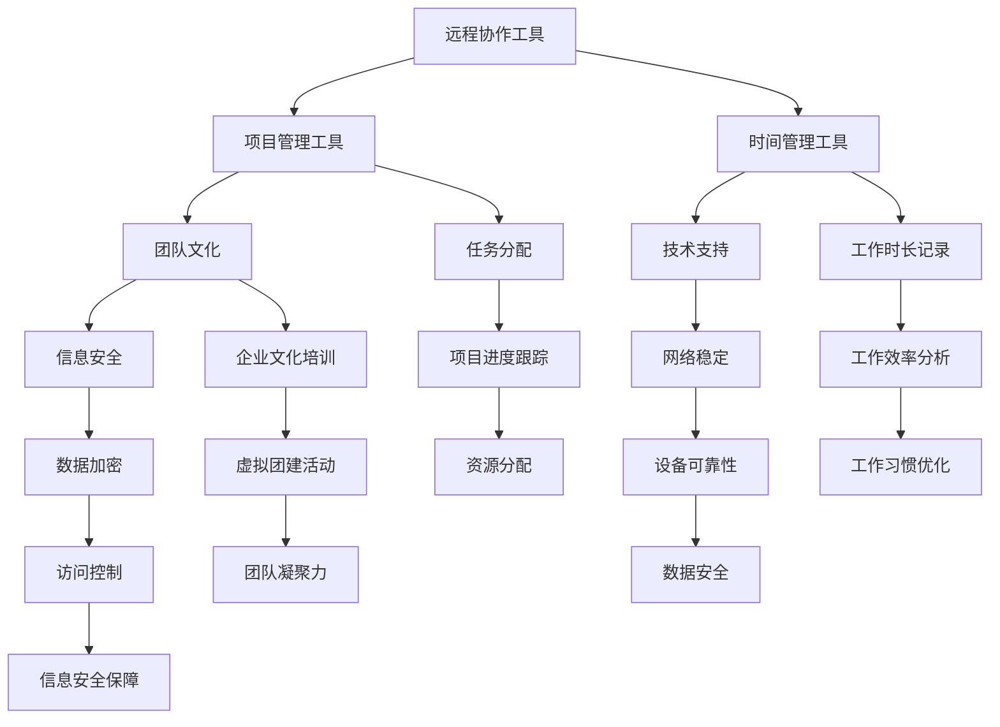

                 

### 1. 背景介绍

随着全球信息化进程的加速，远程工作已经成为现代职场的重要一环。无论是在疫情期间的应对措施，还是企业为了提高员工灵活性的选择，远程工作都逐渐成为常态。这种工作模式不仅提高了员工的工作效率，也降低了企业的运营成本，同时还能吸引更多优秀人才。然而，如何打造一个高效的远程工作环境，成为了企业和个人都面临的重要问题。

本文旨在深入探讨如何打造高效的远程工作环境，从以下几个方面展开：

1. **远程工作的现状与挑战**：分析当前远程工作的趋势、优势以及存在的问题。
2. **核心概念与联系**：阐述构建高效远程工作环境所需理解的关键概念，并提供相关架构的 Mermaid 流程图。
3. **核心算法原理 & 具体操作步骤**：介绍提升远程工作效率的核心算法和具体实施步骤。
4. **数学模型和公式 & 详细讲解 & 举例说明**：运用数学模型和公式，详细解释核心概念和算法的原理，并通过实例进行说明。
5. **项目实践：代码实例和详细解释说明**：通过实际项目实例，展示如何在实际环境中应用上述原理和步骤。
6. **实际应用场景**：分析不同行业和岗位如何利用远程工作提升效率。
7. **工具和资源推荐**：推荐学习和使用远程工作相关工具和资源。
8. **总结：未来发展趋势与挑战**：展望远程工作的发展趋势和面临的挑战。

通过以上内容的逐步分析，本文将帮助读者理解并掌握如何打造高效的远程工作环境。让我们一起开始这段探索之旅。

### 1.1 远程工作的历史与发展

远程工作并非一个新兴概念，其历史可以追溯到上世纪80年代。当时，随着互联网的兴起和计算机技术的进步，远程办公逐渐成为一种可行的工作模式。早期的远程工作多以电子邮件和即时通讯工具为主，例如美国的一些科技公司就开始鼓励员工在家办公。然而，由于技术限制和沟通不畅，这种工作模式并没有得到广泛推广。

进入21世纪，随着宽带互联网的普及、云计算和虚拟化技术的发展，远程工作逐渐迎来了新的机遇。特别是在2008年金融危机之后，企业为了降低成本、提高效率，开始更加重视远程工作。同时，社交媒体和协作工具的兴起，使得远程团队成员之间的沟通更加便捷和高效。

特别是在2020年新冠疫情爆发之后，远程工作迎来了前所未有的发展。由于疫情导致的全球封锁，许多企业不得不迅速转变工作模式，将员工从办公室转移到家中。这种紧急情况下的远程办公，不仅考验了企业的技术储备和应变能力，也推动了远程工作技术的快速进步。

从历史发展来看，远程工作经历了从技术萌芽、技术推动到社会广泛接受的演变。如今，远程工作已经成为现代职场不可或缺的一部分。越来越多的企业开始重视远程工作的推广和应用，不仅因为它能提高员工的工作效率和生活质量，还能帮助企业吸引和保留人才，降低运营成本。

### 1.2 远程工作的优势与挑战

远程工作模式在现代社会中逐渐普及，其主要原因在于它具备多方面的优势。首先，远程工作能够显著提高员工的工作效率。研究表明，远程工作可以减少通勤时间，从而提高员工的工作专注度和生产率。此外，员工在熟悉的环境中工作，能够更好地平衡工作与生活，从而减少工作压力，提高整体幸福感。

其次，远程工作对企业具有显著的成本优势。通过减少实体办公室的需求，企业可以节省租金、水电等运营成本，同时降低员工差旅费用。这种成本优势尤其在经济不稳定时期显得尤为重要，能够帮助企业更好地应对市场波动。

然而，远程工作也面临一系列挑战。首先是沟通难题。远程工作环境下，团队成员之间的面对面交流减少，沟通效率受到一定程度的影响。此外，文化的差异也可能导致协作中的误解和冲突。

其次是管理难题。传统的面对面管理模式在远程工作中难以直接应用，管理者需要寻找新的管理方法和工具来确保团队的高效运作。此外，员工的自我管理和时间管理能力也受到考验，一些员工可能会因缺乏外部监督而出现工作懈怠的情况。

最后是技术挑战。远程工作依赖于稳定的网络连接和先进的协作工具，这要求企业具备一定的技术储备和运维能力。技术故障或网络中断可能对工作进度产生严重影响。

总的来说，远程工作模式既具备显著的优势，也面临一定的挑战。企业需要在推广远程工作的同时，积极应对这些挑战，以实现远程工作的最大效益。

### 1.3 打造高效远程工作环境的重要性

在现代社会中，打造高效远程工作环境的重要性不容忽视。首先，对于企业而言，一个高效的工作环境不仅能够提升员工的工作效率，还能增强团队的合作能力，最终推动企业整体竞争力的提升。具体来说，高效远程工作环境能够帮助企业实现以下目标：

1. **提高员工生产力**：通过提供稳定的技术支持、科学的任务分配和合理的休息时间，员工能够在远程环境中保持较高的工作效率，减少因工作环境不适而导致的低效现象。

2. **促进团队协作**：借助先进的协作工具和平台，团队成员可以实时沟通、分享资源和协作完成任务，打破地域限制，实现高效的团队合作。

3. **降低运营成本**：通过减少实体办公场所的需求，企业可以节省大量的租金、水电和其他运营成本，提高资源利用效率，从而在竞争激烈的市场中保持成本优势。

4. **提升员工满意度**：一个良好的远程工作环境能够帮助员工更好地平衡工作与生活，提高工作满意度，从而增强员工的忠诚度和长期留存率。

对于员工个人来说，高效远程工作环境同样至关重要。首先，良好的工作环境能够提供技术支持，确保员工在工作中不受技术故障或网络中断的困扰，提高工作连续性和稳定性。其次，合理的任务分配和良好的团队协作关系，能够帮助员工在远程工作中获得更多的职业发展机会，提升个人技能和职业素养。最后，高效的远程工作环境能够帮助员工更好地管理时间和精力，实现工作与生活的平衡，提高整体生活质量。

综上所述，打造高效远程工作环境对于企业和员工都具有重要的意义。这不仅需要企业从战略层面重视远程工作环境的构建，还需要员工积极适应远程工作模式，共同创造一个高效、和谐的工作环境。

### 1.4 构建高效远程工作环境的核心概念与架构

构建一个高效远程工作环境，需要理解并掌握一系列核心概念和架构。这些核心概念和架构不仅为远程工作提供了理论基础，还指导了实际操作中的具体步骤。以下是构建高效远程工作环境所需理解的关键概念及其相互联系：

1. **远程协作工具**：远程协作工具是远程工作环境中不可或缺的一环。这些工具包括即时通讯软件、视频会议平台、项目管理工具等，能够帮助团队成员实时沟通、协同工作和共享资源。典型的远程协作工具如 Slack、Zoom 和 Trello。

2. **项目管理**：项目管理在远程工作中尤为重要。通过科学的项目管理方法，企业可以确保项目按时、按质、按量完成。项目管理工具如 Jira、Asana 和 Trello，可以帮助团队制定任务、跟踪进度、分配资源。

3. **时间管理**：远程工作环境中的时间管理更具挑战性。员工需要自我监督和管理，确保高效完成任务。时间管理工具如 Toggl 和 RescueTime，可以帮助员工记录工作时长、分析工作效率，从而优化工作习惯。

4. **团队文化**：团队文化在远程工作中同样关键。一个积极、开放的团队文化能够增强团队的凝聚力，促进团队成员之间的信任和协作。企业文化培训、定期团队互动和虚拟团建活动都是维系团队文化的重要手段。

5. **技术支持**：远程工作对技术支持的要求较高。企业需要确保网络稳定、设备可靠、数据安全。技术支持团队负责解决员工在远程工作中遇到的技术问题，确保工作环境的高效运行。

6. **信息安全**：远程工作增加了信息泄露的风险。企业需要采取一系列措施来保护敏感数据，如使用虚拟专用网络（VPN）、数据加密、访问控制等。

这些核心概念和架构之间的联系构成了一个完整的远程工作生态系统。远程协作工具和项目管理工具确保了团队的高效沟通和任务执行；时间管理工具和团队文化维系了员工的个人发展和团队氛围；技术支持和信息安全保障了远程工作的稳定性和安全性。

为了帮助读者更好地理解这些概念和架构，以下是构建高效远程工作环境的相关架构的 Mermaid 流程图：

通过上述流程图，我们可以清晰地看到各个核心概念和架构之间的联系，以及它们在构建高效远程工作环境中的作用。理解这些概念和架构，是企业成功打造高效远程工作环境的重要基础。

### 1.5 构建高效远程工作环境的常用技术与方法

构建一个高效远程工作环境，不仅需要理解核心概念和架构，还需要采用一系列具体的技术和方法。以下将介绍几种常用的技术与方法，这些方法在实际应用中能够显著提升远程工作的效率。

1. **远程桌面技术**：远程桌面技术是一种允许用户从远程地点访问并控制远程计算机的方法。通过这项技术，员工可以在家中或任何有网络连接的地方，访问公司的计算机系统和资源。常用的远程桌面软件包括 TeamViewer、AnyDesk 和 Microsoft Remote Desktop。这些工具提供了稳定的连接和强大的功能，如文件传输、远程打印和控制权限设置，极大地方便了远程办公。

2. **虚拟专用网络（VPN）**：VPN是一种加密的通信隧道，通过该隧道，员工可以从远程位置安全地访问公司内部网络资源。VPN技术可以保护数据传输过程中的隐私和完整性，防止数据被窃取或篡改。许多企业和组织使用VPN来确保员工远程访问公司资源时的信息安全。常用的VPN服务提供商包括 ExpressVPN、NordVPN 和 CyberGhost。

3. **云计算服务**：云计算技术为远程工作提供了强大的支持。通过云计算服务，企业可以将数据和应用程序托管在云端，员工可以随时随地通过互联网访问这些资源。云服务不仅提供了高效的计算和存储能力，还具备高可靠性和灵活性。常用的云计算平台包括 AWS、Azure 和 Google Cloud Platform。这些平台提供了丰富的工具和服务，如虚拟机、数据库、存储和数据分析，能够满足企业多样化的远程工作需求。

4. **协作工具**：高效的协作工具是远程工作环境的重要组成部分。即时通讯工具（如 Slack、WhatsApp、Telegram）能够实时沟通和协作；视频会议平台（如 Zoom、Microsoft Teams、Google Meet）支持远程会议和在线培训；项目管理工具（如 Jira、Trello、Asana）帮助团队跟踪任务进度和资源分配。这些协作工具不仅提高了沟通效率，还促进了团队协作和项目管理。

5. **自动化工具**：自动化工具可以帮助企业自动化日常的重复性任务，从而提高工作效率。例如，使用自动化脚本可以自动化测试、部署和监控应用程序；使用自动化流程管理工具（如 Workato、UiPath）可以简化业务流程，减少人为错误。自动化工具不仅节省了时间，还提高了工作的准确性和一致性。

6. **虚拟现实（VR）和增强现实（AR）**：虽然VR和AR在远程工作中的应用相对较少，但它们在某些特定的远程协作场景中表现出色。例如，通过VR会议系统，团队成员可以“身处”同一虚拟会议室，增强面对面交流的体验；AR技术可以帮助远程团队在建筑、工程等领域的协同工作，实现真实与虚拟的结合。

通过上述技术和方法的应用，企业能够显著提升远程工作的效率和质量。合理选择和部署这些工具，可以构建一个稳定、安全、高效的远程工作环境，满足现代企业的远程工作需求。

### 1.6 如何评估和优化远程工作环境的效率

在构建远程工作环境时，评估和优化效率是至关重要的一环。只有通过科学的评估和持续的优化，才能确保远程工作环境的高效运作。以下是一些关键步骤和方法，帮助企业和个人评估和优化远程工作环境的效率。

1. **量化指标设定**：首先，需要明确远程工作环境中的关键绩效指标（KPIs），例如任务完成率、项目按时交付率、员工满意度等。这些指标有助于衡量远程工作的效率和质量。企业可以根据实际情况设定具体的量化目标，例如每月完成的项目数、平均任务处理时间等。

2. **数据收集与分析**：通过数据分析工具，如项目管理软件、协作工具和自动化工具，收集远程工作过程中的数据。这些数据包括任务进度、沟通记录、工作效率等。分析这些数据，可以帮助企业发现工作中的瓶颈和问题，从而制定针对性的优化措施。

3. **员工反馈收集**：定期收集员工的反馈是评估远程工作环境的重要方法。通过问卷调查、访谈等方式，了解员工对工作环境的满意度和建议。这些反馈可以揭示员工在实际工作中遇到的困难、障碍和不满，有助于企业及时调整和改进。

4. **流程优化**：基于数据分析结果和员工反馈，企业可以识别并优化现有的工作流程。例如，简化不必要的审批流程、引入自动化工具以减少重复性工作、改进任务分配和沟通机制等。这些优化措施可以提高工作效率，减少不必要的等待和延迟。

5. **技术升级与培训**：技术是远程工作环境高效运作的重要支撑。定期检查和升级远程工作所需的硬件和软件，确保其性能稳定和安全。同时，提供员工必要的技术培训和指导，帮助他们熟练使用各种远程协作工具和系统，提高工作效率。

6. **定期评估与反馈**：远程工作环境的优化是一个持续的过程。企业需要定期评估工作环境的有效性，并根据评估结果进行调整和改进。通过建立反馈机制，确保员工和管理层之间的沟通畅通，及时解决工作中出现的问题。

通过以上步骤和方法，企业可以系统地评估和优化远程工作环境的效率，从而打造一个高效、稳定、和谐的远程工作环境。这不仅有助于提高员工的满意度和工作效率，还能推动企业的持续发展。

### 1.7 企业在构建远程工作环境时可能遇到的问题及解决方案

在构建远程工作环境的过程中，企业可能会遇到多种问题和挑战。以下是一些常见问题及其可能的解决方案：

1. **技术难题**：远程工作高度依赖于网络和技术支持。技术故障、网络不稳定、设备故障等问题都可能影响工作效率。解决方案包括：部署稳定的高性能网络、使用可靠的远程桌面和VPN服务、定期更新和维护设备，以及建立专业的技术支持团队，提供及时的技术支持和故障排除。

2. **沟通障碍**：远程工作环境中，团队成员之间的沟通不如面对面直接。这可能导致信息传递不准确、延误和误解。解决方案包括：采用先进的协作工具和平台，如视频会议、即时通讯和项目管理工具，确保实时、高效的沟通。此外，定期举行虚拟会议和团队互动，增进团队成员之间的了解和信任。

3. **时间管理问题**：远程工作环境下，员工容易受到家庭、生活等外界因素的干扰，导致时间管理困难。解决方案包括：使用时间管理工具，如Toggl和RescueTime，帮助员工记录工作时长、分析工作效率。同时，建立明确的任务分配和进度跟踪机制，确保每个任务都有明确的负责人和截止日期。

4. **团队凝聚力下降**：远程工作可能导致团队成员之间的互动减少，影响团队凝聚力和协作效率。解决方案包括：定期组织虚拟团建活动，如在线游戏、讨论会和主题分享，增强团队成员之间的交流和互动。此外，可以采用团队建设培训，提高团队成员的协作意识和团队精神。

5. **信息安全风险**：远程工作增加了信息泄露的风险，特别是在使用公共网络和共享设备时。解决方案包括：加强信息安全意识教育，确保员工了解安全风险和防护措施。使用虚拟专用网络（VPN）加密数据传输，采取数据加密、访问控制和日志审计等措施，确保数据安全和隐私保护。

通过识别并解决这些问题，企业可以更好地构建和管理远程工作环境，确保其高效、稳定和安全运作。

### 1.8 个人在构建远程工作环境时可能遇到的问题及解决方案

个人在构建远程工作环境时，可能会遇到一系列的问题，这些问题不仅影响到个人的工作效率，还可能对心理健康产生负面影响。以下是一些常见问题及其可能的解决方案：

1. **工作与生活的平衡**：远程工作环境中，工作与生活界限模糊，容易导致工作时间延长和工作压力增大。解决方案包括：设定固定的办公时间和休息时间，保持工作与生活的平衡。使用时间管理工具，如Toggl和Focus@Will，帮助集中精力工作，提高效率。

2. **缺乏面对面交流**：远程工作减少了对面的交流，可能影响团队合作和人际关系。解决方案包括：利用视频会议和协作工具，如Zoom和Slack，定期与团队成员进行交流。积极参与虚拟团建活动和线上社交活动，增强与同事之间的互动。

3. **工作动力不足**：缺乏外部监督和竞争压力可能导致工作动力下降。解决方案包括：设定明确的工作目标和里程碑，定期评估进度和成绩。与同事建立互助机制，相互鼓励和监督，提高工作积极性。

4. **技术设备不足或故障**：网络不稳定、设备故障等问题会影响工作进度和质量。解决方案包括：确保拥有足够的硬件设备，如高性能计算机、稳定的网络连接和良好的耳机麦克风。定期备份重要文件和数据，减少因设备故障导致的数据丢失。

5. **心理健康问题**：长时间的远程工作和缺乏社交互动可能导致孤独感和焦虑。解决方案包括：定期锻炼，如在家中做瑜伽或跑步，保持身体健康。培养兴趣爱好，如阅读、绘画或音乐，丰富业余生活。必要时寻求专业心理咨询，缓解心理压力。

通过以上方法，个人可以有效地应对远程工作环境中遇到的问题，提高工作效率和生活质量。

### 1.9 构建高效远程工作环境的最佳实践和成功案例

在全球范围内，许多企业和团队通过实践和优化，成功构建了高效远程工作环境。以下是一些最佳实践和成功案例，供读者参考。

1. **Buffer**：Buffer是一家全球远程工作公司，其成功的关键在于透明沟通和明确的团队目标。Buffer采用了周报制度，员工每周需要提交工作进展和遇到的问题，确保团队成员之间的信息畅通。此外，公司还定期举办虚拟团建活动，如线上游戏、虚拟旅行和主题分享会，增强团队凝聚力。

2. **Atlassian**：Atlassian是一家提供项目管理和协作工具的软件公司，其自身也是远程工作的典范。Atlassian采用了分散的团队结构，团队成员分布在不同的时区。公司鼓励员工自主安排工作时间和地点，并通过高效的沟通和协作工具，如Jira和Confluence，确保项目进度和质量。

3. **LinkedIn**：LinkedIn在全球范围内拥有大量的远程工作者。公司建立了完善的技术支持体系，为员工提供稳定的网络连接和高效的协作工具。LinkedIn还注重员工的职业发展，提供在线培训和职业规划指导，帮助员工在远程工作中不断提升自身能力。

4. **GitHub**：GitHub是一家开源软件托管平台，其团队分布在全球各地。公司通过开源文化和共享精神，鼓励员工积极参与社区贡献。GitHub还采用了弹性工作时间制度，员工可以根据自身需求灵活安排工作时间，提高了工作效率和员工满意度。

通过以上案例，我们可以看到，构建高效远程工作环境需要从多个方面进行综合优化，包括沟通机制、工作文化、技术支持等。这些最佳实践和成功经验为企业和团队提供了有益的借鉴。

### 1.10 未来远程工作环境的趋势与发展方向

随着科技的不断进步，远程工作环境也在不断演变，未来将呈现出以下几大趋势和发展方向：

1. **智能化和自动化**：未来远程工作环境将更加智能化和自动化。人工智能和机器学习技术将被广泛应用于任务分配、日程管理、错误检测和预测等方面，从而提高工作效率和减少人为错误。自动化工具和机器人将承担更多重复性和繁琐的工作，员工可以专注于更有创造性和战略性的任务。

2. **虚拟现实（VR）和增强现实（AR）**：随着VR和AR技术的成熟，远程工作环境中的虚拟会议、虚拟办公室和远程协作体验将更加逼真和沉浸式。通过VR和AR，团队成员可以“置身”于同一虚拟空间，增强面对面交流的体验，缩短地理距离带来的影响。

3. **区块链技术**：区块链技术具有去中心化、安全性和透明性等特点，未来将在远程工作中发挥重要作用。例如，利用区块链技术进行身份验证、数据存储和版权保护，确保远程工作环境中的信息安全和个人隐私。

4. **绿色办公**：随着环保意识的提高，未来远程工作环境将更加注重可持续发展。企业可能会采用更多的远程办公方式，减少实体办公室的需求，从而降低碳足迹。此外，虚拟会议和线上协作将减少旅行和交通，进一步降低环境负担。

5. **个性化办公**：未来远程工作环境将更加个性化，以适应不同员工的需求和工作习惯。企业将提供更多灵活的工作安排、工具选择和个人发展机会，帮助员工在远程工作中实现自我管理和职业发展。

通过以上趋势和发展方向，我们可以看到，未来远程工作环境将更加高效、灵活和可持续。企业和员工需要积极适应这些变化，以迎接远程工作带来的新机遇和挑战。

### 附录：常见问题与解答

在构建和优化远程工作环境的过程中，企业和个人可能会遇到一些常见的问题。以下是对这些问题的解答，以帮助读者更好地应对挑战。

**Q1：如何确保远程工作中的数据安全？**
A1：确保数据安全是远程工作的关键。企业可以采取以下措施：
- 使用虚拟专用网络（VPN）加密数据传输，防止数据在传输过程中被截获。
- 实施严格的访问控制策略，确保只有授权人员能够访问敏感数据。
- 定期备份重要数据，并确保备份数据的安全性。
- 对员工进行信息安全培训，提高他们的安全意识和应对能力。

**Q2：如何提高远程团队的协作效率？**
A2：提高远程团队的协作效率需要从多个方面入手：
- 选择合适的协作工具，如Slack、Zoom和Trello，确保团队成员能够高效沟通和协同工作。
- 设立明确的目标和任务分配，确保每个成员都清楚自己的职责和任务进度。
- 定期召开虚拟会议，跟踪项目进度，解决协作中的问题。
- 建立团队文化和信任，鼓励团队成员之间的开放沟通和协作。

**Q3：如何平衡远程工作与个人生活？**
A3：平衡远程工作与个人生活是确保工作质量和个人幸福的关键。可以采取以下措施：
- 设定固定的工作时间和休息时间，确保有充足的休息和娱乐时间。
- 使用时间管理工具，如Toggl和RescueTime，帮助跟踪工作时长，提高工作效率。
- 保持健康的生活方式，定期锻炼，保持良好的饮食习惯。
- 与家人和朋友保持沟通，分享工作和生活，寻求支持和理解。

通过上述解答，企业和个人可以更好地应对远程工作中的常见问题，提高工作效率和生活质量。

### 扩展阅读 & 参考资料

构建高效远程工作环境是一个多维度、系统性的工程，涉及多个学科和领域的知识。以下是一些扩展阅读和参考资料，帮助读者进一步深入了解远程工作环境的构建和优化。

1. **书籍**：
   - 《远程工作革命：如何管理远程团队，创造高效工作环境》（Remote：How Great Leaders Set Their Companies Free to Win），作者：Jason Fried 和 David Heinemeier Hansson。
   - 《智能工作：远程办公、协同合作与未来的办公文化》（Smart Work：How Virtual Teams and Remote Workers Are Changing the Way We Do Business），作者：John Hagel III、John Seely Brown 和 Lang Davison。

2. **学术论文**：
   - "The Emergence of Remote Work: Causes and Consequences"，作者：John P. Campbell、Ian Lawrence 和 James W. Barro。
   - "The Impact of Remote Work on Work-Life Balance and Employee Well-being"，作者：Arun Kumar 和 Priya Chetty。
   - "The Use of Technology in Remote Work：A Review"，作者：Maja M. Matijasevic 和 Dragana R. Jokic。

3. **在线资源**：
   - Buffer's "The Ultimate Guide to Remote Work"：https://buffer.com/resources/remote-work/
   - Atlassian's "Remote Work Tools and Strategies"：https://www.atlassian.com/remote
   - LinkedIn's "Remote Work Insights"：https://www.linkedin.com/pulse/remote-work-insights-2022

4. **博客和网站**：
   - "Lifehacker's Guide to Remote Work"：https://lifehacker.com/
   - "远程工作：趋势与未来"：https://remote.co/

通过阅读上述书籍、学术论文和在线资源，读者可以更全面地了解远程工作环境的构建、优化和管理，从而为实际工作提供有力的理论支持和实践指导。

