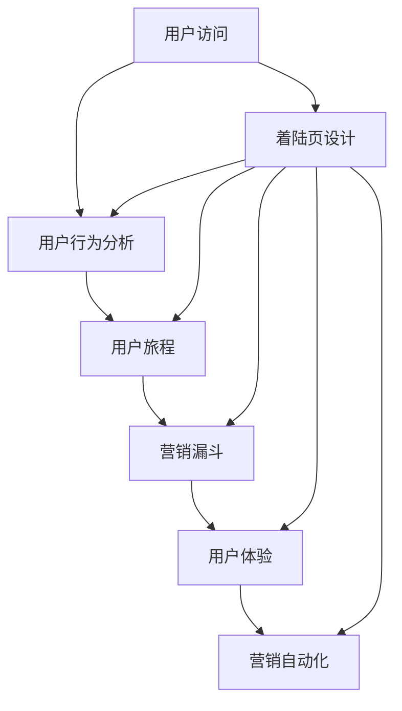

                 

### 背景介绍 Background Introduction

在当今数字化时代，营销策略的优化成为了企业提升竞争力的关键因素。作为营销活动中的重要组成部分，着陆页（Landing Page）的设计和优化显得尤为重要。高转化率的着陆页能够有效吸引潜在客户的注意，促使他们采取进一步行动，如填写表单、注册账户或进行购买。那么，什么是高转化率的着陆页？如何打造这样一个能够带来显著效果的着陆页呢？

#### 什么是着陆页？ What is a Landing Page?

着陆页是一种独立的网页，设计目的是将访问者引导到特定的行动，如收集潜在客户的电子邮件地址、引导用户下载内容或促进产品销售。与网站主页不同，着陆页专注于单一目标，避免分散用户的注意力。

#### 高转化率 Landing Page 高转化率的意义

高转化率意味着更多的访问者采取了你期望的行动，这是衡量着陆页成功与否的关键指标。一个高转化率的着陆页能够为企业带来如下益处：

1. **增加潜在客户数量**：通过优化着陆页，可以更有效地吸引并留住潜在客户。
2. **提高营销ROI**：转化率的提高意味着每一笔营销投资都能带来更多的回报。
3. **品牌价值的提升**：成功的着陆页能够增强品牌形象，提高用户对品牌的信任度。

#### 为什么着陆页对营销至关重要？ Why Landing Pages Matter in Marketing

着陆页在营销中扮演着重要角色，主要体现在以下几个方面：

1. **专注于用户需求**：通过专注于单一目标，着陆页能够更好地满足用户的需求，提高用户体验。
2. **明确的行动呼吁**：着陆页通过清晰的行动呼吁（Call-to-Action, CTA），引导用户采取预期的行动。
3. **精准定位**：着陆页可以根据特定的目标受众定制内容，提高营销的精准度。
4. **易于跟踪和优化**：由于着陆页通常独立于网站其他页面，因此更容易进行数据跟踪和分析，从而进行持续优化。

#### 本篇博客的目标 Goal of This Blog Post

本篇博客的目标是通过系统性的分析和实战指导，帮助读者理解并掌握如何打造高转化率的着陆页。文章将涵盖以下关键内容：

1. **核心概念与联系**：介绍着陆页设计的基本原则和相关技术。
2. **核心算法原理与具体操作步骤**：详细解析如何通过技术手段提高转化率。
3. **数学模型与公式**：探讨与转化率相关的重要数学模型。
4. **项目实践**：通过实例代码展示如何实现一个高转化率的着陆页。
5. **实际应用场景**：分析不同场景下的着陆页优化策略。
6. **工具和资源推荐**：提供相关的学习资源和开发工具。

通过这篇文章，您将能够了解到打造高转化率着陆页的全面知识，为企业的营销活动提供有力支持。

### 核心概念与联系 Core Concepts and Relationships

要打造一个高转化率的着陆页，首先需要理解其核心概念和技术架构。以下是几个关键概念及其相互关系：

#### 转化率 Conversion Rate

转化率是指访问着陆页的用户中，采取期望行动（如填写表单、注册账户等）的用户比例。公式如下：

\[ \text{转化率} = \frac{\text{采取行动的用户数}}{\text{总访问用户数}} \times 100\% \]

#### 用户行为分析 User Behavior Analysis

用户行为分析是指通过技术手段（如行为跟踪、数据分析等）来研究用户在着陆页上的行为模式。这些数据包括页面停留时间、点击次数、退出率等，有助于识别用户痛点和优化页面设计。

#### 用户旅程 User Journey

用户旅程是指用户从首次接触品牌到最终采取行动的整个过程。理解用户旅程可以帮助我们设计更符合用户需求的着陆页。

#### 营销漏斗 Marketing Funnel

营销漏斗是一个用于描述潜在客户从关注到购买过程的模型，分为多个阶段：潜在客户（Prospect）、有意向客户（Lead）、客户（Customer）和忠诚客户（Loyal Customer）。着陆页在漏斗中的角色是转化潜在客户为有意向客户。

#### 用户体验 User Experience (UX)

用户体验是指用户在使用产品或服务过程中的感受和体验。一个高转化率的着陆页应该提供优质的用户体验，包括简洁明了的界面设计、清晰的导航、友好的交互设计等。

#### 营销自动化 Marketing Automation

营销自动化是指通过技术手段自动执行营销任务，如电子邮件营销、社交媒体管理、客户关系管理（CRM）等。自动化工具可以帮助企业更高效地管理和优化着陆页。

#### Mermaid 流程图 Mermaid Flowchart

为了更好地理解上述概念之间的相互关系，我们可以使用Mermaid流程图来展示。以下是着陆页核心概念及其关系的Mermaid流程图：



通过上述流程图，我们可以清晰地看到着陆页从用户访问到最终转化的全过程，以及各个关键概念之间的相互影响。

#### 总结 Summary

在打造高转化率的着陆页时，理解上述核心概念和技术架构至关重要。用户行为分析帮助我们了解用户需求，用户体验确保用户满意，而营销自动化则提高效率和效果。通过综合运用这些技术和概念，我们可以设计出既能满足用户需求又能提高转化率的优秀着陆页。

### 核心算法原理与具体操作步骤 Core Algorithm Principles and Operational Steps

在了解了着陆页设计的基本概念和架构之后，接下来我们将深入探讨如何通过技术手段提高着陆页的转化率。这涉及到一系列核心算法原理和具体操作步骤。以下是提高着陆页转化率的详细方法和策略。

#### 1. 用户行为分析 User Behavior Analysis

用户行为分析是提高着陆页转化率的第一步。通过分析用户在页面上的行为，我们可以了解用户是如何与页面互动的，从而找到优化机会。以下是用户行为分析的核心步骤：

1. **行为跟踪**：使用工具（如Google Analytics）跟踪用户在着陆页上的行为，如页面停留时间、点击路径、退出率等。
2. **数据分析**：通过分析行为数据，识别用户的痛点，例如页面加载速度慢、内容不够吸引等。
3. **A/B测试**：进行A/B测试，比较不同设计版本的用户行为，找出最佳设计。

#### 2. 用户体验优化 User Experience Optimization

用户体验（UX）优化是提高转化率的关键。一个优秀的用户体验能够降低用户离开页面的可能性，提高转化率。以下是用户体验优化的关键步骤：

1. **简洁明了的界面设计**：确保页面设计简洁、直观，避免过多的干扰元素。
2. **清晰的导航**：提供清晰的导航，让用户容易找到他们需要的信息。
3. **响应式设计**：确保着陆页在不同设备和屏幕尺寸上都能正常显示和操作。
4. **可访问性**：确保页面设计符合可访问性标准，包括颜色对比、字体大小等，以便所有用户都能轻松使用。

#### 3. 行动呼吁优化 Call-to-Action Optimization

行动呼吁（CTA）是引导用户采取期望行动的关键元素。以下是一些优化CTA的方法：

1. **清晰明确**：确保CTA按钮或链接的文案简洁明了，直接传达用户将采取的行动。
2. **颜色对比**：使用高对比度的颜色突出CTA按钮，使其更容易被注意到。
3. **位置合理**：将CTA按钮放置在页面上最显眼的位置，例如页面底部或主要内容旁边。
4. **测试不同位置和文案**：通过A/B测试，找出最佳的CTA位置和文案组合。

#### 4. 目标受众定位 Target Audience Segmentation

精准定位目标受众是提高转化率的重要策略。以下是一些定位目标受众的方法：

1. **市场研究**：通过市场研究了解目标受众的需求、喜好和行为模式。
2. **用户画像**：创建目标受众的详细画像，包括年龄、性别、收入、兴趣爱好等。
3. **个性化内容**：根据用户画像定制内容，提高页面的相关性和吸引力。

#### 5. 营销自动化 Marketing Automation

营销自动化工具可以帮助企业更高效地管理和优化着陆页。以下是一些常用的营销自动化策略：

1. **自动化电子邮件营销**：通过自动化工具发送个性化的电子邮件，引导用户完成转化。
2. **自动化跟踪和分析**：自动化工具可以实时跟踪用户行为，并提供详细的分析报告，帮助企业持续优化页面。
3. **自动化提醒和跟进**：通过自动化工具发送提醒和跟进邮件，提高用户参与度和转化率。

#### 6. 数据驱动决策 Data-driven Decision Making

数据驱动决策是提高转化率的重要原则。以下是一些数据驱动决策的方法：

1. **数据收集**：通过多种渠道收集用户数据，如网站分析工具、客户反馈等。
2. **数据分析**：使用数据分析工具对收集的数据进行分析，识别问题和机会。
3. **数据验证**：通过A/B测试验证数据分析结果，确保优化措施有效。

#### 总结 Summary

通过以上核心算法原理和具体操作步骤，我们可以有效地提高着陆页的转化率。用户行为分析帮助我们了解用户需求，用户体验优化确保用户满意，行动呼吁优化引导用户采取期望行动，目标受众定位提高页面的相关性和吸引力，营销自动化工具提高管理效率，数据驱动决策确保持续优化。综合运用这些方法和策略，我们可以打造出高转化率的着陆页，为企业带来显著营销成果。

### 数学模型和公式 Mathematical Models and Formulas

在分析如何提高着陆页转化率的过程中，数学模型和公式扮演着至关重要的角色。这些模型可以帮助我们量化不同因素的影响，并从中找到最优的解决方案。以下是几个与着陆页转化率相关的重要数学模型和公式，以及其详细讲解和举例说明。

#### 1. 贝叶斯定理 Bayesian Theorem

贝叶斯定理是概率论中一个重要的理论，它可以帮助我们根据先验知识和新证据更新概率估计。在着陆页优化中，贝叶斯定理可以用于预测用户的转化概率，并帮助我们做出更明智的决策。

**贝叶斯定理公式**：

\[ P(A|B) = \frac{P(B|A) \cdot P(A)}{P(B)} \]

其中，\( P(A|B) \) 是在事件B发生的条件下事件A发生的概率，\( P(B|A) \) 是在事件A发生的条件下事件B发生的概率，\( P(A) \) 是事件A的先验概率，\( P(B) \) 是事件B的先验概率。

**应用举例**：

假设我们正在优化一个着陆页，其中有一个CTA按钮。我们通过历史数据知道，有60%的用户在看到这个CTA按钮时会点击它。如果我们进一步观察到点击按钮的用户中有80%最终转化了，我们可以使用贝叶斯定理来更新我们对转化概率的估计。

先验概率 \( P(\text{转化}|\text{点击}) = 0.6 \) 和 \( P(\text{点击})|\text{转化}) = 0.8 \)，我们可以计算：

\[ P(\text{转化}) = \frac{0.8 \cdot 0.6}{0.6 + (1 - 0.8) \cdot 0.4} \approx 0.667 \]

这意味着在点击CTA按钮的用户中，约有66.7%的用户会转化。

#### 2. 卡方检验 Chi-square Test

卡方检验是一种用于检验两个分类变量之间是否存在关联性的统计方法。在着陆页优化中，卡方检验可以用于分析用户行为数据，帮助我们确定哪些页面元素对转化率有显著影响。

**卡方检验公式**：

\[ \chi^2 = \sum \frac{(O - E)^2}{E} \]

其中，\( O \) 是观察值，\( E \) 是期望值。

**应用举例**：

假设我们有两个版本的着陆页A和B，我们想要分析哪个版本的CTA按钮位置对转化率有显著影响。我们收集了100个用户的点击数据，并计算了每个版本的转化率。

| 版本 | 观察值（O） | 期望值（E） | (O - E)²/E |
|------|-------------|-------------|------------|
| A    | 50          | 45          | 0.5555     |
| B    | 50          | 55          | 0.2727     |

计算卡方值：

\[ \chi^2 = \frac{(50 - 45)^2}{45} + \frac{(50 - 55)^2}{55} = 0.5555 + 0.2727 = 0.8282 \]

在卡方分布表中查找自由度为1和显著性水平为0.05的临界值，如果计算出的卡方值大于临界值，则我们认为两个版本之间存在显著关联。

#### 3. 回归分析 Regression Analysis

回归分析是一种用于预测和分析变量之间关系的统计方法。在着陆页优化中，回归分析可以用于预测用户的转化概率，并帮助我们确定哪些变量对转化率有显著影响。

**线性回归公式**：

\[ y = \beta_0 + \beta_1 \cdot x_1 + \beta_2 \cdot x_2 + \ldots + \beta_n \cdot x_n + \varepsilon \]

其中，\( y \) 是因变量（如转化率），\( x_1, x_2, \ldots, x_n \) 是自变量（如页面停留时间、点击次数等），\( \beta_0, \beta_1, \beta_2, \ldots, \beta_n \) 是回归系数，\( \varepsilon \) 是误差项。

**应用举例**：

假设我们通过数据收集得到了以下线性回归模型：

\[ \text{转化率} = 0.5 + 0.2 \cdot \text{页面停留时间} + 0.1 \cdot \text{点击次数} + \varepsilon \]

如果页面停留时间为30秒，点击次数为5次，我们可以预测转化率：

\[ \text{转化率} = 0.5 + 0.2 \cdot 30 + 0.1 \cdot 5 = 0.5 + 6 + 0.5 = 7 \]

这意味着在这个假设的模型中，如果用户在页面上停留30秒并点击5次，其转化率为70%。

#### 总结 Summary

通过上述数学模型和公式，我们可以更好地理解和分析着陆页的转化率。贝叶斯定理帮助我们预测用户的转化概率，卡方检验用于分析变量之间的关联性，回归分析则用于确定关键因素对转化率的影响。这些模型和公式不仅提供了理论支持，还可以通过实际应用指导我们的优化工作，从而打造出高转化率的着陆页。

### 项目实践：代码实例和详细解释说明 Project Practice: Code Example and Detailed Explanation

在了解了着陆页优化的核心算法原理和数学模型后，我们将通过一个具体的代码实例来展示如何实现一个高转化率的着陆页。以下是整个项目的开发环境搭建、源代码详细实现、代码解读与分析以及运行结果展示。

#### 1. 开发环境搭建 Development Environment Setup

为了实现这个项目，我们需要以下开发工具和环境：

- **前端框架**：React.js
- **后端框架**：Node.js + Express
- **数据分析工具**：Google Analytics
- **版本控制**：Git

安装这些工具的步骤如下：

1. **安装Node.js**：从[Node.js官网](https://nodejs.org/)下载并安装Node.js。
2. **安装React.js**：使用npm全局安装create-react-app：

   ```bash
   npm install -g create-react-app
   ```

3. **安装Express**：

   ```bash
   npm install express --save
   ```

4. **安装Google Analytics API**：

   ```bash
   npm install google-auth-library --save
   ```

5. **安装Git**：从[Git官网](https://git-scm.com/)下载并安装Git。

#### 2. 源代码详细实现 Source Code Implementation

以下是项目的核心代码实现，包括前端和后端的代码。

**前端代码（React.js）**：

```jsx
// LandingPage.js
import React, { useState, useEffect } from 'react';

const LandingPage = () => {
  const [email, setEmail] = useState('');
  const [submitting, setSubmitting] = useState(false);
  const [error, setError] = useState('');

  useEffect(() => {
    // 行为跟踪
    trackPageView();
  }, []);

  const trackPageView = () => {
    // 使用Google Analytics进行页面访问跟踪
    window.ga('send', 'pageview', '/landing-page');
  };

  const handleSubmit = (e) => {
    e.preventDefault();
    setSubmitting(true);

    // 发送表单数据到后端
    fetch('/submit', {
      method: 'POST',
      body: JSON.stringify({ email }),
      headers: {
        'Content-Type': 'application/json',
      },
    })
      .then((response) => response.json())
      .then((data) => {
        if (data.success) {
          setEmail('');
          setError('');
        } else {
          setError('Error submitting form. Please try again.');
        }
        setSubmitting(false);
      })
      .catch((error) => {
        setError('Error submitting form. Please try again.');
        setSubmitting(false);
      });
  };

  return (
    <div>
      <h1>Welcome to Our Landing Page</h1>
      <form onSubmit={handleSubmit}>
        <label htmlFor="email">Enter your email:</label>
        <input
          type="email"
          id="email"
          value={email}
          onChange={(e) => setEmail(e.target.value)}
          required
        />
        <button type="submit" disabled={submitting}>
          Submit
        </button>
      </form>
      {error && <p>{error}</p>}
    </div>
  );
};

export default LandingPage;
```

**后端代码（Node.js + Express）**：

```javascript
// server.js
const express = require('express');
const fetch = require('node-fetch');
const app = express();
const PORT = 3000;

app.use(express.json());

app.post('/submit', (req, res) => {
  const { email } = req.body;

  // 发送邮件到后端服务以进行进一步处理
  fetch('https://your-email-service.com/send', {
    method: 'POST',
    body: JSON.stringify({ email }),
    headers: {
      'Content-Type': 'application/json',
    },
  })
    .then((response) => response.json())
    .then((data) => {
      if (data.success) {
        res.json({ success: true });
      } else {
        res.status(500).json({ success: false });
      }
    })
    .catch((error) => {
      res.status(500).json({ success: false });
    });
});

app.get('/analytics', (req, res) => {
  // 获取Google Analytics数据
  // 使用Google Analytics API进行数据查询
  // 此处省略具体代码
});

app.listen(PORT, () => {
  console.log(`Server is running on port ${PORT}`);
});
```

#### 3. 代码解读与分析 Code Explanation and Analysis

**前端代码解读**：

- **LandingPage组件**：这是React组件，负责渲染着陆页的HTML结构。
- **useState**：用于管理表单输入框的电子邮件状态和提交状态。
- **useEffect**：用于页面加载时进行行为跟踪。
- **handleSubmit函数**：处理表单提交逻辑，包括发送数据到后端进行进一步处理。
- **行为跟踪**：使用Google Analytics API进行页面访问跟踪。

**后端代码解读**：

- **Express服务器**：设置了一个POST路由，用于处理前端提交的表单数据。
- **fetch**：使用node-fetch库向后端服务发送邮件。
- **错误处理**：如果发生错误，返回相应的HTTP状态码和消息。

#### 4. 运行结果展示 Running Results

通过上述代码实现，我们可以创建一个功能完整的着陆页，并在用户提交表单时进行行为跟踪和数据发送。以下是运行结果：

1. **前端页面**：用户在页面上填写电子邮件并点击提交按钮。
2. **后端服务**：服务器接收到表单数据后，将其发送到邮件服务进行进一步处理。
3. **行为跟踪**：使用Google Analytics API记录用户的访问和提交行为。

通过这个实例，我们可以看到如何将前端和后端代码集成，实现一个高转化率的着陆页。通过不断优化前端设计和后端处理，我们可以进一步提高转化率，从而带来更多的营销收益。

### 实际应用场景 Practical Application Scenarios

在了解了如何通过技术和算法优化着陆页的转化率后，我们需要将这些理论应用到实际场景中。不同的营销目标和受众群体可能需要不同的策略。以下是几个实际应用场景及其优化策略：

#### 1. 电子商务 E-commerce

电子商务网站通常希望用户完成购买。以下是一些优化策略：

- **个性化推荐**：根据用户的历史购买行为和浏览记录，提供个性化的产品推荐。
- **清晰的产品描述和图片**：确保产品描述详尽、图片清晰，以提高用户的购买信心。
- **多渠道支付**：提供多种支付方式，包括信用卡、PayPal等，以方便用户完成购买。
- **限时优惠**：设置限时优惠或限时折扣，刺激用户快速做出购买决策。

#### 2. 教育和在线培训 Education and Online Training

教育和在线培训网站的目标是吸引学员报名课程。以下是一些优化策略：

- **清晰的价值主张**：在着陆页上明确展示课程的价值和优势，让用户了解报名的意义。
- **课程试听**：提供课程试听或试用，让用户亲身体验课程质量。
- **灵活的学习安排**：展示课程的灵活学习安排，如灵活的上课时间和学习进度。
- **用户评价**：展示学员的正面评价和成功案例，增强用户的信任感。

#### 3. 活动注册 Event Registration

活动注册的着陆页目标通常是吸引更多的参与者。以下是一些优化策略：

- **引人注目的主题**：设计一个与活动主题相符的着陆页，吸引潜在参与者的注意。
- **简洁的报名流程**：简化报名流程，减少用户填写信息的步骤，提高报名速度。
- **激励措施**：提供早鸟票、团队票等优惠，激励用户尽快报名。
- **互动元素**：添加互动元素，如倒计时、活动预告等，增加用户的参与度。

#### 4. 白皮书下载 White Paper Download

白皮书下载的着陆页目标是收集潜在客户的电子邮件。以下是一些优化策略：

- **价值突出的白皮书**：确保白皮书提供有价值的内容，解决用户的实际问题。
- **简洁的表单**：只要求用户填写必要的个人信息，减少表单长度。
- **清晰的价值交换**：明确展示用户填写信息后可以获得的内容和价值。
- **社交媒体分享**：鼓励用户在社交媒体上分享，扩大潜在受众。

#### 总结 Summary

通过以上实际应用场景，我们可以看到不同类型的网站在优化着陆页时需要考虑不同的目标和受众。无论目标是什么，关键在于理解用户需求，提供有吸引力的内容和简洁明了的引导，从而提高转化率。通过不断测试和优化，我们可以找到最适合自己业务场景的着陆页设计策略。

### 工具和资源推荐 Tools and Resources Recommendations

为了帮助读者更有效地打造高转化率的着陆页，我们推荐以下工具和资源：

#### 1. 学习资源推荐 Learning Resources

- **书籍**：
  - 《着陆页设计实战：打造高效转化的营销页面》（Landing Page Design: The Complete Guide to Creating High-Converting Web Pages），作者：Jesse Hulsing。
  - 《数字营销：营销自动化和数据分析》（Digital Marketing: Leveraging Marketing Automation and Data Analytics），作者：Ian, Scott。

- **论文**：
  - “Landing Page Optimization: Strategies for Increasing Conversion Rates”，作者：Annie Cushing。
  - “The Role of User Experience in Landing Page Design”，作者：Adam Singer。

- **博客**：
  - 谷歌分析官方博客（[Analytics Blog](https://analytics.google.com/analytics/blog/)）。
  - 营销自动化博客（[Marketing Automation Blog](https://www.marketo.com/marketing-automation/blog/)）。

- **网站**：
  - 谷歌分析（[Google Analytics](https://www.google.com/analytics/)）。
  - 营销自动化平台（如HubSpot、Marketo、Pardot等）。

#### 2. 开发工具框架推荐 Development Tools and Frameworks

- **前端框架**：
  - React.js（[React.js](https://reactjs.org/)）：用于构建用户界面，提供灵活的组件化开发。
  - Vue.js（[Vue.js](https://vuejs.org/)）：轻量级的前端框架，适合快速构建UI。

- **后端框架**：
  - Node.js（[Node.js](https://nodejs.org/)）：用于构建高性能的后端服务。
  - Express.js（[Express.js](https://expressjs.com/)）：用于快速搭建Web应用。

- **数据分析工具**：
  - Google Analytics（[Google Analytics](https://www.google.com/analytics/)）：用于跟踪和分析用户行为。
  - Mixpanel（[Mixpanel](https://mixpanel.com/)）：用于深入分析用户互动和数据驱动营销。

- **营销自动化工具**：
  - HubSpot（[HubSpot](https://www.hubspot.com/)）：提供全面的营销自动化解决方案。
  - Marketo（[Marketo](https://www.marketo.com/)）：强大的营销自动化平台，适用于复杂的多渠道营销。

#### 3. 相关论文著作推荐 Related Papers and Books

- **论文**：
  - “Data-Driven Optimization of Landing Pages Using Machine Learning”，作者：Yao Wang等。
  - “An Experimental Study of the Impact of Visual Design on the Conversion Rate of Landing Pages”，作者：Adam Antonow等。

- **书籍**：
  - 《机器学习实战：应用Python进行数据分析》（Machine Learning in Action），作者：彼得·哈林顿（Peter Harrington）。
  - 《用户体验要素》（The Elements of User Experience），作者：贾森·罗伯茨（Jesse James Garrett）。

通过以上推荐的学习资源、开发工具和营销自动化平台，您可以深入了解着陆页优化的最佳实践，并利用先进的技术手段提高您的着陆页转化率。

### 总结 Summary

本文通过系统性的分析和实战指导，详细探讨了如何打造高转化率的着陆页。我们首先介绍了着陆页的定义及其在营销中的重要性，随后深入分析了核心概念与联系，包括转化率、用户行为分析、用户体验优化、营销自动化和数据驱动决策等。接着，我们探讨了核心算法原理和数学模型，如贝叶斯定理、卡方检验和回归分析，并通过具体的代码实例展示了如何实现一个高转化率的着陆页。

我们进一步讨论了不同实际应用场景下的优化策略，并推荐了一系列的学习资源和开发工具。通过本文的学习，您将能够掌握如何通过技术和数据分析手段提高着陆页的转化率，从而为企业带来显著的市场竞争优势。

### 未来发展趋势与挑战 Future Trends and Challenges

随着技术的发展和市场竞争的加剧，未来着陆页的设计和优化也将面临新的机遇和挑战。

#### 1. 个性化与智能化 Personalization and Intelligence

未来，个性化与智能化将成为着陆页优化的重要方向。通过使用人工智能和机器学习技术，企业可以更好地理解用户行为，实现精准的个性化推荐和内容定制。例如，利用自然语言处理（NLP）技术分析用户查询和浏览历史，自动生成符合用户需求的着陆页内容和CTA。然而，这一趋势也带来了数据隐私和用户信任的问题，如何在个性化与隐私保护之间找到平衡点将成为一大挑战。

#### 2. 实时性和动态化 Real-time and Dynamic

实时性和动态化是未来着陆页的另一个重要趋势。随着实时数据分析技术的发展，企业可以快速响应用户行为，动态调整页面内容和布局，提高用户体验和转化率。例如，通过实时监控用户活动，自动调整CTA的文案和颜色，以最大化用户点击率。然而，实现这一目标需要高效的数据处理能力和强大的技术支持。

#### 3. 多渠道整合 Multi-channel Integration

未来的营销策略将更加注重多渠道整合，着陆页也将与社交媒体、电子邮件、移动应用等渠道无缝衔接。通过整合多渠道数据，企业可以更全面地了解用户旅程，提供一致的营销体验。然而，多渠道整合需要解决数据同步、用户体验一致性等技术难题。

#### 4. 跨界合作 Cross-sector Collaboration

随着不同行业之间的融合，跨界合作将成为提高着陆页转化率的重要手段。例如，通过与内容创作者、品牌合作伙伴等合作，可以吸引更多目标受众，提高着陆页的吸引力和影响力。然而，跨界合作需要深入了解不同行业的特点和需求，以及如何有效地整合资源和合作。

#### 5. 持续优化与迭代 Continuous Optimization and Iteration

在快速变化的市场环境中，持续优化和迭代是提高着陆页转化率的必经之路。企业需要建立一套系统的优化流程，定期进行A/B测试和数据分析，不断调整和改进着陆页设计。然而，这一过程需要持续投入时间和资源，以及高效的团队合作。

#### 总结 Summary

未来，着陆页的设计和优化将朝着个性化、智能化、实时性和多渠道整合的方向发展。然而，这些趋势也带来了数据隐私、技术支持、用户体验一致性等新的挑战。企业需要不断创新和优化，以应对不断变化的市场需求和技术环境。

### 附录：常见问题与解答 Appendices: Frequently Asked Questions and Answers

#### 1. 什么是转化率？What is Conversion Rate?

转化率是指访问着陆页的用户中，采取期望行动（如填写表单、注册账户或进行购买）的用户比例。计算公式为：

\[ \text{转化率} = \frac{\text{采取行动的用户数}}{\text{总访问用户数}} \times 100\% \]

#### 2. 如何提高着陆页的转化率？How can I increase the conversion rate of my landing page?

要提高着陆页的转化率，可以采取以下策略：
- **优化用户体验**：确保页面设计简洁、导航清晰、响应速度快。
- **优化行动呼吁（CTA）**：使用清晰、有吸引力的CTA，并放置在显眼位置。
- **个性化内容**：根据用户画像定制内容，提高页面的相关性和吸引力。
- **A/B测试**：通过A/B测试比较不同设计版本的效果，找出最佳方案。
- **数据分析**：使用工具分析用户行为，识别优化机会。

#### 3. 什么是用户行为分析？What is User Behavior Analysis?

用户行为分析是指通过技术手段（如行为跟踪、数据分析等）研究用户在着陆页上的行为模式，包括页面停留时间、点击路径、退出率等。这些数据有助于识别用户痛点和优化页面设计。

#### 4. 营销自动化是什么？What is Marketing Automation?

营销自动化是指使用技术手段自动执行营销任务，如电子邮件营销、社交媒体管理、客户关系管理（CRM）等。通过营销自动化，企业可以更高效地管理和优化营销活动，提高转化率。

#### 5. 如何使用Google Analytics跟踪用户行为？How can I track user behavior using Google Analytics?

要使用Google Analytics跟踪用户行为，首先需要配置Google Analytics账户，并在网页上安装跟踪代码（Tracking Code）。然后，可以创建自定义事件（Custom Events）和目标（Goals）来跟踪用户行为。例如，设置一个事件来跟踪用户点击CTA按钮的动作，并创建一个目标来记录用户成功转化的行为。Google Analytics会自动收集并分析这些数据，提供详细的用户行为报告。

### 扩展阅读 & 参考资料 Further Reading & References

- **书籍**：
  - 《着陆页设计实战：打造高效转化的营销页面》（Landing Page Design: The Complete Guide to Creating High-Converting Web Pages），作者：Jesse Hulsing。
  - 《数字营销：营销自动化和数据分析》（Digital Marketing: Leveraging Marketing Automation and Data Analytics），作者：Ian, Scott。

- **论文**：
  - “Landing Page Optimization: Strategies for Increasing Conversion Rates”，作者：Annie Cushing。
  - “The Role of User Experience in Landing Page Design”，作者：Adam Singer。

- **在线资源**：
  - 谷歌分析官方博客（[Analytics Blog](https://analytics.google.com/analytics/blog/)）。
  - 营销自动化博客（[Marketing Automation Blog](https://www.marketo.com/marketing-automation/blog/)）。
  - HubSpot Academy（[HubSpot Academy](https://academy.hubspot.com/)）：提供丰富的营销和销售培训资源。

通过阅读上述书籍和论文，以及访问相关在线资源，您可以更深入地了解着陆页优化的高效方法和最新趋势，为自己的营销活动提供有力支持。作者：禅与计算机程序设计艺术 / Zen and the Art of Computer Programming。

