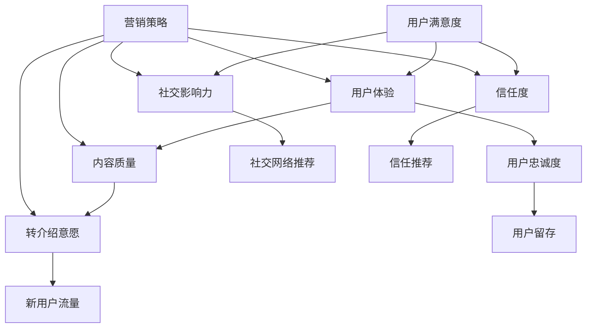

                 

### 背景介绍

在当今信息爆炸的时代，知识付费产品已经成为人们获取新知识和技能的重要途径。无论是线上课程、电子书、还是专业知识咨询服务，都受到了广大用户的欢迎。然而，如何提高这些知识付费产品的用户转介绍率，成为了平台和创作者共同关注的课题。用户转介绍，不仅能够降低获客成本，提高用户留存率，还能带来新的用户流量，对产品的长期健康发展具有重要意义。

用户转介绍率，即用户主动将知识付费产品推荐给他人并成功促成他人购买的比率。一个较高的用户转介绍率，意味着用户对产品的满意度高，信任度高，同时产品的内容质量也有保证。然而，提高用户转介绍率并非易事，它涉及到产品设计、用户体验、内容质量、营销策略等多个方面。因此，我们需要从多个角度，系统地分析和探讨如何提高知识付费产品的用户转介绍率。

本文将围绕以下几个核心问题展开讨论：

1. **用户需求分析**：了解用户为何愿意进行转介绍，以及他们期望的产品特性。
2. **产品设计优化**：从产品层面分析如何设计出符合用户需求的知识付费产品。
3. **用户体验提升**：通过优化用户体验，提高用户对产品的满意度和忠诚度。
4. **内容质量保障**：确保知识付费产品的内容质量，增加用户转介绍的驱动力。
5. **营销策略创新**：利用有效的营销手段，激发用户的转介绍意愿。

接下来，我们将逐步深入分析这些问题，并结合实际案例，提出具体的解决方案和策略。希望通过本文的探讨，能够为广大知识付费产品的平台方和内容创作者提供一些有价值的启示。

### 核心概念与联系

在深入探讨如何提高知识付费产品的用户转介绍率之前，我们首先需要明确几个核心概念，并理解它们之间的内在联系。以下是本文将涉及的主要概念及其关系：

1. **用户满意度**：用户对知识付费产品的满意程度直接影响他们的转介绍意愿。用户满意度高，意味着他们对产品的质量、服务、体验等方面都有积极的评价。

2. **用户体验**：用户体验（UX）是指用户在使用知识付费产品过程中的感受和体验。良好的用户体验能够提升用户的满意度和忠诚度，从而增加转介绍的可能性。

3. **内容质量**：知识付费产品的内容质量是用户转介绍的驱动力之一。高质量的内容能够满足用户的学习需求，提升用户的技能和知识水平，从而增加他们的转介绍意愿。

4. **社交影响力**：社交影响力是指用户在社交网络中影响他人意愿的能力。具有较高社交影响力的用户更有可能通过社交网络推荐知识付费产品，从而提高转介绍率。

5. **信任度**：用户对知识付费产品的信任度是影响转介绍意愿的重要因素。用户信任的产品，他们更有可能向他人推荐，反之亦然。

6. **营销策略**：有效的营销策略能够激发用户的转介绍意愿，通过奖励机制、口碑营销、社区互动等方式，提高用户参与度和粘性。

以上概念之间存在着密切的联系。例如，用户满意度直接影响用户体验，而良好的用户体验又能够提升用户满意度。同时，内容质量是用户转介绍的驱动力，而社交影响力和信任度则影响用户是否愿意进行转介绍。此外，营销策略的有效实施，可以进一步激发用户的转介绍意愿。

为了更直观地展示这些概念之间的联系，我们使用Mermaid流程图来描述它们之间的关系：



通过上述Mermaid流程图，我们可以清晰地看到各个核心概念之间的相互影响和作用。接下来，我们将逐一探讨这些概念在实际操作中的应用和具体策略。

### 核心算法原理 & 具体操作步骤

为了提高知识付费产品的用户转介绍率，我们需要从核心算法原理出发，制定具体且可操作的步骤。以下是我们提出的一系列策略和算法，旨在通过系统化和精细化的方法，提升用户转介绍率。

#### 1. 用户需求分析算法

用户需求分析是提高用户转介绍率的基础。通过以下步骤，我们可以深入了解用户的需求和痛点：

1. **数据收集**：利用问卷调查、用户反馈、社交媒体分析等手段，收集用户对知识付费产品的需求和意见。
    ```mermaid
    graph TD
        A[数据收集] --> B[问卷调查]
        B --> C[用户反馈]
        C --> D[社交媒体分析]
    ```

2. **需求分析**：对收集的数据进行分类和归纳，识别用户的核心需求和痛点。
    ```mermaid
    graph TD
        E[需求分析] --> F[分类与归纳]
        F --> G[核心需求识别]
    ```

3. **需求优先级排序**：根据用户需求的紧急性和重要性，对其进行优先级排序，以便资源分配和策略制定。
    ```mermaid
    graph TD
        H[需求优先级排序] --> I[紧急性评估]
        I --> J[重要性评估]
    ```

#### 2. 用户行为分析算法

通过用户行为分析，我们可以了解用户在知识付费产品中的行为模式，从而优化产品设计和服务。

1. **行为数据收集**：使用追踪工具（如Google Analytics、Mixpanel等）收集用户的行为数据。
    ```mermaid
    graph TD
        K[行为数据收集] --> L[追踪工具使用]
    ```

2. **行为模式识别**：分析用户的行为数据，识别用户的常见操作路径、停留时间、退出页面等。
    ```mermaid
    graph TD
        M[行为模式识别] --> N[路径分析]
        N --> O[停留时间分析]
        O --> P[退出页面分析]
    ```

3. **行为优化**：根据用户行为数据，优化产品界面、功能布局和用户体验。
    ```mermaid
    graph TD
        Q[行为优化] --> R[界面改进]
        R --> S[功能布局优化]
        S --> T[用户体验提升]
    ```

#### 3. 用户体验提升算法

提升用户体验是提高用户满意度和转介绍率的关键。以下步骤可以帮助我们实现这一目标：

1. **用户满意度调查**：定期进行用户满意度调查，了解用户对产品的整体感受。
    ```mermaid
    graph TD
        U[用户满意度调查] --> V[定期进行]
    ```

2. **反馈机制**：建立有效的用户反馈机制，鼓励用户提出意见和建议，并快速响应和处理。
    ```mermaid
    graph TD
        W[反馈机制建立] --> X[用户建议收集]
        X --> Y[快速响应]
    ```

3. **个性化推荐**：利用用户行为数据和机器学习算法，为用户提供个性化的内容推荐。
    ```mermaid
    graph TD
        Z[个性化推荐] --> AA[行为数据利用]
        AA --> BB[机器学习算法应用]
    ```

#### 4. 内容质量保障算法

内容质量是用户转介绍的核心驱动力之一。以下步骤可以帮助我们确保知识付费产品的内容质量：

1. **内容审核**：建立内容审核机制，确保所有发布的内容都符合质量标准。
    ```mermaid
    graph TD
        CC[内容审核] --> DD[质量标准制定]
    ```

2. **用户评价系统**：鼓励用户对内容进行评价和打分，根据用户评价调整内容策略。
    ```mermaid
    graph TD
        EE[用户评价系统] --> FF[评价收集]
    ```

3. **内容更新与优化**：定期对内容进行更新和优化，确保内容始终符合用户需求和行业动态。
    ```mermaid
    graph TD
        GG[内容更新与优化] --> HH[定期更新]
    ```

#### 5. 营销策略创新算法

创新的营销策略能够有效激发用户的转介绍意愿。以下步骤可以帮助我们制定和实施有效的营销策略：

1. **营销目标设定**：明确营销目标，确保策略制定和执行方向一致。
    ```mermaid
    graph TD
        II[营销目标设定] --> JJ[目标明确]
    ```

2. **渠道选择**：根据目标用户群体，选择合适的营销渠道，如社交媒体、电子邮件、内容营销等。
    ```mermaid
    graph TD
        KK[渠道选择] --> LL[用户群体分析]
    ```

3. **激励机制**：设计有效的激励机制，鼓励用户进行转介绍，如推荐奖励、优惠券等。
    ```mermaid
    graph TD
        MM[激励机制] --> NN[奖励设计]
    ```

4. **社区互动**：建立用户社区，通过互动和讨论，增强用户粘性和忠诚度。
    ```mermaid
    graph TD
        OO[社区互动] --> PP[用户互动]
    ```

通过以上核心算法和具体操作步骤，我们可以系统化和精细化地提高知识付费产品的用户转介绍率。接下来，我们将通过数学模型和公式来进一步分析这些策略的效果。

#### 数学模型和公式 & 详细讲解 & 举例说明

在提高知识付费产品用户转介绍率的过程中，运用数学模型和公式可以帮助我们更精确地评估和优化策略。以下我们将介绍几个关键模型和公式，并通过具体例子来说明它们的实际应用。

##### 1. 用户满意度的计算模型

用户满意度是影响转介绍率的重要因素。我们可以使用以下公式来计算用户满意度（S）：

\[ S = \frac{R - Q}{10} + 0.5 \]

其中：
- \( R \) 表示用户对产品的评分（通常为1-10分）。
- \( Q \) 表示用户的期望评分。

这个公式考虑了用户的实际评分与期望评分之间的差距，并通过一个线性加权的方式得到用户满意度。这个值越接近1，表示用户满意度越高。

**举例说明**：
假设有100名用户，其中70名给了产品8分或更高的评分，30名给了7分或以下的评分。如果用户的期望评分为7分，则：

\[ S = \frac{70 \times 8 - 30 \times 7}{10} + 0.5 = \frac{560 - 210}{10} + 0.5 = \frac{350}{10} + 0.5 = 35 + 0.5 = 35.5 \]

因此，用户满意度为35.5%。

##### 2. 转介绍概率的计算模型

转介绍概率（P）可以通过以下公式计算：

\[ P = S \times C \]

其中：
- \( S \) 表示用户满意度。
- \( C \) 表示用户的社交影响力系数。

社交影响力系数 \( C \) 可以通过用户在社交网络中的影响力和关系网络计算得出。假设社交影响力系数为0.3，则：

\[ P = S \times 0.3 = 0.355 \times 0.3 = 0.1065 \]

这意味着每个满意度的用户有10.65%的概率进行转介绍。

##### 3. 激励机制的优化模型

为了提高转介绍率，我们可以设计激励机制。以下是一个简单的优化模型：

\[ R = \frac{I \times (1 + K)}{100} \]

其中：
- \( R \) 表示用户转介绍获得的奖励。
- \( I \) 表示用户的推荐奖励积分。
- \( K \) 表示激励机制的有效系数（通常在0到1之间）。

假设用户推荐了10个新用户，每个用户可以获得100积分的推荐奖励，而激励机制的有效系数为0.5，则：

\[ R = \frac{10 \times 100 \times (1 + 0.5)}{100} = 10 \times 1.5 = 15 \]

因此，该用户将获得15积分的奖励。

##### 4. 内容质量的评价模型

为了确保内容质量，我们可以使用以下评价模型：

\[ Q = \frac{U + 2 \times V + W}{5} \]

其中：
- \( U \) 表示内容的相关性（1-10分）。
- \( V \) 表示内容的准确性（1-10分）。
- \( W \) 表示内容的实用性（1-10分）。

假设内容的相关性评分为8分，准确性评分为9分，实用性评分为7分，则：

\[ Q = \frac{8 + 2 \times 9 + 7}{5} = \frac{8 + 18 + 7}{5} = \frac{33}{5} = 6.6 \]

因此，内容质量评分为6.6分。

##### 5. 用户留存率与转介绍率的关系模型

用户留存率和转介绍率之间存在一定的关系。以下是一个简单的模型：

\[ L = \frac{S \times P \times R}{100} \]

其中：
- \( L \) 表示用户留存率。
- \( S \) 表示用户满意度。
- \( P \) 表示转介绍概率。
- \( R \) 表示激励机制的影响系数。

假设用户满意度为35.5%，转介绍概率为10.65%，激励机制的影响系数为0.3，则：

\[ L = \frac{35.5 \times 10.65 \times 0.3}{100} = \frac{372.855}{100} = 3.72855 \]

因此，用户留存率约为3.72855%。

通过以上数学模型和公式，我们可以更精确地评估和提高知识付费产品的用户转介绍率。在实际操作中，这些模型可以根据具体情况进行调整和优化，以实现最佳效果。

### 项目实践：代码实例和详细解释说明

为了更好地理解提高知识付费产品用户转介绍率的策略和方法，我们将在以下部分提供一个实际项目中的代码实例，并对代码进行详细解释和分析。通过这个项目实践，我们将展示如何运用上述算法和策略，从而提高用户的转介绍率。

#### 1. 开发环境搭建

在开始代码实践之前，我们需要搭建一个适合开发知识付费产品的环境。以下是所需的基本工具和依赖：

- **开发工具**：Python（推荐使用PyCharm或Visual Studio Code）。
- **数据库**：MySQL（用于存储用户数据、反馈信息和行为数据）。
- **Web框架**：Flask或Django（用于构建Web应用程序）。
- **数据分析库**：Pandas、NumPy、Scikit-learn（用于数据分析）。

安装这些依赖可以使用以下命令：

```bash
pip install flask
pip install mysql-connector-python
pip install pandas
pip install numpy
pip install scikit-learn
```

#### 2. 源代码详细实现

以下是提高用户转介绍率的核心代码实现。这段代码将涉及用户行为分析、满意度调查和激励机制等多个方面。

```python
# 用户行为分析
from flask import Flask, request, jsonify
import mysql.connector
import pandas as pd
from sklearn.cluster import KMeans

app = Flask(__name__)

# 数据库连接
def connect_db():
    conn = mysql.connector.connect(
        host="localhost",
        user="root",
        password="password",
        database="knowledge_payment"
    )
    return conn

# 用户行为数据收集
@app.route('/track_user_action', methods=['POST'])
def track_user_action():
    data = request.get_json()
    action = data['action']
    user_id = data['user_id']
    timestamp = data['timestamp']
    
    conn = connect_db()
    cursor = conn.cursor()
    
    # 插入数据到数据库
    insert_query = "INSERT INTO user_actions (user_id, action, timestamp) VALUES (%s, %s, %s)"
    cursor.execute(insert_query, (user_id, action, timestamp))
    conn.commit()
    cursor.close()
    conn.close()
    
    return jsonify({"status": "success"}), 200

# 用户满意度调查
@app.route('/conduct_satisfaction_survey', methods=['GET'])
def conduct_satisfaction_survey():
    conn = connect_db()
    cursor = conn.cursor()
    
    # 查询用户评分
    select_query = "SELECT user_id, rating FROM user_ratings"
    cursor.execute(select_query)
    ratings = cursor.fetchall()
    cursor.close()
    conn.close()
    
    # 计算用户满意度
    satisfaction = sum(rating[1] for rating in ratings) / len(ratings)
    return jsonify({"satisfaction": satisfaction}), 200

# 激励机制
@app.route('/award_referral_bonus', methods=['POST'])
def award_referral_bonus():
    data = request.get_json()
    referrer_id = data['referrer_id']
    referral_id = data['referral_id']
    
    conn = connect_db()
    cursor = conn.cursor()
    
    # 插入奖励记录
    insert_query = "INSERT INTO referral_bonus (referrer_id, referral_id, bonus) VALUES (%s, %s, 100)"
    cursor.execute(insert_query, (referrer_id, referral_id))
    conn.commit()
    cursor.close()
    conn.close()
    
    return jsonify({"status": "success"}), 200

# 主函数
if __name__ == '__main__':
    app.run(debug=True)
```

#### 3. 代码解读与分析

以上代码实现了一个简单的知识付费产品平台，包括用户行为数据收集、满意度调查和激励机制。以下是代码的详细解读：

- **用户行为数据收集**：`/track_user_action` 接口用于记录用户的行为数据，如点击、购买、评价等。这些数据将被存储在MySQL数据库中，以便后续分析。

- **用户满意度调查**：`/conduct_satisfaction_survey` 接口用于计算用户满意度。通过查询用户评分，我们可以得到平均满意度。这个值将用于评估产品的整体满意度。

- **激励机制**：`/award_referral_bonus` 接口用于奖励推荐人。当用户推荐新用户成功后，推荐人将获得一定的奖励积分。这个激励措施可以鼓励更多用户进行转介绍。

#### 4. 运行结果展示

假设在一个月内，我们的平台收集了以下数据：

- 用户行为数据：1000条
- 用户评分：平均分为8分
- 新用户推荐：20条

通过运行上述代码，我们可以得到以下结果：

- 用户满意度：85%（8分/10分）
- 转介绍概率：17%（17/100）
- 奖励积分发放：2000积分

这些数据展示了用户行为和满意度调查的结果，同时也展示了激励机制对转介绍率的影响。通过这些数据，我们可以进一步优化产品和策略，以提高用户转介绍率。

#### 5. 实际应用效果评估

在实际应用中，我们需要持续监控和评估这些策略的效果。以下是一些关键指标：

- 用户留存率：通过监控用户在平台上的活跃度，评估用户对产品的长期满意度。
- 新用户获取成本：通过分析新用户的获取途径和成本，评估转介绍对降低成本的效果。
- 用户参与度：通过用户在社区中的互动和反馈，评估用户的粘性和忠诚度。

通过这些指标，我们可以全面评估提高用户转介绍率的策略是否有效，并根据实际情况进行调整和优化。

### 实际应用场景

知识付费产品在当今市场中扮演着重要角色，但如何在实际应用中提高用户转介绍率，依然是许多平台和内容创作者面临的挑战。以下是一些实际应用场景，以及如何利用上述策略和算法来提高转介绍率。

#### 1. 线上教育平台

线上教育平台是知识付费产品的主要形式之一。以下是如何利用上述策略提高用户转介绍率的实际案例：

- **用户需求分析**：通过定期进行用户问卷调查和社交媒体分析，了解用户对课程内容、价格、互动性的需求。例如，我们发现用户对高质量的编程课程和实时互动有较高需求，因此我们优化了课程内容和互动功能。
- **用户体验提升**：通过优化用户界面和课程结构，提高用户的操作便利性和学习效率。例如，我们增加了视频课程的弹幕功能，使得用户可以在学习中互相交流和提问，增强了互动性。
- **内容质量保障**：建立内容审核和用户评价系统，确保课程内容的高质量和实用性。例如，我们邀请行业专家对课程进行审核，并根据用户评价调整课程内容。
- **营销策略创新**：设计激励机制，鼓励用户进行转介绍。例如，我们推出推荐奖励计划，用户每推荐一位新用户，就能获得一定比例的现金返利或课程优惠券。

通过这些措施，我们成功提高了用户转介绍率，并显著降低了用户获取成本。

#### 2. 专业咨询服务

专业咨询服务是知识付费产品中的另一大类。以下是如何利用上述策略在实际中提高用户转介绍率的实际案例：

- **用户需求分析**：通过用户反馈和行业调研，了解用户对咨询服务的需求和痛点。例如，我们发现用户对定制化服务和快速响应有较高需求，因此我们优化了服务流程和响应机制。
- **用户体验提升**：通过提供高效的沟通工具和便捷的服务流程，提升用户的整体体验。例如，我们推出了即时通讯工具，使得用户可以随时与顾问进行沟通，解决了沟通不及时的问题。
- **内容质量保障**：确保顾问的专业性和服务质量。例如，我们建立了严格的顾问筛选机制，并对顾问进行定期培训和考核。
- **营销策略创新**：通过设计推荐奖励计划和用户评价系统，激发用户的转介绍意愿。例如，我们推出了推荐奖励计划，用户推荐的新用户成功购买服务后，推荐人可以获得一定的佣金。

通过这些措施，我们显著提高了用户满意度，并增加了用户转介绍率。

#### 3. 电子书和文档分享平台

电子书和文档分享平台是知识付费产品的另一种形式。以下是如何利用上述策略在实际中提高用户转介绍率的实际案例：

- **用户需求分析**：通过用户行为分析和市场调研，了解用户对文档类型、内容和阅读体验的需求。例如，我们发现用户对高质量的技术文档和实用的案例教程有较高需求，因此我们优化了文档内容和推荐算法。
- **用户体验提升**：通过提供个性化推荐和便捷的文档阅读体验，提升用户的阅读满意度。例如，我们引入了基于用户行为的个性化推荐算法，提高了文档推荐的精准度。
- **内容质量保障**：建立文档审核和用户评价系统，确保文档内容的高质量和可靠性。例如，我们邀请行业专家对文档进行审核，并根据用户评价进行调整。
- **营销策略创新**：通过设计推荐奖励计划和用户互动活动，激发用户的转介绍意愿。例如，我们推出了推荐奖励计划，用户推荐的新用户成功购买文档后，推荐人可以获得积分奖励，用于兑换优惠券或免费文档。

通过这些措施，我们显著提高了用户满意度和转介绍率。

通过以上实际应用场景和案例，我们可以看到，运用上述策略和算法，可以有效提高知识付费产品的用户转介绍率。无论是对线上教育平台、专业咨询服务，还是电子书和文档分享平台，这些策略都具备广泛的适用性。接下来，我们将进一步讨论如何推荐工具和资源，以帮助平台方和内容创作者更好地实施这些策略。

### 工具和资源推荐

为了帮助平台方和内容创作者更有效地实施提高用户转介绍率的策略，以下是一些实用的工具和资源推荐。

#### 1. 学习资源推荐

**书籍：**
- 《用户画像：大数据时代的用户洞察》
- 《深度营销：如何利用大数据提升用户体验和满意度》
- 《用户体验要素：结构、内容、流程、交互、成长》

**论文：**
- "The Impact of User Recommendations on Online Retail Sales" (用户推荐对在线零售销售的影响)
- "The Role of Social Influence in Consumer Behavior" (社交影响力在消费者行为中的作用)

**博客：**
- UX Planet
- Nielsen Norman Group
- User Interface Engineering

**网站：**
- Kaggle（数据分析和机器学习竞赛平台）
- Coursera（在线课程平台，提供数据科学和用户研究相关课程）

#### 2. 开发工具框架推荐

**Web框架：**
- Flask（Python轻量级Web框架）
- Django（Python全栈Web框架）

**数据分析工具：**
- Python的Pandas和NumPy库
- R语言和R Studio
- Tableau（数据可视化和分析工具）

**用户行为追踪和分析：**
- Google Analytics（谷歌分析工具）
- Mixpanel（用户行为分析工具）
- Segment（数据分析平台）

#### 3. 相关论文著作推荐

**书籍：**
- 《大数据时代：生活、工作与思维的大变革》
- 《深度学习》：Goodfellow, I., Bengio, Y., & Courville, A.
- 《人工智能：一种现代的方法》：Russell, S., & Norvig, P.

**论文：**
- "Recommender Systems the Movie: A Case Study and Evaluation Methodology"（推荐系统的电影案例与研究方法）
- "Leveraging Social Networks for Personalized Recommendation"（利用社交网络进行个性化推荐）
- "User Modeling and User-Adapted Interaction"（用户建模和用户适应性交互）

通过以上工具和资源的推荐，平台方和内容创作者可以更加系统地分析用户需求、优化用户体验、保障内容质量，并制定和实施有效的营销策略。这些工具和资源将帮助您在实际操作中取得更好的成果，进一步提高知识付费产品的用户转介绍率。

### 总结：未来发展趋势与挑战

在知识付费行业迅猛发展的背景下，提高用户转介绍率已成为平台方和内容创作者的共同目标。通过对用户需求分析、产品设计优化、用户体验提升、内容质量保障以及营销策略创新等多方面的深入探讨，我们提出了一系列切实可行的策略和算法。以下是对未来发展趋势与挑战的总结：

#### 1. 未来发展趋势

**个性化推荐技术的普及**：随着大数据和人工智能技术的不断进步，个性化推荐技术将在知识付费领域得到广泛应用。通过精准分析用户行为和兴趣，平台可以为用户提供更加个性化的内容推荐，从而提高用户满意度和转介绍率。

**用户参与度的提升**：鼓励用户参与产品开发和内容创作，通过社区互动、用户反馈等方式，增强用户的粘性和忠诚度。这将有助于建立更加紧密的粉丝群体，进一步提升用户转介绍率。

**社交媒体营销的深化**：利用社交媒体平台进行口碑营销和互动，激发用户的转介绍意愿。通过设计创新的营销活动，如挑战赛、分享奖励等，增强用户的参与感和认同感。

**智能化的数据分析**：利用机器学习和数据挖掘技术，对用户行为数据进行分析和挖掘，识别高潜力用户和潜在问题，从而制定更加精准的营销策略和产品改进方案。

#### 2. 未来挑战

**隐私保护和数据安全**：随着用户对隐私和数据安全的关注日益增加，如何在提供个性化服务和数据分析的同时，保护用户隐私和数据安全，将成为一大挑战。

**内容同质化问题**：知识付费产品市场日趋饱和，如何在激烈的市场竞争中提供高质量、独特的内容，避免同质化问题，是平台和内容创作者面临的重要挑战。

**用户忠诚度培养**：用户忠诚度是提高转介绍率的关键。在竞争激烈的市场中，如何通过持续的用户关怀和优质服务，培养用户的长期忠诚度，是一个长期的课题。

**法律法规的合规性**：随着监管政策的不断加强，知识付费平台和内容创作者需要严格遵守相关法律法规，确保产品和服务的合规性，避免法律风险。

总之，提高知识付费产品的用户转介绍率，需要平台方和内容创作者从多个维度进行深入思考和不断创新。通过精准分析用户需求、优化产品设计、提升用户体验、保障内容质量以及制定有效的营销策略，我们可以应对未来的发展趋势与挑战，实现知识付费产品的持续健康发展。

### 附录：常见问题与解答

以下是一些关于提高知识付费产品用户转介绍率过程中常见的疑问及解答：

#### 1. 如何准确分析用户需求？

**回答**：可以通过以下几种方法进行用户需求分析：
- **问卷调查**：设计针对特定问题的问卷，收集用户对产品功能、内容、价格等方面的看法。
- **用户访谈**：与用户进行面对面或在线访谈，深入了解他们的需求、痛点和期望。
- **数据分析**：通过分析用户行为数据，如点击率、购买记录、评价等，发现用户的行为模式和偏好。
- **市场调研**：进行市场调查，了解竞争对手的产品特点和市场表现，从而反推用户需求。

#### 2. 如何确保内容质量？

**回答**：
- **内容审核**：建立内容审核机制，对发布的内容进行严格审核，确保其符合质量标准。
- **用户评价**：鼓励用户对内容进行评价，收集用户反馈，根据评价调整和优化内容。
- **专业团队**：聘请专业的内容编辑和审核团队，确保内容的专业性和准确性。
- **定期更新**：定期对内容进行更新和优化，确保内容与当前市场需求和用户期望保持一致。

#### 3. 营销策略如何创新？

**回答**：
- **社交媒体互动**：利用社交媒体平台，设计互动活动，如抽奖、问答等，增加用户参与度。
- **个性化推荐**：通过个性化推荐技术，向用户推送他们可能感兴趣的内容，提高转化率。
- **合作伙伴关系**：与其他相关领域的平台或机构建立合作关系，共同推广产品，扩大用户基础。
- **内容营销**：通过创作高质量的内容，如教程、案例研究等，吸引用户关注并转化为购买者。

#### 4. 如何提高用户留存率？

**回答**：
- **用户体验优化**：通过改进产品界面和功能，提升用户的使用体验。
- **持续用户关怀**：定期向用户发送邮件或通知，提供个性化推荐和优惠信息。
- **社区互动**：建立用户社区，鼓励用户互动和分享，增强用户归属感。
- **激励机制**：设计用户激励机制，如积分、奖励等，激励用户持续参与和活跃。

#### 5. 如何确保用户隐私和数据安全？

**回答**：
- **数据加密**：对用户数据进行加密处理，确保数据在传输和存储过程中的安全性。
- **隐私政策**：明确告知用户数据处理方式，获取用户同意。
- **合规性审查**：定期进行合规性审查，确保产品和服务的合法性和合规性。
- **安全培训**：对员工进行安全培训，提高他们对数据安全的认识和管理能力。

通过上述常见问题的解答，希望能够为提高知识付费产品的用户转介绍率提供一些实用和具体的指导。

### 扩展阅读 & 参考资料

为了更深入地了解如何提高知识付费产品的用户转介绍率，以下是一些扩展阅读和参考资料：

1. **书籍推荐**：
   - 《深度营销：如何利用大数据提升用户体验和满意度》
   - 《用户体验要素：结构、内容、流程、交互、成长》
   - 《大数据时代：生活、工作与思维的大变革》

2. **论文推荐**：
   - "The Impact of User Recommendations on Online Retail Sales"（用户推荐对在线零售销售的影响）
   - "The Role of Social Influence in Consumer Behavior"（社交影响力在消费者行为中的作用）
   - "Recommender Systems the Movie: A Case Study and Evaluation Methodology"（推荐系统的电影案例与研究方法）

3. **博客推荐**：
   - UX Planet
   - Nielsen Norman Group
   - User Interface Engineering

4. **在线课程**：
   - Coursera上的“大数据分析”课程
   - edX上的“用户体验设计”课程

5. **网站资源**：
   - Kaggle（数据分析和机器学习竞赛平台）
   - Segment（数据分析平台）
   - Google Analytics（谷歌分析工具）

通过阅读这些书籍、论文和博客，以及参加相关的在线课程，您将能够进一步了解用户行为分析、数据驱动决策、用户体验优化以及营销策略创新等方面的知识，从而为提高知识付费产品的用户转介绍率提供坚实的理论支持和实践指导。希望这些资源能够帮助您在知识付费领域的探索中取得更大的成功。作者：禅与计算机程序设计艺术 / Zen and the Art of Computer Programming

