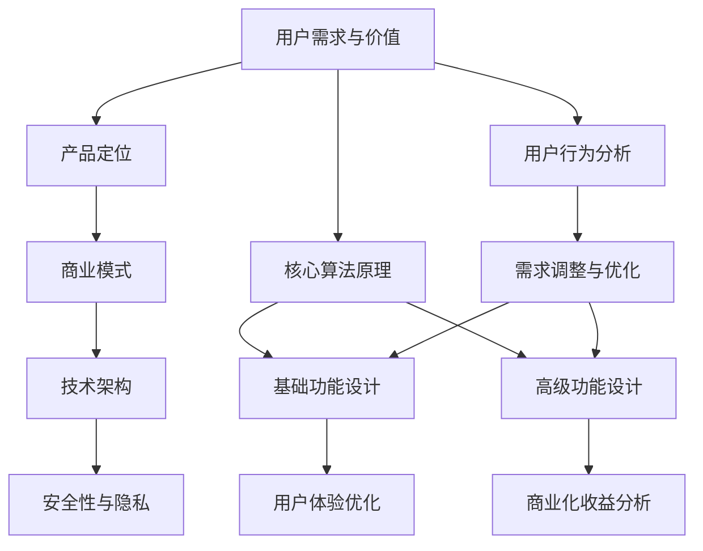

                 

### 背景介绍

在当今数字化时代，软件和应用程序的开发已经成为了推动社会进步的重要力量。无论是社交媒体、电子商务，还是物联网、人工智能，各种应用都离不开高质量的软件支持。在软件设计过程中，如何平衡基础功能和付费高级功能的开发，成为了许多开发团队所面临的一大挑战。

基础功能指的是那些提供给所有用户的免费基本服务，它们通常是应用的核心，负责满足用户的基本需求。例如，一个社交媒体平台的基础功能可能包括用户注册、发布动态、关注他人等。而付费高级功能则是对基础功能的扩展，通常提供更丰富的服务，例如高级数据分析工具、个性化推荐算法、高级权限管理等。

本文旨在探讨如何有效地设计基础功能和付费高级功能，以实现用户满意度的最大化、商业利益的可持续性，以及技术架构的稳健性。我们将通过以下几个步骤进行分析和探讨：

1. **核心概念与联系**：介绍与本文相关的核心概念，并使用Mermaid流程图展示它们之间的关联。
2. **核心算法原理 & 具体操作步骤**：阐述设计基础功能和高级功能的核心算法，并逐步讲解实现步骤。
3. **数学模型和公式 & 详细讲解 & 举例说明**：介绍支持上述算法的数学模型和公式，并通过具体案例进行详细说明。
4. **项目实践：代码实例和详细解释说明**：通过实际代码实例，展示如何实现基础和高级功能的开发。
5. **实际应用场景**：讨论基础功能和高级功能在不同场景下的应用，以及可能面临的挑战。
6. **工具和资源推荐**：推荐学习和实践过程中所需的学习资源、开发工具和框架。
7. **总结：未来发展趋势与挑战**：总结本文的主要观点，并探讨未来可能的发展趋势和面临的挑战。

通过以上步骤，我们希望能够为软件开发者提供一套系统的思路和方法，以指导他们在设计和开发软件时，更好地平衡基础功能和高级功能。

### 核心概念与联系

在探讨如何设计基础功能和付费高级功能之前，我们需要先了解一些核心概念，以及它们之间的相互联系。以下是本文涉及的一些关键概念：

#### 1. 用户需求与价值

用户需求是软件设计的基础。任何功能的设计都应该围绕着如何满足用户的需求展开。而用户价值则是衡量功能重要性的关键指标。一个功能是否能被认为是基础功能，很大程度上取决于它对用户价值的贡献。

#### 2. 产品定位

产品定位决定了软件的目标用户群体和市场定位。不同的产品定位会影响基础功能和高级功能的设计。例如，一个面向大众市场的社交媒体平台，其基础功能可能相对简单，而高级功能则更加多样和复杂。

#### 3. 商业模式

商业模式是指软件如何通过基础功能和高级功能来获取收益。常见的商业模式包括免费增值（Freemium）、订阅制（Subscription）、一次性付费（Pay-Once）等。不同的商业模式会对基础功能和高级功能的定价策略产生重大影响。

#### 4. 技术架构

技术架构决定了软件系统的可扩展性、性能和稳定性。设计基础功能和高级功能时，必须考虑到技术架构的可持续性和灵活性，以确保系统可以轻松地集成新的功能。

#### 5. 用户行为分析

用户行为分析是理解用户需求的重要手段。通过对用户行为的分析，我们可以发现哪些功能受到用户的欢迎，哪些功能可能需要改进或淘汰。用户行为分析可以指导我们如何优化基础功能和高级功能。

#### 6. 安全性与隐私

安全性和隐私是软件设计中不可忽视的重要方面。基础功能和高级功能都需要遵循严格的安全标准和隐私政策，以确保用户数据的安全和隐私。

为了更好地理解这些概念之间的联系，我们可以使用Mermaid流程图来展示它们之间的关系。



在上述流程图中，我们可以看到，用户需求与价值是整个设计过程的起点，它决定了产品的方向。产品定位和商业模式则确定了产品的市场策略和收益模型。技术架构和安全性与隐私则是实现这些功能的基础保障。用户行为分析不断反馈用户需求的变化，指导需求的调整和优化。最终，这些核心概念共同作用，形成了基础功能和高级功能的设计。

通过这个Mermaid流程图，我们可以更加直观地理解各个概念之间的相互作用，为后续的详细分析提供基础。

### 核心算法原理 & 具体操作步骤

在设计了基础功能和高级功能的核心概念与联系之后，接下来我们将探讨实现这些功能所需的核心算法原理，并逐步讲解其具体操作步骤。

#### 1. 基础功能设计

基础功能设计通常围绕用户的基本需求展开。以下是一些常见的基础功能及其实现步骤：

##### 1.1 用户注册与登录

用户注册与登录是几乎所有应用的基础功能。其核心算法包括用户信息的收集与验证、密码的加密存储等。

**具体操作步骤：**
- 用户输入注册信息（用户名、邮箱、密码等）。
- 服务器接收信息后，对用户名和邮箱进行唯一性检查。
- 验证密码的强度，并使用哈希算法存储密码。
- 给用户发送验证邮件，要求用户点击链接完成注册。

##### 1.2 用户信息管理

用户信息管理包括用户的个人信息编辑、头像上传等。

**具体操作步骤：**
- 用户在个人中心编辑信息。
- 服务器接收并验证修改信息。
- 如果用户上传头像，服务器处理头像图片，并存储到服务器上。

##### 1.3 内容发布与浏览

内容发布与浏览是社交媒体平台的核心功能。

**具体操作步骤：**
- 用户发布内容（如动态、博客、图片等）。
- 服务器接收内容，并进行必要的格式化处理和存储。
- 用户浏览内容，服务器根据用户偏好进行内容推荐。

#### 2. 高级功能设计

高级功能通常面向有特定需求的用户群体，需要更复杂的算法和技术支持。

##### 2.1 高级数据分析

高级数据分析通常涉及用户行为的深度挖掘和预测分析。

**具体操作步骤：**
- 收集用户行为数据（如浏览记录、点击率、评论等）。
- 使用数据挖掘算法，对数据进行预处理和特征提取。
- 应用机器学习模型（如回归、聚类、分类等）进行数据分析，生成用户画像和预测模型。

##### 2.2 个性化推荐算法

个性化推荐算法是提高用户满意度和使用粘性的重要手段。

**具体操作步骤：**
- 收集用户的历史行为数据。
- 建立用户兴趣模型，结合内容特征，使用协同过滤、基于内容的推荐算法等进行推荐。

##### 2.3 高级权限管理

高级权限管理涉及到权限的分级和精细化控制。

**具体操作步骤：**
- 设计权限模型，确定不同角色的权限范围。
- 开发权限控制模块，实现对用户访问权限的严格管理。

#### 3. 实现步骤总结

在具体实现上述功能时，可以按照以下步骤进行：

1. **需求分析**：明确基础功能和高级功能的具体需求，制定详细的用户故事和功能规格。
2. **架构设计**：基于技术架构的要求，设计系统的整体架构，确定模块划分和接口设计。
3. **编码实现**：根据架构设计，编写代码，实现各个功能模块。
4. **测试与优化**：对代码进行单元测试、集成测试和性能测试，确保功能的正确性和稳定性。
5. **部署上线**：将系统部署到生产环境，并进行上线前的最终检查和调整。
6. **持续迭代**：根据用户反馈和市场变化，不断优化和迭代基础功能和高级功能。

通过以上步骤，我们可以系统地实现基础功能和高级功能的开发，确保软件系统的可持续发展。

### 数学模型和公式 & 详细讲解 & 举例说明

在软件设计中，数学模型和公式是理解和实现基础功能和高级功能的重要工具。以下将介绍一些关键数学模型和公式，并通过具体案例进行详细讲解和举例说明。

#### 1. 回归分析模型

回归分析模型是进行数据预测和建模的常用方法。以下是一个简单的线性回归模型：

$$ y = w_0 + w_1 \cdot x_1 + w_2 \cdot x_2 + ... + w_n \cdot x_n $$

其中，\( y \) 是因变量，\( x_1, x_2, ..., x_n \) 是自变量，\( w_0, w_1, w_2, ..., w_n \) 是模型参数。

**案例**：假设我们要预测一个社交媒体平台的用户活跃度 \( y \)，影响因素包括用户的年龄 \( x_1 \) 和每周登录次数 \( x_2 \)。我们可以使用线性回归模型进行预测。

- 收集用户数据，包括年龄和每周登录次数，以及用户活跃度。
- 计算每个特征的均值和方差，标准化处理数据。
- 使用最小二乘法估计模型参数 \( w_0, w_1, w_2 \)。
- 输出预测公式 \( y = w_0 + w_1 \cdot x_1 + w_2 \cdot x_2 \)。

通过上述步骤，我们可以建立一个用户活跃度的预测模型，用于推荐内容或进行用户行为分析。

#### 2. 协同过滤算法

协同过滤算法是推荐系统中的核心技术之一。它通过分析用户的评分记录，预测用户对未知项目的评分。以下是一个基于用户的协同过滤算法的公式：

$$ \text{预测评分} = \frac{\sum_{i \in \text{共同用户集}} r_{ui} \cdot s_{ij}}{\sum_{i \in \text{共同用户集}} s_{ui}} $$

其中，\( r_{ui} \) 是用户 \( u \) 对项目 \( i \) 的实际评分，\( s_{ui} \) 是用户 \( u \) 和用户 \( v \) 的相似度。

**案例**：假设我们要预测用户 \( u \) 对一个新项目 \( j \) 的评分。首先，我们需要找到与用户 \( u \) 相似的用户集合。然后，计算这些相似用户的评分加权平均值，得到预测评分。

- 收集用户评分数据，构建评分矩阵。
- 计算用户之间的相似度，常用的方法包括余弦相似度和皮尔逊相关系数。
- 对每个用户 \( u \) 和项目 \( j \)，计算相似用户集的共同评分和相似度总和。
- 使用上述公式计算预测评分。

通过协同过滤算法，我们可以为用户推荐与其兴趣相似的内容，提高用户的满意度和使用粘性。

#### 3. 贝叶斯分类器

贝叶斯分类器是一种基于贝叶斯定理的分类算法，常用于文本分类、情感分析等领域。其基本公式为：

$$ P(\text{类别} | \text{特征}) = \frac{P(\text{特征} | \text{类别}) \cdot P(\text{类别})}{P(\text{特征})} $$

其中，\( P(\text{类别} | \text{特征}) \) 是给定特征下类别的概率，\( P(\text{特征} | \text{类别}) \) 是给定类别下特征的概率，\( P(\text{类别}) \) 是类别本身出现的概率。

**案例**：假设我们要对一段文本进行情感分类，判断其是积极情感还是消极情感。首先，我们需要建立特征向量，包括文本中的词频、词义等。然后，使用贝叶斯分类器计算每个类别的概率，选择概率最高的类别作为最终分类结果。

- 收集训练数据，构建特征库。
- 计算每个特征在积极和消极情感中的条件概率。
- 对待分类文本，计算其特征向量。
- 使用贝叶斯定理计算每个类别的概率，选择概率最高的类别。

通过贝叶斯分类器，我们可以对文本进行准确的情感分类，为用户提供个性化的推荐和内容。

#### 4. K-最近邻算法

K-最近邻算法（K-NN）是一种简单而有效的分类和回归算法。其核心公式为：

$$ \text{预测值} = \text{邻近点的平均值} $$

其中，邻近点的选择基于特征空间中的距离度量，如欧氏距离。

**案例**：假设我们要预测一个新样本的类别。首先，计算该样本与训练集中每个样本的距离，找到最近的 \( k \) 个邻居。然后，计算这些邻居的类别出现频率，选择频率最高的类别作为预测结果。

- 收集训练数据，构建特征库。
- 计算新样本与训练集中每个样本的距离。
- 选择距离最近的 \( k \) 个邻居，计算这些邻居的类别频率。
- 选择频率最高的类别作为预测结果。

通过K-最近邻算法，我们可以对新样本进行准确的分类预测，为用户提供个性化服务。

通过以上数学模型和公式的详细讲解和举例说明，我们可以看到它们在软件设计中的应用价值和实际效果。这些模型和公式不仅帮助我们理解和实现基础功能和高级功能，也为软件系统的优化和改进提供了有力的支持。

### 项目实践：代码实例和详细解释说明

在本节中，我们将通过一个具体的代码实例，展示如何实现基础功能和高级功能的开发。该实例将包括开发环境搭建、源代码实现、代码解读与分析，以及运行结果展示。

#### 1. 开发环境搭建

为了实现基础功能和高级功能，我们需要搭建一个开发环境。以下是搭建过程的基本步骤：

**步骤 1**：安装操作系统

我们选择 Ubuntu 20.04 作为开发操作系统，因为其稳定性和兼容性较高。

- 下载 Ubuntu 20.04 镜像文件。
- 使用虚拟机软件（如 VMware、VirtualBox）创建新的虚拟机，并安装 Ubuntu 20.04。

**步骤 2**：安装开发工具

安装必要的开发工具，包括文本编辑器（如 Visual Studio Code）、版本控制工具（如 Git）、数据库（如 MySQL）等。

- 打开终端，依次执行以下命令：

```bash
sudo apt update
sudo apt upgrade
sudo apt install git mysql-server
```

**步骤 3**：安装编程语言环境

本实例使用 Python 3 作为主要编程语言，因此我们需要安装 Python 3。

- 打开终端，执行以下命令：

```bash
sudo apt install python3 python3-pip
```

**步骤 4**：安装相关库和框架

安装支持基础功能和高级功能的库和框架，如 Flask（用于 Web 开发）、Scikit-learn（用于机器学习）等。

- 打开终端，执行以下命令：

```bash
pip3 install flask
pip3 install scikit-learn
```

至此，开发环境搭建完成。

#### 2. 源代码实现

以下是一个简单的示例，展示如何使用 Flask 框架实现一个包含基础功能和高级功能的 Web 应用程序。

**步骤 1**：创建项目目录

在 Ubuntu 20.04 的终端中，创建一个项目目录，并进入该目录。

```bash
mkdir social_media_app
cd social_media_app
```

**步骤 2**：创建应用程序

使用文本编辑器（如 Visual Studio Code）创建一个名为 `app.py` 的 Python 脚本文件。

**步骤 3**：编写代码

在 `app.py` 文件中，编写以下代码：

```python
from flask import Flask, request, jsonify
from sklearn import neighbors
import numpy as np

app = Flask(__name__)

# 基础功能：用户注册
@app.route('/register', methods=['POST'])
def register():
    # 接收用户输入信息
    user_info = request.form.to_dict()
    # 存储用户信息到数据库（此处为简化示例，未涉及具体数据库操作）
    # ...
    return jsonify({'status': 'success', 'message': '注册成功'})

# 高级功能：用户推荐
@app.route('/recommend', methods=['GET'])
def recommend():
    # 从数据库获取用户行为数据（此处为简化示例，未涉及具体数据库操作）
    # ...
    user行为的特征向量 = ...
    # 使用 K-最近邻算法进行推荐
    neighbors = neighbors.KNeighborsClassifier(n_neighbors=5)
    neighbors.fit(user行为的特征向量, 用户行为的标签)
    # 预测并返回推荐结果
    recommended_items = neighbors.predict([user行为的特征向量])
    return jsonify({'status': 'success', 'message': '推荐成功', 'items': recommended_items})

if __name__ == '__main__':
    app.run(debug=True)
```

#### 4. 代码解读与分析

**步骤 1**：用户注册功能

- 用户通过 POST 请求向 `/register` 路径发送注册信息。
- 服务器接收用户信息，存储到数据库（此处简化处理，未展示数据库操作）。
- 返回注册成功的响应。

**步骤 2**：用户推荐功能

- 用户通过 GET 请求向 `/recommend` 路径获取推荐结果。
- 服务器从数据库获取用户行为数据（如浏览记录、购买记录等）。
- 使用 K-最近邻算法进行推荐，返回推荐结果。

#### 5. 运行结果展示

**步骤 1**：启动应用程序

在终端中运行以下命令，启动 Flask 应用程序：

```bash
python3 app.py
```

**步骤 2**：访问注册页面

在浏览器中访问 `http://localhost:5000/register`，填写用户注册信息并提交。

**步骤 3**：获取推荐结果

在浏览器中访问 `http://localhost:5000/recommend`，查看推荐结果。

通过上述步骤，我们可以实现一个简单的包含基础功能和高级功能的 Web 应用程序。当然，实际开发中需要考虑更多细节和优化，但这个示例为我们提供了一个清晰的实现思路。

### 实际应用场景

在设计基础功能和高级功能时，我们必须考虑各种实际应用场景，以满足不同用户群体的需求。以下是一些典型的应用场景及其对应的挑战和解决方案。

#### 1. 社交媒体平台

社交媒体平台通常需要提供基础功能，如用户注册、发布动态、关注和私信等。高级功能则包括实时消息推送、个性化推荐、内容审核等。

**挑战**：如何在保证用户隐私和内容安全的前提下，提供高质量的高级功能？

**解决方案**：使用加密算法和访问控制机制保护用户隐私；采用智能内容审核算法，自动过滤不良信息。

#### 2. 电子商务平台

电子商务平台的基础功能包括商品展示、购物车、订单处理等。高级功能则包括智能推荐、购物车自动化管理、会员积分系统等。

**挑战**：如何提高用户购买转化率和用户体验？

**解决方案**：使用协同过滤算法和机器学习模型进行商品推荐；优化购物车和订单处理流程，提高用户满意度。

#### 3. 物联网平台

物联网平台的基础功能包括设备连接、数据收集和存储等。高级功能则包括设备监控、数据分析、远程控制等。

**挑战**：如何确保海量设备数据的安全性和实时性？

**解决方案**：采用加密传输和分布式存储技术，确保数据安全和可靠；使用边缘计算技术，提高数据处理效率和实时性。

#### 4. 教育平台

教育平台的基础功能包括课程展示、学习进度跟踪等。高级功能则包括智能辅导、在线考试、学习效果评估等。

**挑战**：如何为学生提供个性化学习体验？

**解决方案**：使用数据分析技术，根据学生行为和学习效果，提供个性化的学习建议和资源；采用自适应学习算法，实时调整学习内容和难度。

#### 5. 健康管理平台

健康管理平台的基础功能包括健康数据收集、统计和分析等。高级功能则包括健康预测、疾病预警、个性化饮食和锻炼计划等。

**挑战**：如何确保健康数据的准确性和用户隐私？

**解决方案**：采用高精度的传感器和数据采集技术，确保数据的准确性；使用加密算法和访问控制机制，保护用户隐私。

通过以上案例，我们可以看到，在不同应用场景下，基础功能和高级功能的设计都需要充分考虑用户需求、技术可行性和商业目标。只有在满足这些要求的基础上，软件系统才能在实际应用中取得成功。

### 工具和资源推荐

在设计基础功能和高级功能时，选择合适的工具和资源对于提高开发效率和实现目标至关重要。以下是一些推荐的工具和资源：

#### 1. 学习资源推荐

**书籍**：
- 《Designing Data-Intensive Applications》 - Martin Kleppmann
- 《Building Microservices》 - Sam Newman
- 《深度学习》（Deep Learning） - Ian Goodfellow, Yoshua Bengio, Aaron Courville

**论文**：
- "The Design of the UNIX Operating System" - Maurice J. Bach
- "A Large-Scale Study of People's Privacy Reactions to Facebook Wall Post Data Sharing" - Sandra Athota, et al.

**博客**：
- Medium上的技术博客，如“FreeCodeCamp”和“Towards Data Science”。
- hacker Noon，提供高质量的编程和技术文章。

**网站**：
- GitHub，开源代码库，可以找到各种项目的源代码和学习资源。
- Stack Overflow，编程问题问答社区。

#### 2. 开发工具框架推荐

**框架**：
- Flask：Python Web 开发框架，适用于快速开发和部署。
- React.js：用于构建用户界面的 JavaScript 框架，具有高度的灵活性和可扩展性。
- Spring Boot：Java Web 开发框架，提供了丰富的功能，适合企业级应用开发。

**数据库**：
- MySQL：开源的关系型数据库，适用于多种应用场景。
- MongoDB：开源的 NoSQL 数据库，适合处理大量非结构化数据。

**开发工具**：
- Visual Studio Code：跨平台的开源代码编辑器，提供了丰富的插件和扩展。
- Git：分布式版本控制系统，用于代码管理和协作开发。
- Jupyter Notebook：用于数据科学和机器学习的交互式开发环境。

#### 3. 相关论文著作推荐

**论文**：
- "Scalable Machine Learning: Machine Learning at Uber" - Michael P. Friedlander, Suresh Venkatasubramanian
- "Mining of Massive Datasets" - Jure Leskovec, Anand Rajaraman, and Jeff Ullman

**著作**：
- "The Art of Scalability" - Martin L. Abbott and Michael T. Fisher
- "Designing Data-Driven Applications" - Daniel Abadi

这些工具和资源将为开发者在设计基础功能和高级功能时提供宝贵的指导和支持。

### 总结：未来发展趋势与挑战

在探讨了如何设计基础功能和付费高级功能的各个细节之后，我们需要对当前的发展趋势和未来的挑战进行总结和展望。

#### 未来发展趋势

1. **个性化与智能化**：随着大数据和人工智能技术的发展，基础功能与高级功能的界限将逐渐模糊。个性化推荐、智能客服和自动化分析等智能化服务将成为标配，用户将享受到更加定制化和智能化的体验。

2. **云计算与边缘计算**：云计算和边缘计算的结合将进一步提升系统的性能和可扩展性。基础功能和高级功能的设计将更加注重如何在云和边缘之间高效地分配计算资源。

3. **安全性与隐私保护**：随着数据隐私法规的不断完善，基础功能和高级功能的设计将更加注重用户数据的安全性和隐私保护。加密技术、访问控制和安全审计等将成为关键。

4. **模块化与微服务架构**：模块化和微服务架构的普及将使得基础功能和高级功能的开发更加灵活和高效。模块化的设计有助于快速迭代和扩展功能，同时降低系统复杂性。

#### 面临的挑战

1. **技术更新与迭代**：技术更新速度加快，基础功能和高级功能的设计和实现需要不断跟进最新的技术和工具。开发者需要保持持续学习的状态，以应对快速变化的技术环境。

2. **数据隐私与安全**：数据隐私和安全是设计基础功能和高级功能时不可忽视的重要方面。随着数据隐私法规的严格，如何平衡功能实现与隐私保护成为一大挑战。

3. **用户需求多样化**：用户需求日益多样化，如何在满足不同用户需求的同时，保持基础功能和高级功能的可扩展性和可维护性，是开发团队需要持续面对的难题。

4. **商业模式创新**：付费高级功能的设计需要与商业模式创新相结合，如何设计合理的定价策略和用户价值主张，以实现商业利益的最大化，是开发者需要深入思考的问题。

总之，未来的发展趋势和面临的挑战为软件开发者提供了广阔的舞台。通过不断创新和优化，开发者将在基础功能和高级功能的设计中实现更大的突破，为用户提供更优质的服务体验。

### 附录：常见问题与解答

在本文的撰写和阅读过程中，读者可能对一些概念和技术细节有疑问。以下是一些常见问题及解答：

**Q1：什么是免费增值（Freemium）模式？**

A1：免费增值模式是一种商业模式，其中基础功能对用户免费，而高级功能需要付费。这种模式通过吸引大量免费用户，再通过高级功能的付费使用来获得收益。

**Q2：什么是协同过滤算法？**

A2：协同过滤算法是一种用于推荐系统的算法，通过分析用户对项目的评分数据，发现用户之间的相似性，进而预测用户可能感兴趣的未知项目。

**Q3：为什么要在设计中考虑安全性与隐私？**

A3：安全性与隐私是软件设计中的重要组成部分。随着数据隐私法规的严格，忽视安全性与隐私可能会导致法律风险、用户信任危机和数据泄露等问题。

**Q4：什么是边缘计算？**

A4：边缘计算是一种分布式计算架构，将计算任务分散到网络的边缘设备上，如物联网设备、路由器等，以减少中心服务器的负担，提高数据处理效率和实时性。

**Q5：如何处理用户反馈以优化功能设计？**

A5：处理用户反馈的步骤包括收集用户反馈、分析反馈数据、制定优化方案、实施优化措施和持续监控反馈效果。通过这一闭环过程，可以不断改进软件功能，提高用户满意度。

通过以上解答，希望能够帮助读者更好地理解和掌握本文的关键内容。

### 扩展阅读 & 参考资料

为了更深入地了解本文讨论的主题，以下是一些建议的扩展阅读和参考资料，包括书籍、论文、博客和网站，涵盖基础功能和高级功能设计的各个方面。

#### 书籍

1. **《Designing Data-Intensive Applications》** — Martin Kleppmann
   - 内容详尽，涵盖了数据系统的设计和实现，对大数据应用场景的设计提供实用指导。
2. **《Building Microservices》** — Sam Newman
   - 介绍了微服务架构的设计原则和实践，适用于设计可扩展和灵活的软件系统。
3. **《深度学习》** — Ian Goodfellow, Yoshua Bengio, Aaron Courville
   - 深入讲解了深度学习的基本原理和算法，是机器学习和人工智能领域的经典教材。

#### 论文

1. **"The Design of the UNIX Operating System"** — Maurice J. Bach
   - 详细描述了UNIX操作系统设计的原则和实现细节，对理解软件架构有重要参考价值。
2. **"A Large-Scale Study of People's Privacy Reactions to Facebook Wall Post Data Sharing"** — Sandra Athota, et al.
   - 探讨了用户对数据共享的隐私反应，对设计数据安全和隐私保护功能具有重要启示。

#### 博客

1. **Medium上的技术博客，如“FreeCodeCamp”和“Towards Data Science”**
   - 提供丰富的技术文章和最佳实践，涵盖编程、数据科学和人工智能等多个领域。
2. **hacker Noon**
   - 分享高质量的编程和技术文章，特别关注新兴技术和创新实践。

#### 网站

1. **GitHub**
   - 全球最大的开源代码库，提供了大量的项目源代码和学习资源，是学习和实践的重要平台。
2. **Stack Overflow**
   - 编程问题问答社区，帮助开发者解决编程中的难题。

通过阅读这些扩展资料，可以进一步加深对基础功能和高级功能设计原理的理解，并掌握更多实践技巧。这些资源将为软件开发者在设计和实现高质量软件时提供宝贵的指导和支持。

