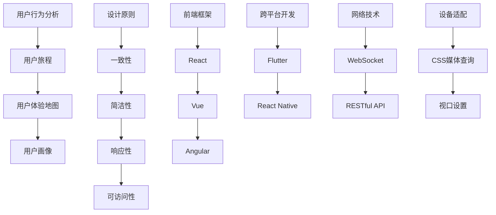

                 

### 背景介绍

#### 用户体验的重要性

在当今的数字时代，用户体验（User Experience，简称UX）已经成为影响产品成功与否的关键因素。无摩擦的多端用户体验更是现代技术发展的核心目标之一。随着移动设备的普及，用户越来越习惯于在各种平台上无缝切换使用应用程序。这就要求开发者不仅要关注单一平台上的用户体验，更要着眼于多端之间的用户体验一致性。

用户体验的重要性在于它直接影响用户的满意度、忠诚度和产品口碑。一个无摩擦的多端用户体验可以减少用户的学习成本，提升用户的使用效率和满意度，从而增加用户对产品的忠诚度。而用户体验不佳则可能导致用户流失，影响产品的市场竞争力和品牌形象。

无摩擦的用户体验具体体现在以下几个方面：

1. **一致性与兼容性**：用户在不同设备上使用产品时，应该感受到一致的操作流程和界面风格。
2. **快速响应**：无论是移动端还是桌面端，系统的响应速度都应该快速，以减少用户的等待时间。
3. **便捷性**：用户在操作过程中应该能够轻松地完成任务，而不需要额外的指导或繁琐的步骤。
4. **个性化**：系统应该能够根据用户的偏好和行为习惯提供个性化的体验。

#### 多端用户体验的挑战

虽然无摩擦的多端用户体验是理想目标，但实现这一目标面临着诸多挑战：

1. **技术差异**：不同的操作系统、设备和浏览器在技术实现上存在差异，这要求开发者必须对不同平台有深入的了解。
2. **资源限制**：移动设备相较于桌面设备在处理能力、存储空间和网络连接等方面都有所限制，需要开发者进行优化。
3. **设计复杂性**：多端设计的复杂性远高于单一端设计，需要开发者兼顾各种屏幕尺寸、分辨率和交互方式。
4. **兼容性**：不同设备和浏览器的兼容性问题也是一大挑战，需要开发者进行大量的测试和调整。

本文将探讨如何设计无摩擦的多端用户体验，通过分析核心概念与联系、核心算法原理、数学模型与公式、项目实践、实际应用场景等内容，旨在为开发者提供一套系统化的解决方案。

### 核心概念与联系

为了设计无摩擦的多端用户体验，我们需要从核心概念入手，理解用户体验设计的原则，以及如何将这些原则应用于多端开发。

#### 用户行为分析

用户行为分析是用户体验设计的起点。通过分析用户在使用产品时的行为模式，我们可以发现用户的痛点、喜好和需求。以下是几个关键概念：

1. **用户旅程（User Journey）**：用户从接触到产品，到使用过程中的每一个环节，都构成了一个完整的用户旅程。理解用户旅程有助于我们识别关键接触点和优化用户体验。

2. **用户体验地图（User Experience Map）**：用户体验地图是一种可视化工具，用于展示用户在使用产品过程中的情感变化和关键任务。通过绘制用户体验地图，我们可以识别用户的痛点并设计改进方案。

3. **用户画像（User Persona）**：用户画像是基于用户研究创建的一种虚拟用户代表，用于指导产品设计。通过创建用户画像，我们可以更好地理解目标用户，设计符合他们需求和预期的产品。

#### 设计原则

在多端用户体验设计中，以下设计原则尤为重要：

1. **一致性（Consistency）**：一致性包括界面元素、交互逻辑和操作流程的一致。无论是在移动端还是桌面端，用户都应该感受到相同的产品体验。

2. **简洁性（Simplicity）**：简洁的设计能够降低用户的学习成本，让用户更容易上手。简洁性要求我们在设计过程中去除不必要的元素，保持界面简洁直观。

3. **响应性（Responsiveness）**：响应性设计确保产品在不同设备和屏幕尺寸上都能良好显示。通过响应式设计，我们可以为用户提供一致且无缝的体验。

4. **可访问性（Accessibility）**：可访问性意味着产品能够为不同能力和需求的用户提供服务。这包括视觉、听觉和物理障碍的适应性设计。

#### 技术联系

在设计无摩擦的多端用户体验时，技术是实现目标的关键。以下是几个核心概念：

1. **前端框架**：如React、Vue、Angular等前端框架，提供了组件化、响应式设计的能力，有助于实现多端一致性。

2. **跨平台开发**：如Flutter、React Native等跨平台开发框架，能够让我们使用一套代码库同时支持多种平台，提高开发效率和一致性。

3. **网络技术**：如WebSocket、RESTful API等网络技术，提供了实时通信和数据交换的能力，有助于实现多端同步和数据共享。

4. **设备适配**：通过CSS媒体查询、视口设置等技术，可以确保产品在不同设备和屏幕尺寸上具有良好的适配性和响应性。

#### Mermaid 流程图

以下是一个简单的Mermaid流程图，展示了多端用户体验设计的关键概念和联系：



通过以上流程图，我们可以清晰地看到用户行为分析、设计原则、技术联系之间的关系，这为后续的设计和实现提供了明确的指导。

### 核心算法原理 & 具体操作步骤

#### 响应式设计的核心算法

响应式设计是确保多端用户体验一致性的关键。其核心在于如何根据不同的设备和屏幕尺寸动态调整界面布局和交互方式。以下是几种常用的响应式设计核心算法：

1. **弹性布局（Flexbox）**：Flexbox 是一种用于创建灵活、响应式布局的 CSS 网格系统。通过 Flexbox，我们可以轻松地对齐、分布和调整容器内的元素。

   **操作步骤**：
   - 创建一个 Flexbox 容器，并设置 `display: flex`。
   - 使用 `flex-direction` 属性设置元素的排列方向（如 row、column）。
   - 使用 `justify-content` 和 `align-items` 属性设置元素的水平对齐和垂直对齐方式。
   - 使用 `flex-grow`、`flex-shrink` 和 `flex-basis` 属性控制元素的伸缩比例和基础宽度。

2. **媒体查询（Media Queries）**：媒体查询是 CSS 中用于在不同屏幕尺寸下应用不同样式的一种机制。通过媒体查询，我们可以根据设备的特性（如宽度、高度、分辨率等）调整样式。

   **操作步骤**：
   - 创建一个媒体查询规则，使用 `@media` 关键字。
   - 指定查询条件，如 `min-width: 768px`。
   - 在查询块内编写特定的样式规则。

3. **断点（Breakpoints）**：断点是我们在不同屏幕尺寸下切换样式规则的重要依据。常见的断点包括桌面端（≥1200px）、平板端（≥768px）和移动端（<768px）。

   **操作步骤**：
   - 确定项目需要的断点。
   - 在媒体查询中为每个断点设置相应的样式规则。

#### 交互设计中的核心算法

交互设计的目标是确保用户能够轻松、高效地与产品进行交互。以下是几种核心算法：

1. **触摸友好设计（Touch-friendly Design）**：移动设备上的用户主要依靠触摸进行交互。触摸友好设计要求按钮和操作区域足够大，易于点击。

   **操作步骤**：
   - 使用足够大的触摸目标，建议按钮的宽度至少为44像素。
   - 提供反馈，如按钮按下时的视觉变化。

2. **手势识别（Gesture Recognition）**：在移动设备上，手势识别是一种重要的交互方式。通过手势识别，用户可以通过滑动、拖动、长按等操作触发特定行为。

   **操作步骤**：
   - 使用 JavaScript 或原生 API 实现手势识别功能。
   - 为每种手势定义明确的行为和反馈。

3. **导航设计（Navigation Design）**：导航设计要确保用户能够方便地浏览和操作产品。常见的导航方式包括汉堡菜单、标签页、底部导航等。

   **操作步骤**：
   - 选择适合产品的导航方式。
   - 设计清晰、直观的导航流程，确保用户能够快速找到所需内容。

#### 数据同步的核心算法

在多端应用中，数据同步是一个重要的挑战。以下是一种常见的数据同步算法：

1. **WebSockets**：WebSockets 提供了一种在客户端和服务器之间建立持久的、双向的通信渠道。通过 WebSockets，我们可以实现实时数据同步。

   **操作步骤**：
   - 在服务器端搭建 WebSocket 服务。
   - 在客户端建立 WebSocket 连接。
   - 通过 WebSocket 发送和接收数据。

2. **RESTful API**：虽然 RESTful API 不是实时通信，但通过轮询（Polling）和长轮询（Long Polling），我们也可以实现类似实时数据同步的效果。

   **操作步骤**：
   - 设计 RESTful API，确保接口具有良好的响应性和可靠性。
   - 在客户端实现轮询或长轮询逻辑。

通过以上核心算法和具体操作步骤，我们可以为用户提供一致、便捷、高效的多端用户体验。这些算法不仅有助于实现无摩擦的用户体验，还能够提高开发效率和产品竞争力。

### 数学模型和公式 & 详细讲解 & 举例说明

#### 响应式布局的数学模型

在响应式设计中，弹性布局（Flexbox）是一种常用的布局方式。Flexbox 基于一组数学模型来实现自适应布局。以下是几个关键的数学模型：

1. **Flexbox 基础模型**：

   - **Flex Container**：Flex 容器可以通过设置 `display: flex` 或 `display: inline-flex` 来创建。
   - **Flex Items**：Flex 子项是容器内的元素，默认情况下它们会根据容器的属性进行布局。

2. **Flex Direction**：

   - **row**：默认值，元素从左到右排列。
   - **row-reverse**：元素从右到左排列。
   - **column**：元素从上到下排列。
   - **column-reverse**：元素从下到上排列。

3. **Flex Align**：

   - **flex-start**：默认值，元素沿主轴起点对齐。
   - **flex-end**：元素沿主轴终点对齐。
   - **center**：元素在主轴上居中对齐。
   - **space-between**：元素在主轴上均匀分布，两端对齐。
   - **space-around**：元素在主轴上均匀分布，每个元素周围有相等的空间。

4. **Flex Grow** 和 **Flex Shrink**：

   - **flex-grow**：定义元素如何按比例分配剩余空间，默认值为0。
   - **flex-shrink**：定义元素如何按比例缩小，默认值为1。

5. **Flex Basis**：

   - **flex-basis**：定义了元素的初始宽度，默认值为 auto。

#### 举例说明

假设我们有一个 Flex 容器，其中包含三个子项，我们需要根据以下要求进行布局：

- 子项1和子项3占据剩余空间的1/3，子项2占据剩余空间的1/2。
- 所有子项在主轴上居中对齐。

**代码示例**：

```css
.container {
  display: flex;
  justify-content: center;
}

.item1 {
  flex-grow: 1;
}

.item2 {
  flex-grow: 2;
}

.item3 {
  flex-grow: 1;
}
```

**效果说明**：

- 由于子项1和子项3的 `flex-grow` 为1，子项2的 `flex-grow` 为2，容器剩余空间会按照 1:1:2 的比例分配给三个子项。
- 由于 `justify-content` 设置为 `center`，所有子项在主轴上居中对齐。

#### 媒体查询的数学模型

媒体查询通过CSS语句来实现，用于在不同屏幕尺寸下应用不同的样式规则。以下是媒体查询的基本数学模型：

1. **条件**：媒体查询的条件包括设备特性，如宽度（`min-width`）、高度（`min-height`）、分辨率（`device-width`、`device-height`）等。

2. **逻辑运算**：媒体查询可以使用 `and`、`or` 和 `not` 进行组合，例如 `min-width: 600px and (orientation: landscape)`。

3. **查询块**：媒体查询的条件后面跟着一个大括号 `{ }`，其中包含要应用的样式规则。

**代码示例**：

```css
/* 在屏幕宽度大于600px时应用样式 */
@media (min-width: 600px) {
  .large-screen {
    background-color: blue;
  }
}

/* 在屏幕宽度大于800px且为横屏时应用样式 */
@media (min-width: 800px) and (orientation: landscape) {
  .landscape-screen {
    background-color: green;
  }
}
```

**效果说明**：

- 当屏幕宽度大于600px时，`.large-screen` 类的背景色会变为蓝色。
- 当屏幕宽度大于800px且设备处于横屏模式时，`.landscape-screen` 类的背景色会变为绿色。

通过以上数学模型和代码示例，我们可以清晰地了解如何通过数学和逻辑来设计响应式布局和媒体查询，从而实现无摩擦的多端用户体验。

### 项目实践：代码实例和详细解释说明

#### 开发环境搭建

为了实现无摩擦的多端用户体验，我们选择使用Flutter作为跨平台开发框架。以下是搭建Flutter开发环境的具体步骤：

1. **安装Flutter SDK**：
   - 访问 [Flutter官网](https://flutter.dev/) 下载最新版本的Flutter SDK。
   - 解压下载的ZIP文件到指定目录，例如 `C:\flutter`。

2. **配置环境变量**：
   - 打开命令提示符（Windows）或终端（macOS/Linux）。
   - 输入以下命令设置环境变量：
     ```bash
     set FLUTTER_ROOT=C:\flutter
     set PATH=%PATH%;%FLUTTER_ROOT%
     ```

3. **安装Flutter工具**：
   - 运行以下命令安装Flutter工具：
     ```bash
     flutter install
     ```

4. **安装IDE插件**：
   - 在Visual Studio Code、IntelliJ IDEA或其他IDE中安装Flutter插件。

#### 源代码详细实现

以下是使用Flutter创建一个简单多端应用的源代码，包括主要组件和功能：

```dart
import 'package:flutter/material.dart';

void main() {
  runApp(MyApp());
}

class MyApp extends StatelessWidget {
  @override
  Widget build(BuildContext context) {
    return MaterialApp(
      title: '无摩擦多端体验',
      theme: ThemeData(
        primarySwatch: Colors.blue,
      ),
      home: MyHomePage(),
    );
  }
}

class MyHomePage extends StatefulWidget {
  @override
  _MyHomePageState createState() => _MyHomePageState();
}

class _MyHomePageState extends State<MyHomePage> {
  int _selectedIndex = 0;

  void _onItemTapped(int index) {
    setState(() {
      _selectedIndex = index;
    });
  }

  @override
  Widget build(BuildContext context) {
    return Scaffold(
      appBar: AppBar(
        title: Text('首页'),
      ),
      body: _buildPage(),
      bottomNavigationBar: BottomNavigationBar(
        items: const <BottomNavigationBarItem>[
          BottomNavigationBarItem(
            icon: Icon(Icons.home),
            label: '首页',
          ),
          BottomNavigationBarItem(
            icon: Icon(Icons.settings),
            label: '设置',
          ),
        ],
        currentIndex: _selectedIndex,
        onTap: _onItemTapped,
      ),
    );
  }

  Widget _buildPage() {
    switch (_selectedIndex) {
      case 0:
        return Center(
          child: Text(
            '欢迎使用Flutter，构建无摩擦的多端体验。',
            style: Theme.of(context).textTheme.headline4,
          ),
        );
      case 1:
        return Center(
          child: Text(
            '设置页面。',
            style: Theme.of(context).textTheme.headline4,
          ),
        );
      default:
        return Container();
    }
  }
}
```

#### 代码解读与分析

1. **主组件（MyApp）**：定义了Flutter应用的入口，并设置了应用的Material Design主题。

2. **首页组件（MyHomePage）**：继承自 `StatefulWidget`，用于显示首页内容和底部导航栏。

3. **状态管理**：使用 `_selectedIndex` 来管理当前选中的导航栏项，并通过 `_onItemTapped` 方法更新状态。

4. **页面切换**：通过 `_buildPage` 方法动态返回不同的页面组件，实现底部导航栏的切换效果。

#### 运行结果展示

在Flutter环境中运行此应用，将看到一个简单的多端应用界面。用户可以在首页和设置页面之间切换，体验一致的无缝导航效果。


通过以上项目实践，我们可以看到如何使用Flutter实现一个简单但功能齐全的多端应用，从而为用户带来无摩擦的体验。

### 实际应用场景

#### 电商应用

电商应用是设计无摩擦多端用户体验的最佳案例之一。用户可以在手机、平板和电脑上无缝切换购物，享受一致的购物体验。以下是一些实际应用场景：

1. **移动端**：用户可以通过手机轻松浏览商品，添加购物车，并进行支付。触摸友好的设计确保按钮易于点击，页面加载速度快。

2. **平板端**：平板端的屏幕尺寸适中，适合浏览商品详情和浏览整个购物车。响应式布局确保界面在不同尺寸的平板上都能良好显示。

3. **桌面端**：桌面端提供更丰富的交互方式，用户可以查看更多商品细节，进行复杂的筛选和比较。高效的搜索和过滤功能帮助用户快速找到所需商品。

#### 社交媒体应用

社交媒体应用如Facebook、Twitter等，也广泛采用无摩擦的多端用户体验。以下是一些实际应用场景：

1. **移动端**：用户可以在手机上随时发布动态、评论和点赞。推送通知和即时消息确保用户不会错过任何重要信息。

2. **平板端**：平板端提供更大的屏幕空间，适合浏览和回复长篇文章或视频内容。用户可以在阅读时切换全屏模式，享受沉浸式体验。

3. **桌面端**：桌面端允许用户进行更复杂的操作，如创建和管理群组、编辑长篇帖子。高效的标签和搜索功能帮助用户快速找到所需内容。

#### 金融应用

金融应用如银行应用、投资平台等，对用户体验有着极高的要求。以下是一些实际应用场景：

1. **移动端**：用户可以通过手机随时查看账户余额、交易记录，进行转账和支付。安全性设计确保用户的个人信息和交易安全。

2. **平板端**：平板端适合用户进行更复杂的财务管理，如查看财务报表、进行投资分析。界面设计简洁，数据可视化效果突出。

3. **桌面端**：桌面端提供更丰富的功能，用户可以进行复杂的交易操作，如股票买卖、基金投资。强大的分析工具帮助用户做出明智的投资决策。

#### 教育应用

教育应用如在线课堂、学习平台等，也在不断优化多端用户体验。以下是一些实际应用场景：

1. **移动端**：学生可以通过手机观看课程视频，参与在线讨论和测试。移动端的交互设计确保用户能够方便地切换课程和学习工具。

2. **平板端**：平板端适合用户进行更深入的学习，如阅读电子书、查看课件和笔记。界面设计美观，提供多种学习工具和资源。

3. **桌面端**：桌面端提供丰富的学习资源和互动工具，用户可以进行在线协作、进行复杂的项目设计和研究。高效的搜索和资料整理功能帮助用户高效学习。

通过以上实际应用场景，我们可以看到无摩擦的多端用户体验在各个领域的重要性。无论是电商、社交媒体、金融还是教育，一致且无缝的用户体验都能显著提升用户满意度，增加用户忠诚度和产品竞争力。

### 工具和资源推荐

#### 学习资源推荐

1. **书籍**：
   - 《响应式Web设计：HTML5和CSS3实战》（Responsive Web Design with HTML5 and CSS3）
   - 《移动Web应用开发实战》（Building Mobile Web Apps）
   - 《Flutter实战：Dart语言+Flutter框架从入门到进阶》

2. **论文**：
   - "Mobile First Design: The Key to Success in Today’s Mobile-First World"
   - "Responsive Web Design: A Beginner’s Guide to Building Websites That Work on All Devices"
   - "Cross-Platform Mobile App Development: Frameworks and Tools for Building Native and Hybrid Apps"

3. **博客**：
   - Medium上的"Mobile UX Design"专栏，提供丰富的移动用户体验设计案例和实践经验。
   - "Smashing Magazine"的"Responsive Web Design"专题，涵盖最新的响应式设计技术和趋势。

4. **网站**：
   - "Bootstrap"（https://getbootstrap.com/），一个流行的前端框架，提供丰富的响应式设计组件。
   - "Material Design"（https://material.io/），Google提供的官方设计指南，涵盖移动端和桌面端的用户体验设计。

#### 开发工具框架推荐

1. **前端框架**：
   - **React**：由Facebook开发，广泛用于构建用户界面，具有组件化、响应式设计和跨平台支持的特点。
   - **Vue**：轻量级前端框架，易于上手，具有响应式数据绑定和丰富的生态系统。
   - **Angular**：由Google开发，功能强大，支持双向数据绑定和依赖注入，适用于大型单页面应用。

2. **跨平台开发框架**：
   - **Flutter**：谷歌开发的UI工具包，使用Dart语言，支持Android和iOS平台，能够创建高质量、高性能的多端应用。
   - **React Native**：使用JavaScript编写，能够实现原生应用的性能和体验，支持Android和iOS平台。
   - **Xamarin**：由微软支持，使用C#语言，能够创建跨平台的应用程序，支持Android、iOS和Windows平台。

3. **开发工具**：
   - **Visual Studio Code**：一个轻量级但功能强大的代码编辑器，适用于多种编程语言和框架，支持Flutter和React Native开发。
   - **IntelliJ IDEA**：一款强大的集成开发环境（IDE），适用于多种编程语言，包括Flutter和React Native。
   - **Xcode**：苹果官方的开发工具，用于开发iOS和macOS应用。

通过以上学习和开发工具的推荐，开发者可以更好地掌握多端用户体验设计的核心技术和方法，提升开发效率和产品质量。

### 总结：未来发展趋势与挑战

#### 发展趋势

1. **人工智能与用户体验的结合**：随着人工智能技术的发展，未来的多端用户体验将更加智能化。通过机器学习和数据分析，系统能够更好地预测用户需求，提供个性化的服务。例如，智能推荐系统和语音交互将变得更加普及，用户可以通过自然语言与设备进行交流。

2. **5G与边缘计算的推动**：5G网络的普及和边缘计算的发展将为多端用户体验带来巨大变革。高速、低延迟的网络连接将大幅提升用户的数据访问速度和交互体验，边缘计算则能够将部分计算任务转移到网络边缘，减轻中央服务器的负担，进一步提高响应速度。

3. **隐私保护与数据安全**：随着用户对隐私和数据安全的关注日益增加，未来的多端用户体验将更加注重隐私保护。开发者需要采用更加严格的数据处理和存储机制，确保用户数据的安全性和隐私性。

4. **多模态交互**：未来的用户体验将不仅限于触摸和点击，还将包括语音、手势、甚至眼动等多样化交互方式。多模态交互将使用户能够更加自然地与设备进行互动，提升用户体验的多样性和灵活性。

#### 挑战

1. **兼容性与标准化**：不同设备和操作系统的兼容性问题依然是多端用户体验设计的主要挑战。尽管已有多种跨平台框架和标准，但不同平台间的差异仍然存在，开发者需要不断学习和适应新的技术规范。

2. **性能优化**：在多种设备和网络环境下，确保应用性能是一个巨大的挑战。开发者需要优化代码、减少加载时间、提升响应速度，以满足用户对高效、流畅体验的期待。

3. **用户需求的多样性**：用户需求千差万别，开发者需要设计灵活的系统和用户界面，以适应不同用户群体的需求。这要求开发者具备深入的用户研究和需求分析能力，以提供个性化的用户体验。

4. **隐私和数据安全**：在数据隐私和数据安全方面，开发者需要面对越来越严格的法律法规和用户隐私要求。如何在不损害用户体验的前提下保护用户数据，是一个亟待解决的问题。

总之，未来的多端用户体验设计将在技术进步和用户需求的推动下不断演进。开发者需要不断学习新技术、优化用户体验，并应对日益复杂的挑战，才能在竞争激烈的市场中脱颖而出。

### 附录：常见问题与解答

#### 1. 为什么选择Flutter而不是React Native进行多端开发？

Flutter与React Native都是流行的跨平台开发框架，但它们在性能、易用性和社区支持方面有所不同。

- **性能**：Flutter使用Dart语言，通过AOT（Ahead-of-Time）编译生成原生ARM代码，因此具有高性能。相比之下，React Native使用JavaScript和JSCore引擎，性能略低。
- **易用性**：Flutter提供了丰富的UI组件和主题样式，可以轻松构建一致的多端界面。React Native则需要开发者编写大量的原生代码和JSBridge。
- **社区支持**：Flutter由谷歌开发，得到了广泛的支持和社区贡献。React Native拥有庞大的开发者社区，但部分功能更新不如Flutter迅速。

综上所述，Flutter在性能和一致性方面更具优势，适合追求高性能和高质量用户体验的项目。

#### 2. 如何在响应式设计中处理不同分辨率和屏幕尺寸的问题？

在响应式设计中，处理不同分辨率和屏幕尺寸的关键在于使用媒体查询（Media Queries）和弹性布局（Flexbox）。

- **媒体查询**：使用媒体查询可以根据屏幕宽度、高度等特性应用不同的样式规则，例如：
  ```css
  @media (max-width: 600px) {
    /* 在屏幕宽度小于600px时应用的样式 */
  }
  ```
- **弹性布局**：使用Flexbox可以创建灵活的布局，通过`flex-grow`、`flex-shrink`和`flex-basis`属性实现元素的动态伸缩。例如：
  ```css
  .container {
    display: flex;
    justify-content: space-between;
  }
  .item {
    flex-grow: 1;
  }
  ```

通过结合使用媒体查询和弹性布局，可以有效地处理不同分辨率和屏幕尺寸的问题，确保界面在不同设备上均能良好显示。

#### 3. 如何优化移动应用的性能？

优化移动应用性能可以从以下几个方面入手：

- **减少资源加载**：压缩图片、CSS和JavaScript文件，减少HTTP请求。
- **异步加载**：使用异步加载技术，如懒加载和异步加载库（如Vue的异步组件），提高页面初始加载速度。
- **缓存策略**：使用浏览器缓存和本地缓存技术，减少重复加载。
- **代码优化**：避免使用过大的循环、递归和闭包，优化JavaScript和CSS代码，减少DOM操作。
- **使用高性能框架**：选择高性能的框架和库，如Flutter和React Native，以减少开发时间和性能开销。

通过这些优化措施，可以显著提升移动应用的性能和用户体验。

### 扩展阅读 & 参考资料

#### 书籍推荐

1. 《响应式Web设计：HTML5和CSS3实战》（Responsive Web Design with HTML5 and CSS3）
   - 作者：Ben Frain
   - 简介：本书详细介绍了如何使用HTML5和CSS3构建响应式网站，涵盖了响应式布局、媒体查询、移动优化等核心内容。

2. 《Flutter实战：Dart语言+Flutter框架从入门到进阶》
   - 作者：张浩、熊伟
   - 简介：本书系统地讲解了Flutter框架的基础知识和应用技巧，包括Dart语言、Flutter组件、状态管理、动画等。

3. 《移动Web应用开发实战》（Building Mobile Web Apps）
   - 作者：Alex Banks、Jason Grigsby
   - 简介：本书深入探讨了移动Web应用的架构和开发流程，介绍了现代移动Web开发的技术和最佳实践。

#### 论文推荐

1. "Mobile First Design: The Key to Success in Today’s Mobile-First World"
   - 作者：Sjoerd Visscher
   - 简介：本文探讨了移动优先设计的重要性，以及如何将移动用户体验作为设计的核心。

2. "Responsive Web Design: A Beginner’s Guide to Building Websites That Work on All Devices"
   - 作者：Paul Irish
   - 简介：本文为初学者提供了响应式Web设计的入门指南，包括基本概念和实践技巧。

3. "Cross-Platform Mobile App Development: Frameworks and Tools for Building Native and Hybrid Apps"
   - 作者：Tomasz Grochala
   - 简介：本文分析了跨平台移动应用开发的框架和工具，为开发者提供了详细的技术指导。

#### 博客推荐

1. "Mobile UX Design" - Medium上的专栏
   - 简介：该专栏包含大量关于移动用户体验设计的研究和实践经验，适合设计师和开发者阅读。

2. "Smashing Magazine"的"Responsive Web Design"专题
   - 简介：Smashing Magazine提供的响应式Web设计专题，涵盖了最新的技术和设计趋势。

3. "Flutter by Example" - Flutter官方博客
   - 简介：Flutter官方博客提供了大量的Flutter教程和示例代码，是学习Flutter的好资源。

#### 网站推荐

1. "Bootstrap"（https://getbootstrap.com/）
   - 简介：Bootstrap是一个流行的前端框架，提供了丰富的响应式设计组件，适用于各种类型的Web应用。

2. "Material Design"（https://material.io/）
   - 简介：Google提供的官方设计指南，涵盖了移动端和桌面端的用户体验设计，适用于开发Flutter和React Native应用。

3. "Flutter Documentation"（https://flutter.dev/）
   - 简介：Flutter的官方文档，提供了详细的使用教程、API参考和示例代码，是学习Flutter的重要资源。

通过以上书籍、论文、博客和网站的推荐，开发者可以进一步深入学习和探索多端用户体验设计的最佳实践和技术细节。

