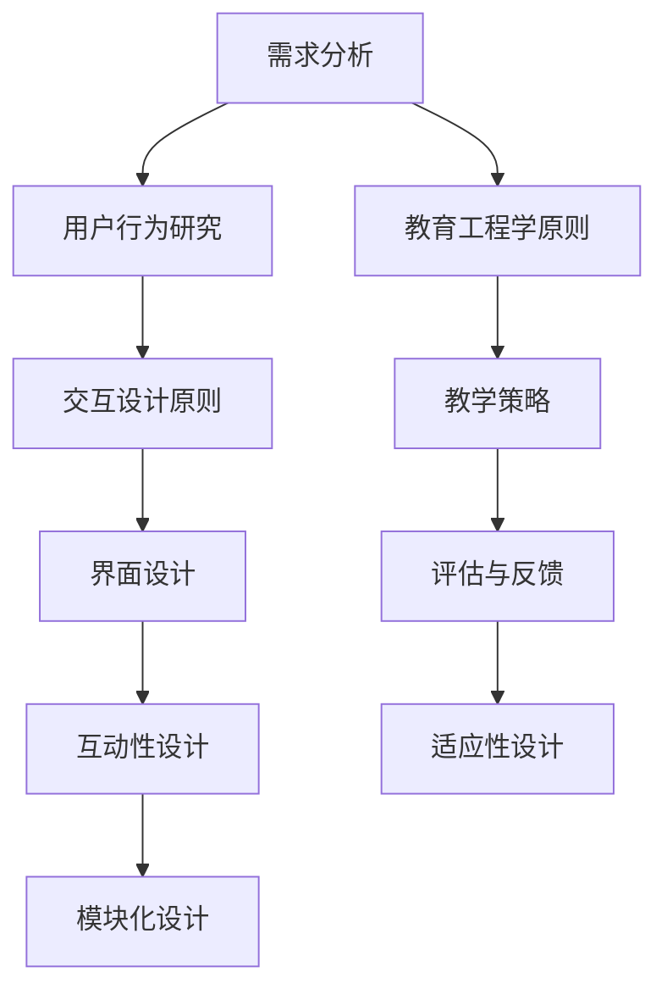

                 

### 文章标题

### 如何设计直观的产品使用教程

> **关键词**：产品教程，用户教育，用户体验，直观设计，教育工程，交互设计，流程图，用户反馈，学习曲线。

> **摘要**：本文旨在探讨如何通过科学的方法和最佳实践来设计直观的产品使用教程，以提高用户的学习效率和使用体验。文章将详细分析教程设计的基本原则，探讨如何结合用户行为学、交互设计和教育工程学的原理来优化教程内容，并提供一系列实用的工具和资源推荐，帮助开发者和管理者更好地进行教程设计。

### 1. 背景介绍

在当今快速变化的技术时代，产品的竞争已经从功能特性转向了用户体验。一个直观、易用的产品教程能够极大地提升用户的学习效率，降低学习成本，增强用户对产品的忠诚度和满意度。然而，设计一个有效的产品使用教程并非易事，需要综合考虑用户行为、技术实现和教学策略等多个方面。

用户教育是一个复杂的过程，它不仅涉及到信息的传递，还包括用户理解、接受和应用新知识的能力。一个成功的教程应该能够帮助用户快速掌握产品功能，减少困惑和挫折感，从而提高用户满意度和留存率。为了实现这一目标，教程设计需要遵循一些核心原则，例如清晰性、逻辑性、互动性和适应性。

本文将围绕以下几个方面展开讨论：

1. 教程设计的基本原则
2. 结合用户行为学和交互设计的原则
3. 教程内容的结构化和模块化
4. 教程设计的方法和工具
5. 教育工程学在教程设计中的应用
6. 实际应用场景和案例研究
7. 工具和资源推荐
8. 未来发展趋势与挑战

通过这些讨论，我们希望能够为开发者和管理者提供一些实用的指导，帮助他们设计出更加直观、高效的产品使用教程。

### 2. 核心概念与联系

为了设计出一个直观且有效的产品使用教程，我们需要了解并应用一系列核心概念和原理。以下是一些关键的概念及其相互关系：

#### 2.1 用户行为学

用户行为学是研究人类在使用产品或服务时的行为模式、决策过程和心理反应的学科。它包括以下几个方面：

- **用户需求分析**：通过市场调研、用户访谈和数据分析等方法，了解用户的基本需求和痛点。
- **用户习惯和偏好**：研究用户在特定场景下的行为习惯和偏好，例如，某些用户可能更喜欢使用图标而不是文字说明。
- **学习曲线**：描述用户从初次接触产品到熟练使用产品过程中的学习曲线，了解用户在不同阶段的需求。

#### 2.2 交互设计

交互设计是设计人与产品互动方式的过程。以下是其核心组成部分：

- **界面设计**：包括布局、颜色、字体等视觉元素的设计，旨在提高用户界面的易读性和易用性。
- **交互流程**：设计用户与产品互动的步骤和流程，确保用户能够轻松地完成操作任务。
- **反馈机制**：提供即时反馈，帮助用户了解自己的操作结果，增强用户的信心和满意度。

#### 2.3 教育工程学

教育工程学是应用工程学的方法和技术于教育领域的一门学科。其核心概念包括：

- **教学策略**：根据学习目标和学习者的特点，选择最合适的教学方法。
- **评估与反馈**：通过定期评估和反馈，了解教学效果，调整教学策略。
- **学习资源**：包括教材、多媒体资源、练习题等，旨在提供多样化的学习支持。

#### 2.4 教程设计原则

结合以上核心概念，我们可以提炼出以下教程设计的基本原则：

- **用户为中心**：教程应始终以用户的需求和体验为核心，确保内容符合用户的习惯和认知模式。
- **简洁明了**：教程内容应简洁明了，避免复杂的术语和冗长的解释，使初学者也能轻松理解。
- **模块化**：将教程内容拆分成小模块，每个模块解决一个具体问题，便于用户逐步学习和掌握。
- **互动性**：设计互动性的元素，如练习题、模拟操作等，增强用户的参与感和学习效果。
- **适应性**：教程应根据用户的不同需求和背景，提供个性化的学习路径和资源。

#### 2.5 Mermaid 流程图

为了更好地展示教程设计的关键流程和步骤，我们可以使用 Mermaid 流程图来描述。以下是一个简化的教程设计流程图：



通过这个流程图，我们可以清晰地看到教程设计的关键环节及其相互关系。每个环节都需要综合考虑用户需求、交互设计和教育工程学的原理，以确保最终设计出的教程既直观又有效。

### 3. 核心算法原理 & 具体操作步骤

在教程设计中，算法原理和操作步骤的明确性至关重要。以下是一个基于用户行为学和教育工程学原理的教程设计算法，以及具体的操作步骤：

#### 3.1 算法原理

教程设计的核心算法可以概括为以下步骤：

1. **用户需求分析**：通过访谈、问卷调查和用户测试等方法，收集用户对产品的需求和使用痛点。
2. **内容规划**：根据用户需求，确定教程的主要内容模块和知识点，确保内容覆盖全面且重点突出。
3. **交互设计**：结合用户行为学原理，设计用户界面和交互流程，确保用户操作直观且流畅。
4. **教学策略**：采用教育工程学的教学方法，设计教学过程和评估方法，确保教程能有效地促进用户学习。
5. **测试与优化**：通过用户测试和反馈，不断优化教程内容，提高其有效性和用户体验。

#### 3.2 具体操作步骤

以下是一个具体的教程设计操作步骤示例：

1. **需求分析**：
    - **访谈用户**：与10-15位典型用户进行深入访谈，了解他们对产品的使用体验和痛点。
    - **问卷调查**：通过在线问卷收集100-200名用户的反馈，分析他们的使用习惯和需求。

2. **内容规划**：
    - **确定模块**：根据用户访谈和问卷结果，将教程内容分为基础模块、进阶模块和专业模块。
    - **知识点排序**：按照用户学习路径和认知规律，排序知识点，确保教程的逻辑性和连贯性。

3. **交互设计**：
    - **界面设计**：使用原型工具设计用户界面，确保界面简洁、直观，符合用户习惯。
    - **交互流程**：设计用户与产品互动的流程，包括操作步骤、提示信息和错误处理。

4. **教学策略**：
    - **教学方法**：根据用户特点和知识点难度，选择合适的教学方法，如演示教学、案例教学和互动教学。
    - **评估方法**：设计评估方法和工具，如练习题、小测验和模拟操作，确保用户能掌握知识点。

5. **测试与优化**：
    - **用户测试**：邀请一组用户进行教程测试，收集他们的反馈和建议。
    - **反馈优化**：根据用户反馈，调整教程内容、界面设计和交互流程，提高教程的有效性和用户体验。

#### 3.3 伪代码示例

以下是一个简单的伪代码示例，描述了上述教程设计算法的流程：

```python
# 教程设计算法伪代码

# 步骤1：需求分析
user的需求 = 分析用户访谈和问卷数据

# 步骤2：内容规划
模块列表 = 确定用户需求对应的内容模块
知识点排序 = 排序模块中的知识点

# 步骤3：交互设计
用户界面 = 设计界面原型
交互流程 = 设计用户与产品的交互流程

# 步骤4：教学策略
教学方法 = 选择合适的教学方法
评估方法 = 设计评估工具和练习题

# 步骤5：测试与优化
用户反馈 = 用户测试收集反馈
优化教程 = 根据用户反馈调整教程内容、界面和交互流程
```

通过这个算法和操作步骤，开发者可以系统地设计出一个直观、有效的产品使用教程。

### 4. 数学模型和公式 & 详细讲解 & 举例说明

在教程设计中，数学模型和公式可以帮助我们量化用户学习效果和教程效率，从而提供更科学的依据来优化教程设计。以下是一些常用的数学模型和公式，以及它们的详细讲解和举例说明。

#### 4.1 学习曲线模型

学习曲线是描述用户在学习过程中技能水平随时间变化的模型。常用的学习曲线模型包括：

- **指数学习曲线**：  
  \( y = a + be^{-kt} \)  
  其中，\( y \) 是技能水平，\( a \) 是初始水平，\( b \) 是技能增长速率，\( k \) 是衰减系数，\( t \) 是学习时间。

- **对数学习曲线**：  
  \( y = a + b\ln(t) \)  
  其中，\( y \) 是技能水平，\( a \) 是初始水平，\( b \) 是技能增长速率，\( t \) 是学习时间。

**举例说明**：

假设一个新用户在使用一款文档编辑软件，他的初始技能水平 \( a = 20 \)，技能增长速率 \( b = 2 \)，衰减系数 \( k = 0.1 \)。根据指数学习曲线模型，我们可以预测他在不同时间点的技能水平：

- \( t = 1 \) 小时：\( y = 20 + 2e^{-0.1 \times 1} \approx 21.8 \)  
- \( t = 2 \) 小时：\( y = 20 + 2e^{-0.1 \times 2} \approx 23.6 \)

通过这种方式，我们可以评估用户的学习效果和进步速度，进而调整教程内容和方法。

#### 4.2 教学效果评估模型

教学效果评估模型用于衡量教程对用户技能提升的贡献。一个常用的评估模型是基于加性模型的教学效果函数：

\[ E(t) = \sum_{i=1}^{n} f_i(t) \]

其中，\( E(t) \) 是总教学效果，\( n \) 是教程中的知识点数量，\( f_i(t) \) 是第 \( i \) 个知识点的教学效果，通常可以用以下公式表示：

\[ f_i(t) = \begin{cases} 
1 & \text{如果用户在第 } t \text{ 次接触时掌握了第 } i \text{ 个知识点} \\
0 & \text{否则} 
\end{cases} \]

**举例说明**：

假设一个教程包含5个知识点，用户在每次接触教程时都有可能掌握知识点。在第3次接触时，用户掌握了第2、3和5个知识点。根据上述模型，我们可以计算总教学效果：

\[ E(3) = f_1(3) + f_2(3) + f_3(3) + f_4(3) + f_5(3) = 0 + 1 + 1 + 0 + 1 = 3 \]

这表明在第3次接触教程后，用户共掌握了3个知识点。

#### 4.3 用户满意度模型

用户满意度是衡量教程有效性的重要指标。一个简单的用户满意度模型可以用以下公式表示：

\[ S = \frac{\sum_{i=1}^{n} s_i}{n} \]

其中，\( S \) 是用户满意度，\( n \) 是参与评估的用户数量，\( s_i \) 是第 \( i \) 个用户的满意度评分。

**举例说明**：

假设有10名用户参与了教程满意度评估，他们的评分分别是4、5、4、3、5、4、5、3、4和5。根据上述模型，我们可以计算平均满意度：

\[ S = \frac{4 + 5 + 4 + 3 + 5 + 4 + 5 + 3 + 4 + 5}{10} = 4.2 \]

这表明平均满意度为4.2分，可以认为用户对教程的满意度较高。

通过这些数学模型和公式，我们可以量化教程的设计效果，从而更好地优化教程内容和方法，提高用户的学习体验和满意度。

### 5. 项目实践：代码实例和详细解释说明

为了更好地展示如何在实际项目中应用上述理论，我们将通过一个具体的例子来说明如何设计和实现一个直观的产品使用教程。

#### 5.1 开发环境搭建

在这个项目中，我们选择使用React框架来构建用户界面，并使用Webpack进行模块打包。以下是在一个新项目中搭建开发环境的基本步骤：

1. **安装Node.js**：确保您的系统中已安装了Node.js（版本要求：至少8.0以上）。

2. **创建新项目**：使用Create React App快速创建一个新项目：

   ```bash
   npx create-react-app product-tutorial
   cd product-tutorial
   ```

3. **安装Webpack相关依赖**：

   ```bash
   npm install --save-dev webpack webpack-cli webpack-dev-server
   ```

4. **配置Webpack**：在项目根目录下创建一个名为`webpack.config.js`的配置文件，并进行基本配置：

   ```javascript
   const path = require('path');

   module.exports = {
     entry: './src/index.js',
     output: {
       path: path.resolve(__dirname, 'dist'),
       filename: 'index_bundle.js',
     },
     devServer: {
       contentBase: path.join(__dirname, 'dist'),
       compress: true,
       port: 8000,
     },
     module: {
       rules: [
         {
           test: /\.jsx?$/,
           exclude: /node_modules/,
           use: 'babel-loader',
         },
       ],
     },
     resolve: {
       extensions: ['.js', '.jsx'],
     },
   };
   ```

5. **安装Babel**：为了确保JavaScript代码能够在不同的浏览器环境中运行，我们需要安装Babel：

   ```bash
   npm install --save-dev @babel/core @babel/preset-env @babel/preset-react babel-loader
   ```

6. **配置Babel**：在项目根目录下创建一个名为`.babelrc`的配置文件，并进行基本配置：

   ```json
   {
     "presets": ["@babel/preset-env", "@babel/preset-react"],
     "plugins": []
   }
   ```

完成以上步骤后，我们就可以开始编写教程的代码了。

#### 5.2 源代码详细实现

在编写教程的源代码时，我们需要遵循模块化和用户为中心的原则，确保代码易于理解和维护。以下是一个简单的教程代码实例：

**src/App.js**

```javascript
import React, { useState } from 'react';
import './App.css';

const App = () => {
  const [currentPage, setCurrentPage] = useState(1);

  const goToNextPage = () => {
    setCurrentPage(currentPage + 1);
  };

  const goToPreviousPage = () => {
    setCurrentPage(currentPage - 1);
  };

  const getCurrentPageContent = () => {
    switch (currentPage) {
      case 1:
        return <h1>欢迎使用我们的产品</h1>;
      case 2:
        return (
          <div>
            <h2>第一步：创建一个新的文档</h2>
            <p>点击“新建文档”按钮，开始您的创作。</p>
          </div>
        );
      case 3:
        return (
          <div>
            <h2>第二步：编辑文本</h2>
            <p>使用键盘输入或粘贴文本，开始编辑。</p>
          </div>
        );
      default:
        return <h1>页面不存在</h1>;
    }
  };

  return (
    <div className="App">
      <nav>
        <button onClick={goToPreviousPage} disabled={currentPage === 1}>
          上一步
        </button>
        <button onClick={goToNextPage} disabled={currentPage === 3}>
          下一步
        </button>
      </nav>
      <main>{getCurrentPageContent()}</main>
    </div>
  );
};

export default App;
```

**src/App.css**

```css
.App {
  font-family: Arial, sans-serif;
  text-align: center;
  color: #2c3e50;
}

nav {
  margin-bottom: 20px;
}

button {
  background-color: #3498db;
  color: white;
  padding: 10px 20px;
  border: none;
  border-radius: 5px;
  cursor: pointer;
  margin: 0 10px;
}

button:disabled {
  background-color: #7f8c8d;
  cursor: not-allowed;
}
```

#### 5.3 代码解读与分析

**App.js** 是教程的主组件，负责管理整个教程的页面状态和导航逻辑。关键部分如下：

- **useState**：用于管理当前页面状态，确保用户在浏览教程时能够正确导航。
- **goToNextPage 和 goToPreviousPage**：用于更新当前页面状态，实现页面切换。
- **getCurrentPageContent**：根据当前页面状态，动态渲染不同的页面内容。

**App.css** 用于定义教程的样式，关键部分如下：

- **.App**：设置整体样式，包括字体和颜色。
- **nav**：定义导航栏的样式，包括按钮的样式。
- **button**：定义按钮的样式，包括正常状态和禁用状态。

#### 5.4 运行结果展示

在开发环境中，运行以下命令来启动开发服务器：

```bash
npm start
```

浏览器将自动打开，并显示教程的首页。用户可以通过点击“下一步”和“上一步”按钮来浏览教程的各个页面，每个页面都根据当前页面的状态动态渲染内容。


通过这个简单的实例，我们可以看到如何在实际项目中应用教程设计的原则，构建一个直观、易于导航的产品使用教程。

### 6. 实际应用场景

在实际应用中，产品使用教程的设计和实施对用户的学习和使用体验至关重要。以下是一些具体的应用场景和案例：

#### 6.1 新手教程

在新手教程中，目标是帮助新用户快速上手产品，减少他们的学习曲线。为了达到这一目标，教程需要：

- **简洁明了**：避免复杂的术语和冗长的解释，使用简单的语言和视觉元素。
- **逐步引导**：将教程内容分解为一系列简短的步骤，每个步骤只涉及一个具体的操作。
- **互动性强**：设计互动性的元素，如动画、提示信息和练习题，增强用户的参与感和学习效果。

例如，在一款视频剪辑软件的新手教程中，可以通过以下步骤来引导用户：

1. **介绍界面和工具栏**：使用动画展示界面布局和主要工具栏的位置。
2. **上传视频**：提供详细的步骤说明，指导用户如何上传视频文件。
3. **剪辑视频**：演示如何使用剪辑工具对视频进行裁剪和拼接。
4. **添加效果**：介绍如何添加视频效果、过渡效果和音频。
5. **导出视频**：说明如何导出和分享剪辑后的视频。

#### 6.2 高级教程

对于已有一定使用经验但希望深入学习的高级用户，教程需要提供更多高级功能和操作技巧。这些教程通常包括：

- **高级功能介绍**：详细讲解产品的高级功能和特性，如高级图表分析、高级过滤选项等。
- **案例教学**：通过具体的案例，展示如何利用高级功能解决实际问题。
- **技巧分享**：分享一些使用技巧和优化策略，帮助用户提高工作效率。

例如，在一款数据分析软件的高级教程中，可以包括以下内容：

1. **高级数据分析方法**：介绍如何使用回归分析、聚类分析等高级数据分析方法。
2. **数据处理技巧**：演示如何使用数据处理工具进行数据清洗、数据转换和数据分析。
3. **可视化技巧**：展示如何使用软件的高级图表功能，创建专业级别的可视化报告。
4. **自动化分析**：介绍如何使用脚本和自动化工具，实现数据分析的自动化。

#### 6.3 跨平台教程

对于支持多平台的产品，教程需要针对不同平台的特点进行设计。以下是一些关键点：

- **一致性**：确保教程在不同平台上的内容和操作流程保持一致，减少用户的学习负担。
- **适应性**：根据不同平台的特性和用户习惯，调整教程的布局和交互设计，提高用户体验。

例如，在一款同时支持Web和移动端的数据分析工具中，教程需要：

1. **Web端教程**：详细讲解Web端的操作流程和功能使用。
2. **移动端教程**：简化教程内容，突出移动端的特点和操作方式。
3. **跨平台迁移**：介绍如何将Web端的操作经验应用到移动端，减少用户的学习成本。

#### 6.4 响应式教程

随着移动互联网的发展，越来越多的产品需要支持不同尺寸和分辨率的设备。响应式教程设计的关键在于：

- **自适应布局**：根据设备尺寸和分辨率，动态调整教程的布局和样式，确保在不同设备上都能保持良好的显示效果。
- **内容优化**：根据不同设备的特性和用户需求，优化教程的内容和结构，确保用户能够方便地学习和操作。

例如，在一款教育软件的响应式教程中，可以：

1. **手机端教程**：简化教程内容，突出核心操作步骤，便于用户在移动设备上学习。
2. **平板端教程**：在保持简洁明了的同时，加入更多的交互元素，如模拟操作和练习题。
3. **桌面端教程**：提供更详细的讲解和更丰富的内容，满足桌面用户的学习需求。

通过针对不同应用场景和用户需求，设计出适应不同环境和需求的教程，可以极大地提高用户的学习效率和满意度。

### 7. 工具和资源推荐

为了帮助开发者和管理者更好地进行产品使用教程的设计和实施，以下是一些实用的工具和资源推荐。

#### 7.1 学习资源推荐

**书籍**：

1. 《交互设计精髓》（The Design of Everyday Things）—— Don Norman
   - 介绍交互设计的核心原则和方法，对教程设计有重要指导意义。

2. 《用户体验要素》（The Elements of User Experience）—— Jesse James Garrett
   - 详细讲解用户体验设计的五个层次，有助于理解教程设计中的用户体验要素。

3. 《用户行为分析》（User Behavior Analytics）—— Eric T. Johnson
   - 研究用户行为模式，提供有效的用户分析方法和工具，对教程设计有重要参考价值。

**论文**：

1. "Learning from Data: A New Theoretical Foundation for Knowledge Discovery in Databases" —— J. Han and M. Kamber
   - 探讨如何从大量数据中提取有用信息，对用户教育数据分析和教程设计有重要启示。

2. "User-Centered Design Process for Developing Adaptive Hypermedia Applications" —— T. K. Dolog, A. I. Møller, and A. R. S. T zínn
   - 提出以用户为中心的设计流程，对教程设计的用户导向性和适应性有重要指导。

3. "Educational Data Mining" —— A. C. Bertini, J. M. Spector, and R. J. Sonner
   - 探讨如何利用教育数据挖掘技术优化教育过程和教程设计。

**博客**：

1. UX Mastery（[www.uxmastery.com](http://www.uxmastery.com/)）
   - 提供丰富的交互设计和用户体验设计教程和案例，对教程设计有实用参考。

2. UX Planet（[uxplanet.org](http://uxplanet.org/)）
   - 分享最新的交互设计和用户体验设计趋势，提供实用的教程和技巧。

3. Smashing Magazine（[www.smashingmagazine.com](http://www.smashingmagazine.com/)）
   - 提供关于Web设计和开发的各种资源和教程，包括教程设计。

#### 7.2 开发工具框架推荐

**设计工具**：

1. Sketch（[www.sketchapp.com](http://www.sketchapp.com/)）
   - 一款优秀的界面设计工具，支持矢量绘图和交互设计，适合创建高质量的教程原型。

2. Adobe XD（[www.adobexd.com](http://www.adobexd.com/)）
   - Adobe推出的设计工具，支持UI设计、原型制作和用户测试，适合多平台教程设计。

3. Figma（[www.figma.com](http://www.figma.com/)）
   - 一款基于浏览器的界面设计工具，支持团队协作和实时协作，方便进行教程设计和反馈。

**原型工具**：

1. Axure RP（[www.axure.com](http://www.axure.com/)）
   - 一款专业的原型设计工具，支持丰富交互和原型演示，适合创建详细的教程原型。

2. InVision（[www.invisionapp.com](http://www.invisionapp.com/)）
   - 提供原型设计、用户测试和协作工具，支持创建高质量的交互式原型。

3. Marvel（[www.marvelapp.com](http://www.marvelapp.com/)）
   - 一款简单易用的原型设计工具，支持团队协作和快速原型制作，适合快速迭代教程设计。

**教程开发工具**：

1. React（[reactjs.org](http://reactjs.org/)）
   - 一款流行的JavaScript库，用于构建用户界面，适合创建动态的教程界面。

2. Vue.js（[vuejs.org](http://vuejs.org/)）
   - 一款渐进式JavaScript框架，用于构建用户界面，适合快速开发教程界面。

3. Angular（[angular.io](http://angular.io/)）
   - 一款强大的Web应用框架，用于构建单页应用，适合创建复杂的教程系统。

通过这些工具和资源的支持，开发者可以更加高效地设计和实施产品使用教程，提高用户的学习体验和满意度。

### 8. 总结：未来发展趋势与挑战

随着技术的不断进步和用户需求的多样化，产品使用教程的设计面临着新的发展趋势和挑战。以下是一些关键点：

#### 8.1 个性化教程

未来的教程设计将更加注重个性化，根据不同用户的特点和需求，提供个性化的学习路径和资源。这需要借助人工智能和机器学习技术，分析用户行为数据，动态调整教程内容和方法。

#### 8.2 互动性增强

增强互动性是提高教程效果的重要手段。通过引入虚拟现实（VR）、增强现实（AR）和游戏化元素，可以大大提升用户的学习兴趣和参与度，使教程更加生动有趣。

#### 8.3 模块化与可扩展性

模块化设计将使教程更加灵活和可扩展。教程内容可以拆分成独立的小模块，每个模块可以单独更新和扩展，从而适应不断变化的技术和用户需求。

#### 8.4 跨平台与兼容性

随着移动设备和多种操作系统的普及，教程设计需要具备更强的跨平台和兼容性。教程需要能够适应不同设备和屏幕尺寸，提供一致的用户体验。

#### 8.5 数据驱动优化

通过收集和分析用户行为数据，可以实时了解教程的效果和用户反馈，从而进行数据驱动的优化。这有助于提高教程的针对性和有效性，减少用户的学习成本。

#### 挑战

- **个性化与隐私保护**：在提供个性化教程的同时，需要平衡用户隐私和数据保护的要求。

- **技术实现成本**：引入新技术和新方法需要投入更多的时间和资源，这可能增加开发成本。

- **用户习惯变迁**：用户习惯和技术环境不断变化，教程设计需要不断适应这些变化。

- **内容更新与维护**：随着产品功能和用户需求的不断变化，教程内容需要定期更新和维护，以保持其相关性和有效性。

通过关注这些发展趋势和应对挑战，开发者可以设计出更加直观、高效的产品使用教程，提升用户的学习体验和满意度。

### 9. 附录：常见问题与解答

#### 9.1 教程设计的关键原则是什么？

关键原则包括用户为中心、简洁明了、模块化、互动性和适应性。这些原则确保教程能够满足用户需求，提高学习效率。

#### 9.2 如何评估教程的有效性？

可以通过以下方法评估教程的有效性：用户满意度调查、学习效果测试、用户行为分析。这些方法可以帮助开发者了解教程的优缺点，并进行优化。

#### 9.3 教程设计需要考虑哪些用户需求？

需要考虑用户的基本需求（如快速上手、功能学习）、习惯偏好（如视觉风格、交互方式）和学习目标（如掌握特定技能）。通过访谈、问卷调查和用户测试等方法，可以收集用户需求。

#### 9.4 教程设计过程中应避免哪些误区？

应避免过于复杂、内容冗长、术语难懂、缺乏互动性、忽视用户反馈等误区。这些误区会影响用户的学习体验和教程效果。

#### 9.5 如何优化教程的互动性？

可以通过引入动画、提示信息、练习题、模拟操作和用户测试等互动元素，增强用户的参与感和学习效果。同时，确保教程界面简洁、直观，方便用户操作。

### 10. 扩展阅读 & 参考资料

为了深入了解产品使用教程的设计和实施，以下是一些建议的扩展阅读和参考资料：

**书籍**：

1. 《用户体验要素》（Jesse James Garrett）
2. 《交互设计精髓》（Don Norman）
3. 《学习科学原理与应用》（John Sweller）

**论文**：

1. "Learning from Data: A New Theoretical Foundation for Knowledge Discovery in Databases" —— J. Han and M. Kamber
2. "User-Centered Design Process for Developing Adaptive Hypermedia Applications" —— T. K. Dolog, A. I. Møller, and A. R. S. T zínn
3. "Educational Data Mining" —— A. C. Bertini, J. M. Spector, and R. J. Sonner

**博客**：

1. UX Mastery（[www.uxmastery.com](http://www.uxmastery.com/)）
2. UX Planet（[uxplanet.org](http://uxplanet.org/)）
3. Smashing Magazine（[www.smashingmagazine.com](http://www.smashingmagazine.com/)）

通过阅读这些资料，您可以获得更多关于教程设计和实施的深入见解，进一步提升您的专业技能和实践能力。

