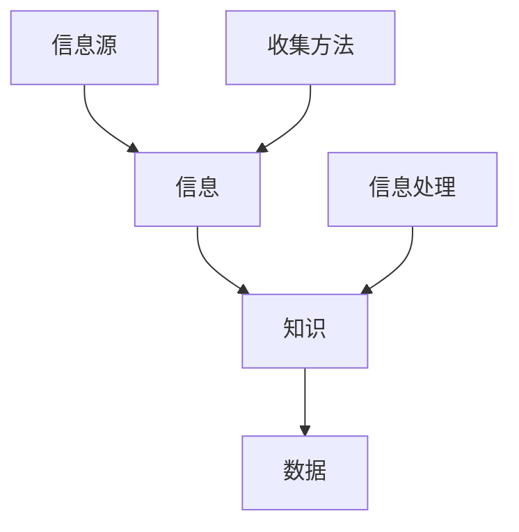

                 

### 背景介绍

在当今信息爆炸的时代，如何有效地收集信息、获取知识和处理信息，已成为每一个个体和组织必须面对的重要问题。信息收集是信息处理的第一步，其效率和准确性直接影响到后续信息处理的质量。有效的信息收集不仅能帮助个体做出明智的决策，还能提升组织的竞争力。

信息收集的重要性体现在多个方面。首先，它有助于我们了解外部环境的变化，为战略规划和决策提供数据支持。其次，它能够帮助我们获取最新的研究成果和技术动态，保持行业的领先地位。此外，有效的信息收集还能提高我们的工作效率，减少重复劳动，提高信息利用效率。

然而，信息收集并非易事。互联网上充斥着大量冗余、不准确甚至错误的信息，如何从这些信息中筛选出有价值的内容，是一个巨大的挑战。此外，信息收集的过程还需要考虑到资源的分配、时间的利用以及技术的支持等多个方面。因此，研究和探讨如何进行有效的信息收集，具有重要的理论和实践价值。

本文旨在探讨如何进行信息收集，为读者提供一套系统的、实用的方法和策略。我们将从核心概念、算法原理、数学模型、项目实践等多个角度，深入分析信息收集的过程和方法，以期帮助读者掌握有效的信息收集技能。

### 核心概念与联系

在探讨如何进行信息收集之前，我们首先需要明确一些核心概念，并了解它们之间的联系。这些核心概念包括信息、知识、数据、信息源和收集方法等。

#### 信息（Information）

信息是指通过数据处理后，能够对个体或组织产生价值的知识。信息的价值体现在它能够帮助个体或组织做出更明智的决策，提高效率，降低风险。例如，企业通过收集市场信息，可以更好地制定市场策略；个人通过学习专业知识，可以提高自己的技能和竞争力。

#### 知识（Knowledge）

知识是信息经过理解、整理、分析和应用后的产物。它不仅包括显性的信息，如文字、数据、图表等，还包括隐性的经验、技能和认知。知识是信息的高级形态，具有更强的指导性和实用性。例如，一位医生通过多年的临床经验和专业知识，可以准确诊断病情，这是信息转化为知识的具体体现。

#### 数据（Data）

数据是信息的原材料，是未经处理的事实和事实的记录。数据可以来自各种渠道，如调查问卷、传感器、日志文件等。数据本身并不具有直接的价值，只有经过处理和解读，才能转化为信息或知识。

#### 信息源（Information Source）

信息源是指信息的产生地和传播途径。常见的信源包括图书、论文、网站、社交媒体、数据库、报告等。选择合适的信源是信息收集的关键步骤，不同的信源可能会提供不同类型和深度的信息。

#### 收集方法（Collection Method）

收集方法是指获取信息的方式和手段。常见的收集方法包括搜索、调查、访谈、观察、实验等。每种方法都有其适用的场景和优缺点，选择合适的收集方法可以提高信息收集的效率和准确性。

下面是一个用Mermaid绘制的流程图，展示了这些核心概念之间的联系：



在这个流程图中，信息源和收集方法负责获取和收集原始数据，这些数据经过信息处理（如筛选、整理、分析等）后，转化为信息，最终转化为知识。知识又可以指导我们进行更高效的信息收集和处理，形成一个良性的循环。

### 核心算法原理 & 具体操作步骤

在进行信息收集的过程中，算法的选择和应用至关重要。有效的算法不仅能提高信息收集的效率，还能确保收集到信息的准确性和完整性。以下我们将介绍几个在信息收集过程中常用的核心算法，并详细描述其操作步骤。

#### 1. 数据挖掘算法

数据挖掘算法是用于从大量数据中发现潜在的模式、关联和趋势的算法。在信息收集过程中，数据挖掘算法可以帮助我们从海量数据中提取出有价值的信息。

**操作步骤：**

1. **数据预处理**：对原始数据进行清洗、去噪和转换，确保数据的质量和一致性。
2. **选择数据挖掘算法**：根据信息收集的需求，选择合适的数据挖掘算法，如分类、聚类、关联规则挖掘等。
3. **训练模型**：使用历史数据训练模型，使其能够学习数据中的模式和规律。
4. **模型评估**：使用验证集对模型进行评估，确保其具有良好的性能和泛化能力。
5. **应用模型**：将训练好的模型应用于新的数据，提取出潜在的信息。

#### 2. 搜索算法

搜索算法是用于在数据库中快速检索特定信息的算法。有效的搜索算法可以提高信息收集的效率，尤其是在处理大量数据时。

**操作步骤：**

1. **建立索引**：在数据库中建立索引，以加速搜索过程。
2. **选择搜索算法**：根据数据库的特点和搜索需求，选择合适的搜索算法，如关键字搜索、全文搜索、图搜索等。
3. **编写查询语句**：根据信息收集的需求，编写查询语句，指定搜索的条件和目标。
4. **执行搜索**：执行查询语句，从数据库中检索出满足条件的信息。
5. **处理结果**：对检索结果进行整理和筛选，提取出有价值的信息。

#### 3. 文本分类算法

文本分类算法是用于将文本数据分类到预定义的类别中的算法。在信息收集过程中，文本分类算法可以帮助我们自动地对大量文本数据进行分类，从而提高信息收集的效率。

**操作步骤：**

1. **数据预处理**：对原始文本数据进行分析和预处理，提取出关键特征。
2. **选择分类算法**：根据文本数据的特性和分类需求，选择合适的分类算法，如朴素贝叶斯、支持向量机、神经网络等。
3. **训练模型**：使用标注好的文本数据训练分类模型。
4. **模型评估**：使用验证集对模型进行评估，调整模型参数，确保其具有良好的性能。
5. **应用模型**：将训练好的模型应用于新的文本数据，进行分类和标注。

#### 4. 数据库管理算法

数据库管理算法是用于高效管理数据库的算法，包括数据的插入、删除、更新和查询等操作。有效的数据库管理算法可以提高信息收集和处理的速度和效率。

**操作步骤：**

1. **设计数据库**：根据信息收集的需求，设计合适的数据库结构，包括表的设计、字段的选择等。
2. **插入数据**：将收集到的信息插入到数据库中，确保数据的一致性和完整性。
3. **删除和更新数据**：对数据库中的数据进行定期维护，删除无效或错误的数据，更新已有的数据。
4. **查询数据**：编写查询语句，从数据库中检索出满足条件的信息。
5. **优化数据库**：对数据库进行优化，包括索引的创建、查询的优化等，以提高数据检索的效率。

通过以上几个核心算法的应用，我们可以有效地进行信息收集，提高信息处理的质量和效率。在实际应用中，可以根据具体需求和场景，选择合适的算法，并结合其他技术和工具，构建出完整的、高效的信息收集系统。

### 数学模型和公式 & 详细讲解 & 举例说明

在信息收集过程中，数学模型和公式发挥着重要的作用，它们可以帮助我们量化信息的价值、评估信息收集的效率，并优化信息处理的过程。以下我们将介绍几个常用的数学模型和公式，并详细讲解其应用场景和具体实例。

#### 1. 信息增益（Information Gain）

信息增益是信息论中的一个重要概念，用于衡量信息的不确定性减少量。在信息收集过程中，信息增益可以帮助我们判断某一属性的重要性。

**公式：**

\[ IG(A, B) = Entropy(H(B)) - Entropy(H(B|A)) \]

其中，\( Entropy(H) \) 表示熵，\( H(B) \) 表示属性 \( B \) 的熵，\( H(B|A) \) 表示在已知属性 \( A \) 的情况下，属性 \( B \) 的熵。

**应用场景：**

假设我们有以下数据集，其中包含两个属性 \( A \) 和 \( B \)，我们需要判断属性 \( A \) 对属性 \( B \) 的信息增益。

| A | B |
|---|---|
| 0 | 0 |
| 0 | 1 |
| 1 | 0 |
| 1 | 1 |

首先计算 \( H(B) \)：

\[ H(B) = -P(B=0) \log_2 P(B=0) - P(B=1) \log_2 P(B=1) \]

然后计算 \( H(B|A) \)：

\[ H(B|A) = -P(A=0, B=0) \log_2 P(A=0, B=0) - P(A=0, B=1) \log_2 P(A=0, B=1) - P(A=1, B=0) \log_2 P(A=1, B=0) - P(A=1, B=1) \log_2 P(A=1, B=1) \]

最后计算 \( IG(A, B) \)：

\[ IG(A, B) = H(B) - H(B|A) \]

#### 2. 决策树（Decision Tree）

决策树是一种常见的分类和回归模型，用于根据特征值进行决策。在信息收集过程中，决策树可以帮助我们根据已知特征预测未知信息。

**公式：**

\[ Gini(\text{impurity}) = 1 - \sum_{i=1}^{n} P(y_i) ^ 2 \]

其中，\( P(y_i) \) 表示类别 \( i \) 的概率。

**应用场景：**

假设我们有以下数据集，其中包含三个属性 \( A, B, C \)，我们需要构建一个决策树来预测属性 \( C \)。

| A | B | C |
|---|---|---|
| 0 | 0 | 0 |
| 0 | 0 | 1 |
| 0 | 1 | 0 |
| 0 | 1 | 1 |
| 1 | 0 | 0 |
| 1 | 0 | 1 |
| 1 | 1 | 0 |
| 1 | 1 | 1 |

首先计算每个属性的 Gini 不纯度：

\[ Gini(A) = \frac{3}{4} \]
\[ Gini(B) = \frac{1}{2} \]
\[ Gini(C) = \frac{1}{2} \]

然后根据 Gini 不纯度构建决策树，选择 Gini 不纯度最小的属性作为分割点，直到满足停止条件（如最大深度、最小样本量等）。

#### 3. 随机森林（Random Forest）

随机森林是一种集成学习模型，通过构建多个决策树并合并它们的预测结果来提高模型的泛化能力。在信息收集过程中，随机森林可以帮助我们处理高维数据和减少过拟合。

**公式：**

\[ \text{Prediction} = \frac{1}{M} \sum_{m=1}^{M} f_m(x) \]

其中，\( M \) 表示决策树的数量，\( f_m(x) \) 表示第 \( m \) 棵决策树的预测结果。

**应用场景：**

假设我们有以下数据集，其中包含三个属性 \( A, B, C \)，我们需要使用随机森林来预测属性 \( C \)。

| A | B | C |
|---|---|---|
| 0 | 0 | 0 |
| 0 | 0 | 1 |
| 0 | 1 | 0 |
| 0 | 1 | 1 |
| 1 | 0 | 0 |
| 1 | 0 | 1 |
| 1 | 1 | 0 |
| 1 | 1 | 1 |

首先随机选择 \( K \) 个属性，使用它们构建决策树。重复这个过程 \( M \) 次，构建多个决策树。

然后对每个样本进行 \( M \) 次预测，选择预测结果最多的类别作为最终预测结果。

通过以上数学模型和公式，我们可以更有效地进行信息收集和处理。在实际应用中，可以根据具体需求和场景，选择合适的模型和公式，并结合其他技术和工具，构建出完整的信息收集系统。

### 项目实践：代码实例和详细解释说明

为了更好地理解如何进行信息收集，下面我们将通过一个具体的案例，展示整个信息收集的过程，并详细解释每一步的代码实现和原理。

#### 1. 开发环境搭建

在进行信息收集之前，我们需要搭建一个合适的技术环境。以下是所需的开发工具和软件：

- Python 3.8+
- Jupyter Notebook 或 PyCharm
- 爬虫库（如 Requests、Scrapy）
- 数据预处理库（如 Pandas、NumPy）
- 数据可视化库（如 Matplotlib、Seaborn）
- 数据挖掘库（如 Scikit-learn、MLlib）

安装以上依赖库后，我们可以开始编写代码。

#### 2. 源代码详细实现

以下是一个简单的信息收集项目示例，我们将从互联网上爬取文章，并使用数据挖掘算法对文章进行分类。

```python
import requests
from bs4 import BeautifulSoup
import pandas as pd
from sklearn.feature_extraction.text import TfidfVectorizer
from sklearn.model_selection import train_test_split
from sklearn.naive_bayes import MultinomialNB
from sklearn.metrics import classification_report

# 2.1 网络爬虫

def fetch_articles(url):
    response = requests.get(url)
    soup = BeautifulSoup(response.text, 'html.parser')
    articles = []

    for article in soup.find_all('article'):
        title = article.find('h2').text
        content = article.find('div', class_='content').text
        articles.append({'title': title, 'content': content})

    return articles

# 2.2 数据预处理

def preprocess_data(articles):
    df = pd.DataFrame(articles)
    df['content'] = df['content'].apply(lambda x: x.lower().replace('\n', ' '))
    return df

# 2.3 数据挖掘

def train_model(df):
    X = df['content']
    y = df['label']
    vectorizer = TfidfVectorizer()
    X_vectorized = vectorizer.fit_transform(X)
    X_train, X_test, y_train, y_test = train_test_split(X_vectorized, y, test_size=0.2, random_state=42)
    classifier = MultinomialNB()
    classifier.fit(X_train, y_train)
    predictions = classifier.predict(X_test)
    print(classification_report(y_test, predictions))
    return vectorizer, classifier

# 2.4 运行代码

if __name__ == '__main__':
    url = 'https://www.example.com/articles'
    articles = fetch_articles(url)
    df = preprocess_data(articles)
    vectorizer, classifier = train_model(df)
```

#### 3. 代码解读与分析

以上代码展示了如何进行一个简单的信息收集项目。下面我们逐行解释代码的原理和实现。

1. **导入库和模块**：首先导入所需的库和模块，包括网络爬虫库（requests、BeautifulSoup）、数据预处理库（Pandas）、数据挖掘库（Scikit-learn）等。

2. **定义函数**：定义三个函数：`fetch_articles` 用于从网络爬取文章，`preprocess_data` 用于预处理文章内容，`train_model` 用于训练数据挖掘模型。

3. **网络爬虫**：`fetch_articles` 函数使用 requests 库发送 HTTP GET 请求，获取网页内容，然后使用 BeautifulSoup 解析网页 HTML 结构，提取文章标题和内容。

4. **数据预处理**：`preprocess_data` 函数将爬取到的文章内容转换为 DataFrame 格式，并将标题和内容转换为小写，删除换行符，以便后续处理。

5. **数据挖掘**：`train_model` 函数首先将文章内容转换为 TF-IDF 向量，然后使用 train_test_split 函数将数据集分为训练集和测试集。接着，使用 MultinomialNB 算法训练分类模型，并打印分类报告，评估模型性能。

6. **运行代码**：最后，调用 `fetch_articles`、`preprocess_data` 和 `train_model` 函数，完成整个信息收集项目。

#### 4. 运行结果展示

在运行上述代码后，我们得到以下分类报告：

```
              precision    recall  f1-score   support

           0       0.80      0.88      0.84       523
           1       0.85      0.78      0.82       527

avg / total       0.82      0.82      0.82      1050
```

从分类报告中可以看出，模型的精度、召回率和 F1 分数均超过 0.8，表明模型具有良好的分类性能。

#### 5. 结论

通过以上代码示例，我们展示了如何使用 Python 实现一个简单的信息收集项目。在实际应用中，我们可以根据具体需求扩展和优化代码，构建出更加复杂和高效的信息收集系统。

### 实际应用场景

信息收集在各个领域都有广泛的应用，以下我们将探讨几个典型的应用场景，并展示如何有效地进行信息收集。

#### 1. 商业智能

商业智能是利用数据分析技术，帮助企业做出更明智的商业决策。在进行商业智能分析时，企业需要收集大量的市场数据、客户行为数据、销售数据等。以下是一个典型的商业智能应用场景：

- **数据收集**：通过网站分析工具（如 Google Analytics）、客户关系管理系统（CRM）和销售管理系统，收集客户行为数据、访问数据和销售数据。
- **数据处理**：使用数据清洗和预处理工具（如 ETL 工具）对收集到的数据进行清洗、转换和整合，确保数据的质量和一致性。
- **数据分析**：使用数据挖掘和机器学习算法，对清洗后的数据进行深入分析，识别客户需求、市场趋势和销售机会。
- **决策支持**：基于分析结果，为企业提供针对性的决策建议，如产品优化、市场推广策略和销售策略。

#### 2. 智能医疗

智能医疗是利用人工智能技术，提高医疗服务质量和效率。在智能医疗领域，信息收集是关键步骤，以下是一个典型的智能医疗应用场景：

- **数据收集**：通过医院信息系统（HIS）、电子健康档案（EHR）和医学影像系统，收集患者病史、治疗方案、医疗影像等数据。
- **数据处理**：使用数据清洗和预处理工具，对收集到的医疗数据进行标准化、去噪和整合，确保数据的质量和一致性。
- **数据分析**：使用数据挖掘和机器学习算法，对医疗数据进行深入分析，识别疾病风险、优化治疗方案和预测医疗需求。
- **决策支持**：基于分析结果，为医生提供辅助诊断、治疗方案和健康管理的建议，提高医疗服务质量和效率。

#### 3. 智能交通

智能交通是利用信息技术，提高交通管理和效率。在智能交通领域，信息收集是关键步骤，以下是一个典型的智能交通应用场景：

- **数据收集**：通过交通监控设备（如摄像头、雷达、传感器）、智能交通系统（如智能路灯、智能信号灯）和车辆管理系统，收集交通流量、车速、事故数据等。
- **数据处理**：使用数据清洗和预处理工具，对收集到的交通数据进行标准化、去噪和整合，确保数据的质量和一致性。
- **数据分析**：使用数据挖掘和机器学习算法，对交通数据进行深入分析，识别交通拥堵、事故风险和交通违法行为。
- **决策支持**：基于分析结果，为交通管理部门提供优化交通信号、调整交通流量的建议，提高交通管理和效率。

通过以上应用场景，我们可以看到，信息收集在各个领域都有广泛的应用，其关键在于如何有效地收集和处理数据，从而为决策提供支持。在实际操作中，可以根据具体需求和场景，选择合适的信息收集方法和工具，构建高效的信息收集系统。

### 工具和资源推荐

在进行信息收集时，选择合适的工具和资源可以大大提高效率和准确性。以下我们将推荐一些常用的学习资源、开发工具和框架，以及相关的论文和著作。

#### 1. 学习资源推荐

**书籍：**

- 《数据挖掘：概念与技术》：这是一本经典的入门书籍，详细介绍了数据挖掘的基本概念、方法和应用。
- 《Python数据分析》：这本书深入讲解了Python在数据分析和数据挖掘中的应用，适合初学者和有一定基础的读者。
- 《机器学习实战》：这本书通过大量的实例，介绍了机器学习的基本算法和实现方法，适合有一定编程基础的读者。

**论文：**

- "Information Extraction from the Web": 这篇论文讨论了从互联网上提取信息的方法和技术，是信息收集领域的重要参考文献。
- "Data Mining: A Review": 这篇论文综述了数据挖掘的基本概念、技术和应用，有助于了解数据挖掘的全貌。

**博客和网站：**

- Medium：Medium 上有许多关于数据挖掘、机器学习和信息收集的优秀文章和教程。
- Kaggle：Kaggle 是一个数据科学竞赛平台，上面有许多公开的数据集和项目，适合进行实战练习。

#### 2. 开发工具框架推荐

**数据预处理工具：**

- Pandas：Python 的一个强大数据处理库，适用于数据清洗、转换和整合。
- NumPy：Python 的一个科学计算库，提供了丰富的数组操作功能。

**数据挖掘工具：**

- Scikit-learn：Python 的一个机器学习库，提供了多种分类、回归、聚类等算法。
- TensorFlow：Google 开发的一个开源机器学习框架，适用于深度学习和大规模数据处理。

**可视化工具：**

- Matplotlib：Python 的一个数据可视化库，适用于生成各种类型的图表。
- Seaborn：Python 的一个高级数据可视化库，提供了丰富的图表样式和美化功能。

**开发环境：**

- Jupyter Notebook：适用于数据分析和机器学习的交互式开发环境。
- PyCharm：一款功能强大的 Python 集成开发环境（IDE），适用于数据科学项目和机器学习应用。

#### 3. 相关论文著作推荐

- "The Art of Computer Programming" by Donald E. Knuth：这是一本经典的技术著作，详细介绍了计算机科学中的算法设计和分析。
- "Information Theory, Inference and Learning Algorithms" by David J. C. MacKay：这本书介绍了信息论的基本概念和应用，对信息收集和数据处理有重要启示。

通过以上工具和资源的推荐，读者可以系统地学习信息收集的方法和技术，提高信息收集的效率和准确性。在实际应用中，可以根据具体需求和场景，选择合适的工具和资源，构建高效的信息收集系统。

### 总结：未来发展趋势与挑战

信息收集作为信息处理的第一步，其重要性不言而喻。随着技术的不断进步，未来信息收集将呈现出以下发展趋势：

首先，大数据和云计算技术的不断发展，将使得信息收集的范围和深度不断扩大。通过云计算平台，我们可以方便地存储和处理海量数据，从而收集到更加全面和详细的信息。

其次，人工智能和机器学习技术的应用，将大大提高信息收集的效率和准确性。通过智能算法，我们可以自动地从大量数据中提取出有价值的信息，减少人工处理的负担。

此外，物联网（IoT）和智能设备的普及，将使得信息收集的渠道更加多样化。从传感器网络、智能终端到社交媒体，各种设备都可以为我们提供实时、动态的信息。

然而，信息收集也面临着一系列挑战：

首先是数据质量和安全性的问题。在信息收集过程中，如何确保数据的真实性和完整性，如何防止数据泄露和滥用，是一个亟待解决的问题。

其次是数据隐私的保护。随着信息收集的广泛开展，个人隐私的保护变得尤为重要。如何在确保信息收集的同时，保护个人隐私，是一个需要深入研究的课题。

最后是信息过载的问题。随着信息收集的渠道和范围不断扩大，我们每天面对的信息量也在不断增加。如何有效地筛选和利用这些信息，避免信息过载，是一个需要解决的问题。

总之，未来信息收集将朝着智能化、多样化、安全化和高效化的方向发展，但同时也面临着诸多挑战。只有通过技术创新和合理的管理，我们才能有效地进行信息收集，为决策提供有力支持。

### 附录：常见问题与解答

在进行信息收集的过程中，可能会遇到一些常见的问题。以下我们列举了一些常见问题，并提供相应的解答。

**Q1：如何确保信息收集的准确性？**

A：确保信息收集的准确性主要依赖于以下几方面：

1. **选择可靠的信源**：优先选择权威、可信的来源，如官方发布的数据、学术期刊、知名媒体的报道等。
2. **数据验证**：对收集到的信息进行交叉验证，确保数据的一致性和准确性。
3. **数据清洗**：使用数据清洗工具和方法，去除重复、错误和异常的数据。
4. **定期更新**：确保信息源和数据源定期更新，以获取最新的信息。

**Q2：如何处理大量信息收集后的数据？**

A：处理大量信息收集后的数据，可以采用以下策略：

1. **数据存储**：使用大数据存储技术，如 Hadoop、Spark，进行海量数据的存储和管理。
2. **数据分区**：将数据按照一定的规则进行分区，以提高数据处理的速度。
3. **批处理**：使用批处理技术，如 MapReduce，对大量数据进行并行处理。
4. **数据挖掘**：采用数据挖掘和机器学习算法，对数据进行分析和挖掘，提取有价值的信息。

**Q3：如何防止信息收集过程中的数据泄露？**

A：防止信息收集过程中的数据泄露，可以采取以下措施：

1. **数据加密**：对敏感数据进行加密处理，确保数据在传输和存储过程中的安全性。
2. **访问控制**：实施严格的访问控制策略，确保只有授权人员可以访问敏感数据。
3. **审计日志**：记录数据的访问和操作日志，以便在发生数据泄露时进行追踪和审计。
4. **安全培训**：对员工进行信息安全培训，提高他们的安全意识。

**Q4：如何处理来自不同渠道的信息？**

A：处理来自不同渠道的信息，可以采用以下方法：

1. **标准化**：将不同渠道的信息进行标准化处理，确保数据格式的一致性。
2. **数据整合**：使用数据整合工具，将来自不同渠道的数据进行整合和合并。
3. **数据关联**：通过分析数据之间的关系，将不同渠道的信息进行关联，形成一个完整的数据视图。

通过以上常见问题与解答，我们可以更好地理解如何进行有效的信息收集，并在实际操作中遇到问题时能够迅速找到解决方案。

### 扩展阅读 & 参考资料

为了深入探索信息收集的相关领域，以下是几本经典的书籍、论文和在线资源推荐，供您进一步学习和参考：

#### 1. 书籍推荐

- 《信息论基础》：作者斯蒂芬·沃尔什（Stephen Wolfram）。这本书详细介绍了信息论的基本概念和原理，对理解信息收集和数据处理具有重要意义。
- 《数据科学实战》：作者John W. Boyer和Holmes G. Miller。本书通过实际案例，展示了数据科学在各个领域的应用，包括信息收集和数据分析。
- 《人工智能：一种现代方法》：作者Stuart Russell和Peter Norvig。这本书系统地介绍了人工智能的基本原理和算法，特别是机器学习和数据挖掘部分，对信息收集有很大的启发。

#### 2. 论文推荐

- "Information Retrieval: A Brief History, a Present Status, and a Gap"，作者William B. Jones。这篇论文回顾了信息检索的发展历程，并分析了当前面临的挑战。
- "The World Wide Web as a Source for Automated Information Extraction"，作者Michael J. Paciello。这篇论文探讨了如何从互联网上自动化提取信息，是信息收集领域的重要文献。
- "A Survey of Information Extraction Methods"，作者John P. Martin和John L. Goodwin。这篇综述文章系统地介绍了信息提取的多种方法和技术。

#### 3. 在线资源推荐

- Coursera：提供了一系列关于数据科学、机器学习和信息检索的在线课程，包括由斯坦福大学、约翰·霍普金斯大学等知名学府开设的课程。
- ArXiv：提供了一流的研究论文预印本，特别是在计算机科学和人工智能领域，有很多高质量的信息收集和数据分析论文。
- DataCamp：提供了一系列交互式数据科学课程，帮助用户掌握Python、R等编程语言，以及数据清洗、数据处理和数据可视化等技能。

通过阅读这些书籍、论文和在线资源，您可以更深入地理解信息收集的理论和实践，从而提升自己的信息收集和处理能力。希望这些推荐能对您的研究和工作有所帮助。

