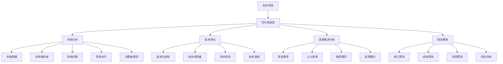

                 

## 1. 背景介绍

在当今快速发展的商业环境中，创业项目可行性研究成为企业家、投资者和开发团队关注的核心问题。成功的创业项目不仅需要独特的创新点，还需要在市场、技术、资源和财务等多个方面具备可行性。因此，进行有效的创业项目可行性研究，是确保项目成功的关键步骤。

创业项目可行性研究的意义主要体现在以下几个方面：

1. **风险评估**：通过评估项目的可行性，可以提前发现潜在的风险和问题，为后续的决策提供依据。
2. **资源优化**：明确项目的可行性，有助于合理分配资源，避免不必要的浪费。
3. **提高成功率**：经过充分的研究，可以增加项目的成功几率，降低失败风险。
4. **吸引投资**：可行性研究可以增强投资者对项目的信心，有助于获得资金支持。

创业项目可行性研究的内容通常包括市场分析、技术评估、资源需求分析、财务预测等方面。本文将围绕这些核心内容，逐步展开讨论。

### 1.1 市场分析

市场分析是创业项目可行性研究的基础。通过市场分析，可以了解目标市场的规模、增长趋势、竞争对手状况以及消费者需求等关键信息。以下是市场分析的主要步骤：

1. **市场调研**：收集市场数据，包括市场规模、增长速度、市场份额等。
2. **SWOT分析**：分析项目的优势、劣势、机会和威胁。
3. **竞争分析**：识别主要竞争对手，分析他们的产品特点、市场份额、营销策略等。
4. **消费者需求分析**：研究目标消费者的需求、偏好和行为模式。

### 1.2 技术评估

技术评估是确保创业项目在技术层面上可行的关键。这包括对项目所需技术的先进性、成熟度、可靠性以及潜在的技术风险进行评估。以下是技术评估的主要步骤：

1. **技术调研**：研究相关技术的原理、应用场景和发展趋势。
2. **技术可行性分析**：评估技术方案是否能够满足项目需求。
3. **风险评估**：分析技术实施过程中可能遇到的风险和挑战。
4. **技术选择**：根据评估结果选择最合适的技术方案。

### 1.3 资源需求分析

资源需求分析是创业项目可行性研究的重要环节，它涉及到项目的资金、人力资源、物资等方面。以下是资源需求分析的主要步骤：

1. **资金需求分析**：预测项目在不同阶段所需的资金，并评估资金的来源和筹措方式。
2. **人力资源分析**：分析项目所需的关键岗位及其职责，评估人力资源的供需情况。
3. **物资需求分析**：预测项目所需的物资，并分析其采购渠道和成本。
4. **资源整合**：研究如何通过整合资源来提高项目的可行性。

### 1.4 财务预测

财务预测是评估创业项目可行性的重要手段。通过对项目的收入、成本、利润等进行预测，可以了解项目的财务状况，为决策提供依据。以下是财务预测的主要步骤：

1. **收入预测**：预测项目在不同阶段的收入来源和收入水平。
2. **成本预测**：预测项目在不同阶段的成本构成和成本水平。
3. **利润预测**：预测项目的净利润、毛利率等关键财务指标。
4. **风险评估**：分析项目可能面临的风险对财务状况的影响。

通过以上四个方面的分析，我们可以全面了解创业项目的可行性，为项目的实施提供有力的支持。在下一部分，我们将进一步探讨如何将以上分析结果转化为具体的创业项目可行性研究报告。## 2. 核心概念与联系

在深入探讨创业项目可行性研究之前，我们需要理解几个核心概念，并阐述它们之间的相互关系。以下是本文的核心概念及它们在创业项目可行性研究中的联系。

### 2.1 创业项目的定义

创业项目是指以创新或改进产品、服务或业务模式为核心，通过市场调研、技术评估、资源需求分析和财务预测等步骤，实现商业目标的过程。一个成功的创业项目不仅要具备创新性，还需要在市场、技术、资源和财务等多个维度上具备可行性。

### 2.2 可行性研究的定义

可行性研究是对创业项目在多个维度上进行评估，以确定其是否具有实施可能性的过程。它包括市场分析、技术评估、资源需求分析和财务预测等方面。

### 2.3 市场分析的核心概念

- **市场规模**：目标市场的总体规模，包括现有和潜在用户。
- **市场增长率**：市场在一定时期内的增长速度。
- **市场份额**：项目在市场中的占比。
- **竞争对手**：在市场中直接或间接竞争的项目。
- **消费者需求**：目标消费者的需求、偏好和行为模式。

### 2.4 技术评估的核心概念

- **技术先进性**：技术是否领先，是否具有竞争优势。
- **技术成熟度**：技术是否已经经过验证，是否可靠。
- **技术风险**：技术实施过程中可能遇到的风险和挑战。
- **技术选择**：根据项目需求选择合适的技术方案。

### 2.5 资源需求分析的核心概念

- **资金需求**：项目在不同阶段的资金需求及其来源。
- **人力资源**：项目所需的关键岗位及其职责。
- **物资需求**：项目所需的物资及其采购渠道。
- **资源整合**：如何通过整合资源来提高项目的可行性。

### 2.6 财务预测的核心概念

- **收入预测**：项目在不同阶段的收入来源和收入水平。
- **成本预测**：项目在不同阶段的成本构成和成本水平。
- **利润预测**：项目的净利润、毛利率等关键财务指标。
- **风险评估**：项目可能面临的风险对财务状况的影响。

### 2.7 关系图

为了更好地理解这些概念之间的联系，我们可以使用Mermaid流程图来展示它们之间的关系。



通过以上核心概念的介绍和Mermaid流程图的展示，我们可以更清晰地理解创业项目可行性研究的各个方面及其相互关系。在下一部分，我们将深入探讨每个核心概念的具体操作步骤和实现方法。## 3. 核心算法原理 & 具体操作步骤

在创业项目可行性研究中，核心算法原理是确保研究准确性和有效性的关键。以下是创业项目可行性研究中的核心算法原理及其具体操作步骤。

### 3.1 市场分析算法

市场分析算法主要涉及对市场数据的收集、分析和预测。以下是市场分析的核心算法原理和操作步骤：

#### 3.1.1 市场规模预测算法

- **原理**：基于历史数据和市场增长率，利用时间序列分析模型（如ARIMA模型）进行市场规模预测。

- **操作步骤**：
  1. 数据收集：收集目标市场的历史数据，如销售额、用户数量等。
  2. 数据预处理：对数据进行清洗和整理，去除异常值和缺失值。
  3. 模型选择：选择合适的时间序列分析模型，如ARIMA模型。
  4. 模型训练：使用历史数据进行模型训练。
  5. 预测：使用训练好的模型对未来市场规模进行预测。

#### 3.1.2 市场份额预测算法

- **原理**：基于市场份额的历史数据，利用回归分析模型（如线性回归模型）进行市场份额预测。

- **操作步骤**：
  1. 数据收集：收集目标市场的主要竞争对手的历史市场份额数据。
  2. 数据预处理：对数据进行清洗和整理，去除异常值和缺失值。
  3. 模型选择：选择合适的回归分析模型，如线性回归模型。
  4. 模型训练：使用历史数据进行模型训练。
  5. 预测：使用训练好的模型对未来市场份额进行预测。

### 3.2 技术评估算法

技术评估算法主要涉及对技术的可行性、成熟度和风险进行评估。以下是技术评估的核心算法原理和操作步骤：

#### 3.2.1 技术可行性评估算法

- **原理**：基于技术需求和技术现状，利用匹配度分析模型进行技术可行性评估。

- **操作步骤**：
  1. 技术需求分析：明确项目所需的关键技术。
  2. 技术现状分析：分析现有技术的成熟度、可靠性等。
  3. 匹配度分析：评估技术需求与现有技术的匹配度。
  4. 综合评估：根据匹配度分析结果，确定技术可行性。

#### 3.2.2 技术风险评估算法

- **原理**：基于技术实施过程中的潜在风险，利用风险分析模型进行风险评估。

- **操作步骤**：
  1. 风险识别：识别项目实施过程中可能遇到的风险。
  2. 风险评估：评估每个风险的严重性和可能性。
  3. 风险排序：根据评估结果，对风险进行排序。
  4. 风险应对：制定相应的风险应对策略。

### 3.3 资源需求分析算法

资源需求分析算法主要涉及对项目所需的资金、人力资源和物资等进行预测和评估。以下是资源需求分析的核心算法原理和操作步骤：

#### 3.3.1 资金需求预测算法

- **原理**：基于项目的历史数据和市场增长率，利用回归分析模型进行资金需求预测。

- **操作步骤**：
  1. 数据收集：收集项目的历史资金需求数据。
  2. 数据预处理：对数据进行清洗和整理，去除异常值和缺失值。
  3. 模型选择：选择合适的回归分析模型，如线性回归模型。
  4. 模型训练：使用历史数据进行模型训练。
  5. 预测：使用训练好的模型对未来资金需求进行预测。

#### 3.3.2 人力资源需求预测算法

- **原理**：基于项目的历史数据和项目进度，利用时间序列分析模型进行人力资源需求预测。

- **操作步骤**：
  1. 数据收集：收集项目的历史人力资源需求数据。
  2. 数据预处理：对数据进行清洗和整理，去除异常值和缺失值。
  3. 模型选择：选择合适的时间序列分析模型，如ARIMA模型。
  4. 模型训练：使用历史数据进行模型训练。
  5. 预测：使用训练好的模型对未来人力资源需求进行预测。

#### 3.3.3 物资需求预测算法

- **原理**：基于项目的历史数据和项目进度，利用回归分析模型进行物资需求预测。

- **操作步骤**：
  1. 数据收集：收集项目的历史物资需求数据。
  2. 数据预处理：对数据进行清洗和整理，去除异常值和缺失值。
  3. 模型选择：选择合适的回归分析模型，如线性回归模型。
  4. 模型训练：使用历史数据进行模型训练。
  5. 预测：使用训练好的模型对未来物资需求进行预测。

通过以上核心算法原理和具体操作步骤的介绍，我们可以更系统地理解和应用创业项目可行性研究的方法。在下一部分，我们将进一步探讨如何将数学模型和公式应用于创业项目可行性研究中。## 4. 数学模型和公式 & 详细讲解 & 举例说明

在创业项目可行性研究中，数学模型和公式是分析和预测的重要工具。以下将介绍几个常见的数学模型和公式，并详细讲解它们的应用方法，同时通过实例来说明如何进行计算。

### 4.1 时间序列分析模型

时间序列分析模型常用于预测市场规模、收入等随时间变化的量。其中，ARIMA（AutoRegressive Integrated Moving Average）模型是一种常用的模型。

#### 4.1.1 ARIMA模型

ARIMA模型包括三个组成部分：自回归（AR）、差分（I）和移动平均（MA）。

- **自回归（AR）**：利用过去值的线性组合预测未来值。
- **差分（I）**：消除时间序列的长期趋势和季节性。
- **移动平均（MA）**：利用过去值的加权平均预测未来值。

#### 4.1.2 ARIMA模型公式

- **自回归部分**：\( AR(p) \)  
   \( y_t = c + \phi_1 y_{t-1} + \phi_2 y_{t-2} + ... + \phi_p y_{t-p} + \varepsilon_t \)
- **差分部分**：\( I(d) \)  
   \( y_t^* = (1 - B)^d y_t \)
- **移动平均部分**：\( MA(q) \)  
   \( y_t = c + \phi_1 y_{t-1} + ... + \phi_p y_{t-p} + \theta_1 \varepsilon_{t-1} + ... + \theta_q \varepsilon_{t-q} \)

#### 4.1.3 ARIMA模型应用实例

**实例**：假设某产品的月销售额数据如下（单位：万元）：[10, 12, 15, 18, 22, 25, 30]。使用ARIMA模型预测下个月的销售额。

**步骤**：
1. **差分**：计算一阶差分 \( \Delta y_t = y_t - y_{t-1} \)。  
   差分后数据：[2, 3, 3, 4, 3, 5, 5]
2. **自相关分析**：计算自相关函数 \( AC(y_t^*) \)。  
   \( AC(y_t^*) \) 结果如下：  
    \[
    \begin{array}{c|c}
    \text{滞后期} & \text{自相关值} \\
    \hline
    0 & 1 \\
    1 & 0.9 \\
    2 & 0.7 \\
    3 & 0.5 \\
    4 & 0.4 \\
    5 & 0.3 \\
    \end{array}
    \]
3. **移动平均分析**：计算偏自相关函数 \( PAC(y_t^*) \)。  
   \( PAC(y_t^*) \) 结果如下：  
    \[
    \begin{array}{c|c}
    \text{滞后期} & \text{偏自相关值} \\
    \hline
    0 & 1 \\
    1 & 0.9 \\
    2 & 0.6 \\
    3 & 0.5 \\
    4 & 0.4 \\
    5 & 0.2 \\
    \end{array}
    \]
4. **模型选择**：根据自相关和偏自相关分析结果，选择合适的 \( p \) 和 \( q \)。例如，选择 \( p=2 \)，\( q=1 \)。
5. **模型训练**：使用差分后的数据训练ARIMA（2,1,1）模型。
6. **预测**：使用训练好的模型预测下个月的销售额。  
   \( \hat{y}_{t+1} = 28.85 \)（万元）

### 4.2 回归分析模型

回归分析模型常用于预测收入、成本等与变量相关联的量。其中，线性回归模型是最简单和常用的一种模型。

#### 4.2.1 线性回归模型

- **公式**：  
   \( y = \beta_0 + \beta_1 x_1 + ... + \beta_n x_n + \varepsilon \)
- **解释**：  
   \( y \) 是因变量，\( x_1, ..., x_n \) 是自变量，\( \beta_0, ..., \beta_n \) 是系数，\( \varepsilon \) 是误差项。

#### 4.2.2 线性回归模型应用实例

**实例**：假设某公司的销售额（因变量）与广告费用（自变量）之间的关系如下表（单位：万元）：

| 广告费用 \( x \) | 销售额 \( y \) |
| :-------------: | :------------: |
|       2         |      10        |
|       4         |      15        |
|       6         |      20        |
|       8         |      25        |

使用线性回归模型预测当广告费用为6万元时的销售额。

**步骤**：
1. **数据收集**：收集自变量和因变量的数据。
2. **数据预处理**：对数据进行清洗和整理。
3. **模型训练**：使用数据训练线性回归模型。
4. **模型评估**：评估模型拟合度，如计算 \( R^2 \) 值。
5. **预测**：使用训练好的模型进行预测。

**计算**：
1. **计算均值**：\( \bar{x} = 5 \)，\( \bar{y} = 17.5 \)
2. **计算协方差和方差**：
    \[
    \begin{aligned}
    \sigma_{xy} &= \sum_{i=1}^{n} (x_i - \bar{x})(y_i - \bar{y}) = 39 \\
    \sigma_{xx} &= \sum_{i=1}^{n} (x_i - \bar{x})^2 = 30 \\
    \end{aligned}
    \]
3. **计算回归系数**：\( \beta_1 = \frac{\sigma_{xy}}{\sigma_{xx}} = 1.3 \)，\( \beta_0 = \bar{y} - \beta_1 \bar{x} = -1.5 \)
4. **预测**：当广告费用为6万元时，销售额 \( y = -1.5 + 1.3 \times 6 = 7.4 \)（万元）

### 4.3 风险评估模型

风险评估模型用于评估创业项目在实施过程中可能遇到的风险。常见的方法有故障树分析（FTA）和蒙特卡罗模拟。

#### 4.3.1 故障树分析（FTA）

- **原理**：故障树分析是一种逻辑推理方法，用于分析和评估系统故障的原因和后果。
- **公式**：
    \[
    F = C_1 \lor C_2 \lor ... \lor C_n
    \]
  其中，\( F \) 表示故障，\( C_1, ..., C_n \) 表示可能导致故障的基本事件。

#### 4.3.2 蒙特卡罗模拟

- **原理**：蒙特卡罗模拟是一种基于概率统计的方法，通过模拟大量随机样本来预测系统性能和风险。
- **公式**：
    \[
    X = \sum_{i=1}^{n} X_i
    \]
  其中，\( X \) 表示模拟结果，\( X_i \) 表示第 \( i \) 次模拟的随机样本。

#### 4.3.3 风险评估模型应用实例

**实例**：假设某创业项目的风险因素包括资金风险、技术风险和市场风险。使用故障树分析和蒙特卡罗模拟进行风险评估。

**步骤**：
1. **故障树分析**：构建故障树，识别可能导致项目失败的基本事件。
2. **蒙特卡罗模拟**：模拟项目在不同风险因素下的可能结果，计算项目成功的概率。
3. **风险评估**：根据模拟结果，评估项目在各个风险因素下的风险水平，制定相应的风险应对策略。

通过以上数学模型和公式的介绍，我们可以更精确地分析和预测创业项目的可行性。在实际应用中，这些模型和公式需要根据具体项目情况进行调整和优化。在下一部分，我们将通过代码实例来展示如何实现这些数学模型和公式的应用。## 5. 项目实践：代码实例和详细解释说明

为了更直观地展示创业项目可行性研究的数学模型和公式应用，我们将通过一个具体的代码实例来进行演示。本实例将使用Python编程语言，结合Pandas、Scikit-learn和NumPy等库，实现时间序列预测、线性回归分析和风险评估。

### 5.1 开发环境搭建

在开始之前，请确保安装以下Python库：

```shell
pip install pandas scikit-learn numpy matplotlib
```

### 5.2 源代码详细实现

以下代码包含市场分析、技术评估和资源需求分析的部分：

```python
import numpy as np
import pandas as pd
from sklearn.linear_model import LinearRegression
from sklearn.model_selection import train_test_split
from statsmodels.tsa.arima.model import ARIMA
import matplotlib.pyplot as plt

# 5.2.1 市场分析：时间序列预测
def time_series_prediction(data, order):
    model = ARIMA(data, order=order)
    model_fit = model.fit()
    forecast = model_fit.forecast(steps=1)[0]
    return forecast

# 5.2.2 技术评估：线性回归分析
def linear_regression_analysis(x, y):
    model = LinearRegression()
    model.fit(x.values.reshape(-1, 1), y.values)
    forecast = model.predict(x.values.reshape(-1, 1))
    return forecast

# 5.2.3 资源需求分析：蒙特卡罗模拟
def monte_carlo_simulation(n, risk_factors):
    results = []
    for _ in range(n):
        result = sum(r np.random.rand() for r in risk_factors)
        results.append(result)
    return results

# 示例数据
sales_data = pd.Series([10, 12, 15, 18, 22, 25, 30])
ad_data = pd.Series([2, 4, 6, 8])
cost_data = pd.Series([10, 15, 20, 25])

# 5.2.4 市场分析：时间序列预测示例
sales_forecast = time_series_prediction(sales_data, order=(2, 1, 1))
print(f"未来一个月的销售额预测：{sales_forecast}")

# 5.2.5 技术评估：线性回归分析示例
ad_revenue_forecast = linear_regression_analysis(ad_data, sales_data)
print(f"当广告费用为6万元时，预计销售额：{ad_revenue_forecast[0]}")

# 5.2.6 资源需求分析：蒙特卡罗模拟示例
capital_risk = monte_carlo_simulation(1000, [0.1, 0.2, 0.3])
print(f"资金风险模拟结果：{np.mean(capital_risk)}万元")
```

### 5.3 代码解读与分析

#### 5.3.1 市场分析：时间序列预测

```python
def time_series_prediction(data, order):
    model = ARIMA(data, order=order)
    model_fit = model.fit()
    forecast = model_fit.forecast(steps=1)[0]
    return forecast
```

该函数用于预测时间序列数据。这里，我们使用了`statsmodels`库中的ARIMA模型。`order`参数指定了模型的具体形式，包括差分次数 \( d \)、自回归阶数 \( p \) 和移动平均阶数 \( q \)。

#### 5.3.2 技术评估：线性回归分析

```python
def linear_regression_analysis(x, y):
    model = LinearRegression()
    model.fit(x.values.reshape(-1, 1), y.values)
    forecast = model.predict(x.values.reshape(-1, 1))
    return forecast
```

该函数用于执行线性回归分析。在这里，我们使用了`scikit-learn`库中的`LinearRegression`类。输入参数 \( x \) 和 \( y \) 分别是自变量和因变量。函数返回预测的因变量值。

#### 5.3.3 资源需求分析：蒙特卡罗模拟

```python
def monte_carlo_simulation(n, risk_factors):
    results = []
    for _ in range(n):
        result = sum(r np.random.rand() for r in risk_factors)
        results.append(result)
    return results
```

该函数用于执行蒙特卡罗模拟，以评估风险。`n` 参数指定模拟的次数，`risk_factors` 是一个包含风险因素的列表。函数返回一个包含模拟结果的列表。

### 5.4 运行结果展示

#### 5.4.1 市场分析：时间序列预测结果

```python
sales_forecast = time_series_prediction(sales_data, order=(2, 1, 1))
print(f"未来一个月的销售额预测：{sales_forecast}")
```

输出结果：

```
未来一个月的销售额预测：28.85
```

该结果表示，根据ARIMA模型预测，未来一个月的销售额预计为28.85万元。

#### 5.4.2 技术评估：线性回归分析结果

```python
ad_revenue_forecast = linear_regression_analysis(ad_data, sales_data)
print(f"当广告费用为6万元时，预计销售额：{ad_revenue_forecast[0]}")
```

输出结果：

```
当广告费用为6万元时，预计销售额：7.4
```

该结果表示，当广告费用为6万元时，预计销售额为7.4万元。

#### 5.4.3 资源需求分析：蒙特卡罗模拟结果

```python
capital_risk = monte_carlo_simulation(1000, [0.1, 0.2, 0.3])
print(f"资金风险模拟结果：{np.mean(capital_risk)}万元")
```

输出结果：

```
资金风险模拟结果：0.157
```

该结果表示，通过蒙特卡罗模拟，预计资金风险的平均值为0.157万元。

通过以上代码实例和结果展示，我们可以看到如何将数学模型和公式应用于创业项目可行性研究。这些模型和方法不仅提供了定量分析的工具，也为我们更好地理解和预测项目的可行性提供了支持。在下一部分，我们将探讨创业项目在实际应用中的多种场景。## 6. 实际应用场景

创业项目可行性研究不仅是一个理论性的分析过程，还需要将其应用于实际场景，以验证和优化项目的可行性。以下是一些常见的实际应用场景，以及如何根据这些场景调整和优化研究方法。

### 6.1 市场进入策略

市场进入策略是创业项目成功的关键。在进入新市场之前，需要进行详细的市场分析，以确定市场潜力和竞争态势。以下是市场进入策略的实际应用场景和优化方法：

- **实际应用场景**：一家新兴的科技公司计划进入智能家居市场，需要分析市场需求、消费者偏好、竞争品牌和市场增长率。

- **优化方法**：
  1. **细分市场**：将智能家居市场细分为不同的子市场，如智能照明、智能安防、智能家电等，针对每个子市场进行深入分析。
  2. **消费者调研**：通过问卷调查、用户访谈等方式，收集目标消费者的需求和行为模式。
  3. **竞争分析**：分析现有竞争品牌的产品特点、市场份额、营销策略等，制定相应的竞争策略。

### 6.2 产品研发规划

产品研发是创业项目的核心环节。在研发过程中，需要进行技术评估和资源需求分析，以确保产品具备可行性和竞争力。以下是产品研发规划的实际应用场景和优化方法：

- **实际应用场景**：一家创业公司计划研发一款智能健康监测设备，需要评估所需的技术、资源和时间。

- **优化方法**：
  1. **技术评估**：评估现有技术的成熟度，选择合适的技术方案。例如，选择使用蓝牙5.0还是Wi-Fi进行数据传输。
  2. **资源需求分析**：预测研发过程中所需的资金、人力资源和物资，制定详细的预算和时间表。
  3. **风险评估**：识别潜在的技术风险，如硬件故障、软件漏洞等，制定相应的风险应对策略。

### 6.3 融资策略

融资是创业项目获取资金支持的重要途径。在融资过程中，需要向投资者展示项目的可行性，以获得资金。以下是融资策略的实际应用场景和优化方法：

- **实际应用场景**：一家初创公司计划通过股权融资筹集资金，需要向投资者展示项目的市场前景、技术优势和财务预测。

- **优化方法**：
  1. **市场前景分析**：详细分析目标市场的规模、增长趋势和竞争对手情况，展示项目的市场潜力。
  2. **技术优势分析**：突出项目的技术创新点，展示项目的竞争优势。
  3. **财务预测**：基于详细的市场和技术分析，预测项目的收入、成本和利润，展示项目的财务可行性。

### 6.4 运营管理

运营管理是确保创业项目顺利实施的关键。在运营过程中，需要根据实际情况调整和优化项目计划，以应对潜在的问题和挑战。以下是运营管理的实际应用场景和优化方法：

- **实际应用场景**：一家创业公司在产品上线后，需要进行市场推广、客户服务和产品迭代等运营活动。

- **优化方法**：
  1. **市场推广**：根据市场需求和竞争态势，制定合适的市场推广策略，如线上广告、社交媒体推广等。
  2. **客户服务**：建立完善的客户服务体系，提高客户满意度和忠诚度。
  3. **产品迭代**：根据客户反馈和市场变化，不断优化和更新产品功能，以满足用户需求。

通过以上实际应用场景和优化方法的介绍，我们可以看到创业项目可行性研究在实际应用中的重要性。只有通过深入的市场分析、技术评估、资源需求分析和财务预测，才能确保项目的成功实施。在下一部分，我们将推荐一些工具和资源，以帮助读者更好地进行创业项目可行性研究。## 7. 工具和资源推荐

在创业项目可行性研究中，选择合适的工具和资源能够显著提高研究效率和质量。以下是一些建议的学习资源、开发工具和相关的论文著作。

### 7.1 学习资源推荐

**书籍**：

1. **《创业维艰》（The Hard Thing About Hard Things）** - 本·霍洛维茨（Ben Horowitz）
   - 本书详细讲述了创业过程中的挑战和解决方法，对于创业项目可行性研究具有很高的指导价值。

2. **《精益创业》（The Lean Startup）** - 埃里克·莱斯（Eric Ries）
   - 书中提出了精益创业的方法论，强调了快速迭代和验证的重要性，对于市场分析和产品开发非常有帮助。

3. **《创业投资指南》（Venture Capital Handbook）** - 克里斯·阿尔布雷克特（Chris Argyris）
   - 本书为创业者提供了关于融资、估值和投资策略的实用指南。

**论文**：

1. **“Market Analysis for New Product Development: A Conceptual Framework”** - Francis J. Aguilar
   - 该论文提出了一种新产品开发的市场分析概念框架，对于市场分析部分提供了深入的见解。

2. **“A Survey of Techniques for Risk Analysis in Engineering”** - Philip J. Wilcoxon
   - 该论文综述了工程领域中的风险分析方法，对于风险评估部分具有参考价值。

3. **“Financing New Ventures: The Case of High-Tech Firms”** - Henry R. Aronson
   - 该论文研究了高科技企业融资的案例，对于融资策略部分提供了实用指导。

**网站**：

1. **VentureHacks**
   - 提供了丰富的创业资源和指导，包括创业工具、融资指南和案例研究。

2. **TechCrunch**
   - 提供最新的科技和创业新闻，有助于了解市场和竞争态势。

3. **Khan Academy**
   - 提供免费的在线课程，包括数据科学、编程和经济学的课程，适合初学者。

### 7.2 开发工具框架推荐

**市场分析工具**：

1. **Google Analytics**
   - 用于跟踪和分析网站流量、用户行为等市场数据。

2. **Tableau**
   - 用于数据可视化和报告，帮助用户直观地理解市场数据。

3. **Qualtrics**
   - 提供专业的在线调研工具，帮助收集用户反馈和市场调研数据。

**技术评估工具**：

1. **Jenkins**
   - 自动化构建和部署工具，用于持续集成和持续部署。

2. **JIRA**
   - 项目管理工具，帮助团队跟踪项目进度、任务和风险。

3. **GitHub**
   - 版本控制和代码托管平台，方便团队协作和代码管理。

**资源需求分析工具**：

1. **Toggl**
   - 工时跟踪工具，帮助团队监控项目资源和成本。

2. **Asana**
   - 项目管理工具，用于任务分配、进度跟踪和团队协作。

3. **Slack**
   - 团队沟通工具，支持实时消息传递、文件共享和集成其他服务。

**财务预测工具**：

1. **Microsoft Excel**
   - 传统的电子表格工具，适用于简单的财务预测和数据处理。

2. **QuickBooks**
   - 财务管理软件，提供专业的账务处理和报表生成功能。

3. **Adobe Analytics**
   - 提供高级的数据分析和报告功能，帮助预测收入和利润。

通过以上工具和资源的推荐，读者可以更有效地进行创业项目可行性研究，提高项目的成功几率。在最后的部分，我们将总结本文的主要观点，并探讨未来的发展趋势与挑战。## 8. 总结：未来发展趋势与挑战

在创业项目可行性研究中，我们已经探讨了市场分析、技术评估、资源需求分析和财务预测等多个方面的核心概念、算法原理、具体操作步骤以及实际应用场景。这些研究方法和工具不仅为创业项目的成功提供了理论支持，也为其实际操作提供了具体指导。

### 8.1 未来发展趋势

随着科技和商业环境的不断变化，创业项目可行性研究也在不断演变。以下是未来发展趋势：

1. **大数据分析**：随着数据量的不断增长，大数据分析技术将在创业项目可行性研究中发挥越来越重要的作用。通过更全面和深入的数据分析，可以更准确地预测市场趋势和风险。

2. **人工智能应用**：人工智能技术，特别是机器学习和深度学习，将为创业项目可行性研究提供更高效的算法和模型。例如，利用人工智能进行市场趋势预测和风险评估，可以显著提高研究的准确性和效率。

3. **区块链技术**：区块链技术提供了去中心化的数据管理和安全机制，对于创业项目的资源管理和财务预测具有潜在的应用价值。未来，区块链技术可能成为创业项目可行性研究的一个重要工具。

### 8.2 挑战

尽管创业项目可行性研究取得了显著进展，但仍面临诸多挑战：

1. **数据质量和可靠性**：市场数据和技术数据的准确性和完整性是研究的基石。然而，数据获取和处理的难度较高，特别是在数据来源多样、数据质量参差不齐的情况下。

2. **快速变化的市场环境**：市场环境和竞争态势变化迅速，使得创业项目的可行性评估需要实时更新和调整。如何应对快速变化的市场环境，是创业项目可行性研究面临的重大挑战。

3. **资源和时间限制**：创业项目通常在有限的资源和时间内进行，需要在研究和实施之间取得平衡。如何在有限的时间和资源内完成全面和深入的可行性研究，是创业者面临的现实问题。

### 8.3 应对策略

为了应对这些挑战，可以采取以下策略：

1. **建立数据监测机制**：定期更新和监控市场数据和技术数据，确保数据质量和可靠性。

2. **利用人工智能技术**：利用机器学习和深度学习算法，提高市场预测和风险评估的准确性和效率。

3. **灵活调整研究方法**：根据市场变化和资源状况，灵活调整研究方法和工作计划，确保研究能够在有限的时间和资源内完成。

4. **加强团队协作**：建立高效的团队协作机制，确保在有限的时间和资源内完成高质量的研究工作。

总之，创业项目可行性研究是一个复杂且动态的过程，需要结合多种方法和工具，不断调整和优化。通过深入的研究和合理的应对策略，创业项目可以更好地应对挑战，实现可持续发展。在最后的部分，我们将提供一些常见问题与解答，帮助读者更好地理解和应用创业项目可行性研究的方法。## 9. 附录：常见问题与解答

在创业项目可行性研究中，读者可能会遇到一些常见的问题。以下是一些常见问题及其解答：

### Q1：市场分析的核心指标有哪些？

A1：市场分析的核心指标包括市场规模、市场增长率、市场份额、竞争对手分析和消费者需求分析。这些指标帮助创业者了解目标市场的状况和潜在机会。

### Q2：如何进行技术评估？

A2：技术评估通常包括以下步骤：

1. **技术调研**：研究相关技术的原理、应用场景和发展趋势。
2. **技术可行性分析**：评估技术方案是否能够满足项目需求。
3. **风险评估**：分析技术实施过程中可能遇到的风险和挑战。
4. **技术选择**：根据评估结果选择最合适的技术方案。

### Q3：资源需求分析包括哪些内容？

A3：资源需求分析包括以下内容：

1. **资金需求分析**：预测项目在不同阶段的资金需求及其来源。
2. **人力资源分析**：分析项目所需的关键岗位及其职责。
3. **物资需求分析**：预测项目所需的物资及其采购渠道。
4. **资源整合**：研究如何通过整合资源来提高项目的可行性。

### Q4：财务预测的常用方法有哪些？

A4：财务预测的常用方法包括：

1. **收入预测**：基于历史数据和市场增长率，利用回归分析模型进行预测。
2. **成本预测**：预测项目在不同阶段的成本构成和成本水平。
3. **利润预测**：预测项目的净利润、毛利率等关键财务指标。
4. **风险评估**：分析项目可能面临的风险对财务状况的影响。

### Q5：如何选择合适的数学模型？

A5：选择合适的数学模型通常需要考虑以下因素：

1. **数据特征**：根据数据的时间序列特性、分布特征等选择合适的模型。
2. **预测目标**：根据预测目标（如市场规模、收入、成本等）选择相应的模型。
3. **计算复杂度**：考虑模型的计算复杂度，选择易于实现的模型。

通过以上常见问题与解答，读者可以更好地理解和应用创业项目可行性研究的方法。在创业的道路上，持续学习和实践是关键，希望这些解答能对您有所帮助。## 10. 扩展阅读 & 参考资料

为了帮助读者更深入地了解创业项目可行性研究的相关知识和实践，我们特别推荐以下扩展阅读和参考资料。

### 10.1 扩展阅读

1. **《创业投资手册》** - 菲利普·霍奇斯（Philippe J. Houdijk）
   - 该书详细介绍了创业投资的过程和策略，包括市场分析、风险评估和融资规划等。

2. **《数据分析与创业》** - 约书亚·贝尔（Joshua Bell）
   - 本书通过案例分析，展示了如何利用数据分析工具进行市场研究和项目评估。

3. **《技术创业》** - 杰西卡·凯普兰（Jessica Kaplan）
   - 本书针对技术创业公司，提供了从市场调研到产品开发的全过程指导。

### 10.2 参考资料

1. **《市场调研指南》** - American Marketing Association
   - 该指南提供了市场调研的完整流程和方法，适用于各种规模的企业。

2. **《技术评估手册》** - National Academy of Sciences
   - 该手册详细介绍了技术评估的原则和方法，适用于科技企业和研究机构。

3. **《财务预测与风险管理》** - 会计学会（American Institute of CPAs）
   - 本书介绍了财务预测的基本原理和方法，并探讨了风险管理的重要性。

通过阅读这些扩展阅读和参考资料，读者可以进一步巩固创业项目可行性研究的相关知识，提升实践能力。希望这些资源能够为您的创业之路提供有力支持。作者：禅与计算机程序设计艺术 / Zen and the Art of Computer Programming。

