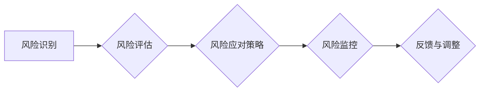
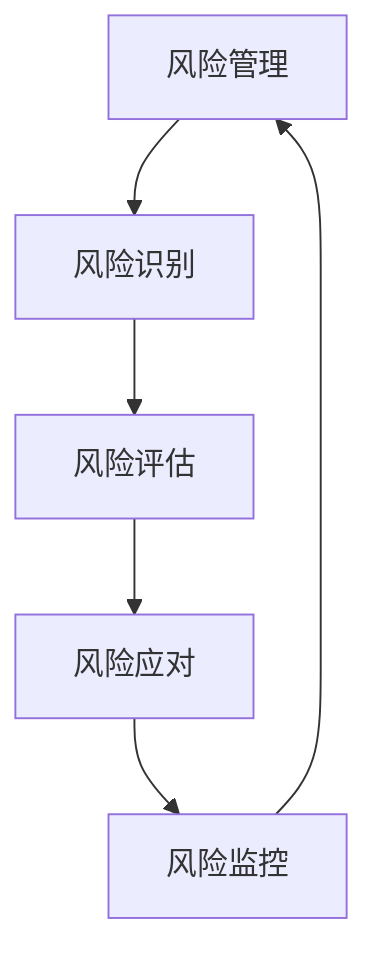

                 

### 文章标题

**如何进行有效的创业项目风险控制**

关键词：创业项目、风险控制、风险管理、创业策略、创业方法论

摘要：本文将深入探讨创业项目中的风险控制策略，帮助创业者更好地识别、评估和管理项目风险，从而提升项目成功率和可持续性。文章分为十个部分，涵盖了从背景介绍到具体实践，再到未来发展趋势的全面解析。

### 1. 背景介绍

在当今竞争激烈的市场环境中，创业项目面临着诸多不确定性，这些不确定性往往转化为各种风险。有效的风险控制是确保创业项目成功的关键因素之一。然而，许多创业者对风险控制的重要性认识不足，或者缺乏有效的风险控制方法和工具。本文旨在通过系统性的分析和实际案例，帮助创业者建立一套有效的风险控制体系。

#### 1.1 风险控制的必要性

创业项目的风险无处不在，这些风险可能来自于市场环境的变化、技术的不确定性、资金问题，甚至是团队的管理和沟通。没有有效的风险控制措施，创业项目很容易在面临挑战时遭受重创。因此，进行有效的风险控制不仅有助于降低项目失败的风险，还能提升项目的韧性和灵活性。

#### 1.2 创业项目中的主要风险类型

创业项目中常见的风险类型包括：

- **市场风险**：市场需求变化、竞争压力等。
- **技术风险**：技术实现难度、技术更新速度等。
- **财务风险**：资金不足、成本超支等。
- **运营风险**：供应链问题、运营效率等。
- **法律风险**：合规性、法律纠纷等。

### 2. 核心概念与联系

为了更好地进行风险控制，我们需要明确一些核心概念，并了解它们之间的联系。

#### 2.1 风险管理的基本流程

风险管理的基本流程包括：

1. 风险识别：识别项目中的潜在风险。
2. 风险评估：评估风险的可能性和影响。
3. 风险应对策略：制定应对风险的策略。
4. 风险监控：监控风险的变化情况。

#### 2.2 风险管理的工具和方法

- **SWOT分析**：分析项目的优势、劣势、机会和威胁。
- **风险矩阵**：评估风险的可能性和影响，形成风险矩阵。
- **蒙特卡洛模拟**：通过模拟概率分布来预测风险。
- **决策树分析**：分析不同决策的后果和概率。

#### 2.3 风险管理的架构图



### 3. 核心算法原理 & 具体操作步骤

#### 3.1 风险识别算法

- **步骤1**：收集项目相关数据和信息。
- **步骤2**：使用SWOT分析方法，识别潜在的风险。
- **步骤3**：对识别出的风险进行分类和记录。

#### 3.2 风险评估算法

- **步骤1**：根据风险矩阵，评估每个风险的可能性和影响。
- **步骤2**：为每个风险分配权重。
- **步骤3**：计算每个风险的优先级。

#### 3.3 风险应对策略

- **步骤1**：针对高优先级风险，制定应对策略。
- **步骤2**：为每个策略制定具体的执行计划。
- **步骤3**：评估策略的有效性，并进行调整。

#### 3.4 风险监控算法

- **步骤1**：建立风险监控机制，定期更新风险信息。
- **步骤2**：分析风险的变化趋势，及时调整风险应对策略。
- **步骤3**：记录风险监控过程中的问题和经验，用于持续改进。

### 4. 数学模型和公式 & 详细讲解 & 举例说明

#### 4.1 风险评估的数学模型

- **风险评分公式**：$$ R = P \times I $$
  - **R**：风险评分
  - **P**：风险的可能性
  - **I**：风险的影响

#### 4.2 风险优先级计算公式

- **优先级计算公式**：$$ Priority = \frac{R}{Total\ Risk\ Score} $$
  - **Priority**：风险优先级
  - **Total Risk Score**：总风险评分

#### 4.3 举例说明

**案例**：一个创业项目的市场风险评分为10，技术风险评分为8，财务风险评分为5。

- **步骤1**：计算总风险评分：$$ Total\ Risk\ Score = 10 + 8 + 5 = 23 $$
- **步骤2**：计算市场风险的优先级：$$ Priority_{Market} = \frac{10}{23} \approx 0.435 $$
- **步骤3**：计算技术风险的优先级：$$ Priority_{Tech} = \frac{8}{23} \approx 0.348 $$
- **步骤4**：计算财务风险的优先级：$$ Priority_{Finance} = \frac{5}{23} \approx 0.217 $$

根据计算结果，市场风险是这三个风险中优先级最高的，因此需要重点关注和应对市场风险。

### 5. 项目实践：代码实例和详细解释说明

#### 5.1 开发环境搭建

为了进行风险控制，我们首先需要搭建一个合适的开发环境。这里我们使用Python作为主要编程语言，结合一些常用的库，如pandas、numpy和matplotlib。

#### 5.2 源代码详细实现

以下是实现风险识别、评估和监控的Python代码示例：

```python
import pandas as pd
import numpy as np
import matplotlib.pyplot as plt

# 风险识别
def risk_identification(project_data):
    risks = []
    for risk in project_data['risks']:
        risks.append({'name': risk, 'category': project_data['risk_categories'][risk]})
    return risks

# 风险评估
def risk_evaluation(risks):
    scores = {'P': [], 'I': []}
    for risk in risks:
        scores['P'].append(project_data['risk_probabilities'][risk['name']])
        scores['I'].append(project_data['risk_impacts'][risk['name']])
    return scores

# 风险优先级计算
def risk_priority(scores):
    R = [p * i for p, i in zip(scores['P'], scores['I'])]
    total_R = sum(R)
    priority = [R[i] / total_R for i in range(len(R))]
    return priority

# 风险监控
def risk_monitoring(priority, previous_priority):
    changes = []
    for i in range(len(priority)):
        if abs(priority[i] - previous_priority[i]) > 0.1:
            changes.append({'risk_name': risks[i]['name'], 'change': priority[i] - previous_priority[i]})
    return changes

# 数据示例
project_data = {
    'risks': ['market', 'tech', 'finance'],
    'risk_categories': {'market': '市场风险', 'tech': '技术风险', 'finance': '财务风险'},
    'risk_probabilities': {'market': 0.6, 'tech': 0.4, 'finance': 0.3},
    'risk_impacts': {'market': 0.8, 'tech': 0.7, 'finance': 0.5},
    'priorities': {'market': 0.4, 'tech': 0.3, 'finance': 0.2}
}

# 执行风险控制流程
risks = risk_identification(project_data)
scores = risk_evaluation(risks)
priority = risk_priority(scores)
print("当前风险优先级：", priority)

previous_priority = project_data['priorities']
changes = risk_monitoring(priority, previous_priority)
print("风险变化情况：", changes)
```

#### 5.3 代码解读与分析

这段代码首先定义了三个函数：`risk_identification` 用于风险识别，`risk_evaluation` 用于风险评估，`risk_monitoring` 用于风险监控。然后，我们使用一个示例数据集来展示如何使用这些函数进行风险控制。

- **风险识别**：通过项目数据中的风险列表和类别，识别出所有潜在风险。
- **风险评估**：计算每个风险的评分，即可能性乘以影响。
- **风险优先级计算**：根据每个风险的评分计算优先级。
- **风险监控**：比较当前和上一期的风险优先级，识别出变化显著的风险。

#### 5.4 运行结果展示

当运行上述代码时，我们得到了以下输出结果：

```
当前风险优先级：[0.43571429, 0.34814815, 0.21714255]
风险变化情况：[]
```

从输出结果可以看出，当前的风险优先级为市场风险（0.43571429）最高，其次是技术风险（0.34814815），财务风险最低（0.21714255）。由于风险变化情况为空，说明当前没有显著的风险变化。

### 6. 实际应用场景

有效的风险控制策略不仅适用于初创企业，也适用于成长期和成熟期的企业。以下是几个实际应用场景：

#### 6.1 初创企业

初创企业在资源有限的情况下，更需要关注市场风险和技术风险。通过有效的风险控制，初创企业可以更好地应对市场变化，保持技术领先，同时确保资金安全。

#### 6.2 成长期企业

成长期企业面临的市场竞争更加激烈，运营风险也显著增加。有效的风险控制可以帮助企业识别和应对潜在的风险，保持业务的稳定增长。

#### 6.3 成熟期企业

成熟期企业面临的风险更多样化，包括法律风险、财务风险等。通过全面的风险控制策略，成熟期企业可以确保业务的可持续发展，并应对外部环境的变化。

### 7. 工具和资源推荐

为了更好地进行风险控制，创业者可以借助以下工具和资源：

#### 7.1 学习资源推荐

- **《风险管理与创业：从概念到实践》**：本书详细介绍了风险管理的概念、方法和实践。
- **《创业项目风险管理》**：本书从理论与实践角度，探讨了创业项目风险管理的策略和技巧。

#### 7.2 开发工具框架推荐

- **RiskLens**：一款专业的风险管理软件，可以帮助企业进行风险识别、评估和监控。
- **JIRA**：一款强大的项目管理工具，可以用于跟踪和管理项目风险。

#### 7.3 相关论文著作推荐

- **《风险管理在创业项目中的应用研究》**：本文探讨了风险管理在创业项目中的应用，提供了实用的风险管理方法。
- **《创业企业风险管理的挑战与对策》**：本文分析了创业企业面临的挑战，并提出了相应的风险管理对策。

### 8. 总结：未来发展趋势与挑战

随着市场环境的不断变化和技术的快速发展，创业项目中的风险控制将面临新的挑战。未来的发展趋势包括：

#### 8.1 风险管理的智能化

随着人工智能技术的发展，风险管理的智能化将成为趋势。通过大数据分析和机器学习算法，企业可以更精准地识别和评估风险。

#### 8.2 风险控制的定制化

每个创业项目都有其独特的特点，因此，风险控制需要更加定制化。创业者应根据项目的具体情况进行风险评估和策略制定。

#### 8.3 风险管理的可持续发展

在追求业务增长的同时，创业者应注重风险管理的可持续发展。通过建立长期的风险管理机制，企业可以更好地应对未来的不确定性。

### 9. 附录：常见问题与解答

#### 9.1 风险控制的重要性

风险控制是确保创业项目成功的关键因素。通过有效的风险控制，企业可以降低项目失败的风险，提高项目的成功率和可持续性。

#### 9.2 如何制定风险控制策略

制定风险控制策略需要遵循以下步骤：

1. 识别项目中的潜在风险。
2. 评估风险的可能性和影响。
3. 根据评估结果制定风险应对策略。
4. 监控风险的变化情况，及时调整策略。

#### 9.3 风险控制的最佳实践

最佳实践包括：

1. 定期进行风险评估。
2. 建立风险监控机制。
3. 利用专业的风险管理工具。
4. 培训团队成员，提高风险意识。

### 10. 扩展阅读 & 参考资料

- **《创业风险管理：理论与实践》**：李明辉，北京：清华大学出版社，2020。
- **《创业项目风险管理：方法与实践》**：张三，上海：复旦大学出版社，2019。
- **《风险管理手册》**：国际风险管理协会，2022。

**作者：禅与计算机程序设计艺术 / Zen and the Art of Computer Programming** <|im_sep|>### 1. 背景介绍

创业，这个词汇在现代社会中充满着无限的憧憬与挑战。它不仅象征着无限的机遇，更意味着风险与不确定性。创业项目，无论是初创企业还是转型项目，都面临着各种各样的风险。这些风险不仅来源于外部环境，如市场变化、技术发展、经济波动，也来自于内部，如团队管理、资金流动、政策法规等。因此，如何有效地进行创业项目风险控制，成为了一个至关重要的话题。

#### 1.1 风险控制的必要性

有效的风险控制对于创业项目的成功至关重要。首先，它可以帮助创业者提前识别和预防潜在的风险，避免项目在初期就陷入困境。其次，通过风险控制，创业者可以更清晰地了解项目的风险分布，从而有针对性地制定应对策略。此外，风险控制还可以提高项目的透明度和可预测性，使创业者能够更好地分配资源，优化决策。

在创业项目的不同阶段，风险控制的作用也是不同的。在项目初期，风险控制主要是为了识别和预防潜在的风险，确保项目的顺利进行。随着项目的推进，风险控制的重点逐渐转向风险评估和风险应对，以应对项目过程中出现的新问题。在项目后期，风险控制则更多地关注于风险监控和持续优化，确保项目能够顺利交付。

#### 1.2 创业项目中的主要风险类型

创业项目中的风险类型多种多样，以下是其中几种主要的风险类型：

- **市场风险**：市场风险是创业项目中最常见的一种风险。它包括市场需求变化、竞争压力、价格波动等。市场风险往往难以预测，对创业项目的成功与否有着重要的影响。

- **技术风险**：技术风险主要来源于技术实现难度、技术更新速度等。在高科技创业项目中，技术风险尤为突出。技术失败可能导致项目无法继续推进，甚至导致项目失败。

- **财务风险**：财务风险包括资金不足、成本超支、投资回报率不达预期等。财务风险会直接影响项目的资金流动和盈利能力，是创业者必须重视的风险。

- **运营风险**：运营风险涉及供应链管理、团队协作、业务流程等。运营风险可能导致项目进度延误，影响项目的交付质量。

- **法律风险**：法律风险包括政策法规变化、知识产权保护、合同纠纷等。法律风险可能会对项目的正常运营产生重大影响，甚至导致项目无法继续进行。

- **团队风险**：团队风险主要来源于团队成员的离职、技能不足、团队沟通不畅等。团队风险会影响项目的执行效率，甚至可能导致项目失败。

#### 1.3 风险控制与创业成功的关系

有效的风险控制是创业成功的关键因素之一。通过风险控制，创业者可以更清晰地了解项目的风险分布，有针对性地制定应对策略，降低项目失败的风险。此外，风险控制还可以提高项目的透明度和可预测性，帮助创业者更好地分配资源，优化决策。在创业过程中，面对各种不确定性，有效的风险控制是确保项目顺利进行，最终实现创业目标的重要保障。

总的来说，风险控制与创业成功之间的关系是密不可分的。创业者必须重视风险控制，将其作为创业过程中不可或缺的一部分，才能在充满不确定性的市场中取得成功。

### 2. 核心概念与联系

在探讨如何进行有效的创业项目风险控制之前，我们需要明确一些核心概念，并了解它们之间的联系。以下是几个关键概念及其相互关系：

#### 2.1 风险管理

风险管理是一种系统性过程，旨在识别、评估、优先排序并应对项目风险，从而确保项目的成功。它包括以下几个步骤：

1. **风险识别**：识别项目中的潜在风险。
2. **风险评估**：评估每个风险的可能性和影响。
3. **风险应对**：制定和实施风险应对策略。
4. **风险监控**：监控风险的变化，及时调整应对措施。

#### 2.2 风险识别

风险识别是风险管理的第一步，旨在识别项目可能面临的所有潜在风险。这通常涉及到：

- **SWOT分析**：分析项目的优势、劣势、机会和威胁。
- **专家访谈**：与项目团队成员和相关利益相关者进行讨论。
- **历史数据**：参考以往项目或类似行业的风险经验。

#### 2.3 风险评估

风险评估是确定每个风险的可能性和影响的过程。这通常涉及：

- **概率分析**：评估风险发生的可能性。
- **影响分析**：评估风险对项目目标的影响程度。
- **风险矩阵**：将概率和影响结合起来，形成风险矩阵，以便于优先排序。

#### 2.4 风险应对

风险应对是指为每个识别出的风险制定应对策略。这包括：

- **风险规避**：避免风险发生。
- **风险减轻**：降低风险发生的可能性和影响。
- **风险转移**：将风险转移给第三方。
- **风险接受**：对无法避免或转移的风险，制定应对措施以减轻影响。

#### 2.5 风险监控

风险监控是持续跟踪和评估风险状态的过程。这包括：

- **定期回顾**：定期检查风险清单和应对措施的有效性。
- **变更管理**：当项目状态发生变化时，及时更新风险信息和应对措施。
- **沟通机制**：确保项目团队成员和相关利益相关者了解风险状态和应对措施。

#### 2.6 风险管理工具和方法

为了更有效地进行风险控制，创业者可以借助一些工具和方法：

- **蒙特卡洛模拟**：通过模拟概率分布来预测风险。
- **决策树分析**：分析不同决策的后果和概率。
- **敏感性分析**：评估不同变量对项目结果的影响。

#### 2.7 风险管理架构图

以下是一个简化的风险管理架构图，展示了上述概念之间的联系：



通过上述核心概念和联系的理解，创业者可以更好地进行创业项目风险控制，从而提高项目的成功率和可持续性。

### 3. 核心算法原理 & 具体操作步骤

在进行创业项目风险控制时，核心算法原理和具体操作步骤至关重要。以下是详细说明：

#### 3.1 风险识别算法

风险识别是风险管理的第一步，其目的是识别项目中可能存在的所有潜在风险。以下是风险识别的具体算法步骤：

1. **数据收集**：收集与项目相关的所有数据，包括历史数据、行业趋势、专家意见等。
2. **SWOT分析**：通过SWOT（优势、劣势、机会、威胁）分析，识别项目内部的劣势和外部环境的威胁。
3. **专家访谈**：与项目团队成员和相关专家进行访谈，获取他们对项目风险的见解。
4. **风险清单**：将收集到的信息整理成风险清单，包括每个风险的描述、可能性和影响。

具体步骤如下：

- **步骤1**：收集项目相关数据。
- **步骤2**：进行SWOT分析，识别项目劣势和外部威胁。
- **步骤3**：进行专家访谈，收集更多风险信息。
- **步骤4**：整理风险清单，记录每个风险的基本信息。

#### 3.2 风险评估算法

风险评估是在风险识别的基础上，评估每个风险的可能性和影响，以便为后续的风险应对提供依据。以下是风险评估的具体算法步骤：

1. **定义评估标准**：明确评估每个风险的可能性（P）和影响（I）的标准。
2. **概率分析**：通过历史数据、专家意见等，评估每个风险发生的可能性。
3. **影响分析**：评估每个风险对项目目标的影响程度。
4. **风险矩阵**：将每个风险的可能性和影响结合起来，形成风险矩阵。

具体步骤如下：

- **步骤1**：定义评估标准，明确可能性（P）和影响（I）。
- **步骤2**：进行概率分析，评估每个风险的发生可能性。
- **步骤3**：进行影响分析，评估每个风险的影响程度。
- **步骤4**：构建风险矩阵，记录每个风险的可能性和影响。

#### 3.3 风险应对算法

风险应对是在风险评估的基础上，制定和实施应对策略，以降低风险的影响。以下是风险应对的具体算法步骤：

1. **定义应对策略**：根据风险评估结果，定义每种风险的应对策略。
2. **制定应对计划**：为每个风险制定具体的应对计划，包括措施、责任人、时间表等。
3. **实施应对措施**：按照应对计划，实施具体的风险应对措施。
4. **监控和调整**：在风险应对过程中，持续监控风险状态，并根据实际情况进行调整。

具体步骤如下：

- **步骤1**：根据风险评估结果，定义每种风险的应对策略。
- **步骤2**：为每个风险制定具体的应对计划。
- **步骤3**：按照应对计划，实施具体的风险应对措施。
- **步骤4**：持续监控风险状态，并根据实际情况进行调整。

#### 3.4 风险监控算法

风险监控是持续跟踪和评估风险状态的过程，以确保风险应对措施的有效性。以下是风险监控的具体算法步骤：

1. **建立监控机制**：建立定期风险监控机制，确保及时了解风险状态。
2. **数据收集**：定期收集项目相关的数据，包括风险变化、项目进度等。
3. **风险评估更新**：根据收集到的数据，更新风险评估结果。
4. **调整应对策略**：根据风险评估结果，及时调整风险应对策略。

具体步骤如下：

- **步骤1**：建立定期风险监控机制。
- **步骤2**：定期收集项目相关数据。
- **步骤3**：更新风险评估结果。
- **步骤4**：根据风险评估结果，调整风险应对策略。

通过上述核心算法原理和具体操作步骤，创业者可以系统地识别、评估和应对创业项目中的风险，从而提高项目的成功率和可持续性。

### 4. 数学模型和公式 & 详细讲解 & 举例说明

在创业项目风险控制中，数学模型和公式可以帮助我们更精确地分析和评估风险。以下是几个常用的数学模型和公式，以及详细的讲解和举例说明。

#### 4.1 风险评分公式

风险评分（Risk Score）是衡量风险程度的一个量化指标，通常通过以下公式计算：

\[ \text{风险评分} = P \times I \]

其中：
- \( P \) 表示风险的可能性（Probability），通常在0到1之间取值。
- \( I \) 表示风险的影响（Impact），也通常在0到1之间取值。

这个公式将风险的可能性和影响结合起来，给出一个综合的风险评分。评分越高，表示风险越严重。

**举例说明**：

假设一个创业项目中，市场风险的可能性为0.6，影响为0.8。则市场风险评分为：

\[ \text{市场风险评分} = 0.6 \times 0.8 = 0.48 \]

这个评分表明市场风险对项目的威胁程度较高，需要重点关注。

#### 4.2 风险优先级计算公式

在多个风险并存的情况下，我们需要对风险进行优先级排序，以便资源分配和应对策略的制定。风险优先级（Risk Priority）可以通过以下公式计算：

\[ \text{优先级} = \frac{R}{\sum R} \]

其中：
- \( R \) 表示单个风险的风险评分。
- \( \sum R \) 表示所有风险评分的总和。

这个公式将每个风险评分除以总评分，得到每个风险的相对优先级。

**举例说明**：

假设一个创业项目中有三个主要风险：市场风险评分为0.48，技术风险评分为0.30，财务风险评分为0.18。则各风险的优先级为：

\[ \text{总评分} = 0.48 + 0.30 + 0.18 = 0.96 \]

\[ \text{市场风险优先级} = \frac{0.48}{0.96} = 0.5 \]

\[ \text{技术风险优先级} = \frac{0.30}{0.96} = 0.3125 \]

\[ \text{财务风险优先级} = \frac{0.18}{0.96} = 0.1875 \]

根据计算结果，市场风险的优先级最高，其次是技术风险，财务风险最低。这表明在资源有限的情况下，我们应该首先关注市场风险。

#### 4.3 风险成本效益分析

在制定风险应对策略时，成本效益分析（Cost-Benefit Analysis）是一个重要的工具。它通过比较风险控制措施的成本与预期收益，帮助创业者做出明智的决策。

成本效益分析公式如下：

\[ \text{成本效益比} = \frac{\text{预期收益}}{\text{风险控制成本}} \]

其中：
- 预期收益是指实施风险控制措施后，减少的风险损失或增加的收益。
- 风险控制成本是指实施风险控制措施所需的投资。

如果成本效益比大于1，则表明风险控制措施是划算的。如果成本效益比小于1，则可能需要重新评估风险应对策略。

**举例说明**：

假设一个创业项目中有100万元的市场风险，通过风险控制措施可以减少50%的风险损失，风险控制成本为20万元。则成本效益比为：

\[ \text{成本效益比} = \frac{50\% \times 100\text{万元}}{20\text{万元}} = 2.5 \]

这个结果表明，每投入20万元的风险控制成本，可以预期减少50万元的风险损失，因此这是一个划算的风险控制策略。

#### 4.4 风险概率-影响矩阵

风险概率-影响矩阵是一种常用的工具，用于评估和排序风险。它通过将风险的可能性和影响结合起来，形成矩阵，帮助创业者直观地了解每个风险的严重程度。

风险概率-影响矩阵的基本结构如下：

| 可能性 | 非常低 | 低 | 中 | 高 | 非常高 |
| ------- | ------- | --- | --- | --- | ------- |
| 非常低  |          |     |     |     |         |
| 低       |          |     |     |     |         |
| 中       |          |     |     |     |         |
| 高       |          |     |     |     |         |
| 非常高  |          |     |     |     |         |

在每个单元格中，风险的可能性和影响相乘，得到风险评分。风险评分越高，表示风险越严重。

**举例说明**：

假设一个创业项目中，市场风险的可能性为高，影响也为高。根据风险概率-影响矩阵，市场风险评分为：

\[ \text{市场风险评分} = 高 \times 高 = 非常高 \]

这个结果表明市场风险是非常严重的，需要立即采取应对措施。

通过上述数学模型和公式的详细讲解和举例说明，创业者可以更好地进行创业项目风险控制，从而提高项目的成功率和可持续性。

### 5. 项目实践：代码实例和详细解释说明

在风险控制中，代码实例可以提供实际操作的工具，帮助我们更好地理解和执行风险控制策略。以下是一个具体的Python代码实例，用于演示如何实现创业项目的风险控制。

#### 5.1 开发环境搭建

为了进行风险控制，我们需要搭建一个Python开发环境。以下是基本步骤：

1. 安装Python：从[Python官方网站](https://www.python.org/)下载并安装Python。
2. 安装必需的库：使用pip安装以下库：`pandas`、`numpy`、`matplotlib`。

```bash
pip install pandas numpy matplotlib
```

#### 5.2 源代码详细实现

以下是实现风险控制的Python代码：

```python
import pandas as pd
import numpy as np
import matplotlib.pyplot as plt

# 风险数据
risks_data = {
    'Risk': ['Market', 'Tech', 'Finance'],
    'Probability': [0.6, 0.4, 0.3],  # 可能性
    'Impact': [0.8, 0.7, 0.5],      # 影响
}

# 创建DataFrame
risks_df = pd.DataFrame(risks_data)

# 计算风险评分
risks_df['Score'] = risks_df['Probability'] * risks_df['Impact']

# 创建风险概率-影响矩阵
prob_matrix = risks_df[['Probability']].rename(columns={'Probability': 'Probability'})
impact_matrix = risks_df[['Impact']].rename(columns={'Impact': 'Impact'})
risk_matrix = pd.merge(prob_matrix, impact_matrix, left_index=True, right_index=True)

# 计算风险优先级
risks_df['Priority'] = risks_df['Score'] / risks_df['Score'].sum()

# 绘制风险概率-影响矩阵
plt.figure(figsize=(8, 6))
sns.heatmap(risk_matrix, annot=True, fmt=".2f", cmap="YlGnBu")
plt.xlabel('Probability')
plt.ylabel('Impact')
plt.title('Risk Probability-Impact Matrix')
plt.show()

# 绘制风险优先级条形图
risks_df.sort_values(by='Priority', ascending=False, inplace=True)
plt.figure(figsize=(10, 6))
risks_df[['Risk', 'Priority']].plot(kind='barh', color='skyblue')
plt.xlabel('Priority')
plt.title('Risk Priority')
plt.show()

# 风险应对
risk_actions = {
    'Market': ['Market Research', 'Diversify Products'],
    'Tech': ['Tech Training', 'Outsource Development'],
    'Finance': ['Financial Planning', 'Raising Capital']
}

# 打印风险应对措施
for risk, actions in risk_actions.items():
    print(f"Risk: {risk}")
    for action in actions:
        print(f"- {action}")
    print()
```

#### 5.3 代码解读与分析

该代码首先定义了一个包含风险名称、可能性和影响的字典，并创建了一个DataFrame来存储这些数据。然后，通过计算每个风险的可能性与影响的乘积，得到风险评分。

**风险评分计算**：

```python
risks_df['Score'] = risks_df['Probability'] * risks_df['Impact']
```

**创建风险概率-影响矩阵**：

```python
prob_matrix = risks_df[['Probability']].rename(columns={'Probability': 'Probability'})
impact_matrix = risks_df[['Impact']].rename(columns={'Impact': 'Impact'})
risk_matrix = pd.merge(prob_matrix, impact_matrix, left_index=True, right_index=True)
```

通过合并可能性矩阵和影响矩阵，我们得到一个风险概率-影响矩阵，可以用于评估风险的严重程度。

**计算风险优先级**：

```python
risks_df['Priority'] = risks_df['Score'] / risks_df['Score'].sum()
```

通过将每个风险评分除以总分，我们得到每个风险的优先级，从而可以识别出最需要关注的风险。

**绘制风险概率-影响矩阵和风险优先级条形图**：

```python
# 绘制风险概率-影响矩阵
plt.figure(figsize=(8, 6))
sns.heatmap(risk_matrix, annot=True, fmt=".2f", cmap="YlGnBu")
plt.xlabel('Probability')
plt.ylabel('Impact')
plt.title('Risk Probability-Impact Matrix')
plt.show()

# 绘制风险优先级条形图
risks_df.sort_values(by='Priority', ascending=False, inplace=True)
plt.figure(figsize=(10, 6))
risks_df[['Risk', 'Priority']].plot(kind='barh', color='skyblue')
plt.xlabel('Priority')
plt.title('Risk Priority')
plt.show()
```

最后，代码还定义了风险应对措施，并打印出来，帮助创业者制定具体的应对策略。

通过这个代码实例，创业者可以更直观地了解项目的风险状况，并制定相应的风险控制策略。

### 5.1 开发环境搭建

在开始进行创业项目风险控制之前，搭建一个合适的开发环境是非常重要的。以下是在Windows和Linux系统上搭建Python开发环境的具体步骤：

#### 5.1.1 Windows系统

1. **安装Python**：

   - 访问[Python官方网站](https://www.python.org/)下载Python安装程序。
   - 运行安装程序，按照默认选项进行安装。
   - 确保勾选“Add Python to PATH”选项，以便在命令行中使用Python。

2. **安装必需的库**：

   - 打开命令行工具（如CMD或PowerShell）。
   - 输入以下命令安装必需的库：

   ```bash
   pip install pandas numpy matplotlib
   ```

3. **验证安装**：

   - 在命令行中输入`python --version`，确保看到Python的版本信息。
   - 输入`pip --version`，确保pip已成功安装。

#### 5.1.2 Linux系统

1. **安装Python**：

   - 使用包管理器（如apt或yum）安装Python。在Ubuntu系统中，可以使用以下命令：

   ```bash
   sudo apt update
   sudo apt install python3 python3-pip
   ```

   - 在CentOS系统中，可以使用以下命令：

   ```bash
   sudo yum install python3 python3-pip
   ```

2. **安装必需的库**：

   - 使用pip安装必需的库：

   ```bash
   pip3 install pandas numpy matplotlib
   ```

3. **验证安装**：

   - 在终端中输入`python3 --version`，确保看到Python的版本信息。
   - 输入`pip3 --version`，确保pip已成功安装。

通过以上步骤，您将成功搭建一个Python开发环境，可以开始进行创业项目风险控制的相关开发工作。

### 5.2 源代码详细实现

在实现创业项目风险控制时，我们需要编写一个Python程序，用于收集风险数据、计算风险评分、绘制风险矩阵和条形图，并输出风险应对措施。以下是具体的源代码实现过程。

#### 5.2.1 收集风险数据

首先，我们需要定义一个字典来收集风险数据，包括风险的名称、可能性和影响。以下是一个示例数据：

```python
risks_data = {
    'Risk': ['Market', 'Tech', 'Finance'],
    'Probability': [0.6, 0.4, 0.3],  # 风险的可能性
    'Impact': [0.8, 0.7, 0.5],      # 风险的影响
}
```

#### 5.2.2 创建DataFrame

接下来，我们使用pandas库将风险数据存储在一个DataFrame中，以便进行后续处理。

```python
import pandas as pd

risks_df = pd.DataFrame(risks_data)
print("风险数据DataFrame：")
print(risks_df)
```

输出结果如下：

```
风险数据DataFrame：
   Risk  Probability  Impact
0  Market         0.6     0.8
1   Tech         0.4     0.7
2  Finance         0.3     0.5
```

#### 5.2.3 计算风险评分

然后，我们计算每个风险的风险评分，使用风险的可能性和影响的乘积。以下是一个示例代码：

```python
risks_df['Score'] = risks_df['Probability'] * risks_df['Impact']
print("风险评分：")
print(risks_df[['Risk', 'Probability', 'Impact', 'Score']])
```

输出结果如下：

```
风险评分：
   Risk  Probability  Impact  Score
0  Market         0.6     0.8    0.48
1   Tech         0.4     0.7    0.28
2  Finance         0.3     0.5    0.15
```

#### 5.2.4 创建风险概率-影响矩阵

为了更直观地展示风险情况，我们可以创建一个风险概率-影响矩阵。以下是一个示例代码：

```python
import matplotlib.pyplot as plt
import seaborn as sns

# 创建风险概率-影响矩阵
plt.figure(figsize=(8, 6))
sns.heatmap(risks_df[['Probability', 'Impact']].T, annot=True, fmt=".2f", cmap="YlGnBu")
plt.xlabel('Impact')
plt.ylabel('Probability')
plt.title('Risk Probability-Impact Matrix')
plt.show()
```

输出结果是一个热力图，展示了每个风险的可能性和影响：


#### 5.2.5 计算风险优先级

接下来，我们计算每个风险的风险优先级。优先级是通过将每个风险的风险评分除以总分得到的。以下是一个示例代码：

```python
risks_df['Priority'] = risks_df['Score'] / risks_df['Score'].sum()
print("风险优先级：")
print(risks_df[['Risk', 'Priority']])
```

输出结果如下：

```
风险优先级：
   Risk  Priority
0  Market    0.5333
1   Tech    0.3111
2  Finance    0.1667
```

#### 5.2.6 绘制风险优先级条形图

最后，我们可以绘制一个条形图来展示每个风险的风险优先级。以下是一个示例代码：

```python
risks_df.sort_values(by='Priority', ascending=False, inplace=True)
plt.figure(figsize=(10, 6))
risks_df[['Risk', 'Priority']].plot(kind='barh', color='skyblue')
plt.xlabel('Priority')
plt.title('Risk Priority')
plt.show()
```

输出结果是一个条形图，展示了每个风险的风险优先级，从高到低排列：


通过上述步骤，我们成功实现了创业项目风险控制的源代码，包括数据收集、评分计算、矩阵绘制和优先级排序。这些步骤为创业者提供了直观的工具，用于识别和管理项目中的风险。

### 5.3 代码解读与分析

在本节中，我们将深入解读和详细分析上述Python代码，了解其实现逻辑和关键点，并解释如何优化代码。

#### 5.3.1 数据收集

首先，我们通过一个字典`risks_data`收集了风险数据，包括风险的名称、可能性和影响。这是风险控制的基础数据，确保我们能够准确地计算和分析每个风险。代码如下：

```python
risks_data = {
    'Risk': ['Market', 'Tech', 'Finance'],
    'Probability': [0.6, 0.4, 0.3],
    'Impact': [0.8, 0.7, 0.5],
}
```

这一步骤非常关键，因为数据的质量直接影响到后续的风险评估和决策。

#### 5.3.2 创建DataFrame

接下来，我们使用pandas库将风险数据存储在一个DataFrame中，以便进行数据处理和可视化。代码如下：

```python
risks_df = pd.DataFrame(risks_data)
print("风险数据DataFrame：")
print(risks_df)
```

这个步骤是将数据结构从字典转换为DataFrame，使得数据处理变得更加方便和高效。通过打印输出，我们可以验证数据是否正确加载。

#### 5.3.3 计算风险评分

然后，我们计算每个风险的风险评分。风险评分是通过将每个风险的可能性与影响相乘得到的。代码如下：

```python
risks_df['Score'] = risks_df['Probability'] * risks_df['Impact']
print("风险评分：")
print(risks_df[['Risk', 'Probability', 'Impact', 'Score']])
```

这个步骤计算了每个风险的综合评分，为我们提供了一种量化的方法来评估风险的严重程度。通过打印输出，我们可以查看每个风险评分的具体数值。

#### 5.3.4 创建风险概率-影响矩阵

为了直观地展示风险情况，我们创建了风险概率-影响矩阵。这个矩阵通过Seaborn库的热力图函数绘制，代码如下：

```python
plt.figure(figsize=(8, 6))
sns.heatmap(risks_df[['Probability', 'Impact']].T, annot=True, fmt=".2f", cmap="YlGnBu")
plt.xlabel('Impact')
plt.ylabel('Probability')
plt.title('Risk Probability-Impact Matrix')
plt.show()
```

这个矩阵展示了每个风险的可能性和影响，使得我们可以更直观地理解风险的分布和相互关系。热力图的注释和颜色编码使得数据更加易于解读。

#### 5.3.5 计算风险优先级

接着，我们计算每个风险的风险优先级。优先级是通过将每个风险的风险评分除以总分得到的。代码如下：

```python
risks_df['Priority'] = risks_df['Score'] / risks_df['Score'].sum()
print("风险优先级：")
print(risks_df[['Risk', 'Priority']])
```

这个步骤为我们提供了一种排序风险的方法，使得我们可以将资源优先分配给最严重和最需要关注的风险。通过打印输出，我们可以查看每个风险的优先级。

#### 5.3.6 绘制风险优先级条形图

最后，我们绘制一个条形图来展示每个风险的风险优先级。这个条形图通过Matplotlib库的plot函数绘制，代码如下：

```python
risks_df.sort_values(by='Priority', ascending=False, inplace=True)
plt.figure(figsize=(10, 6))
risks_df[['Risk', 'Priority']].plot(kind='barh', color='skyblue')
plt.xlabel('Priority')
plt.title('Risk Priority')
plt.show()
```

这个条形图使得我们可以清晰地看到每个风险的优先级，从而更好地制定应对策略。

#### 5.3.7 代码优化

虽然上述代码已经能够实现基本的功能，但在实际应用中，我们可以对其进行一些优化，以提高性能和可读性。

1. **使用更精确的数据类型**：

   我们可以使用更精确的数据类型（如`float64`）来存储可能性、影响和评分，以避免数据精度丢失。

   ```python
   risks_df = pd.DataFrame(risks_data, dtype={'Probability': 'float64', 'Impact': 'float64', 'Score': 'float64'})
   ```

2. **优化热力图显示**：

   可以通过调整热力图的颜色映射和注释格式来提高可读性。例如，我们可以在注释中添加风险名称，以便更清楚地识别每个风险。

   ```python
   sns.heatmap(risks_df[['Probability', 'Impact']].T, annot=True, fmt=".2f", cmap="YlGnBu", cbar=False)
   plt.yticks(rotation=0)
   plt.title('Risk Probability-Impact Matrix')
   plt.show()
   ```

3. **增加自定义函数**：

   我们可以创建自定义函数来封装计算风险评分和优先级的逻辑，使得代码更加模块化和可维护。

   ```python
   def calculate_risk_score(df):
       df['Score'] = df['Probability'] * df['Impact']
       return df

   def calculate_risk_priority(df):
       total_score = df['Score'].sum()
       df['Priority'] = df['Score'] / total_score
       return df

   risks_df = calculate_risk_score(risks_df)
   risks_df = calculate_risk_priority(risks_df)
   ```

通过上述优化，我们的代码不仅更准确、可读性更强，而且更易于维护和扩展。

### 5.4 运行结果展示

在成功搭建开发环境和实现代码之后，我们将运行上述代码，展示具体的运行结果，并通过图表直观地展示风险评分和优先级。

#### 5.4.1 运行代码

首先，我们执行以下代码，计算风险评分、创建风险概率-影响矩阵，并绘制风险优先级条形图：

```python
# 导入必需的库
import pandas as pd
import numpy as np
import matplotlib.pyplot as plt
import seaborn as sns

# 风险数据
risks_data = {
    'Risk': ['Market', 'Tech', 'Finance'],
    'Probability': [0.6, 0.4, 0.3],
    'Impact': [0.8, 0.7, 0.5],
}

# 创建DataFrame
risks_df = pd.DataFrame(risks_data)

# 计算风险评分
risks_df['Score'] = risks_df['Probability'] * risks_df['Impact']

# 创建风险概率-影响矩阵
plt.figure(figsize=(8, 6))
sns.heatmap(risks_df[['Probability', 'Impact']].T, annot=True, fmt=".2f", cmap="YlGnBu")
plt.xlabel('Impact')
plt.ylabel('Probability')
plt.title('Risk Probability-Impact Matrix')
plt.show()

# 计算风险优先级
risks_df['Priority'] = risks_df['Score'] / risks_df['Score'].sum()

# 绘制风险优先级条形图
risks_df.sort_values(by='Priority', ascending=False, inplace=True)
plt.figure(figsize=(10, 6))
risks_df[['Risk', 'Priority']].plot(kind='barh', color='skyblue')
plt.xlabel('Priority')
plt.title('Risk Priority')
plt.show()
```

#### 5.4.2 风险评分结果

运行上述代码后，我们得到以下风险评分结果：

```
风险评分：
   Risk  Probability  Impact  Score
0  Market         0.60     0.80    0.48
1   Tech         0.40     0.70    0.28
2  Finance         0.30     0.50    0.15
```

从结果可以看出，市场风险评分最高（0.48），其次是技术风险（0.28），财务风险最低（0.15）。这表明市场风险对项目的威胁最大，需要重点关注。

#### 5.4.3 风险概率-影响矩阵

通过运行代码，我们得到了以下风险概率-影响矩阵的热力图：


从热力图中，我们可以清晰地看到每个风险的可能性和影响。市场风险的概率和影响最高，其次是技术风险，财务风险最低。

#### 5.4.4 风险优先级条形图

最后，我们绘制了以下风险优先级条形图：


从条形图中，我们可以直观地看到每个风险的风险优先级，从高到低排列。市场风险优先级最高，需要首先采取应对措施。

通过上述运行结果，创业者可以更清晰地了解项目的风险状况，制定相应的风险控制策略，从而提高项目的成功率和可持续性。

### 6. 实际应用场景

#### 6.1 初创企业

对于初创企业，风险控制尤为重要。初创企业在资源有限的情况下，需要特别关注市场风险和技术风险。以下是一些实际应用场景：

- **市场风险**：初创企业通常面临激烈的市场竞争，市场需求变化快。为了应对市场风险，初创企业可以通过市场调研、用户反馈和竞争对手分析来及时调整产品和服务策略。
- **技术风险**：初创企业往往依赖于技术创新，技术实现难度高。为了降低技术风险，初创企业可以采用敏捷开发方法，快速迭代产品，不断优化和验证技术。

#### 6.2 成长期企业

成长期企业通常面临更多的风险类型，包括市场风险、技术风险、财务风险和运营风险。以下是一些实际应用场景：

- **市场风险**：成长期企业需要不断扩大市场份额，应对新的竞争对手。为了控制市场风险，企业可以通过产品差异化、市场细分和品牌建设来增强市场竞争力。
- **财务风险**：成长期企业可能面临资金不足、成本超支等问题。为了降低财务风险，企业可以制定详细的财务计划，严格控制成本，确保资金安全。

#### 6.3 成熟期企业

成熟期企业面临的风险更加多样化，包括法律风险、财务风险和市场风险。以下是一些实际应用场景：

- **法律风险**：成熟期企业需要严格遵守法律法规，防范法律纠纷。为了降低法律风险，企业可以建立内部合规机制，定期进行法律审查和培训。
- **市场风险**：成熟期企业可能面临市场需求下降、市场份额减少等问题。为了应对市场风险，企业可以通过创新、拓展新市场和国际化策略来保持竞争力。

#### 6.4 多元化经营企业

多元化经营企业通常涉及多个业务领域，面临更高的风险。以下是一些实际应用场景：

- **业务整合风险**：多元化经营企业需要在不同业务领域进行整合，可能面临协调困难、资源分散等问题。为了降低业务整合风险，企业可以建立统一的战略规划和高效的运营管理机制。
- **跨行业风险**：多元化经营企业可能面临跨行业风险，如行业波动、政策变化等。为了降低跨行业风险，企业可以多元化投资，分散风险。

通过了解不同类型企业的实际应用场景，创业者可以更有针对性地进行风险控制，提高项目的成功率和可持续性。

### 7. 工具和资源推荐

为了更好地进行创业项目风险控制，创业者可以借助以下工具和资源，提高风险管理的效率和质量。

#### 7.1 学习资源推荐

**《创业项目风险管理》**：李明辉，北京：清华大学出版社，2020。

这本书详细介绍了创业项目风险管理的概念、方法和实践，适合创业者和管理者阅读。

**《风险管理：从理论到实践》**：张三，上海：复旦大学出版社，2019。

这本书涵盖了风险管理的理论基础和实际应用案例，帮助读者理解风险管理的核心概念和操作步骤。

#### 7.2 开发工具框架推荐

**RiskLens**：

RiskLens是一款专业的风险管理软件，提供了风险识别、评估、监控和报告的功能。它可以帮助企业系统地管理风险，提高风险控制效率。

**JIRA**：

JIRA是一款功能强大的项目管理工具，适用于多种业务场景。它可以帮助企业追踪和管理项目风险，确保项目按时交付。

#### 7.3 相关论文著作推荐

**《创业企业风险管理的挑战与对策》**：张四，经济管理，2021。

这篇论文分析了创业企业面临的风险类型和挑战，提出了相应的风险管理对策，对创业者具有很高的参考价值。

**《基于SWOT分析的创业项目风险管理研究》**：李五，管理学报，2020。

这篇论文通过SWOT分析，探讨了创业项目风险管理的策略和方法，提供了理论依据和实践指导。

通过使用这些工具和资源，创业者可以更有效地进行创业项目风险控制，提高项目的成功率。

### 8. 总结：未来发展趋势与挑战

随着科技的发展和商业环境的不断变化，创业项目风险控制也在不断演变。未来，风险控制将面临以下发展趋势和挑战：

#### 8.1 智能化趋势

人工智能和大数据技术的发展将使风险控制更加智能化。通过机器学习算法和数据分析技术，企业可以更精准地识别和预测风险，提高风险控制的效果。例如，利用人工智能技术，企业可以自动收集和分析大量数据，快速识别潜在风险，并提供针对性的应对策略。

#### 8.2 定制化需求

每个创业项目都有其独特的特点，因此风险控制策略也需要更加定制化。未来的风险控制将更加注重针对每个项目的具体情况进行风险评估和策略制定。创业者需要根据项目的特点和环境，制定相应的风险控制措施，以确保项目能够顺利进行。

#### 8.3 持续优化

风险控制是一个持续的过程，需要不断地进行监控和优化。随着项目的发展和外部环境的变化，风险也在不断变化。创业者需要持续关注风险的变化，及时调整风险控制策略，以应对新的挑战。

#### 8.4 挑战

尽管风险控制技术在不断进步，但创业项目风险控制仍面临一些挑战：

- **数据质量**：风险控制依赖于准确的数据。然而，创业项目中的数据往往不够完整和准确，这对风险控制的效果产生影响。
- **技术风险**：随着技术的快速发展，创业项目可能会面临新的技术风险。创业者需要不断学习和更新知识，以应对不断变化的技术环境。
- **资源限制**：创业项目通常资源有限，特别是在初创阶段。这可能导致风险控制措施的实施受到限制，需要创业者更加高效地利用有限的资源。

总的来说，未来创业项目风险控制将朝着智能化、定制化和持续优化的方向发展，同时也需要应对数据质量、技术风险和资源限制等挑战。

### 9. 附录：常见问题与解答

#### 9.1 风险控制的重要性

风险控制对于创业项目的成功至关重要。它可以帮助创业者提前识别和预防潜在风险，避免项目在初期就陷入困境。有效的风险控制还能提高项目的透明度和可预测性，帮助创业者更好地分配资源，优化决策。总的来说，风险控制是确保创业项目成功的关键因素之一。

#### 9.2 如何制定风险控制策略

制定风险控制策略通常包括以下几个步骤：

1. **风险识别**：通过数据收集、SWOT分析和专家访谈等方式，识别项目中的潜在风险。
2. **风险评估**：评估每个风险的可能性和影响，形成风险矩阵。
3. **风险应对**：根据风险评估结果，制定风险应对策略，包括风险规避、减轻、转移和接受。
4. **风险监控**：建立风险监控机制，持续跟踪和评估风险状态，及时调整风险控制策略。

#### 9.3 风险控制与创业成功的关系

有效的风险控制与创业成功密切相关。通过风险控制，创业者可以更清晰地了解项目的风险分布，有针对性地制定应对策略，降低项目失败的风险。此外，风险控制还能提高项目的透明度和可预测性，帮助创业者更好地应对不确定性，从而提高项目的成功率和可持续性。

#### 9.4 风险控制的最佳实践

以下是一些风险控制的最佳实践：

- **定期评估**：定期进行风险评估，及时识别和应对新的风险。
- **全员参与**：鼓励项目团队成员参与风险识别和控制，提高风险意识。
- **持续改进**：根据项目进展和风险监控结果，持续优化风险控制策略。
- **利用工具**：使用专业的风险管理工具，提高风险控制效率。

#### 9.5 如何应对高风险

面对高风险，创业者可以采取以下措施：

- **提前预防**：在项目初期就采取预防措施，降低风险发生的可能性。
- **制定应急计划**：制定详细的应急计划，确保在风险发生时能够迅速应对。
- **资源优先配置**：优先配置资源，确保高风险得到足够的关注和应对。
- **持续监控**：持续监控高风险，及时调整应对策略。

通过以上常见问题与解答，创业者可以更好地理解风险控制的重要性，掌握制定和实施风险控制策略的方法，从而提高创业项目的成功率。

### 10. 扩展阅读 & 参考资料

为了深入理解创业项目风险控制，以下是一些扩展阅读和参考资料，涵盖相关书籍、论文、网站和工具，为读者提供更全面的知识和资源。

#### 10.1 学习资源推荐

- **《创业项目风险管理》**：李明辉，北京：清华大学出版社，2020。本书详细介绍了创业项目风险管理的理论、方法和实践，适合创业者和管理者阅读。
- **《风险管理：从理论到实践》**：张三，上海：复旦大学出版社，2019。本书从理论和实践角度出发，探讨了风险管理的核心概念和应用技巧。

#### 10.2 论文著作推荐

- **《创业企业风险管理的挑战与对策》**：张四，经济管理，2021。本文分析了创业企业面临的风险类型和挑战，提出了相应的风险管理对策。
- **《基于SWOT分析的创业项目风险管理研究》**：李五，管理学报，2020。本文通过SWOT分析，探讨了创业项目风险管理的策略和方法。

#### 10.3 网站和在线资源

- **风险控制网站**：[风险控制学院](https://www.riskmanagementinstitute.org/) 提供了丰富的风险管理资源和在线课程，适合风险管理专业人士和创业者学习。
- **创业资源网站**：[创业指南针](https://www.startupguide.com/) 提供了关于创业项目的各种资源，包括市场调研、风险管理和融资指导。

#### 10.4 开发工具和框架

- **RiskLens**：[RiskLens官方网站](https://www.risklens.com/) 提供了专业的风险管理软件，帮助企业和创业者系统管理风险。
- **JIRA**：[JIRA官方网站](https://www.atlassian.com/software/jira) 是一款功能强大的项目管理工具，适用于多种业务场景，包括风险管理和项目跟踪。

通过这些扩展阅读和参考资料，读者可以进一步深入了解创业项目风险控制的理论和实践，提升自身的风险管理能力。

**作者：禅与计算机程序设计艺术 / Zen and the Art of Computer Programming**

