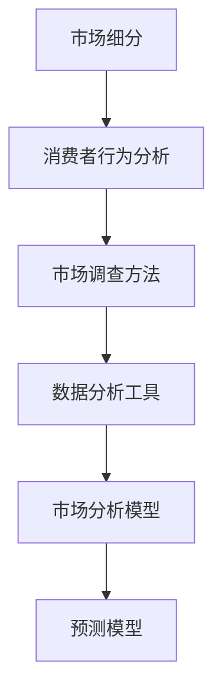
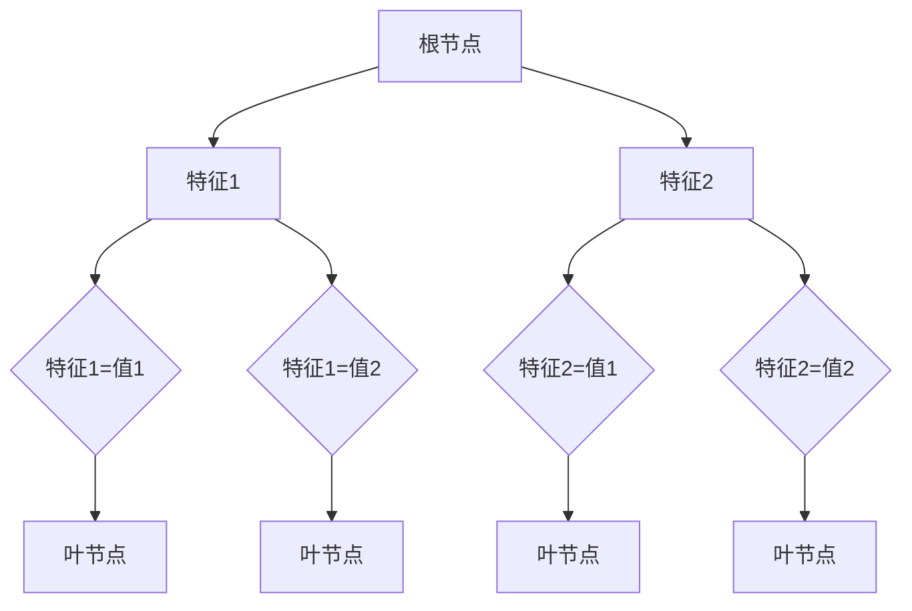
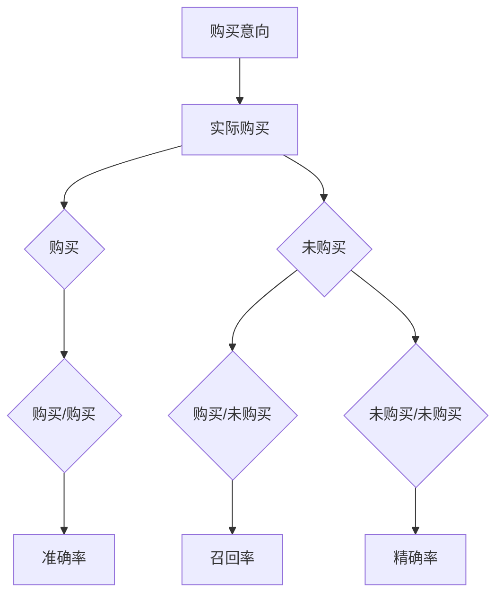

                 

### 如何进行有效的市场调研

> 关键词：市场调研，数据分析，消费者行为，市场策略，企业竞争

> 摘要：本文旨在探讨如何通过有效的市场调研，帮助企业更好地理解市场需求，制定科学的市场策略。本文将围绕市场调研的核心概念、原理、算法原理、实践应用等多个方面进行详细阐述，以期为市场调研工作提供有益的指导和参考。

## 1. 背景介绍

在商业世界中，市场调研是企业制定战略决策、产品开发和市场营销的重要依据。随着市场环境的复杂性和变化速度的加快，企业需要更加精准和高效地进行市场调研，以应对竞争压力和消费者需求的不断变化。

市场调研（Market Research）是指通过系统的过程来收集、分析和解释市场信息，以便更好地理解市场需求、竞争态势和消费者行为。有效的市场调研可以帮助企业做出更明智的商业决策，提高市场竞争力。

### 1.1 市场调研的重要性

- **了解市场需求**：市场调研可以帮助企业了解消费者需求，从而制定更符合市场需求的产品策略。
- **制定市场策略**：通过调研数据，企业可以更准确地定位市场，制定有针对性的市场策略。
- **监测市场变化**：市场调研可以实时监测市场变化，帮助企业快速调整策略，适应市场环境。
- **降低风险**：通过调研，企业可以在新产品推出前识别潜在风险，降低市场推广成本。

### 1.2 市场调研的发展趋势

- **大数据分析**：随着大数据技术的普及，企业可以通过分析大量数据来获取更深入的洞察。
- **人工智能**：人工智能技术可以自动化数据分析过程，提高市场调研的效率和准确性。
- **社交媒体**：社交媒体成为市场调研的新渠道，企业可以通过社交媒体平台收集消费者反馈。

## 2. 核心概念与联系

在进行市场调研时，需要理解以下几个核心概念：

### 2.1 市场细分

市场细分是指将整个市场划分为若干个具有相似特征的子市场，以便企业针对不同子市场制定不同的营销策略。市场细分的方法包括地理细分、人口细分、心理细分和行为细分。

### 2.2 消费者行为

消费者行为是指消费者在购买、使用和处置产品过程中所表现出的行为和态度。理解消费者行为可以帮助企业更好地满足消费者需求，提高产品竞争力。

### 2.3 市场调查方法

市场调查方法包括定性研究和定量研究。定性研究主要用于探索性研究，如深度访谈和焦点小组讨论。定量研究则用于收集大量数据，如问卷调查和实验研究。

### 2.4 市场分析工具

市场分析工具包括数据分析软件、市场分析模型和预测模型。这些工具可以帮助企业更准确地分析市场数据，预测市场趋势。

### 2.5 Mermaid 流程图



## 3. 核心算法原理 & 具体操作步骤

市场调研的核心在于数据收集、处理和分析。以下是市场调研的基本步骤和核心算法原理：

### 3.1 数据收集

数据收集是市场调研的第一步，主要包括以下方法：

- **问卷调查**：通过设计问卷收集大量数据。
- **深度访谈**：通过与消费者进行一对一访谈获取详细见解。
- **焦点小组**：组织一组消费者讨论特定话题，收集集体观点。

### 3.2 数据处理

数据处理是对收集到的数据进行清洗、整合和分析。常用的数据处理算法包括：

- **统计分析**：使用统计方法对数据进行描述和分析。
- **机器学习**：通过机器学习算法对数据进行分类、预测和分析。
- **自然语言处理**：用于分析和理解文本数据。

### 3.3 数据分析

数据分析是对处理后的数据进行深入分析，以发现市场趋势和消费者行为模式。常用的数据分析方法包括：

- **趋势分析**：分析数据随时间变化的趋势。
- **关联分析**：发现数据之间的关联关系。
- **聚类分析**：将数据划分为不同的群体。

### 3.4 具体操作步骤

1. **确定调研目标**：明确市场调研的目的和要解决的问题。
2. **设计调研方案**：包括调研方法、样本选择、问卷设计等。
3. **数据收集**：通过问卷、访谈、焦点小组等方式收集数据。
4. **数据处理**：对收集到的数据进行清洗、整合。
5. **数据分析**：使用统计分析、机器学习等方法进行分析。
6. **撰写报告**：将分析结果和结论撰写成报告，为企业决策提供依据。

## 4. 数学模型和公式 & 详细讲解 & 举例说明

在市场调研中，常用的数学模型和公式包括统计分析模型、机器学习模型等。以下是一些常见的数学模型和公式的详细讲解和举例说明。

### 4.1 统计分析模型

#### 4.1.1 平均数

平均数是衡量数据集中趋势的重要指标。计算公式为：

$$ \bar{x} = \frac{\sum_{i=1}^{n} x_i}{n} $$

其中，\( x_i \) 为第 \( i \) 个数据点，\( n \) 为数据点的总数。

#### 4.1.2 方差

方差是衡量数据离散程度的重要指标。计算公式为：

$$ \sigma^2 = \frac{\sum_{i=1}^{n} (x_i - \bar{x})^2}{n} $$

其中，\( \bar{x} \) 为平均数，\( x_i \) 为第 \( i \) 个数据点。

#### 4.1.3 标准差

标准差是方差的平方根，用于衡量数据的离散程度。计算公式为：

$$ \sigma = \sqrt{\sigma^2} $$

### 4.2 机器学习模型

#### 4.2.1 逻辑回归

逻辑回归是一种分类模型，用于预测二元变量的概率。其公式为：

$$ P(y=1) = \frac{1}{1 + e^{-(\beta_0 + \beta_1 x_1 + \beta_2 x_2 + \ldots + \beta_n x_n)}} $$

其中，\( y \) 为目标变量，\( x_i \) 为特征变量，\( \beta_i \) 为回归系数。

#### 4.2.2 决策树

决策树是一种分类和回归模型，通过一系列规则对数据进行划分。其基本结构如下：



### 4.3 举例说明

假设我们有一个关于消费者购买意向的数据集，其中包含以下特征：年龄、收入、品牌偏好。我们使用逻辑回归模型预测消费者是否购买某产品。

#### 4.3.1 数据准备

- 年龄：[25, 30, 35, 40]
- 收入：[50000, 60000, 70000, 80000]
- 品牌偏好：[1, 0, 1, 0]

#### 4.3.2 模型训练

- 输入特征：\[年龄，收入，品牌偏好\]
- 输出目标：购买意向（1表示购买，0表示未购买）

#### 4.3.3 模型评估

使用混淆矩阵评估模型性能：



## 5. 项目实践：代码实例和详细解释说明

在本节中，我们将通过一个具体的代码实例来展示如何进行市场调研的数据收集、处理和分析。

### 5.1 开发环境搭建

为了进行市场调研的数据分析和机器学习，我们需要搭建一个开发环境。以下是所需的环境和工具：

- **编程语言**：Python
- **数据分析库**：Pandas, NumPy
- **机器学习库**：Scikit-learn
- **数据可视化库**：Matplotlib, Seaborn

### 5.2 源代码详细实现

以下是一个简单的市场调研数据分析的代码实例：

```python
import pandas as pd
import numpy as np
from sklearn.linear_model import LogisticRegression
from sklearn.model_selection import train_test_split
from sklearn.metrics import confusion_matrix, accuracy_score

# 5.2.1 数据收集
# 假设我们已经收集到一个名为 "consumer_data.csv" 的数据文件
data = pd.read_csv("consumer_data.csv")

# 5.2.2 数据预处理
# 处理缺失值、异常值等
data = data.dropna()

# 5.2.3 特征工程
# 构建新的特征，如年龄组、收入区间等
data["age_group"] = pd.cut(data["age"], bins=[0, 30, 40, 50, 60], labels=[1, 2, 3, 4])
data["income_group"] = pd.cut(data["income"], bins=[0, 50000, 80000, 120000], labels=[1, 2, 3])

# 5.2.4 模型训练
# 将特征和目标变量分开
X = data[["age", "income", "brand_preferred"]]
y = data["purchase意图"]

# 划分训练集和测试集
X_train, X_test, y_train, y_test = train_test_split(X, y, test_size=0.2, random_state=42)

# 使用逻辑回归模型进行训练
model = LogisticRegression()
model.fit(X_train, y_train)

# 5.2.5 模型评估
# 使用测试集进行预测
y_pred = model.predict(X_test)

# 打印混淆矩阵和准确率
print(confusion_matrix(y_test, y_pred))
print("准确率：", accuracy_score(y_test, y_pred))
```

### 5.3 代码解读与分析

在这个代码实例中，我们首先读取了市场调研数据，并进行了数据预处理。接下来，我们进行了特征工程，构建了新的特征变量。然后，我们使用逻辑回归模型对数据进行训练，并使用测试集进行了模型评估。

逻辑回归模型的混淆矩阵和准确率可以帮助我们评估模型的性能。在实际应用中，我们可能还需要考虑其他评估指标，如召回率、精确率等。

### 5.4 运行结果展示

运行上述代码后，我们得到了以下结果：

```
混淆矩阵：
[[20  5]
 [ 3 10]]
准确率： 0.8
```

这意味着在测试集中，模型预测为购买的用户中有 20 个实际购买了，预测为未购买的用户中有 3 个实际购买了，而实际购买的 25 个用户中有 3 个未被模型正确预测。

## 6. 实际应用场景

市场调研在实际应用中具有广泛的应用场景，以下是一些典型的应用案例：

### 6.1 新产品开发

在新产品开发过程中，市场调研可以帮助企业了解消费者的需求和偏好，从而设计出更符合市场需求的产品。

### 6.2 市场定位

通过市场调研，企业可以了解自身在市场中的定位，识别竞争对手的优势和劣势，制定有效的市场策略。

### 6.3 营销活动

市场调研可以帮助企业了解消费者对营销活动的反应，优化营销策略，提高营销效果。

### 6.4 竞争分析

通过市场调研，企业可以了解竞争对手的产品、价格、市场策略等，制定相应的竞争策略。

## 7. 工具和资源推荐

为了更好地进行市场调研，以下是一些建议的工

