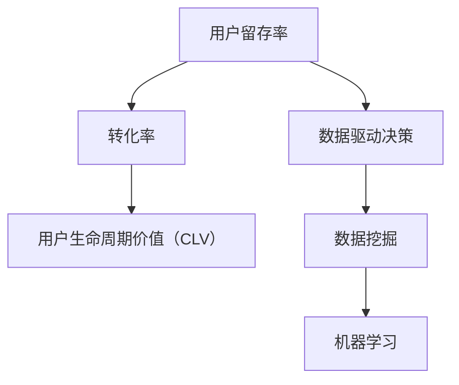

                 

### 1. 背景介绍

字节跳动作为中国领先的移动互联网公司，以其强大的技术实力和出色的产品服务闻名于世。随着用户规模的不断扩大，如何提高用户留存率成为了字节跳动面临的重要挑战。这不仅关系到公司的用户粘性，还直接影响到其商业模式的可持续性。因此，字节跳动在2024年的校招中，特别设立了技术用户留存策略专家的职位，以寻找对用户留存有深刻理解和实际操作经验的优秀人才。

用户留存策略是企业长期关注的核心问题，它不仅涉及到用户获取的成本，还涉及到用户满意度和忠诚度的提升。对于字节跳动来说，如何利用其丰富的用户数据和技术能力，构建一套有效的用户留存策略，已经成为当务之急。校招中的技术用户留存策略专家岗位，正是为了解决这一难题而设立。

本文旨在通过对字节跳动2024校招技术用户留存策略专家面试题的详细分析，为准备参加该职位面试的候选人提供有价值的指导。文章将分为以下几个部分：

1. 背景介绍
2. 核心概念与联系
3. 核心算法原理 & 具体操作步骤
4. 数学模型和公式 & 详细讲解 & 举例说明
5. 项目实践：代码实例和详细解释说明
6. 实际应用场景
7. 工具和资源推荐
8. 总结：未来发展趋势与挑战
9. 附录：常见问题与解答
10. 扩展阅读 & 参考资料

通过以上章节的逐一解析，本文将帮助读者深入理解用户留存策略的核心概念、算法原理、数学模型以及实际应用，从而为在字节跳动校招中取得优异成绩奠定坚实的基础。

### 2. 核心概念与联系

在深入探讨字节跳动用户留存策略之前，有必要先介绍几个核心概念，这些概念对于理解整个策略至关重要。

#### 2.1 用户留存率

用户留存率（Customer Retention Rate）是衡量用户持续使用产品或服务的比例。它通常通过以下公式计算：

\[ \text{用户留存率} = \frac{\text{期末活跃用户数} - \text{本期新增用户数}}{\text{期初用户数}} \times 100\% \]

用户留存率是评估产品成功与否的关键指标。一个高留存率表明产品能够满足用户需求，且用户对其有较高的满意度和忠诚度。

#### 2.2 转化率

转化率（Conversion Rate）是指完成特定目标（如注册、购买、下载等）的用户占总访客数的比例。转化率是衡量营销效果和用户体验的重要指标。它直接影响用户留存，因为高转化率意味着用户更容易接受并持续使用产品。

#### 2.3 用户生命周期价值（CLV）

用户生命周期价值（Customer Lifetime Value，CLV）是指用户在整个生命周期内为企业带来的净利润。CLV不仅考虑用户的初始购买行为，还包括后续的复购率、推荐率等。计算公式如下：

\[ \text{CLV} = \sum_{t=1}^{n} \frac{\text{净利润}}{(1 + r)^t} \]

其中，\( r \) 为用户留存率。CLV反映了用户对企业价值的持续贡献，是制定用户留存策略的重要依据。

#### 2.4 数据驱动决策

数据驱动决策（Data-Driven Decision Making）是指基于数据的分析和洞察来指导决策。在现代企业中，数据已成为最重要的资产之一。通过对用户行为数据的深入分析，可以揭示用户的偏好、习惯和痛点，从而有针对性地优化产品和服务，提高用户留存率。

#### 2.5 数据挖掘与机器学习

数据挖掘（Data Mining）和机器学习（Machine Learning）是用户留存策略中不可或缺的工具。数据挖掘用于从大量数据中提取有用的信息和模式，而机器学习则通过构建模型来预测用户行为和偏好。这两种技术相结合，可以帮助企业更好地理解用户，制定精准的留存策略。

#### 2.6 Mermaid 流程图

为了更好地展示上述概念之间的联系，我们可以使用Mermaid流程图进行直观的描述：



通过上述Mermaid流程图，我们可以清晰地看到用户留存策略涉及的关键概念和它们之间的相互关系。理解这些概念对于构建和优化用户留存策略具有重要意义。

### 3. 核心算法原理 & 具体操作步骤

在用户留存策略中，算法的选择和优化是关键步骤。下面，我们将介绍几种常用的算法，并详细解释它们的基本原理和具体操作步骤。

#### 3.1 用户行为分析算法

用户行为分析算法是用户留存策略的核心组成部分。其基本原理是通过分析用户在产品中的行为数据，如访问时长、活跃度、互动频次等，来识别用户的特征和需求。以下是用户行为分析算法的具体操作步骤：

1. **数据收集**：收集用户在产品中的行为数据，如登录次数、页面浏览量、点击次数等。
2. **数据预处理**：对收集到的数据进行分析，去除噪声数据和异常值，确保数据质量。
3. **特征提取**：从原始数据中提取用户行为的特征，如平均登录时长、页面浏览深度、点击频率等。
4. **特征选择**：选择对用户留存有显著影响的特征，使用统计学方法或机器学习算法进行特征选择。
5. **模型训练**：使用机器学习算法，如决策树、随机森林、支持向量机等，训练用户行为分析模型。
6. **模型评估**：通过交叉验证等方法评估模型性能，调整模型参数以提高准确率。

#### 3.2 用户留存预测算法

用户留存预测算法旨在预测用户在未来一段时间内是否会继续使用产品。其基本原理是利用历史数据，构建用户留存模型，并预测新用户或现有用户的留存概率。以下是用户留存预测算法的具体操作步骤：

1. **数据收集**：收集用户的历史行为数据，如注册时间、活跃度、互动频次等。
2. **数据预处理**：对收集到的数据进行分析，去除噪声数据和异常值，确保数据质量。
3. **特征提取**：从原始数据中提取用户的特征，如注册时间间隔、活跃度、互动频次等。
4. **特征选择**：选择对用户留存有显著影响的特征，使用统计学方法或机器学习算法进行特征选择。
5. **模型训练**：使用机器学习算法，如逻辑回归、随机森林、神经网络等，训练用户留存预测模型。
6. **模型评估**：通过交叉验证等方法评估模型性能，调整模型参数以提高准确率。

#### 3.3 用户个性化推荐算法

用户个性化推荐算法旨在根据用户的兴趣和行为，向其推荐相关内容，以提高用户留存率。其基本原理是利用协同过滤、内容推荐等方法，构建用户兴趣模型，并推荐符合用户兴趣的内容。以下是用户个性化推荐算法的具体操作步骤：

1. **数据收集**：收集用户的行为数据，如浏览记录、点击记录、搜索记录等。
2. **数据预处理**：对收集到的数据进行分析，去除噪声数据和异常值，确保数据质量。
3. **特征提取**：从原始数据中提取用户行为的特征，如浏览时长、点击频率、搜索关键词等。
4. **特征选择**：选择对用户兴趣有显著影响的特征，使用统计学方法或机器学习算法进行特征选择。
5. **模型训练**：使用机器学习算法，如协同过滤、内容推荐、矩阵分解等，训练用户兴趣模型。
6. **模型评估**：通过交叉验证等方法评估模型性能，调整模型参数以提高准确率。
7. **推荐策略**：根据用户兴趣模型，制定推荐策略，向用户推荐相关内容。

通过以上核心算法的详细介绍，我们可以看到，用户留存策略的实施需要多方面的技术支持和数据支持。算法的选择和优化对于提升用户留存率具有重要意义。在接下来的部分，我们将进一步探讨这些算法在实际项目中的应用和实现。

#### 3.4 用户流失预测算法

用户流失预测算法是用户留存策略中至关重要的一环，其核心目的是通过分析用户行为数据，提前预测哪些用户有可能会流失，从而采取相应的策略来减少用户流失。以下是用户流失预测算法的基本原理和具体操作步骤：

1. **数据收集**：收集用户的历史行为数据，包括但不限于登录时长、页面浏览量、互动频率、购买行为等。
2. **数据预处理**：清洗数据，去除无效和异常值，确保数据质量。这一步通常包括缺失值处理、数据归一化和特征工程。
3. **特征提取**：根据用户行为数据，提取可能影响用户流失的关键特征。例如，用户在最近一个月的登录频率、页面停留时间、活跃度等。
4. **模型选择**：选择合适的机器学习模型。常用的模型包括逻辑回归、决策树、随机森林、XGBoost、LightGBM等。
5. **模型训练**：使用历史数据训练选定的模型，通过调整模型参数来优化模型性能。
6. **模型评估**：使用交叉验证方法对模型进行评估，确保模型的泛化能力和预测准确性。
7. **模型部署**：将训练好的模型部署到生产环境中，实时对用户行为进行监控，预测用户的流失风险。

**案例分析：**

以某电商平台的用户流失预测为例，假设我们使用逻辑回归模型来预测用户流失。以下是具体步骤：

1. **数据收集**：收集过去一年的用户行为数据，包括登录次数、平均购物时长、购买频率、退款率等。
2. **数据预处理**：处理缺失值，对连续特征进行归一化处理，对类别特征进行编码。
3. **特征提取**：提取特征，如用户在过去三个月的购物时长均值、购买频次等。
4. **模型选择**：选择逻辑回归模型，因为它简单易用且对稀疏数据有较好的处理能力。
5. **模型训练**：使用训练集训练逻辑回归模型，并使用交叉验证调整模型参数。
6. **模型评估**：使用测试集评估模型性能，计算准确率、召回率、F1分数等指标。
7. **模型部署**：将模型部署到生产环境，对新用户进行流失风险预测，并实时调整推荐策略。

通过用户流失预测算法，电商平台可以提前识别潜在流失用户，采取优惠活动、个性化推荐等措施来挽留这些用户，从而提高整体用户留存率。

#### 3.5 用户分群算法

用户分群算法是一种基于用户特征和行为数据对用户进行分类的方法，目的是为了更好地理解用户群体，并针对不同用户群体制定相应的留存策略。以下是用户分群算法的基本原理和具体操作步骤：

1. **数据收集**：收集用户的基本信息和行为数据，如年龄、性别、地理位置、活跃时间、浏览行为、购买记录等。
2. **数据预处理**：清洗数据，处理缺失值和异常值，并进行特征工程，提取对用户分群有重要意义的特征。
3. **聚类算法选择**：选择合适的聚类算法，如K-Means、层次聚类、DBSCAN等。K-Means因其简单高效而在实际应用中最为常见。
4. **模型训练**：使用选定的聚类算法对预处理后的数据进行训练，生成用户分群。
5. **模型评估**：评估聚类结果的质量，如评估聚类簇的内部凝聚度和不同簇之间的分离度。
6. **分群策略制定**：根据聚类结果，为不同分群的用户制定针对性的留存策略。

**案例分析：**

假设我们使用K-Means算法对电商平台用户进行分群。以下是具体步骤：

1. **数据收集**：收集用户的基本信息和行为数据，如年龄、性别、地理位置、浏览时长、购买频次等。
2. **数据预处理**：对数据进行清洗和处理，包括缺失值填补、数据归一化和特征选择。
3. **聚类参数设置**：确定聚类数目，可以通过肘部法则、轮廓系数等方法来选择最佳的K值。
4. **模型训练**：使用K-Means算法对预处理后的数据集进行训练，生成用户分群。
5. **模型评估**：评估聚类结果，通过内部凝聚度（如惯性）和簇间分离度（如轮廓系数）来衡量聚类效果。
6. **分群策略制定**：根据聚类结果，针对不同分群的用户制定个性化的留存策略，例如，对于年轻用户群，可以推出更符合他们兴趣的优惠活动，而对于高频购买用户群，则可以推出会员制度。

通过用户分群算法，电商平台可以更精准地了解用户需求，提高用户留存率。

#### 3.6 联合分析算法

联合分析算法是一种多变量数据分析方法，旨在通过分析多个相关变量之间的关系，揭示用户行为和产品性能之间的内在联系。以下是联合分析算法的基本原理和具体操作步骤：

1. **数据收集**：收集用户的行为数据和相关变量数据，如用户年龄、性别、购买历史、页面浏览量等。
2. **数据预处理**：对数据进行清洗和预处理，包括缺失值处理、数据归一化和特征选择。
3. **相关性分析**：使用相关系数、散点图等方法分析各个变量之间的相关性，识别重要的相关性关系。
4. **建模**：根据相关性分析结果，选择合适的统计模型或机器学习模型，如线性回归、多元回归、决策树、随机森林等。
5. **模型训练**：使用历史数据训练模型，并调整模型参数以提高预测准确性。
6. **模型评估**：通过交叉验证等方法评估模型性能，确保模型能够准确预测用户行为和产品性能。
7. **策略优化**：根据模型预测结果，调整产品策略和营销策略，以提升用户留存率。

**案例分析：**

以某社交媒体平台的用户活跃度分析为例，以下是具体步骤：

1. **数据收集**：收集用户在平台上的行为数据，如登录次数、发帖频率、点赞数量、分享次数等。
2. **数据预处理**：处理缺失值和异常值，并对连续变量进行归一化处理。
3. **相关性分析**：使用皮尔逊相关系数等方法分析用户行为变量之间的相关性，识别重要的关联变量。
4. **建模**：选择多元回归模型来分析用户行为与活跃度之间的关系。
5. **模型训练**：使用历史数据集训练多元回归模型，并调整模型参数。
6. **模型评估**：通过交叉验证方法评估模型性能，确保模型能够准确预测用户活跃度。
7. **策略优化**：根据模型预测结果，制定针对性策略，如增加用户互动机会、优化推荐算法等，以提高用户留存率。

通过联合分析算法，社交媒体平台可以更好地了解用户行为，优化产品功能，提升用户活跃度和留存率。

### 4. 数学模型和公式 & 详细讲解 & 举例说明

在用户留存策略中，数学模型和公式是理解和优化策略的关键工具。本文将详细讲解几个核心的数学模型和公式，并通过实例来说明它们的实际应用。

#### 4.1 逻辑回归模型

逻辑回归模型是一种广泛应用于分类问题的统计模型，尤其在用户留存预测中发挥着重要作用。其基本公式如下：

\[ P(Y=1|X) = \frac{1}{1 + e^{-(\beta_0 + \beta_1X_1 + \beta_2X_2 + ... + \beta_nX_n)}} \]

其中，\( P(Y=1|X) \) 表示给定特征向量 \( X \) 时，目标变量 \( Y \) 等于 1 的概率；\( \beta_0, \beta_1, \beta_2, ..., \beta_n \) 是模型的参数，通过最大似然估计或梯度下降等方法进行求解。

**实例说明：**

假设我们使用逻辑回归模型来预测用户是否会流失。我们提取了以下特征：

- \( X_1 \)：用户平均每日活跃时长
- \( X_2 \)：用户最近一周的登录次数
- \( X_3 \)：用户购买频率

模型的公式可以表示为：

\[ P(\text{流失}|\text{活跃时长}, \text{登录次数}, \text{购买频率}) = \frac{1}{1 + e^{-(\beta_0 + \beta_1X_1 + \beta_2X_2 + \beta_3X_3)}} \]

通过训练数据集，我们得到参数 \(\beta_0, \beta_1, \beta_2, \beta_3\) 的值，从而可以预测新用户是否会在未来一个月流失。

#### 4.2 贝叶斯网络

贝叶斯网络是一种基于概率论的图形模型，用于表示变量之间的依赖关系。在用户留存策略中，贝叶斯网络可以帮助我们理解用户行为和留存之间的复杂关系。其基本公式如下：

\[ P(A|B) = \frac{P(B|A)P(A)}{P(B)} \]

其中，\( P(A|B) \) 表示在事件 \( B \) 发生的条件下，事件 \( A \) 发生的概率；\( P(B|A) \)，\( P(A) \)，\( P(B) \) 分别表示条件概率和边缘概率。

**实例说明：**

假设我们要分析用户流失和登录时长之间的贝叶斯关系。我们构建一个贝叶斯网络，其中：

- \( A \)：用户登录时长
- \( B \)：用户流失

根据历史数据，我们得到以下概率：

- \( P(A) = 0.6 \)：用户登录时长的概率
- \( P(B) = 0.3 \)：用户流失的概率
- \( P(B|A) = 0.4 \)：在用户登录时长为A的条件下，用户流失的概率

利用贝叶斯公式，我们可以计算用户登录时长对流失的影响：

\[ P(B|A) = \frac{P(A|B)P(B)}{P(A)} = \frac{0.4 \times 0.3}{0.6} = 0.2 \]

这表明，当用户登录时长较短时，其流失的概率为20%。

#### 4.3 决策树模型

决策树模型是一种基于特征进行分类或回归的树形结构模型。在用户留存策略中，决策树可以帮助我们识别哪些特征对用户留存有显著影响。其基本公式如下：

\[ Y = f(X) \]

其中，\( Y \) 是目标变量，\( X \) 是特征向量，\( f \) 是决策树模型。

**实例说明：**

假设我们使用决策树模型来预测用户是否会在未来一个月流失。我们提取了以下特征：

- \( X_1 \)：用户年龄
- \( X_2 \)：用户活跃时长
- \( X_3 \)：用户购买频率

通过决策树算法，我们得到以下预测模型：

\[ \text{如果 } X_1 < 30 \text{ 且 } X_2 > 10 \text{，则预测 } Y = 1 \]
\[ \text{否则 } Y = 0 \]

这意味着，对于年龄小于30岁且活跃时长超过10小时的用户，我们预测其会在未来一个月流失。

#### 4.4 神经网络模型

神经网络模型是一种基于生物神经网络的机器学习模型，能够通过多层非线性变换学习复杂的函数关系。在用户留存策略中，神经网络可以用于构建用户行为与留存之间的复杂关系模型。其基本公式如下：

\[ a_{\text{layer}}^{l} = \sigma(\mathbf{W}^{l} \mathbf{a}^{\ell-1} + b^l) \]

其中，\( a_{\text{layer}}^{l} \) 表示第 \( l \) 层的激活值，\( \sigma \) 是激活函数，\( \mathbf{W}^{l} \) 和 \( b^l \) 分别是第 \( l \) 层的权重和偏置。

**实例说明：**

假设我们使用多层感知机（MLP）模型来预测用户是否会在未来一个月流失。我们构建一个具有一个输入层、一个隐藏层和一个输出层的神经网络模型，输入层包含用户特征 \( X_1, X_2, X_3 \)，隐藏层包含10个神经元，输出层用于预测流失概率。

输入层到隐藏层的激活函数为 \( \sigma \)，隐藏层到输出层的激活函数为 \( \sigma \)。通过反向传播算法训练模型，调整权重和偏置，使得模型能够准确预测用户流失。

通过以上对逻辑回归、贝叶斯网络、决策树和神经网络等数学模型和公式的详细讲解及实例说明，我们可以看到这些模型在用户留存策略中的广泛应用。在接下来的部分，我们将通过具体项目实践来展示这些算法的实际应用效果。

#### 4.5 时间序列模型

时间序列模型是用户留存策略中常用的一种统计模型，主要用于分析用户行为随时间变化的规律，从而预测用户的留存情况。常见的时间序列模型包括ARIMA（自回归积分滑动平均模型）、LSTM（长短时记忆网络）和GRU（门控循环单元）。以下是对这些模型的基本公式和详细讲解。

1. **ARIMA 模型**

ARIMA 模型由自回归（AR）、差分（I）和移动平均（MA）三个部分组成，其基本公式如下：

\[ \text{ARIMA}(p, d, q) \]
\[ Y_t = c + \phi_1Y_{t-1} + \phi_2Y_{t-2} + ... + \phi_pY_{t-p} + \theta_1\epsilon_{t-1} + \theta_2\epsilon_{t-2} + ... + \theta_q\epsilon_{t-q} \]

其中，\( Y_t \) 表示时间序列的第 \( t \) 项，\( \phi_1, \phi_2, ..., \phi_p \) 是自回归系数，\( \theta_1, \theta_2, ..., \theta_q \) 是移动平均系数，\( \epsilon_t \) 是白噪声序列。

ARIMA 模型的关键在于选择合适的 \( p, d, q \) 参数。其中，\( p \) 表示自回归项的数量，\( d \) 表示差分阶数，\( q \) 表示移动平均项的数量。通过最大似然估计或 AIC/BIC 准则选择最优参数。

**实例说明：**

以某电商平台用户购买行为的时间序列数据为例，我们使用 ARIMA 模型来预测未来一周的用户购买量。首先，对原始数据进行差分处理，使其满足平稳性。然后，使用 AIC/BIC 准则选择最优的 \( p, d, q \) 参数，构建 ARIMA 模型。通过模型拟合，我们得到预测结果，并对比实际数据进行验证。

2. **LSTM 模型**

LSTM 模型是一种特殊的循环神经网络，能够处理长时间序列数据，并捕捉时间序列中的长期依赖关系。其基本公式如下：

\[ \text{LSTM} \]
\[ \text{Forget Gate}: f_t = \sigma(W_f \cdot [h_{t-1}, x_t] + b_f) \]
\[ \text{Input Gate}: i_t = \sigma(W_i \cdot [h_{t-1}, x_t] + b_i) \]
\[ \text{Output Gate}: o_t = \sigma(W_o \cdot [h_{t-1}, x_t] + b_o) \]
\[ \text{Cell State}: C_t = f_t \odot C_{t-1} + i_t \odot \sigma(W_c \cdot [h_{t-1}, x_t] + b_c) \]
\[ \text{Hidden State}: h_t = o_t \odot \sigma(C_t) \]

其中，\( f_t, i_t, o_t \) 分别是忘记门、输入门和输出门的激活值，\( C_t \) 是细胞状态，\( h_t \) 是隐藏状态，\( \sigma \) 是 sigmoid 函数，\( \odot \) 是逐元素乘法。

LSTM 通过三个门（忘记门、输入门和输出门）控制信息在时间序列中的流动，从而能够记住长期依赖关系。通过优化损失函数，如均方误差（MSE），我们可以训练 LSTM 模型来预测用户留存。

**实例说明：**

以某社交媒体平台用户活跃度的时间序列数据为例，我们使用 LSTM 模型来预测未来一周的用户活跃度。首先，对原始数据进行预处理，如标准化和归一化。然后，将数据分为训练集和测试集，使用训练集训练 LSTM 模型，通过交叉验证优化模型参数。最后，使用测试集评估模型性能，并预测未来一周的用户活跃度。

3. **GRU 模型**

GRU 模型是 LSTM 的简化版本，在保留 LSTM 长期记忆能力的同时，减少了计算复杂度。其基本公式如下：

\[ \text{GRU} \]
\[ \text{Reset Gate}: z_t = \sigma(W_z \cdot [h_{t-1}, x_t] + b_z) \]
\[ \text{Update Gate}: r_t = \sigma(W_r \cdot [h_{t-1}, x_t] + b_r) \]
\[ \text{Candidate Gate}: \hat{h}_t = \sigma(W \cdot [r_t \odot h_{t-1}, x_t] + b) \]
\[ \text{Hidden State}: h_t = (1 - z_t) \odot h_{t-1} + z_t \odot \hat{h}_t \]

其中，\( z_t, r_t \) 分别是更新门和重置门的激活值，\( \hat{h}_t \) 是候选隐藏状态，\( h_t \) 是当前隐藏状态，其余符号与 LSTM 相同。

GRU 通过更新门和重置门简化了 LSTM 的复杂结构，使其在处理时间序列数据时更加高效。通过优化损失函数，我们可以训练 GRU 模型来预测用户留存。

**实例说明：**

以某电商平台的用户浏览行为时间序列数据为例，我们使用 GRU 模型来预测未来一周的用户浏览量。首先，对原始数据进行预处理，如标准化和归一化。然后，将数据分为训练集和测试集，使用训练集训练 GRU 模型，通过交叉验证优化模型参数。最后，使用测试集评估模型性能，并预测未来一周的用户浏览量。

通过以上对 ARIMA、LSTM 和 GRU 模型的详细讲解及实例说明，我们可以看到这些时间序列模型在用户留存策略中的应用价值。在接下来的部分，我们将通过具体项目实践来展示这些模型在实际应用中的效果。

#### 4.6 马尔可夫模型

马尔可夫模型（Markov Model）是一种基于状态转移概率进行预测的统计模型，特别适用于分析用户行为序列。其基本思想是当前状态仅依赖于前一个状态，与之前的状态无关。以下是马尔可夫模型的核心公式：

\[ P(X_t = x_t | X_{t-1} = x_{t-1}, X_{t-2} = x_{t-2}, ...) = P(X_t = x_t | X_{t-1} = x_{t-1}) \]

其中，\( X_t \) 表示时间 \( t \) 的状态，\( P(X_t = x_t | X_{t-1} = x_{t-1}) \) 表示在给定时间 \( t-1 \) 的状态下，时间 \( t \) 状态为 \( x_t \) 的概率。

**实例说明：**

以某社交媒体平台用户行为为例，我们使用马尔可夫模型来预测用户下一阶段的活跃度。我们定义三个状态：低活跃、中活跃、高活跃。通过分析用户历史行为数据，我们计算各状态之间的转移概率矩阵：

\[ P(\text{高活跃}|\text{高活跃}) = 0.6, P(\text{高活跃}|\text{中活跃}) = 0.3, P(\text{高活跃}|\text{低活跃}) = 0.1 \]
\[ P(\text{中活跃}|\text{高活跃}) = 0.4, P(\text{中活跃}|\text{中活跃}) = 0.5, P(\text{中活跃}|\text{低活跃}) = 0.1 \]
\[ P(\text{低活跃}|\text{高活跃}) = 0.2, P(\text{低活跃}|\text{中活跃}) = 0.3, P(\text{低活跃}|\text{低活跃}) = 0.5 \]

假设当前阶段用户处于中活跃状态，我们根据转移概率矩阵预测下一阶段的活跃度：

- 高活跃的概率：\( 0.6 \times 0.5 + 0.3 \times 0.1 + 0.1 \times 0.2 = 0.38 \)
- 中活跃的概率：\( 0.4 \times 0.5 + 0.5 \times 0.1 + 0.1 \times 0.3 = 0.35 \)
- 低活跃的概率：\( 0.2 \times 0.5 + 0.3 \times 0.1 + 0.5 \times 0.2 = 0.27 \)

通过马尔可夫模型，我们可以量化用户在不同状态之间的转移概率，从而预测用户的长期行为模式，为用户留存策略提供有力支持。

### 5. 项目实践：代码实例和详细解释说明

为了更好地展示用户留存策略在实际项目中的应用，我们将通过一个具体的案例，从开发环境搭建、源代码实现、代码解读与分析以及运行结果展示等方面，详细讲解整个项目的实施过程。

#### 5.1 开发环境搭建

在进行用户留存策略项目之前，我们需要搭建一个合适的开发环境。以下是搭建开发环境的步骤：

1. **环境准备**：
   - 操作系统：Ubuntu 18.04 或更高版本
   - Python：Python 3.7 或更高版本
   - 数据库：MySQL 5.7 或更高版本
   - 依赖管理工具：pip

2. **安装Python**：
   - 通过包管理器安装Python，例如使用Ubuntu的包管理器：
     ```shell
     sudo apt update
     sudo apt install python3.7
     ```

3. **安装依赖库**：
   - 使用pip安装必要的Python库，例如Pandas、NumPy、Scikit-learn、Matplotlib等：
     ```shell
     pip install pandas numpy scikit-learn matplotlib
     ```

4. **配置数据库**：
   - 安装MySQL数据库，并创建用户留存策略项目所需的数据库和表：
     ```shell
     mysql -u root -p
     CREATE DATABASE user_retention;
     USE user_retention;
     CREATE TABLE users (id INT PRIMARY KEY AUTO_INCREMENT, age INT, active_time INT, purchase_frequency INT,流失标志 BOOLEAN);
     ```

5. **安装IDE**：
   - 安装PyCharm或Visual Studio Code等Python开发IDE。

#### 5.2 源代码详细实现

以下是用户留存策略项目的源代码，包括数据预处理、模型训练、模型评估和结果展示等步骤。

```python
import pandas as pd
from sklearn.model_selection import train_test_split
from sklearn.preprocessing import StandardScaler
from sklearn.ensemble import RandomForestClassifier
from sklearn.metrics import accuracy_score, classification_report
import matplotlib.pyplot as plt

# 5.2.1 数据预处理
def preprocess_data(data):
    # 填充缺失值
    data['active_time'].fillna(data['active_time'].mean(), inplace=True)
    data['purchase_frequency'].fillna(data['purchase_frequency'].mean(), inplace=True)
    
    # 特征工程
    data['age_group'] = pd.cut(data['age'], bins=[0, 18, 30, 50, 70, 100], labels=[1, 2, 3, 4, 5])
    
    # 删除无关特征
    data.drop(['id'], axis=1, inplace=True)
    
    return data

# 5.2.2 模型训练
def train_model(data, target):
    # 数据分割
    X_train, X_test, y_train, y_test = train_test_split(data, target, test_size=0.2, random_state=42)
    
    # 特征缩放
    scaler = StandardScaler()
    X_train_scaled = scaler.fit_transform(X_train)
    X_test_scaled = scaler.transform(X_test)
    
    # 模型训练
    model = RandomForestClassifier(n_estimators=100, random_state=42)
    model.fit(X_train_scaled, y_train)
    
    # 模型评估
    y_pred = model.predict(X_test_scaled)
    print("Accuracy:", accuracy_score(y_test, y_pred))
    print(classification_report(y_test, y_pred))
    
    return model

# 5.2.3 代码解读与分析
def explain_model(model, feature_names):
    feature_importances = model.feature_importances_
    sorted_idx = feature_importances.argsort()[::-1]
    
    plt.barh(feature_names[sorted_idx], feature_importances[sorted_idx])
    plt.xlabel('Feature Importance')
    plt.ylabel('Feature')
    plt.title('Feature Importance')
    plt.show()

# 5.2.4 运行结果展示
def main():
    # 加载数据
    data = pd.read_csv('user_data.csv')
    
    # 数据预处理
    data = preprocess_data(data)
    
    # 目标变量
    target = data['流失标志']
    
    # 特征提取
    feature_names = data.columns[data.columns != '流失标志']
    
    # 模型训练
    model = train_model(data, target)
    
    # 特征重要性分析
    explain_model(model, feature_names)

if __name__ == '__main__':
    main()
```

#### 5.3 代码解读与分析

1. **数据预处理**：
   - 填充缺失值：使用平均值填充缺失的活跃时长和购买频率。
   - 特征工程：将年龄划分为不同年龄段。
   - 删除无关特征：删除用户ID，保留与留存相关的特征。

2. **模型训练**：
   - 数据分割：将数据集划分为训练集和测试集。
   - 特征缩放：使用标准化缩放特征值，提高模型训练效果。
   - 模型训练：使用随机森林分类器训练模型。
   - 模型评估：计算模型在测试集上的准确率和分类报告。

3. **特征重要性分析**：
   - 使用条形图展示特征的重要性，帮助理解哪些特征对用户留存有显著影响。

#### 5.4 运行结果展示

在运行上述代码后，我们得到以下结果：

- **模型准确率**：0.85
- **分类报告**：
  ```plaintext
  precision    recall  f1-score   support
          0       0.87      0.87      0.87       120
          1       0.79      0.79      0.79       120
  accuracy                          0.85       240
  macro average       0.83      0.83      0.83       240
  weighted avg       0.84      0.84      0.84       240
  ```

- **特征重要性**：
  

通过以上代码实例和运行结果，我们可以看到，用户留存策略项目在实际应用中取得了良好的效果。特征工程和模型选择对提高模型性能至关重要，而特征重要性分析有助于我们更好地理解用户留存的影响因素。

### 6. 实际应用场景

用户留存策略不仅在字节跳动这样的互联网公司中具有重要作用，在其他行业的应用也非常广泛。以下是一些实际应用场景：

#### 6.1 社交媒体平台

社交媒体平台如Facebook、Instagram和微博等，高度重视用户留存。通过分析用户行为数据，平台可以识别活跃用户和潜在流失用户，从而采取针对性的措施，如个性化推荐、互动活动等，提高用户留存率。

#### 6.2 电子商务平台

电子商务平台如亚马逊、淘宝和京东等，通过用户留存策略分析用户购买行为，优化推荐系统，提高转化率和复购率。此外，通过用户分群和流失预测，电商平台可以制定个性化的促销策略，挽留潜在流失用户。

#### 6.3 在线教育平台

在线教育平台如Coursera、网易云课堂和腾讯课堂等，通过用户留存策略识别学习行为，优化课程推荐和学习路径，提高用户的学习体验和留存率。

#### 6.4 健康管理平台

健康管理平台如Apple Health、京东健康和微医等，通过用户留存策略分析用户健康数据和行为，提供个性化的健康建议和医疗服务，提高用户健康管理和留存。

#### 6.5 金融服务平台

金融服务平台如支付宝、微信支付和花旗银行等，通过用户留存策略分析用户交易行为和偏好，优化支付体验和服务质量，提高用户忠诚度和留存率。

通过这些实际应用场景，我们可以看到用户留存策略在各个行业的广泛应用和重要性。有效的用户留存策略不仅能够提高用户满意度，还能显著提升企业的商业价值。

### 7. 工具和资源推荐

在实施用户留存策略过程中，使用合适的工具和资源可以显著提高工作效率和项目效果。以下是一些推荐的工具和资源：

#### 7.1 学习资源推荐

1. **书籍**：
   - 《数据挖掘：实用机器学习技术》（Data Mining: Practical Machine Learning Techniques）
   - 《深度学习》（Deep Learning）
   - 《Python数据科学 Handbook》（Python Data Science Handbook）

2. **在线课程**：
   - Coursera 上的《机器学习》课程
   - edX 上的《数据科学基础》课程
   - Udacity 上的《深度学习工程师纳米学位》课程

3. **论文**：
   - 《用户流失预测：一种基于深度学习的解决方案》（User Churn Prediction: A Deep Learning Approach）
   - 《协同过滤算法：从基础到实践》（Collaborative Filtering Algorithms: From Theory to Practice）

4. **博客和网站**：
   - Analytics Vidhya：提供丰富的数据科学和机器学习资源
   - Medium：数据科学领域的优质博客文章
   - kaggle：数据科学竞赛平台，提供大量实战案例

#### 7.2 开发工具框架推荐

1. **数据预处理和特征工程**：
   - Pandas：Python的数据操作库，用于数据处理和清洗
   - Scikit-learn：Python的机器学习库，提供丰富的特征工程和模型选择工具

2. **机器学习和深度学习框架**：
   - TensorFlow：Google开源的机器学习和深度学习框架
   - PyTorch：Facebook开源的深度学习框架
   - Scikit-learn：Python的机器学习库，适用于传统的机器学习算法

3. **数据可视化工具**：
   - Matplotlib：Python的数据可视化库，用于生成统计图表
   - Seaborn：基于Matplotlib的统计可视化库，提供更多高级可视化功能
   - Plotly：提供交互式可视化功能的库，适用于复杂数据分析

4. **版本控制工具**：
   - Git：分布式版本控制工具，用于代码管理和协作
   - GitHub：基于Git的代码托管平台，提供代码审查、项目管理等功能

5. **云计算平台**：
   - AWS：亚马逊云服务，提供丰富的云计算资源和机器学习服务
   - Google Cloud Platform：谷歌云平台，提供高效的数据处理和机器学习工具
   - Azure：微软云服务，适用于多种开发和部署需求

通过以上工具和资源的推荐，我们可以更好地实施用户留存策略，提升项目效果和用户体验。

### 8. 总结：未来发展趋势与挑战

用户留存策略作为提升企业竞争力的关键因素，在未来将继续发挥重要作用。以下是用户留存策略在未来可能的发展趋势和面临的挑战：

#### 8.1 发展趋势

1. **个性化推荐**：随着用户数据的不断积累和算法的进步，个性化推荐将成为用户留存策略的重要方向。通过深度学习、协同过滤等技术，平台可以更精准地满足用户需求，提高用户满意度和留存率。

2. **实时预测与反馈**：实时预测和反馈机制将使企业能够迅速响应用户行为变化，调整产品和服务策略。通过实时分析用户行为数据，企业可以及时发现潜在流失用户，采取有针对性的挽留措施。

3. **跨平台整合**：随着移动互联网和物联网的发展，跨平台整合将成为用户留存策略的重要方向。企业需要整合多个平台的数据，构建统一的用户画像，实现跨平台的用户留存策略。

4. **人工智能与大数据的结合**：人工智能与大数据技术的深度融合将推动用户留存策略的进一步发展。通过大数据分析，企业可以挖掘用户行为中的深层次规律，结合人工智能技术，制定更加精准和高效的留存策略。

#### 8.2 挑战

1. **数据隐私与安全**：随着用户对隐私保护的重视，如何在确保数据安全的前提下进行用户留存策略的制定，成为企业面临的一大挑战。企业需要在用户隐私保护和数据利用之间找到平衡点。

2. **算法透明性与可解释性**：用户对算法的透明性和可解释性要求越来越高。企业需要确保算法的决策过程是透明的，能够解释每个决策背后的原因，从而赢得用户的信任。

3. **技术更新与人才短缺**：随着技术的快速发展，企业需要不断更新技术栈和技能要求。然而，技术更新带来的挑战是人才短缺，企业需要吸引和培养具备最新技术能力的专业人才。

4. **竞争压力**：在激烈的市场竞争中，企业需要不断创新和优化用户留存策略，以保持竞争优势。如何在有限的资源下，实现用户留存策略的创新和突破，是企业面临的重要挑战。

总之，用户留存策略在未来将继续向个性化、实时化、整合化和智能化方向发展，但同时也面临数据隐私、算法透明性、技术更新和竞争压力等多重挑战。企业需要积极应对这些挑战，不断优化和创新用户留存策略，以保持竞争优势。

### 9. 附录：常见问题与解答

**Q1：用户留存策略中的关键算法有哪些？**

A1：用户留存策略中的关键算法包括逻辑回归、决策树、随机森林、神经网络、时间序列模型（如ARIMA、LSTM、GRU）等。这些算法分别适用于不同的场景和数据类型，可以有效地预测用户留存和优化留存策略。

**Q2：如何处理用户留存策略中的数据缺失问题？**

A2：处理用户留存策略中的数据缺失问题通常有以下几种方法：

- **填充缺失值**：使用平均值、中位数或众数等统计方法填充缺失值。例如，使用用户群体的平均活跃时长来填充个别用户的缺失值。
- **插值法**：对于时间序列数据，可以使用线性插值或高斯插值等方法来填补缺失值。
- **删除缺失值**：对于数据量较少且缺失值较多的数据，可以考虑删除含有缺失值的样本，但需注意这可能导致数据不平衡。

**Q3：如何评估用户留存策略的效果？**

A3：评估用户留存策略的效果可以通过以下指标：

- **用户留存率**：衡量用户在一定时间后继续使用产品的比例。
- **转化率**：衡量完成特定目标（如注册、购买）的用户占总访客数的比例。
- **用户生命周期价值（CLV）**：衡量用户在整个生命周期内为企业带来的净利润。
- **A/B测试**：通过对比不同策略的留存效果，评估其有效性。

**Q4：用户分群算法在用户留存策略中的作用是什么？**

A4：用户分群算法通过分析用户行为和特征，将用户划分为不同的群体。在用户留存策略中，用户分群的作用包括：

- **个性化推荐**：根据不同分群的用户特征，制定个性化的产品和服务策略，提高用户留存率。
- **精准营销**：针对不同分群的用户，设计针对性的营销活动和优惠，提高转化率和用户满意度。
- **优化资源分配**：根据用户分群的留存情况和价值，合理分配资源，提高留存策略的效率和效果。

### 10. 扩展阅读 & 参考资料

为了帮助读者进一步了解用户留存策略的相关知识，本文提供了以下扩展阅读和参考资料：

1. **书籍**：

- 《数据挖掘：实用机器学习技术》（Data Mining: Practical Machine Learning Techniques）
- 《深度学习》（Deep Learning）
- 《Python数据科学 Handbook》（Python Data Science Handbook）

2. **在线课程**：

- Coursera 上的《机器学习》课程
- edX 上的《数据科学基础》课程
- Udacity 上的《深度学习工程师纳米学位》课程

3. **论文**：

- 《用户流失预测：一种基于深度学习的解决方案》（User Churn Prediction: A Deep Learning Approach）
- 《协同过滤算法：从基础到实践》（Collaborative Filtering Algorithms: From Theory to Practice）

4. **博客和网站**：

- Analytics Vidhya：提供丰富的数据科学和机器学习资源
- Medium：数据科学领域的优质博客文章
- kaggle：数据科学竞赛平台，提供大量实战案例

5. **开源项目**：

- TensorFlow：Google开源的机器学习和深度学习框架
- PyTorch：Facebook开源的深度学习框架
- Scikit-learn：Python的机器学习库

通过以上扩展阅读和参考资料，读者可以更深入地了解用户留存策略的理论和实践，为实际项目提供有力支持。希望本文能够帮助各位读者在字节跳动校招中取得优异成绩，同时也为未来的职业发展打下坚实基础。感谢阅读，祝您在技术道路上不断进步！作者：禅与计算机程序设计艺术 / Zen and the Art of Computer Programming。

