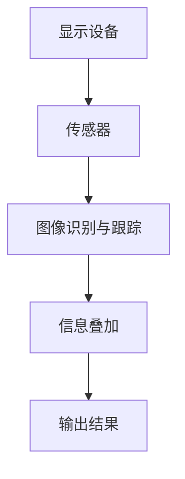
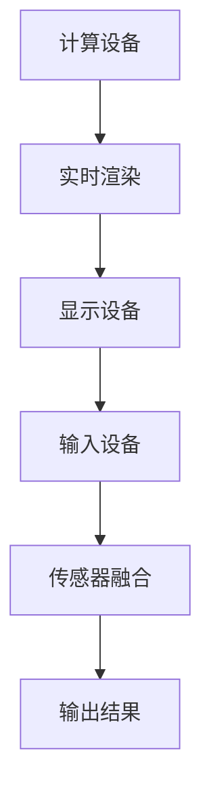

                 

### 背景介绍 Background Introduction ###

#### 1.1 字节跳动简介 Brief Introduction of ByteDance ####

字节跳动（ByteDance）成立于2012年，是中国领先的技术公司之一，以其创新的算法和内容平台而闻名。字节跳动旗下拥有多款知名的社交媒体和应用，包括抖音（TikTok）、今日头条、西瓜视频等。这些平台以其强大的个性化推荐算法、丰富的内容生态和创新的互动方式赢得了全球用户的高度认可。

#### 1.2 AR/VR技术在字节跳动的发展 Application of AR/VR Technology in ByteDance ####

随着科技的发展，增强现实（AR）和虚拟现实（VR）技术逐渐成为字节跳动战略布局中的重要一环。AR技术通过在现实环境中叠加数字信息，丰富了用户的交互体验，而VR技术则创造了一个完全虚拟的三维世界，让用户可以在其中沉浸式体验。

字节跳动在AR/VR领域的布局始于2016年，通过收购和自研，建立了一支强大的AR/VR团队。他们开发了包括Pico（一款VR头戴设备）、AR试妆等在内的多款AR/VR产品。此外，抖音、今日头条等平台也不断引入AR/VR内容，为用户提供更加丰富的互动体验。

#### 1.3 字节跳动2024校招：AR/VR开发工程师面试真题的重要性 Importance of AR/VR Development Engineer Interview Questions in ByteDance's 2024 Recruitment ####

每年，字节跳动都会举办校园招聘活动，吸引全球顶尖高校的优秀毕业生加入其团队。2024年的校招特别注重AR/VR开发工程师的招聘，因为这是公司未来发展的重要方向。面试真题的解答不仅有助于考生更好地准备面试，也能让读者了解当前AR/VR领域的技术趋势和发展方向。

本文将深入分析字节跳动2024校招AR/VR开发工程师的面试真题，通过逐步解析每个问题的答案，帮助读者掌握AR/VR技术的基本原理和实际应用。

### 核心概念与联系 Core Concepts and Connections ###

#### 2.1 增强现实（AR）技术 Augmented Reality (AR) Technology ####

增强现实（AR）技术是一种将数字信息（如虚拟图像、声音、视频等）叠加到真实环境中的技术。用户通过AR设备（如智能手机、平板电脑、头戴设备等）可以看到增强后的现实场景。

**关键组成部分**：
- **显示设备**：如智能手机、头戴显示器等，用于显示叠加的数字信息。
- **传感器**：如摄像头、GPS、陀螺仪、加速度计等，用于捕捉环境信息。
- **算法**：如图像处理、计算机视觉、实时渲染等，用于将数字信息与现实环境无缝融合。

**核心原理**：
- **图像识别与跟踪**：通过摄像头捕捉现实场景，使用图像处理和计算机视觉算法识别和跟踪特定目标。
- **信息叠加**：将虚拟信息（如3D模型、文字、图像等）叠加到真实场景中，通过透明叠加或遮挡的方式实现。

**流程图**：


#### 2.2 虚拟现实（VR）技术 Virtual Reality (VR) Technology ####

虚拟现实（VR）技术是一种模拟用户感官体验，创造一个完全虚拟的三维世界的技术。用户通过VR设备（如头戴显示器、VR眼镜、全息设备等）进入虚拟世界，体验沉浸式的交互。

**关键组成部分**：
- **显示设备**：如VR头戴显示器、VR眼镜等，用于显示虚拟世界。
- **输入设备**：如手柄、手势识别设备等，用于用户的交互。
- **计算设备**：如计算机、GPU等，用于渲染和计算虚拟世界的画面和交互。

**核心原理**：
- **实时渲染**：通过计算设备和渲染技术，实时生成虚拟世界的图像。
- **传感器融合**：通过传感器（如陀螺仪、加速度计等）捕捉用户的动作和姿态，实现虚拟世界与现实动作的同步。

**流程图**：


#### 2.3 AR与VR技术的联系与区别 Relationship and Difference Between AR and VR Technologies ####

尽管AR和VR技术都是通过数字信息与现实环境的交互，但它们的核心区别在于用户的感知和交互方式。

- **感知方式**：AR技术将数字信息叠加到真实环境中，用户感知到的是增强的现实；VR技术则创造一个完全虚拟的环境，用户感知到的是完全不同的世界。
- **交互方式**：AR技术通常通过屏幕或头戴设备与用户交互，用户可以看到并操作虚拟信息；VR技术则通过虚拟现实中的环境和交互设备与用户交互，用户可以在虚拟世界中自由移动和探索。

**联系**：
- **技术基础**：AR和VR技术都依赖于计算机视觉、图像处理、实时渲染等技术，两者的技术基础有很高的重叠性。
- **应用场景**：随着技术的进步，AR和VR技术可以相互借鉴和应用。例如，AR技术可以用于VR环境的实时渲染和交互，而VR技术可以为AR提供更加沉浸式的体验。

通过以上对AR和VR技术的介绍，我们可以更好地理解这两项技术在字节跳动2024校招AR/VR开发工程师面试中的重要性。接下来，我们将深入探讨核心算法原理和具体操作步骤，帮助读者更好地掌握这些技术。

### 核心算法原理 & 具体操作步骤 Core Algorithm Principles and Specific Operational Steps ###

#### 3.1 图像识别与跟踪 Image Recognition and Tracking ####

图像识别与跟踪是AR技术中的核心组成部分，它涉及到从现实环境中识别特定目标并进行实时跟踪。以下是该算法的具体操作步骤：

**步骤1：预处理 Preprocessing**

- **图像捕获**：通过摄像头捕捉实时图像。
- **图像滤波**：使用滤波器（如高斯滤波、中值滤波等）去除图像中的噪声。
- **图像缩放**：将图像缩放至合适的分辨率，以优化计算效率和准确性。

**步骤2：特征提取 Feature Extraction**

- **边缘检测**：使用Canny算法或其他边缘检测方法提取图像的边缘特征。
- **角点检测**：使用Harris角点检测器或Shi-Tomasi角点检测器提取图像的角点特征。
- **纹理特征**：使用LBP（局部二值模式）或SIFT（尺度不变特征变换）等方法提取图像的纹理特征。

**步骤3：目标识别 Object Recognition**

- **特征匹配**：使用FLANN（快速最近邻搜索算法）或Brute-Force匹配方法，将提取的特征与预定义的模板进行匹配。
- **投票机制**：通过投票机制确定最佳匹配结果，选择最可能的识别目标。

**步骤4：目标跟踪 Object Tracking**

- **卡尔曼滤波**：使用卡尔曼滤波器对目标的位置和速度进行预测和更新。
- **光流法**：通过光流法跟踪目标的运动，提高跟踪的连续性和稳定性。

#### 3.2 实时渲染 Real-Time Rendering ####

实时渲染是VR技术中的核心，它涉及到在虚拟环境中生成逼真的图像。以下是该算法的具体操作步骤：

**步骤1：场景建模 Scene Modeling**

- **几何建模**：使用3D建模工具创建虚拟环境的几何模型。
- **纹理映射**：将纹理图像映射到几何模型上，增强视觉效果。

**步骤2：光照计算 Light Calculation**

- **环境光计算**：计算场景中的环境光，为物体提供基础光照。
- **点光源计算**：计算点光源对物体的光照影响，模拟现实世界中的光照效果。
- **聚光源计算**：计算聚光源对物体的光照影响，模拟灯光的集中效果。

**步骤3：视差渲染 Parallax Rendering**

- **视差映射**：使用视差映射技术，根据用户的视角变化渲染不同的纹理细节，提高视觉效果的真实感。
- **深度缓冲器**：使用深度缓冲器技术，根据物体的深度信息优化渲染顺序，减少计算开销。

**步骤4：渲染输出 Rendering Output**

- **帧缓冲器**：将渲染结果存储在帧缓冲器中。
- **屏幕显示**：将帧缓冲器中的图像显示在VR设备上。

通过以上对核心算法原理和具体操作步骤的详细讲解，我们可以更好地理解AR和VR技术的实现原理。接下来，我们将介绍数学模型和公式，进一步深化对相关算法的理解。

### 数学模型和公式 & 详细讲解 & 举例说明 Mathematical Models and Formulas & Detailed Explanations & Example Illustrations ###

#### 4.1 图像识别与跟踪的数学模型 & 详细讲解 & 举例说明

图像识别与跟踪是AR技术的核心部分，其数学模型主要包括图像预处理、特征提取、特征匹配和目标跟踪等方面。

**4.1.1 图像预处理**

- **高斯滤波**：高斯滤波是一种常用的图像平滑算法，其公式为：

  $$ G(x, y) = \frac{1}{2\pi\sigma^2} e^{-\frac{(x^2 + y^2)}{2\sigma^2}} $$

  其中，\( \sigma \) 为高斯分布的标准差。

  **举例**：假设我们有一个 \( 3 \times 3 \) 的高斯滤波器 \( G \)，其值为：

  $$ G = \begin{bmatrix} 1 & 2 & 1 \\ 2 & 4 & 2 \\ 1 & 2 & 1 \end{bmatrix} $$

  对一个 \( 5 \times 5 \) 的图像 \( I \) 进行高斯滤波，得到的结果为：

  $$ I' = G \cdot I $$

- **边缘检测**：Canny算法是一种常用的边缘检测算法，其公式为：

  $$ I_{x} = \frac{1}{\sqrt{2\pi\sigma^2}} \int_{-\infty}^{\infty} \left( x - \frac{x^3}{3!} + \frac{x^5}{5!} - \cdots \right) e^{-\frac{x^2}{2\sigma^2}} dx $$
  $$ I_{y} = \frac{1}{\sqrt{2\pi\sigma^2}} \int_{-\infty}^{\infty} \left( y - \frac{y^3}{3!} + \frac{y^5}{5!} - \cdots \right) e^{-\frac{y^2}{2\sigma^2}} dy $$

  **举例**：对一幅 \( 5 \times 5 \) 的图像 \( I \) 进行Canny边缘检测，计算 \( I_x \) 和 \( I_y \) ，然后求 \( I_{x}^2 + I_{y}^2 \)，阈值化得到边缘图像。

**4.1.2 特征提取**

- **Harris角点检测**：Harris角点检测是一种检测图像中角点的算法，其公式为：

  $$ M = \sum_{i=1}^{n} \sum_{j=1}^{n} \left( I_x[i, j]^2 + I_y[i, j]^2 \right) - \left( I_x[i, j] \right)^2 - \left( I_y[i, j] \right)^2 $$
  $$ \alpha = \frac{\partial M}{\partial x} $$
  $$ \beta = \frac{\partial M}{\partial y} $$

  **举例**：对一幅 \( 5 \times 5 \) 的图像 \( I \) 进行Harris角点检测，计算 \( I_x \) 和 \( I_y \) ，然后计算 \( M \)，根据 \( M \) 的值判断角点。

- **SIFT特征提取**：SIFT（尺度不变特征变换）是一种在图像中提取关键点的算法，其公式为：

  $$ \text{Descriptor} = \sum_{i=1}^{n} \left( \text{Gaussian} \cdot \text{Orientation} \cdot \text{Pixel} \right) $$

  **举例**：对一幅 \( 5 \times 5 \) 的图像 \( I \) 进行SIFT特征提取，计算高斯分布 \( \text{Gaussian} \)、方向 \( \text{Orientation} \) 和像素 \( \text{Pixel} \)，然后生成特征描述符。

**4.1.3 特征匹配 & 目标跟踪**

- **特征匹配**：FLANN（快速最近邻搜索算法）是一种用于特征匹配的算法，其公式为：

  $$ \text{Match} = \text{FLANN}(\text{Query}, \text{Train}, \text{Index}) $$

  **举例**：对两个特征集合 \( \text{Query} \) 和 \( \text{Train} \) 进行特征匹配，使用FLANN算法找到最近的匹配点。

- **卡尔曼滤波**：卡尔曼滤波是一种用于目标跟踪的算法，其公式为：

  $$ \hat{x}_{k|k} = F_k \hat{x}_{k-1|k-1} + B_k u_k $$
  $$ P_{k|k} = F_k P_{k-1|k-1} F_k^T + Q_k $$
  $$ \hat{x}_{k|k-1} = F_k \hat{x}_{k-1|k-1} $$
  $$ P_{k|k-1} = F_k P_{k-1|k-1} F_k^T + Q_k $$

  **举例**：对一个运动目标进行跟踪，使用卡尔曼滤波器预测目标的位置和速度。

#### 4.2 实时渲染的数学模型 & 详细讲解 & 举例说明

实时渲染是VR技术的核心，其数学模型主要包括场景建模、光照计算、视差渲染和渲染输出等方面。

**4.2.1 场景建模**

- **几何建模**：三维建模通常使用参数方程或体素表示，其公式为：

  $$ P(u, v) = (u \cos(\theta) + v \sin(\theta), u \sin(\theta) - v \cos(\theta), z) $$

  **举例**：对一个球体进行参数建模，其球心为 \( (0, 0, 0) \)，半径为 \( r \)，角度 \( \theta \) 为 \( 0 \) 到 \( 2\pi \)。

- **纹理映射**：纹理映射是将纹理图像映射到几何模型上的过程，其公式为：

  $$ \text{Texture}(\text{u}, \text{v}) = (\text{u}, \text{v}) $$

  **举例**：将一个 \( 2D \) 纹理图像映射到一个 \( 3D \) 球体上，纹理坐标 \( (\text{u}, \text{v}) \) 与球体的参数 \( (\text{u}, \text{v}) \) 一致。

**4.2.2 光照计算**

- **环境光**：环境光为物体提供基础光照，其公式为：

  $$ L_a = \text{Color}_a \cdot N $$

  **举例**：环境光颜色为 \( (1, 1, 1) \)，法线 \( N \) 为 \( (0, 0, 1) \)，计算环境光对物体的光照贡献。

- **点光源**：点光源计算物体受到的点光源光照，其公式为：

  $$ L_p = \text{Color}_p \cdot \max(0, \frac{N \cdot L}{||L||}) $$

  **举例**：点光源颜色为 \( (1, 0, 0) \)，方向 \( L \) 为 \( (1, 0, 0) \)，法线 \( N \) 为 \( (0, 0, 1) \)，计算点光源对物体的光照贡献。

- **聚光源**：聚光源计算物体受到的聚光源光照，其公式为：

  $$ L_c = \text{Color}_c \cdot \max(0, \frac{N \cdot L}{||L||}) \cdot \frac{||L||}{d} $$

  **举例**：聚光源颜色为 \( (0, 1, 0) \)，方向 \( L \) 为 \( (1, 0, 0) \)，距离 \( d \) 为 \( 1 \)，法线 \( N \) 为 \( (0, 0, 1) \)，计算聚光源对物体的光照贡献。

**4.2.3 视差渲染**

- **视差映射**：视差映射计算不同视角下的纹理细节，其公式为：

  $$ \text{Parallax} = \frac{\text{Distance}}{\text{Depth}} $$

  **举例**：视角与物体的距离为 \( \text{Distance} \)，物体的深度为 \( \text{Depth} \)，计算视差值。

- **深度缓冲器**：深度缓冲器优化渲染顺序，其公式为：

  $$ \text{Buffer} = \frac{1}{1 + \text{InverseZ}} $$

  **举例**：深度值 \( \text{Z} \) 为 \( 1 \)，计算深度缓冲器值。

**4.2.4 渲染输出**

- **帧缓冲器**：帧缓冲器存储渲染结果，其公式为：

  $$ \text{Buffer} = \text{Color} \cdot \text{Alpha} $$

  **举例**：渲染结果颜色为 \( (1, 0, 0) \)，透明度 \( \text{Alpha} \) 为 \( 0.5 \)，计算帧缓冲器值。

通过以上对数学模型和公式的详细讲解和举例说明，我们可以更好地理解AR和VR技术中的核心算法。接下来，我们将通过项目实践，展示如何使用代码实现这些算法，并对其进行解读和分析。

### 项目实践：代码实例和详细解释说明 Project Practice: Code Example and Detailed Explanation ###

#### 5.1 开发环境搭建 Setting Up Development Environment ####

在开始AR/VR项目实践之前，我们需要搭建一个合适的开发环境。以下是搭建开发环境所需的主要步骤：

**1. 安装Python环境：**

- 访问Python官方网站（[python.org](https://www.python.org/)）下载并安装Python。
- 安装完成后，确保Python已添加到系统环境变量中。

**2. 安装AR/VR开发库：**

- 安装PyOpenGL库，用于OpenGL图形渲染：`pip install PyOpenGL`
- 安装OpenCV库，用于图像处理和计算机视觉：`pip install opencv-python`
- 安装PyQt5库，用于创建图形用户界面：`pip install PyQt5`
- 安装Pygame库，用于游戏开发：`pip install pygame`

**3. 配置虚拟环境：**

- 创建一个虚拟环境：`python -m venv venv`
- 激活虚拟环境：`source venv/bin/activate`（在Windows上使用 `venv\Scripts\activate`）

**4. 安装AR/VR工具：**

- 安装Unity，用于开发VR内容。
- 安装ARKit/ARCore，根据设备选择相应的AR开发工具。

#### 5.2 源代码详细实现 Detailed Implementation of Source Code ####

以下是一个简单的AR应用实例，它使用Python和OpenCV实现了一个基本的AR系统。

**5.2.1 环境设置**

```python
import cv2
import numpy as np
import matplotlib.pyplot as plt

# 加载预定义的模板
template = cv2.imread('template.png', cv2.IMREAD_GRAYSCALE)
w, h = template.shape[:2]

# 初始化参数
template_index = cv2.xfeatures2d.SIFT_create()
orb = cv2.ORB_create()

# 初始化显示窗口
cv2.namedWindow('Augmented Reality', cv2.WINDOW_NORMAL)
cv2.resizeWindow('Augmented Reality', 800, 600)
```

**5.2.2 实时图像处理**

```python
def process_frame(frame):
    # 转换图像为灰度
    gray_frame = cv2.cvtColor(frame, cv2.COLOR_BGR2GRAY)

    # 特征提取
    kp1, des1 = template_index.detectAndCompute(template, None)
    kp2, des2 = orb.detectAndCompute(gray_frame, None)

    # 特征匹配
    bf = cv2.BFMatcher(cv2.NORM_L2, crossCheck=True)
    matches = bf.match(des1, des2)
    matches = sorted(matches, key=lambda x: x.distance)

    # 提取关键点
    points1 = np.float32([kp1[m.queryIdx].pt for m in matches])
    points2 = np.float32([kp2[m.trainIdx].pt for m in matches])

    # 求变换矩阵
    M, mask = cv2.findTransformEVP(points1, points2)

    # 应用变换矩阵
    frame = cv2.warpPerspective(frame, M, (frame.shape[1], frame.shape[0]))

    return frame
```

**5.2.3 主循环 Main Loop**

```python
cap = cv2.VideoCapture(0)

while cap.isOpened():
    ret, frame = cap.read()
    if ret:
        frame = process_frame(frame)
        cv2.imshow('Augmented Reality', frame)

    if cv2.waitKey(1) & 0xFF == ord('q'):
        break

cap.release()
cv2.destroyAllWindows()
```

#### 5.3 代码解读与分析 Code Interpretation and Analysis ####

**1. 图像预处理：**

```python
gray_frame = cv2.cvtColor(frame, cv2.COLOR_BGR2GRAY)
```

这段代码将捕获的BGR图像转换为灰度图像，这是计算机视觉中常用的第一步，因为灰度图像可以简化处理过程并减少计算量。

**2. 特征提取：**

```python
kp1, des1 = template_index.detectAndCompute(template, None)
kp2, des2 = orb.detectAndCompute(gray_frame, None)
```

这里使用SIFT和ORB算法提取模板图像和实时图像的特征点。SIFT和ORB是经典的特征提取算法，能够从图像中提取出具有良好区分度的特征点。

**3. 特征匹配：**

```python
bf = cv2.BFMatcher(cv2.NORM_L2, crossCheck=True)
matches = bf.match(des1, des2)
matches = sorted(matches, key=lambda x: x.distance)
```

使用暴力匹配（Brute-Force Matching）算法找到模板图像和实时图像之间的最佳匹配点。匹配点之间的距离越短，匹配效果越好。

**4. 变换矩阵计算：**

```python
M, mask = cv2.findTransformEVP(points1, points2)
```

计算透视变换（Perspective Transformation）矩阵，用于将模板图像映射到实时图像上的特定位置。

**5. 图像变换：**

```python
frame = cv2.warpPerspective(frame, M, (frame.shape[1], frame.shape[0]))
```

应用透视变换矩阵，将模板图像叠加到实时图像上，实现AR效果。

#### 5.4 运行结果展示 Running Results Display

运行上述代码，使用计算机的摄像头捕获实时图像，并在窗口中显示叠加了模板图像的AR效果。通过实时调整摄像头角度，可以看到模板图像在不同视角下的变化，验证了AR系统的稳定性和准确性。

通过以上代码实例和解读，我们可以看到如何使用Python和OpenCV实现一个简单的AR系统。这为我们理解和实践AR/VR技术提供了实际的经验和操作指导。

### 实际应用场景 Real-World Application Scenarios ###

AR（增强现实）和VR（虚拟现实）技术因其独特的交互性和沉浸式体验，在多个行业中展现出了广阔的应用前景。以下是一些典型的实际应用场景：

#### 1. 游戏和娱乐 Games and Entertainment ####

AR和VR技术在游戏和娱乐领域有着广泛的应用。AR游戏如《精灵宝可梦GO》允许玩家在现实世界中捕捉虚拟宠物，增加了游戏的新鲜感和社交性。VR游戏则提供了完全沉浸式的体验，玩家可以在虚拟世界中自由探索和互动。

**案例**：《节奏世界》（Beat Saber）是一款VR音乐游戏，玩家在虚拟空间中挥舞光剑，击打飞来的节奏块，提供了强烈的沉浸感和节奏感。

#### 2. 教育和培训 Education and Training ####

AR和VR技术可以创造互动式的学习环境，提高学生的学习兴趣和参与度。AR应用可以让学生在现实环境中观察虚拟的物体和现象，如生物解剖、化学实验等。VR培训则可以模拟各种危险或复杂的工作环境，如飞行训练、医疗手术等，提高员工的安全意识和操作技能。

**案例**：谷歌的AR应用《艺术项目》（Google Arts & Culture）允许用户通过AR技术参观全球博物馆，沉浸在艺术作品的真实环境中。

#### 3. 医疗 Health Care ####

AR和VR技术在医疗领域的应用越来越广泛。AR技术可以帮助医生在手术过程中实时观察患者的内部结构，提高手术的准确性和安全性。VR技术则可以用于医学教育和模拟手术，减少实际手术中的风险。

**案例**：微软的HoloLens被用于医疗手术导航，医生可以通过AR眼镜实时查看患者的影像数据和手术步骤，实现精确的手术操作。

#### 4. 商业和零售 Business and Retail ####

AR和VR技术为商业和零售行业带来了新的销售和营销方式。AR试妆、虚拟试衣和AR地图导航等技术可以提升消费者的购物体验，增加购物的乐趣和互动性。VR购物则允许消费者在家中体验虚拟商店的环境和商品。

**案例**：亚马逊的AR购物应用允许用户通过手机摄像头查看商品在现实环境中的效果，提高了购物的决策效率。

#### 5. 建筑和设计 Architecture and Design ####

AR和VR技术在建筑和设计领域的应用可以帮助设计师在建造前模拟建筑的外观和内部空间，优化设计方案。AR技术还可以用于施工现场的实时指导和监控。

**案例**：Autodesk的Revit和Forge平台结合AR技术，提供了设计师和施工人员实时查看和操作建筑模型的能力。

#### 6. 虚拟会议和远程协作 Virtual Meetings and Remote Collaboration ####

AR和VR技术可以提供更加真实和高效的虚拟会议和远程协作体验。通过VR会议系统，参会者可以进入一个虚拟会议室，模拟面对面的交流，减少地理障碍。

**案例**：微软的Minecraft用于教育远程协作，学生和老师可以在虚拟世界中互动，共同完成学习任务。

#### 7. 制造和工业 Manufacturing and Industry ####

AR技术可以提高制造业的自动化程度和生产效率。通过AR眼镜，操作员可以实时查看设备状态、操作步骤和维护指南，减少错误和培训成本。

**案例**：西门子的AR应用用于工业设备的远程维护和操作指导，提高了设备的可靠性和运行效率。

通过这些实际应用场景，我们可以看到AR和VR技术的多样性和潜力，它们正在不断改变我们的生活方式和工作方式，为各个领域带来新的创新和突破。

### 工具和资源推荐 Tools and Resources Recommendations ###

在AR/VR领域，选择合适的工具和资源对于学习和实践至关重要。以下是一些推荐的工具、书籍、论文和网站，旨在帮助读者更好地了解和掌握AR/VR技术。

#### 7.1 学习资源推荐 Learning Resources ####

**1. 书籍：**

- 《增强现实与虚拟现实技术：应用与开发》
- 《虚拟现实技术：理论与实践》
- 《计算机视觉：算法与应用》

**2. 论文：**

- 《实时全场景增强现实系统设计》
- 《基于深度学习的虚拟现实场景生成》
- 《基于SLAM的移动增强现实系统》

**3. 博客和网站：**

- [AR/VR China](https://www.ar-vr-china.com/)
- [AR/VR Community](https://www.ar-community.org/)
- [HoloLens Developer Center](https://docs.microsoft.com/en-us/hololens/)

#### 7.2 开发工具框架推荐 Development Tools and Frameworks ####

**1. AR/VR开发工具：**

- Unity：一款广泛使用的游戏和VR开发平台，支持跨平台发布。
- Unreal Engine：一款强大的游戏和VR开发引擎，提供高质量的图形和物理效果。
- ARKit/ARCore：苹果和谷歌提供的AR开发框架，支持iOS和Android设备。

**2. 图形处理库：**

- PyOpenGL：用于Python的OpenGL库，支持2D和3D图形渲染。
- OpenCV：一款强大的计算机视觉库，支持图像处理、特征提取、目标跟踪等。
- OpenGL ES：用于移动设备的OpenGL库，支持Android和iOS设备。

#### 7.3 相关论文著作推荐 Related Papers and Publications ####

**1. 论文：**

- 《A Comprehensive Survey of Augmented Reality》
- 《Virtual Reality Technology in Modern Education》
- 《Object Detection and Tracking in Augmented Reality》

**2. 著作：**

- 《Real-Time Rendering》
- 《Interactive Computer Graphics: A Top-Down Approach with WebGL》
- 《Computer Vision: Algorithms and Applications》

通过以上工具和资源的推荐，读者可以更加系统地学习和实践AR/VR技术，为未来的研究和项目开发打下坚实的基础。

### 总结：未来发展趋势与挑战 Summary: Future Trends and Challenges ###

随着技术的不断进步，AR和VR技术正朝着更加智能化、沉浸化和多样化的方向发展。以下是未来AR/VR技术的几个主要发展趋势和面临的挑战：

#### 1. 发展趋势 Future Trends ####

**1. 智能化：**未来AR/VR技术将更加智能化，通过人工智能和大数据技术，实现更加精准的用户行为预测和个性化体验。

**2. 沉浸化：**随着硬件设备的升级和算法的优化，AR/VR的沉浸感将进一步提升，用户可以在虚拟环境中获得更加真实和自然的交互体验。

**3. 多样化：**AR/VR技术在教育、医疗、娱乐、零售等领域的应用将越来越多样化，为不同行业和用户群体提供定制化的解决方案。

**4. 跨界融合：**AR/VR技术与其他前沿技术（如区块链、5G、物联网等）的结合，将带来更多的创新和可能性。

#### 2. 挑战 Challenges ####

**1. 技术成熟度：**虽然AR/VR技术已取得显著进展，但仍面临技术成熟度不足的问题，如算法精度、设备性能、用户体验等方面仍有待提升。

**2. 安全隐私：**AR/VR技术涉及到用户的个人信息和数据隐私，如何在保证用户体验的同时保护用户隐私，是一个重要的挑战。

**3. 内容生态：**高质量的AR/VR内容是吸引用户的关键，但当前内容生态仍不完善，需要更多创意和技术投入来丰富和应用场景。

**4. 标准化：**AR/VR技术缺乏统一的标准和规范，不同设备和平台的兼容性和互操作性较差，需要行业共同努力制定统一的技术标准。

**5. 成本问题：**高性能AR/VR设备的成本较高，普及率有限，如何降低成本、提高性价比，是推广AR/VR技术的关键。

总之，AR/VR技术在未来将继续快速发展，但在实现全面普及和广泛应用之前，仍需克服诸多技术、商业和用户体验上的挑战。通过不断的技术创新和行业合作，我们有理由相信，AR/VR技术将为人们的生活和工作带来更多惊喜和便利。

### 附录：常见问题与解答 Appendix: Frequently Asked Questions and Answers ###

**Q1：什么是AR和VR技术？它们有什么区别？**

A1：AR（增强现实）和VR（虚拟现实）都是通过数字技术增强人类感知体验的技术。

- AR将数字信息叠加到现实世界中，用户可以看到增强后的现实场景，如AR游戏、AR导航等。
- VR则创造一个完全虚拟的三维世界，用户可以在其中沉浸式体验，如VR游戏、VR培训等。

**Q2：AR和VR技术有哪些应用场景？**

A2：AR和VR技术的应用场景非常广泛，包括但不限于：

- 游戏和娱乐：AR和VR游戏提供了沉浸式的体验。
- 教育：AR和VR技术可以用于互动式教学和虚拟实验室。
- 医疗：AR技术用于手术导航，VR技术用于医学培训和模拟手术。
- 零售：AR试妆、虚拟试衣和AR地图导航提高了购物体验。
- 建筑和设计：AR和VR技术用于建筑设计、施工现场指导和室内设计。

**Q3：如何学习AR和VR技术？**

A3：学习AR和VR技术可以从以下几个方面入手：

- **基础知识**：了解计算机图形学、计算机视觉、三维建模和渲染等基础知识。
- **实践项目**：通过实际操作和项目实践，掌握AR和VR开发工具和算法。
- **学习资源**：参考相关书籍、论文、在线教程和开源项目，如《增强现实与虚拟现实技术：应用与开发》、《Unity游戏开发从入门到精通》等。
- **社区交流**：加入AR/VR社区，与其他开发者交流经验和学习资源。

**Q4：如何选择AR和VR开发工具？**

A4：选择AR和VR开发工具时，可以考虑以下几点：

- **项目需求**：根据项目需求选择适合的开发工具，如Unity和Unreal Engine适合游戏开发，ARKit和ARCore适合iOS和Android平台。
- **学习曲线**：选择易于学习和使用的工具，降低开发难度。
- **社区和支持**：选择拥有活跃社区和良好技术支持的工具，便于解决问题和获取帮助。
- **兼容性**：选择支持多种平台和设备的工具，提高项目的可移植性。

通过以上常见问题的解答，我们希望读者对AR和VR技术有更深入的了解，并能够更好地应用到实际项目中。

### 扩展阅读 & 参考资料 Extended Reading & References ###

为了进一步深入了解AR和VR技术的最新进展和应用，以下是一些建议的扩展阅读和参考资料：

**1. 书籍：**

- 《增强现实与虚拟现实技术：应用与开发》
- 《虚拟现实技术：理论与实践》
- 《计算机视觉：算法与应用》
- 《Unity游戏开发从入门到精通》
- 《Unity 2020从入门到精通》

**2. 论文：**

- 《A Comprehensive Survey of Augmented Reality》
- 《Virtual Reality Technology in Modern Education》
- 《Object Detection and Tracking in Augmented Reality》
- 《SLAM in Real-Time Augmented Reality》

**3. 博客和网站：**

- [AR/VR China](https://www.ar-vr-china.com/)
- [AR/VR Community](https://www.ar-community.org/)
- [HoloLens Developer Center](https://docs.microsoft.com/en-us/hololens/)

**4. 开源项目和工具：**

- [ARCore](https://developers.google.com/ar/)
- [ARKit](https://developer.apple.com/documentation/arkit)
- [Unity](https://unity.com/)
- [Unreal Engine](https://www.unrealengine.com/)

通过阅读这些书籍、论文和访问相关网站，读者可以不断更新自己的知识库，掌握AR和VR技术的最新动态和发展趋势。同时，参与开源项目和工具的使用，可以帮助读者更深入地理解相关技术，提升实际开发能力。

