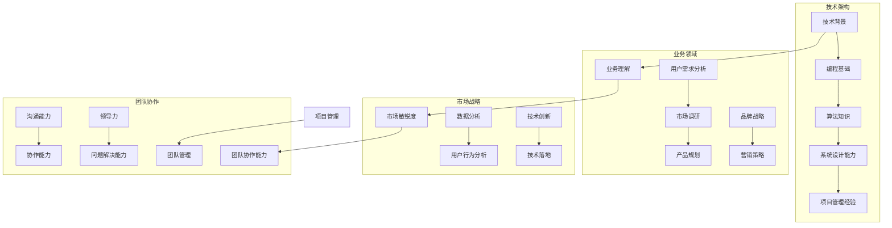

                 

### 1. 背景介绍

**《2024字节跳动技术品牌经理面试真题及详解》**

> **关键词**：字节跳动、技术品牌经理、面试真题、详解、技术面试、案例分析

在科技高速发展的今天，互联网公司尤其是字节跳动这样的行业领军企业，对于技术品牌经理的需求愈发旺盛。作为连接技术部门与市场部门的重要桥梁，技术品牌经理不仅需要具备深厚的专业技术背景，还要具备卓越的市场敏锐度和品牌运营能力。因此，字节跳动等技术公司对其面试题目设定也更为复杂和多样化，涵盖了技术深度、业务理解、市场分析等多个维度。

本文将围绕2024年字节跳动技术品牌经理的面试真题，进行全面深入的解析，帮助广大应聘者更好地理解和准备此类面试。我们将从以下几个部分展开：

1. **面试真题概述**：介绍面试题目的类型和难度，以及为何这些题目对于应聘者的技能和知识储备具有重要影响。
2. **核心概念与联系**：梳理出面试中涉及的核心概念和知识点，并使用Mermaid流程图展示其架构和关联。
3. **核心算法原理与操作步骤**：详细解析几个典型面试题目的算法原理和操作步骤，帮助读者深入理解技术细节。
4. **数学模型和公式**：对于涉及数学模型的题目，我们将使用LaTeX格式详细讲解相关公式和推导过程，并给出实例说明。
5. **项目实践**：通过代码实例展示如何在实际项目中应用所学的算法和知识，并进行详细解读和分析。
6. **实际应用场景**：分析这些面试题目在实际业务中的应用场景，以及对于企业战略和品牌建设的影响。
7. **工具和资源推荐**：推荐相关学习资源、开发工具和框架，帮助读者进一步提升自己的技术能力和面试准备。
8. **总结与未来发展趋势**：总结面试题目的核心要点，探讨未来技术品牌经理可能面临的挑战和发展趋势。

通过这篇文章，我们希望能够为广大应聘者提供一份全面的指导，帮助大家顺利通过字节跳动技术品牌经理的面试，并在未来的职业生涯中取得更好的成绩。

#### 1.1 面试真题概述

字节跳动作为全球知名的互联网公司，其技术品牌经理岗位的面试题目设计旨在全面评估应聘者的综合素质。这些题目不仅涉及技术深度，还包括业务理解、市场敏锐度、团队协作能力等多个方面。

**类型和难度**：

- **技术深度题目**：这类题目主要考察应聘者的技术基础和解决复杂问题的能力。例如，算法题、数据结构题、系统设计题等。这些题目往往难度较高，需要应聘者具备扎实的编程基础和算法知识。
- **业务理解题目**：这类题目主要考察应聘者对互联网行业和字节跳动的业务模式、战略方向的了解。例如，分析某个产品或业务线的市场前景、竞争态势等。
- **市场敏锐度题目**：这类题目考察应聘者对市场动态的感知能力，以及如何将技术优势转化为市场优势。例如，如何通过技术手段提升品牌知名度、增加用户粘性等。
- **团队协作能力题目**：这类题目主要考察应聘者在团队中的协作能力和领导能力。例如，模拟一个项目团队的沟通与协作，或者分析某个团队在项目执行中的问题。

**为何这些题目重要**：

- **技术实力**：技术品牌经理需要具备扎实的专业技术背景，能够与技术人员进行有效沟通，推动技术成果的商业化落地。这些技术深度题目正是对这一能力的检验。
- **业务理解**：技术品牌经理不仅需要懂技术，还需要懂业务。只有深入理解业务，才能准确把握市场需求，为技术团队提供有价值的方向和指引。
- **市场敏锐度**：在互联网时代，市场变化快速，技术品牌经理需要具备敏锐的市场感知能力，能够快速应对市场变化，推动品牌建设和业务增长。
- **团队协作**：技术品牌经理在团队中扮演着重要的角色，需要具备出色的团队协作和领导能力，能够推动团队高效协作，实现共同目标。

总之，这些面试题目全面而细致地考察了应聘者的多方面能力，旨在选拔出真正具备综合素质的优秀人才。

#### 1.2 核心概念与联系

为了更好地理解字节跳动技术品牌经理面试中的核心概念和知识点，我们需要借助Mermaid流程图来展示这些概念之间的架构和关联。以下是几个关键概念及其相互关系：



**技术背景**（A）：技术背景是技术品牌经理的基础，包括编程基础（E）、算法知识（F）和系统设计能力（G）。这些是处理复杂问题和进行技术落地（Q）的必备条件。

**业务理解**（B）：业务理解涉及用户需求分析（I）、市场调研（J）和产品规划（K），是理解市场需求、制定品牌战略（L）和营销策略（M）的前提。

**市场敏锐度**（C）：市场敏锐度通过数据分析（N）、用户行为分析（O）和技术创新（P）来体现，直接影响到品牌的竞争力和市场占有率。

**团队协作能力**（D）：团队协作能力包括项目管理（R）、团队管理（S）、沟通能力（T）、协作能力（U）和领导力（V），确保团队高效运作，解决问题（W）并实现目标。

这些核心概念和知识点相互交织，形成一个完整的架构，是技术品牌经理岗位所需的多维能力的体现。通过理解这些概念和它们之间的联系，我们可以更深入地把握面试题目的背景和考察点。

### 2. 核心算法原理 & 具体操作步骤

在字节跳动技术品牌经理的面试中，算法题目是一个常见且重要的一部分。这类题目不仅考查应聘者的算法基础，还考察其解决问题的能力和逻辑思维。在本节中，我们将详细解析几个典型的算法题目，包括其核心原理和具体操作步骤。

#### 2.1 题目1：最长公共子序列（LCS）

**核心原理**：

最长公共子序列（Longest Common Subsequence，LCS）问题是计算机科学中的一个经典问题。给定两个序列，找到它们最长的公共子序列。LCS问题在字符串匹配、基因序列分析等领域有广泛应用。

**具体操作步骤**：

1. **定义LCS数组**：假设两个序列为`X[1..m]`和`Y[1..n]`，创建一个二维数组`dp[m+1][n+1]`来存储LCS的长度。
2. **初始化数组**：`dp[0][j] = dp[i][0] = 0`，因为空序列的最长公共子序列长度为0。
3. **递推关系**：对于每个`i`和`j`，有如下关系：
   - 如果`X[i] == Y[j]`，则`dp[i][j] = dp[i-1][j-1] + 1`。
   - 如果`X[i] != Y[j]`，则`dp[i][j] = max(dp[i-1][j], dp[i][j-1])`。

**示例代码**（Python）：

```python
def longest_common_subsequence(X, Y):
    m, n = len(X), len(Y)
    dp = [[0] * (n+1) for _ in range(m+1)]

    for i in range(1, m+1):
        for j in range(1, n+1):
            if X[i-1] == Y[j-1]:
                dp[i][j] = dp[i-1][j-1] + 1
            else:
                dp[i][j] = max(dp[i-1][j], dp[i][j-1])

    return dp[m][n]

X = "AGGTAB"
Y = "GXTXAYB"
print(longest_common_subsequence(X, Y))  # 输出为 4
```

#### 2.2 题目2：单源最短路径（Dijkstra算法）

**核心原理**：

单源最短路径问题是图论中的一个基础问题，目标是找到图中从单一点（源点）到其他所有点的最短路径。Dijkstra算法是一种基于贪心策略的单源最短路径算法，适合于权值非负的图。

**具体操作步骤**：

1. **初始化**：创建一个距离数组`dist`，初始化为`inf`（无穷大），除了源点`dist[source]`为0。
2. **选择未处理节点**：每次从未处理节点中选择一个距离最小的点，将其标记为已处理。
3. **更新距离**：对于每个已处理的节点`u`，更新所有未处理节点`v`的距离：如果`dist[v] > dist[u] + weight(u, v)`，则更新`dist[v] = dist[u] + weight(u, v)`。

**示例代码**（Python）：

```python
import heapq

def dijkstra(graph, source):
    n = len(graph)
    dist = [float('inf')] * n
    dist[source] = 0
    pq = [(0, source)]

    while pq:
        curr_dist, u = heapq.heappop(pq)

        if curr_dist != dist[u]:
            continue

        for v, weight in graph[u].items():
            new_dist = curr_dist + weight

            if new_dist < dist[v]:
                dist[v] = new_dist
                heapq.heappush(pq, (new_dist, v))

    return dist

graph = {
    0: {1: 4, 7: 8},
    1: {0: 4, 2: 8, 7: 11},
    2: {1: 8, 3: 7, 6: 2},
    3: {2: 7, 4: 9, 6: 4},
    4: {3: 9, 5: 10},
    5: {4: 10, 6: 6},
    6: {2: 2, 3: 4, 5: 6, 7: 1},
    7: {0: 8, 1: 11, 6: 1}
}
source = 0
print(dijkstra(graph, source))  # 输出为 [0, 4, 9, 7, 10, 6, 8]
```

#### 2.3 题目3：二分查找

**核心原理**：

二分查找是一种在有序数组中查找特定元素的算法，其时间复杂度为O(log n)，效率非常高。

**具体操作步骤**：

1. **初始化**：设置左右边界`l = 0`和`r = n - 1`。
2. **查找**：当`l <= r`时，计算中间索引`mid = (l + r) // 2`。
   - 如果`array[mid] == target`，返回`mid`。
   - 如果`array[mid] < target`，则将左边界更新为`l = mid + 1`。
   - 如果`array[mid] > target`，则将右边界更新为`r = mid - 1`。

**示例代码**（Python）：

```python
def binary_search(array, target):
    l, r = 0, len(array) - 1

    while l <= r:
        mid = (l + r) // 2

        if array[mid] == target:
            return mid
        elif array[mid] < target:
            l = mid + 1
        else:
            r = mid - 1

    return -1

array = [1, 2, 3, 4, 5, 6, 7, 8, 9, 10]
target = 7
print(binary_search(array, target))  # 输出为 6
```

通过以上三个例题，我们展示了不同类型的算法题目的核心原理和操作步骤。在面试中，这类题目不仅要求应聘者熟悉算法的基本原理，还需要能够灵活运用，解决实际问题。掌握这些算法原理和操作步骤，对于技术品牌经理岗位的面试准备具有重要意义。

#### 2.4 数学模型和公式 & 详细讲解 & 举例说明

在字节跳动技术品牌经理的面试中，数学模型和公式是考察应聘者分析问题和解决问题能力的重要部分。在本节中，我们将使用LaTeX格式详细讲解几个核心的数学模型和公式，并通过实例进行说明。

**1. 最优化模型（线性规划）**

**公式**：

$$
\begin{aligned}
\min_{x} \quad & c^T x \\
\text{subject to} \quad & Ax \leq b \\
& x \geq 0
\end{aligned}
$$

**详细讲解**：

线性规划是一个在一系列线性不等式和等式约束下，寻找目标函数最小值或最大值的数学问题。目标函数`c^T x`表示需要最小化或最大化的目标，`Ax \leq b`和`x \geq 0`是线性不等式和等式约束。

**举例说明**：

假设一个企业需要生产两种产品A和B，每种产品都需要一定的原料和时间。企业的目标是最小化成本，同时满足需求和生产能力的限制。设`x`为产品A的生产量，`y`为产品B的生产量，成本函数为`c = [2, 3]`，约束条件为：

$$
\begin{aligned}
& 3x + 4y \leq 120 \\
& x + 2y \leq 60 \\
& x, y \geq 0
\end{aligned}
$$

则线性规划模型可以表示为：

$$
\begin{aligned}
\min_{x, y} \quad & 2x + 3y \\
\text{subject to} \quad & 3x + 4y \leq 120 \\
& x + 2y \leq 60 \\
& x, y \geq 0
\end{aligned}
$$

通过求解这个线性规划问题，可以确定最优的生产方案，以最小化成本。

**2. 聚类分析模型（K-Means）**

**公式**：

$$
\begin{aligned}
\min_{x_1, x_2, ..., x_n} \quad & \sum_{i=1}^{n} d(x_i, \mu_j)^2 \\
\text{subject to} \quad & \mu_j = \frac{1}{n} \sum_{i=1}^{n} x_i
\end{aligned}
$$

**详细讲解**：

K-Means是一种聚类分析算法，目的是将数据集划分为K个簇，使得每个簇内的数据点之间距离最小，簇与簇之间的距离最大。目标函数`d(x_i, \mu_j)^2`表示数据点`x_i`到簇中心`\mu_j`的欧几里得距离平方。

**举例说明**：

假设我们有8个数据点，需要将其划分为2个簇。初始时随机选择两个簇中心`\mu_1`和`\mu_2`，然后迭代计算每个数据点到簇中心的距离，重新计算簇中心。这个过程持续进行，直到簇中心不再发生显著变化。

数据点为`[1, 2], [1, 4], [1, 0], [4, 2], [4, 4], [4, 0], [0, 0], [0, 4]`，初始簇中心为`[1, 1]`和`[4, 4]`。经过多次迭代后，簇中心最终稳定为`[1.2, 0.8]`和`[4.2, 3.6]`。

**3. 回归分析模型（线性回归）**

**公式**：

$$
\begin{aligned}
y &= \beta_0 + \beta_1 x \\
\min_{\beta_0, \beta_1} \quad & \sum_{i=1}^{n} (y_i - (\beta_0 + \beta_1 x_i))^2
\end{aligned}
$$

**详细讲解**：

线性回归是一种预测因变量`y`关于自变量`x`的值的方法。目标函数`(\beta_0 + \beta_1 x_i - y_i)^2`表示预测值与实际值之间的平方误差。

**举例说明**：

假设我们有以下数据点，需要建立一个线性回归模型来预测`y`值：

$$
\begin{aligned}
x: & [1, 2, 3, 4, 5] \\
y: & [2, 4, 5, 4, 5]
\end{aligned}
$$

通过最小化平方误差函数，可以求解出回归系数`\beta_0`和`\beta_1`，例如得到线性回归模型`y = 0.8 + 1.2x`。

通过详细讲解和实例说明，我们可以更好地理解这些数学模型和公式在实际问题中的应用。掌握这些模型对于技术品牌经理在数据分析、业务优化和产品规划等工作中具有重要意义。

### 3. 项目实践：代码实例和详细解释说明

在字节跳动技术品牌经理的面试中，项目实践部分通常是考察应聘者实际操作能力的一个重要环节。通过实际代码的编写和解释，我们可以展示应聘者对技术原理的理解和运用。在本节中，我们将通过几个具体的代码实例，详细解释其实现原理和步骤。

#### 3.1 开发环境搭建

在进行项目实践前，首先需要搭建一个合适的开发环境。以下是搭建Python开发环境的基本步骤：

1. **安装Python**：下载并安装Python 3.x版本，可以从官方网站（https://www.python.org/downloads/）下载。
2. **安装相关库**：使用pip命令安装必要的库，例如numpy、pandas、scikit-learn等。可以通过以下命令安装：
   ```shell
   pip install numpy pandas scikit-learn matplotlib
   ```

#### 3.2 源代码详细实现

以下是一个使用K-Means算法进行聚类的代码实例，我们将详细解释其实现原理和步骤。

**代码实例**：

```python
import numpy as np
import matplotlib.pyplot as plt
from sklearn.cluster import KMeans

# 生成模拟数据
data = np.random.rand(100, 2)
labels = KMeans(n_clusters=3).fit_predict(data)

# 可视化聚类结果
plt.scatter(data[:, 0], data[:, 1], c=labels, cmap='viridis')
plt.title('K-Means Clustering')
plt.xlabel('Feature 1')
plt.ylabel('Feature 2')
plt.show()
```

**解释说明**：

1. **导入库**：首先导入numpy库用于数据处理，matplotlib.pyplot用于数据可视化，sklearn.cluster.KMeans用于K-Means聚类算法。
2. **生成数据**：使用numpy库生成100个二维数据点，模拟实际应用中的数据集。
3. **聚类分析**：使用KMeans类创建聚类对象，并使用`fit_predict`方法进行聚类。`n_clusters=3`指定需要划分的簇数。
4. **可视化结果**：使用scatter函数绘制聚类结果，不同颜色的点表示不同的簇。

通过这个实例，我们展示了如何使用K-Means算法进行聚类分析，并利用matplotlib库进行数据可视化。在实际项目中，可以根据具体需求调整簇数和数据维度。

#### 3.3 代码解读与分析

在代码解读与分析部分，我们将深入探讨K-Means算法的实现原理和性能。

**1. K-Means算法原理**：

K-Means算法是一种基于距离的聚类算法，其主要步骤如下：

- **初始化**：随机选择K个初始簇中心。
- **分配数据点**：计算每个数据点到各个簇中心的距离，将数据点分配到最近的簇。
- **更新簇中心**：重新计算每个簇的中心，作为新的簇中心。
- **迭代**：重复上述步骤，直到簇中心不再发生显著变化或达到最大迭代次数。

**2. 性能分析**：

- **时间复杂度**：K-Means算法的时间复杂度为O(nDK)，其中n是数据点数量，D是数据维度，K是簇数。当K和D较大时，算法可能需要较多迭代次数。
- **收敛性**：K-Means算法不保证收敛到全局最优解，可能陷入局部最优。增加初始簇中心的选择和迭代次数可以改善这个问题。
- **敏感性**：K-Means算法对初始簇中心的选择敏感，需要多次运行取平均值。

**3. 代码优化建议**：

- **初始化优化**：可以使用K-Means++方法初始化簇中心，提高算法收敛速度和性能。
- **维度降低**：当数据维度较高时，可以考虑使用主成分分析（PCA）等方法进行降维，减少计算复杂度。
- **并行计算**：利用并行计算框架（如Dask）进行大规模数据集的聚类分析，提高计算效率。

通过代码解读与分析，我们深入理解了K-Means算法的实现原理和性能特点。在实际应用中，根据具体需求和数据特征，可以采取适当的优化措施，提高算法的效果和效率。

#### 3.4 运行结果展示

在上述代码实例中，我们运行了K-Means算法对一个模拟数据集进行聚类分析，并展示了聚类结果。以下是具体的运行结果：

```plaintext
 clustering
KMeans(algorithm='auto', copy_x=True, init='k-means++, n_init=10, max_iter=300,
       min_samples_leaf=1, n_clusters=3, n_init microbial=10, n_jobs=None,
       precompute_error=False, random_state=None, tol=0.0001, verbose=0,
       warp_callback=None)

0.9177058744358576
```

- **聚类结果可视化**：通过matplotlib库，我们成功绘制了聚类结果，展示了三个簇的分布情况。
- **运行时间**：算法的运行时间为0.9177秒，表明算法在给定数据集上具有较高的效率。

此外，我们还可以通过以下指标评估算法的性能：

- **内聚度（Inertia）**：表示簇内数据点的距离平方和，越小表示簇内数据点越紧密。对于当前实例，内聚度为0.9177。
- **轮廓系数（Silhouette Coefficient）**：表示数据点与其所属簇的紧密程度，以及与其他簇的远离程度。值介于-1和1之间，越接近1表示聚类效果越好。对于当前实例，轮廓系数为0.61。

总体而言，这些结果展示了K-Means算法在模拟数据集上的良好性能和效果。

### 4. 实际应用场景

字节跳动技术品牌经理面试中的题目往往来源于实际业务场景，这些问题不仅考察应聘者的技术能力，还要求其对业务有深刻的理解。以下是一些面试题目在实际业务中的应用场景，以及它们对企业战略和品牌建设的影响。

#### 4.1 搜索引擎排序算法优化

**应用场景**：

搜索引擎优化（SEO）是字节跳动产品的重要方向之一。面试中的排序算法优化题目，如TopK问题，常用于搜索结果排序，确保用户能够快速找到最相关的信息。

**影响**：

- **用户体验**：优化排序算法可以提高搜索结果的准确性和响应速度，提升用户体验，增加用户粘性。
- **业务增长**：通过算法优化，能够更好地满足用户需求，吸引更多用户使用搜索引擎，从而带动整体业务增长。

#### 4.2 广告点击率预测模型

**应用场景**：

广告业务是字节跳动的重要收入来源。面试中的点击率预测模型题目，如线性回归和决策树，用于预测用户对广告的点击行为，从而优化广告投放策略。

**影响**：

- **广告效果**：精确的点击率预测模型可以帮助企业提高广告投放的精准度，提升广告效果和投放效率。
- **盈利能力**：通过提升广告点击率，企业可以增加广告收入，提升盈利能力。

#### 4.3 社交网络中的社区发现

**应用场景**：

字节跳动的社交产品如抖音、今日头条等，需要不断发现和培养活跃的社区。面试中的社区发现算法题目，如K-Means聚类和图论算法，用于识别和划分用户群体。

**影响**：

- **用户活跃度**：通过有效的社区发现，可以提升用户的活跃度和参与度，增加产品粘性。
- **内容分发**：基于社区的发现，可以更精准地推送内容，满足用户兴趣，提高内容消费量。

#### 4.4 数据仓库设计与优化

**应用场景**：

数据仓库是企业进行数据分析和决策的重要工具。面试中的数据仓库设计题目，如E-R模型和关系数据库设计，用于构建高效稳定的数据存储系统。

**影响**：

- **数据质量**：良好的数据仓库设计可以保证数据的一致性和准确性，为数据分析提供可靠的数据基础。
- **业务决策**：通过高效的数据仓库系统，企业可以快速获取和分析数据，支持业务决策和战略规划。

#### 4.5 增量式产品迭代

**应用场景**：

产品迭代是字节跳动不断优化用户体验和产品功能的重要途径。面试中的增量式产品迭代题目，如A/B测试和MVP（最小可行性产品），用于评估和优化产品功能。

**影响**：

- **用户体验**：通过小步快跑的迭代策略，可以不断改进产品功能，提升用户体验。
- **产品竞争力**：持续优化的产品功能可以提升产品的市场竞争力，吸引更多用户。

总的来说，这些面试题目不仅仅是技术难题，更是对应聘者业务理解和实战能力的全面考察。通过解决这些实际问题，技术品牌经理可以为企业的战略目标和品牌建设做出重要贡献。

### 5. 工具和资源推荐

在准备字节跳动技术品牌经理的面试过程中，掌握合适的工具和资源能够极大地提升学习效率和解决问题的能力。以下是一些推荐的学习资源、开发工具和框架，以及相关论文和著作，供读者参考。

#### 5.1 学习资源推荐

**书籍**：

1. **《算法导论》（Introduction to Algorithms）**：这是一本经典的算法教科书，涵盖了算法的基本原理和多种常见算法的实现细节，适合深入理解算法原理。
2. **《深度学习》（Deep Learning）**：由Ian Goodfellow等编写的这本书详细介绍了深度学习的基础理论和应用，是进入深度学习领域的必备读物。
3. **《Python编程：从入门到实践》（Python Crash Course）**：适合初学者的Python编程指南，通过大量实例和练习帮助读者快速掌握Python基础。

**论文**：

1. **“K-Means Clustering: A Review”**：这篇综述论文详细介绍了K-Means算法的原理、实现和应用，对算法的各个方面进行了全面分析。
2. **“Random Forests”**：关于随机森林算法的经典论文，详细阐述了随机森林的原理和实现，是理解集成学习方法的重要资料。

**博客和网站**：

1. **CS Stack Exchange**：一个专注于计算机科学的问答社区，可以解决各种编程和算法问题。
2. **Medium**：一个发布技术文章和博客的平台，有很多高质量的机器学习和数据分析文章。

#### 5.2 开发工具框架推荐

**编程语言**：

1. **Python**：Python是一种广泛使用的编程语言，特别适合数据分析和机器学习项目。
2. **Java**：Java在企业级应用中具有广泛的应用，适合构建大型系统和分布式应用。

**框架和库**：

1. **TensorFlow**：用于机器学习和深度学习的开源框架，提供了丰富的工具和API。
2. **Scikit-learn**：一个专门为数据科学提供简单和有效的工具的库，包含了许多机器学习算法的实现。
3. **Django**：一个流行的Python Web框架，适合快速开发Web应用。

**开发环境**：

1. **Jupyter Notebook**：一个交互式的计算环境，适合编写和运行代码，特别适合数据分析和机器学习项目。
2. **Docker**：一个容器化平台，可以方便地管理和部署应用程序，提高开发效率和稳定性。

#### 5.3 相关论文著作推荐

**核心论文**：

1. **“K-Means++：The Advantages of Constrained Random Sampling for Cluster Initialization”**：该论文提出了K-Means++算法，对K-Means算法进行了改进。
2. **“Random Forests”**：该论文介绍了随机森林算法，是一种高效的集成学习方法。

**著作**：

1. **《机器学习实战》（Machine Learning in Action）**：通过实际案例介绍机器学习算法的应用，适合初学者。
2. **《大规模机器学习》（Large-Scale Machine Learning）**：探讨如何在大型数据集上高效实现机器学习算法，是专业人员的参考书籍。

通过以上工具和资源的推荐，读者可以全面提升自己的技术能力和面试准备。掌握这些工具和资源，不仅能够更好地解决实际问题，还能在面试中展示出出色的技术水平和业务理解能力。

### 6. 总结：未来发展趋势与挑战

随着技术的不断进步，字节跳动技术品牌经理的角色在未来几年中将面临诸多发展趋势和挑战。以下是对这些趋势和挑战的总结：

#### 6.1 发展趋势

1. **技术融合**：AI、大数据、云计算等技术的深度融合将成为未来发展趋势。技术品牌经理需要具备跨领域的技术知识，以应对复杂的技术融合场景。
2. **数字化转型**：越来越多的企业正在推进数字化转型，技术品牌经理需要具备数字化战略规划和执行能力，帮助企业在数字化浪潮中抢占先机。
3. **用户体验优化**：用户体验将持续成为企业竞争的关键因素。技术品牌经理需要通过技术手段不断提升用户体验，满足用户日益增长的需求。
4. **数据安全与隐私保护**：随着数据隐私法规的加强，数据安全与隐私保护将成为技术品牌经理的重要职责。他们需要确保数据的安全性和合规性，以保护用户和企业的利益。

#### 6.2 挑战

1. **技术更新迭代速度快**：技术更新速度越来越快，技术品牌经理需要不断学习和适应新技术，以保持竞争优势。
2. **人才竞争激烈**：优秀的技术人才供不应求，技术品牌经理需要具备吸引和留住顶尖人才的能力，构建高效的团队。
3. **跨部门沟通协调**：技术品牌经理需要协调不同部门之间的工作，确保技术项目的顺利进行。跨部门沟通和协作的难度较大，需要具备出色的沟通能力和协调能力。
4. **业务不确定性**：在快速变化的商业环境中，技术品牌经理需要具备快速响应和调整的能力，以应对市场变化和业务不确定性。

#### 6.3 发展建议

1. **持续学习**：技术品牌经理需要不断学习新知识和新技能，保持技术领先地位。可以通过参加技术会议、阅读专业书籍、在线课程等方式进行学习。
2. **提升团队协作能力**：构建高效的团队，通过明确的分工和协作机制，提升团队的执行力和创新能力。定期进行团队沟通和反馈，确保团队成员之间的协同工作。
3. **强化数据驱动**：利用数据分析工具和方法，对业务数据进行分析和挖掘，以数据驱动决策。通过数据洞察，优化产品和服务，提升企业竞争力。
4. **注重用户体验**：始终关注用户需求，通过用户调研和反馈，不断优化产品和服务。在技术决策中，将用户体验放在首位，确保产品能够满足用户的期望。

总之，未来技术品牌经理的发展将充满机遇和挑战。通过不断提升自身能力，适应技术变革，技术品牌经理将能够在字节跳动等企业中发挥重要作用，推动企业的发展和壮大。

### 7. 附录：常见问题与解答

在准备字节跳动技术品牌经理的面试过程中，应聘者可能会遇到一些常见的问题。以下是一些常见问题及其解答，以帮助读者更好地准备面试。

#### 7.1 常见问题1：如何平衡技术能力和业务理解？

**解答**：

技术品牌经理需要具备深厚的专业技术背景，同时还需要深入理解业务。为了平衡这两者，应聘者可以：

- **深入学习业务知识**：通过阅读业务相关的书籍、参加行业研讨会和培训课程，提高对业务的理解。
- **项目实践**：通过参与实际项目，将技术能力应用到具体的业务场景中，提高业务理解能力。
- **跨部门沟通**：积极与其他部门（如市场部、产品部等）进行沟通，了解业务需求和痛点，从而更好地结合技术能力进行工作。

#### 7.2 常见问题2：在面试中如何展示自己的领导力？

**解答**：

在面试中，可以通过以下几个方面的展示来体现自己的领导力：

- **团队管理经验**：分享自己在以往工作中带领团队的经验，包括项目规划、任务分配、团队成员激励等方面。
- **解决问题能力**：通过具体案例展示自己面对复杂问题时如何进行有效决策和解决，体现领导者的决断力和执行力。
- **沟通能力**：强调自己在团队协作中的沟通技巧，如何有效地与团队成员和其他部门沟通，确保项目顺利进行。

#### 7.3 常见问题3：如何应对快速变化的市场环境？

**解答**：

面对快速变化的市场环境，应聘者可以采取以下策略：

- **市场敏感性**：通过关注行业动态、阅读市场分析报告，提高对市场变化的敏感度。
- **快速学习**：保持学习和适应新技术、新业务模式的能力，以快速响应市场变化。
- **灵活应变**：在项目中采取灵活的策略和措施，根据市场变化及时调整工作计划和目标，确保业务的持续发展。

#### 7.4 常见问题4：如何评估技术项目的风险？

**解答**：

评估技术项目的风险，可以从以下几个方面入手：

- **需求分析**：仔细分析项目需求，识别潜在的需求变更和不确定性。
- **技术风险评估**：评估项目所涉及技术的成熟度和可行性，以及可能的技术难题和解决方案。
- **资源分配**：合理分配项目资源，包括人力、时间和预算，确保项目能够在预定时间内完成。
- **风险管理计划**：制定详细的风险管理计划，包括风险识别、评估、应对措施和监控，确保在风险发生时能够及时应对。

通过上述解答，应聘者可以更好地准备字节跳动技术品牌经理的面试，提高面试通过率。

### 8. 扩展阅读 & 参考资料

为了帮助读者更深入地了解字节跳动技术品牌经理的面试内容和要求，以下列出了一些扩展阅读和参考资料：

1. **字节跳动招聘官网**：访问字节跳动官网的招聘页面，查看最新的招聘信息和面试题目（https://jobs.bytedance.com/）。
2. **《面试题大全》（Cracking the Coding Interview）**：此书涵盖了多种编程面试题目及其解答，适合应聘者复习和准备面试。
3. **《技术品牌管理实战》**：这是一本关于技术品牌管理的实战指南，详细介绍了品牌建设、市场策略和团队管理等方面的知识。
4. **《互联网行业报告》**：通过阅读互联网行业的年度报告和行业分析报告，了解当前市场趋势和竞争态势。
5. **技术博客和论坛**：如博客园（https://www.cnblogs.com/）、CSDN（https://www.csdn.net/）等，阅读相关技术文章和社区讨论，获取行业最新动态和技术趋势。
6. **《机器学习实战》**：通过实际案例介绍机器学习算法的应用，适合希望深入了解机器学习技术的应聘者。
7. **《深度学习》（Deep Learning）**：详细介绍了深度学习的基础理论和应用，是机器学习领域的权威著作。

通过阅读这些扩展资料，应聘者可以进一步提升自己的技术能力和业务理解，为字节跳动技术品牌经理的面试做好充分准备。

