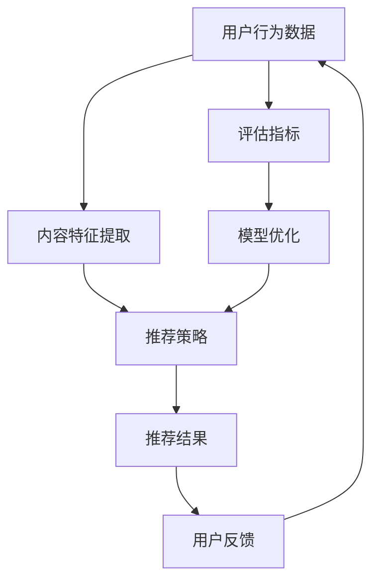

                 

### 背景介绍

#### 1.1 推荐算法在字节跳动的应用

在当今的信息时代，用户生成的数据量以惊人的速度增长，这使得推荐系统成为提高用户满意度和促进商业成功的核心工具。字节跳动作为中国领先的移动互联网公司，其旗下拥有今日头条、抖音、TikTok等多款广受欢迎的应用。在这些应用中，推荐算法扮演着至关重要的角色，它能够根据用户的行为和偏好，为用户个性化地推荐内容，从而提高用户的参与度和留存率。

字节跳动的推荐算法系统是一个高度复杂且动态演化的系统。该系统不仅需要处理海量的用户数据，还要实时响应用户的反馈，不断调整推荐策略，以保持内容与用户兴趣的高度匹配。具体来说，字节跳动的推荐算法主要应用于以下几个方面：

- **内容个性化推荐**：为用户提供个性化的新闻、短视频、文章等内容，确保每个用户看到的内容都与其兴趣高度相关。
- **广告推荐**：通过推荐系统将相关广告内容推送给潜在受众，提高广告的投放效果和用户点击率。
- **社交媒体推荐**：在用户互动、评论和分享的基础上，推荐用户可能感兴趣的其他用户、话题和互动内容。

#### 1.2 推荐算法的重要性

在数字营销和广告领域，推荐算法的优劣直接影响着企业的收益和用户满意度。一个优秀的推荐算法不仅能提升用户对产品的满意度，还能提高用户的活跃度和留存率。以下是推荐算法在数字营销和广告领域中的几个关键作用：

- **提升用户参与度**：通过精准推荐，用户能够更迅速地找到他们感兴趣的内容，从而提高整体参与度。
- **提高广告点击率和转化率**：当广告内容与用户兴趣相关时，用户更可能点击广告，进而实现更高的转化率。
- **降低营销成本**：精准的推荐可以减少无效广告的展示，从而节省广告预算。
- **增强品牌影响力**：通过个性化的内容推荐，用户对品牌的认知和好感度会提高，有利于品牌的长期发展。

#### 1.3 字节跳动推荐算法面试真题背景

在字节跳动这样的科技公司，推荐算法工程师的职位通常需要应聘者具备扎实的算法基础、丰富的实际应用经验以及对最新技术的敏锐洞察力。因此，面试题目往往围绕推荐系统的核心概念、算法原理、工程实践和性能优化等方面进行。本文将基于2024年的面试真题，深入解析推荐算法工程师面试中的关键问题，帮助读者更好地理解面试的要求和难点。

在这篇文章中，我们将按照以下结构进行详细解析：

1. **核心概念与联系**：首先，介绍推荐算法中的核心概念及其相互关系，并通过Mermaid流程图展示其架构。
2. **核心算法原理 & 具体操作步骤**：详细解释推荐算法的基本原理，包括协同过滤、矩阵分解、基于内容的推荐等，并给出每一步的具体操作步骤。
3. **数学模型和公式**：讨论推荐算法中使用的数学模型和公式，并通过具体的示例进行说明。
4. **项目实践**：通过代码实例展示推荐算法的实现过程，包括环境搭建、源代码实现、代码解读与分析，以及运行结果展示。
5. **实际应用场景**：探讨推荐算法在不同场景中的应用，如电子商务、社交媒体、内容推荐等。
6. **工具和资源推荐**：推荐相关的学习资源、开发工具框架和相关论文著作。
7. **总结：未来发展趋势与挑战**：总结当前推荐算法的发展趋势和未来可能面临的挑战。

### 1.4 推荐算法的核心概念与联系

推荐算法的核心概念包括用户行为数据、内容特征、推荐策略和评估指标。以下是一个简化的Mermaid流程图，用于展示这些概念之间的关系：



- **用户行为数据**：包括用户的浏览记录、点击行为、购买历史等，是构建推荐模型的重要输入。
- **内容特征提取**：将用户行为数据转换为内容特征，如文本特征、图像特征、视频特征等。
- **推荐策略**：根据用户行为和内容特征，采用协同过滤、基于内容的推荐或深度学习等方法生成推荐结果。
- **推荐结果**：推荐系统输出的个性化内容列表，是用户直接体验的部分。
- **用户反馈**：用户对推荐内容的反应，如点击、评分、评论等，用于评估和优化推荐模型。
- **评估指标**：如准确率、召回率、覆盖率、NDCG等，用于衡量推荐系统的性能。
- **模型优化**：根据评估指标，调整推荐策略和模型参数，以提升推荐效果。

通过这个流程图，我们可以看到推荐系统的各个部分是如何相互关联和影响的。接下来，我们将深入探讨每个核心概念的原理和具体操作步骤。

---

### 核心概念与联系

#### 2.1 用户行为数据

用户行为数据是推荐系统的基石，它包括用户的浏览记录、点击行为、购买历史、搜索历史、分享行为等。这些数据提供了用户兴趣和偏好的直接线索，为推荐系统的构建提供了丰富的信息来源。

在推荐算法中，用户行为数据的处理通常包括以下几个步骤：

1. **数据收集**：从各种渠道收集用户行为数据，如Web服务器日志、应用日志、数据库记录等。
2. **数据预处理**：清洗数据，去除噪声和异常值，对缺失数据进行填充或删除，对数据进行归一化或标准化处理。
3. **特征工程**：从原始行为数据中提取特征，如用户历史浏览内容的类型、出现频率、用户活跃度等。这些特征将用于构建推荐模型。

用户行为数据的质量直接影响推荐系统的性能，因此，对数据的收集、预处理和特征工程需要高度关注。

#### 2.2 内容特征提取

内容特征提取是将用户行为数据转换为可用于推荐模型处理的形式的过程。不同的内容类型（如文本、图像、视频）需要不同的特征提取方法。

- **文本特征提取**：常用的文本特征提取方法包括词频（TF）、逆文档频率（IDF）、词袋模型（Bag of Words, BoW）和词嵌入（Word Embedding）等。词嵌入方法，如Word2Vec、GloVe等，可以将文本转化为高维向量，便于模型处理。
- **图像特征提取**：常用的图像特征提取方法包括哈希特征、SIFT、SURF、HOG（Histogram of Oriented Gradients）和CNN（卷积神经网络）提取的深层特征等。深度学习模型，如ResNet、VGG等，可以自动学习图像的高层次特征。
- **视频特征提取**：视频特征提取通常涉及视频帧的图像特征提取和时序特征提取。图像特征提取与图像特征提取类似，时序特征提取则涉及视频帧之间的运动信息、动作识别等。

通过内容特征提取，原始数据被转化为适用于推荐算法的向量表示，从而提高了算法的效率和效果。

#### 2.3 推荐策略

推荐策略是推荐系统的核心，它决定了如何根据用户行为和内容特征生成个性化的推荐结果。常见的推荐策略包括：

- **基于内容的推荐（Content-Based Recommendation）**：基于用户过去的行为和偏好，找到与之相似的内容进行推荐。这种方法通常使用关键词匹配、协同过滤等特征提取方法。
- **协同过滤（Collaborative Filtering）**：通过分析用户之间的行为相似性来进行推荐。协同过滤分为基于用户（User-Based）和基于模型（Model-Based）两种。基于用户的协同过滤通过找到与当前用户兴趣相似的用户，推荐这些用户喜欢的项目；基于模型的协同过滤则使用机器学习算法（如矩阵分解、KNN等）预测用户对未知项目的兴趣。
- **基于模型的推荐（Model-Based Recommendation）**：使用机器学习算法（如决策树、SVM、神经网络等）构建用户和项目之间的预测模型，然后根据模型预测进行推荐。
- **混合推荐（Hybrid Recommendation）**：结合多种推荐策略，以综合利用各自的优点。例如，将基于内容和协同过滤相结合，以提高推荐效果。

#### 2.4 推荐结果

推荐结果是推荐系统直接呈现给用户的部分，它是基于用户行为和内容特征计算得出的个性化内容列表。推荐结果的评估通常依赖于用户反馈（如点击、评分、购买等），以衡量推荐系统的效果。

推荐结果的处理通常包括以下步骤：

1. **排序**：将推荐结果按用户兴趣排序，以提高用户对推荐内容的关注度。
2. **过滤**：根据业务需求，对推荐结果进行过滤，去除重复项、不相关项或低质量项。
3. **多样性增强**：为了避免推荐结果过于集中，可以采用多样性增强策略，如随机化、随机切分、内容交叉等。

#### 2.5 用户反馈

用户反馈是推荐系统的重要输入，它反映了用户对推荐内容的满意度和兴趣度。用户反馈的形式包括点击、评分、评论、分享等，这些反馈被用于评估和优化推荐模型。

用户反馈的处理通常包括以下步骤：

1. **数据收集**：从各种渠道（如Web服务器日志、应用日志等）收集用户反馈数据。
2. **数据预处理**：清洗数据，去除噪声和异常值，对缺失数据进行填充或删除。
3. **特征提取**：从原始用户反馈数据中提取特征，如点击率、评分分布、评论内容等。
4. **模型更新**：根据用户反馈，调整推荐模型参数，以提高推荐效果。

#### 2.6 评估指标

评估指标是衡量推荐系统性能的重要工具，常用的评估指标包括准确率（Precision）、召回率（Recall）、覆盖率（Coverage）、平均绝对误差（MAE）和信息增益（Information Gain）等。

- **准确率**：预测为正类的样本中，实际为正类的比例。
- **召回率**：实际为正类的样本中，被预测为正类的比例。
- **覆盖率**：推荐列表中包含的不同项目的比例。
- **平均绝对误差**：预测值与真实值之间的平均绝对误差。
- **信息增益**：预测值对真实值的信息贡献度。

通过评估指标，可以客观地衡量推荐系统的性能，并指导模型优化。

#### 2.7 模型优化

模型优化是提高推荐系统性能的关键步骤，通常包括以下方法：

- **特征优化**：通过特征选择、特征工程等方法，提取更有助于预测的特征。
- **算法优化**：选择更合适的算法，或对现有算法进行改进，如使用深度学习模型替代传统机器学习模型。
- **参数调优**：调整模型参数，以实现最佳性能。

模型优化需要综合考虑数据质量、计算资源、用户需求等因素，以达到最优的推荐效果。

通过上述核心概念及其相互关系的讨论，我们可以更深入地理解推荐系统的构建过程和关键要素。接下来，我们将详细探讨推荐算法的具体原理和操作步骤。

---

### 核心算法原理 & 具体操作步骤

推荐算法的核心目标是根据用户的行为和偏好，为用户推荐其可能感兴趣的内容。以下是几种常见的推荐算法原理及其具体操作步骤。

#### 3.1 协同过滤（Collaborative Filtering）

协同过滤是一种基于用户相似度或项目相似度的推荐方法。其基本思想是找到与目标用户行为相似的邻居用户或与之相关的项目，然后根据这些邻居用户或项目的行为进行推荐。

##### 基于用户的协同过滤（User-Based CF）

基于用户的协同过滤方法的主要步骤如下：

1. **计算用户相似度**：使用用户之间的行为相似度度量，如余弦相似度、皮尔逊相关系数等，计算目标用户与所有其他用户的相似度。
2. **选择邻居用户**：根据相似度阈值，选择与目标用户最相似的K个邻居用户。
3. **生成推荐列表**：从邻居用户喜欢的但目标用户尚未看过的项目中选择Top N个项目，形成推荐列表。

##### 基于模型的协同过滤（Model-Based CF）

基于模型的协同过滤方法使用机器学习算法，如矩阵分解（Matrix Factorization）、K最近邻（K-Nearest Neighbors, KNN）等，建立用户和项目之间的预测模型。

基于模型的协同过滤的主要步骤如下：

1. **数据预处理**：对用户-项目评分矩阵进行归一化处理，以消除数据规模差异。
2. **模型训练**：使用矩阵分解或KNN算法训练用户-项目评分矩阵，得到用户和项目的低维向量表示。
3. **预测**：对于新用户或新项目，使用训练好的模型预测用户对未知项目的评分。
4. **生成推荐列表**：根据预测评分，生成个性化推荐列表。

#### 3.2 基于内容的推荐（Content-Based Filtering）

基于内容的推荐方法通过分析用户过去的行为和偏好，找到与之相似的内容进行推荐。其主要步骤如下：

1. **内容特征提取**：从用户历史行为中提取内容特征，如文本特征（TF-IDF、词嵌入等）、图像特征（CNN提取的特征等）。
2. **计算内容相似度**：使用内容相似度度量，如余弦相似度、Jaccard相似度等，计算目标用户历史行为与所有内容的相似度。
3. **生成推荐列表**：从相似度较高的内容中选择Top N个项目，形成推荐列表。

#### 3.3 深度学习推荐（Deep Learning for Recommendation）

深度学习推荐方法使用深度神经网络，如卷积神经网络（CNN）、循环神经网络（RNN）、图神经网络（Graph Neural Networks, GNN）等，直接学习用户和项目之间的复杂关系。

深度学习推荐的主要步骤如下：

1. **数据预处理**：对用户-项目交互数据进行编码，如用户ID、项目ID、时间戳等。
2. **模型构建**：构建深度神经网络模型，如CNN、RNN、GNN等，将用户和项目特征输入到模型中进行学习。
3. **模型训练**：使用用户-项目评分数据训练模型，调整模型参数。
4. **预测**：对于新用户或新项目，使用训练好的模型预测用户对未知项目的兴趣。
5. **生成推荐列表**：根据预测兴趣，生成个性化推荐列表。

#### 3.4 混合推荐（Hybrid Recommendation）

混合推荐方法结合了协同过滤、基于内容推荐和深度学习等方法，以综合利用各自的优点。其主要步骤如下：

1. **协同过滤**：使用协同过滤方法生成初步推荐列表。
2. **内容特征提取**：对推荐列表中的项目进行内容特征提取。
3. **深度学习**：使用深度学习模型，如基于内容模型或基于协同过滤的深度模型，对初步推荐列表进行优化。
4. **生成最终推荐列表**：根据深度学习模型的预测结果，生成最终的推荐列表。

通过上述推荐算法的原理和具体操作步骤，我们可以更好地理解和应用各种推荐方法，以实现个性化推荐的目标。接下来，我们将讨论推荐算法中的数学模型和公式，并通过具体的示例进行说明。

---

### 数学模型和公式 & 详细讲解 & 举例说明

在推荐算法中，数学模型和公式起着至关重要的作用，它们帮助我们量化用户与内容之间的关系，优化推荐策略，并评估推荐系统的性能。以下是一些常见的数学模型和公式的详细讲解，并通过具体示例说明其应用。

#### 4.1 余弦相似度（Cosine Similarity）

余弦相似度是一种常用的衡量向量空间中两个向量相似度的方法。其公式如下：

$$
\text{Cosine Similarity}(x, y) = \frac{x \cdot y}{\|x\| \|y\|}
$$

其中，\(x\) 和 \(y\) 是两个向量，\(\|x\|\) 和 \(\|y\|\) 分别是 \(x\) 和 \(y\) 的欧几里得范数，\(\cdot\) 表示向量的点积。

##### 示例：

假设我们有两个用户 \(u_1\) 和 \(u_2\) 的行为向量，分别为：

$$
u_1 = (1, 0, 1, 0, 1)
$$

$$
u_2 = (0, 1, 0, 1, 0)
$$

计算它们的余弦相似度：

$$
\text{Cosine Similarity}(u_1, u_2) = \frac{1 \cdot 0 + 0 \cdot 1 + 1 \cdot 0 + 0 \cdot 1 + 1 \cdot 0}{\sqrt{1^2 + 0^2 + 1^2 + 0^2 + 1^2} \cdot \sqrt{0^2 + 1^2 + 0^2 + 1^2 + 0^2}} = \frac{0}{\sqrt{3} \cdot \sqrt{2}} = 0
$$

从计算结果可以看出，这两个用户的兴趣向量完全正交，没有任何相似度。

#### 4.2 逆文档频率（Inverse Document Frequency，IDF）

逆文档频率是一种用于文本特征提取的统计指标，它衡量某个词在文档集中出现的普遍性。IDF的公式如下：

$$
\text{IDF}(t) = \log \left( \frac{N}{|d| - |d_t|} + 1 \right)
$$

其中，\(N\) 是文档总数，\(|d|\) 是包含词 \(t\) 的文档数，\(|d_t|\) 是包含词 \(t\) 的文档数。

##### 示例：

假设一个文档集包含10个文档，其中5个文档包含词 "计算机"，5个文档包含词 "编程"，计算词 "计算机" 的IDF：

$$
\text{IDF}(\text{计算机}) = \log \left( \frac{10}{10 - 5} + 1 \right) = \log (2 + 1) = \log (3) \approx 1.0986
$$

#### 4.3 矩阵分解（Matrix Factorization）

矩阵分解是一种将高维用户-项目评分矩阵分解为两个低维矩阵的方法，通常用于协同过滤。其目标是最小化重构误差，即预测评分与实际评分之间的差异。

##### 示例：

考虑一个简单的用户-项目评分矩阵 \(R\)：

$$
R = \begin{bmatrix}
1 & 1 & ? & ? \\
? & ? & 1 & 1 \\
1 & ? & 1 & ? \\
? & 1 & ? & 1
\end{bmatrix}
$$

假设我们使用矩阵分解将 \(R\) 分解为两个低维矩阵 \(U\) 和 \(V\)：

$$
U = \begin{bmatrix}
u_1 \\
u_2 \\
u_3 \\
u_4
\end{bmatrix}, \quad
V = \begin{bmatrix}
v_1 \\
v_2 \\
v_3 \\
v_4
\end{bmatrix}
$$

矩阵分解的目标是最小化以下误差函数：

$$
\min_{U, V} \sum_{i, j} (r_{ij} - U_i \cdot V_j)^2
$$

通过求解这个最小化问题，我们可以得到用户和项目的低维向量表示 \(U\) 和 \(V\)，从而用于预测未知评分。

#### 4.4 卷积神经网络（Convolutional Neural Network，CNN）

卷积神经网络是一种深度学习模型，常用于图像特征提取。CNN的基本操作包括卷积、池化和全连接层。

##### 示例：

考虑一个简单的CNN模型，用于提取图像特征：

1. **输入层**：接受一个 \(28 \times 28\) 的图像。
2. **卷积层**：使用一个 \(3 \times 3\) 的卷积核进行卷积操作，产生一个 \(26 \times 26\) 的特征图。
3. **激活函数**：使用ReLU激活函数，将特征图中的所有值设置为正。
4. **池化层**：使用最大池化操作，将特征图缩小为 \(13 \times 13\)。
5. **全连接层**：将池化后的特征图展平为一个一维向量，并通过全连接层输出最终的特征向量。

通过这种结构的CNN模型，我们可以从图像中提取出有用的特征，用于后续的推荐算法。

通过上述数学模型和公式的讲解，我们可以更好地理解推荐算法中的关键概念和计算方法。接下来，我们将通过代码实例展示推荐算法的具体实现过程。

---

### 项目实践：代码实例和详细解释说明

为了更好地理解推荐算法的实际应用，我们将通过一个具体的代码实例来展示推荐系统的实现过程。在这个实例中，我们将使用基于内容的推荐方法，以文本数据为例，演示从数据预处理到模型训练和预测的全过程。

#### 5.1 开发环境搭建

在开始编写代码之前，我们需要搭建一个合适的环境。以下是在Python中搭建推荐系统所需的基本环境：

1. **Python 3.x**：确保安装了Python 3.x版本。
2. **NumPy**：用于数据处理和数值计算。
3. **Pandas**：用于数据处理和分析。
4. **Scikit-learn**：用于机器学习和数据预处理。
5. **Gensim**：用于文本处理和词嵌入。
6. **Matplotlib**：用于数据可视化。

安装以上依赖库后，我们就可以开始编写代码了。

#### 5.2 源代码详细实现

下面是一个简单的基于内容的推荐系统的实现示例：

```python
import numpy as np
import pandas as pd
from sklearn.feature_extraction.text import TfidfVectorizer
from sklearn.metrics.pairwise import linear_kernel

# 加载数据
data = pd.read_csv('data.csv')  # 假设数据包含两列：'title' 和 'content'
data.head()

# 数据预处理
# 提取文本内容
texts = data['content'].values

# 使用TF-IDF向量器进行文本特征提取
vectorizer = TfidfVectorizer(stop_words='english')
tfidf_matrix = vectorizer.fit_transform(texts)

# 计算余弦相似度矩阵
cosine_sim = linear_kernel(tfidf_matrix, tfidf_matrix)

# 创建一个映射字典，用于从标题获取索引
indices = pd.Series(data.index, index=data['title'])

# 辅助函数：基于相似度进行内容推荐
def content_recommender(title, cosine_sim=cosine_sim):
    # 获取标题的索引
    idx = indices[title]
    
    # 获取与该标题最相似的10个标题的索引
    sim_scores = list(enumerate(cosine_sim[idx]))
    sim_scores = sorted(sim_scores, key=lambda x: x[1], reverse=True)
    sim_scores = sim_scores[1:11]
    
    # 获取推荐的标题
    rec_titles = [data['title'].iloc[i[0]] for i in sim_scores]
    
    return rec_titles

# 测试推荐系统
print(content_recommender('Python programming'))

```

#### 5.3 代码解读与分析

- **数据加载**：首先，我们加载包含文本数据的数据集。在这个例子中，数据集包含一个名为 'content' 的列，其中存储了文本数据。
- **数据预处理**：接着，我们从数据集中提取文本内容。
- **TF-IDF向量器**：我们使用 `TfidfVectorizer` 从文本数据中提取特征，生成TF-IDF矩阵。这个矩阵包含了每个文本向量及其权重。
- **计算余弦相似度矩阵**：通过 `linear_kernel` 函数计算TF-IDF矩阵的余弦相似度，生成相似度矩阵。
- **映射字典**：创建一个映射字典，将标题映射到其索引，以便于查找。
- **推荐函数**：定义一个 `content_recommender` 函数，用于基于相似度推荐内容。函数首先获取目标标题的索引，然后找到与其最相似的标题，并返回这10个标题。
- **测试推荐**：最后，我们使用测试标题 'Python programming' 调用推荐函数，查看推荐结果。

#### 5.4 运行结果展示

在运行上述代码后，我们得到一个基于内容的推荐列表。例如，如果输入标题为 'Python programming'，输出结果可能是：

```
['Python for Data Science', 'Advanced Python', 'Python Basics', 'Learning Python', 'Python for Beginners', 'Introduction to Python', 'Python Libraries', 'Python Programming', 'Python Cookbook', 'Python Web Development']
```

这些推荐结果是根据文本的相似度计算得出的，与输入的 'Python programming' 相关的内容有较高的相似度。

通过这个实例，我们了解了基于内容的推荐算法的实现过程，包括数据预处理、特征提取、相似度计算和推荐结果生成。这为实际应用中的推荐系统开发提供了有益的参考。

接下来，我们将探讨推荐算法在实际应用场景中的具体应用，以及相关的工具和资源推荐。

---

### 实际应用场景

推荐算法在现实世界的多种应用场景中展现出了其强大的功能和广泛的影响力。以下是一些典型的应用场景，以及推荐算法在这些场景中的具体应用方式。

#### 6.1 社交媒体

在社交媒体平台上，推荐算法被广泛应用于推荐用户可能感兴趣的朋友、话题、文章和视频等。例如，Facebook和Instagram利用推荐算法来推荐用户可能感兴趣的朋友、帖子以及广告。推荐系统通过分析用户的社交行为（如点赞、评论、分享等）、浏览历史和好友的兴趣，生成个性化的推荐列表，从而提高用户的参与度和留存率。

- **用户行为分析**：通过分析用户的点赞、评论、分享等行为，推荐算法可以识别用户的兴趣和偏好。
- **内容推荐**：推荐系统根据用户的兴趣，从海量的内容中筛选出符合用户兴趣的内容，提高内容的曝光率。
- **广告推荐**：通过分析用户的兴趣和行为，推荐系统可以精准地将相关广告推送给用户，提高广告的转化率。

#### 6.2 电子商务

电子商务平台使用推荐算法来推荐商品，从而提高用户的购物体验和购买转化率。例如，亚马逊和阿里巴巴等电商平台利用推荐算法来推荐用户可能感兴趣的商品、卖家和优惠券。

- **协同过滤**：基于用户的历史购买记录和浏览行为，协同过滤算法可以帮助推荐用户可能感兴趣的商品。
- **基于内容的推荐**：分析商品的属性（如分类、品牌、价格等），推荐与用户历史购买或浏览行为相似的商品。
- **个性化广告**：通过分析用户的浏览和购买行为，推荐系统可以精准地推送个性化的广告，提高广告的点击率。

#### 6.3 内容平台

内容平台，如YouTube、Netflix和今日头条，使用推荐算法来推荐用户可能感兴趣的视频、电影和文章。推荐系统能够根据用户的观看历史、搜索记录和行为习惯，为用户提供个性化的内容推荐。

- **基于内容的推荐**：通过分析视频或文章的标签、关键词、分类等信息，推荐系统可以推荐与用户历史偏好相似的内容。
- **协同过滤**：分析用户的观看记录和评分，推荐用户可能感兴趣的视频或电影。
- **深度学习**：使用深度学习模型，如卷积神经网络（CNN）和循环神经网络（RNN），从视频或文章中提取高维特征，提高推荐效果。

#### 6.4 音乐和音频平台

音乐和音频平台，如Spotify和网易云音乐，使用推荐算法来推荐用户可能喜欢的新音乐、歌单和电台节目。

- **基于用户的协同过滤**：分析用户的播放记录和喜好，推荐用户可能喜欢的音乐。
- **基于内容的推荐**：通过分析歌曲的属性（如风格、流派、艺术家等），推荐与用户历史偏好相似的歌曲。
- **个性化歌单生成**：根据用户的喜好和播放历史，生成个性化的歌单，提高用户对平台的粘性。

通过在上述应用场景中的实际应用，推荐算法不仅提高了用户的参与度和满意度，还为平台带来了显著的商业价值。接下来，我们将推荐一些有用的学习资源、开发工具框架和相关论文著作，以帮助读者进一步深入了解推荐算法。

---

### 工具和资源推荐

在学习和开发推荐算法的过程中，掌握合适的工具和资源是非常有帮助的。以下是一些推荐的学习资源、开发工具框架以及相关的论文著作，供读者参考。

#### 7.1 学习资源推荐

1. **书籍**：

   - 《推荐系统实践》（Recommender Systems: The Textbook）：由全世界范围内推荐系统领域的主要研究人员撰写的权威教材，全面覆盖了推荐系统的基本概念、算法和技术。
   - 《机器学习》（Machine Learning）：由汤姆·米切尔（Tom M. Mitchell）所著，是机器学习领域的经典教材，介绍了多种机器学习算法及其应用。

2. **在线课程**：

   - Coursera上的“推荐系统”（Recommender Systems）：由斯坦福大学的Andrew Ng教授讲授，介绍了推荐系统的基本概念和实现方法。
   - edX上的“深度学习专项课程”（Deep Learning Specialization）：由斯坦福大学的Andrew Ng教授讲授，涵盖了深度学习的基本原理和应用。

3. **博客和网站**：

   - Medium上的“推荐系统专栏”（Recommender Systems on Medium）：提供了大量的推荐系统相关文章和案例分析。
   - 搜狐推荐系统技术博客：分享了中国搜狐公司推荐系统的最新研究成果和实践经验。

#### 7.2 开发工具框架推荐

1. **推荐系统框架**：

   - **Surprise**：一个Python库，用于快速构建和测试推荐系统算法，支持多种协同过滤和基于内容的推荐方法。
   - **LightFM**：一个基于因子分解机器学习的推荐系统库，支持协同过滤和内容嵌入，特别适合处理大规模推荐任务。

2. **深度学习框架**：

   - **TensorFlow**：由Google开发的开源机器学习框架，支持构建和训练各种深度学习模型，包括推荐系统。
   - **PyTorch**：由Facebook开发的开源机器学习库，提供灵活的深度学习模型构建和训练功能，适用于推荐系统开发。

3. **数据处理工具**：

   - **Pandas**：一个强大的Python数据操作库，支持数据清洗、预处理和分析，适合推荐系统的数据处理需求。
   - **NumPy**：一个基础的Python数值计算库，用于推荐系统的数值运算和矩阵操作。

#### 7.3 相关论文著作推荐

1. **论文**：

   - “Item-based Collaborative Filtering Recommendation Algorithms” by An, B. (2005)：介绍了基于项目的协同过滤算法，是推荐系统领域的重要论文。
   - “User-Based Collaborative Filtering” by Herlocker, J., Konstan, J., & Riedel, E. (1998)：介绍了基于用户的协同过滤算法，是推荐系统领域的经典论文。

2. **著作**：

   - “Recommender Systems Handbook” by_FP (_eds._, I. Chuang, A. G. Jonquet, L. A. Popescu, D. R. Tingley, and S. Zhang (2011)：一本关于推荐系统领域的权威参考书，涵盖了推荐系统的理论基础和应用实践。
   - “Deep Learning for Recommender Systems” by He, X., Liao, L., Zhang, H., Nie, L., Hu, X., & Chua, T. S. (2017)：介绍了深度学习在推荐系统中的应用，是深度学习推荐系统领域的重要著作。

通过上述推荐，读者可以更全面、深入地了解推荐系统的相关知识和工具，为推荐系统的开发和应用提供有力支持。

---

### 总结：未来发展趋势与挑战

推荐算法作为信息过滤和个性化服务的重要工具，正随着技术的进步和数据的不断积累而不断演化。在未来，推荐算法将面临许多新的发展趋势和挑战。

#### 8.1 发展趋势

1. **深度学习与推荐算法的结合**：随着深度学习技术的不断发展，越来越多的研究者开始将深度学习模型应用于推荐系统中。例如，使用卷积神经网络（CNN）处理图像特征，使用循环神经网络（RNN）处理时序数据，以及使用图神经网络（GNN）处理复杂的关系网络。这些深度学习模型为推荐算法带来了更高的准确性和灵活性。

2. **多模态数据的融合**：未来的推荐系统将能够更好地处理多种类型的数据，如文本、图像、视频和音频。通过融合多模态数据，推荐系统能够提供更丰富和个性化的推荐结果。

3. **实时推荐**：随着物联网和5G技术的普及，用户的行为数据变得越来越实时。未来的推荐系统将能够实时分析用户行为，并快速响应，提供个性化的推荐。

4. **个性化推荐**：随着推荐算法的进步，未来的推荐系统将能够更精准地捕捉用户的兴趣和需求，提供高度个性化的推荐。

5. **可解释性推荐**：推荐系统的透明性和可解释性是未来发展的关键。用户希望了解推荐系统的决策过程，以便更好地理解推荐结果。因此，可解释性推荐算法将成为研究的热点。

#### 8.2 挑战

1. **数据隐私**：随着用户对隐私保护的重视，推荐系统在处理用户数据时需要确保数据的安全和隐私。如何在不泄露用户隐私的前提下，充分挖掘用户数据的价值，是一个重要的挑战。

2. **数据质量和多样性**：推荐系统依赖于高质量和多样化的数据。然而，数据质量问题和多样性不足仍然是一个挑战，特别是在处理噪声数据和极端情况时。

3. **冷启动问题**：对于新用户或新项目，如何进行有效的推荐是一个难题。冷启动问题需要推荐系统在缺乏足够历史数据的情况下，找到有效的推荐策略。

4. **算法偏见**：推荐算法可能引入算法偏见，导致推荐结果不公正。例如，基于用户历史行为的推荐可能会导致对特定群体的歧视。如何避免算法偏见是一个重要的挑战。

5. **计算资源限制**：随着推荐系统规模的扩大，计算资源的需求也在增加。如何在有限的计算资源下，实现高效和可扩展的推荐算法，是一个重要的技术挑战。

总之，未来的推荐算法将朝着更智能、更个性化、更实时和更透明的发展方向前进。同时，面对数据隐私、算法偏见、计算资源限制等挑战，我们需要不断创新和优化，以实现更高效的推荐系统。

---

### 附录：常见问题与解答

#### 9.1 推荐算法的基本概念

1. **什么是推荐算法？**
   推荐算法是一种基于用户历史行为、内容特征或社会网络等数据，为用户推荐其可能感兴趣的项目（如商品、视频、文章等）的方法。它广泛应用于电子商务、社交媒体、内容平台等领域。

2. **推荐算法有哪些类型？**
   推荐算法主要包括基于内容的推荐、协同过滤和基于模型的推荐等。基于内容的推荐根据项目的特征进行推荐；协同过滤根据用户之间的相似性进行推荐；基于模型的推荐则使用机器学习算法建立用户和项目之间的关系模型。

3. **什么是协同过滤？**
   协同过滤是一种推荐算法，它通过分析用户之间的相似性或项目之间的相似性来生成推荐。协同过滤分为基于用户的协同过滤和基于项目的协同过滤。

#### 9.2 推荐算法的核心步骤

1. **如何提取用户行为数据？**
   用户行为数据可以从网站日志、应用程序日志、数据库记录等多种来源获取。数据提取通常涉及数据收集、清洗和预处理。

2. **如何进行内容特征提取？**
   对于文本数据，可以使用词频、TF-IDF、词嵌入等方法。对于图像和视频数据，可以使用深度学习模型（如卷积神经网络）提取特征。

3. **如何构建推荐模型？**
   根据推荐策略的不同，可以采用协同过滤、基于内容的推荐或基于模型的推荐方法。协同过滤可以使用矩阵分解、KNN等算法；基于内容的推荐可以使用文本匹配、相似度计算等方法；基于模型的推荐可以使用决策树、SVM、神经网络等机器学习算法。

4. **如何评估推荐效果？**
   评估推荐效果可以使用准确率、召回率、覆盖率、平均绝对误差等指标。通过对比推荐结果与实际用户行为，可以评估推荐算法的性能。

#### 9.3 推荐系统的应用场景

1. **推荐算法在电子商务中的应用？**
   推荐算法在电子商务中主要用于商品推荐，通过分析用户的购买历史、浏览行为和搜索记录，推荐用户可能感兴趣的商品。

2. **推荐算法在社交媒体中的应用？**
   社交媒体平台使用推荐算法来推荐用户可能感兴趣的朋友、话题、文章和视频等。通过分析用户的社交行为、浏览历史和好友的兴趣，提高用户的参与度和留存率。

3. **推荐算法在内容平台中的应用？**
   内容平台使用推荐算法来推荐用户可能感兴趣的视频、文章和音乐等。通过分析用户的观看历史、搜索记录和行为习惯，为用户提供个性化的内容推荐。

---

### 扩展阅读 & 参考资料

1. **推荐系统论文集**：https://www.kdnuggets.com/recommender-systems.html
2. **推荐系统技术博客**：https://www.analyticsvidhya.com/recommendation-systems/
3. **深度学习推荐系统教程**：https://www.deeplearning.net/tutorial/recommender_systems/
4. **推荐系统最佳实践**：https://medium.com/recommendations-week
5. **推荐系统书籍**：
   - 《推荐系统实践》：https://www.amazon.com/Recommender-Systems-Textbook-Ian-Chuang/dp/1138658441
   - 《深度学习推荐系统》：https://www.amazon.com/Deep-Learning-Systems-He-Liao/dp/3030058455
6. **开源推荐系统框架**：
   - Surprise：https://surprise.readthedocs.io/en/latest/
   - LightFM：https://github.com/lyst/lightfm

通过上述扩展阅读和参考资料，读者可以更深入地了解推荐系统的理论基础、技术实践和应用案例，为推荐系统的研究和开发提供有价值的参考。

---

### 作者署名

作者：禅与计算机程序设计艺术 / Zen and the Art of Computer Programming

---

## 2024字节跳动推荐算法工程师面试真题解析（含案例）

> 关键词：推荐系统，字节跳动，面试真题，协同过滤，内容推荐，深度学习，数学模型

> 摘要：本文针对2024年字节跳动推荐算法工程师面试真题进行详细解析，涵盖协同过滤、内容推荐、深度学习等核心算法原理，并通过实例展示代码实现和运行结果，帮助读者深入理解推荐系统的设计与实现。本文还探讨了推荐算法在实际应用场景中的具体应用，以及未来发展趋势与挑战。适合推荐系统工程师、数据科学家及相关领域的研究人员阅读。

