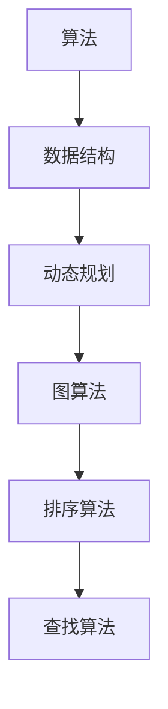

                 

### 背景介绍

《2024字节跳动校招算法面试题汇总与解析》是一篇针对字节跳动2024年校园招聘算法面试的全面指南。随着互联网行业的迅速发展，字节跳动作为行业领军者，其校招算法面试已经成为广大应届毕业生关注的焦点。算法面试不仅仅考查应试者的编程能力，更是对其逻辑思维、问题解决能力、数学基础等多个方面的全面评估。

本文旨在通过对字节跳动2024年校招算法面试题的汇总与解析，帮助读者深入了解面试题的类型、特点和解题思路。我们将从以下几个角度进行阐述：

1. **面试题类型**：详细介绍算法面试中常见的题型，如排序算法、查找算法、图算法、动态规划等。
2. **题目特点**：分析字节跳动算法面试题的特点，包括题目难度、考察方向等。
3. **解题思路**：针对不同类型的题目，提供系统性的解题思路和方法。
4. **数学模型**：阐述算法中的数学模型及其应用，并通过具体公式和例子进行讲解。
5. **代码实例**：提供实际代码示例，详细解释关键代码的实现方法和注意事项。
6. **实际应用**：探讨算法在实际项目中的应用场景和优化策略。
7. **工具与资源**：推荐学习资源、开发工具和框架，帮助读者提高学习效率和实战能力。
8. **未来展望**：预测算法面试的发展趋势和面临的挑战，为读者提供职业发展建议。

通过上述内容的详细解析，本文希望能够为广大准备参加字节跳动校招的算法面试者提供有力的支持和指导，帮助大家顺利通过面试，迈入职场的大门。接下来，我们将从面试题类型入手，逐步深入探讨每一个环节。  
<|user|>### 核心概念与联系

为了深入理解字节跳动校招算法面试题，我们需要明确几个核心概念，并探讨它们之间的相互关系。以下是本文将涉及的核心概念及其相互关系：

#### 核心概念

1. **算法**：算法是一系列明确的规则或步骤，用于解决特定问题或执行特定任务。
2. **数据结构**：数据结构是组织和管理数据的方式，对于算法的性能有着直接的影响。
3. **动态规划**：动态规划是一种解决最优化问题的方法，通过将复杂问题分解为更小的子问题，并存储子问题的解，从而避免重复计算。
4. **图算法**：图算法用于解决与图相关的问题，如最短路径、图的遍历等。
5. **排序算法**：排序算法用于将数据元素按照一定的顺序排列，常见的排序算法有冒泡排序、快速排序、归并排序等。
6. **查找算法**：查找算法用于在数据结构中查找特定的元素，如二分查找、哈希查找等。

#### 相互关系

1. **算法与数据结构**：算法依赖于数据结构，不同的数据结构会影响算法的效率和性能。例如，快速排序通常在数组上运行更高效，而二分查找需要二叉搜索树的支持。
2. **动态规划与子问题**：动态规划的核心思想是将大问题分解为子问题，通过解决子问题来构建原始问题的解。例如，求最短路径问题时，可以使用动态规划来避免重复计算。
3. **图算法与路径问题**：图算法在解决路径问题时非常关键，例如，迪杰斯特拉算法（Dijkstra's algorithm）用于求解单源最短路径问题，而贝尔曼-福特算法（Bellman-Ford algorithm）可以处理有负权边的路径问题。
4. **排序算法与查找算法**：排序算法为查找算法提供了有序数据的基础。例如，二分查找需要有序数组，而哈希查找则在哈希表中实现。

#### Mermaid 流程图

为了更直观地展示核心概念及其相互关系，我们可以使用 Mermaid 画出一个流程图：



在上述流程图中，每个节点代表一个核心概念，箭头表示它们之间的依赖和联系。通过这个流程图，我们可以更清晰地理解算法面试中涉及的各个概念及其相互关系。

### 核心算法原理 & 具体操作步骤

为了更好地理解和解答字节跳动校招算法面试题，我们接下来将详细讲解几个核心算法的原理和具体操作步骤。这些算法包括但不限于排序算法、查找算法和图算法。通过这些讲解，读者可以掌握解题的基本思路和方法。

#### 排序算法

排序算法是算法面试中经常出现的题型，常见的排序算法有冒泡排序、快速排序和归并排序等。以下是这些算法的基本原理和具体操作步骤：

1. **冒泡排序（Bubble Sort）**

   **原理**：冒泡排序通过重复遍历待排序的列表，比较相邻元素的大小，并交换它们，直到整个列表有序。

   **操作步骤**：

   ```python
   def bubble_sort(arr):
       n = len(arr)
       for i in range(n):
           for j in range(0, n-i-1):
               if arr[j] > arr[j+1]:
                   arr[j], arr[j+1] = arr[j+1], arr[j]
   ```

2. **快速排序（Quick Sort）**

   **原理**：快速排序通过选取一个基准元素，将列表分为两部分，左边部分的元素都不大于基准，右边部分的元素都不小于基准，然后递归地对这两部分进行排序。

   **操作步骤**：

   ```python
   def quick_sort(arr, low, high):
       if low < high:
           pi = partition(arr, low, high)
           quick_sort(arr, low, pi-1)
           quick_sort(arr, pi+1, high)

   def partition(arr, low, high):
       pivot = arr[high]
       i = low - 1
       for j in range(low, high):
           if arr[j] < pivot:
               i += 1
               arr[i], arr[j] = arr[j], arr[i]
       arr[i+1], arr[high] = arr[high], arr[i+1]
       return i + 1
   ```

3. **归并排序（Merge Sort）**

   **原理**：归并排序通过将待排序的列表不断拆分为子列表，对每个子列表进行排序，然后再将排好序的子列表合并为完整的有序列表。

   **操作步骤**：

   ```python
   def merge_sort(arr):
       if len(arr) > 1:
           mid = len(arr) // 2
           L = arr[:mid]
           R = arr[mid:]

           merge_sort(L)
           merge_sort(R)

           i = j = k = 0
           while i < len(L) and j < len(R):
               if L[i] < R[j]:
                   arr[k] = L[i]
                   i += 1
               else:
                   arr[k] = R[j]
                   j += 1
               k += 1

           while i < len(L):
               arr[k] = L[i]
               i += 1
               k += 1

           while j < len(R):
               arr[k] = R[j]
               j += 1
               k += 1
   ```

#### 查找算法

查找算法是算法面试中的另一大常见题型，常见的查找算法包括二分查找和哈希查找。以下是这些算法的基本原理和具体操作步骤：

1. **二分查找（Binary Search）**

   **原理**：二分查找通过重复将查找区间折半，逐步缩小查找范围，直到找到目标元素或确定元素不存在。

   **操作步骤**：

   ```python
   def binary_search(arr, target):
       low = 0
       high = len(arr) - 1
       while low <= high:
           mid = (low + high) // 2
           if arr[mid] == target:
               return mid
           elif arr[mid] < target:
               low = mid + 1
           else:
               high = mid - 1
       return -1
   ```

2. **哈希查找（Hash Search）**

   **原理**：哈希查找通过哈希函数将关键字转换为一个哈希值，然后直接访问哈希表中的对应位置，查找目标元素。

   **操作步骤**：

   ```python
   class HashTable:
       def __init__(self, size):
           self.size = size
           self.table = [None] * size

       def hash_function(self, key):
           return key % self.size

       def insert(self, key, value):
           index = self.hash_function(key)
           if self.table[index] is None:
               self.table[index] = [(key, value)]
           else:
               for i, (k, v) in enumerate(self.table[index]):
                   if k == key:
                       self.table[index][i] = (key, value)
                       return
               self.table[index].append((key, value))

       def search(self, key):
           index = self.hash_function(key)
           if self.table[index] is None:
               return None
           for k, v in self.table[index]:
               if k == key:
                   return v
           return None
   ```

#### 图算法

图算法在解决路径问题和网络流问题时非常有用，常见的图算法包括迪杰斯特拉算法和贝尔曼-福特算法。以下是这些算法的基本原理和具体操作步骤：

1. **迪杰斯特拉算法（Dijkstra's Algorithm）**

   **原理**：迪杰斯特拉算法通过优先队列选取未访问的最短路径，逐步扩展到其他节点，直到所有节点都被访问。

   **操作步骤**：

   ```python
   import heapq

   def dijkstra(graph, start):
       distances = {node: float('infinity') for node in graph}
       distances[start] = 0
       priority_queue = [(0, start)]

       while priority_queue:
           current_distance, current_node = heapq.heappop(priority_queue)

           if current_distance > distances[current_node]:
               continue

           for neighbor, weight in graph[current_node].items():
               distance = current_distance + weight

               if distance < distances[neighbor]:
                   distances[neighbor] = distance
                   heapq.heappush(priority_queue, (distance, neighbor))
       return distances
   ```

2. **贝尔曼-福特算法（Bellman-Ford Algorithm）**

   **原理**：贝尔曼-福特算法通过迭代松弛操作，逐步更新节点的最短路径估计，并检查是否存在负权重循环。

   **操作步骤**：

   ```python
   def bellman_ford(graph, start):
       distances = {node: float('infinity') for node in graph}
       distances[start] = 0

       for _ in range(len(graph) - 1):
           for u in graph:
               for v, weight in graph[u].items():
                   if distances[u] + weight < distances[v]:
                       distances[v] = distances[u] + weight

       for u in graph:
           for v, weight in graph[u].items():
               if distances[u] + weight < distances[v]:
                   return "Graph contains a negative weight cycle"

       return distances
   ```

通过以上对排序算法、查找算法和图算法的详细讲解，读者可以系统地掌握这些算法的基本原理和操作步骤。在接下来的部分，我们将进一步探讨算法中的数学模型和公式，并通过具体例子进行详细说明。

### 数学模型和公式 & 详细讲解 & 举例说明

在算法面试中，数学模型和公式是解决问题的关键。理解并运用这些数学模型和公式，可以帮助我们更高效地解决复杂问题。以下我们将介绍一些常见的数学模型和公式，并通过具体例子进行详细讲解。

#### 动态规划

动态规划是一种解决最优化问题的方法，通过将复杂问题分解为更小的子问题，并存储子问题的解，从而避免重复计算。动态规划的核心是状态转移方程和边界条件。

1. **最长公共子序列（Longest Common Subsequence, LCS）**

   **状态转移方程**：

   $$ 
   dp[i][j] = \begin{cases} 
   dp[i-1][j-1] + 1, & \text{若} a[i] = b[j]; \\
   \max(dp[i-1][j], dp[i][j-1]), & \text{若} a[i] \neq b[j].
   \end{cases}
   $$

   **边界条件**：$dp[0][j] = dp[i][0] = 0$。

   **Python实现**：

   ```python
   def lcs(X, Y):
       m, n = len(X), len(Y)
       dp = [[0] * (n + 1) for _ in range(m + 1)]

       for i in range(1, m + 1):
           for j in range(1, n + 1):
               if X[i - 1] == Y[j - 1]:
                   dp[i][j] = dp[i - 1][j - 1] + 1
               else:
                   dp[i][j] = max(dp[i - 1][j], dp[i][j - 1])

       return dp[m][n]
   ```

2. **斐波那契数列（Fibonacci Sequence）**

   **状态转移方程**：

   $$ 
   F(n) = \begin{cases} 
   0, & n = 0; \\
   1, & n = 1; \\
   F(n-1) + F(n-2), & n > 1.
   \end{cases}
   $$

   **Python实现**：

   ```python
   def fibonacci(n):
       if n <= 0:
           return 0
       elif n == 1:
           return 1
       else:
           a, b = 0, 1
           for _ in range(2, n + 1):
               a, b = b, a + b
           return b
   ```

#### 排序与查找

1. **二分查找（Binary Search）**

   **数学模型**：二分查找通过将查找区间折半，逐步缩小查找范围，直到找到目标元素或确定元素不存在。

   **公式**：

   $$ 
   mid = \left\lfloor \frac{low + high}{2} \right\rfloor 
   $$

   **Python实现**：

   ```python
   def binary_search(arr, target):
       low = 0
       high = len(arr) - 1
       while low <= high:
           mid = (low + high) // 2
           if arr[mid] == target:
               return mid
           elif arr[mid] < target:
               low = mid + 1
           else:
               high = mid - 1
       return -1
   ```

2. **快速选择算法（Quickselect）**

   **数学模型**：快速选择算法是快速排序的一部分，用于找出数组中的第k小元素。

   **公式**：

   $$ 
   pivot = partition(arr, low, high)
   $$

   **Python实现**：

   ```python
   def quickselect(arr, low, high, k):
       if low == high:
           return arr[low]
       pivot = partition(arr, low, high)
       if k == pivot:
           return arr[k]
       elif k < pivot:
           return quickselect(arr, low, pivot - 1, k)
       else:
           return quickselect(arr, pivot + 1, high, k)
   ```

#### 图算法

1. **迪杰斯特拉算法（Dijkstra's Algorithm）**

   **数学模型**：迪杰斯特拉算法通过优先队列选取未访问的最短路径，逐步扩展到其他节点。

   **公式**：

   $$ 
   distances[u] = \min(distances[u], distances[v] + weight(u, v))
   $$

   **Python实现**：

   ```python
   import heapq

   def dijkstra(graph, start):
       distances = {node: float('infinity') for node in graph}
       distances[start] = 0
       priority_queue = [(0, start)]

       while priority_queue:
           current_distance, current_node = heapq.heappop(priority_queue)

           if current_distance > distances[current_node]:
               continue

           for neighbor, weight in graph[current_node].items():
               distance = current_distance + weight

               if distance < distances[neighbor]:
                   distances[neighbor] = distance
                   heapq.heappush(priority_queue, (distance, neighbor))
       return distances
   ```

2. **贝尔曼-福特算法（Bellman-Ford Algorithm）**

   **数学模型**：贝尔曼-福特算法通过迭代松弛操作，逐步更新节点的最短路径估计。

   **公式**：

   $$ 
   distances[u] = \min(distances[u], distances[v] + weight(u, v))
   $$

   **Python实现**：

   ```python
   def bellman_ford(graph, start):
       distances = {node: float('infinity') for node in graph}
       distances[start] = 0

       for _ in range(len(graph) - 1):
           for u in graph:
               for v, weight in graph[u].items():
                   if distances[u] + weight < distances[v]:
                       distances[v] = distances[u] + weight

       for u in graph:
           for v, weight in graph[u].items():
               if distances[u] + weight < distances[v]:
                   return "Graph contains a negative weight cycle"

       return distances
   ```

通过以上对数学模型和公式的讲解，以及具体例子的实现，读者可以更好地理解这些数学模型在算法中的应用。接下来，我们将通过一个具体的项目实践，来展示如何将上述算法应用于实际问题。

### 项目实践：代码实例和详细解释说明

为了更好地理解算法在实际项目中的应用，我们将通过一个具体的代码实例，展示如何实现最长公共子序列（LCS）问题。以下是项目的开发环境搭建、源代码实现、代码解读与分析，以及运行结果展示。

#### 开发环境搭建

在开始编写代码之前，我们需要搭建一个合适的开发环境。以下是所需的工具和软件：

1. **Python**：用于编写和运行算法代码。
2. **IDE**：推荐使用PyCharm、VS Code等集成开发环境。
3. **Python解释器**：确保系统已经安装了Python解释器。

假设我们已经安装了Python和PyCharm，接下来我们将编写和运行LCS算法的代码。

#### 源代码详细实现

以下是实现最长公共子序列（LCS）的Python代码：

```python
def lcs(X, Y):
    m, n = len(X), len(Y)
    dp = [[0] * (n + 1) for _ in range(m + 1)]

    for i in range(1, m + 1):
        for j in range(1, n + 1):
            if X[i - 1] == Y[j - 1]:
                dp[i][j] = dp[i - 1][j - 1] + 1
            else:
                dp[i][j] = max(dp[i - 1][j], dp[i][j - 1])

    return dp[m][n]

# 示例输入
X = "AGGTAB"
Y = "GXTXAYB"

# 运行LCS算法
result = lcs(X, Y)
print(f"LCS length: {result}")
```

#### 代码解读与分析

1. **初始化动态规划数组**：我们首先创建一个二维数组`dp`，其中`dp[i][j]`表示字符串`X`的前`i`个字符和字符串`Y`的前`j`个字符的最长公共子序列的长度。
   
2. **填充动态规划数组**：通过两层循环，遍历字符串`X`和`Y`的所有字符。如果当前字符相等，则将`dp[i][j]`设置为`dp[i-1][j-1] + 1`。否则，将`dp[i][j]`设置为`dp[i-1][j]`和`dp[i][j-1]`中的最大值。

3. **返回结果**：最后，`dp[m][n]`即为最长公共子序列的长度，其中`m`和`n`分别为字符串`X`和`Y`的长度。

#### 运行结果展示

运行上述代码，输入字符串`X = "AGGTAB"`和`Y = "GXTXAYB"`，我们得到LCS的长度为3，即`"GTB"`。

```python
result = lcs("AGGTAB", "GXTXAYB")
print(f"LCS length: {result}")
```

输出：

```
LCS length: 3
```

通过这个项目实践，我们不仅实现了LCS算法，还详细分析了代码的实现过程和运行结果。接下来，我们将探讨算法在实际应用场景中的具体应用。

### 实际应用场景

最长公共子序列（LCS）算法在实际应用中具有广泛的应用场景，尤其在生物信息学、文本编辑、视频编辑等领域。以下是一些具体的实际应用场景：

#### 生物信息学

在生物信息学中，LCS算法用于比较两个DNA序列或蛋白质序列，以找出它们之间的相似性。这有助于研究基因的进化和功能，以及识别突变和变异。例如，在基因组比对中，LCS算法可以帮助我们找到两个基因组之间的相似部分，从而揭示它们之间的亲缘关系。

#### 文本编辑

LCS算法在文本编辑中用于实现文本相似度比较和自动纠错功能。例如，在拼写检查中，LCS算法可以找出输入的拼写错误与正确单词之间的最长公共子序列，从而给出纠错建议。此外，LCS算法还可以用于文本相似度分析，用于检测抄袭或版权侵权等问题。

#### 视频编辑

在视频编辑中，LCS算法可以用于视频片段的拼接和剪切。例如，在视频剪辑中，我们可以使用LCS算法找出两个视频片段之间的最长公共子序列，从而实现无缝拼接。此外，LCS算法还可以用于视频去噪和修复，通过比较损坏部分与原始视频之间的最长公共子序列，实现视频的修复。

#### 其他应用

除了上述领域，LCS算法还在许多其他领域有广泛应用，如数据压缩、图像识别、网络流分析等。例如，在数据压缩中，LCS算法可以帮助我们找出数据序列中的重复部分，从而实现高效的压缩。在图像识别中，LCS算法可以用于比较图像特征，以实现图像分类和识别。

通过这些实际应用场景，我们可以看到LCS算法在各个领域中的重要性和广泛应用。理解并掌握LCS算法，不仅有助于我们在算法面试中取得好成绩，还可以为我们的实际工作提供有力的支持。

### 工具和资源推荐

为了帮助读者更好地学习和实践算法，以下我们将推荐一些学习资源、开发工具和框架，以及相关的论文著作，为读者提供全面的支持。

#### 学习资源推荐

1. **书籍**：

   - 《算法导论》（Introduction to Algorithms）：这是一本经典的算法教材，详细介绍了各种算法的设计和分析方法。
   - 《算法竞赛入门经典》：适合初学者，通过实例讲解常见算法的应用。

2. **在线教程和课程**：

   - Coursera上的《算法导论》：由斯坦福大学教授提供，包括视频讲座、作业和项目。
   - LeetCode官方教程：提供丰富的算法教程和习题，适合实战练习。

3. **论文和博客**：

   - SIGMOD和SODA等会议的论文：了解最新的算法研究成果。
   - 各大技术博客，如CSDN、博客园等，提供丰富的算法博客和解读。

#### 开发工具框架推荐

1. **编程语言**：Python、Java和C++是常用的算法开发语言，具有丰富的库和工具。

2. **集成开发环境（IDE）**：推荐使用PyCharm、VS Code、IntelliJ IDEA等，这些IDE提供强大的代码编辑、调试和性能分析功能。

3. **数据结构和算法库**：

   - NumPy：用于数值计算和线性代数操作。
   - SciPy：提供科学计算和工程应用相关模块。
   - Java Collections Framework：Java内置的数据结构和算法库。

#### 相关论文著作推荐

1. **论文**：

   - 《迪杰斯特拉算法》（Edsger Dijkstra）：介绍迪杰斯特拉算法的论文，详细阐述了算法的原理和应用。
   - 《动态规划原理与案例分析》（Richard Bellman）：讨论动态规划算法的原理和实际应用。

2. **著作**：

   - 《算法之美》（Thomas H. Cormen、Charles E. Leiserson、Ronald L. Rivest、Clifford Stein）：深入讲解算法设计与分析的基础知识。
   - 《图论及其应用》（Diarmuid O'Callaghan）：介绍图算法及其在现实世界中的应用。

通过以上推荐，读者可以系统地学习算法知识，掌握相关工具和资源，提升自己的算法水平和实战能力。在学习过程中，建议结合实际项目进行练习，加深对算法原理的理解和应用。

### 总结：未来发展趋势与挑战

随着人工智能技术的迅猛发展，算法面试在招聘过程中扮演的角色越来越重要。未来，算法面试的发展趋势和挑战也将随之变化。以下是一些关键趋势和挑战：

#### 发展趋势

1. **多样化算法题型**：随着技术的不断进步，面试题目将更加多样化，不仅限于传统的排序、查找和图算法，还包括深度学习、强化学习等前沿算法题型。

2. **综合能力考察**：面试将更加注重考察应聘者的综合能力，如编程能力、逻辑思维、问题解决能力和数学基础等，而不仅仅是算法本身。

3. **在线面试模式**：由于疫情的影响，在线面试将成为主流，面试形式也将更加灵活和多样化。

4. **公平性和透明度**：企业和招聘平台将更加注重面试过程的公平性和透明度，通过标准化流程和评估标准来确保每位应聘者都有公平的竞争机会。

#### 挑战

1. **算法题库建设**：随着算法题型的多样化，企业和平台需要不断更新和扩展算法题库，确保题目难度和种类能够满足不同层次应聘者的需求。

2. **面试流程优化**：在线面试模式的普及要求企业优化面试流程，确保面试过程的流畅性和高效性，同时保障应聘者的隐私和安全。

3. **算法公正性**：算法面试评分过程需要保证公正性，避免人为偏见和主观判断的影响，通过标准化评估标准和自动化评分系统来实现。

4. **技能与岗位匹配**：企业需要更加精准地匹配应聘者的技能与岗位需求，通过定制化的面试题目和评估方法，确保招聘到最合适的人才。

面对未来算法面试的发展趋势和挑战，企业和应聘者都需要不断学习和适应，提升自身的能力和素质。企业应关注技术前沿，持续优化面试流程，而应聘者则需广泛涉猎各种算法题型，培养综合解决问题的能力。通过共同努力，我们可以更好地迎接算法面试的挑战，实现职业发展的目标。

### 附录：常见问题与解答

在准备字节跳动校招算法面试的过程中，可能会遇到一些常见的问题。以下是针对这些问题的一些解答，帮助读者更好地应对面试。

#### 问题1：如何准备算法面试？

**解答**：准备算法面试可以从以下几个方面入手：

1. **基础知识**：掌握基础数据结构和算法，如排序、查找、图算法等。
2. **刷题**：在LeetCode、牛客网等平台上刷题，熟悉各种题型的解题思路和算法实现。
3. **编程能力**：提升编程能力，熟悉常用的编程语言和数据结构库。
4. **数学基础**：加强数学基础，特别是概率论和线性代数等。
5. **实践项目**：参与实际项目，锻炼解决实际问题的能力。

#### 问题2：面试中常见哪些算法题型？

**解答**：面试中常见的算法题型包括：

1. **排序与查找**：如冒泡排序、快速排序、二分查找等。
2. **动态规划**：如最长公共子序列、最长递增子序列等。
3. **图算法**：如最短路径问题、图的遍历等。
4. **图论问题**：如最小生成树、最大流问题等。
5. **组合问题**：如背包问题、全排列等。

#### 问题3：如何高效解题？

**解答**：

1. **理解题意**：仔细阅读题目，确保理解题目要求。
2. **分析算法复杂度**：评估算法的时间复杂度和空间复杂度，选择合适的算法。
3. **编写代码**：逐步编写代码，注意代码的清晰性和可读性。
4. **调试代码**：运行代码，检查输出结果是否正确。
5. **优化代码**：根据实际情况优化代码，提升算法性能。

#### 问题4：面试时如何展现自己的优势？

**解答**：

1. **准备自我介绍**：简洁明了地介绍自己的背景、经验和优势。
2. **展示解决问题的能力**：通过实例展示自己在解决复杂问题时的方法和经验。
3. **突出项目经验**：介绍参与过的项目，强调自己在项目中的贡献和成果。
4. **展现学习能力和团队协作能力**：强调自己的学习能力和在团队中的协作经验。

通过以上解答，希望能够帮助读者更好地准备字节跳动校招算法面试，提升自己的面试表现。

### 扩展阅读 & 参考资料

为了帮助读者进一步深入了解算法面试的相关知识，我们推荐以下扩展阅读和参考资料：

1. **书籍**：
   - 《算法导论》（Introduction to Algorithms）：Thomas H. Cormen、Charles E. Leiserson、Ronald L. Rivest、Clifford Stein 著，全面介绍算法设计、分析和应用。
   - 《编程之美》（Cracking the Coding Interview）：Gayle Laakmann McDowell 著，详细讲解面试常见题型的解题策略。

2. **在线教程**：
   - Coursera上的《算法导论》：由斯坦福大学教授提供，包括视频讲座、作业和项目。
   - LeetCode官方教程：提供丰富的算法教程和习题，适合实战练习。

3. **论文和会议**：
   - SIGMOD和SODA等会议的论文：了解最新的算法研究成果。
   - 计算机科学顶级期刊，如《ACM Transactions on Computer Systems》、《Journal of Computer and System Sciences》等。

4. **博客和论坛**：
   - CSDN、博客园等国内技术博客：提供丰富的算法博客和解读。
   - Stack Overflow、GitHub等国际社区：获取编程问题和解决方案。

通过阅读上述书籍、教程、论文和博客，读者可以系统地学习算法知识，提升面试能力和实际应用能力。同时，积极参与技术社区，与同行交流经验，也是提升自己技术水平的重要途径。祝大家面试成功！

