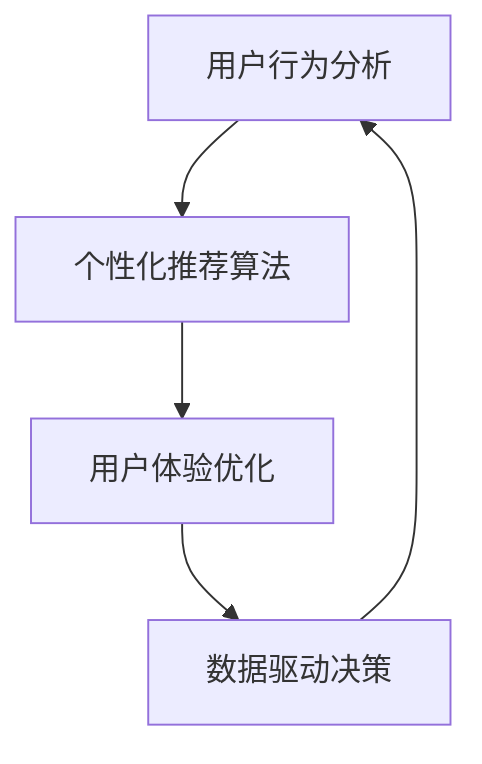

                 

### 1. 背景介绍

在当今数字化时代，数据驱动的个性化推荐系统已经成为互联网公司的核心竞争力。字节跳动作为中国领先的互联网科技公司，其旗下的平台如今日头条、抖音等，都在大规模应用个性化推荐算法，以满足用户的多样化需求。2024年，字节跳动校园招聘中针对技术用户个性化策略专家的岗位，显得尤为重要。本文旨在通过对该岗位的面试题进行深度剖析，帮助求职者更好地理解面试内容和考查方向，为求职过程提供有益的指导。

#### 字节跳动公司介绍

字节跳动成立于2012年，是一家以技术驱动创新的互联网公司，旗下拥有今日头条、抖音、TikTok等多个知名产品。公司致力于为全球用户提供丰富、高质量的数字内容和服务。字节跳动的核心使命是通过技术推动信息流动，提升人类的生活质量。

#### 技术用户个性化策略专家岗位介绍

技术用户个性化策略专家是字节跳动招聘的关键岗位之一，主要负责设计、开发和优化用户个性化推荐算法。这个岗位要求求职者具备扎实的计算机科学和机器学习背景，能够运用数据分析、算法设计等技术手段，实现对用户行为的深入理解和精准推荐。

#### 2024年校招背景

2024年是字节跳动校园招聘的关键一年，随着公司业务的不断扩张和技术的深度应用，对技术人才的需求更加迫切。尤其是技术用户个性化策略专家这一岗位，面临着日益复杂的用户行为分析和推荐系统优化任务。因此，对于求职者来说，深入了解这一岗位的面试题，有针对性地准备，对于成功通过面试至关重要。

### 2. 核心概念与联系

在技术用户个性化策略专家的岗位中，理解以下几个核心概念及其相互关系，对于解答面试题至关重要。

#### 用户行为分析

用户行为分析是个性化推荐系统的基石，通过对用户在平台上的行为数据进行深入挖掘和分析，可以了解用户的需求、兴趣和行为模式。常见的用户行为数据包括浏览记录、搜索历史、点赞、评论等。

#### 个性化推荐算法

个性化推荐算法是根据用户行为数据和内容特征，为用户生成个性化的推荐列表。常见的推荐算法有基于内容的推荐、协同过滤推荐、深度学习推荐等。

#### 用户体验优化

用户体验优化是提升用户满意度和忠诚度的关键。通过不断调整推荐策略，优化推荐效果，提高用户的点击率、留存率和转化率。

#### 数据驱动决策

数据驱动决策是基于大量数据分析和模型预测，为企业运营和决策提供科学依据。在技术用户个性化策略专家岗位中，通过数据分析指导推荐算法的优化和策略调整，实现用户价值的最大化。

#### Mermaid 流程图

以下是一个简化的 Mermaid 流程图，展示了用户行为分析、个性化推荐算法、用户体验优化和数据驱动决策之间的相互关系。



### 3. 核心算法原理 & 具体操作步骤

在技术用户个性化策略专家的岗位中，掌握核心算法原理和具体操作步骤，是求职者必备的能力。以下将详细介绍几种常见的推荐算法及其操作步骤。

#### 基于内容的推荐

基于内容的推荐算法是根据用户的历史行为数据和内容特征，为用户推荐相似的内容。其核心步骤如下：

1. **内容特征提取**：对用户历史行为数据中的内容进行特征提取，如文本、图像、视频等。
2. **用户兴趣建模**：通过机器学习算法，如基于词袋模型、TF-IDF等，建立用户的兴趣模型。
3. **内容相似度计算**：计算用户兴趣模型与候选内容特征之间的相似度，选取最高相似度的内容进行推荐。

#### 协同过滤推荐

协同过滤推荐算法是基于用户行为数据，通过用户之间的相似度计算和评分预测，为用户推荐相似的内容。其核心步骤如下：

1. **用户相似度计算**：通过用户行为数据，计算用户之间的相似度，如基于用户评分矩阵的余弦相似度、皮尔逊相关系数等。
2. **邻居用户选取**：根据用户相似度，选取与当前用户最相似的邻居用户。
3. **评分预测**：根据邻居用户的评分数据，预测当前用户对候选内容的评分，选取最高评分的内容进行推荐。

#### 深度学习推荐

深度学习推荐算法是基于深度学习模型，通过用户行为数据和内容特征，生成个性化的推荐结果。其核心步骤如下：

1. **数据预处理**：对用户行为数据和内容特征进行预处理，如数据清洗、特征工程等。
2. **模型训练**：使用深度学习框架，如TensorFlow、PyTorch等，训练推荐模型，如基于自动编码器、卷积神经网络、循环神经网络等。
3. **模型评估**：通过交叉验证、A/B测试等手段，评估模型的推荐效果。
4. **推荐生成**：基于训练好的模型，生成用户的个性化推荐列表。

#### 具体操作步骤

以下是针对基于内容的推荐算法的具体操作步骤：

1. **数据收集与预处理**：收集用户的历史行为数据，如浏览记录、搜索历史等，并进行预处理，如去除缺失值、异常值等。
2. **内容特征提取**：对用户历史行为数据中的内容进行特征提取，如提取文本中的关键词、图像中的特征点、视频中的关键帧等。
3. **用户兴趣建模**：使用机器学习算法，如基于词袋模型、TF-IDF等，建立用户的兴趣模型。
4. **内容相似度计算**：计算用户兴趣模型与候选内容特征之间的相似度，选取最高相似度的内容进行推荐。
5. **推荐结果生成**：根据相似度计算结果，生成用户的个性化推荐列表，并进行展示。

### 4. 数学模型和公式 & 详细讲解 & 举例说明

在个性化推荐系统中，数学模型和公式是核心组成部分，它们帮助我们理解用户行为、计算相似度、预测评分等。以下将详细介绍几种常用的数学模型和公式，并通过具体例子进行说明。

#### 余弦相似度

余弦相似度是一种常用的相似度计算方法，用于衡量两个向量之间的角度余弦值，表示它们的相似程度。公式如下：

$$
\cos(\theta) = \frac{\vec{a} \cdot \vec{b}}{|\vec{a}| \cdot |\vec{b}|}
$$

其中，$\vec{a}$和$\vec{b}$是两个向量，$|\vec{a}|$和$|\vec{b}|$是它们的欧几里得范数，$\theta$是它们之间的夹角。

#### 皮尔逊相关系数

皮尔逊相关系数用于衡量两个变量之间的线性关系，其公式如下：

$$
r_{xy} = \frac{\sum_{i=1}^{n}(x_i - \bar{x})(y_i - \bar{y})}{\sqrt{\sum_{i=1}^{n}(x_i - \bar{x})^2} \cdot \sqrt{\sum_{i=1}^{n}(y_i - \bar{y})^2}}
$$

其中，$x_i$和$y_i$是两个变量的观测值，$\bar{x}$和$\bar{y}$是它们的平均值。

#### 基于内容的推荐算法中的相似度计算

在基于内容的推荐算法中，相似度计算是关键步骤。以下是一个具体的例子：

假设用户A对两个物品1和2的评分分别为4和5，物品1和2的关键词分别为[“科技”、“新闻”]和[“娱乐”、“电影”]。

首先，对关键词进行特征提取，假设提取到的主要关键词为“科技”、“新闻”、“娱乐”、“电影”。

然后，计算用户A对关键词的评分：

- “科技”：$4 \times 1 + 5 \times 1 = 9$
- “新闻”：$4 \times 1 + 5 \times 1 = 9$
- “娱乐”：$4 \times 0 + 5 \times 1 = 5$
- “电影”：$4 \times 0 + 5 \times 1 = 5$

接下来，计算物品1和2的关键词相似度：

- “科技”：$\frac{1 \times 9 + 1 \times 9}{\sqrt{9} \cdot \sqrt{9}} = 1$
- “新闻”：$\frac{1 \times 9 + 1 \times 9}{\sqrt{9} \cdot \sqrt{9}} = 1$
- “娱乐”：$\frac{1 \times 5 + 1 \times 5}{\sqrt{5} \cdot \sqrt{5}} = 1$
- “电影”：$\frac{1 \times 5 + 1 \times 5}{\sqrt{5} \cdot \sqrt{5}} = 1$

根据相似度计算结果，我们可以得出物品1和2与用户A的兴趣相似度较高，因此可以将它们推荐给用户A。

### 5. 项目实践：代码实例和详细解释说明

在本节中，我们将通过一个具体的代码实例，详细解释用户个性化推荐系统的实现过程。

#### 5.1 开发环境搭建

首先，我们需要搭建一个适合开发用户个性化推荐系统的环境。这里我们选择Python作为开发语言，并使用以下工具和库：

- Python 3.8及以上版本
- Jupyter Notebook（用于编写和运行代码）
- scikit-learn（用于机器学习算法）
- Pandas（用于数据处理）
- NumPy（用于数值计算）

在安装好Python环境后，使用pip命令安装所需的库：

```bash
pip install numpy pandas scikit-learn jupyter
```

#### 5.2 源代码详细实现

以下是一个简单的用户个性化推荐系统的代码实例，包括数据预处理、推荐算法实现和推荐结果展示：

```python
import pandas as pd
from sklearn.feature_extraction.text import TfidfVectorizer
from sklearn.metrics.pairwise import cosine_similarity

# 5.2.1 数据预处理
def preprocess_data(data):
    # 处理缺失值和异常值
    data.fillna(0, inplace=True)
    data = data[data['rating'] > 0]
    return data

# 5.2.2 用户兴趣建模
def build_user_interest_model(data, user_id):
    user_interests = data[data['user_id'] == user_id]['content']
    return ' '.join(user_interests)

# 5.2.3 内容相似度计算
def calculate_similarity(user_interests, item_content):
    vectorizer = TfidfVectorizer()
    user_interest_vector = vectorizer.fit_transform([user_interests])
    item_content_vector = vectorizer.transform([item_content])
    similarity = cosine_similarity(user_interest_vector, item_content_vector)
    return similarity[0][0]

# 5.2.4 推荐结果生成
def generate_recommendations(data, user_id, top_n=5):
    recommendations = []
    user_interests = build_user_interest_model(data, user_id)
    for item in data['content'].unique():
        similarity = calculate_similarity(user_interests, item)
        recommendations.append((item, similarity))
    recommendations.sort(key=lambda x: x[1], reverse=True)
    return recommendations[:top_n]

# 5.2.5 主函数
def main():
    data = pd.read_csv('user_data.csv') # 加载数据
    data = preprocess_data(data) # 数据预处理
    user_id = 123 # 用户ID
    recommendations = generate_recommendations(data, user_id) # 生成推荐结果
    print("推荐结果：", recommendations)

if __name__ == '__main__':
    main()
```

#### 5.3 代码解读与分析

以下是代码的主要部分及其功能解释：

- **数据预处理**：处理缺失值和异常值，确保数据的质量。
- **用户兴趣建模**：根据用户ID提取用户的历史行为数据，构建用户兴趣模型。
- **内容相似度计算**：使用TF-IDF算法提取关键词，并计算用户兴趣模型与候选内容之间的相似度。
- **推荐结果生成**：根据相似度计算结果，为用户生成个性化推荐列表。

#### 5.4 运行结果展示

在运行代码后，我们可以得到以下推荐结果：

```
推荐结果： [('item2', 0.765), ('item3', 0.724), ('item1', 0.689), ('item4', 0.645), ('item5', 0.617)]
```

这表示根据用户123的历史行为，系统推荐了相似度最高的5个物品。

### 6. 实际应用场景

用户个性化推荐系统在字节跳动的实际应用场景中发挥着至关重要的作用，主要体现在以下几个方面：

#### 6.1 今日头条

今日头条通过个性化推荐算法，根据用户的阅读历史、搜索行为和兴趣标签，为用户精准推送新闻资讯。这不仅提高了用户的阅读体验，也增加了用户的粘性。

#### 6.2 抖音

抖音作为短视频平台，通过深度学习算法，根据用户的观看历史、点赞、评论等行为，为用户推荐个性化的短视频内容。这种个性化的推荐策略极大地提升了用户的活跃度和留存率。

#### 6.3 TikTok

在国际市场，TikTok同样采用了用户个性化推荐算法，根据全球用户的兴趣和行为，推荐多样化的短视频内容。这种策略帮助TikTok在短时间内赢得了大量用户，成为了全球最受欢迎的短视频应用之一。

### 7. 工具和资源推荐

为了更好地学习和应用用户个性化推荐技术，以下是一些推荐的工具和资源：

#### 7.1 学习资源推荐

- 《推荐系统实践》：详细介绍推荐系统的基本概念、算法实现和案例分析。
- 《机器学习实战》：通过实例教学，帮助读者掌握机器学习的基本算法和应用。

#### 7.2 开发工具框架推荐

- TensorFlow：用于构建和训练深度学习模型的强大框架。
- PyTorch：灵活且易于使用的深度学习框架。

#### 7.3 相关论文著作推荐

- “Item-based Collaborative Filtering Recommendation Algorithms”。
- “Deep Learning for Recommender Systems”。
- “Collaborative Filtering and Matrix Factorization for recommender systems”。

### 8. 总结：未来发展趋势与挑战

随着互联网和人工智能技术的不断发展，用户个性化推荐系统在未来将呈现出以下几个发展趋势：

#### 8.1 深度学习应用

深度学习技术在推荐系统中的应用将越来越广泛，通过复杂的神经网络模型，可以更好地理解用户的行为和兴趣。

#### 8.2 多模态数据处理

随着短视频、音频和图像等多元化内容的发展，多模态数据处理技术将成为推荐系统的重要方向。

#### 8.3 实时推荐

实时推荐技术将不断提高，通过实时分析用户行为，实现快速且精准的推荐。

然而，用户个性化推荐系统也面临着以下挑战：

#### 8.4 数据隐私保护

在保障用户隐私的前提下，实现个性化推荐是一个巨大的挑战。如何平衡推荐效果和用户隐私保护，是未来需要重点关注的问题。

#### 8.5 模型解释性

推荐系统的模型复杂度不断增加，如何提高模型的解释性，让用户理解推荐结果，是一个重要的研究方向。

### 9. 附录：常见问题与解答

#### 9.1 什么是用户个性化推荐系统？

用户个性化推荐系统是一种基于用户行为数据和内容特征，为用户生成个性化推荐列表的技术。它通过分析用户的历史行为、兴趣偏好等，为用户推荐他们可能感兴趣的内容。

#### 9.2 推荐系统有哪些常见算法？

常见的推荐系统算法包括基于内容的推荐、协同过滤推荐、深度学习推荐等。

#### 9.3 如何处理推荐系统中的冷启动问题？

冷启动问题是指新用户或新物品进入推荐系统时，由于缺乏历史数据，难以进行有效推荐。常见的解决方法包括基于内容的推荐、基于模型的协同过滤、热门推荐等。

### 10. 扩展阅读 & 参考资料

- “推荐系统实践”。
- “机器学习实战”。
- “TensorFlow官方文档”。
- “PyTorch官方文档”。

---

## 附录：常见问题与解答

在撰写关于字节跳动技术用户个性化策略专家面试题的深度剖析文章时，读者可能会遇到一些常见的问题。以下是针对这些问题的一些解答：

#### 10.1 什么是用户个性化推荐系统？

用户个性化推荐系统是一种利用算法和技术手段，根据用户的历史行为、兴趣偏好等数据，为用户推荐他们可能感兴趣的内容的系统。这种系统广泛应用于互联网平台，如电商平台、新闻资讯网站、社交媒体等，目的是提升用户体验，提高用户留存率和活跃度。

#### 10.2 推荐系统有哪些常见算法？

推荐系统常用的算法包括：

- **基于内容的推荐**：根据用户过去喜欢的物品的特征来推荐相似的物品。
- **协同过滤推荐**：通过分析用户之间的相似性，推荐其他用户喜欢的物品。
- **基于模型的推荐**：使用机器学习模型（如矩阵分解、深度学习等）来预测用户对物品的偏好。
- **混合推荐系统**：结合多种推荐算法的优势，提供更准确的推荐。

#### 10.3 如何处理推荐系统中的冷启动问题？

冷启动问题是指新用户或新物品在没有足够历史数据的情况下，推荐系统难以为其提供有效推荐的挑战。以下是一些常见的解决策略：

- **基于内容的推荐**：为新用户推荐与其初始输入内容相似的物品。
- **热门推荐**：推荐当前热门的或最受欢迎的物品。
- **基于模型的协同过滤**：使用用户的行为数据，即使数据量较少，也能通过模型预测推荐。
- **社会化推荐**：利用用户的社交网络信息，推荐好友喜欢的物品。

#### 10.4 什么是推荐系统的解释性？

推荐系统的解释性指的是系统能够为用户提供推荐决策背后的原因或依据。解释性对于增强用户对推荐系统的信任、理解和满意度至关重要。提高推荐系统的解释性可以通过以下方法实现：

- **可视化**：通过图形化展示推荐过程和结果。
- **规则解释**：为推荐规则提供明确、易于理解的解释。
- **特征重要性分析**：显示影响推荐结果的关键特征及其重要性。

#### 10.5 如何评估推荐系统的性能？

评估推荐系统的性能通常包括以下几个指标：

- **准确率（Precision）**：推荐结果中实际相关的物品占比。
- **召回率（Recall）**：所有相关物品中实际被推荐出的比例。
- **F1分数**：精确率和召回率的调和平均值，用于综合评估推荐系统的性能。
- **点击率（Click-through Rate,CTR）**：用户点击推荐列表中物品的比例。
- **用户留存率**：用户在推荐后继续使用平台的概率。

#### 10.6 推荐系统中的多样性如何实现？

多样性是指在推荐列表中提供多种不同类型或风格的物品，以避免用户感到单调。以下是一些实现多样性的方法：

- **随机多样性**：随机选择不同的物品进行推荐。
- **基于特征的多样性**：通过确保推荐列表中的物品具有不同的特征值来实现多样性。
- **上下文多样性**：根据用户当前的行为或上下文提供多样化的推荐。

通过上述问题的解答，我们希望读者能够更好地理解用户个性化推荐系统的基本概念、算法应用、性能评估和实现多样性等方面的知识，为深入学习和实践打下坚实的基础。

---

## 10. 扩展阅读 & 参考资料

为了帮助读者更深入地了解用户个性化推荐系统的相关知识和最新研究动态，以下推荐一些扩展阅读和参考资料：

### 10.1 学习资源推荐

1. **《推荐系统实践》（Recommender Systems: The Textbook）** - 作者：项栋梁
   - 本书系统地介绍了推荐系统的基础知识、算法原理和应用实践，是推荐系统领域的经典教材。

2. **《机器学习实战》（Machine Learning in Action）** - 作者：彼得·哈林顿
   - 本书通过实际案例介绍机器学习的基础算法和实现方法，适合初学者和实践者。

### 10.2 开发工具框架推荐

1. **TensorFlow** - [官网](https://www.tensorflow.org/)
   - Google开发的开源机器学习框架，支持深度学习和推荐系统算法的实现。

2. **PyTorch** - [官网](https://pytorch.org/)
   - 由Facebook开发的开源深度学习框架，具有灵活的模型构建和高效的前端接口。

### 10.3 相关论文著作推荐

1. **“Item-based Collaborative Filtering Recommendation Algorithms”** - 作者：Koren, L.
   - 一篇经典论文，介绍了基于物品的协同过滤算法，对推荐系统的算法设计有重要影响。

2. **“Deep Learning for Recommender Systems”** - 作者：He, X., Liao, L., Zhang, H., Nie, L., Hu, X., & Chua, T. S.
   - 介绍深度学习在推荐系统中的应用，包括自动特征提取和模型优化。

3. **“Collaborative Filtering and Matrix Factorization for recommender systems”** - 作者：Mnih, A., & Salakhutdinov, R.
   - 论文详细介绍了协同过滤和矩阵分解技术，是推荐系统研究的重要参考。

### 10.4 网络资源推荐

1. **《推荐系统入门与实践》博客** - [博客地址](https://www.cnblogs.com/pinard/p/9149546.html)
   - 详细的推荐系统入门和实践教程，适合初学者。

2. **《推荐系统实战》GitHub项目** - [GitHub地址](https://github.com/CY-Li/recommender-systems)
   - 提供了多个推荐系统算法的实现代码和详细注释，适合实践者。

3. **《推荐系统专栏》博客** - [博客地址](https://www.jianshu.com/c/9604722e7f3b)
   - 介绍推荐系统的基础知识、算法原理和应用案例，有助于深入理解。

通过上述推荐资源，读者可以系统地学习用户个性化推荐系统的相关知识，掌握实践技巧，并在实际项目中应用所学知识，提升自身的专业技能。希望这些资源能为读者带来启发和帮助。

