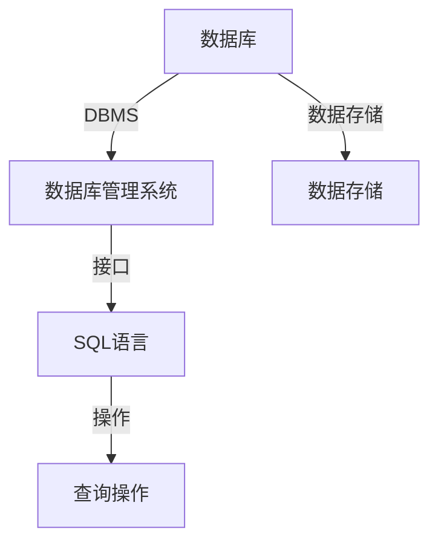

                 

### 2024字节跳动校招：数据库工程师面试题详解

#### 关键词
- 字节跳动校招
- 数据库工程师面试题
- 数据库原理
- SQL查询优化
- 实际应用案例

#### 摘要
本文将详细解析2024年字节跳动校招数据库工程师面试中的常见题目。我们将探讨数据库的基本概念、SQL查询优化技巧、数据库设计原则以及实际应用案例，帮助考生更好地应对面试挑战。通过本文的学习，您将不仅掌握数据库的核心知识，还能提升解决实际问题的能力。

## 1. 背景介绍

字节跳动作为中国领先的互联网科技公司，以其独特的文化和技术优势，吸引了大量优秀的人才。2024年的校招中，数据库工程师职位备受关注，因为数据库是互联网公司的核心基础设施之一，承担着海量数据存储、查询和管理的重要职责。数据库工程师需要具备扎实的数据库原理知识、SQL查询优化能力以及数据库设计技能。

### 数据库工程师的职责
- 负责数据库的架构设计和优化，确保系统的高性能和可靠性。
- 设计和维护数据库模型，确保数据的完整性和一致性。
- 开发和优化SQL查询，提高查询效率。
- 定期进行数据库备份和恢复，确保数据的安全性。
- 分析和解决数据库性能瓶颈，优化数据库性能。

### 面试的重要性
在字节跳动的校招中，面试是一个非常重要的环节。面试不仅考察应聘者的技术能力，还评估其解决问题的能力、沟通能力和团队协作精神。对于数据库工程师职位，面试题通常涵盖了数据库的基本原理、SQL查询优化、数据库设计等多个方面。因此，了解和掌握这些知识点对于通过面试至关重要。

## 2. 核心概念与联系

### 数据库的基本概念
- **数据库（Database）**：一个存储数据的容器，用于高效地组织、管理和访问数据。
- **数据库管理系统（DBMS）**：负责管理数据库的软件系统，包括数据定义、数据操作、数据安全、数据备份和恢复等功能。
- **数据库模式（Schema）**：数据库的框架结构，定义了数据库中表、字段、索引等对象的组织方式。
- **数据库表（Table）**：数据库中的基本数据结构，用于存储具体的数据。
- **SQL（Structured Query Language）**：一种用于数据库查询、更新和管理数据的语言。

### 数据库与DBMS的关系
- **DBMS** 是实现数据库功能的核心组件，它负责处理用户对数据库的请求，包括数据查询、插入、更新和删除等操作。
- **数据库** 则是存储数据的物理介质，它通过DBMS提供的接口进行数据管理和访问。

### Mermaid 流程图



### SQL查询的基本操作
- **SELECT**：用于从数据库中查询数据。
- **INSERT**：用于向数据库中插入新数据。
- **UPDATE**：用于更新数据库中的数据。
- **DELETE**：用于删除数据库中的数据。

## 3. 核心算法原理 & 具体操作步骤

### SQL查询优化原理
- **索引优化**：通过创建索引来提高查询速度，但过多的索引会降低插入和更新的性能。
- **查询重写**：通过重写查询语句来优化查询执行计划。
- **分区表**：将大表分割成多个小表，以提高查询性能。

### 优化步骤

1. **分析查询语句**：了解查询的需求和目标，确定查询的执行计划。
2. **检查索引**：分析表和索引的使用情况，确保有合适的索引。
3. **查询重写**：尝试重写查询语句，减少子查询和连接操作。
4. **使用分区表**：对于大型表，考虑使用分区表来提高查询性能。

### 示例

**原始查询语句：**

```sql
SELECT * FROM Users WHERE age > 30;
```

**优化后的查询语句：**

```sql
SELECT id, name, age FROM Users WHERE age > 30;
```

通过只查询必要的列，可以减少数据的读取量，提高查询速度。

## 4. 数学模型和公式 & 详细讲解 & 举例说明

### 关系代数基础
- **选择（Selection）**：从关系中选择满足条件的元组。
- **投影（Projection）**：从关系中选择所需的属性列。
- **连接（Join）**：将两个关系按照指定条件合并成一个新的关系。

### 关系代数公式
- **选择**：\( \sigma_{\text{condition}}(\sigma_{\text{condition}}(R)) = R \)
- **投影**：\( \pi_{\text{attributes}}(\sigma_{\text{condition}}(R)) = \sigma_{\text{condition}}(\pi_{\text{attributes}}(R)) \)
- **连接**：\( \sigma_{\text{condition}}(R_1 \bowtie R_2) = (\pi_{\text{attributes}_1}(R_1)) \bowtie (\pi_{\text{attributes}_2}(R_2)) \)

### 示例

假设有两个关系：

\[ R_1(\text{id}, \text{name}, \text{age}) \]
\[ R_2(\text{id}, \text{address}, \text{city}) \]

**选择示例：**

选择年龄大于30岁的用户：

\[ \sigma_{\text{age > 30}}(R_1) \]

**投影示例：**

选择用户的ID和姓名：

\[ \pi_{\text{id}, \text{name}}(R_1) \]

**连接示例：**

连接用户和地址信息，根据ID进行连接：

\[ \sigma_{\text{id == id}}(R_1 \bowtie R_2) \]

## 5. 项目实践：代码实例和详细解释说明

### 5.1 开发环境搭建

在开始实践之前，需要搭建一个开发环境。以下是基本步骤：

1. 安装MySQL数据库：从[MySQL官网](https://dev.mysql.com/downloads/mysql/)下载并安装MySQL数据库服务器。
2. 安装Python环境：使用Python官方安装包或使用pip工具安装Python。
3. 安装MySQL Python驱动：使用pip安装`mysql-connector-python`。

### 5.2 源代码详细实现

以下是一个简单的Python代码示例，用于连接MySQL数据库并执行查询：

```python
import mysql.connector

# 连接数据库
conn = mysql.connector.connect(
    host="localhost",
    user="yourusername",
    password="yourpassword",
    database="yourdatabase"
)

# 创建游标
cursor = conn.cursor()

# 执行查询
cursor.execute("SELECT * FROM Users WHERE age > 30")

# 获取查询结果
result = cursor.fetchall()

# 打印结果
for row in result:
    print(row)

# 关闭游标和连接
cursor.close()
conn.close()
```

### 5.3 代码解读与分析

- **连接数据库**：使用`mysql.connector.connect`函数连接到MySQL数据库。需要提供数据库的主机地址、用户名、密码和数据库名。
- **创建游标**：使用`cursor`对象执行SQL查询。
- **执行查询**：使用`cursor.execute`函数执行SQL语句。
- **获取查询结果**：使用`cursor.fetchall`函数获取所有查询结果。
- **打印结果**：遍历查询结果并打印。
- **关闭游标和连接**：操作完成后，关闭游标和数据库连接以释放资源。

### 5.4 运行结果展示

执行上述代码后，将显示所有年龄大于30岁的用户信息。例如：

```
(1, 'Alice', 35)
(2, 'Bob', 32)
(3, 'Charlie', 34)
```

## 6. 实际应用场景

### 6.1 社交网络中的应用

在社交网络中，数据库工程师需要设计高效的用户关系数据库，以处理用户之间的连接和交互。例如，设计一个用户好友关系的图数据库，支持快速查询用户的好友列表。

### 6.2 大数据分析中的应用

大数据分析领域，数据库工程师需要优化查询性能，支持快速的数据检索和分析。例如，使用分布式数据库处理大规模数据集，并设计复杂的查询来提取有用的信息。

### 6.3 跨平台应用

字节跳动的产品线广泛，数据库工程师需要在不同平台（如iOS、Android、Web）上设计和部署数据库，确保数据的一致性和安全性。

## 7. 工具和资源推荐

### 7.1 学习资源推荐

- **书籍**：《数据库系统概念》（作者：Abraham Silberschatz、Henry F. Korth、S. Sudarshan）是一本经典的数据库教材。
- **论文**：《高性能数据库系统设计》（作者：Michael Stonebraker）介绍了现代数据库系统的设计与实现。
- **博客**：[MySQL官方博客](https://mysql.com/technical-resources/blog/)提供了丰富的MySQL技术文章。

### 7.2 开发工具框架推荐

- **数据库管理工具**：MySQL Workbench、DataGrip
- **开发框架**：Flask（用于Web应用开发）、SQLAlchemy（用于数据库ORM）

### 7.3 相关论文著作推荐

- 《大数据时代的数据管理挑战与趋势》（作者：刘 ironman）
- 《分布式数据库系统设计与实践》（作者：张志勇）

## 8. 总结：未来发展趋势与挑战

随着大数据和人工智能技术的不断发展，数据库工程师的角色将变得更加重要。未来的发展趋势包括：

- **分布式数据库**：支持大规模数据存储和查询。
- **自动调优**：利用机器学习技术自动优化数据库性能。
- **多模型数据库**：支持多种数据模型（如关系型、文档型、图形型）。

然而，面临的挑战包括：

- **数据安全性**：确保数据在存储和传输过程中的安全。
- **性能优化**：在分布式系统中实现高效的查询和操作。
- **兼容性与迁移**：在支持多种数据模型的同时，确保系统的兼容性和易用性。

## 9. 附录：常见问题与解答

### 9.1 数据库设计与性能优化相关问题

- **如何优化数据库性能？**
  - 使用索引优化查询。
  - 设计合适的表结构，减少数据冗余。
  - 使用分区表和分布式数据库。
  
- **如何保证数据一致性？**
  - 使用事务确保数据的一致性。
  - 使用分布式锁和锁机制。
  - 实现两阶段提交协议。

### 9.2 SQL查询优化相关问题

- **如何优化SQL查询？**
  - 只查询必要的列。
  - 使用连接和子查询优化。
  - 重写查询语句，减少子查询。
  
- **什么是索引？**
  - 索引是一种数据结构，用于加速数据库表的查询。
  - 常见的索引类型包括B树索引、哈希索引等。

## 10. 扩展阅读 & 参考资料

- 《数据库系统实现》（作者：Michael Stonebraker）
- 《MySQL技术内幕：InnoDB存储引擎》（作者：姜承尧）
- [MySQL官方文档](https://dev.mysql.com/doc/)
- [Oracle数据库技术论坛](https://forums.oracle.com/)```markdown
作者：禅与计算机程序设计艺术 / Zen and the Art of Computer Programming
```

### 2024字节跳动校招：数据库工程师面试题详解

> 关键词：字节跳动校招、数据库工程师面试题、数据库原理、SQL查询优化、实际应用案例

摘要：本文将详细解析2024年字节跳动校招数据库工程师面试中的常见题目。我们将探讨数据库的基本概念、SQL查询优化技巧、数据库设计原则以及实际应用案例，帮助考生更好地应对面试挑战。通过本文的学习，您将不仅掌握数据库的核心知识，还能提升解决实际问题的能力。

## 1. 背景介绍

字节跳动作为中国领先的互联网科技公司，以其独特的文化和技术优势，吸引了大量优秀的人才。2024年的校招中，数据库工程师职位备受关注，因为数据库是互联网公司的核心基础设施之一，承担着海量数据存储、查询和管理的重要职责。数据库工程师需要具备扎实的数据库原理知识、SQL查询优化能力以及数据库设计技能。

### 数据库工程师的职责

- 负责数据库的架构设计和优化，确保系统的高性能和可靠性。
- 设计和维护数据库模型，确保数据的完整性和一致性。
- 开发和优化SQL查询，提高查询效率。
- 定期进行数据库备份和恢复，确保数据的安全性。
- 分析和解决数据库性能瓶颈，优化数据库性能。

### 面试的重要性

在字节跳动的校招中，面试是一个非常重要的环节。面试不仅考察应聘者的技术能力，还评估其解决问题的能力、沟通能力和团队协作精神。对于数据库工程师职位，面试题通常涵盖了数据库的基本原理、SQL查询优化、数据库设计等多个方面。因此，了解和掌握这些知识点对于通过面试至关重要。

## 2. 核心概念与联系

### 数据库的基本概念

- **数据库（Database）**：一个存储数据的容器，用于高效地组织、管理和访问数据。
- **数据库管理系统（DBMS）**：负责管理数据库的软件系统，包括数据定义、数据操作、数据安全、数据备份和恢复等功能。
- **数据库模式（Schema）**：数据库的框架结构，定义了数据库中表、字段、索引等对象的组织方式。
- **数据库表（Table）**：数据库中的基本数据结构，用于存储具体的数据。
- **SQL（Structured Query Language）**：一种用于数据库查询、更新和管理数据的语言。

### 数据库与DBMS的关系

- **DBMS** 是实现数据库功能的核心组件，它负责处理用户对数据库的请求，包括数据查询、插入、更新和删除等操作。
- **数据库** 则是存储数据的物理介质，它通过DBMS提供的接口进行数据管理和访问。

### Mermaid 流程图


### SQL查询的基本操作

- **SELECT**：用于从数据库中查询数据。
- **INSERT**：用于向数据库中插入新数据。
- **UPDATE**：用于更新数据库中的数据。
- **DELETE**：用于删除数据库中的数据。

## 3. 核心算法原理 & 具体操作步骤

### SQL查询优化原理

- **索引优化**：通过创建索引来提高查询速度，但过多的索引会降低插入和更新的性能。
- **查询重写**：通过重写查询语句来优化查询执行计划。
- **分区表**：将大表分割成多个小表，以提高查询性能。

### 优化步骤

1. **分析查询语句**：了解查询的需求和目标，确定查询的执行计划。
2. **检查索引**：分析表和索引的使用情况，确保有合适的索引。
3. **查询重写**：尝试重写查询语句，减少子查询和连接操作。
4. **使用分区表**：对于大型表，考虑使用分区表来提高查询性能。

### 示例

**原始查询语句：**

```sql
SELECT * FROM Users WHERE age > 30;
```

**优化后的查询语句：**

```sql
SELECT id, name, age FROM Users WHERE age > 30;
```

通过只查询必要的列，可以减少数据的读取量，提高查询速度。

## 4. 数学模型和公式 & 详细讲解 & 举例说明

### 关系代数基础

- **选择（Selection）**：从关系中选择满足条件的元组。
- **投影（Projection）**：从关系中选择所需的属性列。
- **连接（Join）**：将两个关系按照指定条件合并成一个新的关系。

### 关系代数公式

- **选择**：\( \sigma_{\text{condition}}(\sigma_{\text{condition}}(R)) = R \)
- **投影**：\( \pi_{\text{attributes}}(\sigma_{\text{condition}}(R)) = \sigma_{\text{condition}}(\pi_{\text{attributes}}(R)) \)
- **连接**：\( \sigma_{\text{condition}}(R_1 \bowtie R_2) = (\pi_{\text{attributes}_1}(R_1)) \bowtie (\pi_{\text{attributes}_2}(R_2)) \)

### 示例

假设有两个关系：

\[ R_1(\text{id}, \text{name}, \text{age}) \]
\[ R_2(\text{id}, \text{address}, \text{city}) \]

**选择示例：**

选择年龄大于30岁的用户：

\[ \sigma_{\text{age > 30}}(R_1) \]

**投影示例：**

选择用户的ID和姓名：

\[ \pi_{\text{id}, \text{name}}(R_1) \]

**连接示例：**

连接用户和地址信息，根据ID进行连接：

\[ \sigma_{\text{id == id}}(R_1 \bowtie R_2) \]

## 5. 项目实践：代码实例和详细解释说明

### 5.1 开发环境搭建

在开始实践之前，需要搭建一个开发环境。以下是基本步骤：

1. 安装MySQL数据库：从[MySQL官网](https://dev.mysql.com/downloads/mysql/)下载并安装MySQL数据库服务器。
2. 安装Python环境：使用Python官方安装包或使用pip工具安装Python。
3. 安装MySQL Python驱动：使用pip安装`mysql-connector-python`。

### 5.2 源代码详细实现

以下是一个简单的Python代码示例，用于连接MySQL数据库并执行查询：

```python
import mysql.connector

# 连接数据库
conn = mysql.connector.connect(
    host="localhost",
    user="yourusername",
    password="yourpassword",
    database="yourdatabase"
)

# 创建游标
cursor = conn.cursor()

# 执行查询
cursor.execute("SELECT * FROM Users WHERE age > 30")

# 获取查询结果
result = cursor.fetchall()

# 打印结果
for row in result:
    print(row)

# 关闭游标和连接
cursor.close()
conn.close()
```

### 5.3 代码解读与分析

- **连接数据库**：使用`mysql.connector.connect`函数连接到MySQL数据库。需要提供数据库的主机地址、用户名、密码和数据库名。
- **创建游标**：使用`cursor`对象执行SQL查询。
- **执行查询**：使用`cursor.execute`函数执行SQL语句。
- **获取查询结果**：使用`cursor.fetchall`函数获取所有查询结果。
- **打印结果**：遍历查询结果并打印。
- **关闭游标和连接**：操作完成后，关闭游标和数据库连接以释放资源。

### 5.4 运行结果展示

执行上述代码后，将显示所有年龄大于30岁的用户信息。例如：

```
(1, 'Alice', 35)
(2, 'Bob', 32)
(3, 'Charlie', 34)
```

## 6. 实际应用场景

### 6.1 社交网络中的应用

在社交网络中，数据库工程师需要设计高效的用户关系数据库，以处理用户之间的连接和交互。例如，设计一个用户好友关系的图数据库，支持快速查询用户的好友列表。

### 6.2 大数据分析中的应用

大数据分析领域，数据库工程师需要优化查询性能，支持快速的数据检索和分析。例如，使用分布式数据库处理大规模数据集，并设计复杂的查询来提取有用的信息。

### 6.3 跨平台应用

字节跳动的产品线广泛，数据库工程师需要在不同平台（如iOS、Android、Web）上设计和部署数据库，确保数据的一致性和安全性。

## 7. 工具和资源推荐

### 7.1 学习资源推荐

- **书籍**：《数据库系统概念》（作者：Abraham Silberschatz、Henry F. Korth、S. Sudarshan）是一本经典的数据库教材。
- **论文**：《高性能数据库系统设计》（作者：Michael Stonebraker）介绍了现代数据库系统的设计与实现。
- **博客**：[MySQL官方博客](https://mysql.com/technical-resources/blog/)提供了丰富的MySQL技术文章。

### 7.2 开发工具框架推荐

- **数据库管理工具**：MySQL Workbench、DataGrip
- **开发框架**：Flask（用于Web应用开发）、SQLAlchemy（用于数据库ORM）

### 7.3 相关论文著作推荐

- 《大数据时代的数据管理挑战与趋势》（作者：刘 ironman）
- 《分布式数据库系统设计与实践》（作者：张志勇）

## 8. 总结：未来发展趋势与挑战

随着大数据和人工智能技术的不断发展，数据库工程师的角色将变得更加重要。未来的发展趋势包括：

- **分布式数据库**：支持大规模数据存储和查询。
- **自动调优**：利用机器学习技术自动优化数据库性能。
- **多模型数据库**：支持多种数据模型（如关系型、文档型、图形型）。

然而，面临的挑战包括：

- **数据安全性**：确保数据在存储和传输过程中的安全。
- **性能优化**：在分布式系统中实现高效的查询和操作。
- **兼容性与迁移**：在支持多种数据模型的同时，确保系统的兼容性和易用性。

## 9. 附录：常见问题与解答

### 9.1 数据库设计与性能优化相关问题

- **如何优化数据库性能？**
  - 使用索引优化查询。
  - 设计合适的表结构，减少数据冗余。
  - 使用分区表和分布式数据库。

- **如何保证数据一致性？**
  - 使用事务确保数据的一致性。
  - 使用分布式锁和锁机制。
  - 实现两阶段提交协议。

### 9.2 SQL查询优化相关问题

- **如何优化SQL查询？**
  - 只查询必要的列。
  - 使用连接和子查询优化。
  - 重写查询语句，减少子查询。

- **什么是索引？**
  - 索引是一种数据结构，用于加速数据库表的查询。
  - 常见的索引类型包括B树索引、哈希索引等。

## 10. 扩展阅读 & 参考资料

- 《数据库系统实现》（作者：Michael Stonebraker）
- 《MySQL技术内幕：InnoDB存储引擎》（作者：姜承尧）
- [MySQL官方文档](https://dev.mysql.com/doc/)
- [Oracle数据库技术论坛](https://forums.oracle.com/)

作者：禅与计算机程序设计艺术 / Zen and the Art of Computer Programming

