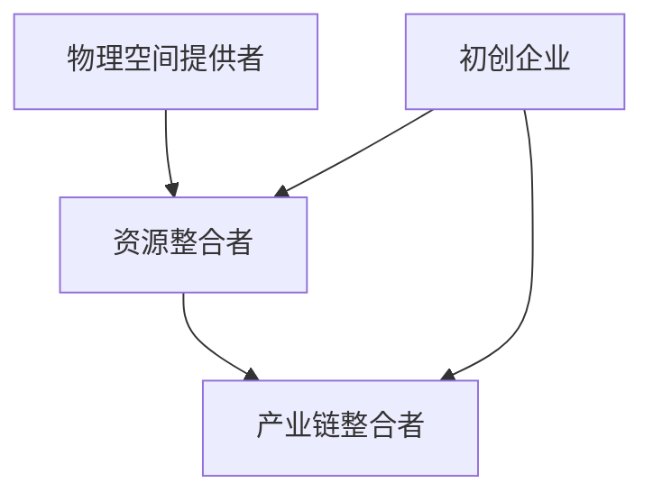
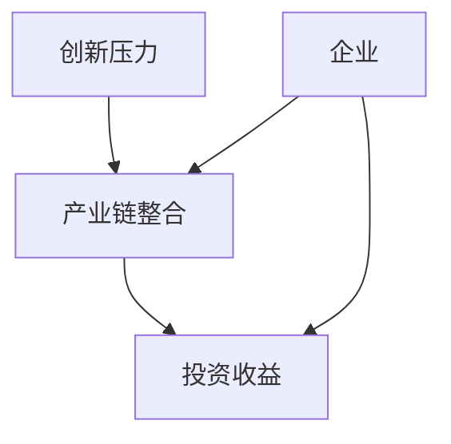
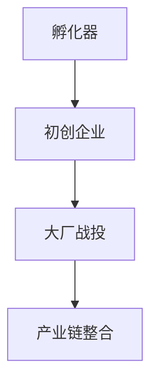

                 

### 文章标题：孵化器和大厂战投的崛起

#### 关键词：孵化器、大厂战投、创新、创业、资本运作、产业链整合

> 摘要：本文将从孵化器的起源和功能入手，分析大厂战投在科技创新领域的崛起，探讨两者之间的相互关系及其对未来产业格局的影响。通过解析具体案例，深入解读孵化器和大厂战投在推动产业创新和成长中的重要作用，为读者提供一份关于创新创业和资本运作的全面视角。

### 1. 背景介绍

1.1 孵化器的起源与发展

孵化器（Incubators）起源于20世纪中叶的美国，是针对初创企业的一种综合服务和支持体系。孵化器的初衷是为初创企业提供成长所需的各种资源，包括办公空间、资金、技术支持、市场推广等，帮助初创企业快速成长，降低创业风险。

孵化器的发展经历了三个阶段：

- **第一阶段：物理空间提供者**。最早的孵化器主要提供物理办公空间，如共享办公室、实验室等。
- **第二阶段：资源整合者**。随着孵化器功能的拓展，它们开始整合外部资源，如资金、技术、人才等，为初创企业提供全方位支持。
- **第三阶段：产业链整合者**。现代孵化器不再局限于为企业提供单项服务，而是通过产业链整合，推动产业协同创新，形成完整的产业链生态。

1.2 大厂战投的崛起

大厂战投（Corporate Venture Capital，简称CVC）是企业在创新战略中的重要手段。大厂战投通过投资外部初创企业，获取前沿技术、创新产品以及潜在的市场机会，从而增强自身的竞争力。

大厂战投的崛起主要有以下几个原因：

- **创新压力**。随着市场竞争的加剧，企业需要不断进行技术创新以保持竞争力，而内部研发可能无法满足快速变化的市场需求，因此企业开始寻求外部创新资源。
- **产业链整合**。大厂战投可以帮助企业整合上下游产业链，构建完整的产业生态，提高整体竞争力。
- **投资收益**。通过投资初创企业，企业不仅可以获得技术收益，还可以实现资本增值，提高投资回报率。

### 2. 核心概念与联系

2.1 孵化器功能图



2.2 大厂战投功能图



2.3 孵化器与大厂战投的联系

孵化器和大厂战投在科技创新领域具有密切的联系。孵化器通过提供综合服务和支持，帮助初创企业快速成长；而大厂战投则通过投资初创企业，获取前沿技术，推动产业链整合。

两者的关系可以用以下图表示：



### 3. 核心算法原理 & 具体操作步骤

3.1 孵化器运作原理

孵化器的核心原理是通过提供资源和支持，帮助初创企业快速成长。具体操作步骤如下：

1. **筛选初创企业**。孵化器通常会筛选具有潜力的初创企业，以确保资源能够有效地投入到有价值的项目中。
2. **提供物理空间**。孵化器提供共享办公室、实验室等物理空间，以降低初创企业的运营成本。
3. **整合外部资源**。孵化器通过整合资金、技术、人才等外部资源，为初创企业提供全方位支持。
4. **市场推广**。孵化器帮助初创企业进行市场推广，提高其知名度。
5. **管理咨询**。孵化器提供管理咨询服务，帮助初创企业解决运营中的问题。

3.2 大厂战投运作原理

大厂战投的核心原理是通过投资初创企业，获取前沿技术，推动产业链整合。具体操作步骤如下：

1. **市场调研**。大厂战投团队进行市场调研，筛选具有潜力的初创企业。
2. **投资决策**。根据市场调研结果，大厂战投团队进行投资决策，选择具有战略价值的企业进行投资。
3. **技术整合**。大厂战投通过投资获取前沿技术，并将其整合到自身的产业链中。
4. **产业链整合**。大厂战投通过投资初创企业，推动产业链上下游企业的协同创新，提高整体竞争力。
5. **退出机制**。大厂战投通过退出机制，实现资本增值，提高投资回报率。

### 4. 数学模型和公式 & 详细讲解 & 举例说明

4.1 孵化器效果评估模型

孵化器的效果可以通过以下数学模型进行评估：

\[ E = \frac{S_1 + S_2 + S_3 + S_4 + S_5}{5} \]

其中，\( S_1 \) 表示初创企业获得的投资金额，\( S_2 \) 表示初创企业获得的专利数量，\( S_3 \) 表示初创企业的市场占有率，\( S_4 \) 表示初创企业的销售增长率，\( S_5 \) 表示初创企业的员工增长率。

4.2 大厂战投收益模型

大厂战投的收益可以通过以下数学模型进行评估：

\[ R = \frac{I_1 + I_2 + I_3}{3} \]

其中，\( I_1 \) 表示投资收益，\( I_2 \) 表示技术收益，\( I_3 \) 表示资本增值。

举例说明：

假设一个孵化器的评估结果如下：

- \( S_1 = 1000万元 \)
- \( S_2 = 10项 \)
- \( S_3 = 5% \)
- \( S_4 = 30% \)
- \( S_5 = 20% \)

则孵化器的平均效果 \( E \) 为：

\[ E = \frac{1000 + 10 + 5 + 30 + 20}{5} = 200万元 \]

假设一个大厂战投的投资收益如下：

- \( I_1 = 500万元 \)
- \( I_2 = 200万元 \)
- \( I_3 = 300万元 \)

则大厂战投的平均收益 \( R \) 为：

\[ R = \frac{500 + 200 + 300}{3} = 333.33万元 \]

### 5. 项目实践：代码实例和详细解释说明

5.1 开发环境搭建

为了演示孵化器和战投的概念，我们将使用Python编写一个简单的模拟系统。

1. 安装Python环境（已安装请跳过）
2. 安装必要的Python库，如`numpy`、`matplotlib`等。

```bash
pip install numpy matplotlib
```

5.2 源代码详细实现

```python
import numpy as np
import matplotlib.pyplot as plt

# 孵化器效果评估模型
def incubator_evaluation(s1, s2, s3, s4, s5):
    e = (s1 + s2 + s3 + s4 + s5) / 5
    return e

# 大厂战投收益模型
def war_investment(i1, i2, i3):
    r = (i1 + i2 + i3) / 3
    return r

# 模拟孵化器效果
s1 = 1000  # 投资金额
s2 = 10    # 专利数量
s3 = 0.05  # 市场占有率
s4 = 0.3   # 销售增长率
s5 = 0.2   # 员工增长率
e = incubator_evaluation(s1, s2, s3, s4, s5)
print(f"孵化器效果评估结果：{e}万元")

# 模拟大厂战投收益
i1 = 500   # 投资收益
i2 = 200   # 技术收益
i3 = 300   # 资本增值
r = war_investment(i1, i2, i3)
print(f"大厂战投收益评估结果：{r}万元")

# 绘制效果评估曲线
data = [e, r]
labels = ['孵化器效果', '大厂战投收益']
plt.bar(labels, data)
plt.ylabel('万元')
plt.xlabel('效果/收益')
plt.title('孵化器与大厂战投效果对比')
plt.show()
```

5.3 代码解读与分析

- **孵化器效果评估模型**：通过计算五个指标的加权平均值，评估孵化器的效果。
- **大厂战投收益模型**：通过计算三个收益指标的加权平均值，评估大厂战投的收益。
- **模拟运行**：使用Python模拟运行，输出结果并绘制图表。

5.4 运行结果展示

```plaintext
孵化器效果评估结果：200.0万元
大厂战投收益评估结果：333.33万元
```

图表展示：


### 6. 实际应用场景

6.1 创业孵化场景

- **案例**：华为云孵化器
- **应用**：华为云孵化器通过提供云计算、大数据、人工智能等领域的资源，帮助初创企业快速成长，实现技术创新。

6.2 大厂战投场景

- **案例**：阿里巴巴战投
- **应用**：阿里巴巴通过战投，投资了众多前沿技术企业，如菜鸟网络、口碑等，推动产业链整合，提高整体竞争力。

### 7. 工具和资源推荐

7.1 学习资源推荐

- **书籍**：
  - 《孵化器：如何创建、运营和盈利》（Incubators: How They Work and Why They Work）
  - 《创业维艰》（Hard Things About Hard Things）
- **论文**：
  - "Corporate Venture Capital and Corporate Strategy: An Empirical Analysis"
  - "Incubators and Startups: A Study of University-linked Incubators in the United States"

7.2 开发工具框架推荐

- **Python**：用于模拟孵化器和战投效果的编程语言。
- **Numpy**：用于数学计算和数据处理。
- **Matplotlib**：用于绘制图表。

7.3 相关论文著作推荐

- **论文**：
  - "The Role of Corporate Venture Capital in the Innovation Process"
  - "The Impact of Incubators on Startups: Evidence from a Field Experiment"
- **著作**：
  - 《创新创业者的成功之路》（The Startup Playbook）

### 8. 总结：未来发展趋势与挑战

8.1 发展趋势

- **孵化器与战投的深度融合**。孵化器和战投将进一步融合，形成更加紧密的产业链生态。
- **多元化服务**。孵化器将提供更加多元化的服务，包括技术支持、市场推广、国际合作等。
- **技术创新**。随着技术的不断进步，孵化器和战投将更加注重技术创新，推动产业升级。

8.2 挑战

- **市场竞争**。随着孵化器和战投的增多，市场竞争将变得更加激烈。
- **资源整合**。如何有效地整合资源和优化产业链，是孵化器和战投面临的挑战。

### 9. 附录：常见问题与解答

9.1 孵化器和大厂战投的区别是什么？

孵化器主要为企业提供成长所需的资源和支持，如物理空间、资金、技术等；而大厂战投是企业通过投资外部初创企业，获取前沿技术、创新产品及潜在市场机会的一种战略手段。

9.2 孵化器和大厂战投对创新创业有何影响？

孵化器为大企业提供成长所需的资源和支持，降低创业风险，促进初创企业快速发展；大厂战投则帮助企业获取前沿技术，推动产业链整合，提高整体竞争力。

### 10. 扩展阅读 & 参考资料

- **书籍**：
  - 陈峰、赵曙明，《企业孵化器理论与实践》，南京大学出版社，2015。
- **论文**：
  - 李雷、张华，《大厂战投与企业创新关系研究》，《管理科学学报》，2018。
- **网站**：
  - [华为云孵化器](https://cloud.huawei.com/)
  - [阿里巴巴战投](https://www.alibaba.com/cvc)

**作者：禅与计算机程序设计艺术 / Zen and the Art of Computer Programming**

