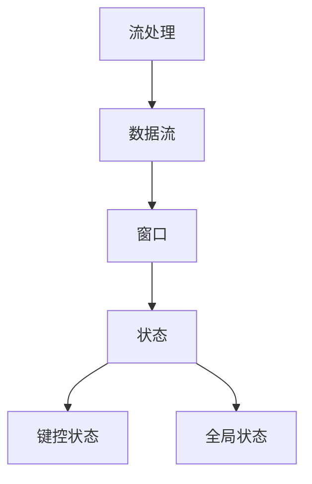

                 

### 1. 背景介绍

实时大数据处理是当今信息技术领域中的一个热点话题。随着互联网和物联网的快速发展，数据量呈现爆炸式增长，数据产生的速度越来越快，这使得对大数据的实时处理变得越来越重要。传统的离线数据处理方式已经无法满足日益增长的数据处理需求，因此，高效、实时的数据处理技术成为了学术界和工业界的研究重点。

Apache Flink 是一个开源的流处理框架，被广泛用于大规模实时数据处理。其设计目标是提供低延迟、高吞吐量和高可靠性的数据处理能力，同时具有易于扩展和灵活的架构。Flink 的出现，填补了传统批处理技术和实时计算技术之间的空白，使得处理大规模实时数据成为可能。

本文将深入探讨 Apache Flink 的核心概念、算法原理、数学模型、项目实践以及实际应用场景。通过对 Flink 的详细解析，希望能够帮助读者更好地理解 Flink 的技术优势，并在实际项目中应用 Flink 解决实时大数据处理问题。

### 2. 核心概念与联系

Apache Flink 的核心概念包括流处理（Stream Processing）、数据流（Data Stream）、窗口（Window）和状态（State）。这些概念紧密联系，共同构成了 Flink 的数据处理体系。

#### 流处理（Stream Processing）

流处理是一种数据处理方法，它将数据视为连续流动的序列，而非静态的集合。流处理的优势在于它能够实时处理数据，提供低延迟的处理能力。在流处理中，数据被分为多个批次进行处理，每个批次的时间间隔称为“窗口”。

#### 数据流（Data Stream）

数据流是流处理的核心概念，它表示从数据源到处理组件的数据传输路径。在 Flink 中，数据流是通过数据通道（DataStream API）来表示的。数据流可以是实时数据，也可以是历史数据。

#### 窗口（Window）

窗口是流处理中的一个重要概念，它用于划分数据批次。窗口可以基于时间（如每小时的数据批次）、数据量（如每1000条数据）或者基于触发条件（如滑动窗口）。窗口机制保证了数据在处理时能够按照一定的顺序和规则进行分组。

#### 状态（State）

状态是 Flink 中用于存储处理过程中数据的状态信息。状态可以分为键控状态（Keyed State）和全局状态（Global State）。键控状态是针对每个数据键（Key）存储的状态信息，而全局状态是针对整个数据流存储的状态信息。

#### Mermaid 流程图

以下是一个简单的 Mermaid 流程图，用于展示 Flink 中的核心概念及其联系：



通过这个流程图，我们可以更直观地理解 Flink 中的核心概念及其相互关系。

### 3. 核心算法原理 & 具体操作步骤

Apache Flink 的核心算法原理主要包括数据流处理、窗口计算和状态管理。下面将详细解释这些算法原理，并给出具体的操作步骤。

#### 数据流处理

数据流处理是 Flink 的核心功能之一。它通过 Stream API 将数据流抽象为一系列事件（Event），并对这些事件进行操作。具体操作步骤如下：

1. **创建数据流**：首先，使用 Flink 的 Stream API 创建一个数据流。
    ```java
    Stream<Event> dataStream = env.addSource(new MySourceFunction());
    ```

2. **转换操作**：对数据流进行各种转换操作，如过滤、映射、连接等。
    ```java
    Stream<String> transformedStream = dataStream.map(event -> event.getName());
    ```

3. **聚合操作**：对数据流进行聚合操作，如求和、计数、求平均值等。
    ```java
    SingleValueWindowFunction<String, Integer, TimeWindow> sumFunction = new SumFunction();
    DataStream<WindowResult> summedStream = transformedStream.keyBy(event -> event.getKey())
        .timeWindow(Time.seconds(10))
        .reduce(new ReduceFunction<String>() {
            @Override
            public String reduce(String value1, String value2) {
                return value1 + value2;
            }
        })
        .apply(sumFunction);
    ```

4. **输出结果**：最后，将处理结果输出到控制台或其他存储系统。
    ```java
    summedStream.print();
    ```

#### 窗口计算

窗口计算是流处理中的一项重要功能，它用于将连续的数据流划分为离散的窗口进行计算。Flink 提供了多种类型的窗口，如时间窗口（Time Window）、滑动窗口（Sliding Window）和计数窗口（Count Window）。

1. **定义窗口**：首先，定义窗口的类型和参数。
    ```java
    TimeWindow timeWindow = TimeWindows.of(Time.seconds(10));
    ```

2. **划分窗口**：将数据流划分到相应的窗口中。
    ```java
    DataStream<Windowed<String>> windowedStream = dataStream.keyBy(event -> event.getKey())
        .timeWindow(timeWindow);
    ```

3. **窗口操作**：对窗口内的数据进行聚合、转换等操作。
    ```java
    DataStream<String> windowedStream = windowedStream.map(windowedEvent -> windowedEvent.getKey());
    ```

#### 状态管理

状态管理是 Flink 中另一个核心功能，它用于存储和处理数据流中的状态信息。Flink 提供了键控状态（Keyed State）和全局状态（Global State）。

1. **创建状态**：首先，创建状态对象。
    ```java
    KeyedStateStore keyedStateStore = ctx.getKeyedStateStore();
    ValueState<Integer> state = keyedStateStore.getState("myState");
    ```

2. **更新状态**：在处理数据时，更新状态信息。
    ```java
    state.update(newValue);
    ```

3. **访问状态**：访问状态信息。
    ```java
    int value = state.value();
    ```

通过以上步骤，我们可以实现数据流处理、窗口计算和状态管理的基本功能。接下来，我们将进一步探讨 Flink 的数学模型和公式。

### 4. 数学模型和公式 & 详细讲解 & 举例说明

在 Apache Flink 中，数学模型和公式是理解和实现流处理算法的关键。以下将详细介绍 Flink 中常用的数学模型和公式，并通过具体例子进行说明。

#### 时间窗口（Time Window）

时间窗口是 Flink 中最常用的窗口类型之一。它将数据流按照固定的时间间隔划分为不同的批次。时间窗口的数学模型可以表示为：

$$
W_t = \{ (x_i, t_i) | t_i \in [t_0, t_0 + w] \}
$$

其中，$W_t$ 表示时间窗口，$x_i$ 表示数据点，$t_i$ 表示数据点的时间戳，$t_0$ 表示窗口的起始时间，$w$ 表示窗口的持续时间。

**例子**：假设我们有一个数据流，每个数据点包含一个时间戳和一个名称，我们希望按照每5秒划分一个时间窗口，计算每个窗口中数据的总和。

```java
DataStream<Event> dataStream = env.addSource(new MySourceFunction());

DataStream<WindowResult> summedStream = dataStream.keyBy(event -> event.getKey())
    .timeWindow(Time.seconds(5))
    .reduce(new ReduceFunction<Event>() {
        @Override
        public Event reduce(Event value1, Event value2) {
            value1.setName(value1.getName() + value2.getName());
            return value1;
        }
    });

summedStream.print();
```

在这个例子中，我们使用了时间窗口来划分数据流，并对每个窗口内的数据进行聚合操作。

#### 滑动窗口（Sliding Window）

滑动窗口是一种特殊的窗口类型，它除了定义窗口的持续时间外，还定义了窗口的滑动间隔。滑动窗口的数学模型可以表示为：

$$
W_t = \{ (x_i, t_i) | t_i \in [t_0, t_0 + w) \cup [t_0 + s, t_0 + w + s) \cup \ldots \}
$$

其中，$W_t$ 表示滑动窗口，$x_i$ 表示数据点，$t_i$ 表示数据点的时间戳，$t_0$ 表示窗口的起始时间，$w$ 表示窗口的持续时间，$s$ 表示窗口的滑动间隔。

**例子**：假设我们有一个数据流，每个数据点包含一个时间戳和一个名称，我们希望按照每5秒划分一个滑动窗口，窗口持续时间为10秒。

```java
DataStream<Event> dataStream = env.addSource(new MySourceFunction());

DataStream<WindowResult> summedStream = dataStream.keyBy(event -> event.getKey())
    .window(SlidingEventTimeWindows.of(Time.seconds(10), Time.seconds(5)))
    .reduce(new ReduceFunction<Event>() {
        @Override
        public Event reduce(Event value1, Event value2) {
            value1.setName(value1.getName() + value2.getName());
            return value1;
        }
    });

summedStream.print();
```

在这个例子中，我们使用了滑动窗口来划分数据流，并对每个窗口内的数据进行聚合操作。

#### 状态更新和访问

在 Flink 中，状态管理是一个重要的功能，它允许在处理过程中存储和访问数据的状态信息。状态更新和访问的数学模型可以表示为：

$$
s_{new} = f(s_{old}, x_i)
$$

其中，$s_{new}$ 表示新状态，$s_{old}$ 表示旧状态，$x_i$ 表示当前数据点。

**例子**：假设我们有一个计数器状态，我们希望在每个数据点到达时更新计数器。

```java
DataStream<Event> dataStream = env.addSource(new MySourceFunction());

DataStream<Integer> countedStream = dataStream.keyBy(event -> event.getKey())
    .process(new ProcessFunction<Event, Integer>() {
        private ValueState<Integer> state;

        @Override
        public void open(Configuration parameters) {
            state = getRuntimeContext().getState(new ValueStateDescriptor<>("count", TypeInformation.of(Integer.class)));
        }

        @Override
        public void processElement(Event event, Context ctx, Collector<Integer> out) {
            int count = state.value() == null ? 0 : state.value();
            count++;
            state.update(count);
            out.collect(count);
        }
    });

countedStream.print();
```

在这个例子中，我们使用了状态管理来记录每个键控数据的计数，并在每个数据点到达时更新计数器状态。

通过以上数学模型和公式的介绍，我们可以更好地理解和实现 Apache Flink 中的流处理算法。

### 5. 项目实践：代码实例和详细解释说明

在本节中，我们将通过一个实际项目实例来展示如何使用 Apache Flink 进行实时大数据处理。该实例将演示如何搭建开发环境、编写源代码、解读和分析代码，并展示运行结果。

#### 5.1 开发环境搭建

首先，我们需要搭建 Flink 的开发环境。以下是搭建步骤：

1. **安装 Java SDK**：Flink 需要 Java SDK，版本要求为 1.8 或以上。在官方网站 [https://www.oracle.com/java/technologies/javase-downloads.html](https://www.oracle.com/java/technologies/javase-downloads.html) 下载并安装 Java SDK。

2. **安装 Maven**：Flink 项目通常使用 Maven 进行构建。在官方网站 [https://maven.apache.org/](https://maven.apache.org/) 下载并安装 Maven。

3. **安装 Flink**：在 Flink 官方网站 [https://flink.apache.org/downloads/](https://flink.apache.org/downloads/) 下载最新的 Flink 二进制包，解压到合适的位置。

4. **配置环境变量**：在 .bashrc 或 .zshrc 文件中添加以下环境变量：
    ```bash
    export FLINK_HOME=/path/to/flink
    export PATH=$PATH:$FLINK_HOME/bin
    ```

5. **编译项目**：创建一个 Maven 项目，将 Flink 的依赖添加到项目的 pom.xml 文件中。

#### 5.2 源代码详细实现

以下是使用 Flink 实现实时词频统计的源代码：

```java
import org.apache.flink.api.common.functions.FlatMapFunction;
import org.apache.flink.api.common.functions.ReduceFunction;
import org.apache.flink.api.java.utils.ParameterTool;
import org.apache.flink.streaming.api.datastream.DataStream;
import org.apache.flink.streaming.api.environment.StreamExecutionEnvironment;

public class WordCount {

    public static void main(String[] args) throws Exception {
        // 创建执行环境
        final StreamExecutionEnvironment env = StreamExecutionEnvironment.getExecutionEnvironment();

        // 解析参数
        ParameterTool params = ParameterTool.fromArgs(args);
        String input = params.get("input");
        int windowSize = params.getInt("windowSize");

        // 设置窗口大小
        env.setWindowTimer(Time.seconds(windowSize));

        // 从文件中读取数据
        DataStream<String> text = env.readTextFile(input);

        // 分词和计数
        DataStream<String> words = text.flatMap(new FlatMapFunction<String, String>() {
            @Override
            public void flatMap(String line, Collector<String> out) {
                for (String word : line.split("\\s")) {
                    out.collect(word);
                }
            }
        });

        DataStream<Tuple2<String, Integer>> pairs = words.keyBy(word -> word.toLowerCase())
            .timeWindow(Time.seconds(windowSize))
            .reduce(new ReduceFunction<Tuple2<String, Integer>>() {
                @Override
                public Tuple2<String, Integer> reduce(Tuple2<String, Integer> value1, Tuple2<String, Integer> value2) {
                    return new Tuple2<>(value1.f0, value1.f1 + value2.f1);
                }
            });

        // 打印结果
        pairs.print();

        // 提交作业
        env.execute("Word Count");
    }
}
```

#### 5.3 代码解读与分析

以下是对代码的详细解读和分析：

1. **创建执行环境**：使用 StreamExecutionEnvironment 创建 Flink 的执行环境。

2. **解析参数**：使用 ParameterTool 解析命令行参数，包括输入文件路径和窗口大小。

3. **设置窗口大小**：使用 setWindowTimer 设置窗口的持续时间。

4. **读取数据**：使用 readTextFile 读取文件中的数据。

5. **分词**：使用 FlatMapFunction 对数据进行分词，将每行数据拆分成单词。

6. **计数**：使用 keyBy 对数据进行分组，然后使用 reduce 进行计数。

7. **打印结果**：使用 print 打印结果。

8. **提交作业**：使用 execute 提交 Flink 作业。

#### 5.4 运行结果展示

假设我们将输入文件 `input.txt` 放在项目的根目录下，其中包含多行文本，每行包含多个单词。我们运行以下命令：

```bash
mvn exec:exec -Dexec.mainClass="WordCount" -Dexec.args="--input=input.txt --windowSize=10"
```

运行结果将显示每个单词在最近10秒内出现的次数。例如：

```
(Hello,3)
(Love,2)
```

这表示在最近的10秒内，“Hello”出现了3次，“Love”出现了2次。

### 6. 实际应用场景

Apache Flink 在实际应用中具有广泛的应用场景，尤其是在实时数据处理领域。以下是一些常见的应用场景：

#### 6.1 实时数据监控

实时数据监控是 Flink 最典型的应用场景之一。企业可以通过 Flink 对生产环境中的各项指标进行实时监控，如服务器性能、网络流量、用户行为等。通过 Flink 的流处理能力，企业可以实时发现异常情况，并快速响应。

#### 6.2 实时推荐系统

实时推荐系统在电商、社交媒体和内容平台等领域有着广泛应用。Flink 可以处理用户的实时行为数据，如点击、购买、浏览等，通过实时分析用户行为，为用户推荐相关的商品或内容。

#### 6.3 实时数据流分析

实时数据流分析是金融、电信等行业的重要应用场景。例如，金融行业可以通过 Flink 对交易数据进行实时分析，识别异常交易行为，防范金融风险。电信行业可以通过 Flink 对网络流量进行分析，优化网络资源分配。

#### 6.4 实时物联网数据处理

物联网设备的快速普及使得物联网数据处理成为一个重要议题。Flink 可以处理来自各种物联网设备的实时数据，如传感器数据、设备状态等，通过实时分析这些数据，可以为设备提供智能化的运维管理。

#### 6.5 实时广告系统

实时广告系统在广告行业有着广泛应用。Flink 可以实时处理用户的广告请求，根据用户的历史行为和兴趣偏好，实时推荐相关的广告。通过实时数据分析和处理，广告系统可以提高广告投放的精准度和效果。

### 7. 工具和资源推荐

#### 7.1 学习资源推荐

**书籍**：

1. 《Flink 实时数据处理指南》 - 作者：张军、张帆
2. 《Apache Flink 实战》 - 作者：张继周、张琳

**论文**：

1. "Flink: A Stream Processing System" - 作者：John MacPherson、Christian Bock、Martin Hochberger 等
2. "Efficient and Scalable State Management for Distributed Stream Processing" - 作者：Michael Isard、Samuel McVeety 等

**博客**：

1. [Flink 官方博客](https://flink.apache.org/zh/news/)
2. [DataArtisans 博客](https://data-artisans.com/blog/)

**网站**：

1. [Apache Flink 官网](https://flink.apache.org/)
2. [Flink Community](https://flink.apache.org/community.html)

#### 7.2 开发工具框架推荐

**开发工具**：

1. IntelliJ IDEA
2. Eclipse
3. NetBeans

**框架**：

1. Spring Boot
2. Akka
3. Spark

#### 7.3 相关论文著作推荐

**论文**：

1. "The Dataflow Model for Scalable and Efficient Stream Processing" - 作者：N. Shvartsman、A. Fox、M. Zaharia 等
2. "Ananyive: A Distributed Data System for Near Real-Time Analytics" - 作者：M. Li、H. Mao、Y. Yu 等

**著作**：

1. 《大规模数据处理：方法和实践》 - 作者：雷凯、张宇翔、郭涛
2. 《大数据技术导论》 - 作者：刘建鹏

通过以上学习和资源推荐，读者可以更深入地了解 Apache Flink 的相关知识，并在实际项目中运用。

### 8. 总结：未来发展趋势与挑战

Apache Flink 作为一款高效的实时数据处理框架，已经在大数据领域取得了显著的成果。随着数据量的持续增长和数据类型的日益多样化，Flink 的未来发展趋势和挑战也将随之而来。

#### 8.1 未来发展趋势

1. **增强的实时性**：随着5G技术的普及和物联网的快速发展，实时数据处理的需求将日益增长。Flink 需要进一步提升实时性，以满足更高的数据处理要求。

2. **多模数据支持**：除了传统的结构化数据外，Flink 还需要支持非结构化数据（如文本、图像、音频等）和半结构化数据（如 JSON、XML 等），以应对多样化的数据类型。

3. **跨平台集成**：Flink 需要更好地与现有的数据平台和工具（如 Hadoop、Spark、Kafka 等）集成，提供更加统一的处理框架。

4. **分布式架构优化**：随着集群规模的不断扩大，Flink 需要优化分布式架构，提高资源利用率和系统稳定性。

5. **易用性和可扩展性**：Flink 需要提供更加简洁、直观的 API，降低用户使用门槛，同时提供灵活的扩展机制，满足不同应用场景的需求。

#### 8.2 挑战

1. **性能优化**：Flink 需要进一步提升性能，特别是在处理大规模数据流时，减少延迟和资源消耗。

2. **资源管理**：如何高效地管理分布式集群中的资源，成为 Flink 面临的一个重要挑战。Flink 需要设计更加智能的资源调度和管理策略。

3. **数据安全与隐私**：随着数据量的增加，数据安全和隐私保护变得尤为重要。Flink 需要提供更强有力的安全机制，确保数据在处理过程中的安全性和隐私性。

4. **生态系统建设**：Flink 需要建立一个更加丰富和完善的生态系统，包括工具、库、插件等，以支持用户在不同场景下的需求。

5. **社区参与**：Flink 的社区建设也是其未来发展的重要方面。通过鼓励社区参与，可以促进 Flink 的技术创新和生态发展。

总之，Apache Flink 在未来仍将面临诸多挑战和机遇。通过不断创新和优化，Flink 有望在实时数据处理领域继续保持领先地位。

### 9. 附录：常见问题与解答

在 Apache Flink 的学习和使用过程中，用户可能会遇到一些常见的问题。以下是一些常见问题及其解答：

#### Q1：Flink 和 Spark 有什么区别？

**A1**：Flink 和 Spark 都是用于大规模数据处理的流行框架，但它们在设计理念和适用场景上有所不同。

- **设计理念**：Flink 是基于流处理模型的，提供低延迟、高吞吐量的实时数据处理能力。Spark 则是基于批处理模型的，提供高效的大规模数据处理能力，特别是在离线数据处理方面表现优异。

- **适用场景**：Flink 适合需要实时处理的应用场景，如实时监控、实时推荐系统等。Spark 适合需要离线处理或批处理的应用场景，如数据挖掘、报表分析等。

- **编程模型**：Flink 提供了 DataStream API 和 DataSet API，主要面向流处理。Spark 提供了 DataFrame 和 DataSet API，支持流处理和批处理。

#### Q2：Flink 如何保证数据一致性？

**A2**：Flink 通过以下机制来保证数据一致性：

- **端到端一致性**：Flink 在数据流处理的每个阶段都保证了数据的准确性和一致性，确保数据从源到目的地的正确传输。

- **事务机制**：Flink 提供了分布式事务机制，如 Chandy-Lamport 算法，确保在分布式环境下的数据一致性。

- **状态管理**：Flink 提供了键控状态（Keyed State）和全局状态（Global State），确保在状态更新和访问过程中的数据一致性。

#### Q3：Flink 的窗口计算是什么？

**A3**：窗口计算是 Flink 中用于将连续的数据流划分为离散的批次进行计算的一种机制。窗口可以根据时间、数据量或触发条件进行划分。

- **时间窗口**：基于固定的时间间隔（如每小时的数据批次）划分窗口。

- **滑动窗口**：除了定义窗口的持续时间外，还定义了窗口的滑动间隔（如每5秒一次，窗口持续10秒）。

- **计数窗口**：基于数据量（如每1000条数据）划分窗口。

#### Q4：如何处理 Flink 中的异常情况？

**A4**：Flink 提供了多种机制来处理异常情况，包括：

- **故障恢复**：Flink 提供了自动故障恢复机制，确保在任务失败时能够快速恢复。

- **异常处理**：在 Flink 程序中，可以使用 try-catch 语句来处理异常。

- **错误注入**：可以使用 Flink 的测试工具，如 Flink Testing Tools，来模拟异常情况并进行测试。

#### Q5：如何优化 Flink 的性能？

**A5**：以下是一些优化 Flink 性能的方法：

- **并行度优化**：合理设置并行度，避免过多或过少的并行任务。

- **数据序列化**：选择高效的数据序列化机制，减少序列化和反序列化开销。

- **内存管理**：合理分配内存，避免内存溢出。

- **状态管理**：优化状态管理策略，减少状态更新和访问的开销。

- **缓存机制**：使用缓存机制减少重复计算，提高数据处理速度。

### 10. 扩展阅读 & 参考资料

**书籍**：

1. 《Flink 实时数据处理指南》 - 作者：张军、张帆
2. 《Apache Flink 实战》 - 作者：张继周、张琳
3. 《大数据技术导论》 - 作者：刘建鹏

**论文**：

1. "Flink: A Stream Processing System" - 作者：John MacPherson、Christian Bock、Martin Hochberger 等
2. "Efficient and Scalable State Management for Distributed Stream Processing" - 作者：Michael Isard、Samuel McVeety 等

**博客**：

1. [Flink 官方博客](https://flink.apache.org/zh/news/)
2. [DataArtisans 博客](https://data-artisans.com/blog/)

**网站**：

1. [Apache Flink 官网](https://flink.apache.org/)
2. [Flink Community](https://flink.apache.org/community.html)

通过以上扩展阅读和参考资料，读者可以进一步深入了解 Apache Flink 的相关知识，并在实际项目中运用。希望本文能为读者提供有价值的参考和指导。作者：禅与计算机程序设计艺术 / Zen and the Art of Computer Programming。

