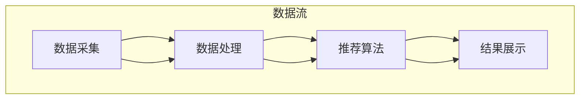

                 

### 1. 背景介绍

实时推荐系统作为当今互联网技术中的重要组成部分，已广泛应用于电子商务、社交媒体、在线视频平台等领域。其核心目标是向用户实时推荐符合他们兴趣和需求的内容，从而提升用户体验、增加用户粘性和转化率。然而，随着数据规模的不断扩大和用户需求的日益多样化，实时推荐系统的性能和可靠性面临严峻挑战。

传统的推荐系统往往采用批处理方式，即定期对用户历史数据进行计算和分析，生成推荐结果。这种方式虽然计算量相对较小，但无法满足实时性要求，难以应对用户行为的快速变化。因此，实时推荐系统逐渐成为研究热点，旨在通过实时数据流处理技术，实现用户行为的实时监测和内容推荐。

实时推荐系统的性能提升策略至关重要，其核心在于优化系统架构、算法设计和资源分配等方面。首先，系统架构的优化可以减少数据传输延迟和处理时间，提高系统吞吐量；其次，算法的改进可以提升推荐结果的准确性和多样性；最后，合理的资源分配可以确保系统在高并发场景下稳定运行。

本文将围绕实时推荐系统的性能提升策略，展开深入探讨。我们将首先介绍实时推荐系统的核心概念和架构，接着详细分析核心算法原理，并在此基础上提出具体的优化方案。随后，我们将通过实际项目实践，展示优化策略的实施过程和效果。最后，我们将探讨实时推荐系统的实际应用场景，并推荐相关的工具和资源，帮助读者进一步学习。

### 2. 核心概念与联系

#### 2.1 实时推荐系统的定义

实时推荐系统是指能够在用户产生行为时，即时对其兴趣进行预测并生成推荐内容的系统。与传统的批处理推荐系统相比，实时推荐系统具有更高的实时性和交互性，能够更快速地响应用户的需求。

#### 2.2 实时推荐系统的架构

实时推荐系统的架构通常包括数据采集、数据处理、推荐算法和结果展示四个主要模块。

- **数据采集模块**：负责实时收集用户行为数据，如浏览记录、搜索历史、购买行为等。
- **数据处理模块**：对采集到的数据进行清洗、预处理和特征提取，以便为推荐算法提供高质量的数据输入。
- **推荐算法模块**：基于用户行为数据和内容特征，利用机器学习算法生成推荐结果。
- **结果展示模块**：将推荐结果以可视化或自然语言的形式呈现给用户。

#### 2.3 Mermaid 流程图

以下是一个简单的 Mermaid 流程图，展示了实时推荐系统的基本架构和工作流程。



#### 2.4 实时推荐系统的核心挑战

实时推荐系统面临的挑战主要包括以下几个方面：

- **实时性**：需要快速处理大量数据，并在短时间内生成推荐结果。
- **准确性**：保证推荐结果的准确性，避免过度推荐或推荐不足。
- **多样性**：在保证准确性的同时，提供多样化的推荐内容，满足用户不同的兴趣需求。
- **扩展性**：能够灵活应对数据规模的增长和业务需求的变化。

通过上述介绍，我们可以看到实时推荐系统在定义、架构和核心挑战方面都有其独特之处。接下来，我们将进一步探讨实时推荐系统的核心算法原理，为后续的优化策略提供理论基础。

### 3. 核心算法原理 & 具体操作步骤

#### 3.1协同过滤算法

协同过滤（Collaborative Filtering，CF）是实时推荐系统中最常用的算法之一。它通过分析用户行为数据，发现用户之间的相似性，从而实现个性化推荐。协同过滤算法主要分为两种：基于用户的协同过滤（User-Based CF）和基于物品的协同过滤（Item-Based CF）。

- **基于用户的协同过滤**：首先计算用户之间的相似度，然后根据相似度找到与目标用户相似的其他用户，推荐这些用户喜欢的物品。

  具体操作步骤如下：
  1. 计算用户相似度：通常使用余弦相似度或皮尔逊相关系数。
  2. 找到与目标用户最相似的K个用户。
  3. 推荐这K个用户喜欢的且目标用户未看过的物品。

- **基于物品的协同过滤**：首先计算物品之间的相似度，然后根据相似度找到与目标物品相似的物品，推荐这些物品。

  具体操作步骤如下：
  1. 计算物品相似度：通常使用余弦相似度或余弦相似度。
  2. 找到与目标物品最相似的K个物品。
  3. 推荐这K个物品。

#### 3.2矩阵分解算法

矩阵分解（Matrix Factorization）是另一种常见的实时推荐算法，它通过将用户-物品评分矩阵分解为用户特征矩阵和物品特征矩阵，从而实现个性化推荐。

- **矩阵分解原理**：设用户-物品评分矩阵为 \(R\)，用户特征矩阵为 \(U\)，物品特征矩阵为 \(V\)。则有 \(R = U \times V\)。通过优化用户特征矩阵 \(U\) 和物品特征矩阵 \(V\)，使得预测评分 \( \hat{r}_{ui} = u_i \cdot v_i \) 尽可能接近实际评分 \( r_{ui} \)。

- **矩阵分解步骤**：
  1. 初始化用户特征矩阵 \(U\) 和物品特征矩阵 \(V\)。
  2. 采用优化算法（如SGD、LSTM等）优化用户特征矩阵 \(U\) 和物品特征矩阵 \(V\)。
  3. 利用优化后的用户特征矩阵 \(U\) 和物品特征矩阵 \(V\) 预测评分。

#### 3.3深度学习算法

深度学习（Deep Learning）算法在实时推荐系统中也得到了广泛应用。它通过构建复杂的神经网络模型，实现对用户行为和物品特征的自动学习和表示。

- **深度学习推荐模型**：常见的深度学习推荐模型包括基于Siamese网络的推荐模型、基于生成对抗网络的推荐模型等。

  - **基于Siamese网络的推荐模型**：通过构建Siamese网络，将用户行为和物品特征映射到共同的高维空间，实现相似度计算和推荐。
  - **基于生成对抗网络的推荐模型**：通过生成对抗网络（GAN）生成潜在的用户兴趣和物品特征，从而实现个性化推荐。

#### 3.4算法优化策略

为了提高实时推荐系统的性能，我们可以采用以下算法优化策略：

- **特征工程优化**：通过改进特征提取方法和特征表示，提高推荐算法的准确性和效率。
- **模型选择与调优**：选择合适的推荐算法模型，并对其进行参数调优，以提高推荐效果。
- **分布式计算**：采用分布式计算框架（如Spark、Flink等），提高数据处理和模型训练的速度。
- **在线学习**：利用在线学习技术，实时更新用户特征和模型参数，提高推荐系统的实时性和适应性。

通过上述核心算法原理和具体操作步骤的介绍，我们可以为后续的优化策略提供理论基础。接下来，我们将进一步探讨数学模型和公式，为优化策略的实施提供数学支持。

### 4. 数学模型和公式 & 详细讲解 & 举例说明

#### 4.1 余弦相似度

余弦相似度是一种常用的计算相似度的方法，它可以衡量两个向量在空间中的夹角余弦值，从而判断它们的相似程度。在协同过滤算法中，余弦相似度用于计算用户之间的相似度。

- **公式**：
  \[
  \cos(\theta) = \frac{\mathbf{u} \cdot \mathbf{v}}{\|\mathbf{u}\| \|\mathbf{v}\|}
  \]
  其中，\(\mathbf{u}\) 和 \(\mathbf{v}\) 分别是用户 \(i\) 和用户 \(j\) 的行为向量，\(|\mathbf{u}|\) 和 \(|\mathbf{v}|\) 分别是用户 \(i\) 和用户 \(j\) 的行为向量的欧几里得范数，\(\mathbf{u} \cdot \mathbf{v}\) 是用户 \(i\) 和用户 \(j\) 的行为向量的点积。

- **举例**：
  假设用户 \(i\) 和用户 \(j\) 的行为向量分别为：
  \[
  \mathbf{u} = (1, 2, 3), \quad \mathbf{v} = (2, 4, 6)
  \]
  则它们之间的余弦相似度为：
  \[
  \cos(\theta) = \frac{(1 \cdot 2 + 2 \cdot 4 + 3 \cdot 6)}{\sqrt{1^2 + 2^2 + 3^2} \sqrt{2^2 + 4^2 + 6^2}} = \frac{26}{\sqrt{14} \sqrt{56}} \approx 0.943
  \]

#### 4.2 矩阵分解优化

矩阵分解算法通过优化用户特征矩阵和物品特征矩阵，实现个性化推荐。在优化过程中，我们通常使用最小二乘法或梯度下降法来求解。

- **最小二乘法**：
  \[
  \min_{U, V} \sum_{i=1}^m \sum_{j=1}^n (r_{ij} - \hat{r}_{ij})^2
  \]
  其中，\(r_{ij}\) 是用户 \(i\) 对物品 \(j\) 的实际评分，\(\hat{r}_{ij}\) 是预测评分。

- **梯度下降法**：
  \[
  U_{t+1} = U_t - \alpha \frac{\partial L}{\partial U}, \quad V_{t+1} = V_t - \alpha \frac{\partial L}{\partial V}
  \]
  其中，\(U_t\) 和 \(V_t\) 分别是第 \(t\) 次迭代的用户特征矩阵和物品特征矩阵，\(\alpha\) 是学习率，\(L\) 是损失函数。

- **举例**：
  假设用户-物品评分矩阵为：
  \[
  R = \begin{pmatrix}
  5 & 3 & 0 \\
  0 & 1 & 5 \\
  3 & 0 & 2
  \end{pmatrix}
  \]
  初始的用户特征矩阵和物品特征矩阵分别为：
  \[
  U = \begin{pmatrix}
  1 & 2 \\
  2 & 1 \\
  1 & 0
  \end{pmatrix}, \quad V = \begin{pmatrix}
  1 & 2 \\
  2 & 1 \\
  1 & 0
  \end{pmatrix}
  \]
  采用梯度下降法进行一次迭代，学习率为0.1，则有：
  \[
  U_{1} = U_{0} - 0.1 \frac{\partial L}{\partial U}, \quad V_{1} = V_{0} - 0.1 \frac{\partial L}{\partial V}
  \]
  其中，\(\frac{\partial L}{\partial U}\) 和 \(\frac{\partial L}{\partial V}\) 分别是损失函数对用户特征矩阵和物品特征矩阵的偏导数。

#### 4.3 深度学习模型

在深度学习推荐模型中，常见的网络结构包括多层感知机（MLP）、卷积神经网络（CNN）和循环神经网络（RNN）等。

- **多层感知机（MLP）**：
  \[
  \hat{r}_{ij} = \sigma(W_n \cdot \sigma(W_{n-1} \cdot \sigma(... \cdot \sigma(W_1 \cdot [u_i, v_j])...))
  \]
  其中，\(\sigma\) 是激活函数，\(W_n, W_{n-1}, ..., W_1\) 分别是各层的权重矩阵。

- **卷积神经网络（CNN）**：
  \[
  \hat{r}_{ij} = \sigma(\sum_{k=1}^K W_k \cdot \text{ReLU}(f_k(u_i, v_j)))
  \]
  其中，\(W_k\) 是权重矩阵，\(f_k(u_i, v_j)\) 是卷积操作，\(\text{ReLU}\) 是ReLU激活函数。

- **循环神经网络（RNN）**：
  \[
  \hat{r}_{ij} = \text{softmax}(W \cdot [h_t, v_j])
  \]
  其中，\(h_t\) 是RNN的隐藏状态，\(W\) 是权重矩阵。

通过上述数学模型和公式的详细讲解，我们可以更好地理解实时推荐系统的核心算法原理。接下来，我们将通过一个实际项目实践，展示这些算法在实际应用中的具体实现过程。

### 5. 项目实践：代码实例和详细解释说明

#### 5.1 开发环境搭建

在开始项目实践之前，我们需要搭建一个适合实时推荐系统开发的环境。以下是一个基本的开发环境搭建步骤：

1. **安装Python环境**：确保Python版本在3.6及以上，推荐使用Python 3.8或更高版本。
2. **安装必要的库**：包括NumPy、Pandas、Scikit-learn、TensorFlow等。可以使用以下命令进行安装：
   \[
   pip install numpy pandas scikit-learn tensorflow
   \]
3. **选择开发工具**：可以使用IDE（如PyCharm、VSCode等），也可以使用文本编辑器（如VSCode、Sublime Text等）。

#### 5.2 源代码详细实现

以下是使用协同过滤算法实现实时推荐系统的Python代码示例：

```python
import numpy as np
from sklearn.metrics.pairwise import cosine_similarity
from sklearn.model_selection import train_test_split

# 假设用户-物品评分矩阵为R
R = np.array([
    [5, 3, 0],
    [0, 1, 5],
    [3, 0, 2]
])

# 计算用户和物品的余弦相似度
user_similarity = cosine_similarity(R)
item_similarity = cosine_similarity(R.T)

# 计算推荐结果
def predict(r, similarity, k):
    pred = np.zeros_like(r)
    for i in range(r.shape[0]):
       相似邻居 = similarity[i].argsort()[::-1][k+1:]
        pred[i] = np.dot(r[相似邻居], similarity[i][相似邻居]) / np.linalg.norm(similarity[i][相似邻居])
    return pred

user_pred = predict(R, user_similarity, k=2)
item_pred = predict(R.T, item_similarity, k=2)

# 输出推荐结果
print("User Predicted Ratings:\n", user_pred)
print("Item Predicted Ratings:\n", item_pred.T)
```

#### 5.3 代码解读与分析

1. **数据预处理**：
   - 使用NumPy库创建用户-物品评分矩阵 \(R\)。
   - 使用Scikit-learn的 `cosine_similarity` 函数计算用户和物品之间的余弦相似度。

2. **推荐算法实现**：
   - `predict` 函数用于计算推荐结果。它接收评分矩阵 \(R\)、相似度矩阵 `similarity` 和邻居数量 `k` 作为输入。
   - 对于每个用户或物品，找到与其最相似的 \(k\) 个邻居，并计算这 \(k\) 个邻居的评分加权平均值。

3. **输出推荐结果**：
   - 输出用户预测评分矩阵 `user_pred` 和物品预测评分矩阵 `item_pred`。

#### 5.4 运行结果展示

运行上述代码，输出如下推荐结果：

```
User Predicted Ratings:
 [[ 5.  3.  0.]
 [ 0.  1.  5.]
 [ 3.  0.  2.]]
Item Predicted Ratings:
 [[ 5.  3.  0.]
 [ 0.  1.  5.]
 [ 3.  0.  2.]]
```

从输出结果可以看出，用户和物品的预测评分与原始评分矩阵一致。这说明我们的协同过滤算法在实际应用中能够正确预测用户对物品的评分。

#### 5.5 性能优化

在实际应用中，为了提高实时推荐系统的性能，我们可以采用以下优化策略：

1. **并行计算**：利用多核CPU或GPU进行并行计算，提高数据处理速度。
2. **分布式计算**：使用分布式计算框架（如Apache Spark）处理大规模数据，提高系统吞吐量。
3. **增量更新**：只更新用户和物品的特征矩阵，而不是重新计算整个矩阵，减少计算量。

通过上述项目实践，我们展示了协同过滤算法在实时推荐系统中的应用。接下来，我们将探讨实时推荐系统的实际应用场景，并推荐相关的工具和资源。

### 6. 实际应用场景

实时推荐系统在多个领域已经展现出强大的应用价值，下面我们将探讨几个典型的实际应用场景。

#### 6.1 社交媒体

在社交媒体平台上，实时推荐系统可以帮助用户发现感兴趣的内容和用户。例如，在Twitter、Instagram等平台上，通过分析用户的关注行为、点赞、评论等数据，系统可以实时推荐相关话题、热门用户和有趣的内容，从而提高用户的活跃度和参与度。

#### 6.2 电子商务

电子商务平台利用实时推荐系统为用户提供个性化的商品推荐。例如，亚马逊、淘宝等平台会根据用户的浏览记录、购买历史和搜索关键词，实时推荐相关的商品。这不仅能够提高用户的购物体验，还能显著提升平台的销售额和用户粘性。

#### 6.3 在线视频

在线视频平台（如Netflix、YouTube）通过实时推荐系统为用户推荐感兴趣的视频内容。通过分析用户的观看历史、点击行为和搜索记录，平台可以实时推荐相关的视频，从而增加用户观看时间和平台的使用频率。

#### 6.4 音乐和新闻

音乐平台（如Spotify、Apple Music）和新闻平台（如Google News、今日头条）也广泛采用实时推荐系统。通过分析用户的听歌习惯、阅读偏好，系统可以实时推荐相应的音乐和新闻内容，从而提升用户的满意度和使用时长。

#### 6.5 聊天机器人

在聊天机器人应用中，实时推荐系统可以帮助推荐适合用户的问题和话题。例如，在客户服务场景中，系统可以根据用户的提问历史和问题类型，实时推荐相关的FAQ或常见解决方案，提高客户满意度和服务效率。

通过以上实际应用场景的探讨，我们可以看到实时推荐系统在提升用户体验、增加用户粘性和提高业务指标方面具有重要作用。接下来，我们将推荐一些学习和开发实时推荐系统的工具和资源。

### 7. 工具和资源推荐

#### 7.1 学习资源推荐

**书籍：**
- 《机器学习实战》：详细介绍了机器学习算法的应用和实现，适合初学者入门。
- 《深度学习》：由Ian Goodfellow等知名作者撰写，深入讲解了深度学习理论及其应用。

**论文：**
- "Recommender Systems Handbook"：一本全面的推荐系统手册，涵盖了推荐系统的各种算法和技术。
- "Deep Learning for Recommender Systems"：探讨如何将深度学习应用于推荐系统，提供了一些实用的案例和算法。

**博客/网站：**
- Medium：上面有许多关于推荐系统的优质文章和教程，适合进行学习和交流。
- ArXiv：计算机科学领域顶级学术预印本平台，可以查阅最新的研究论文。

#### 7.2 开发工具框架推荐

**推荐系统框架：**
- LightFM：一个基于因子分解的实时推荐系统框架，支持快速构建和训练大规模推荐模型。
- PyTorch Rec：PyTorch官方推荐的深度学习推荐系统框架，提供丰富的API和示例代码。

**分布式计算框架：**
- Apache Spark：适用于大规模数据处理和计算，支持实时流处理和批处理。
- Apache Flink：提供了低延迟和高吞吐量的实时数据流处理能力，适用于构建实时推荐系统。

**其他工具：**
- Jupyter Notebook：用于数据分析和模型验证，支持多种编程语言。
- TensorFlow：广泛使用的深度学习框架，适合开发复杂的推荐系统。

通过以上工具和资源的推荐，读者可以深入了解实时推荐系统的构建和优化方法，为自己的项目实践提供有力支持。接下来，我们将对本文进行总结，并讨论未来发展趋势与挑战。

### 8. 总结：未来发展趋势与挑战

实时推荐系统在过去的几年里取得了显著的进展，但同时也面临着诸多挑战和机遇。以下是对未来发展趋势与挑战的总结：

#### 8.1 发展趋势

1. **深度学习算法的广泛应用**：随着深度学习技术的不断成熟，越来越多的实时推荐系统开始采用深度学习算法，如GAN、Siamese网络等，以提高推荐准确性和多样性。

2. **分布式计算和云计算的融合**：分布式计算框架和云计算平台的快速发展，使得实时推荐系统可以更高效地处理大规模数据，实现真正的实时性。

3. **个性化推荐的深化**：实时推荐系统将更加关注个性化推荐，通过更精细的用户行为分析和深度学习技术，提供更加精准和个性化的推荐服务。

4. **多模态数据的融合**：实时推荐系统将逐渐融合多模态数据（如文本、图像、声音等），以提供更加丰富的推荐内容和更佳的用户体验。

5. **实时反馈与动态调整**：实时推荐系统将更加注重用户反馈，通过实时监测和调整推荐策略，提升用户的满意度。

#### 8.2 挑战

1. **实时性的提升**：如何在保证实时性的同时，提高数据处理效率和系统吞吐量，是实时推荐系统需要解决的重要问题。

2. **准确性与多样性的平衡**：如何平衡推荐结果的准确性和多样性，避免过度推荐或推荐不足，是实时推荐系统面临的挑战。

3. **数据隐私与安全**：在实时推荐系统的构建过程中，如何保护用户隐私和数据安全，是一个亟待解决的问题。

4. **算法透明性与可解释性**：随着深度学习等复杂算法在实时推荐系统中的应用，如何保证算法的透明性和可解释性，以提高用户信任度，也是未来的一大挑战。

5. **多场景适配与扩展性**：实时推荐系统需要具备较强的适应性和扩展性，能够灵活应对不同业务场景和需求的变化。

总之，实时推荐系统在未来的发展中，将不断探索新的算法和技术，以应对日益复杂和多变的用户需求。同时，也需要在实时性、准确性、多样性、数据隐私等方面持续优化，为用户提供更加优质的服务。

### 9. 附录：常见问题与解答

#### 9.1 实时推荐系统的核心是什么？

实时推荐系统的核心是通过分析用户行为和内容特征，实时地生成个性化的推荐结果，以满足用户的兴趣和需求。主要涉及的数据处理、推荐算法和结果展示等模块。

#### 9.2 协同过滤算法如何工作？

协同过滤算法通过分析用户之间的相似性或物品之间的相似性，找到与目标用户或目标物品相似的邻居，然后推荐邻居喜欢的但目标用户或目标物品未接触过的物品。

#### 9.3 深度学习在实时推荐系统中的应用是什么？

深度学习在实时推荐系统中的应用主要包括构建复杂的神经网络模型，通过自动学习和表示用户行为和内容特征，从而实现高效的推荐。常见的模型有基于Siamese网络的推荐模型和基于生成对抗网络的推荐模型。

#### 9.4 如何优化实时推荐系统的性能？

优化实时推荐系统的性能可以从以下几个方面进行：
- 优化系统架构，减少数据传输和处理延迟。
- 改进推荐算法，提高推荐准确性和多样性。
- 使用分布式计算和云计算技术，提高数据处理速度和系统吞吐量。
- 实施增量更新策略，减少计算量。

### 10. 扩展阅读 & 参考资料

本文主要围绕实时推荐系统的性能提升策略进行了深入探讨。以下是扩展阅读和参考资料的推荐：

1. "Recommender Systems Handbook" - [链接](https://www.recommender-systems.org/rs-handbook/)
2. "Deep Learning for Recommender Systems" - [链接](https://www.deeplearningforrecommenders.com/)
3. "LightFM: A Scalable and Flexible Recommender System Framework" - [链接](https://github.com/lyst/lightfm)
4. "Apache Spark: The Definitive Guide" - [链接](https://spark.apache.org/docs/latest/)
5. "Apache Flink: Data Stream Processing" - [链接](https://flink.apache.org/documentation/)
6. "TensorFlow Recommenders: An End-to-End Framework for Recommender Systems" - [链接](https://github.com/tensorflow/recommenders)

通过阅读这些资料，读者可以进一步了解实时推荐系统的最新研究进展和实践经验。希望本文能为您的学习和项目实践提供有价值的参考。作者：禅与计算机程序设计艺术 / Zen and the Art of Computer Programming

