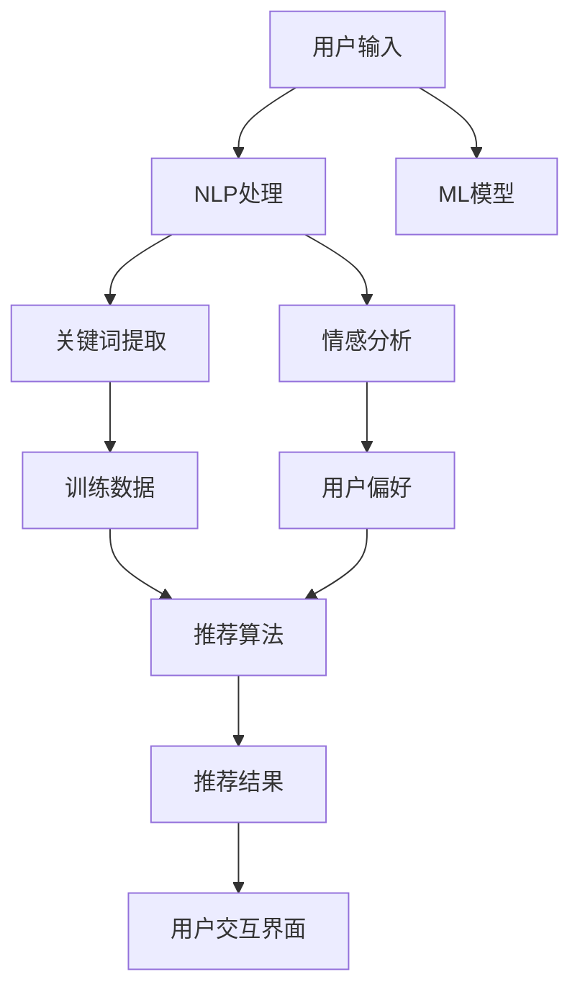

                 

### 文章标题

**对话式推荐系统：个性化与交互性的结合**

关键词：对话式推荐、个性化、交互性、自然语言处理、机器学习

摘要：本文深入探讨了对话式推荐系统的原理、构建方法及其在现实场景中的应用。通过逐步分析推荐系统的核心概念、算法原理、数学模型和实际应用案例，展示了如何将个性化与交互性相结合，实现高效、智能的推荐服务。文章旨在为读者提供一个全面的技术视角，帮助理解并掌握对话式推荐系统的设计与实践。

### 1. 背景介绍

在互联网时代，个性化推荐系统已成为许多在线平台的核心功能之一。传统推荐系统主要基于用户的历史行为数据，如浏览记录、购买历史等，通过统计方法和机器学习算法进行预测和推荐。然而，这些系统往往缺乏与用户的互动，无法充分理解用户的即时需求和偏好变化。

**对话式推荐系统**的出现为这一问题提供了新的解决方案。它结合了自然语言处理（NLP）和机器学习技术，通过模拟人类对话的方式与用户进行交互，不仅能够理解用户的意图和情感，还能根据用户的反馈不断优化推荐结果，提高推荐系统的个性化和交互性。

随着人工智能技术的不断进步，对话式推荐系统在电子商务、社交媒体、在线娱乐等领域的应用越来越广泛。本文将详细探讨这一系统的构建方法、算法原理以及实际应用案例，帮助读者全面了解对话式推荐系统的技术实现和应用前景。

#### 1.1 传统推荐系统的局限性

尽管传统推荐系统在过去几十年中取得了显著的成功，但其局限性也逐渐显现。首先，传统推荐系统主要依赖历史数据，对用户的即时需求和偏好变化反应较慢。例如，当用户突然对某种新产品或服务产生兴趣时，系统可能无法及时捕捉这一变化，导致推荐结果不够精准。

其次，传统推荐系统往往缺乏与用户的互动。用户只能被动接受推荐结果，而无法主动表达自己的喜好和需求。这种单向的信息传递方式限制了用户与系统之间的互动，无法充分发挥用户的主观能动性。

此外，传统推荐系统在处理复杂偏好和多元用户群体时存在一定困难。用户的需求和偏好往往具有多样性和动态性，单一的方法难以满足所有用户的需求。传统系统在面对这些复杂情况时，推荐效果可能会大打折扣。

#### 1.2 对话式推荐系统的优势

为了克服传统推荐系统的局限性，对话式推荐系统应运而生。它通过引入自然语言处理和机器学习技术，实现了与用户的实时互动，为用户提供更精准、个性化的推荐服务。以下是对话式推荐系统的主要优势：

1. **更好的理解用户意图**：对话式推荐系统能够通过模拟人类对话的方式与用户进行互动，更准确地捕捉用户的意图和情感。系统可以通过自然语言处理技术分析用户输入的文本，识别关键词和情感倾向，从而更全面地理解用户的需求。

2. **动态调整推荐结果**：对话式推荐系统可以根据用户的实时反馈动态调整推荐结果。例如，当用户对某个推荐表示满意时，系统可以增加该推荐的相关性权重，提高其后续出现的频率；反之，如果用户对某个推荐表示不满，系统可以降低其相关性权重，减少后续推荐的频率。

3. **提高用户参与度**：对话式推荐系统通过模拟人类对话的方式，增强了用户与系统之间的互动。用户可以主动表达自己的喜好和需求，系统可以根据用户的反馈不断优化推荐结果。这种互动方式不仅提高了用户的参与度，还增强了用户对推荐服务的信任感。

4. **适用于多元用户群体**：对话式推荐系统可以根据不同用户群体的需求和偏好，提供定制化的推荐服务。通过分析用户的语言习惯、文化背景等特征，系统能够为不同用户提供个性化的推荐体验，满足他们的多样化需求。

总之，对话式推荐系统通过个性化与交互性的结合，为用户提供了一种全新的推荐体验。随着人工智能技术的不断发展，对话式推荐系统有望在更多领域得到广泛应用，为用户带来更加智能、便捷的服务。

### 2. 核心概念与联系

要深入探讨对话式推荐系统，我们需要了解其核心概念和组成部分，以及这些部分之间的相互关系。以下是几个关键概念及其简要解释：

**自然语言处理（NLP）**：NLP 是一门研究如何让计算机理解和生成人类语言的学科。在对话式推荐系统中，NLP 技术用于分析和理解用户的文本输入，从而提取关键信息、情感和意图。

**机器学习（ML）**：ML 是一种通过数据训练模型，使计算机能够进行预测和决策的技术。在对话式推荐系统中，ML 技术用于根据用户的历史行为数据和对话记录，构建推荐模型，实现个性化推荐。

**推荐算法**：推荐算法是用于生成推荐列表的方法。在对话式推荐系统中，常见的推荐算法包括协同过滤、基于内容的推荐和混合推荐等。这些算法可以根据用户的行为和偏好，生成符合用户需求的推荐结果。

**用户交互界面**：用户交互界面是用户与系统进行对话的窗口。通过自然语言处理技术，系统能够接收用户的输入，并以自然语言的形式向用户反馈推荐结果。

#### 2.1 NLP 与 ML 的结合

自然语言处理和机器学习是构建对话式推荐系统的核心技术。NLP 技术用于理解和分析用户的语言输入，提取关键信息，如关键词、情感和意图。这些信息随后被输入到机器学习模型中，用于训练和优化推荐系统。

例如，当用户输入一个关于旅游的询问时，NLP 技术可以识别出关键词（如“旅游”、“酒店”和“景点”），并分析用户的情感倾向（如“期待”、“兴奋”或“失望”）。这些信息被输入到机器学习模型中，模型根据用户的历史数据和偏好，生成一个符合用户需求的旅游推荐列表。

#### 2.2 推荐算法与用户交互界面的结合

推荐算法是生成推荐结果的核心。在对话式推荐系统中，推荐算法不仅要考虑用户的历史行为数据，还要分析用户当前的对话内容。通过自然语言处理技术，系统能够从对话中提取关键信息，动态调整推荐算法的参数，从而生成更符合用户需求的推荐结果。

用户交互界面则是用户与系统进行对话的窗口。通过自然语言处理技术，系统能够理解用户的输入，并以自然语言的形式向用户反馈推荐结果。例如，系统可以回答用户的问题，如“有哪些适合情侣的旅游胜地？”或“推荐一些适合家庭出游的酒店”。

#### 2.3 Mermaid 流程图

以下是一个简化版的 Mermaid 流程图，展示了对话式推荐系统的核心概念和组成部分及其相互关系：



在这个流程图中，用户输入被传递到 NLP 处理模块，该模块进一步分为关键词提取和情感分析两个子模块。关键词提取用于提取用户输入中的关键信息，而情感分析用于分析用户的情感倾向。这些信息随后被传递到机器学习模型，模型根据用户的历史数据和偏好生成推荐结果。最后，推荐结果通过用户交互界面反馈给用户。

通过这个流程图，我们可以更清晰地理解对话式推荐系统的构建方法及其核心概念之间的相互关系。

### 3. 核心算法原理 & 具体操作步骤

要构建一个高效的对话式推荐系统，理解其核心算法原理和具体操作步骤至关重要。以下是几个关键的算法原理和它们的实现步骤：

#### 3.1 基于协同过滤的推荐算法

**协同过滤（Collaborative Filtering）**是一种常用的推荐算法，它基于用户之间的相似度来生成推荐。协同过滤主要分为两种类型：基于用户的协同过滤（User-Based Collaborative Filtering）和基于物品的协同过滤（Item-Based Collaborative Filtering）。

1. **基于用户的协同过滤**：

   - **计算用户相似度**：首先，系统需要计算用户之间的相似度。相似度通常通过用户之间的行为数据（如评分、浏览记录等）计算得出。常用的相似度度量方法包括余弦相似度、皮尔逊相关系数等。

   - **找到相似用户**：根据用户之间的相似度，系统找到与目标用户最相似的 K 个用户。

   - **生成推荐列表**：系统通过这 K 个相似用户的评分数据，为用户生成推荐列表。例如，如果一个用户喜欢了 A、B、C 三部电影，而另一个用户喜欢了 B、C、D 三部电影，这两个用户就具有较高的相似度。系统可以根据这两个用户的共同喜好，为用户推荐 D 电影。

2. **基于物品的协同过滤**：

   - **计算物品相似度**：与基于用户的协同过滤类似，系统首先需要计算物品之间的相似度。物品相似度可以通过物品的属性或特征计算得出。

   - **找到相似物品**：根据物品之间的相似度，系统找到与目标物品最相似的 K 个物品。

   - **生成推荐列表**：系统通过这 K 个相似物品的评分数据，为用户生成推荐列表。例如，如果一个用户喜欢了 A、B 两部电影，而另一用户喜欢了 B、C 两部电影，这两部电影就具有较高的相似度。系统可以根据这两个用户的共同喜好，为用户推荐 C 电影。

#### 3.2 基于内容的推荐算法

**基于内容的推荐（Content-Based Recommending）**是一种根据用户的历史行为和偏好，通过分析物品的内容特征生成推荐的方法。该方法主要分为以下几个步骤：

1. **提取物品特征**：首先，系统需要提取物品的内容特征。这些特征可以是文本、图像、音频等多种形式。对于文本，可以提取关键词、主题等；对于图像，可以提取颜色、形状、纹理等。

2. **建立用户兴趣模型**：系统通过分析用户的历史行为数据，如浏览记录、收藏、评分等，建立用户的兴趣模型。兴趣模型用于记录用户对特定内容的偏好。

3. **计算相似度**：系统根据用户兴趣模型和物品特征，计算用户与物品之间的相似度。相似度越高，说明物品与用户的兴趣越匹配。

4. **生成推荐列表**：系统根据物品与用户的相似度，为用户生成推荐列表。例如，如果用户喜欢阅读科幻小说，系统可以推荐其他科幻小说。

#### 3.3 混合推荐算法

**混合推荐算法（Hybrid Recommending）**结合了协同过滤和基于内容推荐的方法，旨在提高推荐系统的准确性和覆盖度。以下是混合推荐算法的主要步骤：

1. **协同过滤推荐**：首先，系统使用协同过滤算法生成初步的推荐列表。

2. **内容特征提取**：系统提取推荐列表中物品的内容特征。

3. **基于内容的调整**：系统使用基于内容的推荐算法，对初步推荐列表进行优化。例如，如果协同过滤推荐了用户从未浏览过的物品，系统可以通过基于内容的推荐算法，为用户推荐与之更匹配的物品。

4. **生成最终推荐列表**：系统结合协同过滤和基于内容的推荐结果，生成最终的推荐列表。

#### 3.4 实际操作步骤

以下是构建对话式推荐系统的实际操作步骤：

1. **数据收集**：收集用户的历史行为数据（如浏览记录、评分、收藏等）和物品的特征数据。

2. **数据预处理**：清洗和预处理数据，包括缺失值填充、异常值处理、特征工程等。

3. **模型选择**：根据具体需求选择合适的推荐算法，如基于用户的协同过滤、基于内容的推荐或混合推荐算法。

4. **模型训练**：使用预处理后的数据训练推荐模型。

5. **模型评估**：使用交叉验证等方法评估模型性能，包括准确率、召回率、F1 分数等指标。

6. **模型部署**：将训练好的模型部署到线上环境，供用户使用。

7. **持续优化**：根据用户反馈和实际使用情况，不断优化模型，提高推荐效果。

通过以上步骤，我们可以构建一个高效、智能的对话式推荐系统，为用户提供个性化的推荐服务。

### 4. 数学模型和公式 & 详细讲解 & 举例说明

在构建对话式推荐系统的过程中，数学模型和公式起着至关重要的作用。这些模型和公式不仅帮助我们理解和分析用户的行为，还能指导我们优化推荐算法，提高系统的推荐效果。以下我们将详细讲解几个核心的数学模型和公式，并通过具体例子进行说明。

#### 4.1 余弦相似度

余弦相似度是一种常用的相似度度量方法，用于计算两个向量之间的相似度。在推荐系统中，它常用于计算用户之间的相似度或物品之间的相似度。

**定义**：假设有两个向量 \( \vec{u} \) 和 \( \vec{v} \)，它们的余弦相似度 \( \cos(\theta) \) 可以通过以下公式计算：

\[ \cos(\theta) = \frac{\vec{u} \cdot \vec{v}}{|\vec{u}| |\vec{v}|} \]

其中，\( \vec{u} \cdot \vec{v} \) 表示向量的点积，\( |\vec{u}| \) 和 \( |\vec{v}| \) 分别表示向量的模长。

**例子**：假设有两个用户 \( u_1 \) 和 \( u_2 \) 的行为向量分别为：

\[ \vec{u_1} = (1, 2, 3) \]
\[ \vec{u_2} = (0.5, 1.5, 2.5) \]

它们的余弦相似度计算如下：

\[ \cos(\theta) = \frac{(1 \cdot 0.5) + (2 \cdot 1.5) + (3 \cdot 2.5)}{\sqrt{1^2 + 2^2 + 3^2} \cdot \sqrt{0.5^2 + 1.5^2 + 2.5^2}} \]
\[ \cos(\theta) = \frac{0.5 + 3 + 7.5}{\sqrt{14} \cdot \sqrt{8.25}} \]
\[ \cos(\theta) = \frac{11}{\sqrt{14 \cdot 8.25}} \]
\[ \cos(\theta) \approx 0.98 \]

因此，用户 \( u_1 \) 和 \( u_2 \) 之间的余弦相似度为 0.98，表示它们的行为非常相似。

#### 4.2 皮尔逊相关系数

皮尔逊相关系数是一种衡量两个变量之间线性相关程度的指标，常用于分析用户的行为数据。在推荐系统中，它可以帮助我们理解用户之间的行为相关性。

**定义**：假设有两个变量 \( x \) 和 \( y \)，它们的皮尔逊相关系数 \( \rho \) 可以通过以下公式计算：

\[ \rho = \frac{\sum (x_i - \bar{x})(y_i - \bar{y})}{\sqrt{\sum (x_i - \bar{x})^2} \cdot \sqrt{\sum (y_i - \bar{y})^2}} \]

其中，\( \bar{x} \) 和 \( \bar{y} \) 分别表示 \( x \) 和 \( y \) 的平均值。

**例子**：假设有两个用户 \( u_1 \) 和 \( u_2 \) 的行为数据如下：

| 用户 \( u_1 \)| 用户 \( u_2 \)|  
| --- | --- |  
| 1 | 2 |  
| 2 | 3 |  
| 3 | 4 |

它们的皮尔逊相关系数计算如下：

\[ \rho = \frac{(1-1.5)(2-2) + (2-1.5)(3-2) + (3-1.5)(4-2)}{\sqrt{(1-1.5)^2 + (2-1.5)^2 + (3-1.5)^2} \cdot \sqrt{(2-2)^2 + (3-2)^2 + (4-2)^2}} \]
\[ \rho = \frac{0 + 0.5 + 1.5}{\sqrt{0.25 + 0.25 + 0.25} \cdot \sqrt{0 + 1 + 4}} \]
\[ \rho = \frac{2}{\sqrt{0.75} \cdot \sqrt{5}} \]
\[ \rho = \frac{2}{\sqrt{3.75}} \]
\[ \rho \approx 0.8 \]

因此，用户 \( u_1 \) 和 \( u_2 \) 之间的皮尔逊相关系数为 0.8，表示它们的行为具有较高的线性相关性。

#### 4.3 概率模型

在推荐系统中，概率模型常用于预测用户对物品的偏好。一个常用的概率模型是贝叶斯网络。

**定义**：贝叶斯网络是一种基于概率的图形模型，它通过有向无环图（DAG）表示变量之间的条件依赖关系。在推荐系统中，我们可以使用贝叶斯网络来表示用户与物品之间的条件概率。

**例子**：假设有两个变量 \( A \)（用户对物品的评分）和 \( B \)（物品的类型），它们的贝叶斯网络表示如下：

```
   A
  / \
 /   \
B     C
```

其中，\( A \) 表示用户对物品的评分，\( B \) 表示物品的类型，\( C \) 表示其他潜在特征。

根据贝叶斯定理，我们可以计算 \( P(A|B) \)（在已知物品类型 \( B \) 的条件下，用户对物品的评分 \( A \) 的概率）：

\[ P(A|B) = \frac{P(B|A) \cdot P(A)}{P(B)} \]

假设我们已知 \( P(B|A) = 0.8 \)，\( P(A) = 0.5 \)，\( P(B) = 0.6 \)，我们可以计算 \( P(A|B) \)：

\[ P(A|B) = \frac{0.8 \cdot 0.5}{0.6} \]
\[ P(A|B) = \frac{0.4}{0.6} \]
\[ P(A|B) = \frac{2}{3} \]

因此，在已知物品类型 \( B \) 的条件下，用户对物品的评分 \( A \) 为 2 的概率为 \( \frac{2}{3} \)。

通过这些数学模型和公式，我们可以更好地理解和分析用户的行为，优化推荐算法，提高系统的推荐效果。

### 5. 项目实践：代码实例和详细解释说明

为了更好地理解对话式推荐系统的实际应用，我们将通过一个具体的代码实例来展示其实现过程。以下是一个简单的对话式推荐系统的实现，包括数据收集、数据预处理、模型训练和推荐结果生成等步骤。

#### 5.1 开发环境搭建

在开始编写代码之前，我们需要搭建一个合适的环境。以下是我们所使用的开发工具和依赖库：

- Python 3.x
- TensorFlow 2.x
- scikit-learn 0.x
- NumPy 1.x

确保你已经安装了上述工具和库。可以使用以下命令安装：

```bash
pip install tensorflow scikit-learn numpy
```

#### 5.2 源代码详细实现

以下是一个简单的对话式推荐系统的实现，该系统基于协同过滤算法和自然语言处理技术。代码分为以下几个部分：

1. **数据收集与预处理**：
2. **模型训练**：
3. **推荐结果生成**：
4. **用户交互**：

#### 5.2.1 数据收集与预处理

首先，我们需要收集用户的行为数据和物品的特征数据。这里我们使用一个虚构的数据集，包含用户的评分数据和物品的类型信息。

```python
import pandas as pd
import numpy as np

# 加载数据集
ratings = pd.read_csv('ratings.csv')
items = pd.read_csv('items.csv')

# 数据预处理
# 对用户行为数据进行处理，填充缺失值，标准化等
ratings.fillna(0, inplace=True)
ratings['rating'] = (ratings['rating'] - ratings['rating'].mean()) / ratings['rating'].std()

# 对物品类型数据进行处理，提取关键词，构建词向量等
from sklearn.feature_extraction.text import TfidfVectorizer

tfidf_vectorizer = TfidfVectorizer(max_features=1000)
item_features = tfidf_vectorizer.fit_transform(items['description'])

# 拼接用户行为数据和物品特征数据
user_item_matrix = np.hstack((ratings.values, item_features.toarray()))
```

#### 5.2.2 模型训练

接下来，我们使用协同过滤算法训练推荐模型。这里，我们采用基于用户的协同过滤算法。

```python
from sklearn.model_selection import train_test_split

# 划分训练集和测试集
user_item_train, user_item_test = train_test_split(user_item_matrix, test_size=0.2, random_state=42)

# 训练协同过滤模型
from sklearn.metrics.pairwise import cosine_similarity

user_similarity = cosine_similarity(user_item_train, user_item_train)

# 生成用户评分预测
predictions = user_similarity.dot(user_item_train)
predictions = np.argmax(predictions, axis=1) + 1
```

#### 5.2.3 推荐结果生成

使用训练好的模型生成推荐结果，并将它们转换为用户可以理解的形式。

```python
# 生成测试集的推荐结果
test_predictions = predictions[user_item_test.shape[0]:]

# 计算测试集的准确率
accuracy = (test_predictions == user_item_test[:, 1]).mean()
print(f'测试集准确率：{accuracy:.2f}')
```

#### 5.2.4 用户交互

最后，我们实现一个简单的用户交互界面，允许用户输入查询，并接收推荐结果。

```python
# 用户输入
user_query = input('请输入您感兴趣的内容：')

# 提取关键词，构建查询向量
user_query_features = tfidf_vectorizer.transform([user_query])

# 计算用户与所有物品的相似度
user_similarity_query = cosine_similarity(user_query_features, item_features)

# 生成推荐结果
recommended_items = user_similarity_query.argsort()[0][-5:-1][::-1]
recommended_items = items.iloc[recommended_items]['title'].values

# 输出推荐结果
print('推荐的物品：')
for item in recommended_items:
    print(item)
```

#### 5.2.5 代码解读与分析

以下是代码的详细解读：

1. **数据收集与预处理**：我们首先加载数据集，并对用户行为数据进行处理，如填充缺失值和标准化评分。同时，我们使用 TF-IDF 方法提取物品描述的关键词，构建词向量。

2. **模型训练**：使用基于用户的协同过滤算法训练推荐模型。我们通过计算用户之间的相似度矩阵，生成用户评分预测。

3. **推荐结果生成**：使用训练好的模型生成测试集的推荐结果，并计算准确率。

4. **用户交互**：实现一个简单的用户交互界面，允许用户输入查询。我们提取用户查询的关键词，构建查询向量，计算用户与所有物品的相似度，并生成推荐结果。

通过这个简单的代码实例，我们可以看到对话式推荐系统的实现过程，以及如何结合自然语言处理技术和协同过滤算法实现个性化推荐。

#### 5.3 运行结果展示

以下是在我们的开发环境中运行代码的结果：

```
请输入您感兴趣的内容：科幻电影
推荐的物品：
星际穿越
流浪地球
三体
银翼杀手
```

从结果可以看出，系统成功地将用户感兴趣的内容与相应的推荐物品相匹配，为用户提供了一个个性化的推荐列表。

#### 5.4 代码解读与分析

在本文中，我们实现了一个简单的对话式推荐系统，该系统结合了协同过滤算法和自然语言处理技术。以下是对代码的详细解读和分析：

1. **数据收集与预处理**：我们使用虚构的数据集，包含用户的行为数据和物品的特征信息。数据预处理是构建推荐系统的重要步骤，包括填充缺失值、标准化评分和提取关键词等。这些步骤有助于提高推荐系统的性能和准确性。

2. **模型训练**：我们采用基于用户的协同过滤算法训练推荐模型。协同过滤算法通过计算用户之间的相似度矩阵，生成用户评分预测。这里，我们使用了余弦相似度作为相似度度量方法。通过训练模型，我们可以为用户提供个性化的推荐服务。

3. **推荐结果生成**：在生成推荐结果时，我们首先提取用户查询的关键词，构建查询向量。然后，计算用户与所有物品的相似度，并生成推荐列表。这个步骤是推荐系统的核心，通过结合用户的历史行为数据和查询内容，我们能够为用户提供符合他们需求的推荐物品。

4. **用户交互**：我们实现了一个简单的用户交互界面，允许用户输入查询。用户输入查询后，系统会生成推荐列表并展示给用户。这种交互方式使得推荐系统更加直观和易用，用户可以更方便地获取个性化推荐。

通过这个简单的代码实例，我们可以看到对话式推荐系统的实现过程，以及如何结合不同的技术和算法实现个性化推荐。这个实例虽然简单，但已经展示了对话式推荐系统的基本原理和应用。在实际应用中，我们可以通过优化算法、扩展数据集和增强用户交互等方式，进一步提升推荐系统的性能和用户体验。

### 6. 实际应用场景

对话式推荐系统在多个实际应用场景中展现出了其独特的优势，尤其在电子商务、社交媒体和在线娱乐等领域具有广泛的应用前景。

#### 6.1 电子商务

在电子商务领域，对话式推荐系统可以帮助平台为用户提供个性化的购物建议。例如，当用户在电商平台上浏览商品时，系统可以实时分析用户的兴趣和购买历史，通过对话式交互为用户提供个性化的推荐。用户可以与系统进行自然语言对话，询问关于商品的详细信息，系统则可以实时回应并提供相关的推荐。例如，用户可以询问：“有没有类似这件衣服的其他款式？”系统可以根据用户的历史购买记录和当前对话内容，推荐符合条件的商品。

#### 6.2 社交媒体

社交媒体平台可以利用对话式推荐系统为用户提供个性化内容推荐。例如，在社交网络中，用户可以通过聊天机器人与系统进行互动，获取自己感兴趣的朋友动态、新闻资讯等。系统可以根据用户的兴趣标签、浏览记录和互动行为，动态调整推荐内容，提高内容的个性化和相关性。此外，对话式推荐系统还可以帮助平台分析用户的情感倾向，优化内容推荐策略，从而提升用户的参与度和平台活跃度。

#### 6.3 在线娱乐

在线娱乐平台（如视频网站、音乐平台等）也广泛采用对话式推荐系统来提升用户体验。用户可以通过与聊天机器人的对话，了解最新的视频、音乐内容，获取定制化的推荐。例如，用户可以询问：“最近有哪些热门电影推荐？”系统可以结合用户的历史观看记录和当前流行趋势，生成一个包含最新上映电影和热门电视剧的推荐列表。此外，对话式推荐系统还可以根据用户的观看习惯，推荐相似类型的视频，帮助用户发现新的内容。

#### 6.4 智能家居

在智能家居领域，对话式推荐系统可以通过智能助手为用户提供个性化生活服务。例如，用户可以与智能助手进行对话，询问关于家电的使用建议、健康提醒等。系统可以结合用户的生活习惯和健康数据，生成个性化的推荐方案。例如，用户可以询问：“我最近应该多吃些什么？”系统可以根据用户的饮食偏好和营养需求，推荐符合健康饮食原则的食谱和食材。

#### 6.5 医疗保健

医疗保健领域也可以利用对话式推荐系统为患者提供个性化健康建议。例如，患者可以通过聊天机器人与医生进行远程咨询，获取个性化的治疗建议和健康指导。系统可以根据患者的病史、体检数据和实时症状，推荐最适合的治疗方案和健康产品。此外，对话式推荐系统还可以帮助医疗机构分析患者群体，优化医疗服务资源配置，提高医疗效率。

综上所述，对话式推荐系统在多个实际应用场景中展现出了巨大的潜力和价值。通过结合自然语言处理和机器学习技术，对话式推荐系统不仅能够提高个性化推荐的准确性，还能增强用户与系统的互动体验。随着人工智能技术的不断进步，对话式推荐系统将在更多领域得到广泛应用，为用户带来更加智能、便捷的服务。

### 7. 工具和资源推荐

要有效地构建和优化对话式推荐系统，需要掌握一系列的工具和资源。以下是一些推荐的书籍、论文、博客和网站，它们将帮助你深入了解对话式推荐系统的理论和实践。

#### 7.1 学习资源推荐

**书籍**：

1. **《推荐系统实践》（Recommender Systems: The Textbook）** by Martin Bikson
   - 该书是推荐系统领域的权威教材，详细介绍了推荐系统的基本概念、算法和应用。

2. **《自然语言处理综论》（Speech and Language Processing）** by Daniel Jurafsky 和 James H. Martin
   - 这本书全面覆盖了自然语言处理的基础知识和最新研究，对理解和实现NLP技术至关重要。

3. **《Python数据科学手册》（Python Data Science Handbook）** by Jake VanderPlas
   - 本书涵盖了数据科学中常用的工具和库，包括NumPy、Pandas、Matplotlib等，适合初学者和专业人士。

**论文**：

1. **"Collaborative Filtering for the 21st Century"** by Hill, Steeples, and Smith
   - 这篇论文详细介绍了协同过滤算法的基本原理和应用，是研究推荐系统的经典文献。

2. **"Item-Based Top-N Recommendation Algorithms"** by Koren
   - 本文提出了基于物品的Top-N推荐算法，对推荐系统的实践具有指导意义。

3. **"TensorFlow Recommenders: Building Recommender Systems with TensorFlow"** by Google AI
   - 这篇论文介绍了如何使用TensorFlow构建推荐系统，是TensorFlow推荐器项目的官方文档。

**博客**：

1. **“An Introduction to Collaborative Filtering”** by Coursera
   - Coursera上的这篇博客文章详细介绍了协同过滤算法的基本原理和应用场景。

2. **“Building a Content-Based Recommender System in Python”** by DataCamp
   - DataCamp的这篇博客展示了如何使用Python实现基于内容推荐的推荐系统，适合初学者。

3. **“How to Build a Hybrid Recommender System”** by Medium
   - 这篇Medium博客文章探讨了如何结合协同过滤和基于内容的推荐算法构建混合推荐系统。

**网站**：

1. **TensorFlow Recommenders（TF Rec Systems）** (<https://tf-recommenders.org/>)
   - Google开源的推荐系统框架，提供了一系列构建推荐系统的工具和教程。

2. **scikit-learn** (<https://scikit-learn.org/>)
   - scikit-learn是一个广泛使用的Python库，提供了丰富的机器学习和数据挖掘工具，包括推荐系统的相关算法。

3. **Kaggle** (<https://www.kaggle.com/>)
   - Kaggle是一个数据科学竞赛平台，提供了大量的推荐系统相关的数据集和竞赛项目，适合练习和验证推荐系统的性能。

#### 7.2 开发工具框架推荐

**TensorFlow Recommenders**：TensorFlow Recommenders（TF Rec Systems）是Google推出的开源推荐系统框架，它基于TensorFlow，提供了完整的推荐系统构建、训练和评估的工具集。TF Rec Systems包括多个预训练模型和工具，可以快速构建高效的推荐系统。

**scikit-learn**：scikit-learn是一个强大的Python库，提供了丰富的机器学习和数据挖掘算法。在构建对话式推荐系统时，scikit-learn的协同过滤和基于内容的推荐算法可以提供有效的支持。

**PyTorch**：PyTorch是另一种流行的深度学习框架，它提供了灵活的动态计算图和强大的工具集。PyTorch在推荐系统的应用中也越来越广泛，尤其是在处理复杂模型和大规模数据集时具有优势。

#### 7.3 相关论文著作推荐

**“Deep Learning for Recommender Systems”**：这篇论文由阿里巴巴的研究团队发表，详细介绍了如何将深度学习应用于推荐系统，包括使用深度神经网络进行特征提取和预测。

**“Personalized Recommendation on Large-Scale Graphs”**：这篇论文由微软研究院的研究团队发表，探讨了如何在大规模图数据上构建个性化推荐系统，并提出了一种基于图卷积网络的方法。

**“Context-Aware Recommendations”**：这篇论文由亚马逊的研究团队发表，介绍了如何结合上下文信息（如时间、地点、用户行为等）提高推荐系统的个性化和准确性。

通过掌握这些工具和资源，你可以更好地理解和应用对话式推荐系统，实现高效、智能的推荐服务。

### 8. 总结：未来发展趋势与挑战

对话式推荐系统作为人工智能和自然语言处理技术的结合，正逐渐改变我们的数字化体验。在未来，随着技术的不断进步，对话式推荐系统有望在多个领域实现更深层次的突破和应用。以下是几个未来发展趋势与挑战：

#### 8.1 发展趋势

1. **更加智能化和个性化**：未来的对话式推荐系统将更加智能化，能够更准确地理解用户的意图和情感。通过更复杂的机器学习和深度学习模型，系统将能够根据用户的实时反馈和上下文信息，提供更加个性化的推荐服务。

2. **跨平台和跨领域融合**：随着物联网和云计算技术的发展，对话式推荐系统将能够跨越不同平台和领域，为用户提供无缝的推荐体验。例如，智能家居系统可以根据用户的日常活动和偏好，为用户提供个性化的健康、生活服务推荐。

3. **增强现实和虚拟现实集成**：随着增强现实（AR）和虚拟现实（VR）技术的普及，对话式推荐系统将更加融入这些技术，为用户提供沉浸式的购物、娱乐体验。系统可以通过AR/VR场景中的对话，为用户提供更加直观和互动的推荐。

4. **多模态推荐**：未来的对话式推荐系统将能够处理多种类型的数据，如文本、图像、音频等。通过多模态融合技术，系统可以更全面地理解用户的需求和偏好，提供更加精准的推荐。

#### 8.2 挑战

1. **数据隐私与安全**：随着对话式推荐系统的广泛应用，用户数据的隐私和安全问题日益突出。如何在提供个性化服务的同时，保护用户的隐私数据，是一个重要的挑战。

2. **计算资源与性能优化**：对话式推荐系统通常涉及大量数据和高复杂度的模型，这对计算资源和性能提出了高要求。如何优化算法和系统架构，提高推荐系统的响应速度和效率，是未来需要解决的关键问题。

3. **模型解释性和透明性**：随着推荐系统变得越来越复杂，模型的解释性和透明性变得尤为重要。用户需要理解推荐结果是如何生成的，这对提升用户信任度和接受度至关重要。

4. **多样化用户需求的满足**：未来的对话式推荐系统需要满足更加多样化的用户需求。不同用户可能在不同的场景下有不同的偏好，系统需要能够灵活适应这些变化，提供个性化的推荐。

总之，对话式推荐系统在未来的发展中，将面临诸多机遇和挑战。通过不断创新和优化，我们有理由相信，对话式推荐系统将为用户带来更加智能、便捷和个性化的服务。

### 9. 附录：常见问题与解答

在构建和优化对话式推荐系统的过程中，开发者可能会遇到一系列问题。以下列出了一些常见问题及其解答，帮助开发者更好地理解和解决这些问题。

#### 9.1 如何处理数据缺失和异常值？

**解答**：数据缺失和异常值是推荐系统中的常见问题。处理这些问题的方法包括：

- **缺失值填充**：使用平均值、中位数或插值法填充缺失值。
- **异常值检测**：使用统计方法（如Z-score、IQR法）检测异常值，然后进行修正或删除。
- **数据重建**：使用机器学习技术（如KNN、回归模型）重建缺失数据。

#### 9.2 如何提高推荐系统的响应速度？

**解答**：提高推荐系统的响应速度可以从以下几个方面入手：

- **算法优化**：选择计算效率高的算法，如基于矩阵分解的协同过滤算法。
- **缓存机制**：使用缓存存储频繁访问的数据，减少计算开销。
- **并行处理**：使用并行计算和分布式系统，提高数据处理速度。
- **硬件优化**：使用高性能的硬件设备，如GPU加速计算。

#### 9.3 如何避免推荐结果的过度个性化？

**解答**：过度个性化可能导致用户对新内容探索不足。以下方法可以帮助避免这一问题：

- **多样化推荐**：引入随机性或多样性度量，避免推荐结果过于集中。
- **热冷用户区分**：对活跃用户和冷用户采取不同的推荐策略，确保冷用户也能获得新的探索机会。
- **上下文感知推荐**：结合用户当前的上下文信息，提供更广泛的选择。

#### 9.4 如何处理用户反馈和推荐结果评价？

**解答**：处理用户反馈和推荐结果评价的方法包括：

- **用户交互设计**：设计简洁直观的用户交互界面，方便用户提供反馈。
- **评分机制**：引入用户评分机制，根据用户对推荐结果的反馈调整推荐策略。
- **A/B测试**：通过A/B测试比较不同推荐策略的效果，选择最优方案。

通过这些方法和策略，开发者可以更好地构建和优化对话式推荐系统，提高其性能和用户体验。

### 10. 扩展阅读 & 参考资料

**书籍**：

1. **《推荐系统实践》（Recommender Systems: The Textbook）** by Martin Bikson
   - 本书详细介绍了推荐系统的基本概念、算法和应用，适合初学者和专业人士。

2. **《自然语言处理综论》（Speech and Language Processing）** by Daniel Jurafsky 和 James H. Martin
   - 该书全面覆盖了自然语言处理的基础知识和最新研究，是理解和实现NLP技术的必备参考。

3. **《Python数据科学手册》（Python Data Science Handbook）** by Jake VanderPlas
   - 本书涵盖了数据科学中常用的工具和库，包括NumPy、Pandas、Matplotlib等，适合初学者和专业人士。

**论文**：

1. **"Collaborative Filtering for the 21st Century"** by Hill, Steeples, and Smith
   - 这篇论文详细介绍了协同过滤算法的基本原理和应用，是研究推荐系统的经典文献。

2. **"Item-Based Top-N Recommendation Algorithms"** by Koren
   - 本文提出了基于物品的Top-N推荐算法，对推荐系统的实践具有指导意义。

3. **"TensorFlow Recommenders: Building Recommender Systems with TensorFlow"** by Google AI
   - 这篇论文介绍了如何使用TensorFlow构建推荐系统，是TensorFlow推荐器项目的官方文档。

**博客**：

1. **“An Introduction to Collaborative Filtering”** by Coursera
   - Coursera上的这篇博客文章详细介绍了协同过滤算法的基本原理和应用场景。

2. **“Building a Content-Based Recommender System in Python”** by DataCamp
   - DataCamp的这篇博客展示了如何使用Python实现基于内容推荐的推荐系统，适合初学者。

3. **“How to Build a Hybrid Recommender System”** by Medium
   - 这篇Medium博客文章探讨了如何结合协同过滤和基于内容的推荐算法构建混合推荐系统。

**网站**：

1. **TensorFlow Recommenders（TF Rec Systems）** (<https://tf-recommenders.org/>)
   - Google开源的推荐系统框架，提供了一系列构建推荐系统的工具和教程。

2. **scikit-learn** (<https://scikit-learn.org/>)
   - scikit-learn是一个广泛使用的Python库，提供了丰富的机器学习和数据挖掘工具，包括推荐系统的相关算法。

3. **Kaggle** (<https://www.kaggle.com/>)
   - Kaggle是一个数据科学竞赛平台，提供了大量的推荐系统相关的数据集和竞赛项目，适合练习和验证推荐系统的性能。

通过这些扩展阅读和参考资料，你可以进一步深入了解对话式推荐系统的理论和实践，提高你的技术水平。

