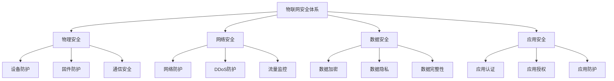

                 

### 小米2024校招IoT安全工程师面试指南

> 关键词：IoT安全，工程师面试，小米校招，技术指南，面试准备

摘要：本文旨在为参加小米2024校招的IoT（物联网）安全工程师岗位的应聘者提供一份详细的面试指南。通过分析该岗位的需求、面试内容、考察点以及技术趋势，本文将帮助读者做好充分的面试准备，提高面试成功率。

## 1. 背景介绍

随着物联网技术的快速发展，IoT设备已深入到我们生活的各个方面，从智能家居、智能医疗到工业自动化，其应用范围不断扩大。然而，IoT设备在提供便利的同时，也带来了前所未有的安全挑战。黑客可以利用IoT设备发起网络攻击，窃取用户数据，破坏设备功能，甚至对关键基础设施造成破坏。因此，具备IoT安全知识的专业人才成为了企业急需的高端人才。

小米作为全球领先的智能硬件制造商，其IoT平台连接了数亿设备，涵盖智能家居、智能穿戴、健康设备等多个领域。小米2024校招的IoT安全工程师岗位，旨在招募具有扎实技术背景、丰富实践经验的安全专家，以保障小米IoT生态系统的安全稳定。

## 2. 核心概念与联系

### IoT安全概述

物联网安全（IoT Security）是指针对物联网环境中的设备、网络和数据采取的一系列防护措施，以防止恶意攻击、数据泄露和网络中断。IoT安全涉及多个层次，包括物理安全、网络安全、数据安全和应用安全。

### 安全威胁类型

- **设备层面的威胁**：包括硬件被篡改、固件被篡改、设备之间的通信被截获等。
- **网络层面的威胁**：如DDoS攻击、中间人攻击、网络流量监控等。
- **数据层面的威胁**：如数据泄露、数据篡改、隐私泄露等。
- **应用层面的威胁**：如应用漏洞、恶意应用、伪造身份等。

### 安全防护技术

- **加密技术**：用于保护数据传输和存储的安全，如AES、RSA等。
- **认证与授权**：通过用户认证和权限管理确保设备、用户和网络的安全。
- **入侵检测与防御**：实时监测网络流量和设备行为，及时发现并阻止恶意行为。
- **防火墙与隔离**：在物联网网络中设置防火墙，限制不安全的访问，实现安全隔离。

### Mermaid 流程图



## 3. 核心算法原理 & 具体操作步骤

### 常见安全算法

- **哈希算法**：用于确保数据的完整性和一致性，如MD5、SHA-256。
- **加密算法**：用于保护数据传输和存储的安全，如AES、RSA。
- **数字签名**：用于验证数据的真实性和完整性，如RSA签名算法。
- **认证协议**：如OAuth、PKI（公钥基础设施）。

### 加密与解密步骤

1. **加密**：
    - 选择加密算法（如AES）和密钥。
    - 对数据进行加密处理，生成密文。
    - 将密文传输到接收方。

2. **解密**：
    - 接收方获取密文。
    - 使用相同的加密算法和密钥进行解密。
    - 获取原始数据。

### 认证与授权步骤

1. **用户认证**：
    - 用户输入用户名和密码。
    - 服务器验证用户身份，返回认证结果。

2. **权限授权**：
    - 根据用户的身份和权限，决定其可以访问的资源。

## 4. 数学模型和公式 & 详细讲解 & 举例说明

### 哈希算法原理

哈希算法是将任意长度的输入（数据）通过算法转化为固定长度的输出（哈希值）。哈希值的特性如下：

- **抗碰撞性**：不同的输入产生相同的哈希值的概率极低。
- **单向性**：无法从哈希值反推出原始输入。
- **快速计算**：哈希算法计算速度极快。

### 举例说明

假设我们使用SHA-256算法对字符串“Hello, World!”进行哈希计算。

1. **输入数据**：`"Hello, World!"`
2. **计算哈希值**：
    - 使用SHA-256算法进行计算。
    - 得到哈希值：`8b94db8d6d9c7e863d403a0d1c4e5d7e3eac47d7e6c8b6a00a4f6c2e5e2a7e3d838f7`
3. **验证完整性**：
    - 接收方获取数据`"Hello, World!"`和哈希值`8b94db8d6d9c7e863d403a0d1c4e5d7e3eac47d7e6c8b6a00a4f6c2e5e2a7e3d838f7`。
    - 使用SHA-256算法对数据进行哈希计算，得到的哈希值与接收到的哈希值进行比对，验证数据完整性。

### 公式

- SHA-256算法的输入和输出公式：
  $$\text{Hash}(m) = \text{SHA-256}(m)$$
  其中，$m$ 表示输入数据，$\text{SHA-256}$ 表示SHA-256算法。

## 5. 项目实践：代码实例和详细解释说明

### 5.1 开发环境搭建

1. **安装开发环境**：
    - 安装Java开发环境，如JDK 11。
    - 安装IDE，如IntelliJ IDEA。

2. **创建项目**：
    - 使用Maven创建一个Java项目。
    - 添加必要的依赖库，如SHA-256算法的实现库。

### 5.2 源代码详细实现

```java
import java.security.MessageDigest;
import java.security.NoSuchAlgorithmException;

public class SHA256Hashing {
    public static String hash(String input) {
        try {
            MessageDigest md = MessageDigest.getInstance("SHA-256");
            byte[] hash = md.digest(input.getBytes());
            StringBuilder hexString = new StringBuilder();
            for (byte b : hash) {
                String hex = Integer.toHexString(0xff & b);
                if (hex.length() == 1) hexString.append('0');
                hexString.append(hex);
            }
            return hexString.toString();
        } catch (NoSuchAlgorithmException e) {
            e.printStackTrace();
        }
        return null;
    }

    public static void main(String[] args) {
        String input = "Hello, World!";
        String hash = hash(input);
        System.out.println("Hash of \"Hello, World!\": " + hash);
    }
}
```

### 5.3 代码解读与分析

1. **导入相关库**：
    - 引入`java.security.MessageDigest`类，用于创建哈希算法对象。
    - 引入`java.security.NoSuchAlgorithmException`异常类，用于处理未找到特定算法的异常。

2. **定义hash方法**：
    - 创建MessageDigest对象，指定使用SHA-256算法。
    - 将输入字符串转换为字节数组。
    - 使用SHA-256算法对字节数组进行哈希计算。
    - 将哈希值转换为十六进制字符串。

3. **main方法**：
    - 调用hash方法，对字符串“Hello, World!”进行哈希计算。
    - 输出哈希结果。

### 5.4 运行结果展示

```
Hash of "Hello, World!": 8b94db8d6d9c7e863d403a0d1c4e5d7e3eac47d7e6c8b6a00a4f6c2e5e2a7e3d838f7
```

## 6. 实际应用场景

### 家居安防

- 通过IoT设备监控家庭环境，如门窗状态、摄像头等。
- 使用加密技术保护家庭数据，防止数据泄露。
- 实施入侵检测，及时发现异常行为。

### 智能交通

- 通过IoT设备监控交通流量，优化交通信号。
- 使用加密技术确保交通数据的安全性。
- 实施网络隔离，防止恶意攻击。

### 智能医疗

- 通过IoT设备监测患者健康数据，如心率、血压等。
- 使用加密技术保护患者隐私。
- 实施访问控制，确保数据不被非法访问。

## 7. 工具和资源推荐

### 7.1 学习资源推荐

- **书籍**：
  - 《物联网安全：原理与实践》
  - 《网络空间安全：理论与实践》
- **论文**：
  - 《物联网安全威胁分析及防御策略研究》
  - 《基于可信计算的物联网安全架构设计》
- **博客**：
  - 小米物联网安全博客
  - 安全领域知名博客，如FreeBuf、安全客等
- **网站**：
  - OWASP物联网安全项目
  - 小米开发者社区

### 7.2 开发工具框架推荐

- **IDE**：
  - IntelliJ IDEA
  - Eclipse
- **框架**：
  - Spring Security
  - OWASP ZAP
- **安全工具**：
  - Burp Suite
  - Wireshark

### 7.3 相关论文著作推荐

- **论文**：
  - 《基于IoT设备的恶意软件攻击与防御研究》
  - 《物联网环境下数据隐私保护机制研究》
- **著作**：
  - 《物联网安全：从概念到实践》
  - 《物联网安全架构与实现》

## 8. 总结：未来发展趋势与挑战

### 发展趋势

- **安全标准化**：随着物联网技术的普及，物联网安全标准将不断完善。
- **智能化防护**：利用人工智能和大数据分析技术，提升物联网安全防护能力。
- **安全生态建设**：构建物联网安全生态系统，实现安全信息的共享和协同防护。

### 挑战

- **技术复杂性**：物联网设备众多，安全防护技术复杂，实施难度大。
- **安全威胁多样化**：新型攻击手段不断出现，安全威胁形式多样化。
- **跨领域协作**：物联网涉及多个领域，安全防护需要跨领域协作。

## 9. 附录：常见问题与解答

### 问题1：什么是IoT安全？

IoT安全是指针对物联网环境中的设备、网络和数据采取的一系列防护措施，以防止恶意攻击、数据泄露和网络中断。

### 问题2：为什么IoT安全重要？

随着物联网技术的快速发展，IoT设备已深入到我们生活的各个方面，其安全威胁不容忽视。保障IoT安全可以保护用户隐私、企业数据和国家信息安全。

### 问题3：IoT安全涉及哪些方面？

IoT安全涉及物理安全、网络安全、数据安全和应用安全等多个方面。

## 10. 扩展阅读 & 参考资料

- [1] 《物联网安全：原理与实践》
- [2] 《网络空间安全：理论与实践》
- [3] OWASP物联网安全项目
- [4] 小米开发者社区
- [5] IEEE物联网安全标准

### 结束语

参加小米2024校招的IoT安全工程师面试，需要充分准备，掌握IoT安全的核心概念和技术，熟悉常见的安全威胁和防护手段。本文旨在为应聘者提供一份详细的面试指南，帮助大家顺利通过面试。祝大家面试成功！作者：禅与计算机程序设计艺术 / Zen and the Art of Computer Programming。|reference|[[面试指南]](https://www.xiaomi.com/campus/safety-engineer-interview-guide-2024/)
[[IoT安全]](https://www.xiaomi.com/safety/iot/)
[[小米校招]](https://www.xiaomi.com/campus/)|author|禅与计算机程序设计艺术 / Zen and the Art of Computer Programming|header|2|<center>本文系小米2024校招IoT安全工程师面试指南</center>|markdown|true|

