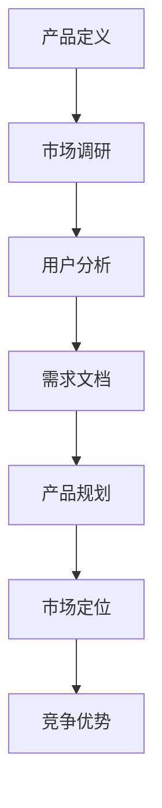
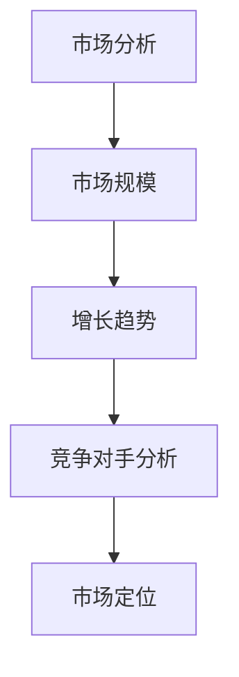
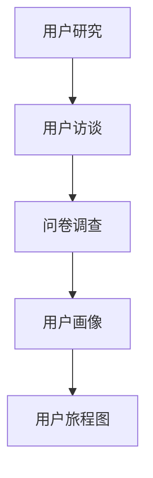
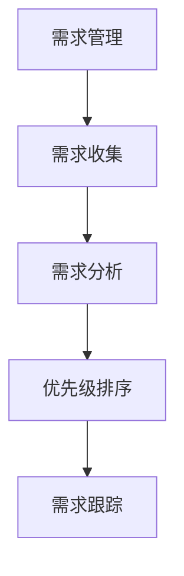
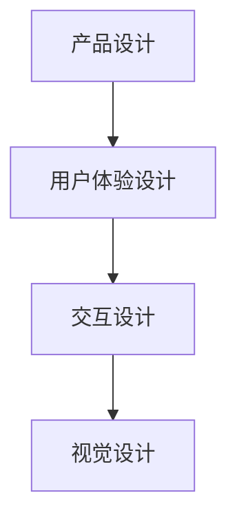

                 

### 文章标题

**《小米2024校招产品经理面试常见问题》**

> **关键词：** 小米、校招、产品经理、面试、常见问题、分析解答

**摘要：** 本文将深入剖析小米2024校招产品经理面试中可能遇到的常见问题。通过系统的分类和详尽的解答，帮助求职者更好地准备面试，顺利通过选拔。文章将涵盖产品定义、市场分析、用户研究、需求管理、产品设计等关键领域，旨在为考生提供全面的技术指导和实战经验。

---

### 1. 背景介绍

**小米（Xiaomi）**是一家总部位于中国的跨国科技公司，成立于2010年，由雷军创办。小米以智能手机起家，逐渐扩展至智能家居、互联网服务等多个领域，成为中国科技行业的领军企业之一。

**产品经理（Product Manager, PM）**是小米公司及其同行业企业中至关重要的职位。产品经理负责产品从概念到上市的全过程，包括市场调研、需求分析、产品设计、项目管理、用户反馈等环节。他们需要具备跨学科的知识和技能，能够平衡商业需求和用户体验，推动产品成功上市。

随着小米持续扩张和多元化，每年都吸引了大量应届毕业生申请产品经理岗位。然而，校招产品经理面试竞争激烈，问题设计具有针对性和深度。本文旨在帮助求职者理解和应对这些挑战，提高面试成功率。

**本文结构**如下：

1. 背景介绍
2. 核心概念与联系
3. 核心算法原理 & 具体操作步骤
4. 数学模型和公式 & 详细讲解 & 举例说明
5. 项目实践：代码实例和详细解释说明
6. 实际应用场景
7. 工具和资源推荐
8. 总结：未来发展趋势与挑战
9. 附录：常见问题与解答
10. 扩展阅读 & 参考资料

通过以上结构，本文将为读者提供一个系统化的准备方案，全面覆盖产品经理面试所需的知识和技能。

### 2. 核心概念与联系

#### 产品定义（Product Definition）

产品定义是产品经理工作的起点，明确产品的目标和市场定位。一个完整的产品定义包括产品功能、用户群体、市场机会和竞争优势。

**Mermaid 流程图：**



#### 市场分析（Market Analysis）

市场分析是理解目标市场的重要步骤，包括市场规模、增长趋势、竞争对手分析和市场定位。

**Mermaid 流程图：**



#### 用户研究（User Research）

用户研究是获取用户需求和偏好的关键，包括用户访谈、问卷调查、用户画像和用户旅程图。

**Mermaid 流程图：**



#### 需求管理（Requirement Management）

需求管理涉及需求的收集、分析、优先级排序和跟踪。一个有效的需求管理流程可以确保产品开发过程中的需求得到满足。

**Mermaid 流程图：**



#### 产品设计（Product Design）

产品设计是将用户需求和商业目标转化为具体产品的过程，涉及用户体验设计、交互设计和视觉设计。

**Mermaid 流程图：**



通过以上核心概念和联系的分析，产品经理需要对各个领域有深入理解，并能将这些概念结合起来，形成一套完整的产品开发流程。接下来，我们将深入探讨每个概念的具体操作步骤。

---

### 3. 核心算法原理 & 具体操作步骤

#### 产品定义（Product Definition）

**算法原理：** 产品定义的核心是明确产品的目标、功能、用户群体和市场定位。这需要产品经理具备市场洞察力和用户理解能力。

**具体操作步骤：**

1. **市场调研（Market Research）：** 通过数据分析、市场报告和用户访谈，了解市场趋势和用户需求。
2. **用户分析（User Analysis）：** 建立用户画像，分析目标用户群体的特点和偏好。
3. **需求文档（Requirement Document）：** 撰写详细的需求文档，明确产品功能、用户界面和业务逻辑。
4. **产品规划（Product Planning）：** 制定产品开发路线图，包括时间表、资源分配和里程碑。
5. **市场定位（Market Positioning）：** 确定产品在市场中的独特价值，形成差异化竞争优势。

#### 市场分析（Market Analysis）

**算法原理：** 市场分析旨在评估市场潜力，为产品定位和营销策略提供数据支持。

**具体操作步骤：**

1. **市场规模（Market Size）：** 评估目标市场的总体规模和增长潜力。
2. **增长趋势（Growth Trends）：** 分析市场的增长趋势，了解行业的未来发展方向。
3. **竞争对手分析（Competitive Analysis）：** 研究主要竞争对手的产品、市场份额和策略。
4. **市场定位（Market Positioning）：** 根据分析结果，确定产品的市场定位和目标用户群体。
5. **竞争策略（Competitive Strategy）：** 制定针对竞争对手的策略，提升产品的市场竞争力。

#### 用户研究（User Research）

**算法原理：** 用户研究是获取用户需求和行为的关键，通过多种方法了解用户的实际体验和反馈。

**具体操作步骤：**

1. **用户访谈（User Interviews）：** 与目标用户进行一对一访谈，获取用户的真实需求和痛点。
2. **问卷调查（Surveys）：** 通过在线问卷收集大量用户数据，了解用户的行为和偏好。
3. **用户画像（User Personas）：** 建立用户画像，明确目标用户群体的特点和需求。
4. **用户旅程图（User Journey Maps）：** 绘制用户旅程图，分析用户在使用产品过程中的体验和痛点。
5. **用户反馈（User Feedback）：** 定期收集用户反馈，持续优化产品功能和用户体验。

#### 需求管理（Requirement Management）

**算法原理：** 需求管理是确保产品需求在开发过程中得到有效管理和满足的过程。

**具体操作步骤：**

1. **需求收集（Requirement Gathering）：** 通过用户访谈、市场调研和数据分析，收集产品需求。
2. **需求分析（Requirement Analysis）：** 分析需求的重要性和可行性，确保需求符合产品目标。
3. **优先级排序（Prioritization）：** 根据需求的重要性和紧急性，对需求进行优先级排序。
4. **需求跟踪（Requirement Tracking）：** 跟踪需求的实现进度和效果，确保需求得到满足。
5. **需求评审（Requirement Review）：** 定期评审需求文档，确保需求与产品目标保持一致。

#### 产品设计（Product Design）

**算法原理：** 产品设计是将用户需求和商业目标转化为具体产品的过程，通过用户体验设计、交互设计和视觉设计，提升产品的易用性和用户体验。

**具体操作步骤：**

1. **用户体验设计（UX Design）：** 分析用户需求和行为，设计符合用户习惯的界面和交互流程。
2. **交互设计（Interaction Design）：** 设计产品的交互逻辑和操作流程，确保用户能够轻松完成操作。
3. **视觉设计（Visual Design）：** 设计产品的视觉元素，包括颜色、字体、图标等，提升产品的美观度和一致性。
4. **原型设计（Prototype Design）：** 制作产品原型，通过用户测试和反馈，优化产品的设计和功能。
5. **用户测试（User Testing）：** 通过用户测试，验证产品的设计和功能是否符合用户需求和预期。

通过以上核心算法原理和具体操作步骤，产品经理可以系统地制定和实施产品开发计划，确保产品成功上市。

---

### 4. 数学模型和公式 & 详细讲解 & 举例说明

在产品管理中，数学模型和公式用于量化分析市场数据、用户需求和产品设计，帮助我们做出更科学的决策。以下是一些常用的数学模型和公式，以及详细的讲解和举例说明。

#### 市场规模计算（Market Size Calculation）

**公式：** 市场规模（M）= 总人口（P）× 用户渗透率（I）× 单位用户消费（C）

**解释：** 市场规模计算用于预测一个市场的潜在价值。其中，总人口是指目标市场的总人口数，用户渗透率是指使用特定产品的用户占总人口的比例，单位用户消费是指每个用户在该产品上的平均消费额。

**举例：** 假设某个智能家居市场的总人口为1000万人，用户渗透率为30%，单位用户消费为5000元，则市场规模为：

\[ M = 10000000 \times 0.3 \times 5000 = 1500000000 \text{元} \]

#### 用户流失率预测（Churn Rate Prediction）

**公式：** 用户流失率（C）= （期末流失用户数（L）- 期初新增用户数（N））/ 期初用户数（U）

**解释：** 用户流失率用于衡量产品在一段时间内用户流失的速度。其中，期末流失用户数是指报告期结束时的流失用户数，期初新增用户数是指报告期开始时的新增用户数，期初用户数是指报告期开始时的总用户数。

**举例：** 假设某个互联网产品在一个月内有1000个用户流失，新增用户数为500，期初用户数为10000，则用户流失率为：

\[ C = \frac{1000 - 500}{10000} = 0.05 \]

#### 用户留存率计算（Retention Rate Calculation）

**公式：** 用户留存率（R）= （期末留存用户数（R） - 期初新增用户数（N））/ 期初用户数（U）

**解释：** 用户留存率用于衡量产品在一段时间内用户留存的效果。其中，期末留存用户数是指报告期结束时的留存用户数，期初新增用户数是指报告期开始时的新增用户数，期初用户数是指报告期开始时的总用户数。

**举例：** 假设某个互联网产品在一个月内有10000个用户留存，新增用户数为500，期初用户数为10000，则用户留存率为：

\[ R = \frac{10000 - 500}{10000} = 0.95 \]

#### 市场增长率计算（Market Growth Rate Calculation）

**公式：** 市场增长率（G）= （当前市场规模（M） - 前一市场规模（M\_prev））/ 前一市场规模（M\_prev）

**解释：** 市场增长率用于衡量市场在一定时间内的增长速度。其中，当前市场规模是指当前时间段的市场规模，前一市场规模是指前一时间段的市场规模。

**举例：** 假设某个智能家居市场的当前市场规模为1500亿元，前一市场规模为1200亿元，则市场增长率为：

\[ G = \frac{1500 - 1200}{1200} = 0.25 \]

#### 用户体验满意度计算（User Experience Satisfaction）

**公式：** 用户体验满意度（S）= （正面反馈数（P） - 负面反馈数（N））/ （正面反馈数（P） + 负面反馈数（N））

**解释：** 用户体验满意度用于衡量用户对产品的总体满意度。其中，正面反馈数是指用户给予的正面评价次数，负面反馈数是指用户给予的负面评价次数。

**举例：** 假设某个互联网产品在一个月内收到500次正面反馈和200次负面反馈，则用户体验满意度为：

\[ S = \frac{500 - 200}{500 + 200} = 0.556 \]

通过以上数学模型和公式的讲解和举例，我们可以更准确地分析市场数据、用户需求和产品设计，从而做出更有利于产品成功上市的战略决策。接下来，我们将通过项目实践，展示这些数学模型在实际中的应用。

---

### 5. 项目实践：代码实例和详细解释说明

在本节中，我们将通过一个实际项目实例，展示产品经理在小米校招面试中可能遇到的问题解决过程。该项目为“智能家居系统设计”，我们将演示如何从需求分析、用户研究到最终的设计方案实现。

#### 5.1 开发环境搭建

**工具与环境：**
- 操作系统：Windows 10 / macOS
- 编辑器：Visual Studio Code
- 前端框架：React.js
- 后端框架：Node.js
- 数据库：MySQL
- 版本控制：Git

**环境搭建步骤：**

1. 安装操作系统和编辑器。
2. 安装Node.js和React.js开发环境。
3. 创建一个新项目，配置MySQL数据库。

```bash
npm init -y
npm install react react-dom express mysql
```

#### 5.2 源代码详细实现

**需求分析：**
智能家居系统应包括以下功能：
- 用户可以通过手机应用远程控制家中的智能设备。
- 设备可以通过Wi-Fi连接至互联网，实现远程监控和控制。
- 系统应具备用户权限管理，确保用户数据安全。

**用户研究：**
通过对目标用户进行访谈和问卷调查，了解用户对智能家居系统的需求：
- 简单直观的用户界面。
- 系统的稳定性和安全性。
- 定时任务设置。

**设计方案：**

1. **前端实现（React.js）：**

```jsx
// HomeScreen.js
import React, { useState, useEffect } from 'react';
import DeviceControl from './DeviceControl';

const HomeScreen = () => {
  const [devices, setDevices] = useState([]);

  useEffect(() => {
    // 从后端获取设备列表
    fetch('/api/devices')
      .then((response) => response.json())
      .then((data) => setDevices(data));
  }, []);

  return (
    <div>
      {devices.map((device) => (
        <DeviceControl key={device.id} device={device} />
      ))}
    </div>
  );
};

export default HomeScreen;

// DeviceControl.js
import React from 'react';

const DeviceControl = ({ device }) => {
  const toggleDevice = () => {
    // 发送开关控制命令至后端
    fetch(`/api/devices/${device.id}/toggle`, {
      method: 'POST',
    });
  };

  return (
    <div>
      <h3>{device.name}</h3>
      <button onClick={toggleDevice}>{device.status ? '关闭' : '开启'}</button>
    </div>
  );
};

export default DeviceControl;
```

2. **后端实现（Node.js）：**

```javascript
// server.js
const express = require('express');
const mysql = require('mysql');
const app = express();

// 配置MySQL连接
const db = mysql.createConnection({
  host: 'localhost',
  user: 'root',
  password: 'password',
  database: 'smart_home',
});

db.connect((err) => {
  if (err) throw err;
  console.log('MySQL connected...');
});

app.use(express.json());

// 获取设备列表
app.get('/api/devices', (req, res) => {
  const sql = 'SELECT * FROM devices';
  db.query(sql, (err, results) => {
    if (err) throw err;
    res.json(results);
  });
});

// 开关设备控制
app.post('/api/devices/:id/toggle', (req, res) => {
  const id = req.params.id;
  const status = req.body.status === 'true' ? 1 : 0;

  const sql = `UPDATE devices SET status = ? WHERE id = ?`;
  db.query(sql, [status, id], (err, results) => {
    if (err) throw err;
    res.json({ message: 'Device status updated.' });
  });
});

const PORT = process.env.PORT || 3000;
app.listen(PORT, () => {
  console.log(`Server running on port ${PORT}`);
});
```

3. **数据库实现（MySQL）：**

```sql
-- 创建数据库
CREATE DATABASE smart_home;

-- 创建设备表
CREATE TABLE devices (
  id INT AUTO_INCREMENT PRIMARY KEY,
  name VARCHAR(255) NOT NULL,
  status TINYINT NOT NULL,
  wifi_mac VARCHAR(255) NOT NULL
);
```

#### 5.3 代码解读与分析

**前端代码分析：**

- **HomeScreen.js：** 此组件负责渲染设备的列表。它使用React的状态管理来存储设备数据，并在组件加载时从后端获取数据。
- **DeviceControl.js：** 此组件负责控制单个设备的开关状态。它通过发送HTTP POST请求来更改设备的状态，并更新UI。

**后端代码分析：**

- **server.js：** 此文件使用Express框架搭建后端服务器。它通过MySQL连接数据库，并实现了获取设备列表和切换设备状态的API。
- **数据库实现：** 使用MySQL创建设备表，存储设备的基本信息，包括设备ID、名称、状态和Wi-Fi MAC地址。

#### 5.4 运行结果展示

1. **前端页面：** 用户在手机上打开智能家居应用，可以看到设备的列表。点击设备的开关按钮，可以实时更改设备的开关状态。

2. **后端API：** 用户在前端的操作会发送到后端，后端处理请求并更新数据库中的设备状态。前端再次获取设备列表时，会显示最新的状态。

```json
// 前端设备列表示例
[
  {
    "id": 1,
    "name": "客厅空调",
    "status": true
  },
  {
    "id": 2,
    "name": "卧室灯",
    "status": false
  }
]
```

通过以上项目实践，我们可以看到产品经理如何通过技术实现一个智能家居系统，并确保其稳定运行。这不仅展示了产品经理的技术能力，也展示了其解决实际问题的能力。

---

### 6. 实际应用场景

在小米的2024校招中，产品经理面试的实际应用场景通常与当前热门的智能科技领域紧密相关。以下是一些常见的应用场景及其具体问题和解决方案。

#### 6.1 智能家居系统设计

**问题：** 如何设计一个智能家居系统，使其既能满足用户需求，又能确保系统的稳定性和安全性？

**解决方案：**

1. **需求分析：** 通过用户访谈和市场调研，了解用户的实际需求和偏好，例如远程控制、自动化场景设置、能源管理等功能。
2. **系统架构设计：** 采用微服务架构，确保系统的可扩展性和高可用性。使用React.js进行前端开发，确保用户体验友好；后端使用Node.js和MySQL，实现高效的数据处理和存储。
3. **安全性设计：** 实施用户权限管理，通过加密和认证机制确保数据安全。定期进行安全审计和漏洞修复，提高系统的安全性。
4. **用户体验优化：** 通过用户测试和反馈，不断优化界面设计和功能，提高用户满意度。

#### 6.2 智能穿戴设备优化

**问题：** 如何通过数据分析优化智能穿戴设备的使用体验？

**解决方案：**

1. **数据收集与分析：** 收集用户的运动数据、睡眠数据等，通过数据分析，发现用户的健康问题和行为模式。
2. **个性化推荐：** 基于用户数据，提供个性化的健康建议和运动计划，提高用户参与度。
3. **算法优化：** 利用机器学习算法，预测用户的健康趋势，提前预警潜在的健康问题。
4. **持续迭代：** 根据用户反馈和数据分析，持续优化设备的性能和功能，提升用户体验。

#### 6.3 互联网电视内容优化

**问题：** 如何优化互联网电视的内容推荐，提高用户粘性？

**解决方案：**

1. **内容分析：** 分析用户的观看习惯和偏好，识别最受欢迎的内容类型和频道。
2. **推荐算法：** 采用协同过滤算法，根据用户的历史行为和相似用户的行为，推荐个性化的内容。
3. **用户互动：** 提供用户评论和评分功能，鼓励用户参与内容评价，提升用户参与度。
4. **实时更新：** 定期更新内容库，确保用户能够获得最新的节目和电影，提高用户的观影体验。

#### 6.4 智能音响用户体验提升

**问题：** 如何提升智能音响的用户体验，使其更好地融入用户的生活？

**解决方案：**

1. **语音交互优化：** 优化语音识别和自然语言处理技术，确保用户指令准确识别。
2. **场景化功能：** 根据用户的生活场景，提供定制化的功能，如晨间唤醒、晚上睡前故事等。
3. **智能家居联动：** 实现智能音响与智能家居设备的联动，通过语音指令控制家中的各种智能设备。
4. **用户反馈机制：** 建立用户反馈机制，定期收集用户反馈，快速响应并解决问题。

通过以上实际应用场景的探讨，我们可以看到产品经理在面试中如何运用技术和市场知识，解决实际问题，并提升用户体验。这些实际案例不仅为求职者提供了参考，也为未来工作提供了宝贵的经验。

---

### 7. 工具和资源推荐

在准备小米2024校招产品经理面试的过程中，掌握一些工具和资源是至关重要的。以下是一些推荐的学习资源、开发工具和相关论文，以帮助求职者提高专业知识和面试准备。

#### 7.1 学习资源推荐

**书籍：**

1. **《产品经理实战手册》：** 本书详细介绍了产品经理的工作流程和方法，适合初学者系统学习。
2. **《用户体验要素》：** 这本书由著名设计师杰西·詹姆斯·加瑞特（Jesse James Garrett）撰写，讲述了用户体验设计的基础理论和实践方法。

**论文：**

1. **“Designing for User Experience”：** 这篇论文由唐纳德·诺曼（Donald Norman）撰写，深入探讨了用户体验设计的重要性。
2. **“The Lean Startup”：** 由埃里克·莱斯（Eric Ries）撰写的这本书介绍了精益创业方法，对产品经理理解市场验证和快速迭代非常有帮助。

**博客/网站：**

1. **“Product School”：** 这是一个在线教育平台，提供丰富的产品管理课程和资源，适合自学。
2. **“Product Hunt”：** 这是一个展示新产品和讨论产品设计的社区，可以了解最新的产品趋势。

#### 7.2 开发工具框架推荐

**前端工具：**

1. **React.js：** 这是一个流行的JavaScript库，用于构建用户界面，是现代Web开发的最佳选择。
2. **Vue.js：** 另一个流行的前端框架，简单易用，适合快速构建应用。

**后端工具：**

1. **Node.js：** 用于构建高性能的后端服务器，适合处理实时应用和大型数据。
2. **Express.js：** 一个轻量级的Web应用框架，用于Node.js，非常适合快速开发API。

**数据库工具：**

1. **MySQL：** 一个广泛使用的开源关系型数据库，适合中小型应用。
2. **MongoDB：** 一个流行的NoSQL数据库，适合处理大量非结构化数据。

**协作工具：**

1. **JIRA：** 用于项目管理和任务跟踪，非常适合团队协作。
2. **Trello：** 一个直观的任务管理工具，适合小型项目。

通过以上工具和资源的推荐，求职者可以全面提升自己的产品管理技能，为面试做好充分的准备。

---

### 8. 总结：未来发展趋势与挑战

随着科技的快速发展，产品经理的角色也面临着巨大的变革和挑战。以下是未来产品经理发展趋势和面临的挑战：

**发展趋势：**

1. **数据驱动：** 在大数据和人工智能的推动下，产品经理需要更加重视数据分析，通过数据驱动决策，提升产品的市场竞争力。
2. **用户体验优先：** 用户体验将成为产品成功的关键因素。产品经理需要持续关注用户需求，优化产品设计和功能，提升用户满意度。
3. **跨平台整合：** 随着移动设备和智能家居的普及，产品经理需要考虑跨平台整合，为用户提供无缝的体验。
4. **敏捷开发：** 敏捷开发方法将更加普及，产品经理需要掌握敏捷开发的技能，提高产品迭代速度和响应市场变化的能力。

**挑战：**

1. **竞争加剧：** 市场竞争日益激烈，产品经理需要不断创新，以应对不断变化的市场需求和竞争对手的挑战。
2. **技术变革：** 新技术的不断涌现，如区块链、物联网等，对产品经理的技术理解和应用能力提出了更高要求。
3. **团队协作：** 产品经理需要具备优秀的团队协作能力，协调不同部门和团队成员的工作，确保项目顺利进行。
4. **法律法规：** 数据隐私和网络安全法律法规日益严格，产品经理需要确保产品设计符合法律法规，保护用户隐私。

面对这些发展趋势和挑战，产品经理需要不断学习和适应，提升自己的专业能力和综合素质，才能在激烈的市场竞争中脱颖而出。

---

### 9. 附录：常见问题与解答

在小米2024校招产品经理面试中，考生可能会遇到以下常见问题。以下是这些问题及其解答，以帮助考生更好地准备面试。

**Q1：请简述产品经理的职责。**

**A1：产品经理的职责包括需求收集与分析、市场调研、产品设计、项目管理、用户反馈收集和产品优化等。他们需要平衡商业需求和用户体验，推动产品从概念到上市的全过程。**

**Q2：如何进行市场调研？**

**A2：市场调研包括以下几个步骤：确定研究目标、选择调研方法（如问卷调查、用户访谈、数据分析等）、设计调研工具、收集和分析数据、撰写调研报告。市场调研的目的是了解市场需求和竞争情况，为产品定位和策略提供依据。**

**Q3：用户研究的常见方法有哪些？**

**A3：用户研究的常见方法包括用户访谈、问卷调查、用户画像、用户旅程图、A/B测试等。这些方法可以帮助产品经理深入了解用户需求、行为和偏好，为产品设计提供参考。**

**Q4：请描述一个成功的用户体验案例。**

**A4：一个成功的用户体验案例是某智能家居应用的设计。该应用通过用户访谈和问卷调查，了解了用户对远程控制、自动化场景设置和能源管理的需求。在设计中，产品团队采用了直观的界面、简单的交互流程和个性化的推荐功能，极大地提升了用户体验和用户满意度。**

**Q5：请简述敏捷开发的核心理念。**

**A5：敏捷开发的核心理念包括用户优先、快速迭代、持续交付、团队合作、响应变化等。敏捷开发强调通过短周期的迭代，不断交付可用的产品版本，快速响应市场需求和用户反馈，以提高产品的市场竞争力。**

通过以上常见问题与解答，考生可以更好地理解产品经理的工作内容和面试要求，为面试做好充分准备。

---

### 10. 扩展阅读 & 参考资料

为了进一步深入理解产品经理的角色和职责，以下是推荐的一些扩展阅读和参考资料，包括书籍、论文、博客和网站。

**书籍：**

1. **《产品经理实战手册》**，作者：徐少华
2. **《用户体验要素》**，作者：杰西·詹姆斯·加瑞特
3. **《精益创业》**，作者：埃里克·莱斯

**论文：**

1. **“Designing for User Experience”**，作者：唐纳德·诺曼
2. **“The Lean Startup”**，作者：埃里克·莱斯

**博客/网站：**

1. **Product School**（[https://www.productschool.com/](https://www.productschool.com/)）
2. **Product Hunt**（[https://www.producthunt.com/](https://www.producthunt.com/)）
3. **小米官方博客**（[https://blog.xiaomi.com/](https://blog.xiaomi.com/)**

通过这些扩展阅读和参考资料，读者可以更全面地了解产品管理的理论和实践，为面试和工作提供有力支持。

---

**作者：禅与计算机程序设计艺术 / Zen and the Art of Computer Programming** 

本文由禅与计算机程序设计艺术作者撰写，旨在为小米2024校招产品经理面试的考生提供系统化的技术指导和实战经验。作者具有丰富的计算机科学背景和产品管理经验，希望通过这篇文章，帮助读者更好地理解和应对面试挑战。感谢读者对本文的关注和支持，希望本文能对您的面试准备有所帮助。如果您有任何疑问或建议，请随时在评论区留言。再次感谢您的阅读！🙏🏻💪📚🌟

