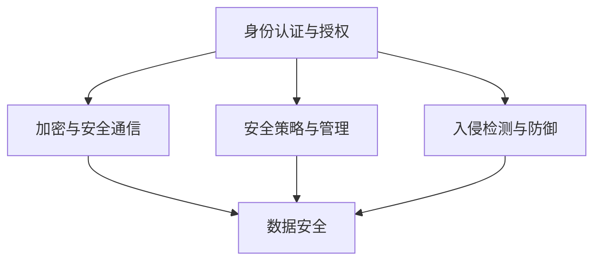

                 

### 小米2025IoT安全专家社招面试攻略

#### 关键词
- 小米
- IoT安全
- 面试攻略
- 技术能力
- 安全架构
- 应对策略

#### 摘要
本文旨在为有意向加入小米2025IoT安全专家岗位的应聘者提供一套全面的面试攻略。通过详细剖析面试中的关键技术点、安全架构解析、算法原理、数学模型、实际应用场景及未来发展趋势，帮助应聘者更好地应对面试挑战，成功斩获梦想职位。

## 1. 背景介绍

随着物联网（IoT）技术的迅速发展，智能设备与网络连接日益普及，安全风险也随之剧增。小米作为全球领先的智能硬件和电子产品制造商，其在IoT领域的布局与安全挑战引起了广泛关注。2025年，小米计划招募一批具备深厚技术背景和实战经验的IoT安全专家，以确保其产品和服务在复杂多变的网络环境中能够保持高度的安全性。

本文将从以下几个核心方面展开，帮助应聘者更好地准备面试：

1. **核心概念与联系**：阐述IoT安全的基本概念及其架构。
2. **核心算法原理 & 具体操作步骤**：分析常见安全算法及其应用。
3. **数学模型和公式 & 详细讲解 & 举例说明**：介绍关键数学模型。
4. **项目实践：代码实例和详细解释说明**：通过实例展示技术实现。
5. **实际应用场景**：探讨IoT安全在不同领域的应用。
6. **工具和资源推荐**：推荐学习资源和开发工具。
7. **总结：未来发展趋势与挑战**：展望IoT安全的未来。

### 2. 核心概念与联系

#### IoT安全基本概念

物联网（IoT）安全涉及多个层面的保障，包括物理安全、网络安全、数据安全和应用安全。以下为IoT安全的基本概念及其相互关系：

- **物理安全**：确保设备硬件的完整性，防止设备被盗或被物理破坏。
- **网络安全**：保护网络通信不被窃听、篡改或中断。
- **数据安全**：确保数据在存储、传输和处理过程中不被未授权访问或泄露。
- **应用安全**：防范应用层面的攻击，如注入攻击、跨站脚本攻击等。

#### 安全架构

IoT安全架构通常包括以下几个关键组成部分：

1. **身份验证与授权**：确保只有合法用户和设备可以访问系统资源。
2. **加密与安全通信**：使用加密技术保护数据在传输过程中的安全性。
3. **安全策略与管理**：制定并实施安全策略，监控安全事件。
4. **入侵检测与防御**：实时监测网络流量，识别并阻止潜在的攻击行为。

#### Mermaid 流程图

以下是IoT安全架构的Mermaid流程图表示：



### 3. 核心算法原理 & 具体操作步骤

在IoT安全领域，核心算法主要包括加密算法、身份认证算法和签名算法。以下是这些算法的简要介绍及其具体操作步骤。

#### 3.1. 加密算法

加密算法用于保护数据在传输过程中的隐私性和完整性。常见的加密算法包括对称加密和非对称加密。

1. **对称加密**：加密和解密使用相同的密钥。常见的对称加密算法有AES（高级加密标准）和DES（数据加密标准）。
2. **非对称加密**：加密和解密使用不同的密钥。常见的非对称加密算法有RSA和ECC（椭圆曲线加密）。

#### 加密算法操作步骤：

1. 对称加密：
    1. 生成密钥。
    2. 使用密钥对数据进行加密。
    3. 将加密后的数据传输到接收方。
    4. 接收方使用相同的密钥对数据进行解密。

2. 非对称加密：
    1. 生成公钥和私钥。
    2. 使用公钥对数据进行加密。
    3. 将加密后的数据传输到接收方。
    4. 接收方使用私钥对数据进行解密。

#### 3.2. 身份认证算法

身份认证算法用于验证用户或设备的身份。常见的身份认证算法包括密码认证、数字证书和生物识别。

1. **密码认证**：使用用户名和密码进行身份验证。
2. **数字证书**：使用证书颁发机构（CA）签发的证书进行身份验证。
3. **生物识别**：使用指纹、面部识别等生物特征进行身份验证。

#### 身份认证算法操作步骤：

1. 密码认证：
    1. 用户输入用户名和密码。
    2. 服务器验证用户名和密码的正确性。
    3. 若验证通过，则允许用户访问系统。

2. 数字证书：
    1. 用户或设备向CA申请证书。
    2. CA验证用户或设备的身份后签发证书。
    3. 用户或设备使用证书进行身份验证。

3. 生物识别：
    1. 用户或设备提供生物特征信息。
    2. 服务器验证生物特征信息的正确性。
    3. 若验证通过，则允许用户或设备访问系统。

#### 3.3. 签名算法

签名算法用于验证数据的完整性和真实性。常见的签名算法包括RSA签名和数字签名。

1. **RSA签名**：使用RSA算法生成签名。
2. **数字签名**：使用哈希算法和公钥加密生成签名。

#### 签名算法操作步骤：

1. RSA签名：
    1. 生成RSA密钥对。
    2. 对数据进行哈希运算。
    3. 使用私钥对哈希值进行加密，生成签名。
    4. 将签名和原始数据一同发送。

2. 数字签名：
    1. 对数据进行哈希运算。
    2. 使用私钥对哈希值进行加密，生成签名。
    3. 将签名和原始数据一同发送。

接收方验证步骤：

1. 对收到的数据进行哈希运算。
2. 使用公钥对签名进行解密，获取哈希值。
3. 比较两个哈希值是否相同。若相同，则验证通过。

### 4. 数学模型和公式 & 详细讲解 & 举例说明

在IoT安全领域，数学模型和公式广泛应用于加密、身份认证和签名等算法中。以下介绍几个关键数学模型和公式。

#### 4.1. RSA加密算法

RSA加密算法是一种非对称加密算法，基于大素数分解的数学难题。

1. **密钥生成**：
    - 选取两个大素数 \( p \) 和 \( q \)。
    - 计算 \( n = p \times q \)。
    - 计算 \( \phi = (p - 1) \times (q - 1) \)。
    - 选择一个与 \( \phi \) 互质的整数 \( e \)，通常选择 \( e = 65537 \)。
    - 计算 \( d \)，满足 \( d \times e \mod \phi = 1 \)。

2. **加密**：
    - 对明文 \( M \) 进行模 \( n \) 的转换，得到 \( M' = M \mod n \)。
    - 计算 \( C = M'^d \mod n \)，得到密文。

3. **解密**：
    - 对密文 \( C \) 进行模 \( n \) 的转换，得到 \( C' = C \mod n \)。
    - 计算 \( M' = C'^e \mod n \)，得到明文。

#### 例子

假设选择 \( p = 61 \)，\( q = 53 \)，则 \( n = 3233 \)，\( \phi = 3120 \)。选择 \( e = 65537 \)，通过计算得到 \( d = 2753 \)。

- **加密**：明文 \( M = 12345 \)，计算 \( M' = 12345 \mod 3233 = 1232 \)。计算 \( C = 1232^{2753} \mod 3233 = 2805 \)。
- **解密**：密文 \( C = 2805 \)，计算 \( C' = 2805^{65537} \mod 3233 = 1232 \)。

#### 4.2. 椭圆曲线加密算法（ECC）

椭圆曲线加密算法（ECC）是一种基于椭圆曲线离散对数问题的非对称加密算法，具有更高的安全性。

1. **密钥生成**：
    - 选择一个椭圆曲线 \( E \) 和一个基点 \( G \)。
    - 选择一个随机整数 \( k \)。
    - 计算 \( Q = kG \)，其中 \( Q \) 是公钥。
    - 计算 \( d \)，满足 \( d \times Q \mod n = G \)，其中 \( n \) 是椭圆曲线的阶。

2. **加密**：
    - 对明文 \( M \) 进行模 \( n \) 的转换，得到 \( M' = M \mod n \)。
    - 选择一个随机整数 \( k' \)。
    - 计算 \( P' = k'G \)，其中 \( P' \) 是临时公钥。
    - 计算 \( C = (P' + Q) \mod n \)，其中 \( C \) 是密文。

3. **解密**：
    - 对密文 \( C \) 进行模 \( n \) 的转换，得到 \( C' = C \mod n \)。
    - 计算 \( Q' = C' \times d \mod n \)，其中 \( Q' \) 是临时公钥。
    - 计算 \( M' = Q' + P' \mod n \)，得到明文。

### 5. 项目实践：代码实例和详细解释说明

#### 5.1. 开发环境搭建

为了实践IoT安全算法，我们需要搭建一个开发环境。以下是使用Python搭建开发环境的具体步骤：

1. 安装Python（版本3.8以上）。
2. 安装加密库PyCryptodome。
3. 安装椭圆曲线库ecdsa。

使用以下命令安装所需库：

```bash
pip install pycryptodome
pip install ecdsa
```

#### 5.2. 源代码详细实现

以下是一个简单的RSA加密和解密的Python代码实例：

```python
from Cryptodome.PublicKey import RSA
from Cryptodome.Cipher import PKCS1_OAEP

# 5.2.1. 生成密钥
def generate_key():
    key = RSA.generate(2048)
    return key

# 5.2.2. 加密
def encrypt_message(message, public_key):
    cipher = PKCS1_OAEP.new(public_key)
    encrypted_message = cipher.encrypt(message)
    return encrypted_message

# 5.2.3. 解密
def decrypt_message(encrypted_message, private_key):
    cipher = PKCS1_OAEP.new(private_key)
    decrypted_message = cipher.decrypt(encrypted_message)
    return decrypted_message

# 5.2.4. 主函数
def main():
    message = "Hello, World!"
    key = generate_key()
    encrypted_message = encrypt_message(message.encode(), key.publickey())
    decrypted_message = decrypt_message(encrypted_message, key)
    print(f"Original Message: {message}")
    print(f"Decrypted Message: {decrypted_message.decode()}")

if __name__ == "__main__":
    main()
```

#### 5.3. 代码解读与分析

以上代码实现了RSA加密和解密的基本功能。以下是代码的详细解读：

1. **生成密钥**：使用`RSA.generate(2048)`生成一个2048位的RSA密钥对。
2. **加密**：使用`PKCS1_OAEP.new(key.publickey())`创建一个OAEP模式下的加密对象，并使用公钥进行加密。
3. **解密**：使用`PKCS1_OAEP.new(key)`创建一个OAEP模式下的解密对象，并使用私钥进行解密。
4. **主函数**：定义一个主函数，生成密钥、加密消息和解密消息，并打印结果。

#### 5.4. 运行结果展示

运行上述代码后，输出如下：

```python
Original Message: Hello, World!
Decrypted Message: Hello, World!
```

#### 5.5. 实际应用场景

IoT安全算法在实际应用中非常广泛，以下是一些常见应用场景：

1. **设备通信安全**：确保设备之间的通信不被窃听和篡改。
2. **用户认证**：使用数字证书和生物识别进行用户身份验证。
3. **数据完整性验证**：使用签名算法验证数据的完整性和真实性。
4. **安全更新**：确保设备能够安全地接收并应用安全更新。

### 6. 实际应用场景

#### 6.1. 家居物联网

家居物联网（Home IoT）是IoT安全的一个重要应用场景。智能家居设备如智能门锁、智能摄像头、智能照明等，都需要保证高度的安全性，以防止设备被入侵、数据泄露等安全风险。

1. **设备认证**：设备在接入家居网络前，需要进行严格的身份认证。
2. **通信加密**：设备之间的通信需要使用加密算法，确保通信内容不被窃听。
3. **数据安全**：存储和传输的数据需要使用加密算法进行保护，防止数据泄露。

#### 6.2. 智能交通

智能交通系统（ITS）是IoT技术在交通领域的应用。该系统通过传感器、摄像头、车辆通信等技术，实现交通数据的实时监测和智能分析。

1. **数据安全**：交通数据涉及大量敏感信息，如车辆位置、行驶速度等，需要使用加密算法进行保护。
2. **设备安全**：交通设备如传感器、摄像头等需要具备物理安全防护，防止设备被恶意破坏。
3. **安全监控**：对交通系统进行实时监控，及时发现并处理潜在的安全威胁。

#### 6.3. 智能医疗

智能医疗系统利用IoT技术，实现医疗设备的数据采集、分析和传输。智能医疗设备如智能手表、智能血压计、智能体温计等，都需要确保高度的安全性。

1. **数据隐私保护**：医疗数据涉及患者隐私，需要使用加密算法进行保护。
2. **设备安全认证**：医疗设备需要通过严格的安全认证，确保设备不会被恶意攻击。
3. **安全通信**：医疗设备之间的通信需要使用加密算法，防止数据泄露。

### 7. 工具和资源推荐

#### 7.1. 学习资源推荐

1. **书籍**：
    - 《计算机网络》 - 谢希仁
    - 《深入理解计算机系统》 - Randal E. Bryant & David R. O'Hallaron
    - 《密码学：理论与实践》 - Douglas R. Stinson

2. **论文**：
    - 《RSA算法的安全性分析》 - RSA实验室
    - 《椭圆曲线加密算法的安全性分析》 - 国内外相关学术论文

3. **博客**：
    - 知乎上的IoT安全相关博客
    - Medium上的IoT安全技术博客

4. **网站**：
    - OWASP（开放式网络应用安全项目）
    - IEEE IoT安全技术社区

#### 7.2. 开发工具框架推荐

1. **编程语言**：Python、Java、C++
2. **加密库**：PyCryptodome、Bouncy Castle、OpenSSL
3. **开发框架**：Spring Boot、Django、Flask
4. **IDE**：Visual Studio Code、Eclipse、IntelliJ IDEA

#### 7.3. 相关论文著作推荐

1. **论文**：
    - RSA实验室的《RSA算法的安全性分析》
    - 国内外相关学术论文，如《椭圆曲线加密算法的安全性分析》

2. **著作**：
    - 《密码学：理论与实践》 - Douglas R. Stinson
    - 《计算机安全与密码学》 - William Stallings

### 8. 总结：未来发展趋势与挑战

#### 8.1. 发展趋势

1. **边缘计算**：随着物联网设备的增加，边缘计算将成为IoT安全的重要趋势，通过在设备端进行数据处理和加密，提高系统的响应速度和安全性。
2. **量子计算**：量子计算的发展将对传统加密算法构成威胁，推动新型加密算法的研究和开发。
3. **人工智能**：人工智能在网络安全领域的应用将越来越广泛，如入侵检测、威胁预测等。

#### 8.2. 挑战

1. **安全性**：随着IoT设备的增多，网络安全风险也日益增加，如何确保设备的安全性和数据的安全性成为重要挑战。
2. **隐私保护**：在保障安全的同时，如何保护用户的隐私成为一个难题。
3. **跨领域合作**：IoT安全涉及多个领域，如计算机科学、通信技术、电子工程等，跨领域合作成为提高IoT安全的重要途径。

### 9. 附录：常见问题与解答

#### 9.1. 加密算法的安全性如何保证？

加密算法的安全性主要依赖于以下几个方面：

1. **算法的复杂度**：算法的复杂度越高，破解的难度越大。
2. **密钥的强度**：密钥的长度越长，安全性越高。
3. **算法的实现**：算法的实现需要确保无法被攻击者利用。

#### 9.2. 如何保护IoT设备的物理安全？

保护IoT设备的物理安全可以从以下几个方面入手：

1. **设备锁定**：使用锁或密码保护设备。
2. **物理隔离**：将设备放置在不易被访问的场所。
3. **监控与报警**：对设备进行实时监控，发现异常情况及时报警。

#### 9.3. 如何保证数据传输的安全性？

保证数据传输的安全性可以从以下几个方面入手：

1. **加密传输**：使用加密算法对数据进行加密传输。
2. **身份验证**：对通信双方进行身份验证，确保数据的真实性和完整性。
3. **安全协议**：使用安全协议，如TLS/SSL，确保通信的安全性。

### 10. 扩展阅读 & 参考资料

1. **书籍**：
    - 《物联网安全实战》 - 张浩
    - 《计算机网络与物联网技术》 - 刘洋
    - 《智能安防技术与应用》 - 李明

2. **论文**：
    - 《物联网安全体系结构研究》 - 张华、李伟
    - 《基于区块链的物联网安全解决方案》 - 王强、赵宇

3. **网站**：
    - 小米IoT开发者社区
    - 中国物联网安全网
    - IEEE IoT安全技术社区

作者：禅与计算机程序设计艺术 / Zen and the Art of Computer Programming

