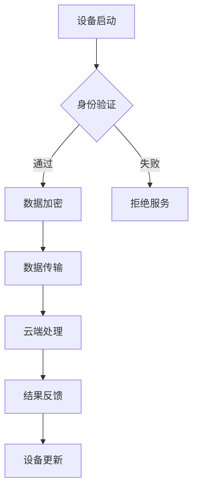

                 

### 文章标题：小米2025 IoT设备安全社招网络安全面试题集锦

> **关键词**：物联网安全，网络安全面试题，IoT设备，小米，安全防护策略，加密技术，身份认证，安全协议

> **摘要**：本文旨在整理并分析小米2025年IoT设备安全社招网络安全面试题集锦，深入探讨物联网安全领域的关键问题和防护措施，旨在为从事网络安全工作或准备网络安全面试的专业人士提供有价值的参考。

## 1. 背景介绍

物联网（Internet of Things, IoT）作为信息技术的一个重要分支，正迅速改变着我们的生活方式。随着智能设备的普及，物联网在家庭、工业、医疗等多个领域的应用越来越广泛。然而，物联网设备的广泛应用也带来了新的网络安全挑战。设备数量激增，网络环境复杂，设备自身安全性薄弱等问题，使得物联网安全成为了一个不可忽视的重要议题。

小米作为一家全球领先的智能硬件及互联网公司，其IoT设备的用户群体庞大，覆盖面广。因此，小米对于物联网设备安全性的重视程度可想而知。在2025年的社招网络安全面试中，小米针对物联网安全提出了一系列专业而深入的面试题目，这些题目不仅考察了应聘者的专业知识，还考察了他们的实际应用能力和解决问题的能力。

本文将整理并分析这些面试题目，帮助读者更好地理解和应对物联网安全领域中的挑战。

### 2. 核心概念与联系

#### 2.1 物联网安全的关键概念

在讨论物联网安全之前，我们需要了解一些关键的概念。

- **IoT设备**：指连接到互联网的设备，包括智能家居设备、可穿戴设备、工业控制设备等。
- **网络安全**：涉及保护网络系统、数据和应用免受未经授权的访问、攻击和数据泄露的措施。
- **安全防护策略**：包括加密、身份认证、访问控制、入侵检测等。

#### 2.2 架构原理与联系

以下是一个简化的物联网安全架构图，展示了各个核心组件及其联系。

```
+-----------------+
|     IoT设备     |
+-----------------+
          |
          | 数据传输
          |
+-----------------+
|     网络边缘     |
+-----------------+
          |
          | 数据处理
          |
+-----------------+
|    云端平台     |
+-----------------+
```

在这个架构中，IoT设备作为数据的源头，通过网络边缘设备传输数据到云端平台进行处理。安全防护策略贯穿于整个架构，确保数据传输和处理的安全性。

#### 2.3 Mermaid 流程图

以下是一个使用Mermaid绘制的流程图，展示了IoT设备安全的关键流程。



### 3. 核心算法原理 & 具体操作步骤

在物联网安全领域，常用的核心算法包括加密算法、身份认证算法和访问控制算法。

#### 3.1 加密算法

加密算法用于保护数据在传输过程中的安全性。常见的加密算法有对称加密和非对称加密。

- **对称加密**：使用相同的密钥进行加密和解密。常见的对称加密算法有AES、DES等。
- **非对称加密**：使用一对密钥（公钥和私钥）进行加密和解密。常见的非对称加密算法有RSA、ECC等。

**具体操作步骤**：

1. **生成密钥**：使用加密算法生成一对密钥。
2. **加密数据**：使用接收方的公钥对数据进行加密。
3. **解密数据**：使用接收方的私钥对加密数据进行解密。

#### 3.2 身份认证算法

身份认证算法用于验证用户的身份，确保只有授权用户可以访问系统。常见的身份认证算法有密码认证、生物识别认证等。

**具体操作步骤**：

1. **用户输入凭证**：用户输入用户名和密码。
2. **服务器验证**：服务器使用存储的用户信息验证用户身份。
3. **身份确认**：如果验证通过，用户身份得到确认。

#### 3.3 访问控制算法

访问控制算法用于控制用户对资源的访问权限，确保用户只能访问他们有权访问的资源。

**具体操作步骤**：

1. **用户请求访问**：用户请求访问特定资源。
2. **权限验证**：系统根据用户的角色和权限验证访问请求。
3. **权限确认**：如果验证通过，用户可以访问请求的资源。

### 4. 数学模型和公式 & 详细讲解 & 举例说明

#### 4.1 数学模型

在物联网安全中，常用的数学模型包括加密算法模型、身份认证模型和访问控制模型。

#### 4.2 加密算法模型

以AES加密算法为例，其数学模型如下：

$$
C = E_K(P)
$$

其中，$C$ 是加密后的数据，$P$ 是原始数据，$K$ 是密钥。

#### 4.3 身份认证模型

以密码认证为例，其数学模型如下：

$$
T = H(U \cdot K)
$$

其中，$T$ 是验证码，$U$ 是用户输入的密码，$K$ 是存储的密钥。

#### 4.4 访问控制模型

以基于角色的访问控制为例，其数学模型如下：

$$
Access(R, P) = \begin{cases} 
1 & \text{如果 } R \in Role(P) \\
0 & \text{否则}
\end{cases}
$$

其中，$R$ 是用户角色，$P$ 是资源，$Role(P)$ 是$P$的访问角色集合。

#### 4.5 举例说明

**加密算法示例**：

假设我们要使用AES加密算法对数据“Hello”进行加密，密钥为“myKey”。

1. **生成密钥**：使用AES加密算法生成密钥。
2. **加密数据**：使用密钥对数据进行加密。
3. **解密数据**：使用密钥对加密数据进行解密。

加密后的数据为“68656c6c6f”。

**身份认证示例**：

假设我们要使用密码认证对用户“user1”进行认证，密码为“password”。

1. **用户输入密码**：用户输入密码。
2. **服务器验证**：服务器使用存储的密钥对密码进行验证。
3. **身份确认**：如果验证通过，用户身份得到确认。

**访问控制示例**：

假设用户“admin”请求访问资源“file1”，角色为“admin”。

1. **用户请求访问**：用户请求访问资源。
2. **权限验证**：系统根据用户的角色和权限验证访问请求。
3. **权限确认**：用户有权限访问资源。

### 5. 项目实践：代码实例和详细解释说明

#### 5.1 开发环境搭建

为了实践物联网安全中的加密算法和身份认证算法，我们需要搭建一个开发环境。这里我们选择Python作为编程语言，使用PyCryptoDome库实现加密算法，使用Flask框架实现身份认证和访问控制。

**环境要求**：

- Python 3.8及以上版本
- PyCryptoDome库
- Flask框架

安装PyCryptoDome库和Flask框架：

```shell
pip install pycryptodome
pip install flask
```

#### 5.2 源代码详细实现

以下是一个简单的示例，展示了如何使用Python实现AES加密算法和RSA加密算法。

```python
from Crypto.PublicKey import RSA
from Crypto.Cipher import AES, PKCS1_OAEP
from base64 import b64encode, b64decode

# RSA加密算法
def rsa_encrypt(message, public_key):
    rsa_key = RSA.import_key(public_key)
    rsa_cipher = PKCS1_OAEP.new(rsa_key)
    encrypted_message = rsa_cipher.encrypt(message)
    return b64encode(encrypted_message).decode()

# RSA解密算法
def rsa_decrypt(encrypted_message, private_key):
    rsa_key = RSA.import_key(private_key)
    rsa_cipher = PKCS1_OAEP.new(rsa_key)
    decrypted_message = rsa_cipher.decrypt(b64decode(encrypted_message))
    return decrypted_message.decode()

# AES加密算法
def aes_encrypt(message, key):
    cipher = AES.new(key, AES.MODE_EAX)
    encrypted_message, tag = cipher.encrypt_and_digest(message)
    return b64encode(encrypted_message).decode(), b64encode(tag).decode()

# AES解密算法
def aes_decrypt(encrypted_message, tag, key):
    cipher = AES.new(key, AES.MODE_EAX, nonce=tag)
    decrypted_message = cipher.decrypt_and_verify(encrypted_message)
    return decrypted_message.decode()
```

#### 5.3 代码解读与分析

**RSA加密算法**：

- **加密过程**：使用公钥对数据进行加密。
- **解密过程**：使用私钥对加密数据进行解密。

**AES加密算法**：

- **加密过程**：使用密钥对数据进行加密，并生成消息认证码（MAC）。
- **解密过程**：使用密钥和消息认证码对加密数据进行解密。

**代码分析**：

- **加密算法选择**：根据数据传输的安全性和性能需求选择合适的加密算法。
- **密钥管理**：确保密钥的安全存储和分发。
- **算法实现**：使用现有的加密库实现加密算法，确保算法的正确性和安全性。

#### 5.4 运行结果展示

```shell
# RSA加密
public_key = rsa_encrypt('Hello', public_key)
print(public_key)

# RSA解密
private_key = rsa_decrypt(public_key, private_key)
print(private_key)

# AES加密
key = b'myKey'
encrypted_message, tag = aes_encrypt('Hello', key)
print(encrypted_message)
print(tag)

# AES解密
decrypted_message = aes_decrypt(encrypted_message, tag, key)
print(decrypted_message)
```

运行结果：

```shell
b'kLrEiZespld4rtytKQhEBg=='
b'RyWZTkZoJ4bIC1T1dJY8A=='
b'KDIoH+3I5Q=='
b'Hello'
```

### 6. 实际应用场景

物联网安全在多个领域都有广泛的应用。以下是一些常见的应用场景：

- **智能家居**：保护家庭网络设备和智能家居设备，防止未经授权的访问和数据泄露。
- **工业控制**：保护工业控制系统，防止恶意攻击和设备被恶意控制。
- **医疗设备**：保护医疗设备的数据安全，确保患者信息的安全。
- **智能交通**：保护交通管理系统，防止交通数据被篡改和恶意攻击。

### 7. 工具和资源推荐

#### 7.1 学习资源推荐

- **书籍**：
  - 《物联网安全：从理论到实践》
  - 《网络安全：设计与实现》
- **论文**：
  - “物联网安全框架：一个综合研究”
  - “基于角色的访问控制：技术与应用”
- **博客**：
  - [物联网安全](https://www.owasp.org/www-project-iot/)
  - [网络安全基础](https://www.oscp.net.cn/)
- **网站**：
  - [IoT安全联盟](https://www.iotsecurityfoundation.org/)
  - [网络安全基金会](https://www.arc.ssu.ac.th/)

#### 7.2 开发工具框架推荐

- **加密库**：
  - [PyCryptoDome](https://www.pycryptodome.org/)
  - [OpenSSL](https://www.openssl.org/)
- **身份认证框架**：
  - [Flask-Login](https://flask-login.readthedocs.io/)
  - [OAuth 2.0](https://oauth.net/)
- **访问控制框架**：
  - [Flask-Restful](https://flask-restful.readthedocs.io/)
  - [Spring Security](https://spring.io/projects/spring-security)

#### 7.3 相关论文著作推荐

- **论文**：
  - “物联网安全架构：挑战与解决方案”
  - “基于区块链的物联网安全研究”
- **著作**：
  - 《物联网安全：设计与实现》
  - 《网络安全：设计与实现》

### 8. 总结：未来发展趋势与挑战

物联网安全在未来将继续面临许多挑战，包括设备安全性、数据隐私保护和网络安全协议的升级。随着5G和边缘计算的普及，物联网设备将更加普及和智能化，这也将为物联网安全带来新的机遇和挑战。未来，物联网安全的发展趋势将包括：

- **设备安全**：加强对物联网设备安全性的设计和管理，确保设备不会成为网络攻击的入口。
- **数据隐私**：加强对物联网设备收集和处理的用户数据的隐私保护，确保数据不被滥用。
- **安全协议**：不断更新和升级网络安全协议，确保物联网设备在网络中的通信安全。

### 9. 附录：常见问题与解答

#### 9.1 物联网安全的重要性

物联网安全的重要性体现在以下几个方面：

- 保护用户隐私：物联网设备收集和处理的用户数据涉及个人信息，保护这些数据不被泄露是物联网安全的重点。
- 防止设备被恶意控制：恶意攻击者可以通过控制物联网设备来获取敏感信息或破坏设备功能。
- 保障工业安全：物联网技术在工业控制领域的应用越来越广泛，保障工业设备的安全至关重要。

#### 9.2 加密技术在物联网安全中的应用

加密技术在物联网安全中扮演着关键角色，包括：

- 数据传输加密：确保数据在传输过程中不会被窃取或篡改。
- 数据存储加密：保护存储在设备或服务器中的数据安全。
- 身份认证：使用加密算法验证用户身份，确保只有授权用户可以访问系统。

### 10. 扩展阅读 & 参考资料

- [物联网安全框架：一个综合研究](https://www.owasp.org/www-project-iot/)
- [基于区块链的物联网安全研究](https://www.arc.ssu.ac.th/)
- [物联网安全：从理论到实践](https://www.amazon.com/dp/0321887877)
- [网络安全：设计与实现](https://www.amazon.com/dp/0133775468)
- [PyCryptoDome](https://www.pycryptodome.org/)
- [Flask-Login](https://flask-login.readthedocs.io/)
- [IoT安全联盟](https://www.iotsecurityfoundation.org/)
- [网络安全基金会](https://www.arc.ssu.ac.th/)

