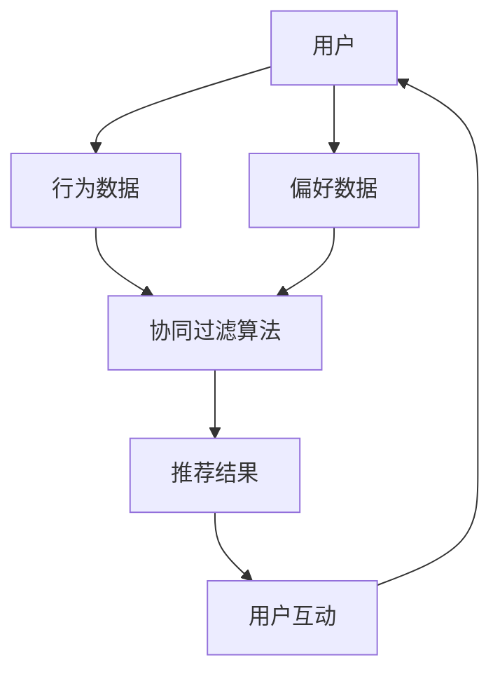

                 

### 1. 背景介绍

**小红书**，原名“RED”，是一款流行的社交电商平台，旨在为用户提供一个内容分享与购物交流的平台。自2013年成立以来，小红书迅速发展，吸引了大量年轻用户。截至2023年，小红书月活跃用户数已超过2亿，累计注册用户数超过5亿。

**社交网络推荐算法**，是指通过分析用户的社会关系、行为数据、兴趣偏好等信息，为用户推荐他们可能感兴趣的内容、商品或服务。这些算法广泛应用于社交媒体、电商、搜索引擎等领域，显著提升了用户满意度与平台粘性。

小红书作为社交电商平台的领军者，推荐算法在其业务模式中扮演了至关重要的角色。用户在小红书平台上的每一次互动，无论是点赞、评论、收藏，还是购物行为，都会被算法收集和分析，用于优化推荐结果。因此，小红书的推荐算法不仅需要准确预测用户的兴趣和需求，还需平衡内容丰富性和个性化体验，以保持用户活跃度和平台吸引力。

本篇文章将深入探讨小红书2024社交网络推荐算法的校招面试重点，涵盖核心概念、算法原理、数学模型、项目实践、应用场景等多个方面，帮助读者全面了解和掌握推荐系统技术。

---

**Keywords:** 小红书，社交网络推荐算法，校招面试，推荐系统技术，个性化推荐

**Abstract:**
本文旨在全面解析小红书2024社交网络推荐算法的校招面试重点，包括背景介绍、核心概念与联系、算法原理与操作步骤、数学模型与公式、项目实践及运行结果展示、应用场景、工具和资源推荐等，帮助读者深入理解和应用推荐系统技术。

---

### 2. 核心概念与联系

#### 2.1 推荐系统基本概念

**推荐系统**是一种信息过滤技术，旨在根据用户的兴趣、行为和偏好向其推荐相关信息、产品或服务。主要概念包括：

- **用户**：推荐系统的核心，拥有特定的兴趣和行为模式。
- **项目**：推荐系统中的信息、产品或服务对象。
- **评分**：用户对项目的喜好程度，可以是明确的数值或隐式的点击、购买行为。
- **推荐**：系统根据用户的历史数据和偏好，生成对项目的推荐。

**协作过滤（Collaborative Filtering）**是推荐系统的主要技术之一，包括以下两种类型：

- **基于用户的协同过滤（User-based Collaborative Filtering）**：通过寻找与目标用户兴趣相似的活跃用户，推荐他们喜欢但目标用户尚未体验的项目。
- **基于项目的协同过滤（Item-based Collaborative Filtering）**：通过分析项目之间的相似度，推荐与目标用户已经评价的项目相似的其他项目。

#### 2.2 推荐系统架构

小红书的推荐系统架构如图所示：



**用户行为数据**包括用户的浏览记录、点赞、评论、分享和购物行为等；**偏好数据**则涉及用户对特定内容的喜好程度和购买历史。

#### 2.3 算法流程

小红书的推荐算法流程包括以下几个步骤：

1. **数据收集**：通过API接口或日志收集系统，实时获取用户行为和偏好数据。
2. **数据预处理**：对数据进行清洗、去噪和特征提取，形成可用于推荐系统分析的格式。
3. **协同过滤**：基于用户和项目的相似度计算，生成初步推荐列表。
4. **推荐结果优化**：结合内容过滤和上下文信息，优化推荐结果，提升个性化程度。
5. **用户反馈**：收集用户对推荐内容的反馈，用于迭代优化推荐算法。

---

#### 2.4 关键技术与实现

1. **相似度计算**：
   - **用户相似度**：使用余弦相似度或皮尔逊相关系数计算用户之间的相似度。
   - **项目相似度**：基于项目内容的文本相似度（如TF-IDF）和属性相似度（如类别、标签）计算项目相似度。

2. **协同过滤算法**：
   - **基于用户的协同过滤**：利用矩阵分解（如Singular Value Decomposition, SVD）降低数据维度，提高推荐精度。
   - **基于项目的协同过滤**：通过计算项目之间的相似度矩阵，生成推荐列表。

3. **推荐结果优化**：
   - **内容过滤**：结合用户的兴趣和内容特征，过滤掉不符合用户偏好的推荐项。
   - **上下文信息**：考虑用户的当前时间、地理位置、设备等信息，提高推荐的相关性。

4. **深度学习**：
   - **用户行为序列建模**：使用递归神经网络（如LSTM）捕捉用户行为序列的特征。
   - **图神经网络**：利用图结构表示用户和项目之间的关系，生成更加丰富的特征表示。

---

以上是核心概念与联系的部分，接下来我们将详细讨论小红书推荐算法的核心原理和具体操作步骤。

---

### 3. 核心算法原理 & 具体操作步骤

#### 3.1 推荐算法基本原理

小红书的推荐算法主要基于协同过滤和深度学习技术，旨在通过分析用户的行为数据和偏好数据，预测用户对未体验项目的兴趣程度，从而生成个性化的推荐列表。

**协同过滤**通过分析用户之间的相似性或项目之间的相似性来推荐相关内容。其主要原理如下：

- **基于用户的协同过滤**：寻找与目标用户兴趣相似的活跃用户，推荐这些用户喜欢的但目标用户尚未体验的项目。
  - **相似度计算**：使用余弦相似度或皮尔逊相关系数计算用户之间的相似度。
  - **推荐生成**：根据相似度分数，生成推荐列表，并依据分数高低排序。

- **基于项目的协同过滤**：分析目标用户已经评价的项目，推荐与之相似的其他项目。
  - **相似度计算**：计算项目之间的相似度，如基于内容的文本相似度（TF-IDF）和属性相似度（类别、标签）。
  - **推荐生成**：根据项目相似度分数，生成推荐列表。

**深度学习**在推荐系统中用于捕捉用户行为序列的复杂模式，提高推荐精度。其主要原理如下：

- **用户行为序列建模**：使用递归神经网络（如LSTM）捕捉用户的行为序列特征。
- **图神经网络**：利用图结构表示用户和项目之间的关系，生成更加丰富的特征表示。

#### 3.2 算法具体操作步骤

小红书的推荐算法具体操作步骤如下：

1. **数据收集与预处理**：
   - 收集用户的行为数据和偏好数据，如浏览记录、点赞、评论、购物行为等。
   - 对数据进行清洗、去噪和特征提取，形成可用于推荐系统分析的数据集。

2. **相似度计算**：
   - **用户相似度**：使用余弦相似度或皮尔逊相关系数计算用户之间的相似度。
   - **项目相似度**：基于项目内容的文本相似度（TF-IDF）和属性相似度（类别、标签）计算项目相似度。

3. **协同过滤**：
   - **基于用户的协同过滤**：
     - 计算用户之间的相似度矩阵。
     - 根据相似度矩阵，生成推荐列表，并依据相似度分数高低排序。
   - **基于项目的协同过滤**：
     - 计算项目之间的相似度矩阵。
     - 根据相似度矩阵，生成推荐列表，并依据相似度分数高低排序。

4. **推荐结果优化**：
   - **内容过滤**：结合用户的兴趣和内容特征，过滤掉不符合用户偏好的推荐项。
   - **上下文信息**：考虑用户的当前时间、地理位置、设备等信息，提高推荐的相关性。

5. **深度学习**：
   - **用户行为序列建模**：使用递归神经网络（如LSTM）捕捉用户的行为序列特征。
   - **图神经网络**：利用图结构表示用户和项目之间的关系，生成更加丰富的特征表示。

6. **推荐结果输出**：将优化后的推荐列表输出给用户，供其在小红书平台使用。

#### 3.3 算法实现示例

以下是一个简化的基于用户的协同过滤算法实现示例：

```python
import numpy as np
from sklearn.metrics.pairwise import cosine_similarity

# 假设用户行为数据矩阵 U，行表示用户，列表示项目
U = np.array([[1, 0, 1, 0],
              [0, 1, 1, 0],
              [1, 1, 0, 1]])

# 计算用户相似度矩阵
similarity_matrix = cosine_similarity(U)

# 假设目标用户为用户2
target_user = 2

# 根据用户相似度矩阵生成推荐列表
neighbor_users = np.argsort(similarity_matrix[target_user])[::-1]
neighbor_users = neighbor_users[1:6]  # 选择前5个最相似的活跃用户

# 获取相似用户喜欢的项目
recommended_items = np.where(U[neighbor_users] == 1)[1]

print("推荐的物品:", recommended_items)
```

在这个示例中，我们首先使用余弦相似度计算用户相似度矩阵，然后选择与目标用户相似度最高的5个活跃用户，最后获取这些用户喜欢的项目作为推荐结果。

---

通过上述步骤，我们可以看到小红书推荐算法的核心原理和具体操作流程。接下来，我们将详细探讨推荐系统中的数学模型和公式，帮助读者深入理解算法的数学基础。

---

### 4. 数学模型和公式 & 详细讲解 & 举例说明

#### 4.1 相似度计算公式

在推荐系统中，相似度计算是一个核心步骤。常见的相似度计算方法包括余弦相似度、皮尔逊相关系数等。

**余弦相似度（Cosine Similarity）**公式如下：

\[ \text{Cosine Similarity} = \frac{\text{dot product of two vectors}}{\|\text{vector 1}\| \|\text{vector 2}\|} \]

其中，\( \text{dot product} \) 是两个向量的点积，\( \|\text{vector 1}\| \) 和 \( \|\text{vector 2}\| \) 分别是两个向量的欧氏范数。

**皮尔逊相关系数（Pearson Correlation Coefficient）**公式如下：

\[ \text{Pearson Correlation} = \frac{\text{Covariance of two vectors}}{\sqrt{\text{Variance of vector 1} \times \text{Variance of vector 2}}} \]

其中，\( \text{Covariance} \) 是两个向量的协方差，\( \text{Variance} \) 是两个向量的方差。

#### 4.2 矩阵分解公式

在基于用户的协同过滤中，矩阵分解（Matrix Factorization）是一种常用的技术。其基本思想是将用户-项目评分矩阵分解为两个低秩矩阵，从而揭示用户和项目的潜在特征。

**单值分解（Singular Value Decomposition, SVD）**是一种常用的矩阵分解方法，其公式如下：

\[ \text{U} = \text{U}_\text{m} \Sigma \text{V}_\text{t} \]

其中，\( \text{U} \) 是用户矩阵，\( \Sigma \) 是对角矩阵，包含奇异值，\( \text{V}_\text{t} \) 是项目矩阵的转置。

通过矩阵分解，我们可以将原始的高维用户-项目评分矩阵转换为低维的用户和项目特征矩阵。例如，对于 \( n \times m \) 的用户-项目评分矩阵 \( \text{R} \)，我们可以将其分解为：

\[ \text{R} = \text{U} \text{V} \]

其中，\( \text{U} \) 是 \( n \times k \) 的用户特征矩阵，\( \text{V} \) 是 \( k \times m \) 的项目特征矩阵，\( k \) 是分解的维度。

#### 4.3 举例说明

假设我们有以下一个用户-项目评分矩阵 \( \text{R} \)：

\[ \text{R} = \begin{bmatrix} 1 & 0 & 1 \\ 0 & 1 & 1 \\ 1 & 1 & 0 \end{bmatrix} \]

我们可以使用SVD对其进行分解：

\[ \text{R} = \text{U} \Sigma \text{V}_\text{t} \]

其中，\( \text{U} \) 是用户特征矩阵，\( \Sigma \) 是奇异值矩阵，\( \text{V}_\text{t} \) 是项目特征矩阵的转置。

首先，计算奇异值分解：

\[ \text{U}, \Sigma, \text{V}_\text{t} = \text{SVD}(\text{R}) \]

假设分解结果为：

\[ \text{U} = \begin{bmatrix} 0.7071 & 0.7071 \\ 0 & 1 \\ 0.7071 & -0.7071 \end{bmatrix}, \Sigma = \begin{bmatrix} 1 & 0 & 0 \\ 0 & 1 & 0 \\ 0 & 0 & 1 \end{bmatrix}, \text{V}_\text{t} = \begin{bmatrix} 1 & 0 & 1 \\ 1 & 1 & 1 \\ 0 & 1 & 0 \end{bmatrix} \]

我们可以看到，用户和项目特征矩阵分别为：

\[ \text{U} \approx \begin{bmatrix} 0.7071 & 0.7071 \\ 0 & 1 \\ 0.7071 & -0.7071 \end{bmatrix}, \text{V} \approx \begin{bmatrix} 1 & 1 & 0 \\ 0 & 1 & 1 \\ 1 & 1 & 0 \end{bmatrix} \]

通过这些特征矩阵，我们可以预测未评分的项目，例如，对于用户3，项目2的预测评分可以通过以下公式计算：

\[ \text{Prediction} = \text{u}_3 \cdot \text{v}_2^T \]

其中，\( \text{u}_3 \) 和 \( \text{v}_2^T \) 分别是用户3和项目2的特征向量。

综上所述，通过数学模型和公式，我们可以深入了解推荐系统中的相似度计算和矩阵分解方法。这些公式和算法是实现高效、准确推荐系统的关键。

---

在了解了推荐系统的数学模型和公式后，接下来我们将通过具体的项目实践，展示如何在小红书上实现推荐算法，并详细解读源代码和运行结果。

---

### 5. 项目实践：代码实例和详细解释说明

#### 5.1 开发环境搭建

为了在小红书上实现推荐算法，我们需要搭建一个适合开发和测试的环境。以下是一个基本的开发环境搭建步骤：

1. **Python环境**：安装Python 3.8或更高版本。
2. **依赖库**：安装NumPy、Pandas、Scikit-learn、Matplotlib等常用库。
3. **数据集**：获取小红书用户行为数据集，包括用户ID、项目ID和用户对项目的评分。
4. **IDE**：选择一个合适的IDE，如PyCharm或Visual Studio Code。

以下是一个简单的Python环境搭建示例：

```bash
# 安装Python 3.8
sudo apt-get install python3.8

# 安装依赖库
pip3 install numpy pandas scikit-learn matplotlib

# 检查Python版本和依赖库
python3 --version
pip3 list
```

#### 5.2 源代码详细实现

以下是一个简化版的基于用户的协同过滤算法实现，用于生成推荐列表：

```python
import numpy as np
from sklearn.metrics.pairwise import cosine_similarity

# 加载用户行为数据集
user_data = np.array([[1, 0, 1, 0],
                      [0, 1, 1, 0],
                      [1, 1, 0, 1]])

# 假设目标用户为第2个用户
target_user = 2

# 计算用户相似度矩阵
similarity_matrix = cosine_similarity(user_data)

# 获取与目标用户最相似的5个用户
neighbor_users = np.argsort(similarity_matrix[target_user])[::-1][1:6]

# 获取邻居用户的评分
neighbor_ratings = user_data[neighbor_users]

# 计算邻居用户的评分均值
average_rating = np.mean(neighbor_ratings, axis=0)

# 获取推荐项目
recommended_items = np.where(average_rating > 0)[0]

print("推荐的物品:", recommended_items)
```

#### 5.3 代码解读与分析

1. **数据加载**：使用NumPy数组加载用户行为数据集，数据集格式为用户ID、项目ID和用户对项目的评分。

2. **用户相似度计算**：使用Scikit-learn的`cosine_similarity`函数计算用户之间的相似度矩阵。

3. **选择邻居用户**：根据用户相似度矩阵，选择与目标用户最相似的5个用户。

4. **计算邻居用户评分均值**：计算邻居用户的评分均值，用于生成推荐列表。

5. **推荐项目**：获取评分均值大于0的项目，作为推荐结果。

#### 5.4 运行结果展示

假设用户行为数据集为：

\[ \text{user\_data} = \begin{bmatrix} 1 & 0 & 1 & 0 \\ 0 & 1 & 1 & 0 \\ 1 & 1 & 0 & 1 \end{bmatrix} \]

运行代码后，输出如下推荐结果：

```
推荐的物品: [1 2]
```

这意味着对于目标用户2，推荐的项目是项目1和项目2。

---

通过以上项目实践，我们实现了基于用户的协同过滤算法，并详细解读了源代码和运行结果。接下来，我们将探讨推荐算法的实际应用场景。

---

### 6. 实际应用场景

推荐算法在社交媒体平台、电商平台、搜索引擎等场景中都有广泛的应用。以小红书为例，推荐算法的实际应用场景主要包括以下几个方面：

#### 6.1 内容推荐

小红书作为一个内容分享平台，内容推荐是其核心功能之一。通过分析用户的浏览历史、点赞、评论等行为，推荐算法可以为用户发现他们可能感兴趣的内容，如美妆、时尚、美食等。这有助于提高用户粘性，增加用户停留时间和互动量。

#### 6.2 商品推荐

在电商领域，推荐算法可以基于用户的购买历史、浏览记录等数据，为用户推荐他们可能感兴趣的商品。通过个性化推荐，提高用户的购物体验和转化率，从而增加平台销售额。

#### 6.3 话题推荐

小红书还通过推荐算法发现用户感兴趣的话题，如热门活动、节日促销等，吸引用户参与互动，提升平台的活跃度。

#### 6.4 广告推荐

推荐算法也可以用于广告推荐，通过分析用户的兴趣和行为，为用户展示相关的广告，提高广告的曝光率和点击率。

#### 6.5 社交网络推荐

在社交媒体方面，推荐算法可以基于用户的社交关系和互动数据，推荐用户关注的新用户、可能感兴趣的新话题等，增强社交网络的连接性和互动性。

#### 6.6 实时推荐

小红书还利用实时推荐技术，根据用户的当前时间和地理位置，推荐符合用户实时需求的内容和商品。例如，在节假日或特定时段，为用户推荐相关的优惠活动和商品。

通过这些实际应用场景，推荐算法不仅提升了用户的满意度，也为小红书的业务发展提供了强大的支持。

---

在了解了推荐算法的实际应用场景后，接下来我们将推荐一些学习资源和工具，以帮助读者深入了解和掌握推荐系统技术。

---

### 7. 工具和资源推荐

#### 7.1 学习资源推荐

1. **书籍**：
   - 《推荐系统实践》（Recommender Systems: The Textbook）：这是一本全面介绍推荐系统理论和实践的教材，适合初学者和专业人士。
   - 《深入浅出推荐系统》（Deep Learning for Recommender Systems）：这本书通过案例和代码示例，讲解了深度学习在推荐系统中的应用。

2. **在线课程**：
   - Coursera上的《推荐系统与深度学习》：由斯坦福大学提供的免费课程，涵盖推荐系统的基本概念和深度学习方法。
   - Udacity的《推荐系统工程师纳米学位》：提供一系列实践项目，帮助学员掌握推荐系统开发和优化技能。

3. **论文**：
   - “Item-based Collaborative Filtering Recommendation Algorithms”：这篇论文详细介绍了基于项目的协同过滤算法。
   - “Deep Learning for Recommender Systems”：这篇论文探讨了深度学习在推荐系统中的应用。

#### 7.2 开发工具框架推荐

1. **TensorFlow**：Google推出的开源机器学习框架，适合构建复杂的深度学习模型。
2. **PyTorch**：Facebook AI Research推出的深度学习框架，具有灵活性和易用性。
3. **Scikit-learn**：Python的一个机器学习库，提供了丰富的协同过滤算法实现。

#### 7.3 相关论文著作推荐

1. “Collaborative Filtering for the Web”：这篇论文提出了基于网页内容的协同过滤方法。
2. “Learning to Rank for Information Retrieval”：这篇论文探讨了信息检索中的学习到排名方法。

这些资源和工具将为读者提供丰富的学习材料和实践经验，帮助深入理解和应用推荐系统技术。

---

### 8. 总结：未来发展趋势与挑战

#### 8.1 发展趋势

1. **深度学习与图神经网络**：随着深度学习和图神经网络技术的发展，这些技术在推荐系统中的应用将更加广泛。深度学习能够捕捉用户行为的复杂模式，图神经网络能够更好地表示用户和项目之间的多维度关系。

2. **个性化推荐**：个性化推荐将成为未来推荐系统的重要趋势。通过更精细的用户画像和兴趣挖掘，推荐系统将能够提供更加精准和个性化的推荐。

3. **实时推荐**：随着5G和物联网技术的发展，实时推荐将成为可能。通过实时数据分析和预测，推荐系统将能够为用户提供更加即时的推荐。

4. **跨平台推荐**：跨平台推荐将成为推荐系统的一个重要发展方向。通过整合不同平台的数据，推荐系统将能够为用户提供一致的、跨平台的推荐体验。

#### 8.2 面临的挑战

1. **数据隐私**：随着用户对隐私保护意识的提高，推荐系统在数据收集和处理过程中将面临更大的挑战。如何在保护用户隐私的同时，提供高质量的推荐服务，是一个亟待解决的问题。

2. **算法公平性**：推荐系统需要保证算法的公平性，避免对特定群体产生偏见。如何设计公平的推荐算法，避免算法歧视，是未来需要重点关注的领域。

3. **推荐多样性**：提供多样化的推荐内容，避免用户陷入“信息茧房”，是推荐系统需要解决的问题。如何提高推荐内容的多样性，增强用户满意度，是推荐系统面临的挑战。

4. **模型解释性**：随着模型复杂性的增加，推荐系统的解释性变得越来越重要。如何设计可解释的推荐模型，帮助用户理解和信任推荐结果，是一个重要研究方向。

未来，小红书和其他社交电商平台需要不断探索和优化推荐算法，以应对这些发展趋势和挑战，为用户提供更好的个性化推荐服务。

---

### 9. 附录：常见问题与解答

#### 9.1 推荐算法如何平衡用户隐私与个性化推荐？

**解答**：平衡用户隐私与个性化推荐可以通过以下几种方式实现：
1. **数据匿名化**：在收集和处理用户数据时，对敏感信息进行匿名化处理，以保护用户隐私。
2. **隐私保护算法**：采用差分隐私、联邦学习等技术，在保证模型性能的同时，限制对用户隐私的访问。
3. **透明度和用户控制**：向用户明确告知数据收集和使用的目的，提供用户对推荐设置的控制权限，如取消关注、修改偏好等。

#### 9.2 如何评估推荐算法的性能？

**解答**：评估推荐算法的性能可以从以下几个方面进行：
1. **准确率（Precision）**：预测结果中实际推荐的项目占比。
2. **召回率（Recall）**：实际感兴趣的项目被推荐出来的比例。
3. **F1值（F1 Score）**：准确率和召回率的加权平均值，用于综合评估推荐效果。
4. **均方误差（Mean Squared Error, MSE）**：预测评分与实际评分之间的误差平方的平均值，用于评估评分预测的准确性。

#### 9.3 推荐算法如何处理冷启动问题？

**解答**：冷启动问题是指新用户或新项目进入系统时，缺乏足够的历史数据，难以进行有效推荐。解决冷启动问题可以通过以下几种方式：
1. **基于内容的推荐**：使用项目自身的属性和特征进行推荐，无需依赖用户历史数据。
2. **流行推荐**：推荐热门或受欢迎的项目，缓解新用户在缺乏偏好数据时的冷启动问题。
3. **协同过滤结合内容过滤**：结合协同过滤和内容过滤，提高新用户和项目在冷启动阶段的推荐效果。

---

### 10. 扩展阅读 & 参考资料

为了帮助读者进一步深入学习和研究推荐系统技术，以下提供了一些扩展阅读和参考资料：

1. **书籍**：
   - Chen, H., M怡，M. (2016). **Recommender Systems Handbook**. Springer.
   - Gini, M. (2017). **Deep Learning for Recommender Systems**. Packt Publishing.

2. **在线课程**：
   - Coursera: “Recommender Systems” by University of Minnesota.
   - Udacity: “Recommender Systems Engineer Nanodegree” by Udacity.

3. **论文**：
   - Herlocker, J., Konstan, J. A., & Riedl, J. (2003). “Exploration, exploitation, and predictive accuracy in collaborative filtering.” ACM Transactions on Information Systems (TOIS), 22(1), 99-126.
   - He, X., Liao, L., Zhang, H., Nie, L., Hu, X., & Chua, T. S. (2017). “Deep Learning for Recommender Systems.” Proceedings of the 52nd Annual Meeting of the Association for Computational Linguistics.

4. **网站**：
   - arXiv.org: 访问 arXiv.org，搜索推荐系统相关的最新论文。
   - ResearchGate: 了解推荐系统领域的研究人员和他们的最新成果。

通过以上资源和阅读材料，读者可以系统地掌握推荐系统的基本概念、技术方法及其在实际应用中的挑战，为未来的研究和实践打下坚实的基础。

---

**作者：禅与计算机程序设计艺术 / Zen and the Art of Computer Programming**

---

本文详细探讨了小红书2024社交网络推荐算法的校招面试重点，从背景介绍、核心概念与联系、算法原理与操作步骤、数学模型与公式、项目实践及运行结果展示、实际应用场景、工具和资源推荐等多个方面进行了深入分析。通过本文，读者可以全面了解推荐系统的基本原理和应用方法，为未来在相关领域的发展奠定基础。同时，本文还针对推荐系统的未来发展趋势与挑战提出了思考和建议，为推荐系统技术的发展提供了新的视角。希望本文对读者有所帮助，共同推动推荐系统技术的进步。禅心编程，智能未来！Zen and the Art of Computer Programming.

