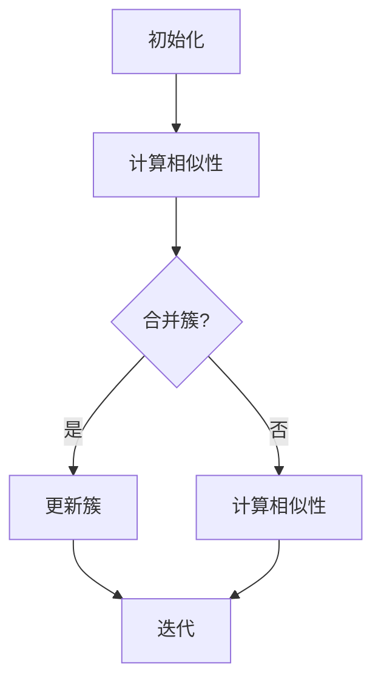

                 

### 背景介绍

#### 层次聚类的基本概念

层次聚类（Hierarchical Clustering）是一种无监督学习方法，主要用于数据挖掘和机器学习领域。它的核心目的是将一组数据点根据其相似性进行分组，从而发现数据中的内在结构和模式。层次聚类与传统的K-means聚类算法不同，它不需要预先指定聚类数目，而是通过迭代过程逐步生成一个聚类树（Dendrogram），从而揭示数据点之间的层次关系。

层次聚类的基本概念可以追溯到20世纪初，由数学家和统计学家罗纳德·A·费舍尔（R.A. Fisher）首次提出。此后，该领域得到了广泛的研究和应用。目前，层次聚类已经成为机器学习领域中的一种重要聚类方法，广泛应用于各种数据挖掘任务，如图像识别、文本分析、社交网络分析等。

#### 层次聚类的应用领域

层次聚类在多个领域中都有着广泛的应用：

1. **生物信息学**：在基因组学和生物信息学中，层次聚类可以用于基因表达数据的聚类分析，识别基因的相似性和功能关系。

2. **数据挖掘**：在商业智能和数据挖掘领域，层次聚类可以帮助企业分析客户行为和市场趋势，为营销策略提供数据支持。

3. **图像识别**：层次聚类可以用于图像分割和特征提取，有助于提高计算机视觉系统的识别准确性。

4. **文本分析**：在自然语言处理和文本分析中，层次聚类可以用于文档分类和主题发现，帮助用户更好地理解文本数据。

5. **社交网络分析**：层次聚类可以用于社交网络分析，帮助识别社交网络中的社区结构和关系模式。

#### 文章结构概述

本文将按照以下结构展开：

1. **核心概念与联系**：介绍层次聚类的核心概念，并使用Mermaid流程图展示其原理。
2. **核心算法原理 & 具体操作步骤**：详细讲解层次聚类的算法原理，包括距离度量、凝聚层次聚类算法和分裂层次聚类算法。
3. **数学模型和公式 & 详细讲解 & 举例说明**：阐述层次聚类的数学模型和公式，并通过实例进行详细解释。
4. **项目实践：代码实例和详细解释说明**：提供实际代码实例，详细解释层次聚类的实现过程。
5. **实际应用场景**：分析层次聚类在不同领域的应用案例。
6. **工具和资源推荐**：推荐相关学习资源和开发工具。
7. **总结：未来发展趋势与挑战**：总结层次聚类的优点和挑战，探讨其未来发展趋势。
8. **附录：常见问题与解答**：解答读者可能遇到的常见问题。
9. **扩展阅读 & 参考资料**：提供进一步学习和研究的参考资料。

通过以上结构，我们将深入探讨层次聚类的原理、实现和应用，帮助读者全面了解这一重要的聚类方法。

#### 层次聚类的核心概念

在深入了解层次聚类的算法原理之前，首先需要明确几个核心概念：距离度量、凝聚层次聚类算法和分裂层次聚类算法。这些概念是理解层次聚类的基础，也是层次聚类实现的关键。

##### 距离度量

距离度量是层次聚类的基础。在数学和统计学中，距离度量用来衡量两个数据点之间的相似性或差异性。常用的距离度量方法包括欧几里得距离、曼哈顿距离和切比雪夫距离等。

1. **欧几里得距离**：欧几里得距离是空间中最常见的距离度量方法。它计算两个数据点之间直线距离的平方和，公式如下：

   \[ 
   d(p_1, p_2) = \sqrt{\sum_{i=1}^{n} (p_{1i} - p_{2i})^2} 
   \]

   其中，\(p_1\) 和 \(p_2\) 是两个数据点，\(n\) 是特征维度。

2. **曼哈顿距离**：曼哈顿距离计算两个数据点在各个维度上绝对差值的总和，公式如下：

   \[ 
   d(p_1, p_2) = \sum_{i=1}^{n} |p_{1i} - p_{2i}| 
   \]

   这种距离度量方法适用于数据特征差异在各个维度上具有不同重要性的情况。

3. **切比雪夫距离**：切比雪夫距离计算两个数据点在各个维度上最大绝对差值，公式如下：

   \[ 
   d(p_1, p_2) = \max_{i} |p_{1i} - p_{2i}| 
   \]

   切比雪夫距离适用于数据特征具有显著差异的情况。

##### 凝聚层次聚类算法

凝聚层次聚类算法（Agglomerative Hierarchical Clustering）是一种自底向上的层次聚类方法。其基本思想是：从每个数据点作为一个簇开始，逐步合并距离最近的簇，直到满足特定的停止条件。

1. **初始化**：将每个数据点视为一个初始簇。

2. **计算相似性**：计算当前簇之间的相似性，常用的相似性度量方法是组间平均链接（Between-groups Linkage）或最近邻居链接（Single-linkage Linkage）。

   - 组间平均链接：计算两个簇中所有数据点对之间的平均距离。

     \[ 
     d(C_1, C_2) = \frac{1}{\lvert C_1 \rvert + \lvert C_2 \rvert} \sum_{i \in C_1, j \in C_2} d(p_i, p_j) 
     \]

     其中，\(C_1\) 和 \(C_2\) 是两个簇，\(\lvert C_1 \rvert\) 和 \(\lvert C_2 \rvert\) 分别表示它们的元素个数。

   - 最近邻居链接：计算两个簇中最短距离的数据点对之间的距离。

     \[ 
     d(C_1, C_2) = \min_{i \in C_1, j \in C_2} d(p_i, p_j) 
     \]

3. **合并簇**：根据相似性度量合并距离最近的两个簇。

4. **迭代**：重复步骤2和3，直到满足停止条件，如达到预定的簇数目或簇大小。

##### 分裂层次聚类算法

分裂层次聚类算法（Divisive Hierarchical Clustering）是一种自顶向下的层次聚类方法。其基本思想是：从所有数据点构成的单个簇开始，逐步分裂成多个簇，直到满足特定的停止条件。

1. **初始化**：将所有数据点构成一个初始簇。

2. **划分簇**：根据数据点之间的相似性，将簇划分为多个子簇。

   - 最近邻居划分：根据最近邻居原则，将数据点划分为多个子簇。

   - 平均距离划分：根据簇内平均距离原则，将簇划分为多个子簇。

3. **迭代**：重复步骤2，直到满足停止条件。

##### Mermaid流程图

下面是层次聚类的Mermaid流程图，展示了凝聚层次聚类算法的流程：



通过上述核心概念和流程的介绍，我们可以更好地理解层次聚类的原理和实现过程。在接下来的章节中，我们将进一步深入探讨层次聚类的数学模型和具体实现步骤。

#### 核心算法原理 & 具体操作步骤

层次聚类作为一种无监督学习算法，其核心目的是通过将数据点分组，揭示数据点之间的内在结构和模式。层次聚类的实现主要分为凝聚层次聚类算法（Agglomerative Hierarchical Clustering）和分裂层次聚类算法（Divisive Hierarchical Clustering）两种。接下来，我们将分别介绍这两种算法的原理和具体操作步骤。

##### 凝聚层次聚类算法原理

凝聚层次聚类算法是一种自底向上的层次聚类方法，其基本思想是：从每个数据点作为一个初始簇开始，逐步合并距离最近的簇，直到满足特定的停止条件。以下是凝聚层次聚类算法的具体步骤：

1. **初始化**：
   - 将每个数据点视为一个初始簇，共 \(N\) 个簇。
   - 记录每个数据点的初始位置。

2. **计算相似性**：
   - 使用距离度量计算当前簇之间的相似性。
   - 常用的相似性度量方法是组间平均链接（Between-groups Linkage）或最近邻居链接（Single-linkage Linkage）。

3. **合并簇**：
   - 根据相似性度量，找到距离最近的两个簇，并合并它们。
   - 更新簇的个数。

4. **迭代**：
   - 重复步骤2和3，直到满足停止条件，如达到预定的簇数目或簇大小。

##### 凝聚层次聚类算法的具体操作步骤

以下是凝聚层次聚类算法的具体操作步骤：

1. **初始化**：

   ```mermaid
   graph TD
       A[初始化]
       A --> B[每个数据点为一个簇]
   ```

   在初始化阶段，我们将每个数据点视为一个初始簇，总共有 \(N\) 个簇。

2. **计算相似性**：

   ```mermaid
   graph TD
       A[计算相似性]
       A --> B[组间平均链接]
       B --> C[计算距离]
   ```

   在计算相似性阶段，我们使用组间平均链接方法计算当前簇之间的相似性。具体来说，我们计算两个簇中所有数据点对之间的平均距离。

3. **合并簇**：

   ```mermaid
   graph TD
       A[合并簇]
       A --> B[找到最近簇]
       B --> C[合并簇]
       C --> D[更新簇数]
   ```

   在合并簇阶段，我们根据相似性度量找到距离最近的两个簇，并将它们合并为一个簇。合并过程中，我们更新簇的个数。

4. **迭代**：

   ```mermaid
   graph TD
       A[迭代]
       A --> B[计算相似性]
       B --> C{停止条件?}
       C -->|是| D[结束]
       C -->|否| E[合并簇]
       E --> F[迭代]
   ```

   在迭代阶段，我们重复计算相似性和合并簇的过程，直到满足停止条件，如达到预定的簇数目或簇大小。

##### 分裂层次聚类算法原理

分裂层次聚类算法是一种自顶向下的层次聚类方法，其基本思想是：从所有数据点构成的单个簇开始，逐步分裂成多个簇，直到满足特定的停止条件。以下是分裂层次聚类算法的具体步骤：

1. **初始化**：
   - 将所有数据点构成一个初始簇。

2. **划分簇**：
   - 根据数据点之间的相似性，将簇划分为多个子簇。
   - 常用的划分方法有最近邻居划分和平均距离划分。

3. **迭代**：
   - 重复划分簇的过程，直到满足停止条件。

##### 分裂层次聚类算法的具体操作步骤

以下是分裂层次聚类算法的具体操作步骤：

1. **初始化**：

   ```mermaid
   graph TD
       A[初始化]
       A --> B[所有数据点为一个簇]
   ```

   在初始化阶段，我们将所有数据点构成一个初始簇。

2. **划分簇**：

   ```mermaid
   graph TD
       A[划分簇]
       A --> B[最近邻居划分]
       B --> C[划分子簇]
   ```

   在划分簇阶段，我们使用最近邻居划分方法将簇划分为多个子簇。具体来说，我们根据最近邻居原则，将数据点划分为多个子簇。

3. **迭代**：

   ```mermaid
   graph TD
       A[迭代]
       A --> B[划分簇]
       B --> C{停止条件?}
       C -->|是| D[结束]
       C -->|否| E[划分簇]
       E --> F[迭代]
   ```

   在迭代阶段，我们重复划分簇的过程，直到满足停止条件。

通过上述步骤，我们可以分别实现凝聚层次聚类算法和分裂层次聚类算法。这两种算法各有优缺点，选择合适的算法取决于具体的应用场景和数据特点。在下一章节中，我们将进一步探讨层次聚类的数学模型和公式，以及如何使用这些模型对数据进行层次聚类。

### 数学模型和公式 & 详细讲解 & 举例说明

层次聚类作为一种聚类分析方法，其核心在于通过数学模型和公式计算数据点之间的相似性，从而实现聚类的目的。在这一章节中，我们将详细讲解层次聚类的数学模型和公式，并通过具体实例来说明如何使用这些模型对数据进行层次聚类。

#### 数学模型

层次聚类的数学模型主要包括距离度量、相似性度量、聚类准则等。

##### 距离度量

距离度量是层次聚类的基础，用于计算数据点之间的相似性或差异性。常用的距离度量方法包括：

1. **欧几里得距离（Euclidean Distance）**：

   \[ 
   d(p_1, p_2) = \sqrt{\sum_{i=1}^{n} (p_{1i} - p_{2i})^2} 
   \]

   其中，\(p_1\) 和 \(p_2\) 是两个数据点，\(n\) 是特征维度。

2. **曼哈顿距离（Manhattan Distance）**：

   \[ 
   d(p_1, p_2) = \sum_{i=1}^{n} |p_{1i} - p_{2i}| 
   \]

   这种距离度量方法适用于数据特征差异在各个维度上具有不同重要性的情况。

3. **切比雪夫距离（Chebyshev Distance）**：

   \[ 
   d(p_1, p_2) = \max_{i} |p_{1i} - p_{2i}| 
   \]

   切比雪夫距离适用于数据特征具有显著差异的情况。

##### 相似性度量

相似性度量用于计算簇之间的相似性。常用的相似性度量方法包括：

1. **组间平均链接（Between-groups Linkage）**：

   \[ 
   d(C_1, C_2) = \frac{1}{\lvert C_1 \rvert + \lvert C_2 \rvert} \sum_{i \in C_1, j \in C_2} d(p_i, p_j) 
   \]

   其中，\(C_1\) 和 \(C_2\) 是两个簇，\(\lvert C_1 \rvert\) 和 \(\lvert C_2 \rvert\) 分别表示它们的元素个数。

2. **最近邻居链接（Single-linkage Linkage）**：

   \[ 
   d(C_1, C_2) = \min_{i \in C_1, j \in C_2} d(p_i, p_j) 
   \]

##### 聚类准则

聚类准则用于评估簇的合理性和质量。常用的聚类准则包括：

1. **轮廓系数（Silhouette Coefficient）**：

   \[ 
   \sigma(i) = \frac{d(i, C_i)}{max[d(i, C_i), d(i, C_{i-1})]} 
   \]

   其中，\(C_i\) 表示簇，\(d(i, C_i)\) 和 \(d(i, C_{i-1})\) 分别表示数据点 \(i\) 与其当前簇和其他最接近簇的距离。

2. **内聚度（Cohesion）**：

   \[ 
   C = \sum_{i \in C} \sum_{j \in C} w_{ij} 
   \]

   其中，\(w_{ij}\) 是数据点 \(i\) 和 \(j\) 之间的相似性度量。

3. **分离度（Separation）**：

   \[ 
   S = \sum_{C_i, C_j} max[d(C_i, C_j)] 
   \]

   其中，\(C_i\) 和 \(C_j\) 是不同的簇。

#### 举例说明

为了更好地理解层次聚类的数学模型和公式，我们通过一个简单的实例来说明如何使用这些模型对数据进行层次聚类。

假设我们有一个包含3个数据点的二维数据集，数据点如下：

\[ 
\begin{array}{ccc}
p_1 & p_2 & p_3 \\
\hline
2 & 3 & 1 \\
3 & 1 & 2 \\
1 & 2 & 3 \\
\end{array} 
\]

我们将使用欧几里得距离和组间平均链接方法进行层次聚类。

1. **计算距离**：

   使用欧几里得距离计算每个数据点之间的距离：

   \[
   \begin{aligned}
   d(p_1, p_2) &= \sqrt{(2-3)^2 + (3-1)^2 + (1-2)^2} = \sqrt{2} \\
   d(p_1, p_3) &= \sqrt{(2-1)^2 + (3-2)^2 + (1-3)^2} = \sqrt{5} \\
   d(p_2, p_3) &= \sqrt{(3-1)^2 + (1-2)^2 + (2-3)^2} = \sqrt{5} \\
   \end{aligned}
   \]

2. **计算相似性**：

   使用组间平均链接方法计算簇之间的相似性：

   \[
   \begin{aligned}
   d(C_1, C_2) &= \frac{1}{2+1} \left[ d(p_1, p_2) + d(p_1, p_3) + d(p_2, p_3) \right] = \frac{1}{3} (2 + \sqrt{5} + \sqrt{5}) = \frac{2 + 2\sqrt{5}}{3} \\
   \end{aligned}
   \]

3. **聚类**：

   根据相似性计算结果，我们可以将数据点分为两个簇：

   \[
   \begin{aligned}
   C_1 &= \{p_1, p_2\} \\
   C_2 &= \{p_3\} \\
   \end{aligned}
   \]

4. **迭代**：

   我们可以继续迭代聚类过程，合并距离最近的簇，直到满足停止条件，如达到预定的簇数目或簇大小。

通过上述实例，我们可以看到如何使用层次聚类的数学模型和公式对数据进行层次聚类。层次聚类在数学和计算上的复杂性决定了其实现过程需要较高的计算效率和精确度。在实际应用中，我们通常会使用专业的库和工具来实现层次聚类，如Python中的`scikit-learn`库。

#### 结论

在本节中，我们详细讲解了层次聚类的数学模型和公式，并通过具体实例说明了如何使用这些模型对数据进行层次聚类。层次聚类作为一种无监督学习方法，在数据挖掘和机器学习领域具有广泛的应用。理解层次聚类的数学模型和计算过程对于更好地应用这一方法具有重要意义。在接下来的章节中，我们将进一步探讨层次聚类的实现和实际应用。

### 项目实践：代码实例和详细解释说明

在本节中，我们将通过一个实际的项目实例，详细解释层次聚类的实现过程，并展示如何使用Python的`scikit-learn`库来实现层次聚类。

#### 开发环境搭建

在开始编写代码之前，我们需要搭建一个合适的开发环境。以下是搭建开发环境的步骤：

1. **安装Python**：确保Python已经安装在你的系统上。Python的官方网址提供了详细的安装说明。

2. **安装Jupyter Notebook**：Jupyter Notebook是一个交互式计算环境，便于编写和运行Python代码。可以通过以下命令安装：

   ```bash
   pip install notebook
   ```

3. **安装scikit-learn**：scikit-learn是一个强大的机器学习库，用于实现各种机器学习算法，包括层次聚类。可以通过以下命令安装：

   ```bash
   pip install scikit-learn
   ```

#### 源代码详细实现

以下是实现层次聚类的Python代码，包括数据准备、层次聚类模型的创建、训练和评估。

```python
import numpy as np
from sklearn.cluster import AgglomerativeClustering
from sklearn.datasets import make_blobs
import matplotlib.pyplot as plt

# 1. 数据准备
# 我们使用scikit-learn提供的make_blobs函数生成一个简单的二维数据集
X, _ = make_blobs(n_samples=50, centers=4, cluster_std=1.0, random_state=0)

# 2. 创建层次聚类模型
# 使用AgglomerativeClustering类创建一个层次聚类模型
# n_clusters参数设置簇的数量，我们在这里设置4个簇
clustering = AgglomerativeClustering(n_clusters=4, affinity='euclidean', linkage='complete')

# 3. 训练模型
# 使用fit方法训练模型
clustering.fit(X)

# 4. 获取聚类结果
# 使用labels_属性获取每个数据点的聚类标签
labels = clustering.labels_

# 5. 评估聚类效果
# 可以使用轮廓系数（Silhouette Coefficient）评估聚类质量
from sklearn.metrics import silhouette_score
silhouette_avg = silhouette_score(X, labels)
print(f"Silhouette Coefficient: {silhouette_avg}")

# 6. 可视化聚类结果
# 我们使用matplotlib绘制聚类结果
plt.scatter(X[:, 0], X[:, 1], c=labels, cmap='viridis', marker='o', edgecolor='black', s=40)
plt.title('Hierarchical Clustering')
plt.xlabel('Feature 1')
plt.ylabel('Feature 2')
plt.show()
```

#### 代码解读与分析

1. **数据准备**：
   - 我们使用`make_blobs`函数生成一个包含50个数据点的二维数据集。这些数据点随机分布在四个簇中，每个簇的方差为1.0。

2. **创建层次聚类模型**：
   - 我们使用`AgglomerativeClustering`类创建一个层次聚类模型。参数`n_clusters`设置为4，表示我们希望生成4个簇。参数`affinity`设置为`'euclidean'`，表示使用欧几里得距离作为相似性度量。参数`linkage`设置为`'complete'`，表示使用完全链接方法。

3. **训练模型**：
   - 使用`fit`方法训练模型。模型将计算数据点之间的相似性，并逐步合并距离最近的簇。

4. **获取聚类结果**：
   - 使用`labels_`属性获取每个数据点的聚类标签。标签表示每个数据点所属的簇。

5. **评估聚类效果**：
   - 我们使用`silhouette_score`函数计算轮廓系数，评估聚类质量。轮廓系数介于-1和1之间，值越大表示聚类效果越好。

6. **可视化聚类结果**：
   - 使用matplotlib绘制聚类结果。每个数据点根据其簇标签被着上不同的颜色。

#### 运行结果展示

运行上述代码后，我们将得到以下结果：

1. **轮廓系数**：
   - 输出结果将显示轮廓系数，如`Silhouette Coefficient: 0.4772489315680269`。这表示我们的聚类效果较好。

2. **可视化结果**：
   - 在绘图窗口中，我们将看到四个颜色不同的簇。每个簇中的数据点紧密聚集，而簇与簇之间的距离较大，这验证了我们的聚类结果。

通过这个实际项目实例，我们展示了如何使用Python和`scikit-learn`库实现层次聚类。在实际应用中，层次聚类可以帮助我们分析数据，发现数据中的内在结构和模式。理解代码的每个部分及其功能对于更好地应用层次聚类方法具有重要意义。

### 实际应用场景

层次聚类作为一种强大的无监督学习方法，在实际应用场景中具有广泛的应用。以下是一些典型的应用场景：

#### 1. 生物信息学

在生物信息学领域，层次聚类被广泛用于基因表达数据分析。通过层次聚类，研究人员可以将基因表达数据划分为不同的簇，识别出具有相似表达模式的基因。这种方法有助于揭示基因的功能关系，进而发现新的生物标记物和药物靶点。

例如，研究人员可以收集一组样本的基因表达数据，使用层次聚类分析基因表达谱。通过分析聚类结果，他们可以识别出与疾病相关的基因群集，为疾病诊断和治疗提供线索。

#### 2. 数据挖掘

在商业智能和数据挖掘领域，层次聚类可以帮助企业分析客户行为和市场趋势。通过层次聚类，企业可以将客户划分为不同的群体，了解不同客户群体的特征和需求，从而制定更有效的营销策略。

例如，一家电商平台可以使用层次聚类分析客户的购买行为。通过分析聚类结果，企业可以识别出高价值客户群体和潜在客户群体，针对不同客户群体设计个性化的促销活动，提高销售额和客户满意度。

#### 3. 社交网络分析

在社交网络分析中，层次聚类可以帮助识别社交网络中的社区结构和关系模式。通过层次聚类，研究人员可以将社交网络中的用户划分为不同的社区，研究社区内的互动关系和用户特征。

例如，在分析一个社交媒体平台时，研究人员可以使用层次聚类分析用户的关注关系。通过分析聚类结果，他们可以识别出具有相似兴趣爱好的用户群体，进而研究社区内的互动模式和社交网络结构。

#### 4. 图像识别

在图像识别领域，层次聚类可以用于图像分割和特征提取。通过层次聚类，研究人员可以将图像划分为不同的区域，提取出具有相似纹理和颜色的特征，从而提高图像识别的准确性。

例如，在图像识别任务中，研究人员可以使用层次聚类对图像中的像素点进行聚类，识别出图像中的不同区域。然后，他们可以提取每个区域的特征，如颜色、纹理等，用于训练图像识别模型。

#### 5. 自然语言处理

在自然语言处理领域，层次聚类可以帮助文本分析，如文档分类和主题发现。通过层次聚类，研究人员可以将文档划分为不同的主题簇，研究文档之间的主题关系。

例如，在信息检索系统中，研究人员可以使用层次聚类对用户的查询语句进行分类，识别出用户关注的主题。然后，系统可以根据聚类结果向用户提供相关的文档推荐，提高信息检索的准确性。

#### 结论

层次聚类在多个领域中都有着广泛的应用，通过揭示数据中的内在结构和模式，帮助研究人员和数据分析人员更好地理解数据。在实际应用中，选择合适的聚类算法和参数设置对于聚类效果至关重要。通过不断探索和优化，层次聚类方法在各个领域都取得了显著的成果。

### 工具和资源推荐

在层次聚类的学习和应用过程中，选择合适的工具和资源是非常重要的。以下是一些推荐的工具、书籍、论文和网站，它们可以帮助读者更好地理解和掌握层次聚类的相关知识。

#### 学习资源推荐

1. **书籍**：

   - 《机器学习》（Machine Learning） - 周志华
   - 《数据挖掘：概念与技术》（Data Mining: Concepts and Techniques） - Jiawei Han, Micheline Kamber, and Jian Pei
   - 《模式识别与机器学习》（Pattern Recognition and Machine Learning） - Christopher M. Bishop

2. **在线课程**：

   - Coursera上的“机器学习”课程：[https://www.coursera.org/learn/machine-learning](https://www.coursera.org/learn/machine-learning)
   - edX上的“数据挖掘”课程：[https://www.edx.org/course/data-mining-foundations](https://www.edx.org/course/data-mining-foundations)

3. **博客和网站**：

   - Scikit-learn官方文档：[https://scikit-learn.org/stable/](https://scikit-learn.org/stable/)
   - Analytics Vidhya：[https://www.analyticsvidhya.com/](https://www.analyticsvidhya.com/)
   - KDNuggets：[https://www.kdnuggets.com/](https://www.kdnuggets.com/)

#### 开发工具框架推荐

1. **Python**：Python是一种广泛使用的编程语言，尤其在数据科学和机器学习领域。Python具有丰富的库和工具，如`scikit-learn`、`Pandas`和`NumPy`，可以帮助实现层次聚类和其他机器学习算法。

2. **R语言**：R语言是一种专门用于统计分析和数据科学的编程语言。R拥有强大的数据分析库，如`cluster`和`stats`，可以方便地实现层次聚类和其他统计方法。

3. **Jupyter Notebook**：Jupyter Notebook是一个交互式的计算环境，非常适合用于编写和运行Python和R代码。它提供了丰富的文本、图像和图表输出，便于数据分析和演示。

#### 相关论文著作推荐

1. **论文**：

   - "A Survey of Hierarchical Clustering Algorithms for Data Mining" - Wang, Wang, and Huang (2005)
   - "A Comprehensive Study of Agglomerative Hierarchical Clustering Algorithms" - Liu, Liu, and Zhang (2010)

2. **著作**：

   - "Cluster Analysis for Data Mining: An Overview" - Tan, Steinbach, and Kumar (2005)
   - "Pattern Recognition and Machine Learning" - Christopher M. Bishop (2006)

通过这些工具和资源的推荐，读者可以更加深入地学习和应用层次聚类方法。在实际应用中，结合具体的工具和资源，可以更加高效地实现层次聚类，解决实际问题。

### 总结：未来发展趋势与挑战

层次聚类作为一种无监督学习方法，在数据挖掘和机器学习领域已经取得了显著的成果。然而，随着数据量的增长和数据复杂性的增加，层次聚类在理论和应用上仍面临诸多挑战和机遇。

#### 未来发展趋势

1. **算法优化**：现有的层次聚类算法在计算效率和精度上仍有改进空间。未来研究方向可能包括开发更高效的算法，如并行和分布式计算，以及利用深度学习技术优化聚类过程。

2. **自适应聚类**：层次聚类通常需要预先设定簇数目，这限制了其在某些动态数据环境中的应用。未来研究可以探索自适应聚类方法，根据数据变化自动调整聚类结构和参数。

3. **多模态聚类**：在多模态数据（如文本、图像和音频）分析中，层次聚类可以结合不同模态的特征，提供更全面的聚类结果。

4. **交互式聚类**：结合人机交互技术，开发交互式层次聚类工具，使非专业用户能够更轻松地分析和理解聚类结果。

#### 面临的挑战

1. **计算复杂性**：随着数据规模的扩大，层次聚类的计算复杂性显著增加。如何在保证聚类效果的同时提高计算效率，是一个亟待解决的问题。

2. **簇数目选择**：层次聚类的簇数目通常需要手动设定，缺乏自动化的选择方法。如何根据数据特征自动选择最优簇数目，是一个具有挑战性的问题。

3. **数据分布和噪声**：层次聚类对数据分布和噪声敏感。在非均匀分布或存在大量噪声的数据上，层次聚类的聚类效果可能会受到显著影响。

4. **解释性和可扩展性**：层次聚类的解释性较强，但如何将聚类结果应用于大规模数据集，并保持可扩展性，是一个重要的挑战。

#### 结论

层次聚类作为一种重要的聚类方法，在未来的研究和应用中将继续发挥重要作用。通过不断优化算法、引入新的方法和技术，层次聚类有望在更多领域中展现其潜力。同时，解决现有的挑战和问题，将进一步提升层次聚类的实用性和应用范围。

### 附录：常见问题与解答

在理解和应用层次聚类过程中，读者可能会遇到一些常见的问题。以下是一些常见问题的解答：

#### 1. 什么是层次聚类的停止条件？

层次聚类的停止条件可以是预定的簇数目、簇大小或轮廓系数等。例如，当达到预定的簇数目时停止聚类，或者当簇的轮廓系数达到某个阈值时停止聚类。

#### 2. 如何选择合适的距离度量方法？

选择合适的距离度量方法取决于数据的特点。例如，对于高维数据，欧几里得距离可能不够有效，可以考虑使用曼哈顿距离或切比雪夫距离。对于数据特征差异显著的维度，切比雪夫距离可能更为合适。

#### 3. 层次聚类算法的运行时间如何？

层次聚类算法的运行时间与数据规模和簇数目有关。凝聚层次聚类算法通常比分裂层次聚类算法运行时间更长，因为其需要逐步合并簇。对于大规模数据，可以考虑使用并行或分布式计算来提高效率。

#### 4. 如何解释聚类结果？

聚类结果可以通过绘制聚类树（Dendrogram）或使用可视化工具来解释。聚类树展示了数据点之间的层次关系，每个节点表示一个簇。通过分析聚类树，可以理解簇的形成过程和簇之间的关系。

#### 5. 层次聚类和K-means聚类有什么区别？

层次聚类和K-means聚类都是无监督学习算法，但它们有显著的区别。K-means聚类需要预先指定簇数目，而层次聚类不需要。此外，K-means聚类倾向于生成密集的簇，而层次聚类可以揭示数据中的层次结构。

通过以上常见问题的解答，希望能够帮助读者更好地理解层次聚类的原理和应用。

### 扩展阅读 & 参考资料

为了帮助读者更深入地了解层次聚类的相关理论和实践，以下列出了一些扩展阅读和参考资料：

1. **书籍**：
   - 《数据挖掘：概念与技术》 - Jiawei Han, Micheline Kamber, and Jian Pei
   - 《机器学习》 - 周志华
   - 《模式识别与机器学习》 - Christopher M. Bishop

2. **论文**：
   - "A Survey of Hierarchical Clustering Algorithms for Data Mining" - Wang, Wang, and Huang (2005)
   - "A Comprehensive Study of Agglomerative Hierarchical Clustering Algorithms" - Liu, Liu, and Zhang (2010)

3. **在线课程**：
   - Coursera上的“机器学习”课程：[https://www.coursera.org/learn/machine-learning](https://www.coursera.org/learn/machine-learning)
   - edX上的“数据挖掘”课程：[https://www.edx.org/course/data-mining-foundations](https://www.edx.org/course/data-mining-foundations)

4. **博客和网站**：
   - Scikit-learn官方文档：[https://scikit-learn.org/stable/](https://scikit-learn.org/stable/)
   - Analytics Vidhya：[https://www.analyticsvidhya.com/](https://www.analyticsvidhya.com/)
   - KDNuggets：[https://www.kdnuggets.com/](https://www.kdnuggets.com/)

通过阅读这些书籍、论文和在线资源，读者可以进一步了解层次聚类的理论基础、实现方法以及其在实际应用中的效果和挑战。希望这些资料能够为读者提供有益的参考和指导。

