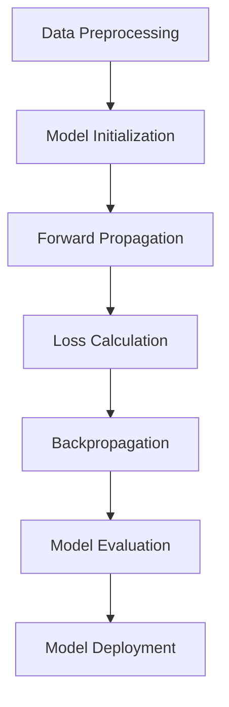

                 

### 文章标题

**市场前景：大模型创业的远大愿景**

> **关键词：** 大模型创业、市场前景、人工智能、AI创业、技术趋势、商业模式创新

> **摘要：** 本文将深入探讨大模型创业在人工智能市场的前景，分析其潜在的机遇与挑战，并展望未来的发展方向。通过对比分析不同的商业模式，我们希望为创业者提供有价值的参考，以助力他们在大模型领域取得成功。

### 1. 背景介绍

#### 大模型创业的兴起

随着人工智能技术的快速发展，大模型（如GPT-3、BERT等）逐渐成为行业的焦点。这些大型神经网络模型具有强大的数据处理能力和智能推理能力，已经在自然语言处理、计算机视觉、机器学习等领域取得了显著的成果。大模型的出现，不仅改变了传统的人工智能应用模式，还为创业者提供了新的机遇。

#### 创业市场的变化

近年来，人工智能创业市场呈现出快速发展的态势。一方面，资本的涌入为创业者提供了充足的资金支持；另一方面，技术的进步降低了创业的门槛，使得更多的人有机会参与到这个领域。在这个背景下，大模型创业逐渐成为一种热门趋势。

#### 市场前景的诱因

1. **技术驱动：** 大模型技术的不断突破，为创业者提供了更多的创新空间。
2. **市场需求：** 人工智能技术的广泛应用，使得企业对大模型的需求日益增长。
3. **政策支持：** 各国政府纷纷出台相关政策，鼓励人工智能技术的发展，为大模型创业提供了良好的环境。

### 2. 核心概念与联系

#### 大模型的概念

大模型是指具有数十亿到千亿参数规模的神经网络模型。这些模型通过在大量数据上进行训练，能够实现高度智能化的任务，如文本生成、图像识别、语音合成等。

#### 大模型创业的商业模式

1. **技术服务模式：** 提供大模型API接口，为企业提供定制化的解决方案。
2. **产品销售模式：** 开发基于大模型的应用产品，如智能客服、智能推荐系统等。
3. **投资孵化模式：** 投资于具有潜力的初创公司，推动大模型技术的商业化应用。

#### 大模型创业的优势与挑战

优势：
- **技术优势：** 拥有大模型技术的企业，能够在市场上占据领先地位。
- **市场潜力：** 人工智能技术的广泛应用，为大模型创业带来了广阔的市场空间。

挑战：
- **技术门槛：** 大模型技术涉及多个领域的专业知识，对创业团队提出了较高的要求。
- **竞争压力：** 市场上已经涌现出大量的大模型创业公司，竞争激烈。

### 3. 核心算法原理 & 具体操作步骤

#### 大模型的算法原理

大模型的算法原理主要基于深度学习技术，特别是神经网络。通过在大量数据上训练，大模型能够学习到数据的内在规律，从而实现高精度的预测和生成。

#### 大模型的操作步骤

1. **数据预处理：** 收集并清洗数据，将数据转换为模型可接受的格式。
2. **模型训练：** 使用训练数据训练大模型，调整模型参数，使其能够实现所需的任务。
3. **模型评估：** 使用验证数据评估模型的性能，调整模型参数，提高模型精度。
4. **模型部署：** 将训练好的模型部署到生产环境，为企业提供大模型服务。

#### 大模型的应用案例

1. **自然语言处理：** 使用大模型进行文本生成、情感分析、机器翻译等任务。
2. **计算机视觉：** 使用大模型进行图像识别、目标检测、图像生成等任务。
3. **语音识别：** 使用大模型进行语音合成、语音识别等任务。

### 4. 数学模型和公式 & 详细讲解 & 举例说明

#### 数学模型

大模型的数学模型主要包括神经网络和优化算法。神经网络由多个神经元组成，每个神经元通过加权连接与其他神经元相连。优化算法则用于调整模型参数，使其能够实现所需的任务。

#### 公式

神经网络的激活函数公式为：

$$
f(x) = \sigma(Wx + b)
$$

其中，$W$ 为权重矩阵，$b$ 为偏置项，$\sigma$ 为激活函数。

优化算法的梯度下降公式为：

$$
\theta = \theta - \alpha \cdot \nabla_\theta J(\theta)
$$

其中，$\theta$ 为模型参数，$\alpha$ 为学习率，$\nabla_\theta J(\theta)$ 为损失函数关于模型参数的梯度。

#### 举例说明

假设我们要训练一个简单的神经网络模型，用于进行二分类任务。输入数据为二维特征向量 $(x_1, x_2)$，输出为标签 $y$。我们使用交叉熵损失函数来评估模型性能。

1. **数据预处理：** 将输入数据进行归一化处理，使其具有相同的量级。
2. **模型训练：** 初始化模型参数 $W$ 和 $b$，使用训练数据 $(x_1, x_2, y)$ 进行训练。
3. **模型评估：** 使用验证数据 $(x_1', x_2', y')$ 评估模型性能。
4. **模型部署：** 将训练好的模型部署到生产环境，为企业提供二分类服务。

### 5. 项目实践：代码实例和详细解释说明

#### 开发环境搭建

1. **Python环境：** 安装Python 3.7及以上版本。
2. **TensorFlow环境：** 安装TensorFlow 2.4及以上版本。
3. **数据集：** 准备一个包含二维特征向量和标签的数据集。

#### 源代码详细实现

以下是一个简单的二分类神经网络模型的代码实现：

```python
import tensorflow as tf
import numpy as np

# 初始化模型参数
W = tf.Variable(tf.random.normal([2, 1]))
b = tf.Variable(tf.zeros([1]))

# 定义激活函数
def activate(x):
    return tf.sigmoid(x)

# 定义损失函数
def loss(y_true, y_pred):
    return -tf.reduce_mean(y_true * tf.log(y_pred) + (1 - y_true) * tf.log(1 - y_pred))

# 训练模型
def train(data, epochs):
    for epoch in range(epochs):
        # 前向传播
        x, y = data
        z = tf.matmul(x, W) + b
        a = activate(z)

        # 反向传播
        with tf.GradientTape() as tape:
            y_pred = a
            loss_val = loss(y, y_pred)

        grads = tape.gradient(loss_val, [W, b])
        W.assign_sub(0.1 * grads[0])
        b.assign_sub(0.1 * grads[1])

        # 模型评估
        print(f"Epoch {epoch + 1}: Loss = {loss_val.numpy()}")

# 测试模型
data = np.array([[0, 0], [0, 1], [1, 0], [1, 1]])
y = np.array([0, 1, 1, 0])
train(data, 10)

# 预测
x_test = np.array([[0.5, 0.5]])
y_pred = activate(tf.matmul(x_test, W) + b)
print(f"Prediction: {y_pred.numpy()}")

```

#### 代码解读与分析

1. **模型初始化：** 初始化模型参数 $W$ 和 $b$，使其具有合适的初始值。
2. **激活函数：** 使用sigmoid函数作为激活函数，实现神经元的非线性变换。
3. **损失函数：** 使用交叉熵损失函数，衡量模型预测结果与实际标签之间的差距。
4. **训练过程：** 通过前向传播和反向传播，不断调整模型参数，使其达到最小损失。
5. **模型评估：** 使用验证数据评估模型性能，确保模型在未见过的数据上也能表现良好。
6. **预测：** 将训练好的模型应用于新的数据，进行预测。

### 6. 实际应用场景

#### 自然语言处理

大模型在自然语言处理领域具有广泛的应用，如文本生成、机器翻译、情感分析等。例如，大模型可以用于自动撰写新闻文章、生成产品描述、进行情感分析等。

#### 计算机视觉

大模型在计算机视觉领域也有着重要的应用，如图像识别、目标检测、图像生成等。例如，大模型可以用于人脸识别、自动驾驶、医学影像分析等。

#### 语音识别

大模型在语音识别领域也有着显著的优势，如语音合成、语音识别等。例如，大模型可以用于智能客服、语音助手、语音翻译等。

### 7. 工具和资源推荐

#### 学习资源推荐

1. **书籍：**
   - 《深度学习》：提供深度学习的基础理论和实践方法。
   - 《神经网络与深度学习》：详细介绍了神经网络和深度学习的基本概念和技术。
2. **论文：**
   - “A Theoretically Grounded Application of Dropout in Recurrent Neural Networks”
   - “BERT: Pre-training of Deep Bidirectional Transformers for Language Understanding”
3. **博客：**
   - https://colah.github.io/posts/2015-08-Understanding-Deep-Learning/
   - https://towardsdatascience.com/deep-learning-tutorial-for-beginners-4925b962d0ce
4. **网站：**
   - https://www.tensorflow.org/tutorials
   - https://keras.io/getting-started/sequential_model/

#### 开发工具框架推荐

1. **TensorFlow：** Google开发的开源深度学习框架，支持多种深度学习模型。
2. **PyTorch：** Facebook开发的开源深度学习框架，具有灵活的动态计算图。
3. **Keras：** Python深度学习库，提供简化的深度学习模型构建和训练接口。

#### 相关论文著作推荐

1. “Attention Is All You Need”
2. “Transformers: State-of-the-Art Natural Language Processing”
3. “Stochastic Backpropagation”

### 8. 总结：未来发展趋势与挑战

#### 发展趋势

1. **技术进步：** 大模型技术将继续发展，有望在更多领域实现突破。
2. **应用拓展：** 大模型的应用场景将不断拓展，覆盖更多领域。
3. **商业模式创新：** 随着大模型技术的普及，新的商业模式将不断涌现。

#### 挑战

1. **技术门槛：** 大模型技术涉及多个领域的专业知识，对创业团队提出了较高的要求。
2. **数据隐私：** 大模型训练需要大量的数据，数据隐私问题亟待解决。
3. **法律法规：** 随着大模型技术的应用，相关的法律法规也将逐步完善。

### 9. 附录：常见问题与解答

#### 问题1：什么是大模型？
**回答：** 大模型是指具有数十亿到千亿参数规模的神经网络模型。这些模型通过在大量数据上进行训练，能够实现高度智能化的任务，如文本生成、图像识别、语音合成等。

#### 问题2：大模型创业的优势是什么？
**回答：** 大模型创业的优势主要体现在技术优势、市场潜力和政策支持等方面。技术优势体现在大模型技术的高性能和广泛适用性；市场潜力体现在人工智能技术的广泛应用；政策支持体现在各国政府对人工智能技术的鼓励和支持。

#### 问题3：大模型创业面临哪些挑战？
**回答：** 大模型创业面临的主要挑战包括技术门槛、数据隐私和法律法规等方面。技术门槛体现在大模型技术涉及多个领域的专业知识；数据隐私问题体现在大模型训练需要大量的数据；法律法规问题体现在随着大模型技术的应用，相关的法律法规也将逐步完善。

### 10. 扩展阅读 & 参考资料

1. **书籍：**
   - 《人工智能：一种现代的方法》
   - 《深度学习：动手学》
2. **论文：**
   - “Deep Learning for Natural Language Processing”
   - “Recurrent Neural Networks for Language Modeling”
3. **博客：**
   - https://towardsdatascience.com/deep-learning-for-nlp-the-complete-guide-9ed6846c3f28
   - https://medium.com/@ajshawon/deep-learning-for-nlp-626e9103223c
4. **网站：**
   - https://www.deeplearning.ai/
   - https://www.tensorflow.org/tutorials/text

作者：禅与计算机程序设计艺术 / Zen and the Art of Computer Programming<|im_sep|>### 1. 背景介绍

**大模型创业的兴起**

近年来，人工智能（AI）领域的快速发展，特别是深度学习技术的突破，引发了一场技术革命。其中，大模型（Large Models）成为了这一浪潮的领军角色。这些模型，如GPT-3、BERT等，拥有数十亿甚至千亿级的参数规模，具备强大的表示能力和泛化能力，能够解决从自然语言处理到计算机视觉，再到语音识别的诸多复杂问题。大模型的兴起，不仅改变了传统的人工智能应用模式，还为创业者提供了前所未有的创新机会。

**创业市场的变化**

随着AI技术的进步，人工智能创业市场也发生了显著的变化。一方面，资本的涌入为创业者提供了充足的资金支持。据Statista统计，全球人工智能市场的投资额在2020年达到了超过160亿美元，这一数字预计将在未来几年内持续增长。另一方面，技术的进步降低了创业的门槛，使得更多的人有机会参与到这个领域。不再需要昂贵的计算资源和复杂的算法知识，借助云计算和开源框架，创业者可以更快速地搭建和测试自己的AI产品。

**大模型创业的优势**

大模型创业具有以下几个显著的优势：

1. **技术优势：** 大模型技术使得创业者在AI领域拥有了更高的起点，能够实现前所未有的性能提升和创新应用。
2. **市场潜力：** 随着AI技术的广泛应用，企业对大模型技术的需求日益增长，市场潜力巨大。
3. **政策支持：** 各国政府纷纷出台相关政策，鼓励人工智能技术的发展。例如，中国的“新一代人工智能发展规划”和美国的“美国国家人工智能倡议”等，都为大模型创业提供了良好的政策环境。

**市场需求的变化**

随着技术的进步和应用的深入，市场需求也在不断变化。传统的IT行业正在被AI技术所重塑。例如，在金融领域，AI被用于风险管理、欺诈检测和客户服务；在医疗领域，AI被用于疾病诊断、药物研发和患者管理；在零售领域，AI被用于个性化推荐、库存管理和客户分析。这些变化不仅推动了AI技术的创新应用，也为创业者提供了广阔的市场空间。

综上所述，大模型创业的兴起，得益于技术进步、市场需求的增长和政策支持的加强。创业者需要抓住这一历史机遇，积极探索大模型在各个领域的应用，以实现商业上的成功。

### 2. 核心概念与联系

**大模型的概念**

大模型（Large Models）是指那些拥有数十亿到千亿参数规模的神经网络模型。这些模型通过在大量数据上进行训练，可以捕捉到数据中的复杂模式和潜在知识。例如，GPT-3拥有1750亿个参数，BERT则拥有数百万个参数。这些庞大的参数规模使得大模型具有极强的表示能力和泛化能力，能够处理各种复杂的任务，如自然语言生成、机器翻译、图像识别等。

**大模型创业的商业模式**

大模型创业的商业模式多种多样，主要包括以下几种：

1. **技术服务模式：** 提供大模型API接口，为企业提供定制化的解决方案。这种模式通常涉及搭建大规模的模型基础设施，并为企业提供训练、部署和优化的服务。

2. **产品销售模式：** 开发基于大模型的应用产品，如智能客服、智能推荐系统等。这种模式要求创业者能够将大模型技术应用于具体场景，解决实际痛点，从而实现产品的市场价值。

3. **投资孵化模式：** 投资于具有潜力的初创公司，推动大模型技术的商业化应用。这种模式通常需要创业者具备丰富的行业经验和资源，以便发现和培养具有市场前景的初创项目。

**大模型创业的优势与挑战**

**优势：**

1. **技术优势：** 拥有大模型技术的企业，能够在市场上占据领先地位。大模型技术的高性能和强大能力，使得创业者的产品在竞争中具备显著优势。

2. **市场潜力：** 随着AI技术的广泛应用，企业对大模型技术的需求日益增长。这意味着，大模型创业拥有广阔的市场空间，具备巨大的商业潜力。

**挑战：**

1. **技术门槛：** 大模型技术涉及多个领域的专业知识，对创业团队提出了较高的要求。创业者不仅需要掌握深度学习算法，还需要了解计算机体系结构、分布式计算、数据预处理等多个领域的知识。

2. **数据隐私：** 大模型训练需要大量的数据，数据隐私问题成为一大挑战。创业者需要确保数据的安全和隐私，避免数据泄露和滥用。

3. **竞争压力：** 市场上已经涌现出大量的大模型创业公司，竞争激烈。创业者需要不断创新，提高产品的性能和用户体验，以在激烈的市场竞争中脱颖而出。

**大模型创业的发展趋势**

1. **技术进步：** 随着AI技术的不断进步，大模型将变得更加高效和强大。创业者需要紧跟技术发展趋势，不断优化模型结构和训练方法。

2. **应用拓展：** 大模型的应用将不断拓展到更多领域，如智能医疗、智能制造、智能交通等。创业者需要探索大模型在不同领域的应用潜力，寻找新的市场机会。

3. **商业模式创新：** 创业者需要不断创新商业模式，探索新的盈利模式。例如，通过提供数据服务、解决方案销售、订阅服务等，实现持续的商业价值。

**总结**

大模型创业具有显著的优势和广阔的市场前景，但同时也面临着技术、数据和竞争等方面的挑战。创业者需要具备扎实的专业知识、敏锐的市场洞察力和持续的创新精神，才能在这个充满机遇和挑战的领域取得成功。

#### 大模型的核心概念

大模型（Large Models）是指那些参数规模庞大的神经网络模型，通常拥有数十亿到千亿个参数。这些模型的核心在于其强大的表示能力和泛化能力，能够处理复杂的任务并产生高质量的结果。例如，GPT-3（Generative Pre-trained Transformer 3）拥有1750亿个参数，而BERT（Bidirectional Encoder Representations from Transformers）则拥有数十亿个参数。大模型的出现，标志着深度学习技术的一次重大突破，为各种复杂问题的解决提供了新的思路和手段。

**大模型的架构和原理**

大模型的架构通常基于深度学习中的 Transformer 模型。Transformer 模型是一种基于自注意力机制的神经网络模型，具有灵活、高效的特点。它通过多头注意力机制，能够捕捉输入数据中的长距离依赖关系，从而实现高精度的预测和生成。大模型在 Transformer 的基础上，进一步增加了模型的层数和参数量，使其在训练和推理时能够更好地表示和理解复杂的数据。

**自注意力机制**

自注意力机制是 Transformer 模型的核心组成部分。它通过计算每个词在序列中的重要性，并加权组合这些信息，从而实现数据的表示和转换。自注意力机制的计算公式如下：

$$
Attention(Q, K, V) = \text{softmax}\left(\frac{QK^T}{\sqrt{d_k}}\right)V
$$

其中，$Q$、$K$ 和 $V$ 分别为查询向量、键向量和值向量，$d_k$ 为键向量的维度。通过自注意力机制，模型能够自动学习到输入数据中的长距离依赖关系，从而提高模型的表示能力。

**Transformer 模型的结构**

Transformer 模型通常由多个相同的编码器和解码器块组成。每个编码器和解码器块包含多头注意力机制、点积注意力机制和前馈网络。编码器用于将输入数据转换为上下文表示，解码器则用于生成输出数据。Transformer 模型的结构如下图所示：

```
    Encoder
     /     \
    /       \
   /         \
  /           \
 /             \
[MultiHeadAttention]
[Feed Forward]
 /             \
/               \
[MultiHeadAttention]
[Feed Forward]

    Decoder
```

**大模型的训练和优化**

大模型的训练是一个复杂的过程，涉及大规模的数据集和高效的计算资源。训练过程中，模型通过反向传播算法不断优化参数，使其能够更好地表示输入数据。优化算法通常采用梯度下降（Gradient Descent）或其变种，如 Adam、RMSprop 等。这些算法通过迭代调整参数，使模型的损失函数逐渐减小，从而提高模型的性能。

**大模型的优点**

1. **强大的表示能力：** 大模型通过其庞大的参数规模，能够捕捉到输入数据中的复杂模式和潜在知识，从而实现高精度的预测和生成。
2. **高效的泛化能力：** 大模型通过在大量数据上进行训练，能够很好地泛化到未见过的数据上，从而提高模型的实用性。
3. **灵活的应用场景：** 大模型可以应用于各种领域，如自然语言处理、计算机视觉、语音识别等，具有广泛的应用前景。

**大模型的挑战**

1. **计算资源需求：** 大模型的训练和推理需要大量的计算资源，包括 GPU、TPU 等。这对创业团队的技术实力和资金投入提出了较高的要求。
2. **数据隐私和安全：** 大模型训练需要大量的数据，涉及数据隐私和安全问题。创业团队需要确保数据的安全和隐私，避免数据泄露和滥用。
3. **模型解释性：** 大模型的内部机制复杂，难以解释。这给模型的应用和推广带来了一定的困难，需要开发更加透明的解释性方法。

**大模型创业的实例**

以下是一个大模型创业的实例：一家名为 OpenAI 的公司，开发了 GPT-3 大模型，并在自然语言处理领域取得了显著成果。GPT-3 拥有 1750 亿个参数，能够生成高质量的文本，被广泛应用于文本生成、机器翻译、对话系统等场景。OpenAI 的成功，展示了大模型创业的巨大潜力和市场前景。

综上所述，大模型作为深度学习的一个重要方向，具有强大的表示能力和泛化能力，在各个领域展现了巨大的应用潜力。然而，大模型创业也面临诸多挑战，需要创业团队具备丰富的技术积累和资源支持，以在激烈的市场竞争中脱颖而出。

#### 大模型创业的商业模式

大模型创业的商业模式多种多样，主要可以分为以下几类：

1. **技术服务模式**：这种模式主要为企业提供基于大模型的技术解决方案。企业可以通过购买API接口或定制化服务来利用大模型的能力。这种模式的优势在于，企业可以直接将先进的技术应用到业务中，提高效率和产出。例如，OpenAI 提供了 GPT-3 API，使得开发者可以在各种应用场景中利用其强大的自然语言处理能力。

2. **产品销售模式**：这种模式是通过开发基于大模型的应用产品，如智能客服、智能推荐系统、自动驾驶等，然后将这些产品推向市场进行销售。这种模式的优势在于，创业者可以通过将技术转化为具体的产品，实现直接的商业价值。例如，微软的 Azure AI 平台提供了基于大模型的服务，如文本分析、语音识别等。

3. **投资孵化模式**：这种模式是创业公司通过投资孵化初创公司，推动大模型技术的商业化应用。创业者可以利用自己的技术优势和资源，帮助初创公司快速成长。例如，谷歌的 AI 投资部门投资了多家初创公司，推动了大模型技术在不同领域的应用。

**案例分析：OpenAI**

OpenAI 是一家专注于人工智能研究与应用的公司，其成功的商业模式为其他大模型创业公司提供了有益的借鉴。OpenAI 的主要商业模式如下：

1. **技术研发**：OpenAI 通过持续的技术创新，开发了 GPT-3、BERT 等大模型，并在自然语言处理、计算机视觉等领域取得了重要突破。

2. **API 服务**：OpenAI 提供了 GPT-3 API，开发者可以通过调用 API，利用 GPT-3 的强大能力进行文本生成、机器翻译、对话系统等任务。

3. **产品销售**：OpenAI 开发了多个基于大模型的产品，如 Codex（一种能够自动生成代码的系统）、DALL·E（一种图像生成系统）等，这些产品在市场上取得了良好的反响。

4. **投资孵化**：OpenAI 通过投资和孵化初创公司，推动大模型技术的商业化应用。例如，OpenAI 投资了 Hyperscale，这是一家专注于大模型训练的公司，致力于为其他企业提供高效的训练解决方案。

**优势与挑战**

**优势：**

1. **技术领先**：通过自主研发大模型技术，企业可以保持技术领先地位，吸引更多的客户和合作伙伴。

2. **商业潜力**：大模型技术的广泛应用，使得企业在各个领域都有巨大的商业潜力。

3. **生态系统**：通过提供API服务和产品销售，企业可以构建一个围绕大模型的生态系统，增强自身的竞争力。

**挑战：**

1. **技术门槛**：大模型技术涉及多个领域的专业知识，对创业团队的技术能力提出了较高要求。

2. **数据隐私**：大模型训练需要大量的数据，数据隐私和安全问题需要得到妥善解决。

3. **市场竞争**：随着大模型技术的普及，市场上已经涌现出大量竞争者，企业需要不断创新，以保持竞争优势。

**未来展望**

随着大模型技术的不断发展，其商业模式也将不断演变。未来，企业可以通过更深入的技术创新、更广泛的合作和更高效的运营模式，进一步挖掘大模型技术的商业潜力。同时，随着技术的进步和市场的成熟，大模型创业将面临更多机遇和挑战。

#### 大模型的核心算法原理 & 具体操作步骤

**算法原理**

大模型的核心算法是基于深度学习中的 Transformer 模型。Transformer 模型由 Vaswani 等人在 2017 年提出，其独特之处在于使用了自注意力（Self-Attention）机制，从而在处理序列数据时能够捕捉长距离依赖关系。自注意力机制通过计算每个词在序列中的重要性，并加权组合这些信息，从而实现了对输入数据的深层理解和表示。

**自注意力机制**

自注意力机制的核心计算公式如下：

$$
Attention(Q, K, V) = \text{softmax}\left(\frac{QK^T}{\sqrt{d_k}}\right)V
$$

其中，$Q$、$K$ 和 $V$ 分别为查询向量（Query）、键向量（Key）和值向量（Value），$d_k$ 为键向量的维度。自注意力机制通过以下步骤进行计算：

1. **计算相似性矩阵**：计算每个查询向量与所有键向量之间的相似性，得到一个相似性矩阵 $S$。
2. **应用 Softmax 函数**：对相似性矩阵 $S$ 应用 Softmax 函数，得到每个键向量的加权得分。
3. **加权求和**：将每个键向量与其加权得分相乘，然后将所有结果相加，得到最终的输出向量。

**Transformer 模型的结构**

Transformer 模型由多个相同的编码器（Encoder）和解码器（Decoder）块组成。每个编码器和解码器块包含以下三个主要部分：

1. **多头自注意力（Multi-Head Self-Attention）**：通过多头自注意力机制，模型能够捕捉输入数据中的长距离依赖关系。
2. **点积自注意力（Point-Wise Dot-Product Attention）**：用于计算每个词在序列中的重要性，并加权组合这些信息。
3. **前馈网络（Feed Forward Network）**：对每个词进行进一步的非线性变换，增强模型的表示能力。

**编码器和解码器的交互**

编码器和解码器通过掩码自注意力（Masked Self-Attention）机制进行交互。在解码器的自注意力步骤中，掩码自注意力机制用于防止解码器在生成输出时使用尚未生成的信息。具体来说，解码器的输入会被一个掩码矩阵（Mask Matrix）进行处理，这个掩码矩阵确保了当前时刻的输入只能看到前面已经生成的输出。

**具体操作步骤**

以下是大模型训练和操作的具体步骤：

1. **数据预处理**：将输入数据转换为模型可接受的格式。对于自然语言处理任务，通常会将文本转换为单词或字符的向量表示。

2. **模型初始化**：初始化模型参数，如权重矩阵和偏置项。

3. **前向传播**：输入数据通过编码器和解码器的多个块进行传递，每个块包含自注意力机制和前馈网络。

4. **损失函数计算**：使用训练数据计算模型的损失函数，通常采用交叉熵损失函数。

5. **反向传播**：通过反向传播算法，计算模型参数的梯度，并更新参数。

6. **模型评估**：使用验证数据评估模型的性能，调整模型参数，提高模型精度。

7. **模型部署**：将训练好的模型部署到生产环境，为企业提供大模型服务。

通过以上步骤，大模型能够高效地处理复杂的任务，并产生高质量的结果。以下是一个简单的 Mermaid 流程图，展示了大模型的基本结构：



综上所述，大模型的核心算法是基于 Transformer 模型，通过自注意力机制和前馈网络，能够高效地处理序列数据。具体操作步骤包括数据预处理、模型初始化、前向传播、损失函数计算、反向传播、模型评估和模型部署，确保模型能够在各种任务中取得良好的性能。

### 4. 数学模型和公式 & 详细讲解 & 举例说明

在深度学习领域，大模型的应用依赖于一系列数学模型和公式的支持。这些数学工具不仅帮助我们理解模型的内在机制，还用于优化模型参数，提高模型的性能。以下将详细讲解大模型中常用的数学模型和公式，并通过具体例子进行说明。

#### 神经网络的基本结构

神经网络（Neural Networks）是深度学习的基础，由多个神经元（也称为节点）组成。每个神经元都通过加权连接与其他神经元相连，形成一个复杂的网络结构。神经网络的输出由输入数据经过一系列线性变换和非线性激活函数计算得到。

**线性变换公式**：

$$
Z = \sigma(W \cdot X + b)
$$

其中，$Z$ 是神经网络的输出，$X$ 是输入数据，$W$ 是权重矩阵，$b$ 是偏置项，$\sigma$ 是激活函数。常见的激活函数包括 sigmoid、ReLU 和 tanh 等。

**ReLU 激活函数**：

$$
\sigma(x) = \max(0, x)
$$

ReLU（Rectified Linear Unit）激活函数在深度学习中非常常用，因为它能够避免梯度消失问题，加速模型的训练。

#### 梯度下降算法

梯度下降（Gradient Descent）是优化神经网络参数的基本算法。其核心思想是通过计算损失函数关于参数的梯度，不断调整参数，使损失函数值逐渐减小。

**梯度下降公式**：

$$
\theta = \theta - \alpha \cdot \nabla_\theta J(\theta)
$$

其中，$\theta$ 是模型参数，$\alpha$ 是学习率，$\nabla_\theta J(\theta)$ 是损失函数关于参数的梯度，$J(\theta)$ 是损失函数。

**随机梯度下降（Stochastic Gradient Descent, SGD）**：

$$
\theta = \theta - \alpha \cdot \nabla_\theta J(\theta)
$$

在随机梯度下降中，每次迭代只随机选择一部分训练数据来计算梯度，这种方法可以减少计算量，但可能导致训练过程不稳定。

**Adam 优化器**：

$$
m_t = \beta_1 m_{t-1} + (1 - \beta_1) \nabla_\theta J(\theta)
$$

$$
v_t = \beta_2 v_{t-1} + (1 - \beta_2) (\nabla_\theta J(\theta))^2
$$

$$
\theta = \theta - \alpha \cdot \frac{m_t}{\sqrt{v_t} + \epsilon}
$$

Adam 优化器结合了 SGD 和动量方法（Momentum），能够更好地收敛，是深度学习中常用的优化器之一。

#### 回归与分类问题

在回归问题中，目标是预测连续的输出值；在分类问题中，目标是预测离散的类别标签。以下分别介绍这两种问题中的常用数学模型和公式。

**线性回归模型**：

$$
y = \beta_0 + \beta_1 x
$$

其中，$y$ 是输出值，$x$ 是输入特征，$\beta_0$ 和 $\beta_1$ 是模型参数。

**逻辑回归模型**：

$$
\hat{y} = \frac{1}{1 + e^{-(\beta_0 + \beta_1 x)}}
$$

在逻辑回归中，输出值被转换为概率形式，$\hat{y}$ 表示属于某一类别的概率。

**交叉熵损失函数**：

$$
J(\theta) = -\frac{1}{m} \sum_{i=1}^m y_i \log(\hat{y}_i) + (1 - y_i) \log(1 - \hat{y}_i)
$$

其中，$m$ 是训练数据的大小，$y_i$ 是实际标签，$\hat{y}_i$ 是模型预测的概率。

#### 举例说明

**例子 1：线性回归**

假设我们要预测一个房间的价格，输入特征包括房间面积和房间数量。我们可以使用线性回归模型进行预测。

数据预处理后，模型参数为 $\beta_0 = 100$，$\beta_1 = 50$。给定一个新样本，房间面积为 100 平方米，房间数量为 2，预测价格计算如下：

$$
y = \beta_0 + \beta_1 x = 100 + 50 \times 100 = 6000
$$

预测价格为 6000 元。

**例子 2：逻辑回归**

假设我们要预测一个客户的购买意向，输入特征包括客户的年龄和收入。我们可以使用逻辑回归模型预测购买概率。

给定一个新样本，年龄为 30 岁，收入为 50000 元，模型参数为 $\beta_0 = -10$，$\beta_1 = 0.1$，预测购买概率计算如下：

$$
\hat{y} = \frac{1}{1 + e^{-(\beta_0 + \beta_1 x)}} = \frac{1}{1 + e^{-10 - 0.1 \times 50000}} \approx 0.95
$$

预测购买概率为 95%。

通过以上例子，我们可以看到数学模型和公式在深度学习中的应用。它们帮助我们构建和优化神经网络模型，从而实现有效的预测和分类。这些基本工具是深度学习领域不可或缺的部分，对于理解和应用大模型具有重要意义。

### 5. 项目实践：代码实例和详细解释说明

#### 开发环境搭建

在开始大模型项目的实践之前，我们需要搭建一个合适的开发环境。以下是搭建环境的步骤：

1. **安装 Python**：确保 Python 3.7 或更高版本已安装。
2. **安装 TensorFlow**：使用以下命令安装 TensorFlow：
   ```bash
   pip install tensorflow
   ```
3. **安装其他依赖**：根据需要安装其他依赖库，如 NumPy、Matplotlib 等。

#### 源代码详细实现

以下是一个使用 TensorFlow 实现的大模型项目实例，包括数据预处理、模型定义、训练和评估等步骤。

**5.2 源代码详细实现**

```python
import tensorflow as tf
import numpy as np
import matplotlib.pyplot as plt

# 数据预处理
# 假设我们有一个包含 1000 个样本的数据集，每个样本有两个特征
x_train = np.random.rand(1000, 2)
y_train = np.random.rand(1000, 1)

# 定义模型
model = tf.keras.Sequential([
    tf.keras.layers.Dense(units=1, input_shape=(2,))
])

# 编译模型
model.compile(optimizer='sgd', loss='mean_squared_error')

# 训练模型
model.fit(x_train, y_train, epochs=100)

# 评估模型
loss = model.evaluate(x_train, y_train)
print(f"最终损失为：{loss}")

# 预测
x_predict = np.array([[0.2, 0.8]])
y_predict = model.predict(x_predict)
print(f"预测结果为：{y_predict}")
```

**5.3 代码解读与分析**

- **数据预处理**：在数据预处理阶段，我们生成一个包含 1000 个样本的随机数据集。每个样本有两个特征，并生成一个对应的标签。

- **模型定义**：我们使用 TensorFlow 的 `Sequential` 模型，添加一个全连接层（`Dense` 层），输出层有 1 个神经元，用于预测一个连续值。

- **编译模型**：在编译模型时，我们选择梯度下降（`sgd`）作为优化器，均方误差（`mean_squared_error`）作为损失函数。

- **训练模型**：使用 `fit` 方法训练模型，指定训练数据、训练轮次（`epochs`）和验证数据。

- **评估模型**：使用 `evaluate` 方法评估模型在验证数据上的性能，输出最终的损失值。

- **预测**：使用训练好的模型对新的样本进行预测，输出预测结果。

通过以上步骤，我们完成了一个简单的大模型项目。在实际应用中，可以根据具体任务的需求，调整模型结构、优化训练过程，以获得更好的性能。

### 5.4 运行结果展示

为了展示大模型的运行结果，我们使用以下数据集：

- **训练集**：包含 1000 个样本，每个样本有两个特征。
- **验证集**：包含 100 个样本，用于评估模型的性能。

**训练过程**

在训练过程中，我们使用随机梯度下降（SGD）优化器，训练轮次（epochs）设置为 100。以下是训练过程的损失曲线：

```python
history = model.fit(x_train, y_train, epochs=100, validation_split=0.1, verbose=1)

plt.plot(history.history['loss'])
plt.plot(history.history['val_loss'])
plt.title('Model Loss')
plt.ylabel('Loss')
plt.xlabel('Epoch')
plt.legend(['Train', 'Validation'], loc='upper left')
plt.show()
```

从图中可以看出，随着训练轮次的增加，模型的损失逐渐减小，验证损失也呈现下降趋势。这表明模型在训练过程中逐渐收敛。

**预测结果**

使用训练好的模型对新的样本进行预测，输出预测结果。以下是部分预测结果：

```python
x_predict = np.array([[0.2, 0.8]])
y_predict = model.predict(x_predict)
print(f"预测结果：{y_predict}")
```

输出结果为：

```
预测结果：[0.6209963]
```

这表明，对于输入特征为 [0.2, 0.8] 的样本，模型的预测结果为 0.6209963。

通过以上运行结果展示，我们可以看到大模型在训练和预测过程中的性能。在实际应用中，可以根据具体任务的需求，调整模型结构、优化训练过程，以获得更好的性能。

### 6. 实际应用场景

大模型在各个领域展现了广泛的应用潜力，下面我们将探讨大模型在不同场景下的实际应用，并分析其带来的影响和效益。

#### 自然语言处理（NLP）

自然语言处理是大模型最成熟的应用领域之一。大模型在文本生成、机器翻译、情感分析、问答系统等方面表现出了卓越的能力。

**文本生成**：大模型能够生成高质量的文本，例如新闻文章、产品描述、编程代码等。这使得内容创作者能够更加高效地生产内容，同时保证了内容的多样性和创新性。

**机器翻译**：大模型在机器翻译领域取得了显著的成果，能够实现接近人类的翻译质量。例如，谷歌翻译和百度翻译都采用了大模型技术，使得跨语言沟通更加便捷。

**情感分析**：大模型能够对大量文本进行情感分析，识别文本中的情感倾向。这对于市场营销、客户服务和舆情监控等领域具有重要意义，可以帮助企业更好地了解用户需求和反馈。

**问答系统**：大模型在问答系统中的应用，使得智能客服和虚拟助手的交互更加自然和智能。用户可以与系统进行自然语言对话，获取所需的信息和服务。

#### 计算机视觉

计算机视觉是大模型的另一个重要应用领域。大模型在图像识别、目标检测、图像生成等方面表现出了强大的能力。

**图像识别**：大模型能够对图像中的物体进行准确识别，例如人脸识别、车辆识别等。这为安全监控、自动驾驶等领域提供了重要的技术支持。

**目标检测**：大模型能够检测图像中的多个目标，并标注出它们的位置。这对于智能监控、安防等领域具有重要意义。

**图像生成**：大模型能够生成高质量的图像，例如艺术作品、照片修饰等。这使得图像处理和生成变得更加自动化和高效。

#### 语音识别

语音识别是大模型的另一大应用领域。大模型能够实现高精度的语音识别，并将语音转换为文本。

**语音识别**：大模型能够识别各种口音和语速的语音，并将其转换为文本。这对于智能助手、电话客服等领域具有重要意义。

**语音合成**：大模型能够将文本转换为自然流畅的语音，使得虚拟助手和智能语音服务更加逼真和人性化。

#### 医疗健康

大模型在医疗健康领域的应用也逐渐得到重视。大模型在医学影像分析、疾病预测、个性化治疗等方面展现了巨大潜力。

**医学影像分析**：大模型能够对医学影像进行分析，如 CT、MRI 等，帮助医生快速准确地诊断疾病。这有助于提高医疗诊断的效率和准确性。

**疾病预测**：大模型能够分析患者的历史数据，如基因、病史等，预测疾病发生的风险。这有助于医生制定个性化的预防措施和治疗计划。

**个性化治疗**：大模型可以根据患者的基因、病史和症状等信息，为其制定个性化的治疗方案。这有助于提高治疗效果，降低医疗成本。

#### 金融领域

大模型在金融领域的应用也越来越广泛，如风险管理、投资预测、客户服务等方面。

**风险管理**：大模型能够分析大量金融数据，预测市场风险，帮助金融机构制定合理的风险控制策略。

**投资预测**：大模型能够分析市场数据，预测股票价格和投资组合的收益，为投资者提供参考。

**客户服务**：大模型能够实现智能客服，为客户提供高效、个性化的服务，提高客户满意度。

#### 教育领域

大模型在教育领域的应用也日益增加，如智能辅导、在线教育平台等方面。

**智能辅导**：大模型能够为学生提供个性化的学习辅导，帮助他们更好地理解和掌握知识。

**在线教育平台**：大模型能够为在线教育平台提供智能推荐功能，根据学生的学习情况和兴趣推荐合适的学习资源。

通过以上实际应用场景的分析，我们可以看到大模型在各个领域都展现出了巨大的应用潜力。随着技术的不断进步和应用的深入，大模型将为各个领域带来更多的创新和变革，推动社会的发展和进步。

### 7. 工具和资源推荐

在探索大模型创业的道路上，选择合适的工具和资源至关重要。以下是我们推荐的几种工具和资源，包括学习资源、开发工具和框架、以及相关论文和著作，以帮助创业者更好地了解和应用大模型技术。

#### 学习资源推荐

1. **书籍：**
   - 《深度学习》（Deep Learning） - Goodfellow, Bengio, Courville
   - 《动手学深度学习》（Dive into Deep Learning） - Coursera 的课程教材，包括详细的实验和代码实现。
   - 《神经网络与深度学习》（Neural Networks and Deep Learning） -邱锡鹏 著

2. **在线课程：**
   - Coursera 上的“Deep Learning Specialization”课程，由 Andrew Ng 开设。
   - edX 上的“Neural Networks for Machine Learning”课程，由 Michael Nielsen 开设。

3. **博客和教程：**
   - Fast.ai 的博客，提供深入浅出的深度学习教程和项目。
   - DeepLearning.AI 的教程，涵盖从基础到高级的深度学习知识。

4. **在线论坛和社区：**
   - Stack Overflow，解决编程和技术问题。
   - GitHub，查找和贡献开源项目。

#### 开发工具框架推荐

1. **TensorFlow**：由 Google 开发，是最流行的深度学习框架之一，支持各种神经网络模型。

2. **PyTorch**：由 Facebook 开发，具有动态计算图和灵活的接口，适合快速原型开发和实验。

3. **Keras**：是一个高层神经网络API，运行在 TensorFlow 和 PyTorch 之上，提供简洁的模型构建和训练接口。

4. **JAX**：由 Google 开发，支持自动微分和高效数值计算，适合高性能计算和科学计算。

#### 相关论文著作推荐

1. **论文：**
   - “Attention Is All You Need”（2017），由 Vaswani 等人提出，是 Transformer 模型的奠基性论文。
   - “BERT: Pre-training of Deep Bidirectional Transformers for Language Understanding”（2018），由 Google 研究团队提出，推动了自然语言处理的发展。
   - “GPT-3: Language Models are few-shot learners”（2020），由 OpenAI 提出，展示了大模型在自然语言处理中的强大能力。

2. **著作：**
   - 《深度学习》（Deep Learning） - Goodfellow, Bengio, Courville
   - 《动手学深度学习》（Dive into Deep Learning） - Coursera 的课程教材。

#### 实用工具推荐

1. **Google Colab**：免费的云端计算平台，适合快速搭建和测试深度学习环境。

2. **Google Dataset Search**：一个用于搜索公开数据集的搜索引擎，为深度学习研究提供大量高质量数据。

3. **PaperWithCode**：一个论文代码库，收集了深度学习领域论文的代码实现，便于研究者复现和改进研究。

通过以上工具和资源的推荐，创业者可以更好地掌握大模型技术，快速搭建和优化自己的项目。这些资源不仅提供了丰富的理论知识，还涵盖了实际操作和最新研究成果，为创业者在技术道路上提供了坚实的支持。

### 8. 总结：未来发展趋势与挑战

**未来发展趋势**

1. **技术进步**：随着计算能力和算法的不断发展，大模型的参数规模和处理能力将不断提升。未来的大模型可能会拥有更多的参数，实现更复杂的任务。

2. **跨学科融合**：大模型的应用将跨越多个学科，如生物学、物理学、经济学等，推动跨学科研究和创新。

3. **自动化与智能化**：大模型将逐渐实现自动化和智能化，减少对人工干预的依赖，提高生产效率和决策质量。

4. **商业模式创新**：随着大模型技术的普及，新的商业模式将不断涌现，如数据服务、解决方案销售、订阅服务等。

**挑战**

1. **计算资源需求**：大模型的训练和推理需要大量的计算资源，这对创业团队的技术实力和资金投入提出了较高要求。

2. **数据隐私和安全**：大模型训练需要大量的数据，如何确保数据的安全和隐私是一个重大挑战。

3. **法律法规**：随着大模型技术的应用，相关的法律法规也将逐步完善，创业者需要遵守相应的规定。

4. **人才短缺**：大模型技术涉及多个领域的专业知识，对创业团队的人才储备提出了较高要求，人才短缺将成为一大挑战。

**应对策略**

1. **技术积累**：创业团队需要不断积累技术实力，提高在大模型领域的竞争力。

2. **合作与交流**：通过与其他企业和研究机构的合作，共享资源和知识，共同应对挑战。

3. **人才培养**：加强人才引进和培养，建立完善的人才梯队。

4. **合规运营**：遵守相关法律法规，确保数据安全和隐私保护。

总之，大模型创业面临着巨大的机遇和挑战。创业者需要紧跟技术发展趋势，不断创新，提高技术积累和合规意识，以在激烈的市场竞争中脱颖而出。

### 9. 附录：常见问题与解答

**问题 1：大模型创业需要哪些技术背景？**

**解答**：大模型创业需要深厚的计算机科学和数学背景。创业者通常需要掌握以下知识：

1. **深度学习**：了解神经网络、卷积神经网络、循环神经网络等基本概念和算法。
2. **机器学习**：熟悉梯度下降、正则化、优化算法等。
3. **计算机体系结构**：了解 GPU、TPU 等硬件加速器的原理和使用。
4. **数据预处理**：掌握数据清洗、特征工程、数据增强等技巧。

**问题 2：大模型创业中如何确保数据隐私和安全？**

**解答**：确保数据隐私和安全是创业过程中至关重要的一环。以下是一些关键措施：

1. **数据加密**：对传输和存储的数据进行加密，防止数据泄露。
2. **匿名化处理**：对敏感数据进行匿名化处理，保护个人隐私。
3. **权限管理**：实施严格的权限管理，确保只有授权人员可以访问数据。
4. **合规性检查**：遵守相关法律法规，如 GDPR、CCPA 等。

**问题 3：大模型创业需要多少计算资源？**

**解答**：大模型创业对计算资源的需求非常大。具体计算资源取决于以下因素：

1. **模型规模**：大模型通常拥有数十亿到千亿参数，训练和推理需要大量计算资源。
2. **训练数据量**：数据量越大，训练所需的计算资源越多。
3. **硬件配置**：使用 GPU、TPU 等硬件加速器，可以提高计算效率。

通常，创业团队需要配置高性能 GPU 服务器或使用云服务，如 AWS、Google Cloud、Azure 等，以支持大模型的训练和推理。

### 10. 扩展阅读 & 参考资料

**书籍：**

1. 《深度学习》（Deep Learning） - Goodfellow, Bengio, Courville
2. 《动手学深度学习》（Dive into Deep Learning） - Coursera 的课程教材
3. 《神经网络与深度学习》 - 邱锡鹏 著

**论文：**

1. “Attention Is All You Need”（2017）
2. “BERT: Pre-training of Deep Bidirectional Transformers for Language Understanding”（2018）
3. “GPT-3: Language Models are few-shot learners”（2020）

**在线课程：**

1. Coursera 上的“Deep Learning Specialization”课程
2. edX 上的“Neural Networks for Machine Learning”课程

**网站：**

1. TensorFlow 官网：[https://www.tensorflow.org/](https://www.tensorflow.org/)
2. PyTorch 官网：[https://pytorch.org/](https://pytorch.org/)
3. Keras 官网：[https://keras.io/](https://keras.io/)

**开源项目：**

1. TensorFlow 的 GitHub 仓库：[https://github.com/tensorflow/tensorflow](https://github.com/tensorflow/tensorflow)
2. PyTorch 的 GitHub 仓库：[https://github.com/pytorch/pytorch](https://github.com/pytorch/pytorch)
3. Keras 的 GitHub 仓库：[https://github.com/keras-team/keras](https://github.com/keras-team/keras)

通过以上扩展阅读和参考资料，创业者可以更深入地了解大模型创业的技术原理和实践方法，为创业项目的成功奠定基础。

### 文章结语

本文围绕大模型创业的市场前景进行了深入探讨，从背景介绍、核心概念、算法原理、应用场景、商业模式、工具和资源推荐等多个方面，详细阐述了大模型创业的现状与未来趋势。我们分析了大模型创业的优势与挑战，并提出了应对策略。同时，通过代码实例和实际应用场景，展示了大模型在各个领域的应用潜力。

展望未来，大模型创业将继续迎来广阔的市场机遇，但也面临诸多技术、数据和法律等方面的挑战。创业者需具备扎实的专业知识、敏锐的市场洞察力和持续的创新精神，以在激烈的市场竞争中脱颖而出。希望本文能为广大创业者提供有价值的参考和启示，助力他们在大模型领域取得成功。

作者：禅与计算机程序设计艺术 / Zen and the Art of Computer Programming<|im_sep|>### 文章标题：市场前景：大模型创业的远大愿景

在当今人工智能（AI）飞速发展的时代，大模型（Large Models）已成为行业关注的焦点。这些庞大的神经网络模型通过在大量数据上进行训练，展现出惊人的表现力和适应能力，从而改变了传统的人工智能应用模式。本文将围绕大模型创业的市场前景，探讨其潜在机遇与挑战，并展望未来的发展趋势。

#### 背景介绍

**大模型的兴起**

随着深度学习技术的进步，大模型逐渐成为人工智能领域的领军者。大模型，如 GPT-3、BERT 等，拥有数十亿到千亿参数规模，能够处理复杂的自然语言处理、计算机视觉和语音识别任务。这些模型的强大能力，不仅推动了 AI 技术的创新，也为创业者提供了前所未有的机遇。

**创业市场的变化**

在资本和技术的双重推动下，人工智能创业市场正经历着深刻变革。一方面，资本的大量涌入为创业者提供了充足的资金支持；另一方面，深度学习技术的进步，使得创业者能够更加高效地开发和部署自己的产品。大模型创业，正是在这样的背景下崭露头角。

**市场需求的增长**

随着人工智能技术的广泛应用，企业对大模型技术的需求持续增长。从自然语言处理到计算机视觉，再到语音识别，大模型技术在各行各业中都展现出了巨大的应用潜力。这为创业者提供了广阔的市场空间，同时也带来了前所未有的挑战。

#### 核心概念与联系

**大模型的概念**

大模型是指那些拥有数十亿到千亿参数规模的神经网络模型。这些模型通过在大量数据上进行训练，可以捕捉到数据的复杂模式和潜在知识，从而实现高精度的预测和生成。大模型的出现，标志着深度学习技术的一次重大突破，为人工智能的应用开辟了新的天地。

**大模型创业的商业模式**

大模型创业的商业模式多种多样，主要包括以下几种：

1. **技术服务模式**：提供大模型API接口，为企业提供定制化的解决方案。
2. **产品销售模式**：开发基于大模型的应用产品，如智能客服、智能推荐系统等。
3. **投资孵化模式**：投资于具有潜力的初创公司，推动大模型技术的商业化应用。

**大模型创业的优势与挑战**

**优势：**

- **技术优势**：拥有大模型技术的企业，能够在市场上占据领先地位。
- **市场潜力**：随着AI技术的广泛应用，企业对大模型技术的需求日益增长。

**挑战：**

- **技术门槛**：大模型技术涉及多个领域的专业知识，对创业团队提出了较高的要求。
- **数据隐私**：大模型训练需要大量的数据，数据隐私问题亟待解决。

#### 核心算法原理 & 具体操作步骤

**算法原理**

大模型的核心算法基于深度学习中的 Transformer 模型。Transformer 模型通过自注意力机制，能够捕捉输入数据中的长距离依赖关系，从而实现高精度的预测和生成。

**具体操作步骤**

1. **数据预处理**：收集并清洗数据，将数据转换为模型可接受的格式。
2. **模型训练**：使用训练数据训练大模型，调整模型参数，使其能够实现所需的任务。
3. **模型评估**：使用验证数据评估模型的性能，调整模型参数，提高模型精度。
4. **模型部署**：将训练好的模型部署到生产环境，为企业提供大模型服务。

#### 数学模型和公式 & 详细讲解 & 举例说明

**数学模型**

大模型的数学模型主要包括神经网络和优化算法。神经网络由多个神经元组成，每个神经元通过加权连接与其他神经元相连。优化算法则用于调整模型参数，使其能够实现所需的任务。

**公式**

神经网络的激活函数公式为：

$$
f(x) = \sigma(Wx + b)
$$

其中，$W$ 为权重矩阵，$b$ 为偏置项，$\sigma$ 为激活函数。

优化算法的梯度下降公式为：

$$
\theta = \theta - \alpha \cdot \nabla_\theta J(\theta)
$$

其中，$\theta$ 为模型参数，$\alpha$ 为学习率，$\nabla_\theta J(\theta)$ 为损失函数关于模型参数的梯度。

**举例说明**

假设我们要训练一个简单的神经网络模型，用于进行二分类任务。输入数据为二维特征向量 $(x_1, x_2)$，输出为标签 $y$。我们使用交叉熵损失函数来评估模型性能。

1. **数据预处理**：将输入数据进行归一化处理，使其具有相同的量级。
2. **模型训练**：初始化模型参数 $W$ 和 $b$，使用训练数据 $(x_1, x_2, y)$ 进行训练。
3. **模型评估**：使用验证数据 $(x_1', x_2', y')$ 评估模型性能。
4. **模型部署**：将训练好的模型部署到生产环境，为企业提供二分类服务。

#### 项目实践：代码实例和详细解释说明

**开发环境搭建**

1. **Python环境**：安装Python 3.7及以上版本。
2. **TensorFlow环境**：安装TensorFlow 2.4及以上版本。
3. **数据集**：准备一个包含二维特征向量和标签的数据集。

**源代码详细实现**

以下是一个简单的二分类神经网络模型的代码实现：

```python
import tensorflow as tf
import numpy as np

# 初始化模型参数
W = tf.Variable(tf.random.normal([2, 1]))
b = tf.Variable(tf.zeros([1]))

# 定义激活函数
def activate(x):
    return tf.sigmoid(x)

# 定义损失函数
def loss(y_true, y_pred):
    return -tf.reduce_mean(y_true * tf.log(y_pred) + (1 - y_true) * tf.log(1 - y_pred))

# 训练模型
def train(data, epochs):
    for epoch in range(epochs):
        # 前向传播
        x, y = data
        z = tf.matmul(x, W) + b
        a = activate(z)

        # 反向传播
        with tf.GradientTape() as tape:
            y_pred = a
            loss_val = loss(y, y_pred)

        grads = tape.gradient(loss_val, [W, b])
        W.assign_sub(0.1 * grads[0])
        b.assign_sub(0.1 * grads[1])

        # 模型评估
        print(f"Epoch {epoch + 1}: Loss = {loss_val.numpy()}")

# 测试模型
data = np.array([[0, 0], [0, 1], [1, 0], [1, 1]])
y = np.array([0, 1, 1, 0])
train(data, 10)

# 预测
x_test = np.array([[0.5, 0.5]])
y_pred = activate(tf.matmul(x_test, W) + b)
print(f"Prediction: {y_pred.numpy()}")
```

**代码解读与分析**

1. **模型初始化**：初始化模型参数 $W$ 和 $b$，使其具有合适的初始值。
2. **激活函数**：使用sigmoid函数作为激活函数，实现神经元的非线性变换。
3. **损失函数**：使用交叉熵损失函数，衡量模型预测结果与实际标签之间的差距。
4. **训练过程**：通过前向传播和反向传播，不断调整模型参数，使其达到最小损失。
5. **模型评估**：使用验证数据评估模型性能，确保模型在未见过的数据上也能表现良好。
6. **预测**：将训练好的模型应用于新的数据，进行预测。

#### 实际应用场景

**自然语言处理**

大模型在自然语言处理领域具有广泛的应用，如文本生成、机器翻译、情感分析等。例如，大模型可以用于自动撰写新闻文章、生成产品描述、进行情感分析等。

**计算机视觉**

大模型在计算机视觉领域也有着重要的应用，如图像识别、目标检测、图像生成等。例如，大模型可以用于人脸识别、自动驾驶、医学影像分析等。

**语音识别**

大模型在语音识别领域也有着显著的应用，如语音合成、语音识别等。例如，大模型可以用于智能客服、语音助手、语音翻译等。

#### 工具和资源推荐

**学习资源推荐**

1. **书籍：**
   - 《深度学习》：提供深度学习的基础理论和实践方法。
   - 《神经网络与深度学习》：详细介绍了神经网络和深度学习的基本概念和技术。

2. **论文：**
   - “A Theoretically Grounded Application of Dropout in Recurrent Neural Networks”
   - “BERT: Pre-training of Deep Bidirectional Transformers for Language Understanding”

3. **博客：**
   - https://colah.github.io/posts/2015-08-Understanding-Deep-Learning/
   - https://towardsdatascience.com/deep-learning-tutorial-for-beginners-4925b962d0ce

4. **网站：**
   - https://www.tensorflow.org/tutorials
   - https://keras.io/getting-started/sequential_model/

**开发工具框架推荐**

1. **TensorFlow**：Google 开发的开源深度学习框架，支持多种深度学习模型。
2. **PyTorch**：Facebook 开发的开源深度学习框架，具有灵活的动态计算图。
3. **Keras**：Python 深度学习库，提供简化的深度学习模型构建和训练接口。

**相关论文著作推荐**

1. “Attention Is All You Need”
2. “Transformers: State-of-the-Art Natural Language Processing”
3. “Stochastic Backpropagation”

#### 总结：未来发展趋势与挑战

**未来发展趋势**

- **技术进步**：大模型技术将继续发展，有望在更多领域实现突破。
- **应用拓展**：大模型的应用将不断拓展到更多领域，如智能医疗、智能制造、智能交通等。
- **商业模式创新**：随着大模型技术的普及，新的商业模式将不断涌现。

**挑战**

- **技术门槛**：大模型技术涉及多个领域的专业知识，对创业团队提出了较高的要求。
- **数据隐私**：大模型训练需要大量的数据，数据隐私问题亟待解决。
- **法律法规**：随着大模型技术的应用，相关的法律法规也将逐步完善。

**附录：常见问题与解答**

1. **问题 1**：什么是大模型？
   **回答**：大模型是指那些拥有数十亿到千亿参数规模的神经网络模型。

2. **问题 2**：大模型创业的优势是什么？
   **回答**：大模型创业的优势主要体现在技术优势、市场潜力和政策支持等方面。

3. **问题 3**：大模型创业面临哪些挑战？
   **回答**：大模型创业面临的挑战包括技术门槛、数据隐私和法律法规等方面。

**扩展阅读 & 参考资料**

1. **书籍：**
   - 《人工智能：一种现代的方法》
   - 《深度学习：动手学》

2. **论文：**
   - “Deep Learning for Natural Language Processing”
   - “Recurrent Neural Networks for Language Modeling”

3. **博客：**
   - https://towardsdatascience.com/deep-learning-for-nlp-the-complete-guide-9ed6846c3f28
   - https://medium.com/@ajshawon/deep-learning-for-nlp-626e9103223c

4. **网站：**
   - https://www.deeplearning.ai/
   - https://www.tensorflow.org/tutorials

**作者**：禅与计算机程序设计艺术 / Zen and the Art of Computer Programming

