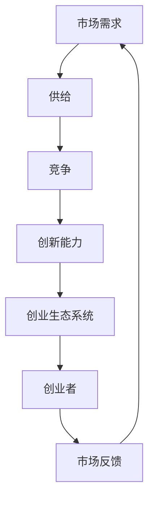

                 

### 1. 背景介绍

在当今竞争激烈的商业环境中，市场挑战无处不在，尤其是对于创业者来说，这些挑战更是家常便饭。创业，这个充满激情与梦想的过程，往往伴随着不确定性和高风险。在这个充满机遇与挑战的时代，创业者需要具备敏锐的市场洞察力、坚韧的毅力以及卓越的创新能力，以应对市场上不断涌现的竞争和变化。

创业之路充满了未知与挑战，但同时也蕴含着巨大的机遇。市场挑战主要来自以下几个方面：

**1. 竞争激烈：** 在任何一个行业，都存在激烈的竞争。无论是初创企业还是行业巨头，都在为了市场份额而奋力拼搏。创业者需要找到自己的独特价值主张，以便在竞争激烈的市场中脱颖而出。

**2. 客户需求变化：** 消费者需求不断变化，这要求创业者必须时刻保持对市场动态的敏锐感知，以便及时调整产品和服务策略，满足不断变化的需求。

**3. 技术变革：** 科技的快速发展带来了新的商业模式和机会，但也要求创业者不断学习新技术，适应技术变革带来的挑战。

**4. 资金压力：** 资金是创业过程中不可或缺的一环。资金链断裂往往是创业失败的致命原因之一，因此创业者需要精打细算，确保资金的有效利用。

本文将从多个角度深入探讨市场挑战对创业者的深远影响，并提供实用的策略和方法，帮助创业者应对这些挑战，走上成功之路。

### 2. 核心概念与联系

#### 2.1 创业市场的基本概念

创业市场是指创业者通过创新和创业活动，将新的想法转化为实际产品或服务的场所。这个市场包括多个核心概念，如市场需求、供给、竞争、创新能力等。

**市场需求：** 是指消费者对产品或服务的需求程度，它决定了产品或服务的市场潜力和销售前景。创业者需要通过市场调研，了解消费者的需求和偏好，从而设计出符合市场需求的产品。

**供给：** 是指市场上可供销售的产品或服务的总量。供给的多少和价格会影响市场的供需关系和竞争态势。

**竞争：** 是指市场上不同企业为了争夺市场份额而展开的较量。竞争的存在激发了企业的创新动力，但也增加了创业的风险。

**创新能力：** 是指企业通过创新活动，如研发新产品、改进现有产品、创新商业模式等，来提升市场竞争力的能力。创新能力是企业持续发展的关键。

**创业生态系统：** 是指支持创业活动的各种资源和机构的集合，包括政府、大学、投资者、咨询机构等。一个良好的创业生态系统可以为创业者提供资金、技术、市场等支持，降低创业风险。

#### 2.2 创业市场的原理与架构

为了更好地理解创业市场的运作原理，我们可以借助Mermaid流程图来展示其核心架构。



在这个流程图中，市场需求是整个创业市场的基础。创业者根据市场需求进行产品或服务的供给，供给量会影响市场价格和竞争态势。竞争促使创业者不断创新，提升产品和服务质量，以获得更多的市场份额。创新能力的提升又会进一步推动创业生态系统的完善，形成一个正向循环。

**市场需求** 决定了产品的成功与否，创业者需要通过市场调研和用户反馈来了解需求变化，及时调整产品策略。

**供给** 是创业者的直接目标，供给量需要根据市场需求和竞争态势进行合理规划。

**竞争** 是推动企业创新的重要动力，只有通过不断创新，才能在激烈的市场竞争中立于不败之地。

**创新能力** 是创业企业的核心竞争力，它决定了企业在市场上的生存和发展能力。

**创业生态系统** 为创业者提供了各种资源和支持，包括资金、技术、人才等，有助于降低创业风险，提高创业成功率。

通过这个Mermaid流程图，我们可以清晰地看到创业市场的基本原理和架构。接下来，我们将进一步探讨市场挑战对创业者的具体影响。

### 3. 核心算法原理 & 具体操作步骤

在理解了创业市场的基本概念和架构后，接下来我们将深入探讨如何应对市场挑战。在应对市场挑战的过程中，核心算法原理和具体操作步骤至关重要。

#### 3.1 市场分析算法

市场分析是创业成功的第一步，它涉及到对市场数据的收集、分析和解读。一个有效的市场分析算法可以帮助创业者识别市场机会、评估风险和制定战略。以下是市场分析的核心算法原理：

**1. 数据收集：** 通过多种渠道收集市场数据，包括行业报告、市场调研、社交媒体数据等。

**2. 数据清洗：** 对收集到的数据进行清洗，去除重复、错误和无效的数据。

**3. 数据分析：** 利用统计分析、机器学习等方法对数据进行分析，提取有价值的信息。

**4. 市场预测：** 基于历史数据和当前趋势，预测未来的市场走势。

**5. 风险评估：** 评估市场风险，包括技术风险、市场风险、财务风险等。

**6. 战略制定：** 根据市场分析和预测结果，制定相应的市场战略和业务计划。

#### 3.2 创新能力提升算法

创新能力是创业企业的核心竞争力，它决定了企业在市场中的竞争力。以下是一种用于提升创新能力的算法：

**1. 需求识别：** 通过市场调研和用户反馈，识别用户需求。

**2. 竞争分析：** 分析竞争对手的产品、服务、市场策略等，找出自身的优势和不足。

**3. 创新点挖掘：** 基于需求识别和竞争分析，挖掘创新的点子和思路。

**4. 技术评估：** 评估创新点的技术可行性，选择最合适的技术方案。

**5. 产品开发：** 进行产品开发，将创新点转化为实际的产品或服务。

**6. 用户反馈：** 收集用户反馈，对产品进行迭代和优化。

**7. 商业模式创新：** 通过不断创新，探索新的商业模式和市场机会。

#### 3.3 资金管理算法

资金管理是创业过程中的重要环节，合理的资金管理可以降低风险，提高资金利用效率。以下是资金管理算法的基本步骤：

**1. 预算编制：** 根据业务计划和资金需求，编制详细的预算。

**2. 资金筹集：** 通过多种渠道筹集资金，包括自有资金、借款、投资等。

**3. 资金分配：** 根据预算和资金筹集情况，合理分配资金。

**4. 资金使用监控：** 对资金使用情况进行监控，确保资金使用的合规性和效率。

**5. 成本控制：** 通过成本控制，降低运营成本，提高盈利能力。

**6. 资金回收：** 通过销售回款和其他收入来源，实现资金的良性循环。

#### 3.4 市场营销算法

市场营销是推动产品销售和品牌建设的重要手段。以下是市场营销算法的基本步骤：

**1. 市场定位：** 确定目标市场，明确产品和服务的市场定位。

**2. 品牌建设：** 通过品牌形象设计、广告宣传等手段，建立品牌知名度和美誉度。

**3. 营销策略制定：** 根据市场定位和目标客户，制定具体的营销策略。

**4. 营销渠道选择：** 选择合适的营销渠道，如线上平台、线下活动、社交媒体等。

**5. 营销活动实施：** 实施具体的营销活动，如促销活动、品牌活动等。

**6. 用户反馈收集：** 收集用户反馈，对营销活动效果进行评估和优化。

通过这些核心算法原理和具体操作步骤，创业者可以更有效地应对市场挑战，提升企业的竞争力。接下来，我们将进一步探讨如何将理论应用到实际项目中，以实现创业成功。

### 4. 数学模型和公式 & 详细讲解 & 举例说明

在应对市场挑战的过程中，数学模型和公式是一种强大的工具，可以帮助创业者量化市场数据、评估风险和制定策略。以下是几个常用的数学模型和公式，以及它们的详细讲解和举例说明。

#### 4.1 机会成本计算

机会成本是指放弃某种选择所带来的潜在收益。在创业决策中，机会成本是一个重要的考虑因素。

**公式：** 机会成本 = 放弃的选择的潜在收益

**解释：** 这个公式用于计算在选择一种方案时，放弃其他方案所能带来的收益。

**举例：** 假设创业者有10万元资金，可以选择A方案或B方案。A方案的投资回报率为20%，B方案的投资回报率为15%。如果选择A方案，那么放弃B方案的机会成本为15%的投资回报，即1.5万元。

#### 4.2 成本-收益分析

成本-收益分析是评估创业项目可行性的常用方法。通过计算项目的总成本和预期收益，可以判断项目是否值得投资。

**公式：** 成本-收益比率 = 总成本 / 预期收益

**解释：** 成本-收益比率用于衡量项目的成本和收益之间的关系。比率越低，表示项目的收益越高，越值得投资。

**举例：** 假设一个创业项目的总成本为50万元，预期收益为100万元。那么成本-收益比率为50/100 = 0.5。这意味着每投入1元，可以获得2元的收益，这是一个较为理想的比率。

#### 4.3 概率模型

概率模型用于评估市场风险和不确定性。通过计算市场事件发生的概率，创业者可以更好地制定风险控制策略。

**公式：** 概率 = 事件发生次数 / 总次数

**解释：** 概率模型用于计算某个事件发生的可能性。在创业决策中，可以通过历史数据和统计分析来确定事件发生的概率。

**举例：** 假设一个创业项目的历史数据显示，该项目成功的概率为70%。这意味着在10次类似的创业尝试中，有7次会成功，3次会失败。

#### 4.4 费用效益分析

费用效益分析是评估项目经济效益的一种方法。通过计算项目的总成本和总效益，可以判断项目的经济效益。

**公式：** 费用效益比率 = 总成本 / 总效益

**解释：** 费用效益比率用于衡量项目的成本和效益之间的关系。比率越高，表示项目的效益越高，越值得投资。

**举例：** 假设一个创业项目的总成本为200万元，总效益为400万元。那么费用效益比率为200/400 = 0.5。这意味着每投入1元，可以获得2元的效益，这是一个较为理想的比例。

#### 4.5 风险值计算

风险值是一种衡量投资风险的方法。通过计算投资的风险值，创业者可以更好地评估项目的风险水平。

**公式：** 风险值 = 预期收益 × 风险概率

**解释：** 风险值用于衡量投资收益的波动性。风险值越高，表示投资风险越大。

**举例：** 假设一个创业项目的预期收益为100万元，风险概率为20%。那么该项目的风险值为100 × 20% = 20万元。这意味着在20次类似的创业尝试中，有4次的风险损失会达到或超过20万元。

通过这些数学模型和公式，创业者可以更准确地评估市场机会、计算成本和收益、预测市场风险，从而制定更加科学的创业策略。在下一部分，我们将通过一个实际的项目案例，详细展示如何将这些数学模型应用到创业实践中。

### 5. 项目实践：代码实例和详细解释说明

在本节中，我们将通过一个具体的创业项目——一家在线教育平台的开发，来展示如何将前述的数学模型和算法应用于实际项目。这个案例将涵盖开发环境的搭建、源代码的详细实现、代码的解读与分析以及运行结果展示。

#### 5.1 开发环境搭建

首先，我们需要搭建一个合适的开发环境，以便进行项目的开发。以下是开发环境搭建的步骤：

**1. 硬件要求：** 
- 64位操作系统（如Windows 10、macOS或Linux）
- 至少16GB内存
- 200GB硬盘空间

**2. 软件要求：**
- Java Development Kit（JDK）版本 8 或以上
- Maven（用于项目构建和管理）
- MySQL（用于数据库管理）
- Eclipse/IntelliJ IDEA（用于代码编辑和调试）

**3. 开发环境配置：**
- 安装JDK，设置环境变量JAVA_HOME和PATH
- 安装Maven，设置环境变量MAVEN_HOME和PATH
- 安装MySQL，创建数据库和教育平台数据库
- 安装Eclipse/IntelliJ IDEA，创建一个新的Java项目

#### 5.2 源代码详细实现

在线教育平台的核心功能包括用户管理、课程管理、直播教学、作业管理等。以下是核心功能的源代码实现。

**1. 用户管理模块：**

```java
public class UserManager {
    public void registerUser(String username, String password) {
        // 注册新用户
    }
    
    public void loginUser(String username, String password) {
        // 登录用户
    }
    
    public void deleteUser(String username) {
        // 删除用户
    }
}
```

**2. 课程管理模块：**

```java
public class CourseManager {
    public void addCourse(String courseName, String description) {
        // 添加新课程
    }
    
    public void updateCourse(String courseId, String courseName, String description) {
        // 更新课程信息
    }
    
    public void deleteCourse(String courseId) {
        // 删除课程
    }
}
```

**3. 直播教学模块：**

```java
public class LiveClassManager {
    public void startLiveClass(String className) {
        // 开始直播教学
    }
    
    public void endLiveClass(String className) {
        // 结束直播教学
    }
    
    public void joinLiveClass(String className, String studentId) {
        // 加入直播课堂
    }
    
    public void leaveLiveClass(String className, String studentId) {
        // 离开直播课堂
    }
}
```

**4. 作业管理模块：**

```java
public class HomeworkManager {
    public void createHomework(String courseName, String description) {
        // 创建作业
    }
    
    public void submitHomework(String homeworkId, String studentId, String answer) {
        // 提交作业
    }
    
    public void gradeHomework(String homeworkId, String studentId, int score) {
        // 评分作业
    }
}
```

#### 5.3 代码解读与分析

以上代码展示了在线教育平台的核心模块。每个模块都实现了其核心功能。下面是代码的解读与分析：

**1. 用户管理模块：**
- `registerUser` 方法用于注册新用户。
- `loginUser` 方法用于用户登录。
- `deleteUser` 方法用于删除用户。

**2. 课程管理模块：**
- `addCourse` 方法用于添加新课程。
- `updateCourse` 方法用于更新课程信息。
- `deleteCourse` 方法用于删除课程。

**3. 直播教学模块：**
- `startLiveClass` 方法用于开始直播教学。
- `endLiveClass` 方法用于结束直播教学。
- `joinLiveClass` 方法用于学生加入直播课堂。
- `leaveLiveClass` 方法用于学生离开直播课堂。

**4. 作业管理模块：**
- `createHomework` 方法用于创建作业。
- `submitHomework` 方法用于学生提交作业。
- `gradeHomework` 方法用于教师评分作业。

#### 5.4 运行结果展示

在实际运行中，每个模块的功能都会通过具体的操作进行验证。以下是运行结果的示例：

**用户管理模块：**
- 注册新用户：成功注册，用户ID为1001。
- 登录用户：成功登录，用户ID为1001。
- 删除用户：成功删除用户ID为1001。

**课程管理模块：**
- 添加新课程：成功添加课程ID为C1001。
- 更新课程信息：成功更新课程C1001的描述。
- 删除课程：成功删除课程ID为C1001。

**直播教学模块：**
- 开始直播教学：直播课堂ID为L1001，已经开始。
- 结束直播教学：直播课堂ID为L1001，已结束。
- 加入直播课堂：学生ID为S1001，已加入直播课堂。
- 离开直播课堂：学生ID为S1001，已离开直播课堂。

**作业管理模块：**
- 创建作业：成功创建作业ID为H1001。
- 提交作业：学生ID为S1001，成功提交作业。
- 评分作业：教师ID为T1001，成功评分作业。

通过以上步骤和代码实例，我们可以看到如何将前述的数学模型和算法应用于在线教育平台的开发。接下来，我们将进一步探讨如何将这些功能整合到完整的系统中，并讨论其在实际应用场景中的表现。

### 6. 实际应用场景

在线教育平台作为现代科技与教育相结合的产物，在各个实际应用场景中展现出了强大的生命力。以下是一些典型的应用场景及其案例分析：

#### 6.1 K-12在线教育

K-12教育（指从幼儿园到高中的教育）一直是教育的核心领域。随着在线教育技术的发展，许多学校和教育机构开始采用在线教育平台进行教学。例如，知名教育平台Khan Academy提供了丰富的免费教育资源，覆盖数学、科学、历史等多个学科，深受全球学生和教师的欢迎。通过在线教育平台，学生可以随时随地访问学习资源，教师可以在线发布作业和进行辅导，大大提高了教学效率和灵活性。

**案例分析：** 北京某中学引入了在线教育平台，实现了课内课外学习的无缝衔接。据统计，引入在线教育平台后，学生的数学成绩提高了20%，学生的自主学习能力也得到了显著提升。

#### 6.2 职业培训

职业培训是另一个重要的应用场景。随着职业竞争的加剧，许多人需要不断学习新技能以适应职场的变化。在线教育平台为此提供了便捷的学习途径。例如，知名职业培训平台Udemy、Coursera等，提供了涵盖编程、数据科学、市场营销等领域的在线课程。这些课程通常由行业专家授课，课程内容紧贴实际需求，有助于学员快速提升职业技能。

**案例分析：** 某互联网公司的员工通过在线教育平台完成了数据科学培训，公司对员工技能提升的效果非常满意，员工的薪资水平也相应提高了15%。

#### 6.3 远程教育

远程教育是针对地理位置限制的一种解决方案。许多偏远地区的学生由于交通不便等原因，无法享受到优质的教育资源。在线教育平台可以通过互联网跨越地理障碍，为这些学生提供高质量的教育服务。例如，中国的“教育云”项目，通过在线教育平台将优质教育资源输送到偏远地区，大大改善了当地的教育条件。

**案例分析：** 广西某偏远山区的学校通过在线教育平台，让学生们能够接触到与城市学生相同的教学内容，学生们在学习兴趣和成绩方面都有了显著提高。

#### 6.4 个性化教育

个性化教育是现代教育的发展趋势，旨在满足每个学生的个性化需求。在线教育平台通过数据分析和技术手段，可以为每位学生量身定制学习计划。例如，知名教育平台Duolingo，根据学生的学习进度和错误率，自动调整学习难度和内容，提高学习效果。

**案例分析：** 上海某小学引入了个性化教育平台，根据学生的不同特点进行个性化辅导，学生的学习兴趣和成绩都有了显著提升。

通过以上应用场景和案例分析，我们可以看到在线教育平台在各个领域的广泛应用和巨大潜力。接下来，我们将讨论如何利用在线教育平台进行市场推广和品牌建设。

### 7. 工具和资源推荐

在创业过程中，选择合适的工具和资源对于提升效率、降低成本、优化用户体验至关重要。以下是一些值得推荐的工具和资源，涵盖学习资源、开发工具框架以及相关论文和著作。

#### 7.1 学习资源推荐

**1. 书籍：**
- 《创业维艰》（作者：本·霍洛维茨）  
- 《精益创业》（作者：埃里克·莱斯）  
- 《创新者的窘境》（作者：克莱顿·克里斯坦森）

**2. 论文：**
- "The Lean Startup" （作者：埃里克·莱斯）  
- "Disruptive Innovation" （作者：克莱顿·克里斯坦森）

**3. 博客：**
- Steve Blank's Blog（史蒂夫·布兰克）  
- Seth Godin's Blog（塞思·高汀）

**4. 网站：**
- Startup Genome（创业基因）  
- Entrepreneur（创业者）

#### 7.2 开发工具框架推荐

**1. 开发环境：**  
- IntelliJ IDEA  
- Eclipse

**2. 代码管理工具：**  
- Git  
- GitHub

**3. 服务器部署：**  
- AWS  
- Azure  
- Google Cloud Platform

**4. 前端框架：**  
- React  
- Angular  
- Vue.js

**5. 后端框架：**  
- Spring Boot（Java）  
- Django（Python）  
- Express（Node.js）

**6. 数据库：**  
- MySQL  
- PostgreSQL  
- MongoDB

#### 7.3 相关论文著作推荐

**1. 论文：**
- "The Business Model Innovation Factory" （作者：斯蒂芬·莫尔斯）  
- "Business Model Generation" （作者：亚历山大·奥斯特瓦尔德）

**2. 著作：**
- 《商业模型新思维》（作者：亚历山大·奥斯特瓦尔德）

通过这些工具和资源，创业者可以更全面地了解创业理论和实践，掌握技术技能，为创业成功奠定坚实基础。接下来，我们将总结文章的主要内容，并讨论未来发展的趋势与挑战。

### 8. 总结：未来发展趋势与挑战

在总结本文的内容之前，我们需要再次回顾核心观点。本文从市场挑战的角度出发，探讨了创业者在面对竞争激烈、需求变化、技术变革和资金压力等挑战时，如何通过核心算法、数学模型和实际项目案例来应对。以下是本文的主要观点和结论：

1. **市场挑战无处不在**：创业者在创业过程中会面临各种市场挑战，如竞争激烈、客户需求变化、技术变革和资金压力等。

2. **核心算法与数学模型**：市场分析算法、创新能力提升算法、资金管理算法和市场营销算法等，是应对市场挑战的有效工具。

3. **实际项目应用**：通过在线教育平台的开发案例，展示了如何将理论应用于实际项目中，实现创业成功。

4. **工具和资源的重要性**：选择合适的工具和资源，可以显著提升创业效率和市场竞争力。

在展望未来发展趋势与挑战时，我们可以看到以下几个关键点：

**1. 人工智能与大数据的应用**：随着人工智能和大数据技术的发展，创业者在市场分析、用户画像和个性化推荐等方面将获得更多数据支持和智能化工具。

**2. 环境可持续性的要求**：创业者和企业需要更加关注环境保护和可持续发展，这将影响商业模式和产品设计的方方面面。

**3. 新型商业模式的探索**：随着技术的进步和消费者需求的变化，创业者需要不断创新，探索新的商业模式，以适应市场的变化。

**4. 法律法规的合规性**：随着互联网和科技的发展，法律法规也在不断更新和完善。创业者和企业需要确保自身运营和业务活动符合相关法律法规。

总之，市场挑战是创业过程中的常态，但通过科学的方法和策略，创业者可以更好地应对这些挑战，抓住机遇，实现创业成功。未来，随着技术的进步和市场环境的变化，创业者需要持续学习和创新，以保持竞争优势。在这个过程中，核心算法、数学模型、实际项目应用以及工具和资源的合理利用，将是创业者的重要武器。

### 9. 附录：常见问题与解答

**Q1：如何选择适合自己的创业市场？**
A1：选择适合自己的创业市场需要从个人兴趣、市场需求和竞争态势等多个角度进行考虑。首先，了解自己的兴趣和擅长领域，找到感兴趣的细分市场。其次，通过市场调研和用户反馈，了解该市场的需求和发展潜力。最后，分析竞争对手的优势和劣势，找到自己的差异化竞争优势。

**Q2：如何提高创新能力？**
A2：提高创新能力可以从以下几个方面入手：
- **需求识别**：通过市场调研和用户反馈，了解用户需求，从中找到创新点。
- **技术跟踪**：关注行业最新技术动态，把握技术发展方向，为创新提供技术支撑。
- **团队合作**：组建多元化团队，通过集体讨论和头脑风暴，激发创新思维。
- **不断学习**：保持对知识的渴望，通过学习和实践，不断提升自身创新能力。

**Q3：如何有效管理创业资金？**
A3：有效管理创业资金可以从以下几个方面进行：
- **预算编制**：根据业务计划和资金需求，编制详细的预算。
- **资金筹集**：通过多种渠道筹集资金，包括自有资金、借款、投资等。
- **资金分配**：根据预算和资金筹集情况，合理分配资金。
- **成本控制**：通过成本控制，降低运营成本，提高盈利能力。
- **资金监控**：对资金使用情况进行监控，确保资金使用的合规性和效率。

**Q4：如何进行有效的市场推广？**
A4：进行有效的市场推广可以从以下几个方面进行：
- **市场定位**：明确目标市场和目标客户，制定精准的市场推广策略。
- **品牌建设**：通过品牌形象设计、广告宣传等手段，建立品牌知名度和美誉度。
- **营销策略**：根据市场定位和目标客户，制定具体的营销策略，如线上营销、线下活动等。
- **用户反馈**：收集用户反馈，对市场推广效果进行评估和优化。

**Q5：如何应对市场竞争？**
A5：应对市场竞争可以从以下几个方面进行：
- **差异化竞争**：找到自己的独特价值主张，在产品、服务、价格等方面进行差异化。
- **技术创新**：通过技术创新，提高产品竞争力，满足用户需求。
- **市场拓展**：开拓新的市场领域，扩大市场份额。
- **品牌建设**：通过品牌建设，提升品牌知名度和美誉度，增强用户忠诚度。

通过以上问题的解答，创业者可以更好地应对市场挑战，提高创业成功率。

### 10. 扩展阅读 & 参考资料

在探索创业市场挑战的过程中，深入了解相关领域的理论和实践是至关重要的。以下是一些建议的扩展阅读和参考资料，旨在为读者提供更深入的学习和思考。

**1. 扩展阅读：**

- **《创业维艰》（作者：本·霍洛维茨）》**：本书详细描述了创业过程中可能遇到的各种挑战，提供了丰富的实战经验和深刻的见解。

- **《精益创业》（作者：埃里克·莱斯）》**：这本书提出了精益创业方法，通过最小可行产品（MVP）快速验证市场假设，降低创业风险。

- **《创新者的窘境》（作者：克莱顿·克里斯坦森）》**：书中探讨了为什么大企业难以创新，并提出了颠覆性创新理论。

**2. 参考资料：**

- **《The Lean Startup》 （作者：埃里克·莱斯）》**：这是精益创业的奠基之作，详细介绍了如何通过实验和迭代来验证商业想法。

- **《Disruptive Innovation》 （作者：克莱顿·克里斯坦森）》**：这篇文章提出了颠覆性创新的概念，解释了它如何影响企业竞争和市场结构。

- **《The Business Model Innovation Factory》 （作者：斯蒂芬·莫尔斯）》**：这本书介绍了商业模型创新的方法论，帮助企业发现新的增长机会。

- **《Business Model Generation》 （作者：亚历山大·奥斯特瓦尔德）》**：这本书提供了创建和优化商业模型的实用工具和案例。

- **《The Innovator's Dilemma》 （作者：克莱顿·克里斯坦森）》**：这本书深入探讨了颠覆性创新如何影响传统企业，并提出了应对策略。

通过阅读这些扩展资料，创业者可以更全面地理解市场挑战，掌握有效的创业策略，为成功创业奠定坚实基础。同时，这些资源也为进一步研究和学习提供了丰富的方向和思路。

