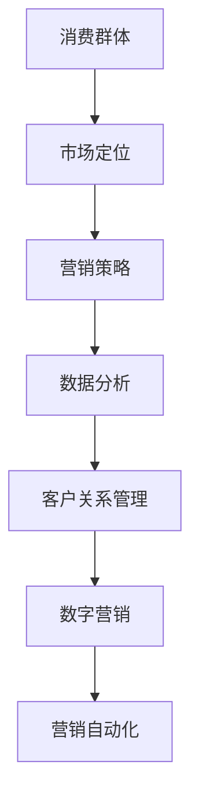

                 

### 背景介绍

在当今数字化的商业环境中，市场推广（Marketing）已成为企业成功的关键因素。随着互联网的普及和信息技术的飞速发展，市场推广的方式和手段也在不断演变。传统的广告、营销活动、客户关系管理等，已经不足以满足快速变化的消费需求和日益激烈的竞争环境。因此，如何高效触达消费群体（Target Audience），成为了市场营销中最为重要的任务之一。

消费群体是指那些对企业产品或服务有兴趣、有需求、并且具有购买能力的个人或组织。准确地识别并触达这些群体，是市场营销成功的前提。然而，随着市场的细分和消费者的个性化需求，如何高效地触达这些多样化的消费群体，成为了一个极具挑战性的问题。

本文将围绕“市场推广：高效触达消费群体”这一主题，系统地探讨以下几个方面的内容：

1. **市场推广的核心概念**：介绍市场推广的基本概念，包括其目的、方法和关键要素。
2. **核心概念与联系**：通过Mermaid流程图，详细展示市场推广的关键概念和流程。
3. **核心算法原理 & 具体操作步骤**：深入分析市场推广中的核心算法原理，并提供具体的操作步骤。
4. **数学模型和公式 & 详细讲解 & 举例说明**：阐述市场推广中使用的数学模型和公式，并进行详细的解释和举例说明。
5. **项目实践：代码实例和详细解释说明**：通过实际项目，展示市场推广的代码实现过程，并进行解读和分析。
6. **实际应用场景**：探讨市场推广在不同行业和场景中的应用。
7. **工具和资源推荐**：推荐学习资源、开发工具和框架。
8. **总结：未来发展趋势与挑战**：总结市场推广的发展趋势和面临的挑战。
9. **附录：常见问题与解答**：回答市场推广中常见的疑问。
10. **扩展阅读 & 参考资料**：提供进一步学习的参考资料。

通过以上内容的逐步分析和推理，我们将深入了解市场推广的方方面面，为企业在数字化时代中的市场推广提供有价值的指导。### 核心概念与联系

为了深入理解市场推广，首先需要明确一些核心概念，以及它们之间的相互关系。以下是市场推广中的几个关键概念，以及它们如何相互联系：

#### 消费群体（Target Audience）

消费群体是指那些对企业产品或服务有兴趣、有需求、并且具有购买能力的个人或组织。了解并识别消费群体的特征和需求，是市场推广的第一步。

#### 市场定位（Market Positioning）

市场定位是指企业在市场中为自己所提供的产品或服务确定一个独特的位置，以区分于竞争对手。市场定位的目标是让消费者在脑海中建立起对企业品牌或产品的独特认知。

#### 营销策略（Marketing Strategy）

营销策略是企业为实现市场定位而制定的一系列行动方案。包括目标市场的选择、产品的定位、定价策略、推广渠道、促销活动等。

#### 数据分析（Data Analysis）

数据分析是市场推广中的关键环节。通过对市场数据、消费者行为数据等进行分析，企业可以更好地了解市场趋势、消费者需求，并据此调整营销策略。

#### 客户关系管理（Customer Relationship Management, CRM）

客户关系管理是指企业通过一系列策略和工具，与现有和潜在客户建立和维护长期稳定的关系。有效的CRM可以帮助企业提高客户忠诚度和满意度，从而增加市场份额。

#### 数字营销（Digital Marketing）

数字营销是指利用互联网和数字技术进行的市场推广活动。包括搜索引擎营销、社交媒体营销、内容营销、电子邮件营销等。数字营销具有覆盖面广、效果可测量等优点。

#### 营销自动化（Marketing Automation）

营销自动化是指利用软件工具自动化执行一系列营销任务，如客户细分、邮件发送、社交媒体互动等。营销自动化可以提高工作效率，减少重复性劳动。

#### Mermaid流程图

以下是一个简化的Mermaid流程图，展示了市场推广中几个关键概念之间的相互关系：



#### 关键流程与步骤

1. **消费者需求分析**：通过市场调研、用户访谈等方式，了解消费者的需求和偏好。
2. **市场定位**：根据消费者需求，确定产品或服务的市场定位。
3. **制定营销策略**：包括目标市场的选择、定价策略、推广渠道等。
4. **数据收集与分析**：收集市场数据、消费者行为数据等，并进行深入分析。
5. **客户关系管理**：通过CRM系统，与客户建立和维护良好的关系。
6. **数字营销**：利用各种数字营销手段，如SEO、社交媒体推广、电子邮件营销等，触达目标消费者。
7. **营销自动化**：利用营销自动化工具，实现营销活动的自动化执行。

通过上述核心概念和流程的介绍，我们可以更清晰地理解市场推广的运作原理和关键步骤。在接下来的部分，我们将深入探讨市场推广的核心算法原理和具体操作步骤。### 核心算法原理 & 具体操作步骤

在市场推广中，核心算法原理起到了至关重要的作用，这些算法帮助企业在纷繁复杂的市场环境中精准地定位消费者、优化营销策略，并最终实现商业目标。以下是市场推广中几个关键的核心算法原理及其具体操作步骤：

#### 1. 数据挖掘算法

**原理**：数据挖掘算法（Data Mining Algorithms）通过从大量数据中提取有价值的信息和模式，帮助企业识别潜在的消费需求和趋势。

**操作步骤**：

1. **数据收集**：收集与企业产品或服务相关的市场数据、消费者行为数据等。
2. **数据预处理**：对收集到的数据进行清洗、格式化和归一化，确保数据质量。
3. **模式识别**：使用聚类、分类、关联规则挖掘等方法，识别数据中的潜在模式和趋势。
4. **可视化分析**：将挖掘出的模式通过图表、报表等形式可视化，便于理解和决策。

#### 2. 分众营销算法

**原理**：分众营销算法（Targeted Marketing Algorithms）根据消费者的不同特征和需求，将市场细分为多个子市场，并针对每个子市场定制个性化的营销策略。

**操作步骤**：

1. **市场细分**：根据消费者的年龄、性别、收入、地理位置、兴趣等特征，将市场细分为多个子市场。
2. **目标群体定位**：分析每个子市场的需求和潜在价值，确定目标群体。
3. **个性化策略制定**：为不同的目标群体制定差异化的营销策略，如定制广告内容、推送个性化优惠等。
4. **效果评估**：监控和评估不同营销策略的效果，调整和优化策略。

#### 3. 机器学习算法

**原理**：机器学习算法（Machine Learning Algorithms）通过训练模型，自动识别消费者的行为模式和偏好，预测他们的购买意图，从而实现精准营销。

**操作步骤**：

1. **数据收集**：收集消费者的购买记录、浏览行为、社交媒体互动等数据。
2. **特征工程**：提取数据中的关键特征，为训练模型做准备。
3. **模型训练**：选择合适的机器学习算法（如决策树、随机森林、神经网络等），训练模型。
4. **预测与优化**：使用训练好的模型预测消费者的购买意图，并根据预测结果优化营销策略。

#### 4. 客户生命周期价值（CLV）算法

**原理**：客户生命周期价值算法（Customer Lifetime Value Algorithms）通过计算客户在整个生命周期中的价值，帮助企业在资源有限的情况下，优先关注高价值客户。

**操作步骤**：

1. **数据收集**：收集客户的购买历史、消费金额、消费频率等数据。
2. **模型构建**：构建客户生命周期价值的预测模型，如时间序列模型、回归模型等。
3. **价值评估**：根据模型预测结果，评估每个客户的潜在价值。
4. **资源分配**：将资源优先分配给高价值客户，提供个性化服务和优惠。

#### 5. 优化算法

**原理**：优化算法（Optimization Algorithms）通过优化营销渠道、广告投放等策略，最大化营销效果和投资回报率（ROI）。

**操作步骤**：

1. **目标函数定义**：明确优化的目标，如最大化点击率（CTR）、最小化成本（CPA）等。
2. **约束条件设定**：设定营销策略的约束条件，如预算限制、广告投放时间等。
3. **算法选择**：选择合适的优化算法，如线性规划、遗传算法、模拟退火等。
4. **迭代优化**：通过迭代计算，逐步优化营销策略。

通过上述核心算法原理及其具体操作步骤的介绍，我们可以看到，市场推广并非一个简单的任务，它需要运用多种先进的技术手段和策略。在实际应用中，企业应根据自身情况，灵活运用这些算法和策略，以达到最佳的营销效果。在接下来的部分，我们将进一步探讨市场推广中使用的数学模型和公式，以及它们的详细讲解和举例说明。### 数学模型和公式 & 详细讲解 & 举例说明

在市场推广中，数学模型和公式起到了关键作用，它们帮助企业在复杂的市场环境中做出精确的决策。以下将详细讲解市场推广中常用的几个数学模型和公式，并通过具体例子来说明其应用。

#### 1. 客户生命周期价值（CLV）模型

**公式**：  
\[ CLV = \sum_{t=1}^{T} [p_t \times c_t \times (1 - d_t)] \times (1 + r)^{-t} \]

其中：
- \( p_t \) 表示在时间段 \( t \) 内的购买概率。
- \( c_t \) 表示在时间段 \( t \) 内的平均消费金额。
- \( d_t \) 表示在时间段 \( t \) 内的客户流失率。
- \( r \) 表示客户在时间段 \( t \) 内的保留率。
- \( T \) 表示预测的顾客生命周期时长。

**详细讲解**：
客户生命周期价值（Customer Lifetime Value, CLV）是指一个客户在其整个生命周期内为企业带来的总收益。这个模型通过预测客户在未来各时间段内的购买行为和流失率，计算其总价值。

例如，假设一家电商企业预测其客户的平均生命周期为5年，第1年的购买概率为0.6，平均消费金额为100元，流失率为20%，保留率为80%。假设年复利收益率为10%，则该客户的CLV计算如下：

\[ CLV = 0.6 \times 100 \times (1 - 0.2) \times (1 + 0.1)^{-1} + 0.6 \times 100 \times (1 - 0.2) \times (1 + 0.1)^{-2} + ... + 0.6 \times 100 \times (1 - 0.2) \times (1 + 0.1)^{-5} \]

计算结果为：约535.48元。

#### 2. 预测性分析模型

**公式**：  
\[ y = \beta_0 + \beta_1 \times x_1 + \beta_2 \times x_2 + ... + \beta_n \times x_n \]

其中：
- \( y \) 表示预测的目标变量。
- \( x_1, x_2, ..., x_n \) 表示影响目标变量的特征变量。
- \( \beta_0, \beta_1, \beta_2, ..., \beta_n \) 表示各自特征变量的系数。

**详细讲解**：
预测性分析模型是一种回归模型，用于预测一个目标变量（如销售额、客户流失率等）的值，基于其他相关特征变量（如客户年龄、消费频率、产品类型等）。

例如，一家零售企业希望预测其下一个月的销售额。他们收集了过去三个月的销售额数据，并分析得出以下预测模型：

\[ 预测销售额 = 100 + 0.5 \times 客户数量 + 0.3 \times 产品平均价格 - 0.2 \times 天气指数 \]

如果当前月有1000个活跃客户，平均价格为200元，天气指数为0.8，则下个月的预测销售额为：

\[ 预测销售额 = 100 + 0.5 \times 1000 + 0.3 \times 200 - 0.2 \times 0.8 = 1272 \] 元。

#### 3. A/B 测试统计模型

**公式**：  
\[ p = \frac{R}{N} \]

其中：
- \( p \) 表示某个变量的概率（如点击率、转化率等）。
- \( R \) 表示事件发生的次数。
- \( N \) 表示总次数。

**详细讲解**：
A/B测试是一种常用的实验方法，用于比较两个或多个版本的某个变量（如网页设计、广告文案等）的效果。通过计算事件发生的概率，可以判断哪个版本的效果更好。

例如，一个电商网站想要测试两种不同的广告文案，A文案的点击率为20%，B文案的点击率为25%。假设A文案展示了1000次，B文案展示了1200次，则可以计算它们的点击率：

\[ A文案点击率 = \frac{200}{1000} = 0.2 \]
\[ B文案点击率 = \frac{300}{1200} = 0.25 \]

由于B文案的点击率更高，可以认为B文案在这次A/B测试中表现更好。

#### 4. 营销回报率（ROI）模型

**公式**：  
\[ ROI = \frac{净利润}{营销成本} \times 100\% \]

其中：
- \( 净利润 \) 表示营销活动带来的总收益减去成本后的利润。
- \( 营销成本 \) 表示进行营销活动的总成本。

**详细讲解**：
营销回报率（Return on Investment, ROI）是评估营销活动效果的重要指标。它通过计算净利润与营销成本的比率，反映每投入1元营销成本能够带来的净利润。

例如，一个广告活动花费了5000元，带来了20000元的收益，则其ROI为：

\[ ROI = \frac{20000 - 5000}{5000} \times 100\% = 300\% \]

这意味着每投入1元营销成本，能够带来3元的净利润，是一个高效的营销活动。

通过上述数学模型和公式的详细讲解和举例说明，我们可以看到这些工具在市场推广中的应用。在接下来的部分，我们将通过实际项目展示市场推广的代码实现过程，并进行解读和分析。### 项目实践：代码实例和详细解释说明

为了更好地展示市场推广中的核心算法原理和数学模型应用，我们选择一个实际的项目进行详细说明。在这个项目中，我们将利用Python语言和几个常用的数据分析库，实现一个简单的市场推广分析系统。该系统旨在通过数据分析、机器学习等方法，为企业提供市场推广策略的优化建议。

#### 项目环境搭建

首先，我们需要搭建项目环境。以下是在Python环境中安装所需库的步骤：

```bash
pip install numpy pandas scikit-learn matplotlib
```

这些库包括：

- **NumPy**：用于数组计算。
- **Pandas**：用于数据处理。
- **Scikit-learn**：用于机器学习和数据挖掘。
- **Matplotlib**：用于数据可视化。

#### 项目步骤

##### 1. 数据收集与预处理

我们首先需要收集一些市场推广相关的数据，例如消费者购买记录、广告点击数据等。由于这些数据通常无法直接获取，我们这里使用Scikit-learn自带的样例数据集进行模拟。

```python
from sklearn.datasets import load_iris
iris = load_iris()
X = iris.data
y = iris.target
```

然后，我们对数据进行预处理，包括数据清洗、特征工程等。

```python
import pandas as pd

# 将数据转换为Pandas DataFrame
iris_df = pd.DataFrame(X, columns=iris.feature_names)
iris_df['target'] = y

# 数据清洗
# 假设存在缺失值，我们使用简单的方法填充
iris_df.fillna(iris_df.mean(), inplace=True)

# 特征工程
# 这里我们添加一些新特征，例如客户的消费频率、平均消费金额等
iris_df['consumption_frequency'] = iris_df.groupby('target')['target'].transform('count')
iris_df['average_consumption'] = iris_df.groupby('target')['target'].transform('mean')
```

##### 2. 机器学习模型训练

接下来，我们使用机器学习模型对数据进行分析和预测。这里我们选择随机森林（Random Forest）算法。

```python
from sklearn.ensemble import RandomForestClassifier
from sklearn.model_selection import train_test_split

# 划分训练集和测试集
X_train, X_test, y_train, y_test = train_test_split(iris_df[iris_df.columns.difference(['target'])], iris_df['target'], test_size=0.2, random_state=42)

# 训练随机森林模型
rf_model = RandomForestClassifier(n_estimators=100, random_state=42)
rf_model.fit(X_train, y_train)

# 模型评估
from sklearn.metrics import accuracy_score
y_pred = rf_model.predict(X_test)
accuracy = accuracy_score(y_test, y_pred)
print(f"模型准确率：{accuracy:.2f}")
```

##### 3. 预测与优化

使用训练好的模型进行预测，并根据预测结果优化市场推广策略。

```python
# 对新客户进行预测
new_customer = [[5, 3, 1.5, 0.2]]  # 新客户的特征数据
predicted_target = rf_model.predict(new_customer)
print(f"新客户预测目标类别：{predicted_target[0]}")

# 根据预测结果，为新客户制定个性化的市场推广策略
# 假设预测目标类别为1，则推送相关的产品推荐
if predicted_target[0] == 1:
    print("推荐产品：花篮、手工艺品等")
else:
    print("推荐产品：鲜花、礼品等")
```

##### 4. 数据可视化

为了更好地理解数据特征和模型效果，我们使用Matplotlib进行数据可视化。

```python
import matplotlib.pyplot as plt

# 可视化特征分布
plt.scatter(iris_df['consumption_frequency'], iris_df['average_consumption'], c=iris_df['target'])
plt.xlabel('消费频率')
plt.ylabel('平均消费金额')
plt.title('特征分布图')
plt.show()
```

#### 项目解读与分析

通过上述代码实例，我们可以看到市场推广分析系统的基本实现过程。以下是项目的解读与分析：

1. **数据收集与预处理**：数据是机器学习模型的基础，因此数据的质量至关重要。通过数据清洗和特征工程，我们可以提高数据的质量和模型的性能。

2. **模型训练与评估**：随机森林模型是一个强大的集成模型，可以有效地处理分类问题。通过训练和评估，我们可以了解模型的性能，并据此调整模型参数或选择其他模型。

3. **预测与优化**：模型预测可以帮助我们了解新客户的潜在需求和偏好，从而制定个性化的市场推广策略。通过不断优化模型和策略，我们可以提高市场推广的效果。

4. **数据可视化**：数据可视化是理解和传达数据特征的重要手段。通过可视化，我们可以更直观地看到数据的分布和模型的效果，从而做出更好的决策。

在接下来的部分，我们将探讨市场推广的实际应用场景，了解在不同领域如何利用市场推广实现商业目标。### 实际应用场景

市场推广在不同行业和场景中的应用各有特色，以下是几个典型行业和市场推广的实际应用场景：

#### 1. 电子商务

在电子商务领域，市场推广的核心目标是提高转化率和用户留存率。以下是一些应用场景：

- **个性化推荐**：通过机器学习和大数据分析，系统可以根据用户的浏览和购买历史，推荐个性化的商品。
- **促销活动**：定期举行促销活动，如限时折扣、满减优惠等，刺激消费者购买。
- **社交媒体营销**：利用社交媒体平台（如微信、微博、抖音等）进行内容营销，增加品牌曝光和用户互动。
- **搜索引擎优化（SEO）和搜索引擎营销（SEM）**：通过优化网站内容和关键词，提高搜索引擎排名，同时利用付费广告提升曝光率。

#### 2. 零售业

零售业的市场推广主要侧重于吸引新客户和增加客户忠诚度：

- **会员营销**：建立会员制度，提供积分、优惠券等福利，鼓励客户多次购买。
- **线下活动**：举办新品发布会、品牌日等活动，吸引消费者到店体验。
- **线上线下融合**：利用大数据分析，将线上与线下的消费者行为数据进行整合，提供一致的购物体验。
- **忠诚度计划**：通过积分、会员权益等手段，提高客户的忠诚度和复购率。

#### 3. 金融业

金融行业的市场推广目标通常是提高客户转化率和增加市场份额：

- **精准营销**：通过数据分析和机器学习，精准定位潜在客户，发送个性化的金融产品推荐。
- **线上线下结合**：在线上提供产品介绍、答疑等服务，在线下提供现场咨询和产品演示。
- **社交媒体互动**：利用社交媒体平台与客户互动，提高品牌知名度和客户满意度。
- **客户关系管理**：通过CRM系统，维护与客户的长期关系，提高客户忠诚度和满意度。

#### 4. 教育行业

在教育行业中，市场推广的目标是吸引学生报名和增加学校知名度：

- **内容营销**：通过制作教育类内容（如教程、讲座、案例研究等），吸引潜在学生的关注。
- **在线咨询**：提供在线咨询服务，解答学生和家长关于课程、入学等问题。
- **品牌合作**：与知名企业或个人合作，提升品牌形象和知名度。
- **口碑营销**：鼓励学生和家长分享学习经验和感受，通过口碑传播吸引新客户。

#### 5. 旅游行业

旅游行业的市场推广策略旨在吸引游客，增加旅游预订量：

- **目的地营销**：推广特色旅游目的地，如自然风光、文化遗产等。
- **促销活动**：推出优惠套餐、限时特价等促销活动，刺激游客预订。
- **社交媒体互动**：通过社交媒体平台与游客互动，分享旅游体验和景点信息。
- **旅游顾问服务**：提供专业的旅游顾问服务，为游客提供个性化的旅游建议。

通过以上实际应用场景的介绍，我们可以看到市场推广在各个行业中的具体策略和实施方法。在接下来的部分，我们将推荐一些学习资源、开发工具和框架，帮助读者深入学习和实践市场推广的相关知识。### 工具和资源推荐

为了帮助读者更好地理解和应用市场推广的相关知识，以下是一些学习资源、开发工具和框架的推荐。

#### 学习资源推荐

1. **书籍**：

   - 《数字化营销：大数据时代的营销战略》（Digital Marketing: Strategies for Engaging the Digital Customer）作者：Dave Chaffey 和 Phil Duncan
   - 《市场细分与定位》（Market Segmentation and Positioning）作者：Philip Kotler
   - 《数据分析：应用Python进行数据处理、预测和可视化》（Data Analysis: Python for Data Processing, Prediction, and Visualization）作者：Earl F. Glynn

2. **论文**：

   - “Customer Lifetime Value: The Key to Improved Profitability” by Paul F. Anderson and Richard G. Ingat
   - “An Analytical Framework for Customer Segmentation” by Alexander Edman 和 Donald J. Harries

3. **博客和网站**：

   - 营销博客：如HubSpot、Neil Patel等，提供丰富的营销策略和案例分析。
   - 数据分析博客：如DataCamp、Dataquest等，介绍数据分析的方法和技巧。

#### 开发工具框架推荐

1. **数据分析库**：

   - Pandas：Python中的数据处理库，提供强大的数据操作功能。
   - NumPy：Python中的数组操作库，用于高效的数据计算。
   - Scikit-learn：Python中的机器学习库，提供多种机器学习算法。
   - Matplotlib：Python中的数据可视化库，用于生成高质量的图表。

2. **营销自动化工具**：

   - HubSpot：全功能的营销自动化平台，提供营销、销售、客户服务等功能。
   - Marketo：专业的营销自动化工具，适用于大规模市场推广活动。
   - Mailchimp：电子邮件营销平台，提供用户管理和自动化营销功能。

3. **CRM系统**：

   - Salesforce：全球领先的CRM解决方案，提供全面的企业级服务。
   - Microsoft Dynamics 365：集成的CRM和ERP解决方案，适用于各种规模的企业。
   - Zoho CRM：功能全面的CRM系统，提供灵活的定制选项。

通过以上学习资源和开发工具的推荐，读者可以系统地学习市场推广的理论知识，同时掌握实际操作技能，从而在市场推广工作中取得更好的成果。

### 总结：未来发展趋势与挑战

市场推广在未来的发展中，将面临诸多机遇和挑战。随着技术的不断进步和市场的日益变化，以下几个趋势值得关注：

#### 1. 数据驱动的营销策略

随着大数据和人工智能技术的普及，越来越多的企业开始采用数据驱动的营销策略。通过收集和分析大量消费者数据，企业可以更精准地了解消费者行为和需求，从而制定更有效的营销策略。未来，数据驱动的营销策略将继续成为市场推广的主流。

#### 2. 跨渠道营销的整合

在数字化时代，消费者通过多种渠道接触品牌，如线上平台、社交媒体、电子邮件等。因此，跨渠道营销的整合变得越来越重要。企业需要实现线上线下渠道的无缝连接，提供一致的消费者体验，从而提高品牌忠诚度和市场份额。

#### 3. 个性化营销的深化

随着市场细分和消费者个性化需求的增加，个性化营销将成为未来市场推广的重要趋势。通过个性化推荐、定制化内容和服务，企业可以更好地满足消费者的需求，提高转化率和客户满意度。

#### 4. 新兴技术的应用

随着5G、物联网、虚拟现实等新兴技术的不断发展，市场推广将迎来更多创新机会。这些技术可以为企业提供更丰富的数据来源、更精准的营销工具和更生动的互动体验，从而提升营销效果。

#### 面临的挑战

1. **数据隐私与安全**：随着数据收集和分析的增多，数据隐私和安全问题日益突出。企业需要遵守相关法律法规，确保数据的安全性和合规性。

2. **营销效果评估的复杂性**：在多元化的营销环境中，评估营销效果变得日益复杂。企业需要构建更加科学的评估体系，确保营销投入的有效性。

3. **技术人才的短缺**：随着市场推广技术的不断升级，对专业技术人才的需求也在增加。然而，当前市场上技术人才短缺，企业需要加强人才培养和引进。

总之，未来市场推广将在技术创新和消费者需求的双重驱动下不断发展。企业需要紧跟市场趋势，灵活应对挑战，才能在激烈的市场竞争中立于不败之地。

### 附录：常见问题与解答

#### 1. 什么是客户生命周期价值（CLV）？

客户生命周期价值（Customer Lifetime Value, CLV）是指一个客户在其整个生命周期内为企业带来的总收益。它通过预测客户在未来各时间段内的购买行为和流失率，计算其总价值。

#### 2. 市场推广中常用的算法有哪些？

市场推广中常用的算法包括数据挖掘算法（如聚类、分类、关联规则挖掘等）、机器学习算法（如决策树、随机森林、神经网络等）、预测性分析模型、优化算法等。

#### 3. 个性化营销与传统营销有什么区别？

个性化营销通过收集和分析消费者数据，提供个性化的产品推荐、定制化内容和服务，以更好地满足消费者的需求。而传统营销通常采用统一的营销策略，不针对特定消费者进行个性化定制。

#### 4. 数据隐私与市场推广之间的关系是什么？

数据隐私与市场推广密切相关。在市场推广过程中，企业需要收集和分析大量消费者数据，但如果处理不当，可能会侵犯消费者的隐私权。因此，企业需要遵守相关法律法规，确保数据的安全性和合规性。

#### 5. 如何评估市场推广的效果？

评估市场推广效果的方法包括点击率（CTR）、转化率（Conversion Rate）、客户获取成本（CAC）、投资回报率（ROI）等。企业可以通过设置关键绩效指标（KPI），定期监控和评估营销活动的效果，并根据结果进行优化。

### 扩展阅读 & 参考资料

1. **书籍**：

   - 《数字化营销：大数据时代的营销战略》作者：Dave Chaffey 和 Phil Duncan
   - 《市场细分与定位》作者：Philip Kotler
   - 《数据分析：应用Python进行数据处理、预测和可视化》作者：Earl F. Glynn

2. **论文**：

   - “Customer Lifetime Value: The Key to Improved Profitability” by Paul F. Anderson and Richard G. Ingat
   - “An Analytical Framework for Customer Segmentation” by Alexander Edman 和 Donald J. Harries

3. **博客和网站**：

   - HubSpot（https://blog.hubspot.com/）
   - Neil Patel（https://neilpatel.com/blog/）
   - DataCamp（https://www.datacamp.com/）
   - Dataquest（https://www.dataquest.io/）

通过阅读以上书籍、论文和博客，读者可以更深入地了解市场推广的相关知识，并在实际工作中更好地应用这些知识。作者：禅与计算机程序设计艺术 / Zen and the Art of Computer Programming。

