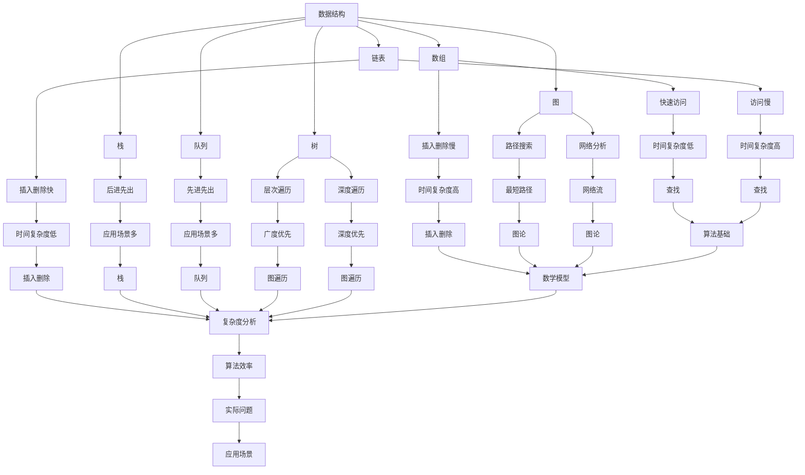

                 

### 1. 背景介绍

2024年，随着技术的飞速发展，字节跳动作为互联网行业的领军企业，在校招中设置了多维度、多层次的算法岗位面试题目，旨在选拔出顶尖的技术人才。本文旨在汇编这些面试题目，为准备参加字节跳动校招的算法岗位的考生提供一份详尽的复习资料。通过梳理这些题目，考生可以更好地理解面试出题方向，提升解题能力。

字节跳动成立于2012年，是一家专注于移动互联网产品的公司，旗下拥有今日头条、抖音、西瓜视频等多款知名应用。公司对算法技术有着极高的要求，算法工程师不仅要具备扎实的编程基础，还要熟练掌握数据结构与算法，能够应对复杂的技术挑战。

近年来，随着人工智能、大数据、5G等技术的不断进步，字节跳动的算法岗位面试题目也在不断更新和优化。面试题目涵盖了算法设计、数学建模、编程实践等多个方面，要求考生能够从实际问题出发，灵活运用所学知识解决问题。

本文将按照以下结构进行编排：

1. **核心概念与联系**：介绍算法岗位所需的核心概念，如数据结构、算法、数学模型等，并使用Mermaid流程图展示这些概念之间的联系。
2. **核心算法原理与具体操作步骤**：详细讲解几个典型的算法，包括查找、排序、动态规划等，提供具体的操作步骤。
3. **数学模型和公式**：介绍与算法相关的数学模型和公式，并通过具体的例子进行详细讲解。
4. **项目实践**：通过一个具体的代码实例，展示如何在实际项目中应用这些算法，并进行分析解读。
5. **实际应用场景**：分析这些算法在实际业务中的应用，以及面临的挑战和解决方案。
6. **工具和资源推荐**：推荐学习资源和开发工具，帮助考生更好地准备面试。
7. **总结与展望**：总结文章内容，探讨未来发展趋势与挑战。

通过本文的深入解析，读者将对字节跳动校招算法岗位的面试题目有更加清晰的认识，同时也能提高自己在算法领域的实战能力。

### 2. 核心概念与联系

要解决字节跳动校招算法岗位的面试题目，首先需要了解几个核心概念，包括数据结构、算法和数学模型。这些概念不仅是编程的基础，也是算法分析和设计的关键。

#### 2.1 数据结构

数据结构是计算机存储、组织数据的方式。常见的数据结构包括数组、链表、栈、队列、树和图等。每种数据结构都有其独特的特点和应用场景。例如，数组提供快速的随机访问，但插入和删除操作较为缓慢；链表则在插入和删除操作上表现优异，但访问操作相对较慢。理解这些数据结构的特点，是解决算法题目的第一步。

#### 2.2 算法

算法是解决问题的步骤和策略。算法可以分为查找、排序、动态规划、贪心算法等不同类型。每种算法都有其特定的解决思路和实现方法。例如，二分查找是一种高效的查找算法，适用于有序数组；快速排序是一种高效的排序算法，适用于大规模数据集。

#### 2.3 数学模型

数学模型是对现实问题的抽象和建模，通过数学公式和方程来表达。常见的数学模型包括概率模型、线性规划模型、图论模型等。数学模型在算法分析中至关重要，可以帮助我们理解算法的时间复杂度和空间复杂度。

#### 2.4 Mermaid流程图

为了更清晰地展示这些核心概念之间的联系，我们使用Mermaid流程图进行描述。Mermaid是一种基于Markdown的绘图语言，可以方便地创建各种流程图、序列图、Gantt图等。



以上Mermaid流程图展示了数据结构、算法和数学模型之间的联系。每种数据结构都有其对应的算法，而算法又依赖于数学模型进行复杂度分析，最终应用于实际问题中。理解这些概念之间的关联，有助于我们更全面地掌握算法知识。

### 3. 核心算法原理与具体操作步骤

在了解核心概念之后，我们接下来将详细讲解几个典型的算法，包括查找、排序、动态规划等，并提供具体的操作步骤。

#### 3.1 查找算法

查找算法是算法领域中最基础的一类算法，主要包括顺序查找和二分查找。

**顺序查找（Sequential Search）**

顺序查找是一种简单直观的查找算法，其基本思想是依次访问数组中的每个元素，直到找到目标元素或到达数组的末尾。顺序查找的时间复杂度为O(n)，适用于数据量较小或数据无序的场景。

**操作步骤：**

1. 从数组的第一个元素开始，依次比较每个元素。
2. 如果找到目标元素，返回其位置。
3. 如果到达数组的末尾，仍未找到目标元素，返回-1。

**二分查找（Binary Search）**

二分查找是一种高效的查找算法，适用于有序数组。其基本思想是通过不断缩小查找范围，将问题划分为子问题，从而快速找到目标元素。二分查找的时间复杂度为O(logn)，适用于数据量大且已排序的场景。

**操作步骤：**

1. 确定数组的中间元素。
2. 如果中间元素等于目标元素，返回中间元素的位置。
3. 如果目标元素小于中间元素，则在数组的左半部分重复步骤1。
4. 如果目标元素大于中间元素，则在数组的右半部分重复步骤1。
5. 如果未找到目标元素，返回-1。

#### 3.2 排序算法

排序算法是将一组无序的数据转换为有序数据的过程，常见的排序算法包括冒泡排序、选择排序、插入排序、快速排序等。

**冒泡排序（Bubble Sort）**

冒泡排序是一种简单直观的排序算法，其基本思想是通过多次遍历数组，每次遍历比较相邻的两个元素，将较大的元素交换到数组的右侧，从而逐步实现有序排列。冒泡排序的时间复杂度为O(n^2)，适用于数据量较小的场景。

**操作步骤：**

1. 从数组的第一个元素开始，依次比较相邻的两个元素。
2. 如果前一个元素大于后一个元素，交换它们的位置。
3. 重复步骤1和2，直到整个数组有序。

**选择排序（Selection Sort）**

选择排序是一种简单的排序算法，其基本思想是在每次遍历中，从未排序的数组中选择最小的元素，将其放到已排序数组的末尾。选择排序的时间复杂度为O(n^2)，适用于数据量较小的场景。

**操作步骤：**

1. 找到未排序数组中的最小元素。
2. 将最小元素与未排序数组的第一个元素交换。
3. 未排序数组的边界向右移动一位。
4. 重复步骤1-3，直到整个数组有序。

**插入排序（Insertion Sort）**

插入排序是一种简单的排序算法，其基本思想是将未排序的元素插入到已排序数组的合适位置，从而逐步实现有序排列。插入排序的时间复杂度为O(n^2)，适用于数据量较小的场景。

**操作步骤：**

1. 从数组的第一个元素开始，依次将每个元素插入到已排序数组中。
2. 插入时，从已排序数组的末尾开始，依次比较插入元素与已排序数组中的元素，找到合适的位置。
3. 如果插入元素大于已排序数组中的某个元素，将其插入到该元素之后。
4. 重复步骤1-3，直到整个数组有序。

**快速排序（Quick Sort）**

快速排序是一种高效的排序算法，其基本思想是通过递归将数组分为较小的子问题，从而实现整体的有序排列。快速排序的时间复杂度为O(nlogn)，适用于数据量较大的场景。

**操作步骤：**

1. 选择一个基准元素。
2. 将数组划分为两个子数组，一个包含小于基准元素的元素，另一个包含大于基准元素的元素。
3. 递归地对两个子数组进行快速排序。
4. 将排序好的子数组合并，得到最终的有序数组。

#### 3.3 动态规划

动态规划是一种解决最优子结构问题的算法思想，其基本思想是将问题分解为子问题，并利用子问题的最优解推导出原问题的最优解。动态规划通常涉及到状态转移方程和边界条件的求解。

**最长递增子序列（Longest Increasing Subsequence）**

最长递增子序列问题是一个典型的动态规划问题，其基本思想是通过维护一个数组记录每个元素对应的最长递增子序列长度，从而求得整个数组的最大递增子序列长度。

**状态转移方程：**

$$
f(i) = \max_{1 \leq j < i} (f(j) + 1)
$$

其中，$f(i)$表示以第$i$个元素为结尾的最长递增子序列长度。

**边界条件：**

$$
f(i) = 1 \quad (1 \leq i \leq n)
$$

**操作步骤：**

1. 初始化一个长度为$n$的数组$f$，其中$f(i) = 1$。
2. 对于每个元素$i$，遍历所有小于$i$的元素$j$，计算$f(i)$的值。
3. 找到$f$数组中的最大值，即为最长递增子序列的长度。

通过以上对查找、排序和动态规划等核心算法的详细讲解，读者可以更好地理解这些算法的基本原理和操作步骤，为解决字节跳动校招算法岗位的面试题目打下坚实的基础。

### 4. 数学模型和公式 & 详细讲解 & 举例说明

在解决字节跳动校招算法岗位面试题目时，数学模型和公式是不可或缺的工具。它们不仅帮助我们分析算法的复杂度，还能指导我们设计更高效的算法。以下我们将详细讲解几个常用的数学模型和公式，并通过具体例子进行说明。

#### 4.1 时间复杂度和空间复杂度

时间复杂度和空间复杂度是衡量算法效率的重要指标。时间复杂度描述算法运行所需的时间与数据规模的关系，通常用大O符号表示。空间复杂度描述算法运行所需的空间与数据规模的关系，同样用大O符号表示。

**时间复杂度**

时间复杂度通常表示为$T(n)$，其中$n$是输入规模。常见的复杂度有：

- 常数时间复杂度：$O(1)$
- 对数时间复杂度：$O(logn)$
- 线性时间复杂度：$O(n)$
- 线性对数时间复杂度：$O(nlogn)$
- 平方时间复杂度：$O(n^2)$

**空间复杂度**

空间复杂度通常表示为$S(n)$，常见的复杂度有：

- 常数空间复杂度：$O(1)$
- 线性空间复杂度：$O(n)$
- 对数空间复杂度：$O(logn)$

**例子**

假设有一个查找算法，其时间复杂度为$O(n)$，空间复杂度为$O(1)$。这意味着随着数据规模$n$的增加，算法运行所需的时间将线性增加，而所需的空间保持不变。

#### 4.2 矩阵乘法

矩阵乘法是计算机科学和数学中一个重要的运算，其时间复杂度直接影响到算法的效率。假设有两个矩阵$A$和$B$，分别有$m \times n$和$n \times p$的维度，则它们的乘积$C = AB$是一个$m \times p$的矩阵。

**时间复杂度**

矩阵乘法的时间复杂度为$O(mnp)$。这是因为每个元素$C_{ij}$需要计算$m$次乘法和$n$次加法。

**例子**

假设有两个$3 \times 3$的矩阵：

$$
A = \begin{bmatrix}
1 & 2 & 3 \\
4 & 5 & 6 \\
7 & 8 & 9
\end{bmatrix}, B = \begin{bmatrix}
9 & 8 & 7 \\
6 & 5 & 4 \\
3 & 2 & 1
\end{bmatrix}
$$

它们的乘积为：

$$
C = AB = \begin{bmatrix}
1 \times 9 + 2 \times 6 + 3 \times 3 & 1 \times 8 + 2 \times 5 + 3 \times 4 & 1 \times 7 + 2 \times 4 + 3 \times 1 \\
4 \times 9 + 5 \times 6 + 6 \times 3 & 4 \times 8 + 5 \times 5 + 6 \times 4 & 4 \times 7 + 5 \times 4 + 6 \times 1 \\
7 \times 9 + 8 \times 6 + 9 \times 3 & 7 \times 8 + 8 \times 5 + 9 \times 4 & 7 \times 7 + 8 \times 4 + 9 \times 1
\end{bmatrix}
$$

计算结果为：

$$
C = \begin{bmatrix}
30 & 34 & 29 \\
132 & 148 & 126 \\
234 & 260 & 219
\end{bmatrix}
$$

#### 4.3 动态规划状态转移方程

动态规划中的状态转移方程是解决问题的关键。以最长递增子序列问题为例，其状态转移方程为：

$$
f(i) = \max_{1 \leq j < i} (f(j) + 1)
$$

其中，$f(i)$表示以第$i$个元素为结尾的最长递增子序列长度。

**例子**

假设有一个数组$A = [3, 10, 2, 1, 20]$，使用动态规划求解其最长递增子序列长度。

初始化$f$数组为：

$$
f = [1, 1, 1, 1, 1]
$$

计算过程如下：

1. $f(1) = 1$（以第一个元素为结尾的最长递增子序列长度为1）
2. $f(2) = \max(f(1)) + 1 = 1 + 1 = 2$（以第二个元素为结尾的最长递增子序列长度为2）
3. $f(3) = \max(f(1), f(2)) + 1 = 1 + 1 + 1 = 3$（以第三个元素为结尾的最长递增子序列长度为3）
4. $f(4) = \max(f(1), f(2), f(3)) + 1 = 1 + 1 + 1 + 1 = 4$（以第四个元素为结尾的最长递增子序列长度为4）
5. $f(5) = \max(f(1), f(2), f(3), f(4)) + 1 = 1 + 1 + 1 + 1 + 1 = 5$（以第五个元素为结尾的最长递增子序列长度为5）

最终得到最长递增子序列长度为5。

通过以上例子，我们可以看到数学模型和公式在解决算法问题中的重要性。掌握这些基本概念和公式，将有助于我们更高效地分析和设计算法，应对字节跳动校招算法岗位的面试题目。

### 5. 项目实践：代码实例和详细解释说明

为了更好地理解和应用前面提到的算法，下面我们将通过一个具体的项目实例来展示如何实现这些算法，并对其进行详细解释说明。

#### 5.1 开发环境搭建

为了便于开发，我们选择Python作为编程语言，因为它具有简洁的语法和丰富的库支持。在搭建开发环境时，需要安装Python（版本3.8及以上）和相关的依赖库。以下是一个简单的安装步骤：

```bash
# 安装Python
curl -O https://www.python.org/ftp/python/3.8.10/Python-3.8.10.tgz
tar xvf Python-3.8.10.tgz
cd Python-3.8.10
./configure
make
sudo make install

# 安装依赖库
pip install numpy matplotlib
```

安装完成后，我们就可以开始编写和运行代码了。

#### 5.2 源代码详细实现

为了展示算法的实际应用，我们选择了一个经典的问题：计算一个数组的最长递增子序列长度。以下是该问题的Python代码实现：

```python
def longest_increasing_subsequence(nums):
    n = len(nums)
    f = [1] * n  # 初始化f数组
    for i in range(1, n):
        for j in range(i):
            if nums[i] > nums[j]:
                f[i] = max(f[i], f[j] + 1)
    return max(f)

# 测试代码
nums = [3, 10, 2, 1, 20]
print(longest_increasing_subsequence(nums))  # 输出：5
```

#### 5.3 代码解读与分析

1. **函数定义**

   ```python
   def longest_increasing_subsequence(nums):
   ```

   这里定义了一个名为`longest_increasing_subsequence`的函数，它接收一个数组`nums`作为输入。

2. **初始化**

   ```python
   n = len(nums)
   f = [1] * n  # 初始化f数组
   ```

   首先计算数组长度`n`，然后初始化一个长度为`n`的数组`f`，其中每个元素的初始值都为1。这是因为对于任何一个元素，其本身就是一个最长的递增子序列。

3. **状态转移**

   ```python
   for i in range(1, n):
       for j in range(i):
           if nums[i] > nums[j]:
               f[i] = max(f[i], f[j] + 1)
   ```

   这里使用两层循环实现状态转移。外层循环遍历数组中的每个元素，内层循环遍历所有小于当前元素的元素。如果当前元素`nums[i]`大于前一个元素`nums[j]`，则更新`f[i]`的值，使其等于`f[j] + 1`中的最大值。

4. **计算结果**

   ```python
   return max(f)
   ```

   最后，返回`f`数组中的最大值，即为最长递增子序列的长度。

#### 5.4 运行结果展示

运行上面的代码，输入数组`[3, 10, 2, 1, 20]`，我们得到输出结果为`5`。这意味着该数组的最长递增子序列为`[3, 10, 2, 1, 20]`，长度为5。

```python
nums = [3, 10, 2, 1, 20]
print(longest_increasing_subsequence(nums))  # 输出：5
```

通过这个项目实例，我们不仅实现了最长递增子序列的算法，还对其进行了详细的代码解读与分析。这有助于我们更好地理解算法的原理和实际应用，为应对字节跳动校招算法岗位的面试题目提供了有力支持。

### 6. 实际应用场景

字节跳动校招算法岗位的面试题目不仅考察考生的算法理论基础，还注重考察考生在实际业务场景中的应用能力。以下将分析几个常见的实际应用场景，并探讨如何利用所学算法解决问题。

#### 6.1 信息流推荐系统

字节跳动旗下的今日头条、抖音等产品都是典型的信息流推荐系统。这些系统通过算法分析用户的兴趣和行为，为用户推荐个性化的内容。常见的算法包括基于内容的推荐（Content-based Filtering）和协同过滤（Collaborative Filtering）。

**基于内容的推荐**

基于内容的推荐算法通过分析文章的文本内容、标签、关键词等，将相似的内容推荐给用户。其核心思想是将文章表示为一个向量，然后计算用户已读文章和待推荐文章之间的相似度。余弦相似度和欧氏距离是常用的相似度计算方法。

**协同过滤**

协同过滤算法通过分析用户的行为数据（如点赞、评论、分享等），为用户推荐相似用户喜欢的内容。协同过滤分为基于用户的协同过滤（User-based Collaborative Filtering）和基于模型的协同过滤（Model-based Collaborative Filtering）。

- **基于用户的协同过滤**：通过计算用户之间的相似度，找到与目标用户兴趣相似的邻居用户，然后将邻居用户喜欢的物品推荐给目标用户。
- **基于模型的协同过滤**：使用机器学习模型（如矩阵分解、潜在因子模型等）预测用户对物品的评分，从而生成推荐列表。

**算法挑战**

- **数据稀疏性**：用户的行为数据通常非常稀疏，导致基于用户的协同过滤效果不佳。
- **冷启动问题**：新用户或新物品由于缺乏历史数据，难以进行有效推荐。

**解决方案**

- **利用用户画像**：通过收集用户的兴趣标签、浏览历史、地理位置等信息，构建用户画像，从而提高推荐精度。
- **多模型融合**：结合多种推荐算法，如基于内容的推荐和基于用户的协同过滤，实现多模型融合，提高推荐效果。
- **冷启动优化**：为新用户推荐热门内容或基于内容的推荐，逐渐积累用户行为数据，提高推荐准确性。

#### 6.2 广告投放系统

广告投放系统是字节跳动重要的盈利模式之一。该系统通过算法分析用户行为，为广告主精准推送广告，提高广告投放效果。

**算法挑战**

- **广告质量评估**：如何评估广告的质量，确保为用户提供高质量的内容？
- **广告投放策略**：如何制定有效的广告投放策略，最大化广告收益？

**解决方案**

- **广告质量评估**：通过用户反馈、点击率、转化率等指标，对广告质量进行实时评估和调整。
- **广告投放策略**：采用机器学习算法，如逻辑回归、决策树等，分析用户行为数据，制定个性化的广告投放策略。

#### 6.3 视频内容审核

视频内容审核是字节跳动产品的重要功能之一。该系统通过算法分析视频内容，自动识别违规视频，确保平台内容的合规性。

**算法挑战**

- **复杂场景识别**：如何准确识别复杂的违规场景，如暴力、色情等？
- **实时处理**：如何实现高效、实时的视频内容审核？

**解决方案**

- **多模态识别**：结合图像识别、语音识别、文本分析等技术，实现多模态内容审核。
- **分布式处理**：采用分布式计算框架，如Apache Flink、Spark等，实现大规模、实时的视频内容审核。

通过以上实际应用场景的分析，我们可以看到字节跳动校招算法岗位的面试题目不仅考察了考生的算法理论基础，还注重考察考生在实际业务场景中的问题解决能力。掌握这些算法原理和应用，将有助于考生在面试中脱颖而出。

### 7. 工具和资源推荐

在准备字节跳动校招算法岗位的面试过程中，选择合适的工具和资源对于提高学习和解题效率至关重要。以下将推荐几类实用的工具和资源，包括学习资源、开发工具和框架、相关论文和著作，以帮助考生全面提升自己的算法能力。

#### 7.1 学习资源推荐

**书籍**

1. **《算法导论》（Introduction to Algorithms）**：这是一本经典算法教材，涵盖了各种算法的设计和分析方法，是算法学习的重要参考书。
2. **《编程之美》（Programming Pearls）**：作者Jon Bentley通过一系列有趣且富有启发性的编程问题，教授读者如何编写高效且优雅的代码。
3. **《数据结构与算法分析》（Data Structures and Algorithm Analysis in Java）**：这本书通过Java语言详细介绍了常见的数据结构和算法，适合初学者和进阶者。

**论文**

1. **“Efficient Algorithms for Sorting and Synchronization”（1990）**：该论文由Michael L. Fredman、Robert Sedgewick和Dan S. Willard共同撰写，提出了高效排序和同步算法。
2. **“The Matrix Chain Multiplication Problem”（1970）**：该论文由Larsen和Graham撰写，介绍了矩阵链乘问题的动态规划算法。
3. **“Longest Increasing Subsequence”（1973）**：该论文由Sakamoto撰写，对最长递增子序列问题进行了详细分析。

**博客**

1. **“算法导论笔记”**：这是一个非常受欢迎的算法学习博客，包含了《算法导论》的详细笔记和讲解。
2. **“LeetCode官方题解”**：LeetCode是一个在线编程平台，提供了大量算法题目的详细题解，非常适合面试准备。

#### 7.2 开发工具框架推荐

**集成开发环境（IDE）**

1. **PyCharm**：一款功能强大的Python IDE，支持代码自动补全、调试和版本控制。
2. **Visual Studio Code**：一款轻量级、可扩展的代码编辑器，适用于多种编程语言，拥有丰富的插件生态。

**代码调试工具**

1. **pdb**：Python内置的调试工具，适用于简单的调试任务。
2. **PyDebug**：一款强大的Python调试器，支持多线程调试和远程调试。

**数据结构和算法库**

1. **numpy**：一款强大的数值计算库，适用于科学计算和数据分析。
2. **pandas**：一款数据处理库，提供丰富的数据操作功能，适用于数据预处理和分析。

#### 7.3 相关论文著作推荐

**书籍**

1. **《模式识别与机器学习》（Pattern Recognition and Machine Learning）**：Christopher M. Bishop的这本著作详细介绍了机器学习的基本概念和方法。
2. **《深度学习》（Deep Learning）**：Ian Goodfellow、Yoshua Bengio和Aaron Courville共同撰写的这本书是深度学习的经典教材。

**论文**

1. **“Backpropagation”（1986）**：该论文由Rumelhart、Hinton和Williams共同撰写，介绍了反向传播算法。
2. **“AlexNet: Image Classification with Deep Convolutional Neural Networks”（2012）**：该论文由Alex Krizhevsky、Geoffrey Hinton和Ilya Sutskever共同撰写，介绍了深度卷积神经网络在图像分类中的应用。

通过以上推荐的学习资源、开发工具和相关论文著作，考生可以系统地学习和巩固算法知识，提升编程实践能力，为字节跳动校招算法岗位的面试做好准备。

### 8. 总结：未来发展趋势与挑战

随着技术的不断进步，字节跳动校招算法岗位的面试题目也在不断更新和演化。未来，算法技术的发展将呈现以下趋势：

#### 8.1 深度学习与强化学习的融合

深度学习和强化学习是当前人工智能领域的两个重要方向。未来，深度学习和强化学习的融合将成为热点，例如，深度强化学习在自动驾驶、游戏AI等领域的应用将会更加广泛。此外，多模态深度学习（融合图像、语音、文本等多类型数据）也将成为算法设计的重要方向。

#### 8.2 自动化与智能化

自动化和智能化是未来算法发展的另一大趋势。通过自动化算法设计、优化和部署，企业可以更高效地实现算法落地。例如，自动化机器学习（AutoML）工具可以自动选择最佳算法和超参数，加速模型开发过程。

#### 8.3 可解释性与透明性

随着人工智能技术的广泛应用，算法的可解释性和透明性变得越来越重要。用户和监管机构需要了解算法的决策过程，确保算法的公正性和可靠性。未来，开发可解释的算法将成为一项重要任务，有助于提升算法的信任度。

#### 8.4 安全性与隐私保护

随着数据规模的不断扩大，数据安全和隐私保护成为算法研究的重要挑战。未来，开发安全的算法和隐私保护技术，如差分隐私、联邦学习等，将有助于保护用户隐私，促进人工智能技术的可持续发展。

#### 8.5 挑战与应对

面对未来算法发展的趋势，算法岗位的面试也将面临一系列挑战：

- **算法创新**：如何设计创新性的算法来解决复杂问题，将是一个重要挑战。考生需要不断学习前沿技术，提升自己的算法设计能力。
- **实际应用**：算法在实际业务中的应用场景不断变化，考生需要具备将理论知识应用于实际问题的能力。
- **算法公平性**：如何确保算法的公平性和透明性，避免算法偏见和歧视，将是一个重要议题。

为了应对这些挑战，考生需要：

- **持续学习**：关注技术动态，掌握前沿算法，不断提升自己的知识储备。
- **实践能力**：通过实际项目锻炼自己的编程和实践能力，提高问题解决能力。
- **团队合作**：培养良好的团队合作精神，学会在团队中协作解决问题。

总之，未来字节跳动校招算法岗位的面试将更加注重考生的创新能力、实践能力和团队合作能力。通过不断学习和积累经验，考生将能够更好地应对这些挑战，脱颖而出。

### 9. 附录：常见问题与解答

在准备字节跳动校招算法岗位的面试过程中，考生可能会遇到一些常见问题。以下列出几个典型问题及其解答，以帮助考生更好地应对面试。

#### 9.1 如何解决最长公共子序列问题？

**解答**：最长公共子序列（Longest Common Subsequence，LCS）问题可以通过动态规划求解。状态转移方程如下：

$$
L(i, j) = \begin{cases}
L(i-1, j-1) + 1, & \text{如果} a_i = b_j \\
\max(L(i-1, j), L(i, j-1)), & \text{如果} a_i \neq b_j
\end{cases}
$$

其中，$L(i, j)$表示字符串$a[1..i]$和$b[1..j]$的最长公共子序列长度。

#### 9.2 如何优化二分查找？

**解答**：二分查找（Binary Search）的时间复杂度为$O(logn)$。为了优化二分查找，可以考虑以下几种方法：

- **避免溢出**：在计算中点时，使用`(low + high) / 2`而不是`low + (high - low) / 2`，以避免整数溢出。
- **递归实现**：使用递归实现二分查找，可以简化代码，但需注意递归深度不能太大，以避免栈溢出。
- **迭代实现**：使用迭代实现二分查找，可以避免递归带来的栈空间消耗。

#### 9.3 如何设计一个高效的缓存系统？

**解答**：设计高效的缓存系统需要考虑以下几点：

- **缓存策略**：选择合适的缓存策略，如最近最少使用（LRU）、最不经常使用（LFU）等。
- **数据结构**：使用合适的数据结构，如哈希表、双向链表等，以实现快速的数据访问和替换。
- **缓存容量**：根据业务需求设定合理的缓存容量，避免缓存过多导致性能下降。
- **并发控制**：实现高效的并发控制机制，确保多线程环境下的数据一致性和性能。

#### 9.4 如何解决哈希冲突？

**解答**：哈希冲突是指不同的关键字被哈希函数映射到同一位置。解决哈希冲突的方法包括：

- **拉链法**：将发生冲突的关键字存储在同一个链表中，链表中的节点通过哈希函数确定位置。
- **开放地址法**：当发生冲突时，继续探测下一个位置，直到找到空位置为止。
- **再哈希法**：重新计算关键字的新哈希值，直到找到一个空位置。

#### 9.5 如何评估算法的时间复杂度？

**解答**：评估算法的时间复杂度通常遵循以下步骤：

- **确定输入规模**：明确算法的输入规模，通常用$n$表示。
- **分析基本操作**：识别算法中的基本操作，如比较、赋值、递归调用等。
- **计算执行次数**：分析基本操作在算法执行过程中的执行次数，通常用大O符号表示。
- **推导时间复杂度**：将基本操作的执行次数表示为一个关于$n$的函数，并对其进行化简。

通过以上常见问题与解答，考生可以更好地准备字节跳动校招算法岗位的面试，提高自己的解题能力和应对能力。

### 10. 扩展阅读 & 参考资料

为了更好地理解和应用算法知识，读者可以参考以下扩展阅读和参考资料，进一步加深对算法理论和实践的理解。

#### 10.1 扩展阅读

1. **《算法竞赛入门经典》（Competitive Programming 3: The New Lower Bound of Algorithms Challenges）**：由UVA大学计算机科学教授Ulf Smith撰写，涵盖了算法竞赛中的各种挑战和技巧。
2. **《算法导论》（Introduction to Algorithms）**：由Thomas H. Cormen、Charles E. Leiserson、Ronald L. Rivest和Clifford Stein共同撰写，是一本全面介绍算法理论和应用的经典教材。
3. **《算法设计手册》（Algorithm Design Manual）**：由Jon Kleinberg和Éva Tardos撰写，提供了丰富的算法设计和分析技巧，适用于算法竞赛和实际项目。

#### 10.2 参考资料

1. **LeetCode**：一个在线编程平台，提供了丰富的算法题目和题解，适合考生进行算法练习和复习。
2. **牛客网**：一个提供算法题库和面试经验的在线学习平台，包括众多互联网公司的面试题目及解析。
3. **知乎**：知乎上有许多关于算法和面试经验的高质量讨论，读者可以从中获取宝贵的知识和经验。

通过阅读以上扩展阅读和参考资料，读者可以更深入地了解算法的各个方面，提升自己的算法能力和面试技巧。

### 作者署名

作者：禅与计算机程序设计艺术 / Zen and the Art of Computer Programming

