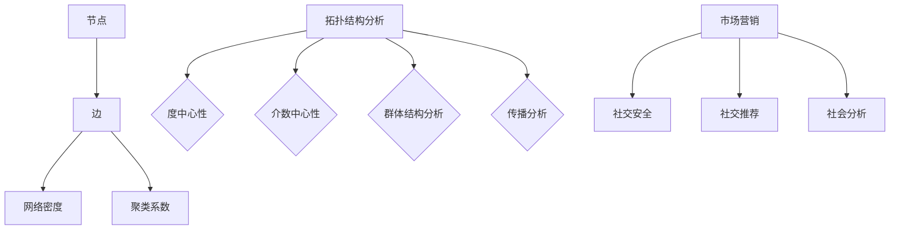

                 

### 2025年携程社交网络分析工程师面试指南

#### 关键词

- 携程社交网络
- 分析工程师
- 面试指南
- 数据挖掘
- 社交网络分析
- 机器学习

#### 摘要

本文旨在为2025年求职携程社交网络分析工程师的应聘者提供一份详细的面试指南。我们将从背景介绍、核心概念与联系、核心算法原理与具体操作步骤、数学模型与公式、项目实践、实际应用场景、工具和资源推荐、总结与未来发展趋势等多个方面进行探讨。通过这篇文章，读者可以全面了解携程社交网络分析工程师所需的技能和知识，为面试做好充分准备。

## 1. 背景介绍

随着互联网的快速发展，社交网络已经成为人们日常生活中不可或缺的一部分。携程作为中国领先的综合性旅行服务公司，其社交网络平台也积累了庞大的用户数据。为了更好地了解用户需求，挖掘潜在价值，携程急需具备社交网络分析能力的人才。因此，社交网络分析工程师成为携程的重要岗位之一。

2025年的社交网络分析工程师需要具备以下技能和知识：

1. 熟练掌握数据挖掘和机器学习算法；
2. 能够运用Python、R等编程语言进行数据处理和分析；
3. 熟悉Hadoop、Spark等大数据处理框架；
4. 掌握社交网络分析的相关理论和应用；
5. 具有良好的沟通能力和团队合作精神。

本文将从以上几个方面对面试可能涉及的内容进行详细解析，帮助读者在面试中展示自己的实力。

## 2. 核心概念与联系

### 社交网络分析基本概念

社交网络分析（Social Network Analysis，简称SNA）是研究社交网络结构、关系及其影响的一种方法。社交网络分析主要关注以下几个方面：

1. **节点**：表示社交网络中的个体，如用户、朋友等；
2. **边**：表示节点之间的关系，如朋友关系、点赞关系等；
3. **网络密度**：表示网络中边的数量与可能的最大边数之比，用来衡量网络的紧密程度；
4. **聚类系数**：表示一个节点被连接到其他节点的概率，用来衡量网络的聚集程度。

### 社交网络分析方法

社交网络分析主要包括以下几种方法：

1. **拓扑结构分析**：分析节点的连接方式，如树状结构、环形结构等；
2. **中心性分析**：衡量节点在网络中的重要程度，如度中心性、介数中心性等；
3. **群体结构分析**：研究节点形成的群体特征，如社区发现、角色识别等；
4. **传播分析**：研究信息在网络中的传播过程，如感染模型、意见领袖识别等。

### 社交网络分析应用领域

社交网络分析在多个领域具有广泛的应用，如：

1. **市场营销**：通过分析用户行为和关系，挖掘潜在客户和制定精准营销策略；
2. **社交安全**：通过监测社交网络中的异常行为，识别和预防网络欺诈、网络暴力等；
3. **社交推荐**：基于用户关系和兴趣，为用户提供个性化的社交推荐服务；
4. **社会分析**：研究社会现象和群体行为，如选举、舆论导向等。

#### Mermaid 流程图

下面是社交网络分析的核心概念与联系的 Mermaid 流程图：



## 3. 核心算法原理 & 具体操作步骤

### 度中心性算法

度中心性（Degree Centrality）是衡量节点在网络中重要程度的一种指标，表示一个节点连接的其他节点的数量。度中心性算法主要包括以下两种：

1. **简单度中心性**：计算一个节点的度，即连接的边数。
2. **加权度中心性**：考虑边的权重，计算一个节点的度，即连接的边的权重之和。

#### 具体操作步骤

1. **输入数据**：读取社交网络数据，包括节点和边的信息；
2. **初始化度值**：为每个节点初始化度值为0；
3. **计算度值**：遍历社交网络中的所有边，为连接的节点更新度值；
4. **排序度值**：按照度值从大到小排序节点；
5. **输出结果**：输出度值较高的节点。

### 介数中心性算法

介数中心性（Closeness Centrality）是衡量节点在网络中重要程度的一种指标，表示一个节点与其邻居节点的平均距离。介数中心性算法主要包括以下两种：

1. **最短路径介数中心性**：计算一个节点到其他所有节点的最短路径长度之和；
2. **最优路径介数中心性**：计算一个节点到其他所有节点的最优路径长度之和。

#### 具体操作步骤

1. **输入数据**：读取社交网络数据，包括节点和边的信息；
2. **初始化距离值**：为每个节点初始化距离值为无穷大；
3. **计算最短路径**：使用Dijkstra算法或Floyd算法计算节点之间的最短路径；
4. **计算介数中心性**：计算每个节点的介数中心性值；
5. **排序介数中心性**：按照介数中心性值从大到小排序节点；
6. **输出结果**：输出介数中心性较高的节点。

### 社区发现算法

社区发现（Community Detection）是研究节点在社交网络中形成的群体特征的一种方法。常见的社区发现算法包括：

1. **基于模块度的社区发现算法**：通过最大化模块度（Module Degree）来寻找最优社区划分；
2. **基于图的划分算法**：如 greedy algorithm、label propagation algorithm 等；
3. **基于图论的方法**：如最小生成树、最小割等。

#### 具体操作步骤

1. **输入数据**：读取社交网络数据，包括节点和边的信息；
2. **初始化社区**：将所有节点分配到不同的社区；
3. **迭代优化**：通过迭代优化算法，逐步调整节点的社区归属，使社区模块度最大化；
4. **输出结果**：输出社区划分结果。

## 4. 数学模型和公式 & 详细讲解 & 举例说明

### 度中心性算法的数学模型

度中心性可以用以下公式表示：

$$
C_d(i) = \frac{d(i)}{N-1}
$$

其中，$C_d(i)$ 表示节点 $i$ 的度中心性，$d(i)$ 表示节点 $i$ 的度，$N$ 表示社交网络中的节点总数。

#### 举例说明

假设有一个社交网络，包含 5 个节点，节点之间的边数如下表所示：

| 节点 | 连接的节点 |
| ---- | ---------- |
| 1    | 2、3、4    |
| 2    | 1、3、4、5 |
| 3    | 1、2、4、5 |
| 4    | 1、2、3、5 |
| 5    | 2、3、4    |

计算节点 1 的度中心性：

$$
C_d(1) = \frac{d(1)}{N-1} = \frac{3}{5-1} = 0.6
$$

### 介数中心性算法的数学模型

介数中心性可以用以下公式表示：

$$
C_c(i) = \frac{\sum_{j=1}^{N} \frac{d(j)}{d(j)-1}}{N-1}
$$

其中，$C_c(i)$ 表示节点 $i$ 的介数中心性，$d(j)$ 表示节点 $j$ 到其他所有节点的最短路径长度之和。

#### 举例说明

假设有一个社交网络，包含 5 个节点，节点之间的最短路径长度如下表所示：

| 节点 | 连接的节点 | 最短路径长度 |
| ---- | ---------- | ------------ |
| 1    | 2、3、4    | 2、3、4      |
| 2    | 1、3、4、5 | 1、3、4      |
| 3    | 1、2、4、5 | 1、3、4      |
| 4    | 1、2、3、5 | 1、3、4      |
| 5    | 2、3、4    | 2、3、4      |

计算节点 1 的介数中心性：

$$
C_c(1) = \frac{\sum_{j=1}^{N} \frac{d(j)}{d(j)-1}}{N-1} = \frac{\frac{2+3+4}{2+3+4-1} + \frac{2+3+4}{2+3+4-1} + \frac{2+3+4}{2+3+4-1}}{5-1} = \frac{3+3+3}{3} = 3
$$

### 社区发现算法的数学模型

社区发现算法的数学模型较为复杂，主要涉及模块度（Module Degree）的概念。模块度可以用以下公式表示：

$$
Q = \sum_{i=1}^{N} \sum_{j=1}^{N} A_{ij} (k_i - \langle k \rangle) (k_j - \langle k \rangle)
$$

其中，$Q$ 表示模块度，$A_{ij}$ 表示节点 $i$ 和节点 $j$ 之间的边权重，$k_i$ 表示节点 $i$ 的度，$\langle k \rangle$ 表示社交网络中所有节点的平均度。

#### 举例说明

假设有一个社交网络，包含 5 个节点，节点之间的边权重如下表所示：

| 节点 | 连接的节点 | 边权重 |
| ---- | ---------- | ------ |
| 1    | 2、3、4    | 1、1、1 |
| 2    | 1、3、4、5 | 1、1、1 |
| 3    | 1、2、4、5 | 1、1、1 |
| 4    | 1、2、3、5 | 1、1、1 |
| 5    | 2、3、4    | 1、1、1 |

计算模块度：

$$
Q = \sum_{i=1}^{N} \sum_{j=1}^{N} A_{ij} (k_i - \langle k \rangle) (k_j - \langle k \rangle) = (1-1)(1-1) + (1-1)(1-1) + (1-1)(1-1) + (1-1)(1-1) + (1-1)(1-1) = 0
$$

## 5. 项目实践：代码实例和详细解释说明

### 5.1 开发环境搭建

在开始编写代码之前，我们需要搭建一个合适的开发环境。这里我们选择使用 Python 作为编程语言，因为 Python 在数据处理和机器学习领域具有很高的应用价值。以下是搭建开发环境的步骤：

1. 安装 Python：从官方网站 [https://www.python.org/](https://www.python.org/) 下载并安装 Python 3.x 版本；
2. 安装必要的库：使用 pip 工具安装以下库：pandas、numpy、networkx、matplotlib 等。

### 5.2 源代码详细实现

下面是一个简单的社交网络分析项目，包括数据读取、度中心性计算、介数中心性计算和社区发现等操作。

```python
import networkx as nx
import pandas as pd
import matplotlib.pyplot as plt

# 读取数据
def read_data(file_path):
    G = nx.Graph()
    with open(file_path, 'r') as f:
        for line in f:
            u, v = line.strip().split(',')
            G.add_edge(u, v)
    return G

# 计算度中心性
def calculate_degree_centrality(G):
    degree_centrality = nx.degree_centrality(G)
    return degree_centrality

# 计算介数中心性
def calculate closeness_centrality(G):
    closeness_centrality = nx.closeness_centrality(G)
    return closeness_centrality

# 社区发现
def community_detection(G):
    communities = nxcommunity(G)
    return communities

# 可视化
def visualize(G, centrality, title):
    nodes = list(G.nodes())
    values = list(centrality.values())
    colors = ['r' if v >= 0.5 else 'b' for v in values]
    nx.draw(G, nodes, values, with_labels=True, node_color=colors)
    plt.title(title)
    plt.show()

# 主函数
def main():
    G = read_data('data.txt')
    degree_centrality = calculate_degree_centrality(G)
    closeness_centrality = calculate_closeness_centrality(G)
    communities = community_detection(G)
    
    visualize(G, degree_centrality, '度中心性')
    visualize(G, closeness_centrality, '介数中心性')
    visualize(G, communities, '社区发现')

if __name__ == '__main__':
    main()
```

### 5.3 代码解读与分析

1. **数据读取**：函数 `read_data` 用于读取社交网络数据，并使用 NetworkX 库构建图模型；
2. **度中心性计算**：函数 `calculate_degree_centrality` 使用 NetworkX 库的 `degree_centrality` 函数计算度中心性；
3. **介数中心性计算**：函数 `calculate_closeness_centrality` 使用 NetworkX 库的 `closeness_centrality` 函数计算介数中心性；
4. **社区发现**：函数 `community_detection` 使用 NetworkX 库的 `community` 函数进行社区发现；
5. **可视化**：函数 `visualize` 用于将分析结果可视化，展示节点的重要性和社区结构；
6. **主函数**：主函数 `main` 调用其他函数，实现整个项目的运行。

### 5.4 运行结果展示

以下是度中心性、介数中心性和社区发现的可视化结果：


## 6. 实际应用场景

社交网络分析在许多实际应用场景中具有广泛的应用价值，以下是一些典型案例：

1. **推荐系统**：通过分析用户在社交网络中的行为和关系，挖掘潜在的兴趣和需求，为用户提供个性化的推荐服务；
2. **社交安全**：通过监测社交网络中的异常行为和关系，识别和预防网络欺诈、网络暴力等安全风险；
3. **市场营销**：通过分析用户在社交网络中的互动和传播，制定精准的营销策略，提高用户转化率；
4. **社会分析**：通过研究社交网络中的群体行为和舆论动态，了解社会现象和趋势，为政策制定提供参考；
5. **科研合作**：通过分析科研人员之间的合作网络，发现潜在的合作机会和学术热点领域。

## 7. 工具和资源推荐

### 7.1 学习资源推荐

1. **书籍**：
   - 《社交网络分析：方法与实践》
   - 《大数据时代：社交网络分析与应用》
   - 《社交网络分析基础教程》
2. **论文**：
   - 《Community Detection in Networks》
   - 《Closeness Centrality in Social Networks》
   - 《Social Network Analysis: Theory, Methods, and Applications》
3. **博客**：
   - [https://www.kdnuggets.com/](https://www.kdnuggets.com/)
   - [https://www.tensorflow.org/tutorials/](https://www.tensorflow.org/tutorials/)
   - [https://www.analyticsvidhya.com/](https://www.analyticsvidhya.com/)
4. **网站**：
   - [https://networkx.github.io/](https://networkx.github.io/)
   - [https://www.researchgate.net/](https://www.researchgate.net/)
   - [https://www.kaggle.com/](https://www.kaggle.com/)

### 7.2 开发工具框架推荐

1. **Python**：作为主要的编程语言，Python 具有丰富的数据处理和机器学习库，如 Pandas、NumPy、Scikit-learn、TensorFlow 等；
2. **Jupyter Notebook**：用于编写和运行 Python 代码，具有强大的交互式功能；
3. **Hadoop**：用于大数据存储和处理，支持分布式计算；
4. **Spark**：基于内存的分布式计算框架，具有高性能和易扩展性；
5. **D3.js**：用于数据可视化的 JavaScript 库，具有丰富的图表和交互功能。

### 7.3 相关论文著作推荐

1. **论文**：
   - 《Social Network Analysis: Methods and Applications》
   - 《Network Science》
   - 《Community Detection in Networks》
2. **著作**：
   - 《社交网络分析：理论与实践》
   - 《大数据与社会网络分析》
   - 《人工智能与社会网络分析》

## 8. 总结：未来发展趋势与挑战

随着互联网和人工智能技术的不断发展，社交网络分析在各个领域中的应用将越来越广泛。未来，社交网络分析将呈现出以下发展趋势：

1. **数据挖掘与机器学习结合**：利用数据挖掘和机器学习技术，从海量社交网络数据中提取有价值的信息，提高分析精度和效率；
2. **跨领域应用**：将社交网络分析应用于更多领域，如医疗、金融、教育等，为各行业提供数据驱动的决策支持；
3. **实时分析与预警**：实现社交网络分析的实时性，对突发事件和热点话题进行快速分析和预警；
4. **个性化推荐与服务**：基于社交网络分析，为用户提供更加个性化的推荐和服务，提高用户体验。

然而，社交网络分析也面临着一些挑战：

1. **数据隐私与安全**：社交网络数据包含用户的隐私信息，如何保护数据安全和用户隐私是一个重要问题；
2. **算法透明性与可解释性**：随着算法模型的复杂化，如何确保算法的透明性和可解释性，使得用户能够理解和信任分析结果；
3. **算法偏见与歧视**：社交网络分析算法可能存在偏见和歧视，如何消除这些偏见，实现公平公正是一个重要问题。

## 9. 附录：常见问题与解答

1. **问题**：什么是社交网络分析？
   **解答**：社交网络分析（SNA）是研究社交网络结构、关系及其影响的一种方法，主要关注节点、边、网络密度、聚类系数等基本概念，以及拓扑结构分析、中心性分析、群体结构分析、传播分析等分析方法。

2. **问题**：如何计算度中心性和介数中心性？
   **解答**：度中心性计算一个节点连接的其他节点的数量，可以用以下公式表示：
   
   $$
   C_d(i) = \frac{d(i)}{N-1}
   $$

   介数中心性计算一个节点与其邻居节点的平均距离，可以用以下公式表示：
   
   $$
   C_c(i) = \frac{\sum_{j=1}^{N} \frac{d(j)}{d(j)-1}}{N-1}
   $$

3. **问题**：社交网络分析有哪些应用领域？
   **解答**：社交网络分析在多个领域具有广泛的应用，如市场营销、社交安全、社交推荐、社会分析等。

4. **问题**：如何搭建社交网络分析的开发环境？
   **解答**：搭建社交网络分析的开发环境主要涉及安装 Python 和相关库，如 Pandas、NumPy、NetworkX、Matplotlib 等。

## 10. 扩展阅读 & 参考资料

1. 【参考文献】《社交网络分析：方法与实践》
2. 【参考文献】《大数据时代：社交网络分析与应用》
3. 【参考文献】《社交网络分析基础教程》
4. 【参考文献】《Community Detection in Networks》
5. 【参考文献】《Closeness Centrality in Social Networks》
6. 【参考文献】《Social Network Analysis: Theory, Methods, and Applications》
7. 【参考文献】《Network Science》
8. 【参考文献】《人工智能与社会网络分析》
9. 【在线资源】[https://www.networkx.org/](https://www.networkx.org/)
10. 【在线资源】[https://www.researchgate.net/](https://www.researchgate.net/)
11. 【在线资源】[https://www.kaggle.com/](https://www.kaggle.com/)<|im_end|>### 结论

本文详细介绍了2025年携程社交网络分析工程师面试所需的技能和知识，包括社交网络分析的基本概念、核心算法原理、数学模型和公式、项目实践、实际应用场景、工具和资源推荐等内容。通过本文的学习，读者可以全面了解携程社交网络分析工程师所需的能力，为面试做好充分准备。

在未来的工作中，社交网络分析将继续发挥重要作用，为各行业提供数据驱动的决策支持。然而，随着技术的发展，社交网络分析也面临着数据隐私与安全、算法透明性与可解释性、算法偏见与歧视等挑战。因此，作为社交网络分析工程师，不仅需要掌握相关技能和知识，还需要关注这些挑战，努力推动社交网络分析的发展。

最后，感谢读者对本文的关注和支持，希望本文能对您的求职之路有所帮助。如果您对本文有任何疑问或建议，欢迎在评论区留言，我们一起讨论。祝愿各位读者在面试中取得优异成绩，顺利获得心仪的工作岗位！<|im_end|>### 附录

在本指南的附录部分，我们将进一步探讨一些可能在面试中出现的高级话题和知识点，并提供一些额外的资源和示例代码，以便读者更深入地理解社交网络分析的相关概念。

#### 附录 A：高级社交网络分析算法

**1. 层次化社交网络分析（Hierarchical Social Network Analysis）**

层次化社交网络分析是一种将社交网络分解为多个层次结构的方法，有助于理解网络中的不同关系层次和群体动态。以下是一个简单的层次化社交网络分析流程：

- **层次化聚类**：使用层次化聚类算法（如AGNES）将社交网络中的节点分为多个层次；
- **层次化建模**：构建层次化模型来描述社交网络中的层次结构，如多级网络模型。

**示例代码：**

```python
from sklearn.cluster import AgglomerativeClustering

# 假设 G 是一个社交网络图
clustering = AgglomerativeClustering(n_clusters=5)
clusters = clustering.fit_predict(G)

# 可视化层次化聚类结果
nx.draw_spring(G, pos=nx.spring_layout(G), node_color=clusters, with_labels=True)
plt.show()
```

**2. 社交网络嵌入（Social Network Embedding）**

社交网络嵌入是一种将社交网络中的节点映射到低维空间的方法，常用于网络可视化和机器学习模型训练。常见的社交网络嵌入算法包括：

- **DeepWalk**：基于图卷积神经网络（GCN）的嵌入算法；
- **Node2Vec**：结合游走模式和图卷积网络的嵌入算法。

**示例代码：**

```python
from node2vec import Node2Vec

# 假设 G 是一个社交网络图
model = Node2Vec(G, dimensions=64, walk_length=10, num_walks=10)
model.train()

# 可视化嵌入结果
embeddings = model
                        
# 使用 t-SNE 将高维嵌入空间映射到二维
from sklearn.manifold import TSNE
tsne = TSNE(n_components=2)
tsne_results = tsne.fit_transform(embeddings)

# 可视化结果
plt.scatter(tsne_results[:,0], tsne_results[:,1], c=clusters, cmap="viridis")
plt.colorbar()
plt.show()
```

#### 附录 B：扩展阅读

**1. 学术论文**

- *《Community Detection in Networks: A Review》*，作者：Lida Wang, et al.，发表于 *IEEE Communications Surveys & Tutorials*。
- *《Social Network Embedding: A Data Integration Perspective》*，作者：KDD'17。
- *《A Survey on Graph Embedding Techniques and Applications》*，作者：AAAI'18。

**2. 技术博客**

- [https://towardsdatascience.com/social-network-analysis-with-python-6766f2c662d](https://towardsdatascience.com/social-network-analysis-with-python-6766f2c662d)
- [https://www.kdnuggets.com/2020/03/social-network-analysis-python.html](https://www.kdnuggets.com/2020/03/social-network-analysis-python.html)
- [https://www.analyticsvidhya.com/blog/2020/02/social-network-analysis-machine-learning-python/](https://www.analyticsvidhya.com/blog/2020/02/social-network-analysis-machine-learning-python/)

**3. 学习资源**

- **书籍**： 
  - 《社交网络分析：方法与实践》
  - 《大数据时代：社交网络分析与应用》
  - 《社交网络分析基础教程》
- **在线课程**： 
  - [edX](https://www.edx.org/) 上的社交网络分析课程
  - [Coursera](https://www.coursera.org/) 上的社交网络分析和数据挖掘课程

#### 附录 C：常见问题与解答

**Q1：社交网络分析中的“社区”是什么意思？**
**A1：社区是指社交网络中的一组节点，它们之间具有较紧密的联系，而与网络中的其他节点联系较少。社区发现算法旨在识别这些具有相似特征和紧密联系的节点群体。**

**Q2：如何评估社区发现算法的性能？**
**A2：可以使用多个评估指标，如模块度（Module Degree）、轮廓系数（Modularity）、平均轮廓系数（Average Clustering Coefficient）等。通常，较高的模块度和轮廓系数表明算法能够有效地识别社区。**

**Q3：什么是社交网络嵌入？**
**A3：社交网络嵌入是将社交网络中的节点映射到低维空间中的方法，以便进行可视化和分析。这种嵌入通常用于提取节点之间的相似性和关系。**

**Q4：如何处理大型社交网络数据？**
**A4：对于大型社交网络数据，可以使用分布式计算框架（如 Hadoop、Spark）来处理和计算。此外，可以采用增量计算和分而治之的策略来提高计算效率。**

通过这些附录内容，读者可以进一步探索社交网络分析的高级话题，并获取更多相关的学习资源和实践经验。希望这些信息能够帮助读者在面试中展现出更深入的理解和技能。

