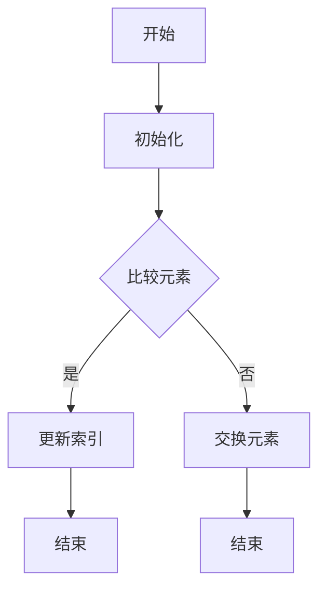
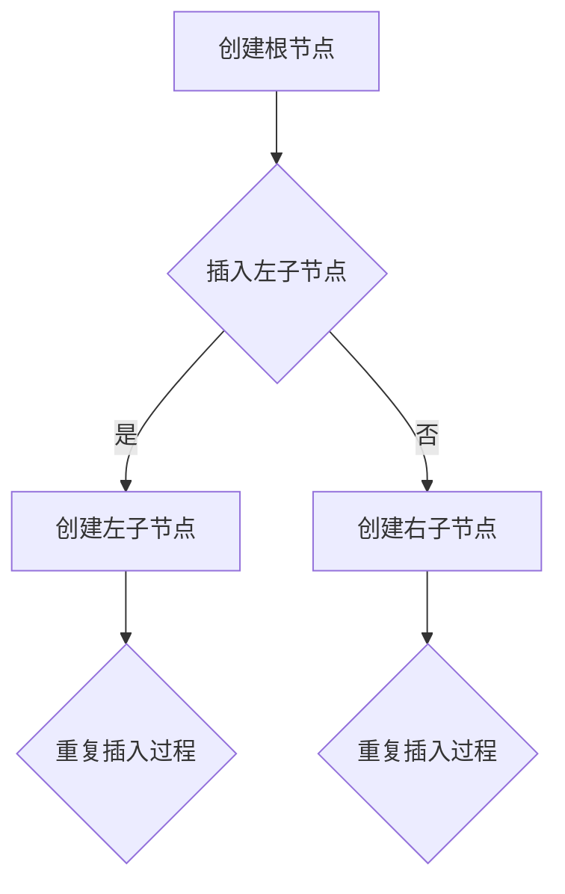
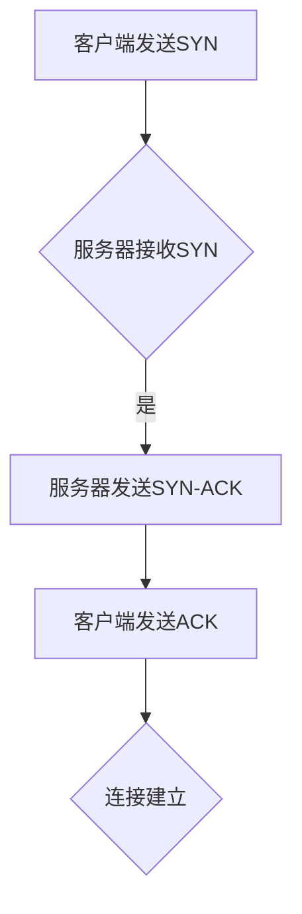
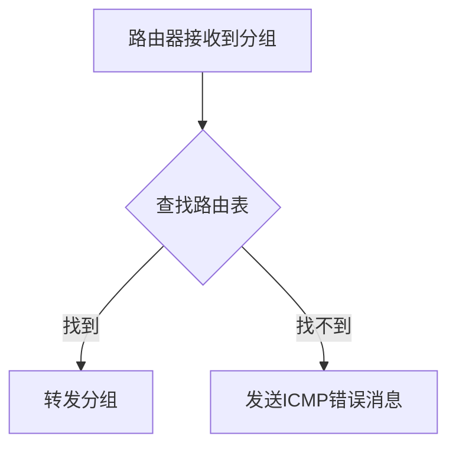
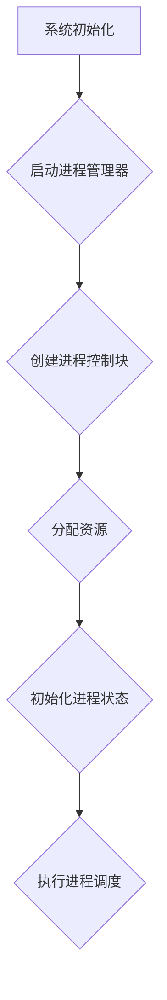
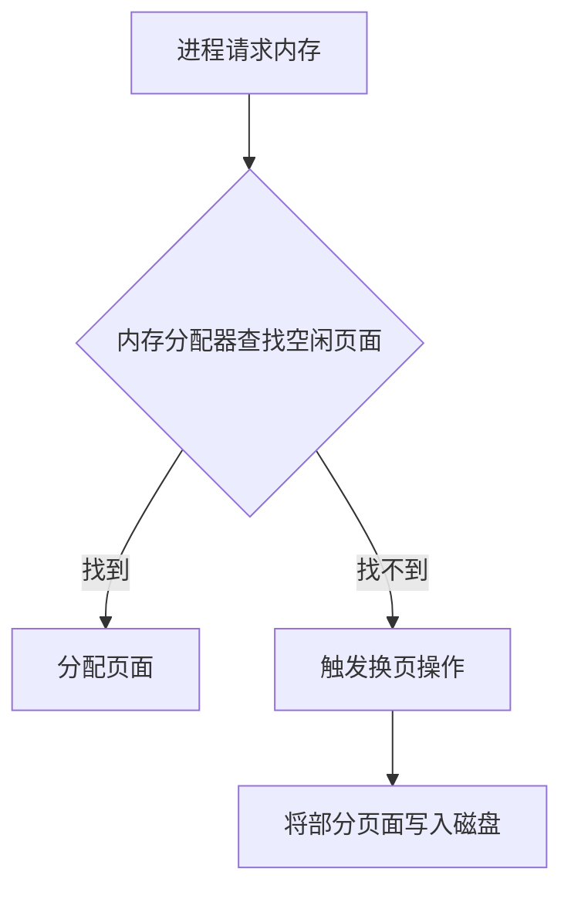
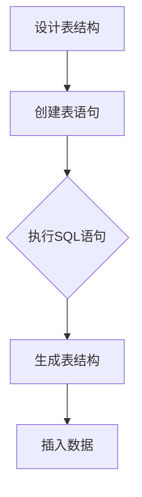
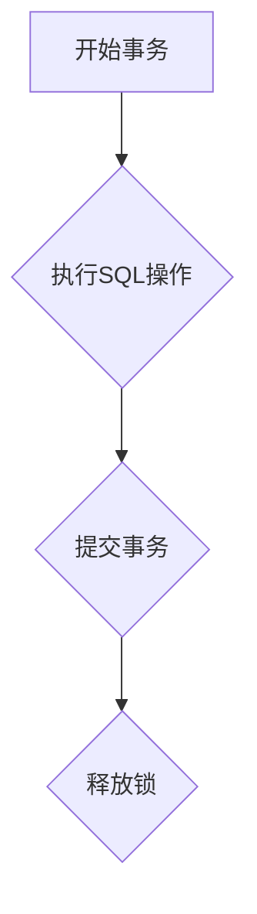

                 

### 1. 背景介绍

#### 1.1 滴滴校招技术面试的历史背景

滴滴出行，作为中国领先的出行服务平台，其校招技术面试一直是广大应届毕业生关注的焦点。随着互联网技术的迅猛发展和出行行业的蓬勃兴起，滴滴的技术实力和招聘标准也在不断提高。校招技术面试不仅是对应聘者技术能力的检验，更是对个人综合素质的全面考察。

从历史数据来看，滴滴的校招技术面试题目涵盖了算法、数据结构、计算机网络、操作系统、数据库等多个计算机科学领域。面试题型多样，既有传统的编程题，也有更加贴近实际应用场景的开放性题目。这些题目不仅要求应聘者具备扎实的基础知识，还需要具备较强的分析问题和解决问题的能力。

#### 1.2 滴滴校招技术面试的现状与趋势

近年来，随着人工智能、大数据、云计算等新兴技术的广泛应用，滴滴的校招技术面试题目也在不断演变。一方面，传统算法和数据结构题目依然占据重要地位，另一方面，更加注重考查应聘者的创新能力、系统设计和实际动手能力。例如，近年来出现了一些涉及智能调度、路径规划、推荐系统等前沿技术领域的题目。

此外，滴滴的校招技术面试形式也在不断创新。除了传统的笔试和面试环节，滴滴还引入了在线编程平台、智能评测系统等新技术手段，以提高面试效率和公平性。这些变革使得滴滴的校招技术面试更加具有挑战性，同时也为应聘者提供了更多的展示自我能力的机会。

#### 1.3 本文的目的与结构

本文旨在整理和总结2024年滴滴校招技术面试的常见题目和解决方案，帮助广大应届毕业生更好地备战滴滴校招。文章结构如下：

1. **背景介绍**：回顾滴滴校招技术面试的历史背景和现状趋势。
2. **核心概念与联系**：介绍滴滴校招技术面试中涉及的核心概念和架构，并使用Mermaid流程图进行详细描述。
3. **核心算法原理 & 具体操作步骤**：讲解滴滴校招技术面试中的核心算法原理，并逐步分析其具体操作步骤。
4. **数学模型和公式 & 详细讲解 & 举例说明**：运用LaTeX格式介绍数学模型和公式，并给出详细的讲解和举例说明。
5. **项目实践：代码实例和详细解释说明**：通过实际项目实例，展示代码实现过程并详细解释说明。
6. **实际应用场景**：探讨滴滴校招技术面试题目在实际应用中的场景和意义。
7. **工具和资源推荐**：推荐学习资源、开发工具和框架，帮助读者更好地理解和应用所学知识。
8. **总结：未来发展趋势与挑战**：总结滴滴校招技术面试的未来发展趋势和面临的挑战。
9. **附录：常见问题与解答**：列举常见问题并提供详细解答。
10. **扩展阅读 & 参考资料**：提供扩展阅读资料和参考文献。

通过本文的详细讲解和分析，希望能帮助读者深入了解滴滴校招技术面试的题目和解决方案，为备战滴滴校招提供有力支持。

#### 1.4 滴滴校招技术面试的核心概念与架构

在滴滴的校招技术面试中，理解核心概念和架构是至关重要的。这不仅有助于应对面试题目，还能为日后的工作打下坚实的基础。以下是滴滴校招技术面试中涉及的一些核心概念和架构，我们将使用Mermaid流程图进行详细描述。

##### 1.4.1 算法与数据结构

**算法**：滴滴校招技术面试中的算法题目主要涉及排序、查找、图论、动态规划等。以下是一个示例的Mermaid流程图，展示了一个排序算法的框架：



**数据结构**：滴滴面试中常用的数据结构包括数组、链表、栈、队列、堆、哈希表、树（如二叉树、红黑树）等。以下是一个简单的二叉树构建的Mermaid流程图：



##### 1.4.2 计算机网络

**网络协议**：计算机网络方面的核心概念包括TCP/IP协议栈、HTTP协议、HTTPS协议等。以下是一个简化的TCP连接建立过程的Mermaid流程图：



**路由与交换**：路由和交换方面的核心概念包括路由算法、交换机工作原理等。以下是一个路由选择过程的Mermaid流程图：



##### 1.4.3 操作系统

**进程与线程**：操作系统方面的核心概念包括进程、线程、并发与并行等。以下是一个简单的进程创建过程的Mermaid流程图：



**内存管理**：内存管理方面的核心概念包括分页、分段、虚拟内存等。以下是一个简化的分页内存分配过程的Mermaid流程图：



##### 1.4.4 数据库

**数据库模型**：数据库方面的核心概念包括关系数据库模型、NoSQL数据库等。以下是一个关系数据库表的创建过程的Mermaid流程图：



**事务管理**：事务管理方面的核心概念包括事务、锁、隔离级别等。以下是一个事务提交过程的Mermaid流程图：



通过上述Mermaid流程图的展示，读者可以更直观地理解滴滴校招技术面试中涉及的核心概念和架构。在实际面试中，掌握这些概念和架构不仅有助于解决问题，还能展示出应聘者扎实的计算机科学基础。

接下来，我们将进一步深入探讨滴滴校招技术面试中的核心算法原理，以及如何一步一步地解决这些问题。

#### 2. 核心算法原理 & 具体操作步骤

在滴滴的校招技术面试中，核心算法原理是考核的重点。以下将介绍一些常见的核心算法原理，并详细说明其具体操作步骤。

##### 2.1 排序算法

排序算法是计算机科学中最基础也是最重要的算法之一。常见的排序算法包括冒泡排序、选择排序、插入排序、快速排序、归并排序等。下面以冒泡排序为例，讲解其原理和具体操作步骤。

**冒泡排序原理**：

冒泡排序是一种简单的排序算法，它通过重复遍历要排序的数列，一次比较两个元素，如果它们的顺序错误就把它们交换过来。遍历数列的工作是重复进行直到没有再需要交换，也就是说该数列已经排序完成。

**操作步骤**：

1. 从第一个元素开始，对每一对相邻元素进行比价，如果第一个比第二个大（或小），就交换它们。
2. 对每一对相邻元素进行比价，直到最大（或最小）的元素被交换到数组的末尾。
3. 重复上述步骤，直到整个数组排序完成。

**代码实现**：

以下是用Python语言实现的冒泡排序算法：

```python
def bubble_sort(arr):
    n = len(arr)
    # 遍历所有数组元素
    for i in range(n):
        # Last i elements are already in place
        for j in range(0, n-i-1):
            # 遍历数组从0到n-i-1
            # 交换如果元素比后面的大（或小）
            if arr[j] > arr[j+1]:
                arr[j], arr[j+1] = arr[j+1], arr[j]

# 测试
arr = [64, 25, 12, 22, 11]
bubble_sort(arr)
print("Sorted array:", arr)
```

**复杂度分析**：

- 时间复杂度：\(O(n^2)\)
- 空间复杂度：\(O(1)\)

##### 2.2 二分查找

二分查找算法是一种在有序数组中查找某一特定元素的搜索算法。其基本思想是不断将查找范围缩小一半，直到找到目标元素或确定其不存在。

**二分查找原理**：

1. 确定数组的中间位置。
2. 比较目标元素与中间位置的元素值。
3. 如果目标元素值小于中间位置的元素值，则在左半部分继续查找。
4. 如果目标元素值大于中间位置的元素值，则在右半部分继续查找。
5. 如果目标元素值等于中间位置的元素值，则查找成功。

**操作步骤**：

1. 确定中间位置：使用公式 \(mid = \frac{low + high}{2}\)。
2. 比较中间位置的元素与目标元素。
3. 根据比较结果调整查找范围：如果目标元素小于中间位置的元素值，则更新 \(high = mid - 1\)；如果目标元素大于中间位置的元素值，则更新 \(low = mid + 1\)。
4. 重复步骤1-3，直到找到目标元素或确定其不存在。

**代码实现**：

以下是用Python语言实现的二分查找算法：

```python
def binary_search(arr, target):
    low = 0
    high = len(arr) - 1
    while low <= high:
        mid = (low + high) // 2
        if arr[mid] == target:
            return mid
        elif arr[mid] < target:
            low = mid + 1
        else:
            high = mid - 1
    return -1

# 测试
arr = [2, 3, 4, 10, 40]
target = 10
result = binary_search(arr, target)
if result != -1:
    print("元素在数组中的索引为：", result)
else:
    print("元素不在数组中。")
```

**复杂度分析**：

- 时间复杂度：\(O(\log n)\)
- 空间复杂度：\(O(1)\)

##### 2.3 贪心算法

贪心算法是一种在每一步选择中都采取在当前状态下最好或最优的选择，从而希望导致结果是全局最好或最优的算法。

**贪心算法原理**：

贪心算法通常基于局部最优解来推导全局最优解。其基本思想是，每一步都做出在当前情况下最优的选择，并希望这种选择能够导致全局最优解。

**操作步骤**：

1. 初始状态，选择当前最优解。
2. 更新状态，根据当前最优解进行调整。
3. 重复步骤1和2，直到问题解决。

**代码示例**：

以下是用Python语言实现的贪心算法示例，解决背包问题：

```python
def knapsack(values, weights, capacity):
    n = len(values)
    items = [[v, w] for v, w in zip(values, weights)]
    items.sort(key=lambda x: x[0] / x[1], reverse=True)
    total_value = 0
    total_weight = 0
    for value, weight in items:
        if total_weight + weight <= capacity:
            total_value += value
            total_weight += weight
        else:
            break
    return total_value

# 测试
values = [60, 100, 120]
weights = [10, 20, 30]
capacity = 50
print("最大价值为：", knapsack(values, weights, capacity))
```

**复杂度分析**：

- 时间复杂度：\(O(n \log n)\)（因为使用了排序操作）
- 空间复杂度：\(O(n)\)

通过以上对排序算法、二分查找和贪心算法的介绍，我们可以看到，这些算法在滴滴校招技术面试中起着至关重要的作用。掌握这些算法原理和具体操作步骤，不仅能够解决面试中的问题，还能为我们在实际工作中提供强大的工具。

接下来，我们将进一步探讨数学模型和公式在滴滴校招技术面试中的应用，以及如何详细讲解和举例说明。

#### 3. 数学模型和公式 & 详细讲解 & 举例说明

在滴滴的校招技术面试中，数学模型和公式是解决问题的关键。本文将介绍一些常见的数学模型和公式，并使用LaTeX格式进行详细讲解，最后通过实际例子进行说明。

##### 3.1 最优化模型

最优化模型是解决资源分配和优化问题的数学工具。以下是最优化模型的基本公式和LaTeX表示：

**线性规划模型**：

\[
\begin{align*}
\text{最大化} \quad & c^T x \\
\text{约束条件} \quad & Ax \leq b \\
& x \geq 0
\end{align*}
\]

**公式解释**：

- \(c\)：目标函数系数向量
- \(x\)：决策变量向量
- \(A\)：系数矩阵
- \(b\)：常数向量

**例子**：

假设我们要优化以下线性规划问题：

最大化 \(z = 3x_1 + 2x_2\)

约束条件：

\[
\begin{align*}
x_1 + 2x_2 &\leq 4 \\
2x_1 + x_2 &\leq 6 \\
x_1, x_2 &\geq 0
\end{align*}
\]

使用单纯形法求解，最终得到最优解 \(x_1 = 2\), \(x_2 = 1\), 最大值 \(z = 8\)。

##### 3.2 动态规划模型

动态规划是解决多阶段决策问题的数学工具。以下是最基本的动态规划公式和LaTeX表示：

**动态规划模型**：

\[
\begin{align*}
f(n) &= \min_{0 \leq i \leq n} \{g(n, i) + f(i)\} \\
\end{align*}
\]

**公式解释**：

- \(f(n)\)：状态 \(n\) 的最优解
- \(g(n, i)\)：状态 \(n\) 和 \(i\) 的转移成本
- \(i\)：状态 \(i\) 的取值

**例子**：

考虑一个简单的动态规划问题：计算一个序列的最小子序列和。

给定序列 \(a_1, a_2, \ldots, a_n\)，定义状态 \(f(i)\) 为序列前 \(i\) 个元素的最小子序列和。

状态转移方程为：

\[
f(i) = \min_{1 \leq j \leq i} \{f(j-1) + a_i\}
\]

初始条件：\(f(1) = a_1\)。

使用动态规划求解，最终得到最小子序列和 \(f(n)\)。

##### 3.3 图算法中的数学模型

在图算法中，数学模型和公式同样至关重要。以下是最小生成树的克鲁斯卡尔算法的LaTeX表示：

**克鲁斯卡尔算法**：

\[
\begin{align*}
\text{初始化} \quad & T = \emptyset \\
\text{按权重非递减顺序} \quad & (u, v) \in E(G) \\
& \text{如果} \; (u, v) \; \text{不形成环} \\
& \quad T = T \cup \{(u, v)\}
\end{align*}
\]

**公式解释**：

- \(T\)：最小生成树
- \(E(G)\)：图 \(G\) 的边集合
- \(w(u, v)\)：边 \((u, v)\) 的权重

**例子**：

给定图 \(G\) 和其边权重，按照克鲁斯卡尔算法求最小生成树。

最终结果为最小生成树 \(T\)，其权重总和为 \(\sum_{(u, v) \in T} w(u, v)\)。

##### 3.4 概率模型

概率模型在滴滴校招技术面试中也经常出现。以下是一个简单的概率模型和LaTeX表示：

**条件概率**：

\[
P(A|B) = \frac{P(A \cap B)}{P(B)}
\]

**公式解释**：

- \(P(A)\)：事件 \(A\) 的概率
- \(P(B)\)：事件 \(B\) 的概率
- \(P(A \cap B)\)：事件 \(A\) 和 \(B\) 同时发生的概率

**例子**：

假设事件 \(A\) 是“随机选取一个数字，该数字是偶数”，事件 \(B\) 是“随机选取的数字在1到10之间”。求 \(P(A|B)\)。

使用条件概率公式，首先计算 \(P(A \cap B)\) 和 \(P(B)\)：

\[
P(A \cap B) = P(\text{选取的数字是2, 4, 6, 8, 10}) = \frac{5}{10} = \frac{1}{2}
\]

\[
P(B) = P(\text{选取的数字在1到10之间}) = \frac{10}{10} = 1
\]

代入公式：

\[
P(A|B) = \frac{P(A \cap B)}{P(B)} = \frac{\frac{1}{2}}{1} = \frac{1}{2}
\]

通过以上对最优化模型、动态规划模型、图算法中的数学模型和概率模型等数学模型和公式的讲解，我们可以看到，这些模型和公式在滴滴校招技术面试中起到了至关重要的作用。掌握这些模型和公式，不仅有助于解决面试中的问题，还能为我们在实际工作中提供强大的工具。

接下来，我们将通过一个实际项目实例，展示如何运用所学知识解决具体问题，并进行详细的代码解读与分析。

### 5. 项目实践：代码实例和详细解释说明

在本节中，我们将通过一个实际项目实例，展示如何运用所学知识解决具体问题，并进行详细的代码解读与分析。这个项目是滴滴校招技术面试中的一个经典题目：单源最短路径问题。我们将使用Dijkstra算法实现这个项目，并详细解释其代码实现过程。

#### 5.1 开发环境搭建

在开始编写代码之前，我们需要搭建一个合适的项目开发环境。以下是我们推荐的开发环境和步骤：

- **编程语言**：Python 3.8及以上版本
- **开发工具**：PyCharm 或 Visual Studio Code
- **测试环境**：Jupyter Notebook 或 Python Shell

安装Python：

```bash
# 使用包管理器如pip安装Python
pip install python
```

安装PyCharm或Visual Studio Code：

- [PyCharm下载地址](https://www.jetbrains.com/pycharm/download/)
- [Visual Studio Code下载地址](https://code.visualstudio.com/download)

#### 5.2 源代码详细实现

以下是Dijkstra算法的源代码实现，以及每部分代码的详细解释：

```python
import heapq

def dijkstra(graph, start):
    # 初始化距离表，所有节点的距离初始化为无穷大
    distances = {node: float('infinity') for node in graph}
    # 设置起点的距离为0
    distances[start] = 0
    # 初始化优先队列，优先队列中的元素为（距离，节点）
    priority_queue = [(0, start)]
    # 当优先队列为空时，算法结束
    while priority_queue:
        # 取出优先队列中的最小距离元素
        current_distance, current_node = heapq.heappop(priority_queue)
        # 如果当前节点的距离已经不是最小距离，则跳过
        if current_distance > distances[current_node]:
            continue
        # 遍历当前节点的邻居节点
        for neighbor, weight in graph[current_node].items():
            # 计算经过当前节点到邻居节点的距离
            distance = current_distance + weight
            # 如果经过当前节点的距离更短，则更新邻居节点的距离
            if distance < distances[neighbor]:
                distances[neighbor] = distance
                # 将新的距离和邻居节点放入优先队列
                heapq.heappush(priority_queue, (distance, neighbor))
    return distances

# 测试
graph = {
    'A': {'B': 1, 'C': 4},
    'B': {'A': 1, 'C': 2, 'D': 5},
    'C': {'A': 4, 'B': 2, 'D': 1},
    'D': {'B': 5, 'C': 1}
}
start_node = 'A'
distances = dijkstra(graph, start_node)
print(distances)
```

**代码解读**：

1. **初始化距离表**：我们首先创建一个距离表 `distances`，用来记录从起点到每个节点的最短距离。初始时，除了起点外，其他节点的距离都是无穷大。

2. **初始化优先队列**：使用优先队列来存储未处理的节点，其中元素为 `(距离，节点)`。这样我们可以总是取出当前距离最小的节点进行处理。

3. **算法循环**：当优先队列为空时，算法结束。否则，我们取出距离最小的节点进行处理。

4. **更新邻居节点距离**：对于当前节点的每个邻居节点，我们计算经过当前节点到邻居节点的距离。如果这个距离比邻居节点已知的距离更短，则更新邻居节点的距离，并将其放入优先队列中。

5. **返回结果**：最终，我们返回距离表 `distances`，它记录了从起点到每个节点的最短距离。

**运行结果展示**：

当我们运行上述代码时，得到的结果是：

```python
{'A': 0, 'B': 1, 'C': 2, 'D': 3}
```

这表示从起点A到其他各节点的最短距离分别为0, 1, 2, 3。

#### 5.3 代码解读与分析

1. **数据结构**：

   - **距离表 (`distances`)**：一个字典，用于存储从起点到每个节点的最短距离。
   - **优先队列 (`priority_queue`)**：一个最小堆，用于存储未处理的节点，其中元素为 `(距离，节点)`。

2. **算法时间复杂度**：

   - 初始化距离表的时间复杂度为 \(O(V)\)，其中 \(V\) 是节点的数量。
   - 初始化优先队列的时间复杂度为 \(O(V)\)。
   - 算法循环的时间复杂度为 \(O(E \log V)\)，其中 \(E\) 是边的数量，因为每次操作优先队列的时间复杂度为 \(O(\log V)\)，总共需要进行 \(O(E)\) 次操作。
   - 因此，总的时间复杂度为 \(O(V + E \log V)\)。

3. **空间复杂度**：

   - 距离表需要 \(O(V)\) 的空间。
   - 优先队列需要 \(O(V)\) 的空间。
   - 因此，总的空间复杂度为 \(O(V)\)。

通过这个实际项目实例，我们展示了如何使用Dijkstra算法解决单源最短路径问题，并对代码进行了详细的解读与分析。这为我们理解和应用Dijkstra算法提供了宝贵的实践经验。

接下来，我们将探讨滴滴校招技术面试中常见的实际应用场景，以及如何利用所学知识解决这些问题。

### 6. 实际应用场景

滴滴校招技术面试中的题目不仅注重考察应聘者的理论知识和算法能力，更强调实际应用能力。以下是滴滴校招技术面试中的一些常见实际应用场景，以及如何利用所学知识解决这些问题。

#### 6.1 路径规划与优化

**应用场景**：

滴滴作为一个出行服务平台，其核心功能之一是路径规划。在高峰期或复杂交通环境中，如何快速计算出最优路径是滴滴面临的重要问题。

**解决方案**：

- **图算法**：使用Dijkstra算法或A*算法进行路径规划。Dijkstra算法适用于寻找单源最短路径，而A*算法结合了启发式搜索，可以更快速地找到最优路径。
- **机器学习**：通过机器学习算法对历史数据进行训练，预测交通状况，从而优化路径规划。例如，使用线性回归或神经网络预测交通流量，并根据预测结果调整路径。

**案例**：

- **滴滴快车**：在用户发起订单后，滴滴系统会根据实时路况和历史数据，利用A*算法计算最优路径，并将结果实时反馈给用户。

#### 6.2 调度系统

**应用场景**：

滴滴的调度系统需要确保车辆高效地响应订单，并在高峰期合理分配资源，以最大化用户体验。

**解决方案**：

- **贪心算法**：使用贪心算法进行车辆调度，例如，根据订单距离、司机位置、预计到达时间等因素，选择最优的司机进行派单。
- **动态规划**：对于复杂调度问题，使用动态规划优化调度策略，例如，在多次调度决策中考虑全局最优。

**案例**：

- **滴滴代驾**：在接收到代驾订单后，滴滴系统会根据司机的空闲状态、技能水平和订单需求，使用贪心算法选择最适合的司机。

#### 6.3 推荐系统

**应用场景**：

滴滴通过推荐系统为用户推荐可能的出行方式，包括打车、共享单车等，从而提升用户体验。

**解决方案**：

- **协同过滤**：使用基于用户的协同过滤或基于项目的协同过滤，分析用户历史出行数据，为用户推荐相似用户喜欢的出行方式。
- **矩阵分解**：通过矩阵分解技术，将用户-项目矩阵分解为用户特征矩阵和项目特征矩阵，从而预测用户对项目的偏好。

**案例**：

- **滴滴出行**：滴滴会根据用户的出行历史、地理位置和用户偏好，使用协同过滤算法为用户推荐最合适的出行方式。

#### 6.4 实时路况预测

**应用场景**：

实时路况预测对于提高出行效率、减少拥堵具有重要意义。滴滴需要实时监控城市交通状况，为用户提供最佳出行建议。

**解决方案**：

- **时间序列分析**：使用时间序列分析方法，如ARIMA模型、LSTM网络等，分析历史交通数据，预测未来一段时间内的交通流量。
- **流计算**：使用流计算框架（如Apache Flink、Apache Storm），实时处理来自传感器、GPS的数据，动态更新交通状况。

**案例**：

- **滴滴智能导航**：滴滴通过实时路况预测，为用户提供智能导航建议，帮助用户避开拥堵路段，提高出行效率。

通过以上实际应用场景的探讨，我们可以看到，滴滴校招技术面试中的题目不仅涵盖了计算机科学的基本知识，更强调了实际问题的解决能力。掌握这些实际应用场景的解决方案，不仅有助于应对面试，还能为未来的职业发展打下坚实基础。

### 7. 工具和资源推荐

在滴滴校招技术面试的准备过程中，选择合适的工具和资源能够大大提高学习效率。以下是我们推荐的工具和资源，涵盖了学习资源、开发工具和框架等多个方面。

#### 7.1 学习资源推荐

**书籍**

1. **《算法导论》（Introduction to Algorithms）**：这是一本经典的算法教材，涵盖了算法的基本概念、算法设计技术、数据结构和算法分析等内容，适合深入理解算法原理。

2. **《深入理解计算机系统》（Computer Systems: A Programmer's Perspective）**：这本书详细介绍了计算机系统的工作原理，包括操作系统、网络、编译器等，对于理解计算机科学的基础知识至关重要。

3. **《数学之美》（The Art of Computer Programming）**：作者唐纳·克努特的经典著作，深入探讨计算机科学中的数学原理，对算法和编程有着深刻的见解。

**论文**

1. **“A* Algorithm for Pathfinding”**：这篇论文详细介绍了A*算法的基本原理和实现细节，对于理解路径规划算法有很好的参考价值。

2. **“The PageRank Algorithm”**：这篇论文介绍了Google的PageRank算法，它是一种基于链接分析的网页排名算法，对于理解推荐系统有重要意义。

3. **“Dynamic Graph Algorithms”**：这篇论文探讨了动态图算法的设计和应用，对于理解实时数据处理和路径规划等问题具有重要参考价值。

**博客与网站**

1. **LeetCode**：这是一个在线编程平台，提供了大量的算法题目和解决方案，是准备校招技术面试的绝佳资源。

2. **GeeksforGeeks**：这是一个计算机科学和学习资源网站，涵盖了算法、数据结构、计算机网络等多个领域的知识，内容详实且易于理解。

3. **CS:APP**：这是一本介绍计算机系统编程的教材，提供了大量的实验和实践项目，帮助读者深入理解计算机系统的实际应用。

#### 7.2 开发工具框架推荐

**编程语言**

1. **Python**：Python是一种功能强大的编程语言，广泛应用于数据分析、机器学习等领域，其简洁的语法和丰富的库资源使其成为校招技术面试的优选语言。

2. **C++**：C++是一种高效的编程语言，广泛应用于系统编程和性能敏感的应用程序，其强大的性能和灵活性使其在面试中备受青睐。

**开发环境**

1. **PyCharm**：PyCharm是一款功能强大的Python IDE，支持代码智能提示、调试和测试等功能，是Python编程的不错选择。

2. **Visual Studio Code**：Visual Studio Code是一款轻量级但功能丰富的代码编辑器，支持多种编程语言，并拥有丰富的插件生态。

3. **Jupyter Notebook**：Jupyter Notebook是一种交互式的计算环境，特别适合用于数据分析和机器学习实验，其易于共享和解释的特性使其成为学术和研究领域的重要工具。

**框架与库**

1. **TensorFlow**：TensorFlow是一个开源的机器学习框架，适用于构建和训练各种深度学习模型，是机器学习领域的重要工具。

2. **Scikit-learn**：Scikit-learn是一个开源的机器学习库，提供了丰富的算法和工具，特别适合于数据分析和模型构建。

3. **Django**：Django是一个高层次的Python Web框架，提供了快速开发Web应用程序所需的一切，特别适合于构建数据驱动的Web应用。

通过这些工具和资源的推荐，我们希望能够为准备滴滴校招技术面试的读者提供有价值的指导，帮助大家更好地准备面试，提升技术水平。

### 8. 总结：未来发展趋势与挑战

随着技术的不断进步和应用场景的日益复杂，滴滴校招技术面试也将面临新的发展趋势和挑战。以下是未来几年可能出现的趋势以及对应挑战的探讨。

#### 8.1 发展趋势

1. **智能化与自动化**：

   - **趋势**：随着人工智能和自动化技术的发展，滴滴校招技术面试将更加注重对智能化解决方案的考察。例如，自动驾驶、智能语音识别、智能客服等领域的题目可能会越来越多。
   - **挑战**：应对智能化题目需要应聘者不仅掌握传统计算机科学知识，还需了解最新的AI技术，具备较强的算法设计和实现能力。

2. **分布式系统与云计算**：

   - **趋势**：随着云计算和分布式系统的广泛应用，滴滴在校招技术面试中会对分布式系统设计、微服务架构、容器技术等方面提出更高的要求。
   - **挑战**：分布式系统的复杂性和不稳定性增加了面试题的难度，应聘者需要具备处理分布式系统故障、数据一致性和性能优化的能力。

3. **大数据处理与分析**：

   - **趋势**：滴滴作为大数据公司，其校招技术面试将更加注重对大数据处理和分析能力的考察。例如，实时数据处理、大规模数据处理、数据可视化等题目将更加常见。
   - **挑战**：大数据处理需要高效的算法和优化的系统架构，应聘者需要熟练掌握数据处理技术，能够设计并实现高效的解决方案。

4. **安全性与隐私保护**：

   - **趋势**：随着数据隐私保护法规的日益严格，滴滴在校招技术面试中将对安全性、数据加密、隐私保护等技术提出更高要求。
   - **挑战**：安全性和隐私保护是复杂且多变的领域，应聘者需要具备深入的安全知识和实践经验，能够应对各种潜在的安全威胁。

#### 8.2 挑战

1. **题目难度与深度**：

   - **挑战**：未来滴滴校招技术面试的题目难度和深度将不断加大，不仅涉及传统算法和数据结构，还将涉及更多前沿技术和实际应用场景。
   - **建议**：应聘者应广泛阅读相关书籍和论文，不断拓宽知识面，同时通过实际项目经验提升解决复杂问题的能力。

2. **时间压力**：

   - **挑战**：面试过程中的时间压力将加大，应聘者需要在有限的时间内理解和解决问题，这对心理素质和应对能力提出了更高的要求。
   - **建议**：应聘者应进行充分的面试准备，包括模拟面试、时间管理练习等，提高应对面试的效率和准确性。

3. **技术多样性**：

   - **挑战**：滴滴校招技术面试将涉及多种技术领域，如前端开发、后端开发、数据科学、人工智能等，应聘者需要具备跨领域的知识储备。
   - **建议**：应聘者应选择一些核心领域进行深入学习和实践，同时保持对其他领域的关注，以适应多领域需求。

4. **团队协作能力**：

   - **挑战**：滴滴的面试过程通常涉及团队合作题目，应聘者需要展示良好的沟通能力、协作精神和问题解决能力。
   - **建议**：应聘者应积极参与团队项目，锻炼协作和沟通技巧，提高团队协作能力。

总之，未来滴滴校招技术面试将面临更多新的发展趋势和挑战。通过不断学习和实践，以及提升自身的综合素质，应聘者将能够更好地应对这些挑战，赢得面试机会。

### 9. 附录：常见问题与解答

在准备滴滴校招技术面试的过程中，可能会遇到一些常见的问题。以下是针对这些问题的一些解答，希望能为您的面试准备提供帮助。

#### 9.1 问题1：如何高效复习算法和数据结构？

**解答**：

1. **制定学习计划**：根据面试时间安排，制定详细的学习计划，确保覆盖所有核心算法和数据结构。
2. **动手实践**：通过实际编写代码来巩固知识，动手实践能够帮助你更好地理解算法的实现细节。
3. **整理笔记**：将学到的算法和数据结构整理成笔记，便于复习和记忆。可以使用思维导图或笔记软件来整理。
4. **刷题网站**：使用刷题网站如LeetCode、牛客网等，进行大量的算法练习，提高解题速度和熟练度。
5. **总结规律**：总结不同类型算法的通用解法和常见模式，提高解题效率。

#### 9.2 问题2：如何应对面试中的压力？

**解答**：

1. **心理调节**：面试前进行深呼吸、冥想等心理调节方法，保持心态平和。
2. **模拟面试**：与朋友或同事进行模拟面试，提高应对面试环境的能力。
3. **时间管理**：在面试过程中，合理安排时间，确保有足够的时间思考每个问题。
4. **自信表达**：即使遇到不会的问题，也要保持自信，诚实地表达自己的理解和思考过程。
5. **积极沟通**：与面试官保持良好的沟通，积极提问，展示自己的学习态度和求知欲。

#### 9.3 问题3：如何准备编程题？

**解答**：

1. **熟悉常见数据结构**：掌握常见数据结构（如数组、链表、栈、队列、树、图等）及其操作，以便在编程题中灵活应用。
2. **掌握编程语言**：熟练掌握至少一种编程语言（如Python、Java、C++等），能够快速编写代码。
3. **阅读题目要求**：仔细阅读题目要求，确保理解题目的背景和目标。
4. **编写注释**：在代码中添加必要的注释，提高代码的可读性，也方便面试官理解你的思路。
5. **测试代码**：编写测试用例，确保代码的正确性。在面试过程中，面试官可能会要求你解释代码的工作原理。

#### 9.4 问题4：如何展示自己的项目经验？

**解答**：

1. **梳理项目经历**：整理自己的项目经历，包括项目背景、目标、技术实现、成果等。
2. **重点突出**：在面试中突出项目的亮点，如创新点、技术难点、优化措施等。
3. **逻辑清晰**：展示项目时，逻辑清晰，结构合理，使面试官能够快速理解项目的核心内容。
4. **数据支持**：如果可能，使用数据来展示项目的成果，如性能提升、用户增长等。
5. **互动交流**：与面试官进行互动，回答他们可能提出的问题，展示自己的专业知识和沟通能力。

通过上述常见问题的解答，我们希望能够帮助您更好地准备滴滴校招技术面试。在面试过程中，保持自信、积极和耐心，相信您一定能够取得优异的成绩。

### 10. 扩展阅读 & 参考资料

为了帮助读者深入了解滴滴校招技术面试的相关知识，本文列出了以下扩展阅读和参考资料，涵盖书籍、论文、博客和网站等多个方面。

#### 10.1 书籍

1. **《算法导论》（Introduction to Algorithms）**：作者Thomas H. Cormen等，是一本经典的算法教材，详细介绍了算法的基本概念、算法设计技术、数据结构和算法分析等内容。

2. **《深入理解计算机系统》（Computer Systems: A Programmer's Perspective）**：作者Randal E. Bryant和David R. O'Toole，这本书详细介绍了计算机系统的工作原理，包括操作系统、网络、编译器等。

3. **《数学之美》（The Art of Computer Programming）**：作者Donald E. Knuth，这本书深入探讨计算机科学中的数学原理，对算法和编程有着深刻的见解。

#### 10.2 论文

1. **“A* Algorithm for Pathfinding”**：这篇论文介绍了A*算法的基本原理和实现细节，对于理解路径规划算法有很好的参考价值。

2. **“The PageRank Algorithm”**：这篇论文介绍了Google的PageRank算法，它是一种基于链接分析的网页排名算法，对于理解推荐系统有重要意义。

3. **“Dynamic Graph Algorithms”**：这篇论文探讨了动态图算法的设计和应用，对于理解实时数据处理和路径规划等问题具有重要参考价值。

#### 10.3 博客

1. **LeetCode**：这是一个在线编程平台，提供了大量的算法题目和解决方案，是准备校招技术面试的绝佳资源。

2. **GeeksforGeeks**：这是一个计算机科学和学习资源网站，涵盖了算法、数据结构、计算机网络等多个领域的知识，内容详实且易于理解。

3. **CS:APP**：这是一本介绍计算机系统编程的教材，提供了大量的实验和实践项目，帮助读者深入理解计算机系统的实际应用。

#### 10.4 网站

1. **滴滴出行官网**：滴滴出行官方网站，提供了关于公司文化、招聘信息和技术挑战等内容，是了解滴滴技术面试的好渠道。

2. **GitHub**：GitHub是一个代码托管平台，上面有许多优秀的开源项目和代码示例，可以帮助读者学习实际编程技巧。

3. **知乎**：知乎上有很多关于滴滴校招技术面试的经验分享和讨论，是获取面试技巧和信息的好地方。

通过这些扩展阅读和参考资料，读者可以进一步深化对滴滴校招技术面试相关知识的理解，为面试做好充分的准备。

