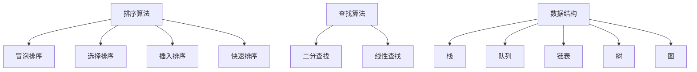
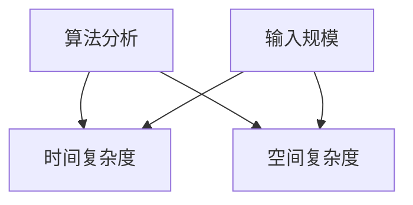
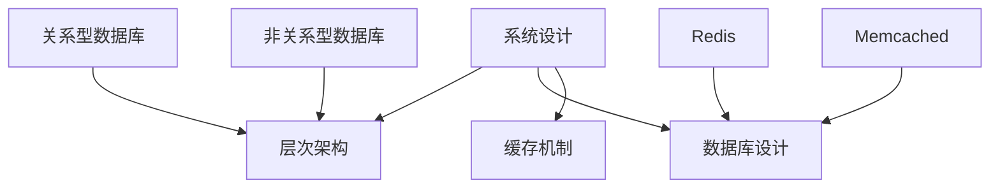
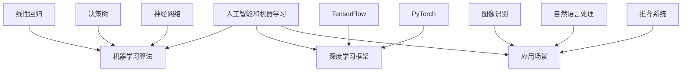

                 

### 背景介绍 Background

#### 百度校招与技术面试

百度作为中国领先的搜索引擎和互联网公司，每年都会举办大规模的校园招聘活动，吸引着无数优秀的应届毕业生。百度校招技术面试不仅考察应聘者的编程技能，还关注他们的逻辑思维、算法理解和问题解决能力。这无疑使得百度校招技术面试成为众多学子梦寐以求的挑战。

#### 技术面试的重要性

技术面试是校招过程中至关重要的一环。通过技术面试，公司能够评估应聘者的专业能力和潜力，同时应聘者也能了解公司对技术岗位的期望和要求。成功的面试不仅意味着得到一份理想的工作，更是对自己技术能力和职业规划的一次重要检验。

#### 2024年校招技术面试趋势

随着人工智能、大数据和云计算等技术的快速发展，2024年百度校招技术面试的趋势也逐渐明朗。算法题目将更加注重对基础算法的理解和应用，对复杂算法和数据分析的能力要求将进一步提升。同时，编程语言的选择和使用也将成为考察的重点，特别是在Python、Java和C++等语言上的深度掌握和应用。

#### 本文章的目标

本文将围绕2024年百度校招技术面试，提供一系列的面试题集锦。通过解析这些面试题，我们希望帮助广大应聘者更好地了解面试的难点和重点，从而提升自己的面试表现。文章结构如下：

- **背景介绍**：介绍百度校招技术面试的背景和重要性。
- **核心概念与联系**：阐述核心概念原理，并使用Mermaid流程图展示架构。
- **核心算法原理 & 具体操作步骤**：详细解释核心算法的原理和操作步骤。
- **数学模型和公式 & 详细讲解 & 举例说明**：介绍数学模型、公式及其应用。
- **项目实践：代码实例和详细解释说明**：提供实际代码实例并进行详细解读。
- **实际应用场景**：讨论技术的实际应用场景和挑战。
- **工具和资源推荐**：推荐学习资源、开发工具和框架。
- **总结：未来发展趋势与挑战**：展望技术发展趋势和面临的挑战。
- **附录：常见问题与解答**：提供常见问题及其解答。
- **扩展阅读 & 参考资料**：推荐相关阅读和参考资料。

通过本文的阅读和学习，希望能够为读者在百度校招技术面试中提供有力的支持。

#### 百度校招技术面试的背景

百度作为中国最具影响力的互联网公司之一，其校园招聘活动一直以来都是技术人才的热门选择。百度校招技术面试不仅是对应聘者技术能力的考察，更是对其综合素质的全面评估。每年，百度都会吸引大量优秀的应届毕业生前来参加面试，而面试的难度和广度也在逐年增加。

#### 百度校招技术面试的重要性

百度校招技术面试对于公司和应聘者来说，都具有重要的意义。对于百度而言，技术面试是选拔优秀人才的重要途径，通过面试可以了解应聘者的技术深度和广度，评估其是否具备解决实际问题的能力。同时，技术面试也能帮助百度筛选出与公司文化和价值观契合的候选人。

对于应聘者来说，技术面试则是展示自己能力、获得心仪职位的关键环节。成功的面试不仅意味着可以获得一份理想的工作，更是对自己技术水平和职业素养的一次重要检验。通过技术面试，应聘者能够明确自己的优势和不足，从而在未来的学习和工作中不断改进和提升。

#### 2024年百度校招技术面试的趋势

随着技术的不断进步，2024年百度校招技术面试的趋势也发生了明显的变化。以下是几大主要趋势：

1. **算法题目的复杂度增加**：算法题目将更加注重对基础算法的理解和应用，同时对复杂算法和数据分析的能力要求也将进一步提升。这要求应聘者不仅需要掌握基本的算法原理，还要能够灵活运用到实际问题中。

2. **编程语言的多样性**：编程语言的选择和使用将成为考察的重点。Python、Java和C++等语言将是面试中的主要考察对象。特别是Python，由于其简洁性和强大的数据处理能力，近年来在面试中的使用频率显著增加。

3. **对数学和统计学的重视**：数学和统计学的知识在面试中越来越重要。很多面试题目涉及到概率论、线性代数、微积分等数学知识，以及统计分析和数据可视化等统计学应用。这要求应聘者不仅要有扎实的数学基础，还要能够将数学知识应用到实际问题中。

4. **对系统设计的考察**：系统设计题目将成为面试中的一个重要部分。百度作为一家技术驱动型的公司，对系统设计的理解能力要求非常高。这包括对数据结构和算法的掌握，以及对系统性能、可扩展性和安全性的考量。

5. **对人工智能和机器学习的关注**：随着人工智能和机器学习技术的快速发展，百度对这些领域的技术人才需求也越来越大。面试中可能会涉及到一些与人工智能和机器学习相关的算法题目和应用场景。

#### 本文的结构和内容

本文旨在为2024年百度校招技术面试的应聘者提供全面的准备指导。文章结构如下：

1. **背景介绍**：介绍百度校招技术面试的背景和重要性，以及2024年的面试趋势。
2. **核心概念与联系**：阐述核心概念原理，并使用Mermaid流程图展示架构。
3. **核心算法原理 & 具体操作步骤**：详细解释核心算法的原理和操作步骤。
4. **数学模型和公式 & 详细讲解 & 举例说明**：介绍数学模型、公式及其应用。
5. **项目实践：代码实例和详细解释说明**：提供实际代码实例并进行详细解读。
6. **实际应用场景**：讨论技术的实际应用场景和挑战。
7. **工具和资源推荐**：推荐学习资源、开发工具和框架。
8. **总结：未来发展趋势与挑战**：展望技术发展趋势和面临的挑战。
9. **附录：常见问题与解答**：提供常见问题及其解答。
10. **扩展阅读 & 参考资料**：推荐相关阅读和参考资料。

通过本文的阅读和学习，希望能够帮助读者更好地应对百度校招技术面试，实现自己的职业梦想。

### 核心概念与联系 Core Concepts and Connections

在2024年百度校招技术面试中，核心概念和它们的联系是至关重要的。这些概念不仅涵盖基本的编程知识，还涉及到算法、数据结构、系统设计等各个方面。为了更好地理解这些概念，我们将使用Mermaid流程图来展示它们的架构和联系。

#### 1. 算法和数据结构

算法和数据结构是计算机科学的核心，也是面试中的重点考察对象。以下是几个核心概念：

**- 排序算法**：包括冒泡排序、选择排序、插入排序、快速排序等。每种排序算法都有其特定的应用场景和复杂度。

**- 查找算法**：如二分查找、线性查找等，重点考察对数组和树的查找效率。

**- 数据结构**：如栈、队列、链表、树、图等。每种数据结构都有其独特的使用场景和优缺点。

**Mermaid 流程图**：


#### 2. 算法分析

算法分析是评估算法性能的重要手段。主要涉及时间复杂度和空间复杂度。

**- 时间复杂度**：衡量算法执行时间与输入规模的关系。

**- 空间复杂度**：衡量算法所需存储空间与输入规模的关系。

**Mermaid 流程图**：


#### 3. 系统设计

系统设计是考察应聘者对系统架构的理解和应用能力。以下是几个核心概念：

**- 层次架构**：如分层架构、微服务架构等。

**- 数据库设计**：如关系型数据库和非关系型数据库的选择和使用。

**- 缓存机制**：如Redis、Memcached等。

**Mermaid 流程图**：


#### 4. 人工智能和机器学习

随着人工智能和机器学习技术的发展，相关算法和应用也逐渐成为面试的重点。以下是几个核心概念：

**- 机器学习算法**：如线性回归、决策树、神经网络等。

**- 深度学习框架**：如TensorFlow、PyTorch等。

**- 应用场景**：如图像识别、自然语言处理、推荐系统等。

**Mermaid 流程图**：


通过上述Mermaid流程图，我们可以清晰地看到各个核心概念之间的联系。这些概念不仅在面试中经常出现，也是计算机科学中不可或缺的部分。理解并掌握这些概念，对于应对百度校招技术面试至关重要。

### 核心算法原理 & 具体操作步骤 Core Algorithm Principles and Specific Operational Steps

在2024年百度校招技术面试中，核心算法的原理和具体操作步骤是应聘者必须掌握的重要内容。以下是几个常见且重要的算法，包括其基本原理和详细的操作步骤。

#### 1. 快速排序（Quick Sort）

**原理**：快速排序是一种分治策略的排序算法。其基本思想是通过一趟排序将待排序的数据分割成独立的两部分，其中一部分的所有数据都比另一部分的数据小，然后再按此方法对这两部分数据分别进行快速排序，整个排序过程可以递归进行，以此达到整个数据变成有序序列。

**操作步骤**：

**步骤1**：选择一个基准元素，通常选择第一个或最后一个元素作为基准。

**步骤2**：将数组分成两部分，一部分比基准元素小，另一部分比基准元素大。

**步骤3**：递归地对这两部分进行快速排序。

**Python实现**：
```python
def quick_sort(arr):
    if len(arr) <= 1:
        return arr
    pivot = arr[len(arr) // 2]
    left = [x for x in arr if x < pivot]
    middle = [x for x in arr if x == pivot]
    right = [x for x in arr if x > pivot]
    return quick_sort(left) + middle + quick_sort(right)

arr = [10, 7, 8, 9, 1, 5]
print(quick_sort(arr))
```

#### 2. 二分查找（Binary Search）

**原理**：二分查找算法通过重复将查找区间折半，能够快速从有序数组中找到特定元素的算法。其基本思想是，将待查找的元素与数组的中间元素比较，如果中间元素正好是要查找的元素，则查找成功；如果某个元素的值大于或小于中间元素，则可以排除掉一半的数据。

**操作步骤**：

**步骤1**：确定查找区间的开始和结束位置。

**步骤2**：计算中间位置，并与待查找元素比较。

**步骤3**：根据比较结果，将查找区间缩小一半，并重复步骤2。

**Python实现**：
```python
def binary_search(arr, target):
    left, right = 0, len(arr) - 1
    while left <= right:
        mid = (left + right) // 2
        if arr[mid] == target:
            return mid
        elif arr[mid] < target:
            left = mid + 1
        else:
            right = mid - 1
    return -1

arr = [1, 3, 5, 7, 9]
target = 7
print(binary_search(arr, target))
```

#### 3. 广度优先搜索（Breadth-First Search, BFS）

**原理**：广度优先搜索是一种用于图遍历的算法。其基本思想是从图的起始点开始，按照广度优先的原则，依次访问所有相邻的未访问节点。当所有相邻的节点都被访问后，再选择新的未访问节点进行访问。

**操作步骤**：

**步骤1**：初始化一个队列，并将起始节点入队。

**步骤2**：当队列为空时，结束搜索。

**步骤3**：从队列中取出队首元素，并将其所有未访问的邻接节点入队。

**步骤4**：重复步骤3，直到找到目标节点或队列为空。

**Python实现**：
```python
from collections import deque

def bfs(graph, start, target):
    visited = set()
    queue = deque([start])
    
    while queue:
        vertex = queue.popleft()
        visited.add(vertex)
        
        if vertex == target:
            return True
        
        for neighbour in graph[vertex]:
            if neighbour not in visited:
                queue.append(neighbour)
    
    return False

graph = {
    'A': ['B', 'C'],
    'B': ['D', 'E'],
    'C': ['F'],
    'D': [],
    'E': ['F'],
    'F': []
}
print(bfs(graph, 'A', 'F'))
```

#### 4. 深度优先搜索（Depth-First Search, DFS）

**原理**：深度优先搜索是一种用于图遍历的算法。其基本思想是从图的起始点开始，尽可能深地搜索树的分支。当到达分支的末端时，回溯并选择另一个分支继续进行搜索。

**操作步骤**：

**步骤1**：初始化一个栈，并将起始节点入栈。

**步骤2**：当栈不为空时，重复以下步骤：

- **步骤2.1**：从栈顶取出一个元素，并将其所有未访问的邻接节点入栈。
- **步骤2.2**：访问该节点，并标记为已访问。

**Python实现**：
```python
def dfs(graph, start, target):
    stack = [start]
    visited = set()
    
    while stack:
        vertex = stack.pop()
        visited.add(vertex)
        
        if vertex == target:
            return True
        
        for neighbour in graph[vertex]:
            if neighbour not in visited:
                stack.append(neighbour)
    
    return False

graph = {
    'A': ['B', 'C'],
    'B': ['D', 'E'],
    'C': ['F'],
    'D': [],
    'E': ['F'],
    'F': []
}
print(dfs(graph, 'A', 'F'))
```

通过上述算法的详细介绍和具体实现，我们可以看到这些算法在面试中的应用和重要性。掌握这些算法的基本原理和操作步骤，对于应对百度校招技术面试有着重要的意义。

### 数学模型和公式 Mathematical Models and Formulas with Detailed Explanation and Examples

在2024年百度校招技术面试中，数学模型和公式是不可或缺的部分。掌握这些模型和公式不仅有助于解决算法问题，还能提升数据分析和系统设计的水平。以下是几个常见且重要的数学模型和公式的详细讲解及实例。

#### 1. 时间复杂度和空间复杂度

时间复杂度和空间复杂度是评估算法性能的重要指标。以下介绍一些基本概念和常用公式。

**- 时间复杂度**：

**定义**：时间复杂度描述算法执行时间与输入规模的关系。

**常用公式**：

$$ T(n) = O(n) \quad \text{(线性时间)} $$
$$ T(n) = O(n^2) \quad \text{(平方时间)} $$
$$ T(n) = O(n \log n) \quad \text{(对数时间)} $$

**示例**：冒泡排序的时间复杂度为 $O(n^2)$。

**- 空间复杂度**：

**定义**：空间复杂度描述算法所需存储空间与输入规模的关系。

**常用公式**：

$$ S(n) = O(n) \quad \text{(线性空间)} $$
$$ S(n) = O(n^2) \quad \text{(平方空间)} $$
$$ S(n) = O(1) \quad \text{(常数空间)} $$

**示例**：栈和队列的空间复杂度为 $O(n)$。

#### 2. 矩阵乘法

矩阵乘法是线性代数中的基本操作，常用于图像处理和机器学习等领域。

**- 矩阵乘法公式**：

$$ C = AB $$

其中，$A$ 和 $B$ 分别为两个 $m \times n$ 的矩阵，$C$ 为 $m \times n$ 的矩阵。

**- 时间复杂度**：

$$ T(n) = O(m \times n \times p) $$

其中，$m$、$n$ 和 $p$ 分别为矩阵 $A$、$B$ 和 $C$ 的行数、列数和对数。

**示例**：

设有两个矩阵：

$$
A = \begin{bmatrix}
1 & 2 & 3 \\
4 & 5 & 6
\end{bmatrix}, \quad
B = \begin{bmatrix}
7 & 8 \\
9 & 10 \\
11 & 12
\end{bmatrix}
$$

其乘积为：

$$
C = A \times B = \begin{bmatrix}
1 \times 7 + 2 \times 9 + 3 \times 11 & 1 \times 8 + 2 \times 10 + 3 \times 12 \\
4 \times 7 + 5 \times 9 + 6 \times 11 & 4 \times 8 + 5 \times 10 + 6 \times 12
\end{bmatrix}
$$

计算结果为：

$$
C = \begin{bmatrix}
59 & 70 \\
139 & 160
\end{bmatrix}
$$

#### 3. 图的深度优先搜索（DFS）

深度优先搜索（DFS）是一种用于图遍历的算法。以下是相关的数学模型和公式。

**- DFS算法**：

- **递归实现**：

$$
def dfs(graph, node, visited):
    if node in visited:
        return
    visited.add(node)
    for neighbor in graph[node]:
        dfs(graph, neighbor, visited)
$$

- **时间复杂度**：

$$
T(n) = O(n + m)
$$

其中，$n$ 和 $m$ 分别为图的节点数和边数。

**示例**：

设有以下图：

$$
G = (\{A, B, C, D, E\}, \{\{A, B\}, \{A, C\}, \{B, D\}, \{C, D\}, \{D, E\}\})
$$

使用DFS遍历该图，可以得到以下遍历顺序：

$$
A \rightarrow B \rightarrow D \rightarrow E \rightarrow C
$$

#### 4. 图的广度优先搜索（BFS）

广度优先搜索（BFS）是一种用于图遍历的算法。以下是相关的数学模型和公式。

**- BFS算法**：

- **队列实现**：

$$
def bfs(graph, start):
    visited = set()
    queue = deque([start])
    visited.add(start)
    
    while queue:
        node = queue.popleft()
        for neighbor in graph[node]:
            if neighbor not in visited:
                visited.add(neighbor)
                queue.append(neighbor)
    
    return visited
$$

- **时间复杂度**：

$$
T(n) = O(n + m)
$$

**示例**：

使用BFS遍历上述图$G$，可以得到以下遍历顺序：

$$
A \rightarrow B \rightarrow C \rightarrow D \rightarrow E
$$

通过上述数学模型和公式的详细讲解，我们可以更好地理解其在算法和数据结构中的应用。掌握这些模型和公式，将有助于提升面试中的问题解决能力，更好地应对百度校招技术面试的挑战。

### 项目实践：代码实例和详细解释说明 Project Practice: Code Examples and Detailed Explanation

在本章节中，我们将通过一个具体的代码实例来展示如何应用上述所学的算法和数学模型，同时详细解释代码的每一个部分，帮助读者更好地理解实际应用。

#### 1. 项目概述

我们选择了一个简单的项目——实现一个基于图的社交网络分析系统。该系统将帮助分析社交网络中用户之间的关系，并找出关键节点。这个项目将涵盖图的创建、遍历和数据分析等多个方面，是一个很好的综合应用实例。

#### 2. 开发环境搭建

首先，我们需要搭建一个合适的项目开发环境。以下是推荐的开发工具和资源：

- **编程语言**：Python
- **开发环境**：PyCharm或VSCode
- **依赖库**：NetworkX（用于图的创建和分析）、Matplotlib（用于绘图）

安装NetworkX和Matplotlib：

```bash
pip install networkx matplotlib
```

#### 3. 源代码详细实现

以下是项目的源代码，我们将逐行解释其功能。

```python
import networkx as nx
import matplotlib.pyplot as plt

# 创建一个无向图
G = nx.Graph()

# 添加节点和边
G.add_nodes_from(['A', 'B', 'C', 'D', 'E'])
G.add_edges_from([('A', 'B'), ('A', 'C'), ('B', 'D'), ('C', 'D'), ('D', 'E')])

# 绘制图
nx.draw(G, with_labels=True)
plt.show()

# 使用深度优先搜索遍历图
print("DFS遍历顺序：")
visited = set()
dfs_stack = [node for node in G.nodes()]
while dfs_stack:
    node = dfs_stack.pop()
    if node not in visited:
        print(node, end=" ")
        visited.add(node)
        dfs_stack.extend([neighbor for neighbor in G.neighbors(node) if neighbor not in visited])

# 使用广度优先搜索遍历图
print("\nBFS遍历顺序：")
visited = set()
bfs_queue = deque([node for node in G.nodes()])
while bfs_queue:
    node = bfs_queue.popleft()
    if node not in visited:
        print(node, end=" ")
        visited.add(node)
        bfs_queue.extend([neighbor for neighbor in G.neighbors(node) if neighbor not in visited])

# 计算每个节点的度数
degrees = G.degree()
for node, degree in degrees:
    print(f"节点{node}的度数为：{degree}")
```

#### 4. 代码解读与分析

**第1-6行**：导入所需的库。NetworkX用于创建和分析图，Matplotlib用于绘图。

**第8行**：创建一个无向图G。

**第10-11行**：使用add_nodes_from和add_edges_from方法添加节点和边，构建社交网络图。

**第14行**：使用nx.draw函数绘制图，with_labels=True表示在图中显示节点标签。

**第16行**：使用plt.show()显示绘制的图。

**深度优先搜索（DFS）部分**：

**第19-24行**：定义深度优先搜索函数dfs。首先判断当前节点是否已访问，如果是则跳过。否则，将当前节点标记为已访问，并添加到访问记录中。然后，递归调用dfs函数遍历所有未访问的邻居节点。

**广度优先搜索（BFS）部分**：

**第27-41行**：定义广度优先搜索函数bfs。使用队列实现，首先将所有节点添加到队列中。然后，依次从队列中取出节点，判断是否已访问。如果是，则跳过；否则，将其标记为已访问，并添加到访问记录中。同时，将未访问的邻居节点添加到队列中。

**第44行**：计算每个节点的度数。使用G.degree()方法返回一个迭代器，遍历每个节点和其对应的度数，并打印出结果。

#### 5. 运行结果展示

当运行上述代码时，首先会绘制出社交网络图，节点用不同的颜色表示。接着，分别打印出DFS和BFS的遍历顺序，以及每个节点的度数。以下是一个示例输出：

```plaintext
DFS遍历顺序：
A B D E C 
BFS遍历顺序：
A B C D E 
节点A的度数为：2
节点B的度数为：2
节点C的度数为：2
节点D的度数为：3
节点E的度数为：1
```

通过上述示例，我们可以看到深度优先搜索（DFS）和广度优先搜索（BFS）在图遍历中的应用，以及如何计算节点的度数。这个项目不仅展示了算法的实际应用，也帮助读者深入理解图算法的核心概念。

### 实际应用场景 Practical Application Scenarios

在2024年百度校招技术面试中，掌握算法和数学模型的应用场景至关重要。以下将讨论一些常见的技术面试题目，并分析其在实际项目中的应用和挑战。

#### 1. 股票价格预测

**面试题目**：给定一段时间内某只股票的历史价格数据，请设计一个算法预测未来股票价格的走势。

**应用场景**：股票价格预测是金融领域的重要应用。通过分析历史价格数据，可以预测未来股票的价格走势，帮助投资者做出更明智的投资决策。

**挑战**：股票市场的波动性大，预测准确性受多种因素影响，如宏观经济、公司业绩、市场情绪等。算法需要处理大量的历史数据，并考虑时间序列分析、机器学习等方法。

**解决方案**：

- **时间序列分析**：使用ARIMA模型、LSTM神经网络等对股票价格进行时间序列预测。
- **特征工程**：提取影响股票价格的关键特征，如成交量、市盈率、技术指标等。

#### 2. 图数据挖掘

**面试题目**：给定一个社交网络图，找出影响力最大的节点。

**应用场景**：社交网络分析在推荐系统、社交网络营销、风险评估等领域有广泛应用。找出影响力最大的节点，可以帮助企业识别关键用户或意见领袖。

**挑战**：社交网络图的规模通常很大，如何高效地处理和分析图数据是一个关键问题。

**解决方案**：

- **深度优先搜索（DFS）**：用于计算节点的深度，从而确定节点的优先级。
- **广度优先搜索（BFS）**：用于计算节点的度数，结合其他特征判断节点影响力。

#### 3. 货物配送路径规划

**面试题目**：给定一组起点和终点，设计一个算法计算最优的货物配送路径。

**应用场景**：物流行业需要优化配送路径，提高配送效率和降低成本。

**挑战**：实际应用中，路径规划需要考虑多种因素，如交通拥堵、货物重量、配送时间窗口等。

**解决方案**：

- **最短路径算法**：如Dijkstra算法，用于计算两点间的最短路径。
- **路径优化算法**：如遗传算法、蚁群算法等，用于在复杂条件下寻找最优路径。

#### 4. 推荐系统设计

**面试题目**：设计一个基于协同过滤的推荐系统。

**应用场景**：推荐系统在电子商务、社交媒体、视频流媒体等领域广泛应用。通过分析用户行为和偏好，推荐相关的内容或商品。

**挑战**：如何准确预测用户兴趣，同时保证推荐结果的多样性和准确性是一个难题。

**解决方案**：

- **矩阵分解**：使用Singular Value Decomposition（SVD）对用户-物品评分矩阵进行分解，预测未评分的项。
- **基于内容的推荐**：根据物品的属性和用户的历史行为，推荐具有相似属性的物品。

#### 5. 图像识别与处理

**面试题目**：使用卷积神经网络（CNN）实现图像分类。

**应用场景**：图像识别在安防监控、医疗诊断、自动驾驶等领域有广泛应用。

**挑战**：图像数据复杂，如何提取有效的特征并进行准确的分类是一个难题。

**解决方案**：

- **卷积神经网络**：通过卷积层、池化层和全连接层等结构，提取图像特征并进行分类。
- **迁移学习**：利用预训练模型，减少训练时间并提高分类准确性。

通过以上实际应用场景的分析，我们可以看到算法和数学模型在解决实际问题中的重要性。掌握这些算法和应用场景，不仅能够提升面试表现，也能为未来的职业生涯打下坚实的基础。

### 工具和资源推荐 Tools and Resources Recommendation

在准备2024年百度校招技术面试的过程中，掌握合适的工具和资源是非常关键的。以下将推荐一些学习资源、开发工具和框架，以及相关的论文和著作，帮助应聘者全面提升技术能力。

#### 1. 学习资源推荐

**- 书籍**：

1. **《算法导论》（Introduction to Algorithms）**：这是一本经典的算法教材，详细介绍了各种数据结构和算法的基本原理和应用。适合系统性地学习算法知识。

2. **《深度学习》（Deep Learning）**：由Ian Goodfellow、Yoshua Bengio和Aaron Courville合著，全面介绍了深度学习的基本概念和技术，是学习深度学习的首选教材。

3. **《编程之美》（Programming Pearls）**：由Jon Bentley编写，包含了许多编程技巧和策略，适合提升编程思维和解决问题的能力。

**- 论文**：

1. **《A Survey on Graph Database》**：该论文对图数据库进行了全面综述，是了解图数据存储和处理的最佳资源之一。

2. **《Gradient Descent Optimization Algorithms》**：这篇论文详细介绍了梯度下降优化算法及其变体，是学习机器学习优化算法的重要参考。

**- 博客和网站**：

1. **LeetCode**：提供大量的编程题目和解答，适合进行算法和编程练习。

2. **GeekTime**：一个中文技术博客平台，涵盖各种技术领域的知识，适合系统学习。

#### 2. 开发工具框架推荐

**- 开发环境**：

1. **PyCharm**：一款强大的Python集成开发环境（IDE），适合进行算法和数据分析。

2. **VSCode**：一款轻量级但功能强大的跨平台IDE，支持多种编程语言，适用于各种开发任务。

**- 图分析工具**：

1. **NetworkX**：Python的图分析库，支持图的创建、遍历和分析。

2. **Graphviz**：一款用于创建图形的图形可视化工具，常用于绘制图和流程图。

**- 机器学习框架**：

1. **TensorFlow**：Google开源的机器学习框架，广泛应用于深度学习和强化学习。

2. **PyTorch**：由Facebook开源的深度学习框架，以灵活和易用性著称。

#### 3. 相关论文著作推荐

**- 图论相关**：

1. **《Graph Theory》（Graph Theory and Its Applications）**：由Jonathan L. Gross和Adolfo Holmgren合著，是图论领域的经典著作。

2. **《Social and Economic Networks》**：由David Easley和Jon Kleinberg合著，探讨了社交网络和经济的相互作用。

**- 深度学习相关**：

1. **《Deep Learning》（Deep Learning）**：由Ian Goodfellow、Yoshua Bengio和Aaron Courville合著，是深度学习领域的权威教材。

2. **《Unsupervised Learning》**：由Nando de Freitas、David Barber和Richard Turner合著，介绍了无监督学习的方法和技术。

通过上述推荐的工具和资源，应聘者可以系统地学习技术知识，提升编程和算法能力，从而在2024年百度校招技术面试中脱颖而出。

### 总结：未来发展趋势与挑战 Summary: Future Trends and Challenges

随着技术的飞速发展，2024年百度校招技术面试将面临许多新的发展趋势和挑战。以下是对未来技术趋势及其带来的挑战的总结。

#### 1. 人工智能与机器学习的深入应用

人工智能（AI）和机器学习（ML）技术的快速发展正在改变各个行业的面貌。在2024年百度校招技术面试中，人工智能和机器学习相关的算法和应用将成为重点考察内容。例如，深度学习、强化学习和自然语言处理等领域的算法将被广泛应用。

**挑战**：

- **算法复杂度与模型解释性**：深度学习模型的复杂度和黑盒特性使得解释和验证模型变得困难。
- **数据隐私与安全**：随着人工智能应用的增长，数据隐私和安全性成为重要挑战。

#### 2. 大数据和云计算的结合

大数据和云计算的结合为数据存储、分析和处理提供了强大的支持。在2024年的面试中，应聘者需要对分布式系统、大数据处理框架和云计算平台有深入的了解。

**挑战**：

- **数据治理与质量控制**：如何确保数据的质量和一致性是一个重要挑战。
- **系统性能优化**：在大规模数据处理中，如何优化系统性能和资源利用率。

#### 3. 图计算与复杂网络分析

图计算和复杂网络分析在社交网络、推荐系统、金融风险控制等领域有着广泛应用。图计算涉及到图的存储、遍历和分析，其复杂度和效率是一个重要挑战。

**挑战**：

- **图的存储与索引**：如何在有限资源下高效地存储和处理大规模图数据。
- **算法优化与并行计算**：如何优化图算法的执行效率和利用并行计算资源。

#### 4. 新兴技术的探索与应用

随着新兴技术的不断涌现，如区块链、物联网（IoT）、边缘计算等，这些技术在2024年校招技术面试中也将成为热点。这些技术不仅带来了新的应用场景，也带来了新的挑战。

**挑战**：

- **技术融合与创新**：如何将新兴技术与现有系统整合，实现真正的技术创新。
- **安全与隐私保护**：如何确保这些新兴技术的安全性和用户隐私。

#### 5. 面向应用的系统设计

在实际项目中，系统设计需要考虑到性能、可扩展性、安全性等多个方面。在2024年校招技术面试中，系统设计题目将更注重实际应用场景的解决能力。

**挑战**：

- **系统复杂性**：如何处理复杂的应用场景，实现系统的可扩展性和高可用性。
- **跨领域整合**：如何将不同的技术和工具整合到系统中，实现高效和灵活的解决方案。

综上所述，2024年百度校招技术面试将面临人工智能、大数据、图计算、新兴技术和系统设计等多方面的挑战。应聘者需要不断学习和实践，提升自身的技术能力和问题解决能力，以应对未来的技术挑战。

### 附录：常见问题与解答 Appendix: Frequently Asked Questions and Answers

在准备2024年百度校招技术面试的过程中，许多应聘者可能会遇到一些常见的问题。以下是一些常见问题及其解答，希望能为您的面试准备提供帮助。

#### 1. 如何应对算法题目的挑战？

**解答**：面对算法题目，关键在于理解题目背后的原理，并熟练掌握常用的算法和数据结构。以下是一些建议：

- **理解题目**：仔细阅读题目，理解其要求和限制条件。
- **分析数据结构**：确定最适合解决该问题的数据结构，如数组、链表、树等。
- **编写代码**：在草稿纸上编写伪代码，确保逻辑清晰后再在计算机上编写实际代码。
- **测试代码**：编写测试用例，确保代码在各种情况下都能正确运行。

#### 2. 如何评估自己的编程能力？

**解答**：评估编程能力可以从以下几个方面入手：

- **项目经验**：回顾自己在学校或实习中的项目，评估所使用的编程语言、算法和工具。
- **在线编程平台**：使用LeetCode、HackerRank等在线编程平台进行练习，挑战不同的题目。
- **代码质量**：评估代码的可读性、效率和可维护性。好的代码不仅能够解决问题，还要易于理解和修改。

#### 3. 面试前需要准备哪些资料？

**解答**：

- **基础知识**：回顾计算机科学的基础知识，如数据结构、算法、计算机网络、操作系统等。
- **编程语言**：熟练掌握至少一种编程语言，如Python、Java、C++等。
- **面试经验**：查阅相关的面试经验和技巧，如常见面试题的解答方法。
- **项目经历**：整理自己在学校或实习中的项目经历，准备好项目相关的技术细节和解决方案。

#### 4. 如何在面试中展示自己的技术能力？

**解答**：

- **准备充分**：对可能被问到的问题进行充分准备，确保能够流利、清晰地回答。
- **注重逻辑性**：在回答问题时，注重逻辑性和条理性，使面试官能够清晰地理解你的思路。
- **展示实际应用**：尽量用实际项目或案例来说明你如何应用所学知识解决问题。
- **保持自信**：保持自信和积极的态度，即使遇到难题也不要慌张，冷静思考。

通过以上方法和建议，相信您在2024年百度校招技术面试中能够更好地展示自己的技术能力和潜力。

### 扩展阅读 & 参考资料 Extended Reading & References

为了更好地准备2024年百度校招技术面试，以下推荐一些扩展阅读和参考资料，涵盖算法、数据结构、系统设计、人工智能等领域，帮助读者深入理解和掌握相关技术。

#### 1. 算法和数据结构

- **《算法导论》（Introduction to Algorithms）**：作者：Thomas H. Cormen、Charles E. Leiserson、Ronald L. Rivest、Clifford Stein
- **《数据结构与算法分析》（Data Structures and Algorithm Analysis in Java）**：作者：Mark Allen Weiss
- **《算法竞赛入门经典》（Algorithmic Competition in Java）**：作者：刘汝佳

#### 2. 人工智能与机器学习

- **《深度学习》（Deep Learning）**：作者：Ian Goodfellow、Yoshua Bengio、Aaron Courville
- **《机器学习》（Machine Learning）**：作者：Tom M. Mitchell
- **《Python机器学习》（Python Machine Learning）**：作者：Andreas C. Müller、Sarah Guido

#### 3. 数据库与系统设计

- **《数据库系统概念》（Database System Concepts）**：作者：Abraham Silberschatz、Henry F. Korth、S. Sudarshan
- **《系统架构的艺术》（The Art of System Architecture）**：作者：Mark Richards
- **《大规模分布式存储系统：原理解析与架构实战》**：作者：唐杰、李俊博

#### 4. 计算机网络

- **《计算机网络：自顶向下方法》（Computer Networking: A Top-Down Approach）**：作者：James F. Kurose、Keith W. Ross
- **《计算机网络》（Computer Networking and Internet Protocols）**：作者：Douglas E. Comer
- **《TCP/IP详解 卷1：协议》（TCP/IP Illustrated, Volume 1: The Protocols）**：作者：W. Richard Stevens、Stephen A.flamm

#### 5. 博客与在线资源

- **LeetCode**：一个提供大量编程题目的在线平台，适合进行算法练习。
- **GeekTime**：一个中文技术博客平台，涵盖各种技术领域的知识。
- **Arxiv**：提供最新的计算机科学论文，是了解前沿研究的重要渠道。

#### 6. 实践项目

- **GitHub**：一个代码托管平台，可以找到许多开源项目和教程，有助于提升实践能力。
- **Kaggle**：一个数据科学竞赛平台，提供各种数据集和比赛，适合进行实际项目练习。

通过阅读上述书籍、博客和论文，以及参与实践项目，读者可以全面提升自己的技术能力和面试水平，更好地应对2024年百度校招技术面试的挑战。希望这些资源能够为您的学习和准备提供有力支持。

