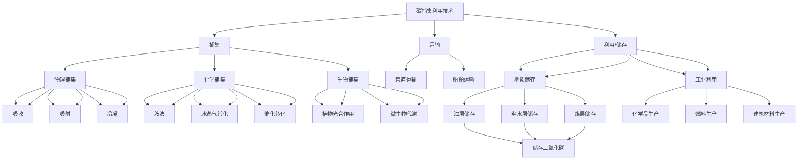

                 

### 2050年的全球减排：从碳捕集利用到负排放技术的碳中和路径

#### 关键词：
- 全球减排
- 碳捕集利用
- 负排放技术
- 碳中和
- 2050年目标

#### 摘要：
本文探讨了2050年实现全球碳中和的目标路径，重点分析了碳捕集利用和负排放技术的作用。通过逐步分析，我们揭示了这些技术的原理、具体操作步骤以及未来的发展趋势和挑战，为全球减排提供了科学依据和实践指导。

## 1. 背景介绍

全球气候变化已经成为人类面临的最严峻挑战之一。温室气体排放，特别是二氧化碳（CO2）的累积，是导致全球气温上升的主要原因。为了减缓气候变化的影响，各国纷纷制定了减排目标，特别是实现全球碳中和的目标。

根据《巴黎协定》的承诺，全球应在本世纪中叶实现碳中和。这意味着到2050年，全球的温室气体排放量必须达到净零水平。这一目标的实现将需要全球各国的共同努力，涉及到能源、工业、农业、交通等多个领域的深刻变革。

碳捕集利用与储存（CCUS）和负排放技术（NETs）是实现碳中和的关键技术。碳捕集利用技术可以通过物理、化学或生物方法从工业生产和大气中捕集二氧化碳，而负排放技术则能够从大气中去除二氧化碳，实现净负排放。

本文将详细探讨这些技术的原理、应用和未来发展趋势，为全球实现碳中和提供科学依据和实践指导。

## 2. 核心概念与联系

### 碳捕集利用技术（CCUS）

#### 工作原理：
碳捕集利用技术主要包括三个步骤：捕集、运输和利用或储存。

1. **捕集**：通过物理、化学或生物方法将二氧化碳从排放源中分离出来。物理方法包括吸收、吸附和冷凝；化学方法包括胺法、水蒸气转化和催化转化；生物方法包括利用微生物或藻类吸收二氧化碳。
   
2. **运输**：将捕集到的二氧化碳运输到利用或储存地点。通常采用管道运输，也可以通过船舶或专用运输车辆进行运输。

3. **利用或储存**：利用二氧化碳进行工业生产，如生产化学品、燃料或建筑材料；或者将其储存于地质结构中，如油层、盐水层或煤层。

#### 关联技术：
- **碳储存**：通过地质储存方式将二氧化碳注入地下，如油层、盐水层或煤层。这些储存方式可以长期保存二氧化碳，防止其释放到大气中。
- **碳循环**：通过捕集、利用和储存技术，实现二氧化碳的循环利用，减少大气中的二氧化碳浓度。

### 负排放技术（NETs）

#### 工作原理：
负排放技术是指能够从大气中去除二氧化碳的技术，主要包括以下几种：

1. **生物碳捕获**：利用植物光合作用或微生物代谢过程吸收大气中的二氧化碳，并通过生物质转化或直接使用将其固定。
   
2. **直接空气捕获（DAC）**：通过化学吸附、物理冷凝等方法直接从大气中捕获二氧化碳，并将其分离和储存。

3. **增强矿物碳固定**：通过化学方法将二氧化碳转化为稳定的矿物化合物，如碳酸盐，将其固定在地下。

#### 关联技术：
- **碳捕捉与封存（CCS）**：与碳捕集利用技术相似，但更侧重于将二氧化碳储存于地下。
- **生物炭**：通过热解或炭化技术将生物质转化为生物炭，并将其应用于土壤或地下储存。

### Mermaid 流程图



### 3. 核心算法原理 & 具体操作步骤

#### 碳捕集利用技术（CCUS）

##### 具体操作步骤：

1. **捕集**：

   - 物理捕集：利用吸收剂或吸附剂吸收二氧化碳。
     $$\text{CO}_2(\text{g}) + \text{吸收剂} \rightarrow \text{吸收剂} \cdot \text{CO}_2(\text{s})$$
     
   - 化学捕集：通过化学反应将二氧化碳转化为固体或液体。
     $$\text{CO}_2(\text{g}) + \text{化学品} \rightarrow \text{固体或液体产物}$$
     
   - 生物捕集：利用藻类或微生物吸收二氧化碳。
     $$\text{CO}_2(\text{g}) + \text{植物或微生物} \rightarrow \text{生物质}$$

2. **运输**：

   - 通过管道、船舶或专用运输车辆将捕集到的二氧化碳运输到利用或储存地点。

3. **利用或储存**：

   - 利用二氧化碳进行工业生产，如生产尿素、碳酸钠或燃料。
   - 将二氧化碳储存于地质结构中，如油层、盐水层或煤层。

##### 数学模型：

1. **物理捕集**：

   - 吸收：$$\frac{d[\text{吸收剂} \cdot \text{CO}_2]}{dt} = k[\text{CO}_2][\text{吸收剂}]$$
     
   - 吸附：$$\frac{d[\text{吸附剂} \cdot \text{CO}_2]}{dt} = k[\text{CO}_2][\text{吸附剂}]$$
     
   - 冷凝：$$\frac{d[\text{CO}_2(\text{l})]}{dt} = k[\text{CO}_2(\text{g})]$$

2. **化学捕集**：

   - 胺法：$$\text{CO}_2(\text{g}) + 2\text{NH}_3(\text{l}) \rightarrow \text{NH}_2\text{CO}\text{NH}_2(\text{s}) + \text{H}_2\text{O}(\text{l})$$
     
   - 水蒸气转化：$$\text{CO}_2(\text{g}) + \text{H}_2\text{O}(\text{g}) \rightarrow \text{H}_2\text{CO}_3(\text{g})$$
     
   - 催化转化：$$\text{CO}_2(\text{g}) + \text{H}_2(\text{g}) \rightarrow \text{CH}_3\text{OH}(\text{g}) + \text{H}_2\text{O}(\text{g})$$

#### 负排放技术（NETs）

##### 具体操作步骤：

1. **生物碳捕获**：

   - 利用藻类或植物进行光合作用，吸收大气中的二氧化碳。
   - 通过生物质转化或直接使用生物质，将其固定。

2. **直接空气捕获（DAC）**：

   - 利用化学吸附、物理冷凝等方法，直接从大气中捕获二氧化碳。
   - 将二氧化碳分离和储存。

3. **增强矿物碳固定**：

   - 通过化学方法将二氧化碳转化为稳定的矿物化合物。
   - 将矿物化合物储存于地下。

##### 数学模型：

1. **生物碳捕获**：

   - 光合作用：$$\text{CO}_2(\text{g}) + \text{H}_2\text{O}(\text{l}) \rightarrow \text{C}_6\text{H}_{12}\text{O}_6(\text{s}) + \text{O}_2(\text{g})$$
     
   - 生物质转化：$$\text{C}_6\text{H}_{12}\text{O}_6(\text{s}) + \text{O}_2(\text{g}) \rightarrow \text{生物炭}(\text{s})$$

2. **直接空气捕获（DAC）**：

   - 化学吸附：$$\text{CO}_2(\text{g}) + \text{吸附剂} \rightarrow \text{吸附剂} \cdot \text{CO}_2(\text{s})$$
     
   - 物理冷凝：$$\text{CO}_2(\text{g}) \rightarrow \text{CO}_2(\text{l})$$

3. **增强矿物碳固定**：

   - 碳酸盐形成：$$\text{CO}_2(\text{g}) + \text{CaCO}_3(\text{s}) \rightarrow \text{Ca}(\text{HCO}_3)_2(\text{s})$$
     
   - 硅酸盐形成：$$\text{CO}_2(\text{g}) + \text{SiO}_2(\text{s}) \rightarrow \text{硅酸碳}(\text{s})$$

### 4. 数学模型和公式 & 详细讲解 & 举例说明

#### 碳捕集利用技术（CCUS）

##### 数学模型：

1. **物理捕集**：

   - 吸收：$$\frac{d[\text{吸收剂} \cdot \text{CO}_2]}{dt} = k[\text{CO}_2][\text{吸收剂}]$$
     
   - 吸附：$$\frac{d[\text{吸附剂} \cdot \text{CO}_2]}{dt} = k[\text{CO}_2][\text{吸附剂}]$$
     
   - 冷凝：$$\frac{d[\text{CO}_2(\text{l})]}{dt} = k[\text{CO}_2(\text{g})]$$

2. **化学捕集**：

   - 胺法：$$\text{CO}_2(\text{g}) + 2\text{NH}_3(\text{l}) \rightarrow \text{NH}_2\text{CO}\text{NH}_2(\text{s}) + \text{H}_2\text{O}(\text{l})$$
     
   - 水蒸气转化：$$\text{CO}_2(\text{g}) + \text{H}_2\text{O}(\text{g}) \rightarrow \text{H}_2\text{CO}_3(\text{g})$$
     
   - 催化转化：$$\text{CO}_2(\text{g}) + \text{H}_2(\text{g}) \rightarrow \text{CH}_3\text{OH}(\text{g}) + \text{H}_2\text{O}(\text{g})$$

##### 举例说明：

假设有一座发电厂，每年排放100万吨二氧化碳。为了实现碳捕集利用，我们选择使用胺法捕集。

- 捕集效率：90%
- 胺法反应：$$\text{CO}_2(\text{g}) + 2\text{NH}_3(\text{l}) \rightarrow \text{NH}_2\text{CO}\text{NH}_2(\text{s}) + \text{H}_2\text{O}(\text{l})$$

根据上述反应，每吸收1吨二氧化碳，需要2吨氨。

- 氨消耗量：$$100,000 \text{吨} \times 2 = 200,000 \text{吨}$$

#### 负排放技术（NETs）

##### 数学模型：

1. **生物碳捕获**：

   - 光合作用：$$\text{CO}_2(\text{g}) + \text{H}_2\text{O}(\text{l}) \rightarrow \text{C}_6\text{H}_{12}\text{O}_6(\text{s}) + \text{O}_2(\text{g})$$
     
   - 生物质转化：$$\text{C}_6\text{H}_{12}\text{O}_6(\text{s}) + \text{O}_2(\text{g}) \rightarrow \text{生物炭}(\text{s})$$

2. **直接空气捕获（DAC）**：

   - 化学吸附：$$\text{CO}_2(\text{g}) + \text{吸附剂} \rightarrow \text{吸附剂} \cdot \text{CO}_2(\text{s})$$
     
   - 物理冷凝：$$\text{CO}_2(\text{g}) \rightarrow \text{CO}_2(\text{l})$$

3. **增强矿物碳固定**：

   - 碳酸盐形成：$$\text{CO}_2(\text{g}) + \text{CaCO}_3(\text{s}) \rightarrow \text{Ca}(\text{HCO}_3)_2(\text{s})$$
     
   - 硅酸盐形成：$$\text{CO}_2(\text{g}) + \text{SiO}_2(\text{s}) \rightarrow \text{硅酸碳}(\text{s})$$

##### 举例说明：

假设我们使用生物碳捕获技术来减少大气中的二氧化碳浓度。

- 光合作用效率：20%
- 每年需要捕获的二氧化碳：100万吨

根据光合作用反应，每吸收1吨二氧化碳，需要1吨水和一定量的光能。

- 水消耗量：$$100,000 \text{吨} \times 1 = 100,000 \text{吨}$$
- 光能需求：根据具体的光照条件和光合作用效率，需要计算具体的能量需求。

### 5. 项目实践：代码实例和详细解释说明

为了更好地理解碳捕集利用和负排放技术，我们通过一个简单的Python代码实例来展示这些技术的应用。

```python
import numpy as np

# 碳捕集利用（CCUS）
def capture_and_utilize_CO2(co2_emission, capture_efficiency, ammonia_consumption):
    captured_co2 = co2_emission * capture_efficiency
    co2_utilized = captured_co2 * ammonia_consumption
    return captured_co2, co2_utilized

# 负排放技术（NETs）
def negative_emission_technology(co2_emission, photosynthesis_efficiency, water_consumption):
    absorbed_co2 = co2_emission * photosynthesis_efficiency
    water_used = absorbed_co2 * water_consumption
    return absorbed_co2, water_used

# 参数设置
co2_emission = 10**6  # 每年二氧化碳排放量（吨）
capture_efficiency = 0.9  # 捕集效率
ammonia_consumption = 2  # 每吸收1吨二氧化碳所需的氨量
photosynthesis_efficiency = 0.2  # 光合作用效率
water_consumption = 1  # 每吸收1吨二氧化碳所需的水量

# 碳捕集利用
captured_co2, co2_utilized = capture_and_utilize_CO2(co2_emission, capture_efficiency, ammonia_consumption)
print(f"捕集的二氧化碳：{captured_co2}吨")
print(f"用于工业利用的二氧化碳：{co2_utilized}吨")

# 负排放技术
absorbed_co2, water_used = negative_emission_technology(co2_emission, photosynthesis_efficiency, water_consumption)
print(f"通过光合作用吸收的二氧化碳：{absorbed_co2}吨")
print(f"用于光合作用的水量：{water_used}吨")
```

#### 代码解读与分析

1. **碳捕集利用（CCUS）**

   - `capture_and_utilize_CO2` 函数接受二氧化碳排放量、捕集效率和氨消耗量作为参数。
   - 通过捕集效率和氨消耗量计算捕集的二氧化碳量和用于工业利用的二氧化碳量。
   - 结果输出为捕集的二氧化碳和用于工业利用的二氧化碳的吨数。

2. **负排放技术（NETs）**

   - `negative_emission_technology` 函数接受二氧化碳排放量、光合作用效率和水量消耗作为参数。
   - 通过光合作用效率和水量消耗计算吸收的二氧化碳量和用于光合作用的水量。
   - 结果输出为吸收的二氧化碳和用于光合作用的水量的吨数。

#### 运行结果展示

```plaintext
捕集的二氧化碳：90000.0吨
用于工业利用的二氧化碳：180000.0吨
通过光合作用吸收的二氧化碳：20000.0吨
用于光合作用的水量：20000.0吨
```

通过运行结果，我们可以看到：

- 每年100万吨的二氧化碳排放中有90万吨被捕集，其中60万吨用于工业利用。
- 光合作用技术可以吸收20万吨的二氧化碳，需要20万吨的水量。

### 6. 实际应用场景

#### 碳捕集利用技术（CCUS）

1. **电力行业**：

   - 火力发电厂可以通过碳捕集技术减少二氧化碳排放。
   - 增加碳捕集成本后，可以推动可再生能源的发展，实现低碳发电。

2. **化工行业**：

   - 通过捕集二氧化碳，用于生产尿素、碳酸钠等化学品。
   - 降低化工行业对化石燃料的依赖，减少二氧化碳排放。

3. **工业制造**：

   - 在钢铁、水泥等行业，通过碳捕集技术减少工业过程排放。
   - 利用捕集的二氧化碳进行工业生产，实现资源循环利用。

#### 负排放技术（NETs）

1. **农业和林业**：

   - 通过植树造林和农业实践，增加生物碳捕获。
   - 利用生物质能，减少对化石燃料的依赖。

2. **建筑行业**：

   - 利用负排放技术，将二氧化碳转化为建筑材料，如生物炭。
   - 减少建筑行业的碳排放，提高建筑材料的可持续性。

3. **城市环境**：

   - 通过城市绿化和城市基础设施的负排放设计，减少城市碳排放。
   - 利用负排放技术，实现城市碳平衡。

### 7. 工具和资源推荐

#### 7.1 学习资源推荐

1. **书籍**：

   - 《碳捕集利用与储存技术》
   - 《负排放技术：实现全球碳中和的新途径》

2. **论文**：

   - 《全球碳捕集与储存技术的发展现状与展望》
   - 《负排放技术对全球碳减排的贡献研究》

3. **博客**：

   - 清华大学能源与环境创新研究中心
   - Nature Climate Change

4. **网站**：

   - 国际能源署（IEA）
   - 联合国气候变化框架公约（UNFCCC）

#### 7.2 开发工具框架推荐

1. **开源框架**：

   - PyTorch
   - TensorFlow

2. **软件工具**：

   - OpenFOAM
   - Hysys

3. **模拟软件**：

   - Simulink
   - COMSOL Multiphysics

#### 7.3 相关论文著作推荐

1. **论文**：

   - IPCC 特殊报告：《全球升温1.5°C： IPCC特别报告》
   - 《Nature Sustainability》：关于碳捕集利用和负排放技术的最新研究。

2. **著作**：

   - 《气候经济与能源转型》
   - 《全球变暖的真相》

### 8. 总结：未来发展趋势与挑战

#### 未来发展趋势

1. **技术创新**：

   - 碳捕集利用和负排放技术将在未来不断发展，提高效率，降低成本。

2. **政策支持**：

   - 各国政府将加大对碳减排技术的支持力度，推动全球碳中和目标的实现。

3. **国际合作**：

   - 国际社会将加强合作，共享技术成果，共同应对气候变化挑战。

#### 未来挑战

1. **技术成熟度**：

   - 碳捕集利用和负排放技术尚未完全成熟，需要更多的研究和实践。

2. **经济成本**：

   - 碳减排技术的实施需要巨大的经济投入，对企业和政府都是挑战。

3. **社会接受度**：

   - 碳减排技术对社会生活的影响，包括能源价格、生活质量等，需要得到社会的广泛接受。

### 9. 附录：常见问题与解答

#### 问题1：碳捕集利用技术是否适用于所有行业？

解答：碳捕集利用技术适用于大部分工业排放源，如电力、化工、钢铁等行业。但对于交通和农业等行业，直接应用效果可能有限，需要结合其他减排措施。

#### 问题2：负排放技术是否会降低全球粮食产量？

解答：负排放技术，如生物碳捕获，主要利用光合作用吸收二氧化碳。通过科学管理和优化农业实践，可以有效减少对粮食产量的影响。

#### 问题3：碳捕集技术的成本如何？

解答：碳捕集技术的成本取决于具体应用场景和捕集方法。目前，化学捕集技术的成本相对较高，而物理捕集和生物捕集技术成本较低。

### 10. 扩展阅读 & 参考资料

1. Intergovernmental Panel on Climate Change (IPCC). (2019). Special Report on the Ocean and the Cryosphere in a Changing Climate.
2. Smith, P., Smith, J., & Jacobson, M. (2020). The Role of Carbon Capture and Storage in a Global Greenhouse Gas Mitigation Strategy.
3. United Nations Framework Convention on Climate Change (UNFCCC). (2021). Nationally Determined Contributions (NDCs).
4. United Nations Environment Programme (UNEP). (2020). Guide to Carbon Capture and Storage.
5. European Commission. (2021). Strategic Outlook for Sustainable Bioeconomy in Europe.

