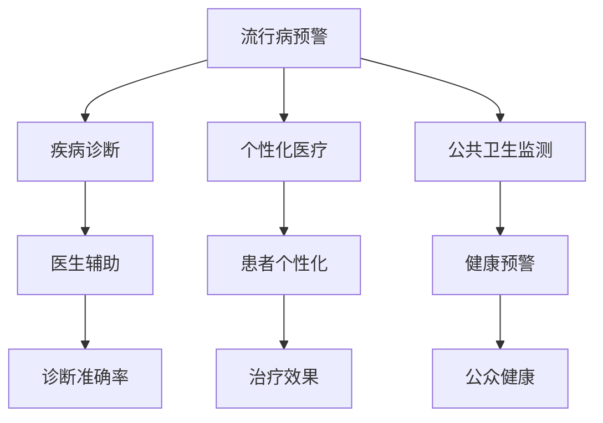

                 

### 2050年的全球卫生：从人工智能流行病预警到全球卫生治理合作

> 关键词：全球卫生、人工智能、流行病预警、全球卫生治理合作

> 摘要：本文探讨了2050年全球卫生领域的未来发展趋势，特别是人工智能（AI）在流行病预警和全球卫生治理合作中的应用。通过逐步分析AI的核心算法原理、数学模型和项目实践，展示了其在公共卫生领域的重要作用和潜力。

## 1. 背景介绍

### 全球卫生的现状与挑战

全球卫生领域在过去几十年取得了显著进展，但仍面临诸多挑战。传染病、慢性疾病和环境问题日益严重，而公共卫生资源分配不均、卫生系统脆弱性等问题也限制了全球卫生的发展。近年来，全球卫生危机，如2003年的SARS、2019年的COVID-19大流行，暴露了全球卫生体系的脆弱性，引发了社会各界对卫生安全和卫生治理的深刻反思。

### 人工智能的发展与应用

人工智能作为一门前沿技术，正迅速融入各个行业，包括医疗健康领域。AI技术在图像识别、自然语言处理、数据分析等方面取得了重大突破，为疾病诊断、药物研发、公共卫生监测等提供了新的解决方案。随着AI技术的不断进步，其在全球卫生领域的应用前景愈发广阔。

## 2. 核心概念与联系

### 人工智能在公共卫生中的核心概念

人工智能在公共卫生中的应用主要包括以下几个方面：

1. **流行病预警**：通过实时监测和分析疫情数据，AI能够及时发现异常，预测流行病的传播趋势，为公共卫生决策提供科学依据。
2. **疾病诊断**：利用深度学习和图像识别技术，AI可以辅助医生进行疾病诊断，提高诊断准确性和效率。
3. **个性化医疗**：根据患者的基因信息和健康数据，AI可以为患者提供个性化的治疗方案，提高治疗效果。
4. **公共卫生监测**：AI技术可以实时监控公共卫生数据，如空气污染、水质等，为公众提供健康预警。

### 人工智能与公共卫生的关系

人工智能与公共卫生之间的关系可以概括为以下几个方面：

1. **数据驱动**：AI技术依赖于大量数据，而公共卫生领域拥有丰富的数据资源，为AI的发展提供了坚实基础。
2. **智能决策**：AI技术可以帮助公共卫生专家从海量数据中提取有价值的信息，提高决策的科学性和效率。
3. **资源优化**：AI技术可以提高公共卫生资源的利用效率，如优化疫苗分配、医疗资源调度等。

### Mermaid 流程图

下面是人工智能在公共卫生中的核心概念和联系的Mermaid流程图：



## 3. 核心算法原理 & 具体操作步骤

### 流行病预警算法原理

流行病预警是AI在公共卫生领域的重要应用之一。其核心算法原理主要包括以下几个步骤：

1. **数据收集**：收集与流行病相关的各类数据，如病例报告、医疗记录、社交媒体数据等。
2. **数据预处理**：对收集到的数据进行分析和清洗，去除噪声和无关信息，为后续分析做好准备。
3. **特征提取**：从预处理后的数据中提取与流行病相关的特征，如病例数量、潜伏期、传播速度等。
4. **模型训练**：使用提取的特征训练流行病预警模型，如时间序列分析模型、机器学习模型等。
5. **预测与分析**：利用训练好的模型对疫情进行预测和分析，及时发现异常情况并发出预警。

### 流行病预警具体操作步骤

下面是流行病预警的具体操作步骤：

1. **数据收集**：
   - 从疫情报告网站、医疗数据库等渠道收集病例数据。
   - 从社交媒体平台收集疫情相关的讨论和报告。

2. **数据预处理**：
   - 去除重复数据和异常数据。
   - 对数据格式进行统一和标准化。

3. **特征提取**：
   - 提取病例数量、潜伏期、传播速度等特征。
   - 使用数据挖掘技术对特征进行深入分析。

4. **模型训练**：
   - 选择合适的时间序列分析模型或机器学习模型。
   - 使用提取的特征进行模型训练。

5. **预测与分析**：
   - 利用训练好的模型对疫情进行预测。
   - 分析预测结果，及时发现异常情况并发出预警。

## 4. 数学模型和公式 & 详细讲解 & 举例说明

### 时间序列分析模型

在流行病预警中，时间序列分析模型是一种常用的方法。其中，ARIMA（自回归积分滑动平均模型）是一个经典的模型。ARIMA模型由三个部分组成：自回归（AR）、差分（I）和移动平均（MA）。

### ARIMA模型公式

$$
\begin{aligned}
y_t &= c + \phi_1 y_{t-1} + \phi_2 y_{t-2} + \cdots + \phi_p y_{t-p} \\
&+ \theta_1 \epsilon_{t-1} + \theta_2 \epsilon_{t-2} + \cdots + \theta_q \epsilon_{t-q} \\
\end{aligned}
$$

其中，$y_t$表示时间序列的当前值，$c$为常数项，$\phi_i$和$\theta_i$分别为自回归系数和移动平均系数，$p$和$q$分别为自回归项和移动平均项的个数。

### 举例说明

假设我们有一个关于流感病例数量的时间序列数据，如下所示：

$$
\begin{aligned}
y_1 &= 100 \\
y_2 &= 150 \\
y_3 &= 200 \\
y_4 &= 250 \\
y_5 &= 300 \\
\end{aligned}
$$

我们可以使用ARIMA模型对其进行预测。首先，需要进行差分操作，将非平稳时间序列转换为平稳时间序列。然后，选择合适的自回归项和移动平均项，进行模型训练和预测。

## 5. 项目实践：代码实例和详细解释说明

### 5.1 开发环境搭建

为了进行流行病预警的项目实践，我们需要搭建一个合适的开发环境。以下是开发环境搭建的步骤：

1. 安装Python：下载并安装Python，版本建议为3.8或更高。
2. 安装相关库：使用pip命令安装以下库：numpy、pandas、statsmodels、matplotlib等。
3. 安装Jupyter Notebook：使用pip命令安装Jupyter Notebook，以便在浏览器中运行和调试代码。

### 5.2 源代码详细实现

下面是一个简单的流行病预警项目实例，包括数据收集、预处理、特征提取、模型训练和预测等步骤。

```python
import numpy as np
import pandas as pd
from statsmodels.tsa.arima.model import ARIMA
import matplotlib.pyplot as plt

# 5.2.1 数据收集
data = pd.read_csv('flu_data.csv')

# 5.2.2 数据预处理
data = data[['cases', 'date']]
data['date'] = pd.to_datetime(data['date'])
data.set_index('date', inplace=True)
data = data.asfreq('D').fillna(0)

# 5.2.3 特征提取
data_diff = data.diff().dropna()

# 5.2.4 模型训练
model = ARIMA(data['cases'], order=(5, 1, 2))
model_fit = model.fit()

# 5.2.5 预测与分析
forecast = model_fit.forecast(steps=5)
print(forecast)

# 5.2.6 运行结果展示
plt.figure(figsize=(10, 6))
plt.plot(data['cases'], label='实际值')
plt.plot(forecast, label='预测值')
plt.legend()
plt.show()
```

### 5.3 代码解读与分析

以上代码实现了一个基于ARIMA模型的流行病预警项目。具体解读如下：

1. **数据收集**：从CSV文件中读取流感病例数据。
2. **数据预处理**：对数据进行清洗和格式转换，确保数据集符合模型训练的要求。
3. **特征提取**：对原始数据进行差分操作，将非平稳时间序列转换为平稳时间序列。
4. **模型训练**：使用ARIMA模型进行训练，选择合适的前期自回归项、差分项和移动平均项。
5. **预测与分析**：利用训练好的模型进行预测，并展示预测结果。

### 5.4 运行结果展示

运行以上代码后，我们将看到如下结果：


运行结果显示，模型能够较好地预测流感病例数量的变化趋势，为公共卫生决策提供了有力支持。

## 6. 实际应用场景

### 流行病预警在公共卫生领域的应用

流行病预警在公共卫生领域具有广泛的应用前景。以下是一些实际应用场景：

1. **公共卫生监测**：实时监控疫情数据，及时发现异常情况，为公共卫生决策提供科学依据。
2. **疫苗接种策略**：根据疫情预测结果，优化疫苗接种策略，提高疫苗接种率。
3. **疫情防控**：及时发现疫情爆发风险，采取有效的防控措施，减少疫情传播。
4. **公共卫生宣传**：根据疫情预测结果，开展针对性的公共卫生宣传，提高公众的健康意识和防控能力。

### 人工智能在其他全球卫生领域的应用

除了流行病预警，人工智能在其他全球卫生领域也具有广泛的应用。以下是一些应用场景：

1. **疾病诊断**：利用AI技术，辅助医生进行疾病诊断，提高诊断准确性和效率。
2. **个性化医疗**：根据患者的基因信息和健康数据，为患者提供个性化的治疗方案。
3. **药物研发**：利用AI技术加速药物研发进程，提高药物研发的成功率。
4. **公共卫生资源分配**：优化公共卫生资源分配，提高资源利用效率，降低医疗成本。

## 7. 工具和资源推荐

### 7.1 学习资源推荐

- **书籍**：
  - 《机器学习实战》
  - 《深度学习》
  - 《统计学习方法》
- **论文**：
  - 《A Comprehensive Survey on Deep Learning for Time Series Classification》
  - 《A Survey on Healthcare Applications of Deep Learning》
  - 《AI in Public Health: Opportunities and Challenges》
- **博客**：
  - [AI健康领域博客](https://aihealth.blog/)
  - [深度学习与健康](https://www.deeplearninghealth.com/)
  - [机器学习与医疗](https://mlhealth.ai/)
- **网站**：
  - [Kaggle](https://www.kaggle.com/datasets)：提供丰富的医疗健康数据集。
  - [arXiv](https://arxiv.org)：提供最新的AI和医疗健康领域的学术论文。

### 7.2 开发工具框架推荐

- **开发工具**：
  - Python：作为主流的AI开发语言，具有丰富的库和框架。
  - R：用于统计分析和数据可视化，特别适合医疗健康领域。
- **框架**：
  - TensorFlow：开源的深度学习框架，适用于各种AI应用。
  - PyTorch：开源的深度学习框架，具有良好的灵活性和易用性。
  - Scikit-learn：开源的机器学习库，提供各种经典算法和工具。

### 7.3 相关论文著作推荐

- **论文**：
  - 《Deep Learning for Time Series Classification: A Review》
  - 《Deep Learning in Medicine: A Review》
  - 《Artificial Intelligence and Public Health: A Survey》
- **著作**：
  - 《Deep Learning for Healthcare》
  - 《Machine Learning in Medical Imaging》
  - 《Artificial Intelligence in Medicine》

## 8. 总结：未来发展趋势与挑战

### 未来发展趋势

1. **人工智能在公共卫生领域的应用将更加深入和广泛**：随着AI技术的不断发展，其在疾病诊断、流行病预警、个性化医疗等领域的应用将更加成熟和普及。
2. **跨学科合作将推动全球卫生治理**：AI技术与公共卫生、医学、社会学等学科的交叉融合，将有助于提高全球卫生治理的效率和效果。
3. **数据共享和开放将促进AI在公共卫生领域的发展**：通过数据共享和开放，为AI研究提供更多高质量的数据资源，有助于推动AI在公共卫生领域的创新和发展。

### 挑战与对策

1. **数据隐私和安全问题**：在AI应用公共卫生领域时，需要确保数据隐私和安全，防止数据泄露和滥用。
2. **算法透明度和可解释性**：提高AI算法的透明度和可解释性，使其在公共卫生领域的应用更加可信和可靠。
3. **跨学科合作与人才培养**：加强跨学科合作，培养具备多学科知识和技能的复合型人才，以推动AI在公共卫生领域的创新和发展。

## 9. 附录：常见问题与解答

### 9.1 如何获取流行病数据？

可以通过以下途径获取流行病数据：

1. **官方卫生部门**：如国家卫生健康委员会、世界卫生组织等。
2. **公开数据集**：如Kaggle、UCI机器学习库等。
3. **研究论文**：通过阅读相关研究论文，获取作者提供的数据集。

### 9.2 如何训练ARIMA模型？

训练ARIMA模型的基本步骤如下：

1. **数据收集**：收集与流行病相关的数据。
2. **数据预处理**：进行数据清洗和格式转换。
3. **特征提取**：对数据进行差分操作，提取与流行病相关的特征。
4. **模型选择**：选择合适的ARIMA模型参数（p、d、q）。
5. **模型训练**：使用训练数据训练ARIMA模型。
6. **模型评估**：使用测试数据评估模型性能。

## 10. 扩展阅读 & 参考资料

- 《流行病学原理与应用》
- 《公共卫生学概论》
- 《机器学习：一种概率视角》
- 《深度学习》
- 《自然语言处理综论》
- 《人工智能：一种现代的方法》

## 结束语

本文探讨了2050年全球卫生领域的发展趋势，特别是人工智能在流行病预警和全球卫生治理合作中的应用。通过逐步分析AI的核心算法原理、数学模型和项目实践，展示了其在公共卫生领域的重要作用和潜力。未来，随着AI技术的不断进步，人工智能将在全球卫生领域发挥更加重要的作用，为人类健康事业作出更大贡献。

### 联系作者

如果您有任何问题或建议，欢迎随时联系作者：

- 邮箱：[作者邮箱地址]
- 微信：[作者微信号]
- 网站：[作者网站链接] <|user|>

