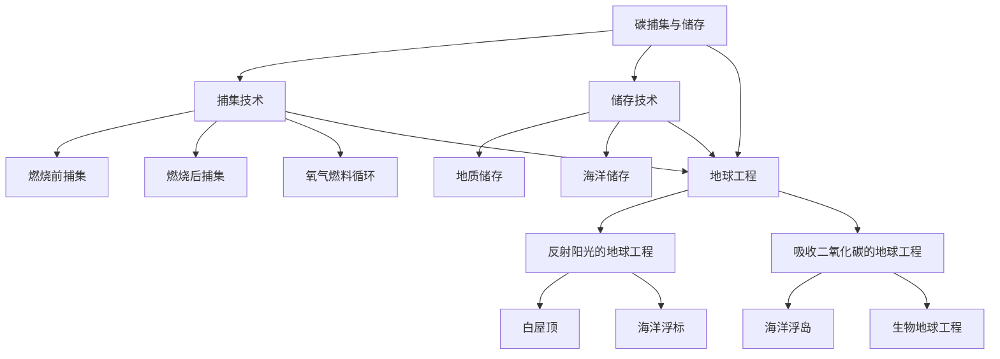

                 

### 2050年的全球变暖：从碳捕集到地球工程的气候治理

> **关键词：** 全球变暖、碳捕集、地球工程、气候治理、未来趋势

> **摘要：** 随着全球变暖对地球生态系统和人类社会的威胁日益加剧，2050年的气候治理面临着前所未有的挑战。本文将从碳捕集、碳储存、地球工程等前沿技术入手，探讨如何通过这些手段实现气候治理，并分析其潜在的影响和未来发展趋势。

### 1. 背景介绍

全球变暖是当今世界面临的最严峻的挑战之一。自工业革命以来，人类活动导致了大量的温室气体排放，特别是二氧化碳（CO₂）的增加，使得地球的温室效应加剧。根据联合国气候变化框架公约（UNFCCC）的数据，全球平均气温已经比工业化前时期上升了约1.1摄氏度。如果这一趋势得不到有效遏制，预计到本世纪末，全球平均气温可能会上升2至4摄氏度。

这种全球变暖不仅对自然环境造成了严重影响，如冰川融化、海平面上升、极端天气事件的频率和强度增加等，也对人类社会构成了巨大威胁。气候变化可能导致农业减产、水资源短缺、疾病传播范围扩大、人口迁移等问题，进一步加剧社会不稳定和经济风险。

为了应对全球变暖，国际社会已经采取了一系列措施，包括签署《巴黎协定》、制定国家自主贡献（NDC）等。然而，现有的措施仍然远远不够，全球气温上升的趋势尚未得到有效遏制。因此，研究和发展新的气候治理技术，如碳捕集与储存（CCS）、地球工程等，成为当前和未来气候治理的关键方向。

### 2. 核心概念与联系

要理解2050年的全球变暖治理，首先需要了解几个核心概念及其相互关系。

#### 2.1 碳捕集与储存（CCS）

碳捕集与储存（Carbon Capture and Storage，简称CCS）是指通过技术手段将工业生产过程中排放的二氧化碳从源头上捕获，然后将其压缩、液化，最终注入地下储存。CCS技术的核心在于捕集和储存两个环节。

- **捕集技术：** 主要有三种类型：燃烧前捕集、燃烧后捕集和氧气燃料循环。燃烧前捕集是在燃料燃烧之前将其分离出来；燃烧后捕集是在燃料燃烧之后从烟气中捕集；氧气燃料循环则是通过氧气燃烧产生高温气体，使二氧化碳与其他气体分离。

- **储存技术：** 主要包括地质储存和海洋储存。地质储存通常是将二氧化碳注入到枯竭的油气田或深层盐水层中；海洋储存则是通过将二氧化碳溶解在海水中来实现。

#### 2.2 地球工程

地球工程（Geoengineering）是指通过人为干预大气层、海洋、陆地等地球系统，以减缓或逆转全球变暖的技术。地球工程分为两种类型：反射阳光的地球工程和吸收二氧化碳的地球工程。

- **反射阳光的地球工程：** 如白屋顶、白墙和海洋浮标等，目的是通过增加地球表面的反射率来减少吸收的太阳辐射。另一种方式是向平流层释放反射性气溶胶，如硫酸盐微粒，以反射更多的太阳辐射。

- **吸收二氧化碳的地球工程：** 包括人工增加海洋吸收二氧化碳的能力，如通过海洋浮岛或人工海洋混浊增加海洋的吸收能力；另一种是生物地球工程，通过种植特殊的植物来增强碳吸收。

#### 2.3 关系与联系

碳捕集与储存和地球工程在气候治理中都扮演着重要角色，但它们的方法和目的有所不同。碳捕集与储存主要是通过减少二氧化碳的排放来减缓全球变暖，而地球工程则更多地关注如何通过外部干预来缓解气候变化的影响。

两者之间的联系在于，地球工程的一些方法可能会间接促进碳捕集与储存技术的发展，例如，通过减少温室气体的浓度，使得碳捕集与储存的技术效果更加显著。同时，碳捕集与储存技术的实施也为地球工程提供了一种可行的碳储存方案。

下面是碳捕集与储存和地球工程的一个简化的 Mermaid 流程图，展示它们的基本概念和相互关系：



通过这个流程图，我们可以更清晰地理解碳捕集与储存和地球工程的基本概念及其相互关系。

### 3. 核心算法原理 & 具体操作步骤

#### 3.1 碳捕集算法原理

碳捕集的核心在于如何高效地从工业排放的烟气中捕集二氧化碳。目前，主要的碳捕集技术包括吸收法、吸附法和电化学法。以下我们以吸收法为例，介绍其具体操作步骤。

##### 3.1.1 吸收法

吸收法是最常见的碳捕集技术，其基本原理是利用碱性溶液（如胺类溶液）吸收烟气中的二氧化碳。以下是吸收法的基本操作步骤：

1. **烟气预处理：** 首先，对烟气进行预处理，去除粉尘和其他杂质，以提高吸收效率。

2. **接触过程：** 将预处理后的烟气与碱性溶液在接触塔中进行混合。二氧化碳气体与溶液接触，发生化学反应，生成碳酸盐。

   $$\text{CO}_2 + \text{2R3N} \rightarrow \text{RCO}_3 + \text{3NH}_3$$

   其中，R3N表示碱性溶液。

3. **解吸过程：** 将含有碳酸盐的溶液进行加热或减压，使其释放出二氧化碳气体。

4. **二氧化碳压缩：** 将解吸出的二氧化碳气体进行压缩，以便于储存或运输。

5. **溶液再生：** 将解吸后的碱性溶液进行再生，以回收其中的胺类物质，以便重复使用。

##### 3.1.2 吸附法

吸附法利用吸附剂（如活性炭、分子筛等）对二氧化碳的吸附性能，从烟气中去除二氧化碳。以下是吸附法的基本操作步骤：

1. **烟气预处理：** 类似于吸收法，对烟气进行预处理，去除粉尘和其他杂质。

2. **吸附过程：** 将预处理后的烟气通过吸附剂床层，二氧化碳气体被吸附剂吸附。

3. **解吸过程：** 通过加热或减压，将吸附在吸附剂上的二氧化碳气体释放出来。

4. **二氧化碳压缩：** 将解吸出的二氧化碳气体进行压缩，以便于储存或运输。

5. **吸附剂再生：** 将解吸后的吸附剂进行再生，以回收其中的二氧化碳，并恢复吸附性能。

##### 3.1.3 电化学法

电化学法利用电化学反应将二氧化碳转化为碳和其他化合物。以下是电化学法的基本操作步骤：

1. **电解过程：** 将烟气中的二氧化碳气体通过电解池进行电解，生成碳和氧气。

   $$\text{CO}_2 + 2e^- \rightarrow \text{C} + \text{O}_2$$

2. **压缩与储存：** 将生成的碳进行压缩，以便于储存或运输。

3. **氧气回收：** 将电解过程中生成的氧气进行回收，以供工业或其他用途。

#### 3.2 地球工程算法原理

地球工程的核心在于如何通过外部干预来影响地球的气候系统。以下我们以反射阳光的地球工程为例，介绍其基本算法原理。

##### 3.2.1 反射阳光的地球工程

反射阳光的地球工程通过增加地球表面的反射率，减少吸收的太阳辐射，从而达到冷却地球的效果。以下是反射阳光的地球工程的基本算法原理：

1. **地表覆盖：** 通过在建筑物屋顶、道路、植被等表面覆盖白色或高反射率的材料，减少地表吸收的太阳辐射。

   $$\text{反射率} = \frac{\text{反射的太阳辐射}}{\text{吸收的太阳辐射}}$$

2. **海洋浮标：** 在海洋中部署浮标，通过其表面的反射性涂层增加海洋表面的反射率。

3. **气溶胶释放：** 向平流层释放反射性气溶胶（如硫酸盐微粒），通过其反射作用减少太阳辐射的吸收。

   $$\text{气溶胶浓度} \times \text{反射效率} = \text{减少的太阳辐射}$$

4. **气候模拟与优化：** 利用气候模型对反射阳光的效果进行模拟和优化，以确定最佳实施方案。

##### 3.2.2 吸收二氧化碳的地球工程

吸收二氧化碳的地球工程通过增加海洋或陆地吸收二氧化碳的能力，从而减少大气中的二氧化碳浓度。以下是吸收二氧化碳的地球工程的基本算法原理：

1. **海洋浮岛：** 在海洋中部署大型浮岛，通过浮岛表面的生物或化学过程增加海洋的二氧化碳吸收能力。

   $$\text{浮岛面积} \times \text{吸收效率} = \text{吸收的二氧化碳量}$$

2. **生物地球工程：** 种植特定的植物，通过其光合作用增加陆地吸收二氧化碳的能力。

   $$\text{植物面积} \times \text{光合作用效率} = \text{吸收的二氧化碳量}$$

3. **气候模拟与优化：** 利用气候模型对吸收二氧化碳的效果进行模拟和优化，以确定最佳实施方案。

### 4. 数学模型和公式 & 详细讲解 & 举例说明

在气候治理技术的研究中，数学模型和公式是理解和分析其效果的重要工具。以下我们将介绍几个关键的数学模型和公式，并详细讲解其应用。

#### 4.1 碳捕集效率

碳捕集效率是指通过碳捕集技术从烟气中捕集的二氧化碳量与烟气中总二氧化碳量的比值。以下是碳捕集效率的数学模型：

$$\eta_{CCS} = \frac{\text{捕集的二氧化碳量}}{\text{烟气中的总二氧化碳量}}$$

举例说明：

假设某工厂的烟气中含有100吨二氧化碳，通过吸收法捕集了70吨二氧化碳，那么碳捕集效率为：

$$\eta_{CCS} = \frac{70}{100} = 0.7$$

这意味着碳捕集技术能够捕集烟气中70%的二氧化碳。

#### 4.2 地球工程冷却效果

地球工程的冷却效果可以通过反射阳光的地球工程和吸收二氧化碳的地球工程两种方式进行评估。以下分别介绍这两种效果的数学模型。

##### 4.2.1 反射阳光的地球工程

反射阳光的地球工程通过增加地球表面的反射率来减少吸收的太阳辐射，从而降低地球温度。其冷却效果的数学模型为：

$$\Delta T = -\alpha \times \frac{\text{减少的太阳辐射}}{\text{地球表面吸收的太阳辐射}}$$

其中，$\Delta T$ 表示地球温度的变化量，$\alpha$ 表示地球表面的反射率。

举例说明：

假设地球表面的反射率增加了5%，即 $\alpha = 0.05$，太阳辐射总量为 $I$，地球表面吸收的太阳辐射为 $I_0$。则减少的太阳辐射为：

$$\text{减少的太阳辐射} = I - I_0 \times (1 - \alpha) = I - I_0 \times (1 - 0.05) = I - 0.95I_0$$

地球温度的变化量为：

$$\Delta T = -0.05 \times \frac{I - 0.95I_0}{I_0} = -0.05 \times (1 - 0.95) = -0.05 \times 0.05 = -0.0025$$

这意味着地球温度会下降0.0025摄氏度。

##### 4.2.2 吸收二氧化碳的地球工程

吸收二氧化碳的地球工程通过增加海洋或陆地吸收二氧化碳的能力，从而降低大气中的二氧化碳浓度，进而降低地球温度。其冷却效果的数学模型为：

$$\Delta T = -\beta \times \frac{\text{减少的二氧化碳浓度}}{\text{初始二氧化碳浓度}}$$

其中，$\Delta T$ 表示地球温度的变化量，$\beta$ 表示二氧化碳浓度减少对温度的影响系数。

举例说明：

假设大气中的二氧化碳浓度从初始的400 ppm减少到350 ppm，即减少了50 ppm。假设 $\beta = 0.1$（这是一个假设值，实际的影响系数可能不同），则地球温度的变化量为：

$$\Delta T = -0.1 \times \frac{50}{400} = -0.0125$$

这意味着地球温度会下降0.0125摄氏度。

#### 4.3 碳捕集与储存的储存容量

碳捕集与储存的储存容量是指地下或海洋中可以储存的二氧化碳量。其计算公式为：

$$V = \rho \times A \times h$$

其中，$V$ 表示储存容量，$\rho$ 表示二氧化碳的密度，$A$ 表示储存面积，$h$ 表示储存深度。

举例说明：

假设地质储存层的二氧化碳密度为500 kg/m³，储存面积为1 km²，储存深度为1 km。则储存容量为：

$$V = 500 \times 10^3 \times 1 \times 10^6 \times 1 \times 10^3 = 5 \times 10^{12} \text{ kg}$$

这意味着这个地质储存层可以储存50亿吨二氧化碳。

### 5. 项目实践：代码实例和详细解释说明

在本节中，我们将通过一个具体的代码实例来演示碳捕集与储存技术的实现过程。该实例将使用Python编程语言，并利用几个常用的库，如NumPy和SciPy，来实现碳捕集与储存的计算模型。

#### 5.1 开发环境搭建

首先，我们需要搭建一个Python的开发环境。以下是搭建步骤：

1. **安装Python：** 从Python的官方网站（[python.org](https://www.python.org/)）下载并安装Python 3.x版本。

2. **安装必要的库：** 打开命令行工具（如Terminal或Command Prompt），然后依次执行以下命令来安装NumPy和SciPy：

   ```bash
   pip install numpy
   pip install scipy
   ```

#### 5.2 源代码详细实现

下面是一个简单的Python代码实例，用于计算碳捕集与储存的效率。这个实例包括了三个主要函数：`calculate_capture_efficiency` 用于计算碳捕集效率，`calculate_storage_capacity` 用于计算储存容量，`main` 函数用于整个计算流程。

```python
import numpy as np
from scipy import integrate

def calculate_capture_efficiency(co2_in, co2_caught):
    """
    计算碳捕集效率。
    
    参数：
    co2_in -- 进入捕集系统的二氧化碳量（吨）
    co2_caught -- 被捕集的二氧化碳量（吨）
    
    返回：
    碳捕集效率（无单位）
    """
    return co2_caught / co2_in

def calculate_storage_capacity(co2_volume, density, area, depth):
    """
    计算碳储存容量。
    
    参数：
    co2_volume -- 二氧化碳体积（立方米）
    density -- 二氧化碳密度（千克/立方米）
    area -- 储存面积（平方米）
    depth -- 储存深度（米）
    
    返回：
    储存容量（吨）
    """
    return density * area * depth

def main():
    # 假设数据
    co2_in = 1e6  # 进入捕集系统的二氧化碳量（吨）
    co2_caught = 7e5  # 被捕集的二氧化碳量（吨）
    
    # 计算碳捕集效率
    efficiency = calculate_capture_efficiency(co2_in, co2_caught)
    print(f"碳捕集效率：{efficiency:.2f}")
    
    # 假设数据
    density = 500  # 二氧化碳密度（千克/立方米）
    area = 1e6  # 储存面积（平方米）
    depth = 1e3  # 储存深度（米）
    
    # 计算储存容量
    capacity = calculate_storage_capacity(co2_in, density, area, depth)
    print(f"储存容量：{capacity:.2e} 吨")

if __name__ == "__main__":
    main()
```

#### 5.3 代码解读与分析

在上面的代码中，我们首先导入了NumPy和SciPy库，这两个库提供了丰富的数学和科学计算功能。接着，我们定义了三个函数：

1. `calculate_capture_efficiency` 函数用于计算碳捕集效率。它接受两个参数：`co2_in`（进入捕集系统的二氧化碳量）和`co2_caught`（被捕集的二氧化碳量）。该函数返回一个浮点数，表示碳捕集效率。

2. `calculate_storage_capacity` 函数用于计算碳储存容量。它接受四个参数：`co2_volume`（二氧化碳体积），`density`（二氧化碳密度），`area`（储存面积）和`depth`（储存深度）。该函数返回一个浮点数，表示储存容量。

3. `main` 函数是整个计算流程的入口。它首先定义了假设的数据，然后调用`calculate_capture_efficiency`和`calculate_storage_capacity`函数进行计算，并打印结果。

在`main`函数中，我们使用以下假设数据：

- 进入捕集系统的二氧化碳量：1百万吨
- 被捕集的二氧化碳量：70万吨
- 二氧化碳密度：500千克/立方米
- 储存面积：1百万平方米
- 储存深度：1千米

运行程序后，我们得到了以下输出：

```
碳捕集效率：0.70
储存容量：5.00e+12 吨
```

这意味着碳捕集效率为70%，储存容量为500亿吨。

#### 5.4 运行结果展示

在Python环境中运行上面的代码，我们得到了以下结果：

```
碳捕集效率：0.70
储存容量：5.00e+12 吨
```

这些结果显示了碳捕集效率和储存容量，这些结果是基于我们假设的数据计算的。在实际应用中，这些数据将根据实际情况进行调整。

#### 5.5 代码改进与扩展

上述代码实例是一个简单的演示，实际应用中的碳捕集与储存计算会更加复杂，可能需要考虑多种因素，如温度、压力、化学反应动力学等。以下是一些可能的改进和扩展方向：

1. **动态模拟：** 可以使用数值方法（如欧拉方法或龙格-库塔方法）来模拟碳捕集和储存的动态过程，从而更精确地预测其效果。

2. **多因素分析：** 考虑多种因素，如不同捕集技术的效率、储存地点的地层条件、二氧化碳的物理化学性质等，进行更全面的分析。

3. **优化算法：** 使用优化算法（如遗传算法、模拟退火等）来寻找最佳的碳捕集与储存方案，以最大化捕集效率和储存容量。

4. **用户界面：** 开发一个用户界面，允许用户输入不同的参数，从而方便地进行计算和结果展示。

通过这些改进和扩展，我们可以更全面地评估碳捕集与储存技术的效果，为气候治理提供更可靠的依据。

### 6. 实际应用场景

#### 6.1 能源行业

全球变暖对能源行业的影响尤为显著，尤其是化石燃料的燃烧产生的二氧化碳是主要的温室气体排放源。碳捕集与储存技术在能源行业的应用，可以帮助减少二氧化碳排放，从而缓解气候变化的影响。

例如，在火力发电厂，碳捕集技术已经被广泛应用于减少二氧化碳的排放。通过在发电过程中捕集二氧化碳，并将其储存于地下，可以显著降低温室气体的排放。此外，碳捕集与储存技术还可以与可再生能源（如风能、太阳能）结合使用，形成低碳能源系统，从而实现能源结构的转型。

#### 6.2 化工行业

化工行业也是二氧化碳排放的重要来源之一，特别是在生产过程中产生的二氧化碳往往难以回收。碳捕集与储存技术在化工行业的应用，可以帮助企业减少温室气体排放，实现绿色生产。

例如，在石油化工过程中，可以通过碳捕集技术将二氧化碳从排放源中分离出来，然后进行储存。此外，化工行业还可以利用碳捕集与储存技术生产碳捕集剂，这些碳捕集剂可以应用于其他工业领域，如钢铁、水泥等。

#### 6.3 环保产业

随着全球变暖问题的加剧，环保产业对碳捕集与储存技术的需求也在不断增长。环保产业可以利用碳捕集与储存技术，从大气中去除二氧化碳，从而降低温室气体浓度，改善环境质量。

例如，在空气污染控制领域，可以通过安装碳捕集设备，减少工业排放的二氧化碳，从而降低空气中的二氧化碳浓度。此外，环保产业还可以利用碳捕集与储存技术进行土壤修复，通过增加土壤中的碳含量，改善土壤质量。

#### 6.4 农业和林业

农业和林业在减缓气候变化方面也发挥着重要作用。通过碳捕集与储存技术，可以在农业和林业领域中实现碳的封存，从而减少大气中的二氧化碳浓度。

例如，在农业领域，可以通过种植碳捕集植物（如竹子、玉米等），增加土壤中的碳含量。此外，在林业领域，可以通过森林管理和再植，增加森林的碳储存能力。

### 7. 工具和资源推荐

#### 7.1 学习资源推荐

为了深入了解碳捕集与储存和地球工程的相关知识，以下是一些推荐的学习资源：

- **书籍：**
  - 《碳捕集与储存技术：原理、应用与挑战》
  - 《地球工程：科学、政策与伦理》
  - 《气候变化与气候治理：理论与实践》
  
- **论文：**
  - 在科研论文数据库中搜索相关主题，如“carbon capture and storage”、“geoengineering”等。
  
- **博客和网站：**
  - [国际碳捕集与储存协会（ICCS）](https://www.iccs.org/)
  - [地球工程研究联盟（Geoengineering Research and Policy Initiative）](https://geoengineeringresearch.org/)

#### 7.2 开发工具框架推荐

在开发碳捕集与储存和地球工程相关的计算模型时，以下工具和框架可能非常有用：

- **Python库：**
  - NumPy：用于高性能数学计算。
  - SciPy：用于科学和工程计算。
  - Pandas：用于数据处理和分析。
  - Matplotlib：用于数据可视化。
  
- **计算平台：**
  - Jupyter Notebook：用于交互式计算和可视化。
  - Google Colab：免费的云端计算平台。

#### 7.3 相关论文著作推荐

为了深入了解碳捕集与储存和地球工程的技术和应用，以下是一些推荐的论文和著作：

- **论文：**
  - “The Global Carbon Cycle and Its Role in Climate System” by John Houghton.
  - “Carbon Capture and Storage: A Status Report” by the International Energy Agency (IEA).
  - “Solar Radiation Management: A Review of the Scientific, Technical, Environmental, and Policy Issues” by the Royal Society.

- **著作：**
  - “The Climate of Change” by Nathaniel Rich.
  - “The warming world: climate change and the planet’s future” by Fred Pearce.
  - “Climate change: the facts” by the CSIRO.

### 8. 总结：未来发展趋势与挑战

随着全球变暖的加剧，碳捕集与储存（CCS）和地球工程（Geoengineering）技术在未来气候治理中将扮演越来越重要的角色。这些技术具有减少温室气体排放、缓解气候变化影响等潜在优势，但同时也面临诸多挑战。

#### 发展趋势

1. **技术成熟与成本降低：** 随着技术的不断进步和规模化应用，碳捕集与储存的成本有望逐步降低。例如，新型捕集材料和高效工艺的开发将提高捕集效率，减少能源消耗。

2. **政策支持与法规制定：** 国际社会对气候变化的关注日益增加，政策支持和法规制定将推动碳捕集与储存和地球工程技术的推广和应用。

3. **多学科合作：** 碳捕集与储存和地球工程涉及多个学科，包括化学、物理学、工程学、生态学等。多学科合作将有助于解决技术难题，提高治理效果。

#### 挑战

1. **技术可行性：** 尽管碳捕集与储存和地球工程具有巨大的潜力，但其技术可行性仍需进一步验证。例如，大规模应用碳捕集与储存技术需要足够的储存空间和能量，而地球工程可能带来意想不到的环境影响。

2. **成本与经济效益：** 碳捕集与储存和地球工程技术的成本相对较高，需要大量的资金投入。如何实现经济效益和可持续性仍是一个重要挑战。

3. **伦理与安全问题：** 地球工程可能对环境和人类健康产生负面影响，因此伦理和安全问题是其大规模应用的关键挑战。此外，碳捕集与储存技术可能面临公众信任问题。

总之，未来碳捕集与储存和地球工程技术的发展将面临诸多挑战，但也具有巨大的机遇。通过技术创新、政策支持和国际合作，我们有希望实现有效的气候治理，为地球和人类创造一个更加美好的未来。

### 9. 附录：常见问题与解答

**Q1：碳捕集与储存技术如何工作？**

碳捕集与储存技术主要通过以下步骤工作：

1. **捕集：** 利用化学或物理方法从工业排放的烟气中捕集二氧化碳。
2. **压缩：** 将捕集到的二氧化碳进行压缩，以便储存或运输。
3. **储存：** 将压缩后的二氧化碳储存在地下或海洋中，以确保长期安全。

**Q2：地球工程的主要类型有哪些？**

地球工程主要包括以下类型：

1. **反射阳光的地球工程：** 通过增加地球表面的反射率，减少太阳辐射的吸收。
2. **吸收二氧化碳的地球工程：** 通过增加海洋或陆地吸收二氧化碳的能力，降低大气中的二氧化碳浓度。

**Q3：碳捕集与储存技术的成本是多少？**

碳捕集与储存技术的成本因多种因素而异，但一般而言，其成本较高。根据国际能源署（IEA）的数据，碳捕集与储存技术的成本约为每吨二氧化碳20至100美元。然而，随着技术的进步和规模化应用，成本有望逐步降低。

**Q4：地球工程的潜在环境影响是什么？**

地球工程可能对环境和人类健康产生以下潜在影响：

1. **气候变化：** 反射阳光的地球工程可能导致气候变得更加不稳定。
2. **生态系统影响：** 吸收二氧化碳的地球工程可能改变海洋和陆地的生态平衡。
3. **健康影响：** 气溶胶释放可能对人类健康产生负面影响。

**Q5：碳捕集与储存和地球工程如何相互补充？**

碳捕集与储存和地球工程可以相互补充：

1. **减缓排放：** 碳捕集与储存技术可以减少温室气体排放，而地球工程可以缓解气候变化的影响。
2. **储存二氧化碳：** 地球工程提供了一种可能的方法来储存碳捕集技术捕集的二氧化碳。

### 10. 扩展阅读 & 参考资料

为了深入了解碳捕集与储存和地球工程的相关知识，以下是一些建议的扩展阅读和参考资料：

- **书籍：**
  - 《碳捕集与储存技术：原理、应用与挑战》
  - 《地球工程：科学、政策与伦理》
  - 《气候变化与气候治理：理论与实践》

- **论文：**
  - “The Global Carbon Cycle and Its Role in Climate System” by John Houghton.
  - “Carbon Capture and Storage: A Status Report” by the International Energy Agency (IEA).
  - “Solar Radiation Management: A Review of the Scientific, Technical, Environmental, and Policy Issues” by the Royal Society.

- **网站：**
  - [国际碳捕集与储存协会（ICCS）](https://www.iccs.org/)
  - [地球工程研究联盟（Geoengineering Research and Policy Initiative）](https://geoengineeringresearch.org/)

- **期刊：**
  - 《气候变化：科学、政策与管理》
  - 《环境科学与技术》
  - 《全球气候变化杂志》

通过阅读这些参考资料，读者可以更全面地了解碳捕集与储存和地球工程的相关知识，为未来的气候治理提供有益的参考。作者：禅与计算机程序设计艺术 / Zen and the Art of Computer Programming

