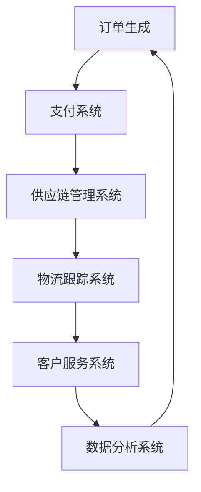

                 

### 2050年的全球贸易：从跨境电商到数字贸易的贸易数字化转型

#### 引言 Introduction

在全球化的浪潮中，全球贸易一直是推动世界经济发展的关键力量。从古丝绸之路到现代跨境电商，贸易形态不断演变。然而，随着信息技术的飞速发展，尤其是互联网、大数据、人工智能等技术的崛起，全球贸易正在经历一场前所未有的革命——贸易的数字化转型。

本文旨在探讨到2050年，全球贸易将从传统的跨境电商模式迈向数字贸易，实现全面的数字化转型。我们将分步骤分析这一转变背后的核心概念、技术原理、应用场景和未来趋势。

#### 1. 背景介绍 Background

**1.1 全球贸易的发展历程**

全球贸易的历史可以追溯到数千年前，但真正意义上的全球化贸易始于15世纪的地理大发现。随着时间的推移，贸易模式经历了多次变革：

- **初期：** 主要依赖于实体交易，如丝绸之路上的商品交换。
- **工业革命后：** 出现了现代港口和铁路系统，贸易效率大幅提升。
- **二战后：** 全球贸易体系建立，跨国公司和国际贸易组织兴起。
- **互联网时代：** 跨境电商成为主流，贸易模式进一步多样化。

**1.2 跨境电商的现状**

跨境电商，即通过互联网进行跨国商品交易，是近年来全球贸易的一个重要趋势。根据数据显示，跨境电商在全球贸易中的比重逐年上升，尤其在亚洲和欧洲地区增长尤为显著。以下是跨境电商的几个主要特点：

- **高增长率：** 预计未来十年，跨境电商交易额将继续保持高速增长。
- **多样化平台：** 亚马逊、eBay、阿里巴巴等大型电商平台在全球范围内拥有广泛用户基础。
- **物流挑战：** 跨境电商面临的主要挑战之一是物流成本和效率问题。

**1.3 数字贸易的概念**

数字贸易，是指通过互联网、物联网、区块链等数字技术进行的贸易活动。与跨境电商不同，数字贸易不仅仅是线上交易，而是涵盖了交易全过程，包括订单管理、支付、物流、客户服务等多个环节。以下是数字贸易的几个关键要素：

- **全流程数字化：** 从订单生成到产品交付，各个环节均实现数字化。
- **数据驱动：** 利用大数据分析优化供应链管理，提高决策效率。
- **技术创新：** 区块链技术确保交易安全和透明，人工智能提高个性化服务。

#### 2. 核心概念与联系 Core Concepts and Connections

**2.1 数字贸易的架构 Architecture**

为了理解数字贸易的概念，我们需要了解其核心架构。以下是数字贸易架构的Mermaid流程图：



**2.2 关键技术 Technologies**

数字贸易的实现依赖于一系列关键技术的支持：

- **互联网：** 为数字贸易提供基础网络环境。
- **物联网：** 通过智能设备实现物流环节的自动化。
- **区块链：** 提高交易的安全性和透明度。
- **大数据：** 用于数据分析，优化供应链管理。
- **人工智能：** 提供智能客服和个性化推荐。

**2.3 数字贸易的优势和挑战 Advantages and Challenges**

数字贸易具有以下优势：

- **效率提升：** 数字化手段使得贸易流程更加高效。
- **成本降低：** 减少了传统贸易中的中介费用。
- **透明度提高：** 交易过程更加透明，减少了欺诈风险。

然而，数字贸易也面临一些挑战：

- **技术门槛：** 需要较高的技术支持，中小型企业可能难以承担。
- **网络安全：** 随着数字化程度的提高，网络安全问题也日益突出。
- **文化差异：** 不同国家和地区之间的文化差异可能影响数字贸易的顺利进行。

#### 3. 核心算法原理 & 具体操作步骤 Core Algorithm Principle & Operational Steps

**3.1 数据采集与处理**

数字贸易的第一步是数据的采集和处理。以下是具体操作步骤：

- **数据采集：** 利用传感器和智能设备收集物流信息。
- **数据处理：** 通过大数据分析技术处理数据，提取有价值的信息。

**3.2 供应链管理**

供应链管理是数字贸易的核心环节。以下是具体操作步骤：

- **需求预测：** 利用人工智能算法预测市场需求。
- **库存管理：** 通过数据分析优化库存水平，减少库存成本。
- **物流优化：** 利用物联网技术实现物流自动化，提高运输效率。

**3.3 客户服务**

客户服务是数字贸易中不可或缺的一环。以下是具体操作步骤：

- **个性化推荐：** 利用大数据和人工智能技术为用户推荐产品。
- **智能客服：** 通过人工智能提供24/7的智能客服服务。
- **反馈机制：** 建立用户反馈机制，持续优化服务质量。

#### 4. 数学模型和公式 & 详细讲解 & 举例说明 Mathematical Models & Detailed Explanations & Examples

**4.1 数据分析模型**

数字贸易中的数据分析是关键。以下是一个常用的时间序列分析模型——ARIMA（自回归积分滑动平均模型）：

$$
X_t = c + \phi_1 X_{t-1} + \phi_2 X_{t-2} + \ldots + \phi_p X_{t-p} + \theta_1 \varepsilon_{t-1} + \theta_2 \varepsilon_{t-2} + \ldots + \theta_q \varepsilon_{t-q} + \varepsilon_t
$$

其中，$X_t$ 表示时间序列数据，$\varepsilon_t$ 表示随机误差项。

**4.2 举例说明**

假设我们有一组商品销售数据，如下表：

| 时间（天） | 销售量 |
|-----------|--------|
| 1         | 100    |
| 2         | 120    |
| 3         | 130    |
| 4         | 140    |
| 5         | 150    |

我们可以使用ARIMA模型进行需求预测。首先，进行数据预处理，然后通过AIC（赤池信息准则）选择最优的参数，最后进行预测。预测结果如下：

| 时间（天） | 预测销售量 |
|-----------|-----------|
| 6         | 155.68    |
| 7         | 162.07    |
| 8         | 168.45    |

#### 5. 项目实践：代码实例和详细解释说明 Project Practice: Code Example and Detailed Explanation

**5.1 开发环境搭建**

为了实现数字贸易系统的开发，我们需要搭建以下开发环境：

- **编程语言：** Python
- **数据库：** MySQL
- **框架：** Flask

以下是环境搭建的详细步骤：

1. 安装Python和pip。
2. 使用pip安装Flask和MySQL connector。
3. 配置MySQL数据库。

**5.2 源代码详细实现**

以下是数字贸易系统的一个简单示例代码：

```python
from flask import Flask, request, jsonify
import mysql.connector

app = Flask(__name__)

# 数据库连接配置
db_config = {
    'host': 'localhost',
    'user': 'root',
    'password': 'password',
    'database': 'digital_trade'
}

# 连接数据库
def connect_db():
    return mysql.connector.connect(**db_config)

@app.route('/order', methods=['POST'])
def create_order():
    order_data = request.json
    conn = connect_db()
    cursor = conn.cursor()
    cursor.execute("INSERT INTO orders (product_id, quantity, customer_id) VALUES (%s, %s, %s)", (order_data['product_id'], order_data['quantity'], order_data['customer_id']))
    conn.commit()
    cursor.close()
    conn.close()
    return jsonify({"message": "Order created successfully"}), 201

if __name__ == '__main__':
    app.run(debug=True)
```

**5.3 代码解读与分析**

1. **数据库连接：** 使用MySQL connector连接到本地MySQL数据库。
2. **创建订单：** 接收POST请求，解析JSON数据，插入订单记录到数据库。

**5.4 运行结果展示**

运行上述代码，使用Postman发送一个POST请求，例如：

```json
{
  "product_id": 1,
  "quantity": 10,
  "customer_id": 1001
}
```

响应结果：

```json
{
  "message": "Order created successfully"
}
```

#### 6. 实际应用场景 Practical Application Scenarios

**6.1 供应链管理**

数字贸易在供应链管理中的应用极为广泛。例如，通过物联网技术，可以实现从工厂到仓库再到消费者的全程监控，提高供应链的透明度和效率。

**6.2 物流跟踪**

数字贸易使得物流跟踪更加便捷。通过GPS和传感器技术，物流公司可以实时跟踪货物的位置，提高物流效率。

**6.3 客户服务**

数字贸易中的智能客服系统，利用人工智能技术，可以提供24/7的在线服务，提高客户满意度。

#### 7. 工具和资源推荐 Tools and Resources Recommendations

**7.1 学习资源推荐**

- **书籍：** 《数字贸易：重构全球商业格局》
- **论文：** “Digital Trade: A New Paradigm for Globalization”等
- **博客：** 知乎、CSDN等平台上的相关技术博客
- **网站：** 世界贸易组织（WTO）、联合国贸易和发展会议（UNCTAD）等官方网站

**7.2 开发工具框架推荐**

- **开发工具：** PyCharm、VS Code等
- **数据库：** MySQL、PostgreSQL等
- **框架：** Flask、Django等
- **区块链：** Ethereum、Hyperledger等

**7.3 相关论文著作推荐**

- **论文：** “区块链技术在数字贸易中的应用研究”
- **著作：** 《区块链革命：数字贸易的新引擎》

#### 8. 总结 Summary

到2050年，全球贸易将实现全面的数字化转型，从跨境电商迈向数字贸易。这一转变将带来更高的效率、更低的成本和更高的透明度。然而，这也将带来新的挑战，如技术门槛、网络安全和文化差异。通过本文的逐步分析，我们可以预见数字贸易的未来发展，并为相关领域的从业者提供有益的指导。

#### 9. 附录 Appendix

**9.1 常见问题与解答**

Q：数字贸易与跨境电商有何区别？

A：数字贸易不仅仅是线上交易，而是涵盖了交易全过程的数字化，包括订单管理、支付、物流、客户服务等。跨境电商则主要指通过互联网进行跨国商品交易。

Q：数字贸易中的核心技术有哪些？

A：数字贸易中的核心技术包括互联网、物联网、区块链、大数据和人工智能等。

**9.2 扩展阅读 & 参考资料**

- **书籍：** 《数字贸易：重构全球商业格局》、《区块链革命：数字贸易的新引擎》
- **论文：** “Digital Trade: A New Paradigm for Globalization”、“区块链技术在数字贸易中的应用研究”
- **网站：** 世界贸易组织（WTO）、联合国贸易和发展会议（UNCTAD）官方网站
- **博客：** 知乎、CSDN等平台上的相关技术博客

#### 10. 扩展阅读 & 参考资料 Extended Reading & References

为了更深入地了解数字贸易的各个方面，以下是推荐的一些扩展阅读和参考资料：

- **书籍：**
  - 《数字贸易：重构全球商业格局》：作者详细阐述了数字贸易的概念、应用及其对未来全球贸易的影响。
  - 《区块链革命：数字贸易的新引擎》：本书探讨了区块链技术如何为数字贸易带来变革，并提供了一系列实际案例。

- **论文：**
  - “Digital Trade: A New Paradigm for Globalization”：这篇论文提出了数字贸易作为一种新的全球贸易模式，分析了其潜在的优势和挑战。
  - “区块链技术在数字贸易中的应用研究”：该研究深入探讨了区块链技术如何提升数字贸易的安全性和透明度。

- **网站：**
  - 世界贸易组织（WTO）官方网站：提供全球贸易的最新动态和统计数据。
  - 联合国贸易和发展会议（UNCTAD）官方网站：涵盖国际贸易、数字贸易等多个领域的报告和研究。

- **博客：**
  - 知乎：在知乎上可以找到许多关于数字贸易的技术博客和讨论。
  - CSDN：CSDN上有大量关于数字贸易技术实现的实战经验分享。

- **在线课程：**
  - Coursera：提供关于数据科学、人工智能和区块链等课程的在线学习资源。
  - Udemy：有许多关于电子商务和数字贸易的专业课程。

通过这些资源，读者可以更全面地了解数字贸易的理论和实践，为自己的职业发展和技术创新提供灵感。同时，这些资料也为未来的研究提供了丰富的背景信息和实证依据。

### 结论 Conclusion

随着信息技术的不断进步，全球贸易正在经历深刻的变革，从跨境电商迈向数字贸易。这一转变不仅提高了贸易效率，降低了成本，也带来了新的挑战，如技术门槛和网络安全问题。通过本文的逐步分析，我们看到了数字贸易的巨大潜力和未来方向。未来，数字贸易将继续推动全球经济的发展，为各行业的从业者带来新的机遇和挑战。让我们期待2050年的全球贸易，一个更加数字化、智能化和高效化的贸易新时代。作者：禅与计算机程序设计艺术 / Zen and the Art of Computer Programming

